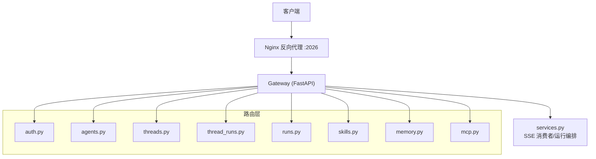
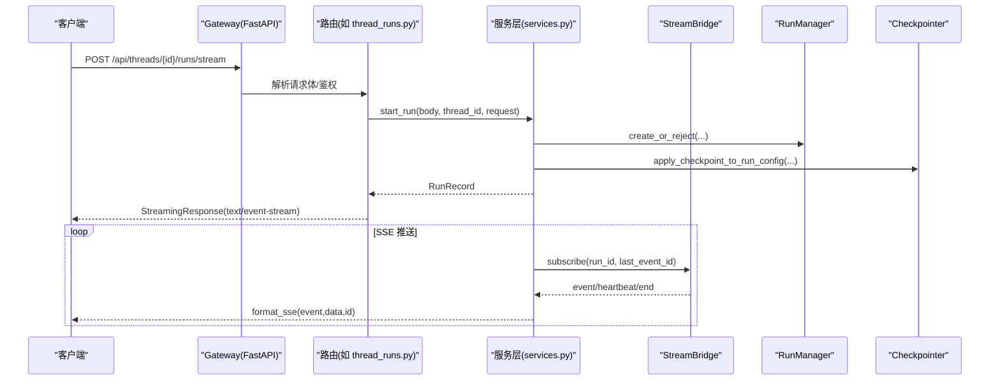
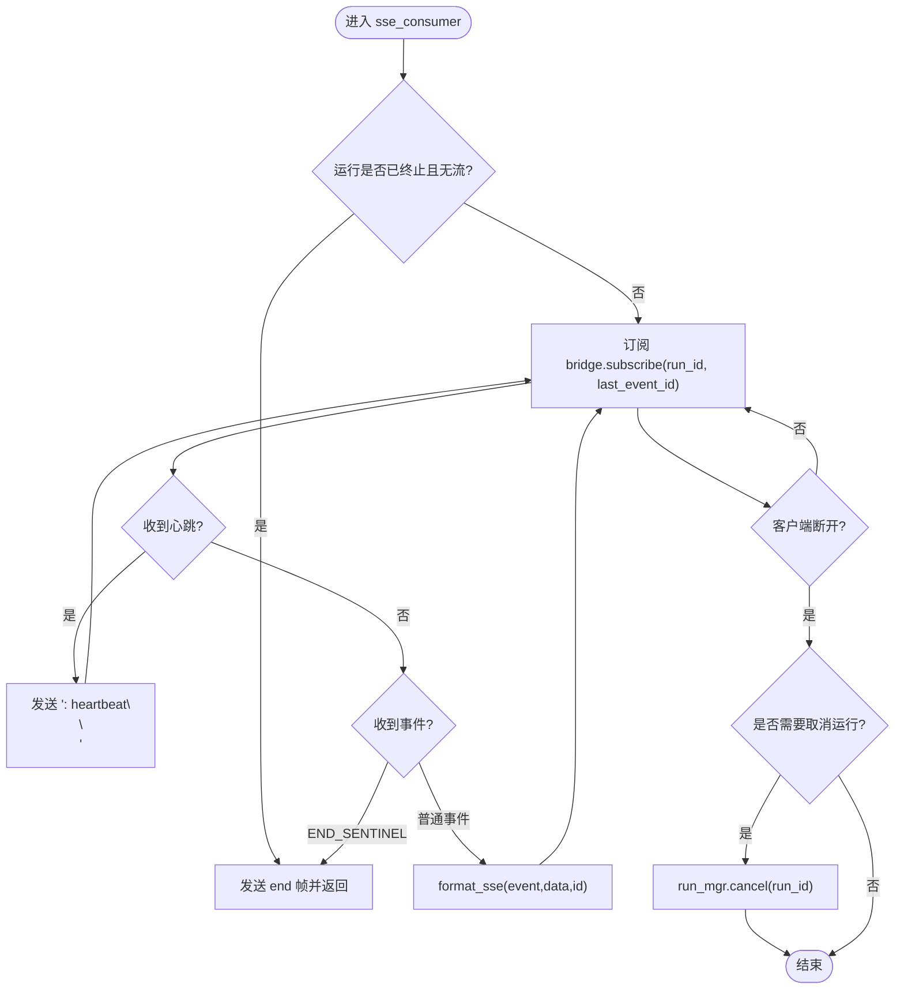
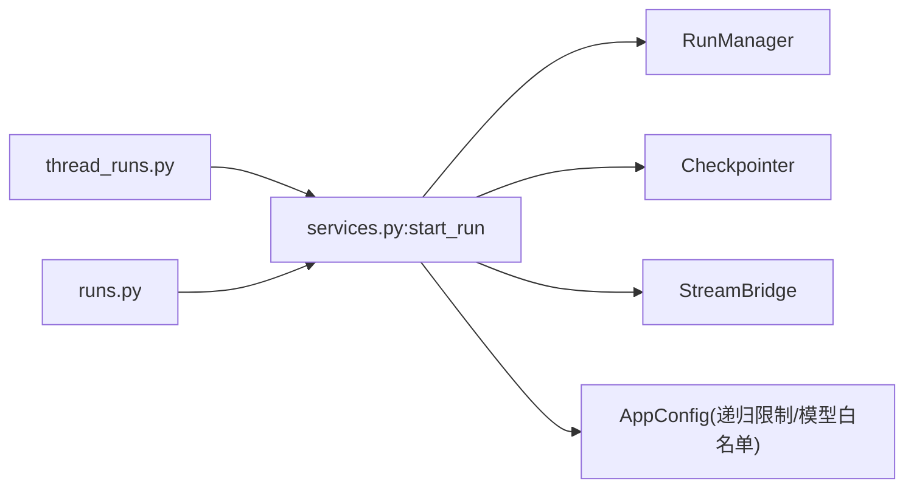

# API 参考文档

<cite>
**本文引用的文件**   
- [backend/docs/API.md](file://backend/docs/API.md)
- [backend/app/gateway/routers/auth.py](file://backend/app/gateway/routers/auth.py)
- [backend/app/gateway/routers/agents.py](file://backend/app/gateway/routers/agents.py)
- [backend/app/gateway/routers/threads.py](file://backend/app/gateway/routers/threads.py)
- [backend/app/gateway/routers/thread_runs.py](file://backend/app/gateway/routers/thread_runs.py)
- [backend/app/gateway/routers/runs.py](file://backend/app/gateway/routers/runs.py)
- [backend/app/gateway/routers/skills.py](file://backend/app/gateway/routers/skills.py)
- [backend/app/gateway/routers/memory.py](file://backend/app/gateway/routers/memory.py)
- [backend/app/gateway/routers/mcp.py](file://backend/app/gateway/routers/mcp.py)
- [backend/app/gateway/services.py](file://backend/app/gateway/services.py)
</cite>

## 目录
1. [简介](#简介)
2. [项目结构](#项目结构)
3. [核心组件](#核心组件)
4. [架构总览](#架构总览)
5. [详细组件分析](#详细组件分析)
6. [依赖关系分析](#依赖关系分析)
7. [性能与扩展性](#性能与扩展性)
8. [故障排查指南](#故障排查指南)
9. [结论](#结论)
10. [附录：认证、授权与安全](#附录认证授权与安全)

## 简介
本参考文档面向 DeerFlow 后端的 RESTful API，覆盖模型管理、线程（会话）管理、运行（任务）管理、技能（Skills）管理、记忆（Memory）管理、MCP 服务器配置等核心接口；同时记录实时通信的 SSE 协议消息格式、事件类型与连接处理机制。文档还包含错误码定义、状态码含义、异常处理策略、认证与授权流程、客户端集成建议与最佳实践。

后端对外暴露两类 API：
- LangGraph 兼容 API：用于 Agent 交互、线程与流式输出（统一网关下映射到 /api/langgraph/*）。
- Gateway API：模型、MCP、技能、上传、工件等能力（/api/*）。

所有 API 通过 Nginx 反向代理在端口 2026 暴露。

章节来源
- [backend/docs/API.md:1-20](file://backend/docs/API.md#L1-L20)

## 项目结构
API 路由按功能域拆分至多个 FastAPI Router 模块，并通过统一网关装配。关键路由文件包括：
- 认证与用户：auth.py
- 自定义 Agent 管理：agents.py
- 线程 CRUD、分支、目标与历史：threads.py
- 线程内运行（runs）：thread_runs.py
- 无状态运行（runs）：runs.py
- 技能（skills）：skills.py
- 记忆（memory）：memory.py
- MCP 配置：mcp.py
- 运行生命周期与 SSE 消费：services.py

图表来源
- [backend/app/gateway/routers/auth.py:1-50](file://backend/app/gateway/routers/auth.py#L1-L50)
- [backend/app/gateway/routers/agents.py:1-30](file://backend/app/gateway/routers/agents.py#L1-L30)
- [backend/app/gateway/routers/threads.py:1-40](file://backend/app/gateway/routers/threads.py#L1-L40)
- [backend/app/gateway/routers/thread_runs.py:1-35](file://backend/app/gateway/routers/thread_runs.py#L1-L35)
- [backend/app/gateway/routers/runs.py:1-25](file://backend/app/gateway/routers/runs.py#L1-L25)
- [backend/app/gateway/routers/skills.py:1-25](file://backend/app/gateway/routers/skills.py#L1-L25)
- [backend/app/gateway/routers/memory.py:1-25](file://backend/app/gateway/routers/memory.py#L1-L25)
- [backend/app/gateway/routers/mcp.py:1-20](file://backend/app/gateway/routers/mcp.py#L1-L20)
- [backend/app/gateway/services.py:1-50](file://backend/app/gateway/services.py#L1-L50)

章节来源
- [backend/app/gateway/routers/auth.py:1-50](file://backend/app/gateway/routers/auth.py#L1-L50)
- [backend/app/gateway/routers/agents.py:1-30](file://backend/app/gateway/routers/agents.py#L1-L30)
- [backend/app/gateway/routers/threads.py:1-40](file://backend/app/gateway/routers/threads.py#L1-L40)
- [backend/app/gateway/routers/thread_runs.py:1-35](file://backend/app/gateway/routers/thread_runs.py#L1-L35)
- [backend/app/gateway/routers/runs.py:1-25](file://backend/app/gateway/routers/runs.py#L1-L25)
- [backend/app/gateway/routers/skills.py:1-25](file://backend/app/gateway/routers/skills.py#L1-L25)
- [backend/app/gateway/routers/memory.py:1-25](file://backend/app/gateway/routers/memory.py#L1-L25)
- [backend/app/gateway/routers/mcp.py:1-20](file://backend/app/gateway/routers/mcp.py#L1-L20)
- [backend/app/gateway/services.py:1-50](file://backend/app/gateway/services.py#L1-L50)

## 核心组件
- 认证与授权：提供本地邮箱/密码登录、注册、初始化管理员、OIDC/SSO 回调、CSRF 保护、基于角色的访问控制与资源级权限校验。
- 线程管理：创建、查询、搜索、更新元数据、删除本地数据、分支、设置/读取目标（goal）、获取状态。
- 运行管理：创建后台运行、SSE 流式输出、等待完成、取消、加入已有运行流、分页消息与事件、工作区变更、令牌用量聚合。
- 技能管理：列出、详情、启用/禁用、安装、编辑、回滚、历史查看。
- 记忆管理：读取、重载、清空、事实增删改、导入导出、配置与状态。
- MCP 配置：读取、更新、重置工具缓存，支持 stdio/sse/http 传输与 OAuth。
- SSE 服务：统一的 SSE 帧格式化、心跳、断线处理、终止态检测与重连支持。

章节来源
- [backend/app/gateway/routers/auth.py:290-420](file://backend/app/gateway/routers/auth.py#L290-L420)
- [backend/app/gateway/routers/threads.py:470-542](file://backend/app/gateway/routers/threads.py#L470-L542)
- [backend/app/gateway/routers/thread_runs.py:415-449](file://backend/app/gateway/routers/thread_runs.py#L415-L449)
- [backend/app/gateway/routers/runs.py:35-58](file://backend/app/gateway/routers/runs.py#L35-L58)
- [backend/app/gateway/routers/skills.py:103-143](file://backend/app/gateway/routers/skills.py#L103-L143)
- [backend/app/gateway/routers/memory.py:148-228](file://backend/app/gateway/routers/memory.py#L148-L228)
- [backend/app/gateway/routers/mcp.py:227-280](file://backend/app/gateway/routers/mcp.py#L227-L280)
- [backend/app/gateway/services.py:64-78](file://backend/app/gateway/services.py#L64-L78)

## 架构总览
下图展示了从客户端到运行执行与 SSE 返回的整体流程，以及各路由与服务之间的协作关系。

图表来源
- [backend/app/gateway/routers/thread_runs.py:423-449](file://backend/app/gateway/routers/thread_runs.py#L423-L449)
- [backend/app/gateway/services.py:514-670](file://backend/app/gateway/services.py#L514-L670)
- [backend/app/gateway/services.py:727-770](file://backend/app/gateway/services.py#L727-L770)

## 详细组件分析

### 认证与授权（/api/v1/auth）
- 本地登录：POST /api/v1/auth/login/local
  - 表单字段：username(email), password
  - 成功：设置 HttpOnly access_token cookie，返回 expires_in 与 needs_setup
  - 失败：401，带结构化错误码
- 注册：POST /api/v1/auth/register
  - 强口令校验，自动登录并设置 cookie
- 初始化管理员：POST /api/v1/auth/initialize
  - 仅当系统未存在管理员时可用
- 登出：POST /api/v1/auth/logout
  - 清除 session cookie
- 修改密码：POST /api/v1/auth/change-password
  - 支持首次引导中更换邮箱，递增 token_version 使旧会话失效
- 当前用户信息：GET /api/v1/auth/me
- 初始化状态：GET /api/v1/auth/setup-status
  - 带 IP 级缓存与并发防护
- OIDC/SSO：
  - GET /api/v1/auth/providers
  - GET /api/v1/auth/oauth/{provider}
  - GET /api/v1/auth/callback/{provider}
  - 支持 PKCE、nonce、state 校验与前端重定向

安全要点
- CSRF 双提交：对受保护的写操作需携带 X-CSRF-Token 头，值为 csrf_token cookie
- 速率限制：登录尝试按 IP 计数，超限返回 429
- 信任代理：AUTH_TRUSTED_PROXIES 允许从 X-Real-IP 提取真实客户端 IP

章节来源
- [backend/app/gateway/routers/auth.py:290-420](file://backend/app/gateway/routers/auth.py#L290-L420)
- [backend/app/gateway/routers/auth.py:430-531](file://backend/app/gateway/routers/auth.py#L430-L531)
- [backend/app/gateway/routers/auth.py:588-800](file://backend/app/gateway/routers/auth.py#L588-L800)

### 自定义 Agent 管理（/api/agents）
- 列表：GET /api/agents
- 检查名称可用性：GET /api/agents/check?name=...
- 获取详情：GET /api/agents/{name}
- 创建：POST /api/agents
- 更新：PUT /api/agents/{name}
- 删除：DELETE /api/agents/{name}
- 用户画像（USER.md）：
  - GET /api/user-profile
  - PUT /api/user-profile

注意
- 需要显式启用 agents_api.enabled=true
- 名称正则校验与大小写归一化
- 删除/更新时对“遗留共享布局”进行友好提示

章节来源
- [backend/app/gateway/routers/agents.py:107-190](file://backend/app/gateway/routers/agents.py#L107-L190)
- [backend/app/gateway/routers/agents.py:192-271](file://backend/app/gateway/routers/agents.py#L192-L271)
- [backend/app/gateway/routers/agents.py:273-368](file://backend/app/gateway/routers/agents.py#L273-L368)
- [backend/app/gateway/routers/agents.py:382-433](file://backend/app/gateway/routers/agents.py#L382-L433)
- [backend/app/gateway/routers/agents.py:435-483](file://backend/app/gateway/routers/agents.py#L435-L483)

### 线程管理（/api/threads）
- 创建：POST /api/threads
  - 幂等：若 thread_id 已存在则返回现有记录
  - 写入空 checkpoint 以便立即查询状态
- 查询：GET /api/threads/{thread_id}
- 搜索：POST /api/threads/search
- 更新元数据：PATCH /api/threads/{thread_id}
- 删除本地数据：DELETE /api/threads/{thread_id}
- 分支：POST /api/threads/{thread_id}/branches
  - 仅可从最新可见轮次或历史定位到的助手消息处分支
  - 工作区文件仅在“最新轮次”分支时尽力复制
- 目标（Goal）：
  - GET /api/threads/{thread_id}/goal
  - PUT /api/threads/{thread_id}/goal
  - DELETE /api/threads/{thread_id}/goal

权限与隔离
- 使用 require_permission 装饰器实现资源级权限与所有者校验
- metadata 中的 server-reserved keys 会被剥离，防止伪造 owner

章节来源
- [backend/app/gateway/routers/threads.py:470-542](file://backend/app/gateway/routers/threads.py#L470-L542)
- [backend/app/gateway/routers/threads.py:544-634](file://backend/app/gateway/routers/threads.py#L544-L634)
- [backend/app/gateway/routers/threads.py:636-700](file://backend/app/gateway/routers/threads.py#L636-L700)
- [backend/app/gateway/routers/threads.py:702-757](file://backend/app/gateway/routers/threads.py#L702-L757)
- [backend/app/gateway/routers/threads.py:759-800](file://backend/app/gateway/routers/threads.py#L759-L800)

### 线程内运行（/api/threads/{thread_id}/runs）
- 创建后台运行：POST /api/threads/{thread_id}/runs
- 流式运行：POST /api/threads/{thread_id}/runs/stream
  - 返回 text/event-stream，含 Content-Location 指向 run 资源
- 等待完成：POST /api/threads/{thread_id}/runs/wait
  - 阻塞直到 END_SENTINEL，返回最终 state 或 {status,error}
- 列举运行：GET /api/threads/{thread_id}/runs
- 获取运行：GET /api/threads/{thread_id}/runs/{run_id}
- 取消运行：POST /api/threads/{thread_id}/runs/{run_id}/cancel
  - action=interrupt|rollback；wait=true 可等待结束
- 加入已有运行流：
  - GET/POST /api/threads/{thread_id}/runs/{run_id}/stream
  - POST 支持先 cancel 再继续推送剩余缓冲事件
- 消息与事件：
  - GET /api/threads/{thread_id}/messages
  - GET /api/threads/{thread_id}/runs/{run_id}/messages
  - GET /api/threads/{thread_id}/runs/{run_id}/events
- 工作区变更：GET /api/threads/{thread_id}/runs/{run_id}/workspace-changes
- 令牌用量：GET /api/threads/{thread_id}/token-usage

SSE 协议
- 帧格式：event/data/id + 空行
- 事件类型：values、messages、end 等（与 LangGraph Platform 一致）
- 心跳：以 ": heartbeat\n\n" 保持长连接活跃
- 断线处理：on_disconnect=cancel 时断开即取消运行

章节来源
- [backend/app/gateway/routers/thread_runs.py:415-449](file://backend/app/gateway/routers/thread_runs.py#L415-L449)
- [backend/app/gateway/routers/thread_runs.py:451-476](file://backend/app/gateway/routers/thread_runs.py#L451-L476)
- [backend/app/gateway/routers/thread_runs.py:500-533](file://backend/app/gateway/routers/thread_runs.py#L500-L533)
- [backend/app/gateway/routers/thread_runs.py:535-608](file://backend/app/gateway/routers/thread_runs.py#L535-L608)
- [backend/app/gateway/routers/thread_runs.py:615-780](file://backend/app/gateway/routers/thread_runs.py#L615-L780)
- [backend/app/gateway/services.py:64-78](file://backend/app/gateway/services.py#L64-L78)
- [backend/app/gateway/services.py:727-770](file://backend/app/gateway/services.py#L727-L770)

### 无状态运行（/api/runs）
- 流式运行：POST /api/runs/stream
  - 若 body.config.configurable.thread_id 为空则自动生成临时 thread_id
- 等待完成：POST /api/runs/wait
- 运行消息：GET /api/runs/{run_id}/messages
- 运行反馈：GET /api/runs/{run_id}/feedback

章节来源
- [backend/app/gateway/routers/runs.py:35-90](file://backend/app/gateway/routers/runs.py#L35-L90)
- [backend/app/gateway/routers/runs.py:106-144](file://backend/app/gateway/routers/runs.py#L106-L144)

### 技能管理（/api/skills）
- 列出全部：GET /api/skills
- 安装：POST /api/skills/install（从线程 user-data 虚拟路径安装 .skill）
- 自定义技能：
  - 列表：GET /api/skills/custom
  - 内容：GET /api/skills/custom/{skill_name}
  - 编辑：PUT /api/skills/custom/{skill_name}
  - 删除：DELETE /api/skills/custom/{skill_name}
  - 历史：GET /api/skills/custom/{skill_name}/history
  - 回滚：POST /api/skills/custom/{skill_name}/rollback
- 单个技能详情：GET /api/skills/{skill_name}
- 启用/禁用：PUT /api/skills/{skill_name}
  - PUBLIC 技能影响全局；CUSTOM/LEGACY 为每用户隔离

章节来源
- [backend/app/gateway/routers/skills.py:103-143](file://backend/app/gateway/routers/skills.py#L103-L143)
- [backend/app/gateway/routers/skills.py:145-182](file://backend/app/gateway/routers/skills.py#L145-L182)
- [backend/app/gateway/routers/skills.py:184-249](file://backend/app/gateway/routers/skills.py#L184-L249)
- [backend/app/gateway/routers/skills.py:251-313](file://backend/app/gateway/routers/skills.py#L251-L313)
- [backend/app/gateway/routers/skills.py:315-429](file://backend/app/gateway/routers/skills.py#L315-L429)

### 记忆管理（/api/memory）
- 读取：GET /api/memory
- 重载：POST /api/memory/reload
- 清空：DELETE /api/memory
- 事实管理：
  - 创建：POST /api/memory/facts
  - 删除：DELETE /api/memory/facts/{fact_id}
  - 部分更新：PATCH /api/memory/facts/{fact_id}
- 导入/导出：
  - 导出：GET /api/memory/export
  - 导入：POST /api/memory/import
- 配置与状态：
  - 配置：GET /api/memory/config
  - 状态：GET /api/memory/status

章节来源
- [backend/app/gateway/routers/memory.py:148-228](file://backend/app/gateway/routers/memory.py#L148-L228)
- [backend/app/gateway/routers/memory.py:230-298](file://backend/app/gateway/routers/memory.py#L230-L298)
- [backend/app/gateway/routers/memory.py:300-412](file://backend/app/gateway/routers/memory.py#L300-L412)

### MCP 服务器配置（/api/mcp）
- 读取配置：GET /api/mcp/config
  - 敏感字段（env/headers/OAuth 密钥）将被掩码
- 更新配置：PUT /api/mcp/config
  - 支持保留掩码值合并与 OAuth 字段 None/"" 语义
  - stdio 命令白名单校验（默认 npx、uvx），可通过环境变量扩展
- 重置工具缓存：POST /api/mcp/cache/reset
  - 进程级重置，下次使用重新加载

章节来源
- [backend/app/gateway/routers/mcp.py:227-280](file://backend/app/gateway/routers/mcp.py#L227-L280)
- [backend/app/gateway/routers/mcp.py:283-386](file://backend/app/gateway/routers/mcp.py#L283-L386)

### SSE 协议与运行编排
- 帧格式：event/data/id + 空行
- 事件类型：values、messages、end 等（LangGraph Platform 兼容）
- 心跳：": heartbeat\n\n"
- 断线处理：on_disconnect=cancel 时断开即取消运行
- 终止态检测：若运行已结束且桥接无流，直接发送 end

图表来源
- [backend/app/gateway/services.py:727-770](file://backend/app/gateway/services.py#L727-L770)
- [backend/app/gateway/services.py:64-78](file://backend/app/gateway/services.py#L64-L78)

## 依赖关系分析
- 路由层薄封装，业务逻辑集中在 services.py 的 start_run、apply_checkpoint_to_run_config、sse_consumer 等函数。
- 权限与上下文注入：
  - require_permission 装饰器负责资源级权限与所有者校验
  - inject_authenticated_user_context 将认证用户信息注入运行上下文
  - merge_run_context_overrides 过滤并合并 context/configurable 键
- 递归深度限制：build_run_config 对 recursion_limit 做上限钳制，避免单运行无限循环导致成本失控。

图表来源
- [backend/app/gateway/routers/thread_runs.py:415-449](file://backend/app/gateway/routers/thread_runs.py#L415-L449)
- [backend/app/gateway/routers/runs.py:35-58](file://backend/app/gateway/routers/runs.py#L35-L58)
- [backend/app/gateway/services.py:335-448](file://backend/app/gateway/services.py#L335-L448)

章节来源
- [backend/app/gateway/services.py:335-448](file://backend/app/gateway/services.py#L335-L448)
- [backend/app/gateway/services.py:514-670](file://backend/app/gateway/services.py#L514-L670)

## 性能与扩展性
- 递归限制：服务端强制钳制 recursion_limit，默认 100，最大可配置（默认 1000），防止单运行无限步骤。
- SSE 心跳：维持长连接活跃，降低中间代理超时风险。
- 分页与游标：消息与事件接口支持 before_seq/after_seq 分页，减少单次负载。
- 令牌用量聚合：按线程维度汇总，便于监控与预算控制。
- 推荐在生产环境于 Nginx 层增加限流与缓存策略。

章节来源
- [backend/app/gateway/services.py:300-333](file://backend/app/gateway/services.py#L300-L333)
- [backend/app/gateway/services.py:727-770](file://backend/app/gateway/services.py#L727-L770)
- [backend/app/gateway/routers/thread_runs.py:615-780](file://backend/app/gateway/routers/thread_runs.py#L615-L780)
- [backend/docs/API.md:597-610](file://backend/docs/API.md#L597-L610)

## 故障排查指南
- 常见 HTTP 状态码
  - 400：请求参数不合法（如输入消息格式错误、checkpoint 校验失败）
  - 401：未认证或凭据无效
  - 403：权限不足（非管理员操作受限接口）
  - 404：资源不存在（线程/运行/事实等）
  - 409：冲突（重复创建、不可取消、分支不可用等）
  - 422：校验失败（如非法 agent 名称）
  - 429：登录频率限制触发
  - 500：服务端内部错误
- 典型问题定位
  - SSE 中断：检查 on_disconnect 行为与代理超时；确认服务端心跳正常
  - 运行无法取消：确认运行状态与 worker 归属（store_only 跨进程运行不可在本机取消）
  - 分支失败：目标消息不在最新可见轮次或历史扫描未命中
  - MCP 配置更新失败：检查 stdio 命令是否在白名单、敏感字段合并规则

章节来源
- [backend/app/gateway/routers/thread_runs.py:500-533](file://backend/app/gateway/routers/thread_runs.py#L500-L533)
- [backend/app/gateway/routers/threads.py:544-634](file://backend/app/gateway/routers/threads.py#L544-L634)
- [backend/app/gateway/routers/mcp.py:115-135](file://backend/app/gateway/routers/mcp.py#L115-L135)
- [backend/app/gateway/routers/auth.py:243-288](file://backend/app/gateway/routers/auth.py#L243-L288)

## 结论
DeerFlow 后端通过清晰的分层与模块化路由，提供了完整的 Agent 运行时能力与丰富的管理接口。SSE 协议与运行编排实现了稳定高效的实时交互；认证与授权体系兼顾易用性与安全性。建议在部署时结合 Nginx 限流与缓存策略，并根据业务场景调整递归限制与流式模式。

## 附录：认证、授权与安全
- 认证方式
  - 本地邮箱/密码：登录后设置 HttpOnly access_token cookie
  - OIDC/SSO：支持 PKCE、nonce、state 校验，回调后签发会话
- 授权机制
  - 基于角色的访问控制（admin/user/internal）
  - 资源级权限：require_permission 配合 owner_check 确保跨用户隔离
- CSRF 保护
  - 写操作需携带 X-CSRF-Token 头，值为 csrf_token cookie
- 安全加固
  - 登录频率限制（按 IP）
  - 信任代理白名单 AUTH_TRUSTED_PROXIES
  - 递归限制钳制、模型白名单校验
  - MCP stdio 命令白名单与敏感字段掩码

章节来源
- [backend/app/gateway/routers/auth.py:290-420](file://backend/app/gateway/routers/auth.py#L290-L420)
- [backend/app/gateway/routers/auth.py:588-800](file://backend/app/gateway/routers/auth.py#L588-L800)
- [backend/app/gateway/services.py:216-260](file://backend/app/gateway/services.py#L216-L260)
- [backend/app/gateway/services.py:300-333](file://backend/app/gateway/services.py#L300-L333)
- [backend/app/gateway/routers/mcp.py:86-113](file://backend/app/gateway/routers/mcp.py#L86-L113)