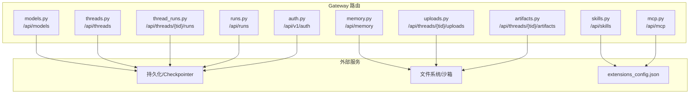
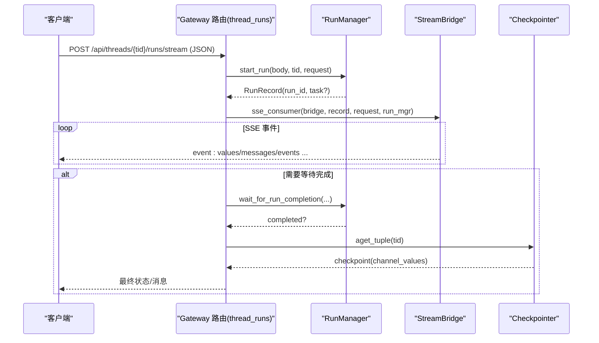

# RESTful API 接口

<cite>
**本文引用的文件**   
- [backend/app/gateway/routers/models.py](file://backend/app/gateway/routers/models.py)
- [backend/app/gateway/routers/threads.py](file://backend/app/gateway/routers/threads.py)
- [backend/app/gateway/routers/runs.py](file://backend/app/gateway/routers/runs.py)
- [backend/app/gateway/routers/thread_runs.py](file://backend/app/gateway/routers/thread_runs.py)
- [backend/app/gateway/routers/skills.py](file://backend/app/gateway/routers/skills.py)
- [backend/app/gateway/routers/memory.py](file://backend/app/gateway/routers/memory.py)
- [backend/app/gateway/routers/mcp.py](file://backend/app/gateway/routers/mcp.py)
- [backend/app/gateway/routers/uploads.py](file://backend/app/gateway/routers/uploads.py)
- [backend/app/gateway/routers/artifacts.py](file://backend/app/gateway/routers/artifacts.py)
- [backend/app/gateway/routers/auth.py](file://backend/app/gateway/routers/auth.py)
- [backend/docs/API.md](file://backend/docs/API.md)
</cite>

## 目录
1. [简介](#简介)
2. [项目结构](#项目结构)
3. [核心组件](#核心组件)
4. [架构总览](#架构总览)
5. [详细组件分析](#详细组件分析)
6. [依赖关系分析](#依赖关系分析)
7. [性能与扩展性](#性能与扩展性)
8. [故障排查指南](#故障排查指南)
9. [结论](#结论)
10. [附录：客户端集成与最佳实践](#附录客户端集成与最佳实践)

## 简介
本文件为 DeerFlow Gateway 的 RESTful API 接口文档，覆盖模型管理、线程管理、运行管理、技能管理、记忆管理、MCP 服务器配置等关键接口。文档包含认证与权限控制、数据校验规则、错误处理机制、分页/过滤/排序参数说明，并提供请求响应示例与客户端集成建议。

## 项目结构
DeerFlow 后端通过 FastAPI 提供两类 API：
- LangGraph 兼容 API（统一网关路径映射到 /api/langgraph/*）
- Gateway API（/api/*），包括模型、MCP、技能、上传、工件、线程、运行、记忆等



图表来源
- [backend/app/gateway/routers/models.py:1-133](file://backend/app/gateway/routers/models.py#L1-L133)
- [backend/app/gateway/routers/threads.py:1-800](file://backend/app/gateway/routers/threads.py#L1-L800)
- [backend/app/gateway/routers/runs.py:1-144](file://backend/app/gateway/routers/runs.py#L1-L144)
- [backend/app/gateway/routers/thread_runs.py:1-780](file://backend/app/gateway/routers/thread_runs.py#L1-L780)
- [backend/app/gateway/routers/skills.py:1-429](file://backend/app/gateway/routers/skills.py#L1-L429)
- [backend/app/gateway/routers/memory.py:1-412](file://backend/app/gateway/routers/memory.py#L1-L412)
- [backend/app/gateway/routers/mcp.py:1-386](file://backend/app/gateway/routers/mcp.py#L1-L386)
- [backend/app/gateway/routers/uploads.py:1-472](file://backend/app/gateway/routers/uploads.py#L1-L472)
- [backend/app/gateway/routers/artifacts.py:1-230](file://backend/app/gateway/routers/artifacts.py#L1-L230)
- [backend/app/gateway/routers/auth.py:1-800](file://backend/app/gateway/routers/auth.py#L1-L800)

章节来源
- [backend/docs/API.md:1-707](file://backend/docs/API.md#L1-L707)

## 核心组件
- 模型管理：列出与查询可用模型元信息
- 线程管理：创建、搜索、分支、状态、目标设置、清理
- 运行管理：无状态运行（流式/等待）、按线程运行（创建/流式/等待/取消/加入/事件/消息/工作区变更/令牌用量）
- 技能管理：列举、详情、启用/禁用、自定义技能安装/编辑/删除/回滚/历史
- 记忆管理：读取、重载、清空、事实 CRUD、导入导出、配置与状态
- MCP 配置：获取/更新配置、重置工具缓存
- 上传与工件：多文件上传、列表、删除；工件下载/预览
- 认证与授权：本地登录/注册/注销/改密、管理员初始化、OIDC/SSO、CSRF、权限控制

章节来源
- [backend/app/gateway/routers/models.py:1-133](file://backend/app/gateway/routers/models.py#L1-L133)
- [backend/app/gateway/routers/threads.py:1-800](file://backend/app/gateway/routers/threads.py#L1-L800)
- [backend/app/gateway/routers/runs.py:1-144](file://backend/app/gateway/routers/runs.py#L1-L144)
- [backend/app/gateway/routers/thread_runs.py:1-780](file://backend/app/gateway/routers/thread_runs.py#L1-L780)
- [backend/app/gateway/routers/skills.py:1-429](file://backend/app/gateway/routers/skills.py#L1-L429)
- [backend/app/gateway/routers/memory.py:1-412](file://backend/app/gateway/routers/memory.py#L1-L412)
- [backend/app/gateway/routers/mcp.py:1-386](file://backend/app/gateway/routers/mcp.py#L1-L386)
- [backend/app/gateway/routers/uploads.py:1-472](file://backend/app/gateway/routers/uploads.py#L1-L472)
- [backend/app/gateway/routers/artifacts.py:1-230](file://backend/app/gateway/routers/artifacts.py#L1-L230)
- [backend/app/gateway/routers/auth.py:1-800](file://backend/app/gateway/routers/auth.py#L1-L800)

## 架构总览
下图展示了典型“创建并流式执行运行”的请求链路：客户端调用线程运行端点，网关启动运行并通过 SSE 推送事件，最终返回或持续输出结果。



图表来源
- [backend/app/gateway/routers/thread_runs.py:415-476](file://backend/app/gateway/routers/thread_runs.py#L415-L476)
- [backend/app/gateway/routers/runs.py:35-90](file://backend/app/gateway/routers/runs.py#L35-L90)

## 详细组件分析

### 模型管理 (/api/models)
- GET /api/models
  - 描述：列出所有已配置的模型及 token 使用显示开关
  - 认证：无需认证（公开）
  - 响应体字段：models[]、token_usage.enabled
  - 状态码：200
- GET /api/models/{model_name}
  - 描述：根据名称获取模型详情
  - 认证：无需认证（公开）
  - 状态码：200 / 404

章节来源
- [backend/app/gateway/routers/models.py:34-90](file://backend/app/gateway/routers/models.py#L34-L90)
- [backend/app/gateway/routers/models.py:93-133](file://backend/app/gateway/routers/models.py#L93-L133)

### 线程管理 (/api/threads)
- POST /api/threads
  - 描述：创建线程（幂等，若 thread_id 存在则返回已有记录）
  - 请求体：thread_id、assistant_id、metadata（服务端保留键会被剥离）
  - 认证：无需认证（公开）
  - 状态码：200 / 500
- DELETE /api/threads/{thread_id}
  - 描述：清理线程本地数据与检查点（best-effort）
  - 认证：需具备 threads.delete 权限且资源存在
  - 状态码：200 / 422 / 500
- POST /api/threads/search
  - 描述：搜索线程（支持 metadata 精确匹配、status、limit、offset）
  - 认证：无需认证（公开）
  - 状态码：200 / 400（非法过滤条件）
- PATCH /api/threads/{thread_id}
  - 描述：合并更新线程元数据（服务端保留键会被剥离）
  - 认证：需 threads.write 权限且资源存在
  - 状态码：200 / 404 / 500
- GET /api/threads/{thread_id}
  - 描述：获取线程信息与当前状态（从 checkpointer 推导）
  - 认证：需 threads.read 权限
  - 状态码：200 / 404 / 500
- POST /api/threads/{thread_id}/branches
  - 描述：基于某条助手消息创建主线程分支（仅最新可见轮次可复制用户数据）
  - 请求体：message_id、message_ids、title
  - 认证：需 threads.write 权限且资源存在
  - 状态码：200 / 404 / 409 / 500
- PUT /api/threads/{thread_id}/goal
  - 描述：设置线程级目标（自动确保线程与检查点存在）
  - 请求体：objective、max_continuations
  - 认证：需 threads.write 权限
  - 状态码：200 / 422 / 500
- GET /api/threads/{thread_id}/goal
  - 描述：获取当前目标
  - 认证：需 threads.read 权限
  - 状态码：200 / 500
- DELETE /api/threads/{thread_id}/goal
  - 描述：清除当前目标
  - 认证：需 threads.write 权限
  - 状态码：200 / 500

章节来源
- [backend/app/gateway/routers/threads.py:470-541](file://backend/app/gateway/routers/threads.py#L470-L541)
- [backend/app/gateway/routers/threads.py:436-468](file://backend/app/gateway/routers/threads.py#L436-L468)
- [backend/app/gateway/routers/threads.py:636-670](file://backend/app/gateway/routers/threads.py#L636-L670)
- [backend/app/gateway/routers/threads.py:673-699](file://backend/app/gateway/routers/threads.py#L673-L699)
- [backend/app/gateway/routers/threads.py:702-756](file://backend/app/gateway/routers/threads.py#L702-L756)
- [backend/app/gateway/routers/threads.py:544-633](file://backend/app/gateway/routers/threads.py#L544-L633)
- [backend/app/gateway/routers/threads.py:772-791](file://backend/app/gateway/routers/threads.py#L772-L791)
- [backend/app/gateway/routers/threads.py:759-769](file://backend/app/gateway/routers/threads.py#L759-L769)
- [backend/app/gateway/routers/threads.py:794-800](file://backend/app/gateway/routers/threads.py#L794-L800)

### 运行管理

#### 无状态运行（不依赖预置线程）
- POST /api/runs/stream
  - 描述：创建运行并以 SSE 流式返回事件；如未提供 thread_id 则自动生成临时线程
  - 请求体：RunCreateRequest（含 input/config/command/context 等）
  - 认证：无需认证（公开）
  - 状态码：200（SSE）
- POST /api/runs/wait
  - 描述：创建运行并阻塞直到完成，返回最终状态或错误
  - 认证：无需认证（公开）
  - 状态码：200
- GET /api/runs/{run_id}/messages
  - 描述：分页获取指定运行的消息（游标分页）
  - 查询参数：limit、before_seq、after_seq
  - 认证：需 runs.read 权限
  - 状态码：200 / 404
- GET /api/runs/{run_id}/feedback
  - 描述：获取指定运行的反馈
  - 认证：需 runs.read 权限
  - 状态码：200 / 404

章节来源
- [backend/app/gateway/routers/runs.py:35-90](file://backend/app/gateway/routers/runs.py#L35-L90)
- [backend/app/gateway/routers/runs.py:106-144](file://backend/app/gateway/routers/runs.py#L106-L144)

#### 按线程运行（LangGraph Platform 兼容）
- POST /api/threads/{thread_id}/runs
  - 描述：后台创建运行（立即返回）
  - 认证：需 runs.create 权限且资源存在
  - 状态码：200 / 404 / 500
- POST /api/threads/{thread_id}/runs/stream
  - 描述：创建运行并以 SSE 流式返回事件
  - 认证：需 runs.create 权限且资源存在
  - 状态码：200（SSE）
- POST /api/threads/{thread_id}/runs/wait
  - 描述：创建运行并阻塞直到完成，返回最终状态
  - 认证：需 runs.create 权限且资源存在
  - 状态码：200 / 500
- GET /api/threads/{thread_id}/runs
  - 描述：列出线程的所有运行
  - 认证：需 runs.read 权限
  - 状态码：200 / 404
- GET /api/threads/{thread_id}/runs/{run_id}
  - 描述：获取指定运行详情
  - 认证：需 runs.read 权限
  - 状态码：200 / 404
- POST /api/threads/{thread_id}/runs/{run_id}/cancel
  - 描述：取消运行（interrupt/rollback），可选等待完成
  - 查询参数：wait、action
  - 认证：需 runs.cancel 权限且资源存在
  - 状态码：202 / 204 / 404 / 409
- GET /api/threads/{thread_id}/runs/{run_id}/join
  - 描述：加入现有运行的 SSE 流
  - 认证：需 runs.read 权限
  - 状态码：200（SSE）/ 404 / 409
- GET/POST /api/threads/{thread_id}/runs/{run_id}/stream
  - 描述：GET 加入流；POST 先取消再流式（用于停止按钮）
  - 查询参数：action、wait
  - 认证：需 runs.read 权限
  - 状态码：200（SSE）/ 204 / 404 / 409
- GET /api/threads/{thread_id}/messages
  - 描述：获取线程展示用消息（跨运行聚合，附带反馈与轮次时长）
  - 查询参数：limit、before_seq、after_seq
  - 认证：需 runs.read 权限
  - 状态码：200 / 404
- GET /api/threads/{thread_id}/runs/{run_id}/messages
  - 描述：分页获取指定运行消息（游标分页）
  - 查询参数：limit、before_seq、after_seq
  - 认证：需 runs.read 权限
  - 状态码：200 / 404
- GET /api/threads/{thread_id}/runs/{run_id}/events
  - 描述：获取运行完整事件流（调试/审计）
  - 查询参数：event_types、task_id、limit、after_seq
  - 认证：需 runs.read 权限
  - 状态码：200 / 404
- GET /api/threads/{thread_id}/runs/{run_id}/workspace-changes
  - 查询参数：include_files、include_diff
  - 认证：需 runs.read 权限
  - 状态码：200 / 404
- GET /api/threads/{thread_id}/token-usage
  - 查询参数：include_active
  - 认证：需 threads.read 权限
  - 状态码：200 / 404
- POST /api/threads/{thread_id}/runs/regenerate/prepare
  - 描述：准备重新生成最近助手回复所需的输入与检查点
  - 认证：需 runs.create 权限且资源存在
  - 状态码：200 / 404 / 409 / 500

章节来源
- [backend/app/gateway/routers/thread_runs.py:415-476](file://backend/app/gateway/routers/thread_runs.py#L415-L476)
- [backend/app/gateway/routers/thread_runs.py:478-497](file://backend/app/gateway/routers/thread_runs.py#L478-L497)
- [backend/app/gateway/routers/thread_runs.py:500-533](file://backend/app/gateway/routers/thread_runs.py#L500-L533)
- [backend/app/gateway/routers/thread_runs.py:535-556](file://backend/app/gateway/routers/thread_runs.py#L535-L556)
- [backend/app/gateway/routers/thread_runs.py:562-607](file://backend/app/gateway/routers/thread_runs.py#L562-L607)
- [backend/app/gateway/routers/thread_runs.py:615-679](file://backend/app/gateway/routers/thread_runs.py#L615-L679)
- [backend/app/gateway/routers/thread_runs.py:682-723](file://backend/app/gateway/routers/thread_runs.py#L682-L723)
- [backend/app/gateway/routers/thread_runs.py:725-744](file://backend/app/gateway/routers/thread_runs.py#L725-L744)
- [backend/app/gateway/routers/thread_runs.py:746-764](file://backend/app/gateway/routers/thread_runs.py#L746-L764)
- [backend/app/gateway/routers/thread_runs.py:766-780](file://backend/app/gateway/routers/thread_runs.py#L766-L780)
- [backend/app/gateway/routers/thread_runs.py:404-413](file://backend/app/gateway/routers/thread_runs.py#L404-L413)

### 技能管理 (/api/skills)
- GET /api/skills
  - 描述：列出全部技能（公共+自定义）
  - 认证：无需认证（公开）
  - 状态码：200 / 500
- GET /api/skills/{skill_name}
  - 描述：获取技能详情
  - 认证：无需认证（公开）
  - 状态码：200 / 404 / 500
- PUT /api/skills/{skill_name}
  - 描述：启用/禁用技能（全局公共技能写 extensions_config.json；自定义/遗留按用户隔离）
  - 请求体：enabled
  - 认证：管理员
  - 状态码：200 / 404 / 500
- GET /api/skills/custom
  - 描述：仅列出用户自定义技能
  - 认证：无需认证（公开）
  - 状态码：200 / 500
- GET /api/skills/custom/{skill_name}
  - 描述：获取自定义技能内容（SKILL.md）
  - 认证：管理员
  - 状态码：200 / 404 / 500
- PUT /api/skills/custom/{skill_name}
  - 描述：编辑自定义技能内容（安全扫描、历史记录）
  - 请求体：content
  - 认证：管理员
  - 状态码：200 / 400 / 404 / 500
- DELETE /api/skills/custom/{skill_name}
  - 描述：删除自定义技能（带历史记录）
  - 认证：管理员
  - 状态码：200 / 404 / 500
- GET /api/skills/custom/{skill_name}/history
  - 描述：查看自定义技能历史
  - 认证：管理员
  - 状态码：200 / 404 / 500
- POST /api/skills/custom/{skill_name}/rollback
  - 描述：回滚自定义技能到历史版本（安全扫描）
  - 请求体：history_index
  - 认证：管理员
  - 状态码：200 / 400 / 404 / 500
- POST /api/skills/install
  - 描述：从线程 user-data 中的 .skill 文件安装技能
  - 请求体：thread_id、path（虚拟路径）
  - 认证：管理员
  - 状态码：200 / 400 / 404 / 409 / 500

章节来源
- [backend/app/gateway/routers/skills.py:103-117](file://backend/app/gateway/routers/skills.py#L103-L117)
- [backend/app/gateway/routers/skills.py:315-336](file://backend/app/gateway/routers/skills.py#L315-L336)
- [backend/app/gateway/routers/skills.py:338-429](file://backend/app/gateway/routers/skills.py#L338-L429)
- [backend/app/gateway/routers/skills.py:145-159](file://backend/app/gateway/routers/skills.py#L145-L159)
- [backend/app/gateway/routers/skills.py:162-182](file://backend/app/gateway/routers/skills.py#L162-L182)
- [backend/app/gateway/routers/skills.py:184-219](file://backend/app/gateway/routers/skills.py#L184-L219)
- [backend/app/gateway/routers/skills.py:222-248](file://backend/app/gateway/routers/skills.py#L222-L248)
- [backend/app/gateway/routers/skills.py:251-264](file://backend/app/gateway/routers/skills.py#L251-L264)
- [backend/app/gateway/routers/skills.py:267-312](file://backend/app/gateway/routers/skills.py#L267-L312)
- [backend/app/gateway/routers/skills.py:119-143](file://backend/app/gateway/routers/skills.py#L119-L143)

### 记忆管理 (/api/memory)
- GET /api/memory
  - 描述：获取当前记忆数据（按有效用户隔离）
  - 认证：无需认证（公开）
  - 状态码：200
- POST /api/memory/reload
  - 描述：从存储文件重载内存数据
  - 认证：无需认证（公开）
  - 状态码：200
- DELETE /api/memory
  - 描述：清空所有记忆数据
  - 认证：无需认证（公开）
  - 状态码：200 / 500
- POST /api/memory/facts
  - 描述：手动创建一条记忆事实
  - 请求体：content、category、confidence
  - 认证：无需认证（公开）
  - 状态码：200 / 400 / 500
- PATCH /api/memory/facts/{fact_id}
  - 描述：部分更新事实（缺失字段保持原值）
  - 请求体：content、category、confidence
  - 认证：无需认证（公开）
  - 状态码：200 / 400 / 404 / 500
- DELETE /api/memory/facts/{fact_id}
  - 描述：删除指定事实
  - 认证：无需认证（公开）
  - 状态码：200 / 404 / 500
- GET /api/memory/export
  - 描述：导出当前记忆数据
  - 认证：无需认证（公开）
  - 状态码：200
- POST /api/memory/import
  - 描述：导入并覆盖当前记忆数据
  - 请求体：MemoryResponse
  - 认证：无需认证（公开）
  - 状态码：200 / 500
- GET /api/memory/config
  - 描述：获取记忆系统配置
  - 认证：无需认证（公开）
  - 状态码：200
- GET /api/memory/status
  - 描述：同时返回配置与数据
  - 认证：无需认证（公开）
  - 状态码：200

章节来源
- [backend/app/gateway/routers/memory.py:148-191](file://backend/app/gateway/routers/memory.py#L148-L191)
- [backend/app/gateway/routers/memory.py:193-211](file://backend/app/gateway/routers/memory.py#L193-L211)
- [backend/app/gateway/routers/memory.py:213-228](file://backend/app/gateway/routers/memory.py#L213-L228)
- [backend/app/gateway/routers/memory.py:230-252](file://backend/app/gateway/routers/memory.py#L230-L252)
- [backend/app/gateway/routers/memory.py:273-297](file://backend/app/gateway/routers/memory.py#L273-L297)
- [backend/app/gateway/routers/memory.py:254-271](file://backend/app/gateway/routers/memory.py#L254-L271)
- [backend/app/gateway/routers/memory.py:300-311](file://backend/app/gateway/routers/memory.py#L300-L311)
- [backend/app/gateway/routers/memory.py:313-328](file://backend/app/gateway/routers/memory.py#L313-L328)
- [backend/app/gateway/routers/memory.py:330-374](file://backend/app/gateway/routers/memory.py#L330-L374)
- [backend/app/gateway/routers/memory.py:376-412](file://backend/app/gateway/routers/memory.py#L376-L412)

### MCP 服务器配置 (/api/mcp)
- GET /api/mcp/config
  - 描述：获取当前 MCP 服务器配置（敏感字段掩码）
  - 认证：管理员
  - 状态码：200 / 500
- PUT /api/mcp/config
  - 描述：更新 MCP 配置并持久化（合并保留密钥、刷新缓存）
  - 请求体：mcp_servers
  - 认证：管理员
  - 状态码：200 / 400 / 500
- POST /api/mcp/cache/reset
  - 描述：重置进程内 MCP 工具缓存与会话池
  - 认证：管理员
  - 状态码：200

章节来源
- [backend/app/gateway/routers/mcp.py:227-260](file://backend/app/gateway/routers/mcp.py#L227-L260)
- [backend/app/gateway/routers/mcp.py:283-386](file://backend/app/gateway/routers/mcp.py#L283-L386)
- [backend/app/gateway/routers/mcp.py:262-281](file://backend/app/gateway/routers/mcp.py#L262-L281)

### 上传与工件
- POST /api/threads/{thread_id}/uploads
  - 描述：上传一个或多个文件（支持自动文档转 Markdown）
  - 表单：files（multipart/form-data）
  - 认证：需 threads.write 权限（允许不存在线程以创建）
  - 状态码：200 / 400 / 413 / 500
- GET /api/threads/{thread_id}/uploads/limits
  - 描述：获取上传限制
  - 认证：需 threads.read 权限
  - 状态码：200
- GET /api/threads/{thread_id}/uploads/list
  - 描述：列出线程上传文件
  - 认证：需 threads.read 权限
  - 状态码：200 / 400
- DELETE /api/threads/{thread_id}/uploads/{filename}
  - 描述：删除上传文件
  - 认证：需 threads.delete 权限且资源存在
  - 状态码：200 / 400 / 404 / 500
- GET /api/threads/{thread_id}/artifacts/{path}
  - 描述：获取工件（文本/二进制/活动内容强制下载）
  - 查询参数：download（布尔）
  - 认证：需 threads.read 权限
  - 状态码：200 / 400 / 404

章节来源
- [backend/app/gateway/routers/uploads.py:299-431](file://backend/app/gateway/routers/uploads.py#L299-L431)
- [backend/app/gateway/routers/uploads.py:434-443](file://backend/app/gateway/routers/uploads.py#L434-L443)
- [backend/app/gateway/routers/uploads.py:445-454](file://backend/app/gateway/routers/uploads.py#L445-L454)
- [backend/app/gateway/routers/uploads.py:457-472](file://backend/app/gateway/routers/uploads.py#L457-L472)
- [backend/app/gateway/routers/artifacts.py:145-230](file://backend/app/gateway/routers/artifacts.py#L145-L230)

### 认证与授权
- POST /api/v1/auth/login/local
  - 描述：邮箱/密码登录（设置 HttpOnly access_token cookie）
  - 认证：无需认证（公开）
  - 状态码：200 / 401 / 429
- POST /api/v1/auth/register
  - 描述：注册用户（自动登录）
  - 认证：无需认证（公开）
  - 状态码：201 / 400
- POST /api/v1/auth/logout
  - 描述：登出（清除 cookie）
  - 认证：无需认证（公开）
  - 状态码：200
- POST /api/v1/auth/change-password
  - 描述：修改密码（首次引导流程也在此处理）
  - 认证：需已登录
  - 状态码：200 / 400
- GET /api/v1/auth/me
  - 描述：获取当前用户信息
  - 认证：需已登录
  - 状态码：200
- GET /api/v1/auth/setup-status
  - 描述：检查是否需要初始化管理员
  - 认证：无需认证（公开）
  - 状态码：200
- POST /api/v1/auth/initialize
  - 描述：创建首个管理员账户
  - 认证：无需认证（公开）
  - 状态码：201 / 400 / 409
- OIDC/SSO
  - GET /api/v1/auth/providers
  - GET /api/v1/auth/oauth/{provider}
  - GET /api/v1/auth/callback/{provider}
  - 认证：无需认证（公开）
  - 状态码：200 / 302 / 400 / 404 / 502

章节来源
- [backend/app/gateway/routers/auth.py:293-320](file://backend/app/gateway/routers/auth.py#L293-L320)
- [backend/app/gateway/routers/auth.py:322-341](file://backend/app/gateway/routers/auth.py#L322-L341)
- [backend/app/gateway/routers/auth.py:343-348](file://backend/app/gateway/routers/auth.py#L343-L348)
- [backend/app/gateway/routers/auth.py:350-404](file://backend/app/gateway/routers/auth.py#L350-L404)
- [backend/app/gateway/routers/auth.py:406-417](file://backend/app/gateway/routers/auth.py#L406-L417)
- [backend/app/gateway/routers/auth.py:430-485](file://backend/app/gateway/routers/auth.py#L430-L485)
- [backend/app/gateway/routers/auth.py:496-531](file://backend/app/gateway/routers/auth.py#L496-L531)
- [backend/app/gateway/routers/auth.py:588-613](file://backend/app/gateway/routers/auth.py#L588-L613)
- [backend/app/gateway/routers/auth.py:615-690](file://backend/app/gateway/routers/auth.py#L615-L690)
- [backend/app/gateway/routers/auth.py:692-800](file://backend/app/gateway/routers/auth.py#L692-L800)

## 依赖关系分析
- 路由层依赖：
  - 权限控制：require_permission、require_admin_user
  - 依赖注入：get_config、get_checkpointer、get_thread_store、get_run_manager、get_stream_bridge、get_run_event_store、get_feedback_repo、get_run_store
  - 运行时序列化：serialize_channel_values_for_api
- 外部依赖：
  - Checkpointer（LangGraph 检查点）
  - ThreadMetaStore（sqlite/postgres/memory）
  - 文件系统与沙箱（uploads/artifacts）
  - extensions_config.json（skills/mcp 配置）

```mermaid
classDiagram
class ModelsRouter { +"/api/models" }
class ThreadsRouter { +"/api/threads" }
class RunsRouter { +"/api/runs" }
class ThreadRunsRouter { +"/api/threads/{tid}/runs" }
class SkillsRouter { +"/api/skills" }
class MemoryRouter { +"/api/memory" }
class McpRouter { +"/api/mcp" }
class UploadsRouter { +"/api/threads/{tid}/uploads" }
class ArtifactsRouter { +"/api/threads/{tid}/artifacts" }
class AuthRouter { +"/api/v1/auth" }
ModelsRouter --> AppConfig : "读取模型配置"
ThreadsRouter --> Checkpointer : "读写检查点"
ThreadsRouter --> ThreadMetaStore : "元数据持久化"
RunsRouter --> RunManager : "运行生命周期"
RunsRouter --> StreamBridge : "SSE 事件桥接"
ThreadRunsRouter --> RunEventStore : "事件/消息持久化"
SkillsRouter --> ExtensionsConfig : "读写 skills 状态"
McpRouter --> ExtensionsConfig : "读写 mcpServers"
UploadsRouter --> SandboxProvider : "同步到沙箱"
ArtifactsRouter --> FileSystem : "读取工件"
AuthRouter --> LocalProvider : "用户/角色/密码"
```

图表来源
- [backend/app/gateway/routers/models.py:1-133](file://backend/app/gateway/routers/models.py#L1-L133)
- [backend/app/gateway/routers/threads.py:1-800](file://backend/app/gateway/routers/threads.py#L1-L800)
- [backend/app/gateway/routers/runs.py:1-144](file://backend/app/gateway/routers/runs.py#L1-L144)
- [backend/app/gateway/routers/thread_runs.py:1-780](file://backend/app/gateway/routers/thread_runs.py#L1-L780)
- [backend/app/gateway/routers/skills.py:1-429](file://backend/app/gateway/routers/skills.py#L1-L429)
- [backend/app/gateway/routers/memory.py:1-412](file://backend/app/gateway/routers/memory.py#L1-L412)
- [backend/app/gateway/routers/mcp.py:1-386](file://backend/app/gateway/routers/mcp.py#L1-L386)
- [backend/app/gateway/routers/uploads.py:1-472](file://backend/app/gateway/routers/uploads.py#L1-L472)
- [backend/app/gateway/routers/artifacts.py:1-230](file://backend/app/gateway/routers/artifacts.py#L1-L230)
- [backend/app/gateway/routers/auth.py:1-800](file://backend/app/gateway/routers/auth.py#L1-L800)

## 性能与扩展性
- SSE 流式传输：运行事件采用 Server-Sent Events，避免长轮询开销
- 分页与游标：运行消息与线程消息支持 limit/before_seq/after_seq 游标分页
- 并发策略：运行支持 multitask_strategy（reject/rollback/interrupt/enqueue）
- 递归深度保护：默认 recursion_limit=100，受 max_recursion_limit 上限约束
- 上传限流：单文件大小、总数、总量限制可配置
- 沙箱同步：非本地沙箱模式下上传文件会同步至沙箱环境

[本节为通用指导，不涉及具体文件分析]

## 故障排查指南
- 常见状态码
  - 400：请求参数或校验失败（例如非法过滤条件、不安全路径、空内容）
  - 401：未认证或凭据无效
  - 403：权限不足（缺少所需权限或管理员要求）
  - 404：资源不存在（线程/运行/工件/事实等）
  - 409：冲突（分支不可用、取消冲突、重复安装等）
  - 413：上传大小超限
  - 422：请求体验证失败
  - 429：登录尝试过多（IP 级别限流）
  - 500：服务端异常（日志中可查看堆栈）
- 定位要点
  - 检查权限与 owner_check 是否满足
  - 确认 thread_id/run_id 是否存在且属于当前用户
  - 关注 SSE 连接头与 Content-Location 是否正确
  - 上传时注意文件名规范化与安全路径校验
  - MCP/Skills 配置变更后需刷新缓存

章节来源
- [backend/app/gateway/routers/threads.py:436-468](file://backend/app/gateway/routers/threads.py#L436-L468)
- [backend/app/gateway/routers/thread_runs.py:500-533](file://backend/app/gateway/routers/thread_runs.py#L500-L533)
- [backend/app/gateway/routers/uploads.py:299-431](file://backend/app/gateway/routers/uploads.py#L299-L431)
- [backend/app/gateway/routers/mcp.py:283-386](file://backend/app/gateway/routers/mcp.py#L283-L386)
- [backend/app/gateway/routers/auth.py:293-320](file://backend/app/gateway/routers/auth.py#L293-L320)

## 结论
DeerFlow Gateway 提供了完整的 RESTful API 能力，涵盖模型、线程、运行、技能、记忆、MCP、上传与工件以及认证授权。通过统一的权限控制、严格的输入校验与一致的错误格式，便于客户端稳定集成。结合 SSE 流式与游标分页，可满足实时交互与大对象浏览场景。

[本节为总结，不涉及具体文件分析]

## 附录：客户端集成与最佳实践
- 认证
  - 使用 /api/v1/auth/login/local 登录后，后续请求携带 HttpOnly access_token cookie
  - 修改密码后 token_version 递增，旧会话失效
- 权限
  - 遵循 require_permission 标注的权限点（如 threads.read/write/delete、runs.create/read/cancel 等）
- 流式
  - 使用 Accept: text/event-stream，解析 event/data 帧
  - 利用 Content-Location 提取 run_id
- 分页
  - 使用 after_seq/before_seq 实现前后向翻页
- 上传
  - 遵守上传限制，必要时先调用 /uploads/limits
  - 开启自动文档转换时需显式启用配置
- 安全
  - 对敏感配置（MCP env/headers/OAuth）进行最小暴露
  - 自定义技能编辑前进行安全扫描

章节来源
- [backend/app/gateway/routers/auth.py:293-320](file://backend/app/gateway/routers/auth.py#L293-L320)
- [backend/app/gateway/routers/thread_runs.py:415-476](file://backend/app/gateway/routers/thread_runs.py#L415-L476)
- [backend/app/gateway/routers/uploads.py:299-431](file://backend/app/gateway/routers/uploads.py#L299-L431)
- [backend/app/gateway/routers/mcp.py:227-260](file://backend/app/gateway/routers/mcp.py#L227-L260)
- [backend/docs/API.md:623-707](file://backend/docs/API.md#L623-L707)