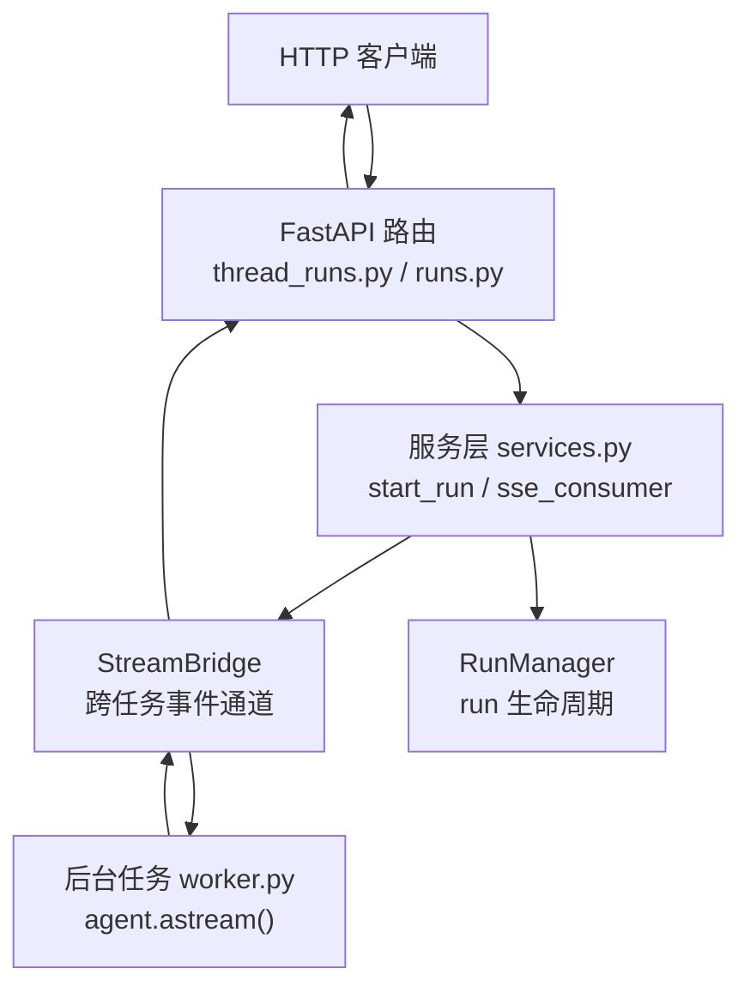
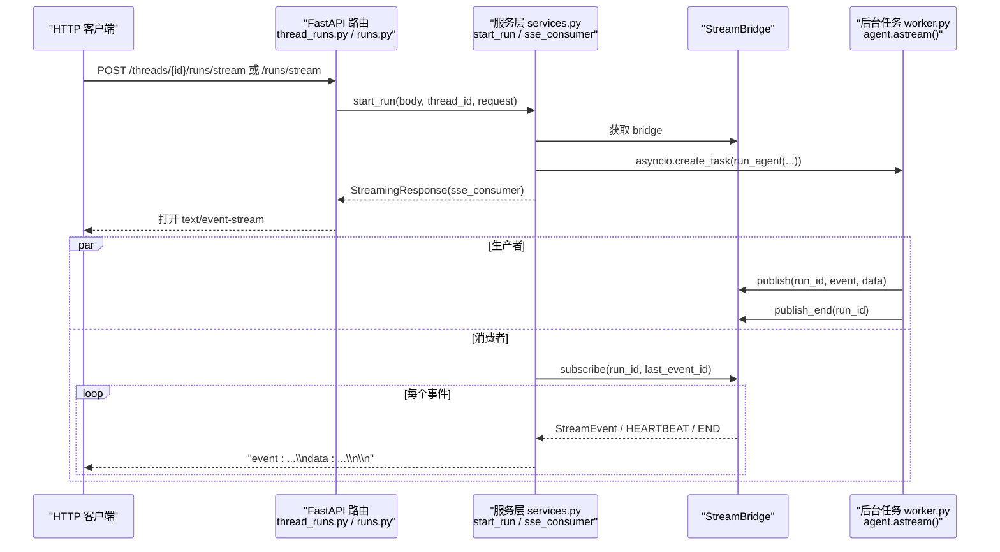
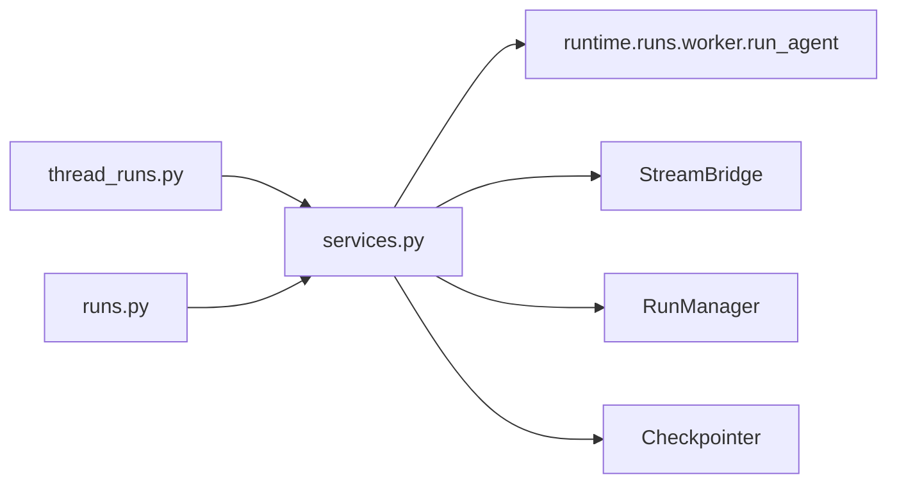

# 实时通信接口

<cite>
**本文引用的文件**   
- [backend/app/gateway/services.py](file://backend/app/gateway/services.py)
- [backend/app/gateway/routers/thread_runs.py](file://backend/app/gateway/routers/thread_runs.py)
- [backend/app/gateway/routers/runs.py](file://backend/app/gateway/routers/runs.py)
- [backend/docs/STREAMING.md](file://backend/docs/STREAMING.md)
- [backend/tests/test_sse_format.py](file://backend/tests/test_sse_format.py)
</cite>

## 目录
1. [简介](#简介)
2. [项目结构](#项目结构)
3. [核心组件](#核心组件)
4. [架构总览](#架构总览)
5. [详细组件分析](#详细组件分析)
6. [依赖分析](#依赖分析)
7. [性能考虑](#性能考虑)
8. [故障排查指南](#故障排查指南)
9. [结论](#结论)
10. [附录](#附录)

## 简介
本文件面向 DeerFlow 的实时通信能力，聚焦于基于 HTTP SSE（Server-Sent Events）的流式响应协议与连接管理。内容覆盖：
- SSE 消息格式、事件类型与帧构造
- 流式响应的建立过程与消费者语义（delta vs cumulative）
- 断线重连策略（Last-Event-ID）、心跳检测与终止信号
- 错误恢复机制与 on_disconnect 行为
- 线程运行状态更新、进度通知、实时聊天消息等核心功能
- 客户端连接示例、事件监听实现与异常处理方案
- 资源清理策略与性能优化建议
- 调试工具与定位方法

说明：仓库中未发现 WebSocket 相关实现；本文仅记录已实现的 SSE 路径。

## 项目结构
SSE 实时通信在 Gateway 层通过 FastAPI 路由暴露，服务层负责构建 run、订阅桥接器并输出 SSE 帧；测试用例验证 SSE 帧格式。

图表来源
- [backend/app/gateway/routers/thread_runs.py:423-448](file://backend/app/gateway/routers/thread_runs.py#L423-L448)
- [backend/app/gateway/routers/runs.py:35-57](file://backend/app/gateway/routers/runs.py#L35-L57)
- [backend/app/gateway/services.py:727-770](file://backend/app/gateway/services.py#L727-L770)

章节来源
- [backend/app/gateway/routers/thread_runs.py:423-448](file://backend/app/gateway/routers/thread_runs.py#L423-L448)
- [backend/app/gateway/routers/runs.py:35-57](file://backend/app/gateway/routers/runs.py#L35-L57)
- [backend/app/gateway/services.py:727-770](file://backend/app/gateway/services.py#L727-L770)

## 核心组件
- SSE 帧格式化：统一将 event/data/id 组装为符合 LangGraph Platform wire 格式的文本帧
- 服务层 start_run：创建 run、合并配置、注入上下文、启动后台任务
- SSE 消费者 sse_consumer：从桥接器订阅事件，处理心跳、结束信号、断线取消
- 路由层：提供 /stream、/wait、/join 等端点，返回 StreamingResponse

章节来源
- [backend/app/gateway/services.py:64-77](file://backend/app/gateway/services.py#L64-L77)
- [backend/app/gateway/services.py:514-670](file://backend/app/gateway/services.py#L514-L670)
- [backend/app/gateway/services.py:727-770](file://backend/app/gateway/services.py#L727-L770)
- [backend/app/gateway/routers/thread_runs.py:423-448](file://backend/app/gateway/routers/thread_runs.py#L423-L448)
- [backend/app/gateway/routers/runs.py:35-57](file://backend/app/gateway/routers/runs.py#L35-L57)

## 架构总览
SSE 端到端时序如下：

图表来源
- [backend/app/gateway/routers/thread_runs.py:423-448](file://backend/app/gateway/routers/thread_runs.py#L423-L448)
- [backend/app/gateway/routers/runs.py:35-57](file://backend/app/gateway/routers/runs.py#L35-L57)
- [backend/app/gateway/services.py:727-770](file://backend/app/gateway/services.py#L727-L770)
- [backend/docs/STREAMING.md:104-145](file://backend/docs/STREAMING.md#L104-L145)

## 详细组件分析

### SSE 帧格式与事件类型
- 帧字段顺序：event -> data -> id（可选）-> 空行
- 关键事件
  - metadata：包含 run_id、attempt 等元数据
  - values/messages-tuple/custom：LangGraph 多路模式事件
  - error：携带 message/name 字段
  - end：run 结束时发送，data 为 null
  - heartbeat：保活信号，服务端以纯文本 ": heartbeat" 形式输出
- 校验参考：测试用例覆盖了 end 事件 data:null、metadata 事件含 id、error 事件 message/name 字段

章节来源
- [backend/app/gateway/services.py:64-77](file://backend/app/gateway/services.py#L64-L77)
- [backend/tests/test_sse_format.py:12-31](file://backend/tests/test_sse_format.py#L12-L31)

### 流式响应建立与消费者语义
- 路由层返回 StreamingResponse，media_type=text/event-stream，附带 Cache-Control、Connection、X-Accel-Buffering 等头部
- 消费者语义遵循 delta 增量：messages 模式下 content 是增量片段，需要按 id 累加得到完整文本
- 三种 stream_mode 独立事件源：values（节点级快照）、messages（token 级增量）、custom（应用自定义）

章节来源
- [backend/app/gateway/routers/thread_runs.py:423-448](file://backend/app/gateway/routers/thread_runs.py#L423-L448)
- [backend/app/gateway/routers/runs.py:35-57](file://backend/app/gateway/routers/runs.py#L35-L57)
- [backend/docs/STREAMING.md:175-198](file://backend/docs/STREAMING.md#L175-L198)
- [backend/docs/STREAMING.md:49-99](file://backend/docs/STREAMING.md#L49-L99)

### 断线重连与 Last-Event-ID
- 支持 Last-Event-ID 重连：sse_consumer 读取请求头中的 Last-Event-ID 并传递给 bridge.subscribe
- 当检测到终端 run 且无保留流时，直接发送 end 事件
- 心跳用于唤醒等待和探测存活；若心跳期间发现终端且无流，则立即发送 end

章节来源
- [backend/app/gateway/services.py:727-770](file://backend/app/gateway/services.py#L727-L770)

### 心跳检测与终止信号
- 心跳：bridge 周期性发送 HEARTBEAT_SENTINEL，sse_consumer 将其转换为 ": heartbeat\n\n"
- 终止：bridge 发送 END_SENTINEL，sse_consumer 转为 event:end 并关闭
- wait_for_run_completion 同样消费同一桥接器，保证非流式等待也具备断线取消语义

章节来源
- [backend/app/gateway/services.py:727-770](file://backend/app/gateway/services.py#L727-L770)
- [backend/app/gateway/services.py:772-800](file://backend/app/gateway/services.py#L772-L800)

### on_disconnect 与错误恢复
- on_disconnect=cancel：客户端断开后，服务层会尝试取消后台任务（仅对当前 worker 拥有的 run）
- on_disconnect=continue：断开后继续执行，但事件丢弃
- 终端 run 且无保留流时，直接发送 end 避免客户端长时间阻塞
- 错误事件使用标准 error 帧，携带 message/name

章节来源
- [backend/app/gateway/services.py:727-770](file://backend/app/gateway/services.py#L727-L770)
- [backend/tests/test_sse_format.py:25-31](file://backend/tests/test_sse_format.py#L25-L31)

### 线程运行状态更新与进度通知
- 服务层在创建 run 时更新 thread 状态为 running，并在 finally 块中根据 checkpoint 同步标题
- 进度通知通过 values/messages-tuple/custom 事件传递，前端 useStream 可据此渲染中间态与最终态

章节来源
- [backend/app/gateway/services.py:600-621](file://backend/app/gateway/services.py#L600-L621)
- [backend/docs/STREAMING.md:104-145](file://backend/docs/STREAMING.md#L104-L145)

### 实时聊天消息与增量合成
- messages 模式产生 AIMessageChunk 增量，需按 id 累加
- values 模式提供完整 state 快照，用于 UI 刷新与最终态收敛
- custom 模式由应用代码显式写入，可用于进度、步骤卡片等

章节来源
- [backend/docs/STREAMING.md:175-198](file://backend/docs/STREAMING.md#L175-L198)
- [backend/docs/STREAMING.md:49-99](file://backend/docs/STREAMING.md#L49-L99)

### 客户端连接示例与事件监听
- 使用 langchain/langgraph-sdk/react 的 useStream hook 可直接消费 SSE 流
- 前端通过 BaseStream 类型与 ThreadContext 注入流实例，进行事件监听与渲染

章节来源
- [frontend/src/components/workspace/messages/context.ts:1-21](file://frontend/src/components/workspace/messages/context.ts#L1-L21)
- [backend/docs/STREAMING.md:104-145](file://backend/docs/STREAMING.md#L104-L145)

### 异常处理方案
- 输入校验失败：normalize_input 对非法消息抛出 400
- 权限/所有权校验失败：start_run 中对 thread 访问控制失败返回 404
- 冲突/不支持策略：ConflictError/UnsupportedStrategyError 映射到 409/501
- 模型不在白名单：返回 400
- 检查点不存在或无效：返回 404/400/500

章节来源
- [backend/app/gateway/services.py:119-152](file://backend/app/gateway/services.py#L119-L152)
- [backend/app/gateway/services.py:514-670](file://backend/app/gateway/services.py#L514-L670)

### 资源清理策略
- sse_consumer 的 finally 分支在 on_disconnect=cancel 时调用 run_mgr.cancel
- store_only 的跨 worker run 不在此 worker 拥有 task，跳过 cancel
- 心跳与 TTL 作为内存安全网，防止 key 泄漏；但不会替代客户端超时

章节来源
- [backend/app/gateway/services.py:727-770](file://backend/app/gateway/services.py#L727-L770)
- [backend/docs/STREAMING.md:140-145](file://backend/docs/STREAMING.md#L140-L145)

## 依赖分析
- 路由层依赖服务层：thread_runs.py/runs.py 调用 services.py 的 start_run/sse_consumer
- 服务层依赖运行时：run_agent、StreamBridge、RunManager、Checkpointer
- 序列化与模式翻译：runtime/serialization.py 与 worker.py 的 mode 名称映射

图表来源
- [backend/app/gateway/routers/thread_runs.py:423-448](file://backend/app/gateway/routers/thread_runs.py#L423-L448)
- [backend/app/gateway/routers/runs.py:35-57](file://backend/app/gateway/routers/runs.py#L35-L57)
- [backend/app/gateway/services.py:514-670](file://backend/app/gateway/services.py#L514-L670)

章节来源
- [backend/app/gateway/routers/thread_runs.py:423-448](file://backend/app/gateway/routers/thread_runs.py#L423-L448)
- [backend/app/gateway/routers/runs.py:35-57](file://backend/app/gateway/routers/runs.py#L35-L57)
- [backend/app/gateway/services.py:514-670](file://backend/app/gateway/services.py#L514-L670)

## 性能考虑
- 增量传输：messages 模式以 token 粒度推送，减少首屏延迟
- 批量与节流：前端可按时间窗口聚合增量，降低渲染压力
- 心跳间隔：合理设置心跳频率，平衡网络开销与断线感知
- 避免重复合成：values 快照遇到已通过 messages 流过的消息应跳过合成，减少 CPU 与带宽
- 分片与分页：历史消息查询采用游标分页，限制单次负载

[本节为通用指导，无需源码引用]

## 故障排查指南
- 确认 SSE 帧格式：使用 test_sse_format.py 的思路校验 end/metadata/error 帧
- 检查 Last-Event-ID：客户端是否携带该头，服务端是否正确转发给 bridge.subscribe
- 观察心跳：若长时间未收到事件，检查 ": heartbeat" 是否出现
- 查看终端状态：若 run 已结束但客户端仍阻塞，确认是否发送了 end
- 权限与所有权：404 可能来自 thread 不可见或 owner 不一致
- 模型白名单：400 可能因 model_name 不在允许列表
- 检查点问题：404/400/500 可能来自 checkpoint_id 不存在或校验失败

章节来源
- [backend/tests/test_sse_format.py:12-31](file://backend/tests/test_sse_format.py#L12-L31)
- [backend/app/gateway/services.py:727-770](file://backend/app/gateway/services.py#L727-L770)
- [backend/app/gateway/services.py:514-670](file://backend/app/gateway/services.py#L514-L670)

## 结论
DeerFlow 的实时通信基于 HTTP SSE，提供稳定、可扩展的流式事件通道。通过统一的帧格式、明确的事件类型、完善的断线重连与心跳机制，以及清晰的 on_disconnect 语义，能够满足前端与 IM 渠道等多类消费者的需求。配合 Delta 语义与 values 快照，既能实现低延迟体验，也能保证最终一致性。

[本节为总结性内容，无需源码引用]

## 附录

### SSE 事件类型速查
- metadata：run 元信息（run_id、attempt 等）
- values：节点级 state 快照
- messages-tuple：token 级增量（AI/tool 消息）
- custom：应用自定义事件
- error：错误事件（message/name）
- end：结束事件（data=null）
- heartbeat：保活信号（": heartbeat"）

章节来源
- [backend/app/gateway/services.py:64-77](file://backend/app/gateway/services.py#L64-L77)
- [backend/tests/test_sse_format.py:12-31](file://backend/tests/test_sse_format.py#L12-L31)

### 客户端接入要点
- 使用 useStream 或 langgraph-sdk 的 SSE 解码器
- 维护 Last-Event-ID 以实现断线重连
- 对 messages-tuple 按 id 做增量累加，结合 values 完成最终态收敛
- 处理 error 与 end 事件，做好 UI 提示与收尾

章节来源
- [frontend/src/components/workspace/messages/context.ts:1-21](file://frontend/src/components/workspace/messages/context.ts#L1-L21)
- [backend/docs/STREAMING.md:175-198](file://backend/docs/STREAMING.md#L175-L198)