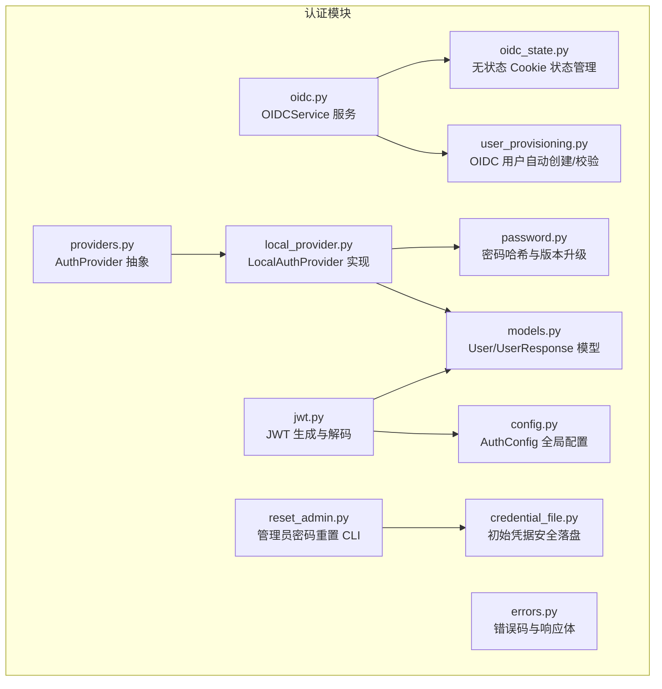
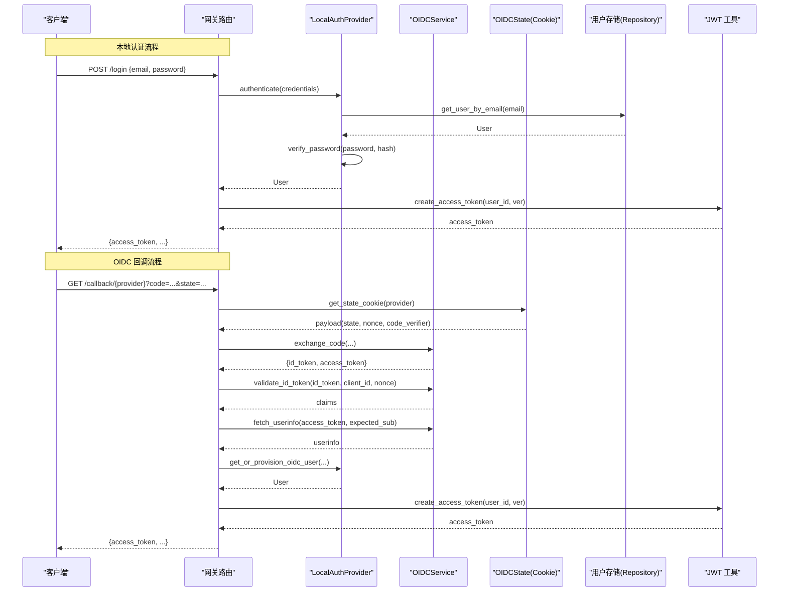
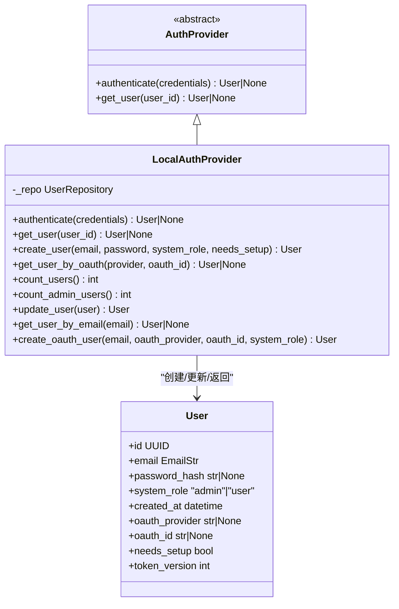
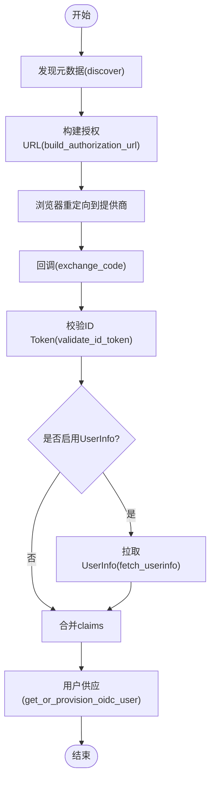
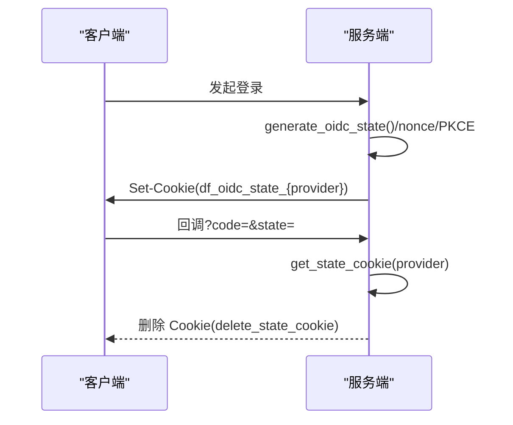
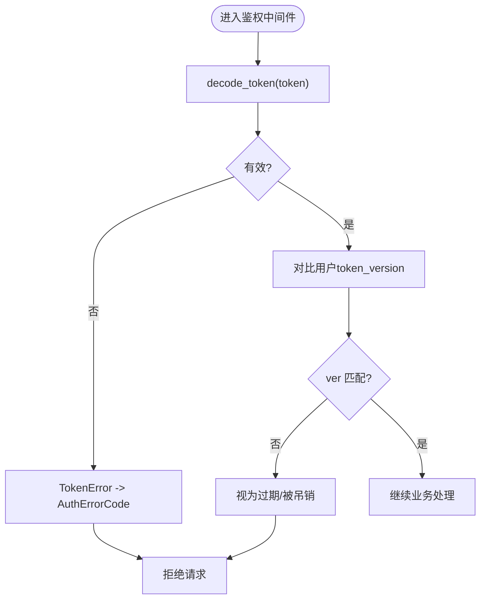
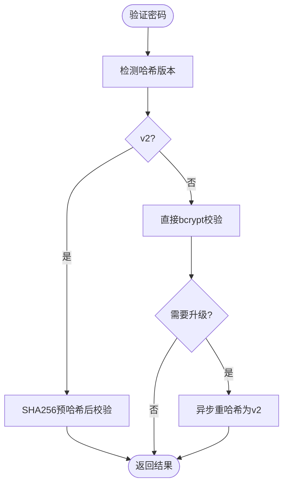
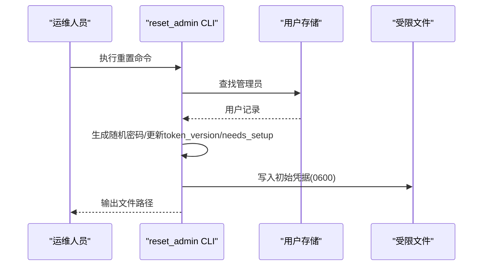
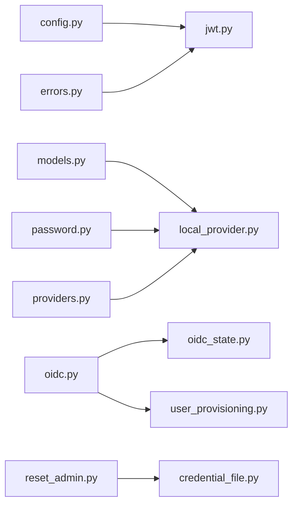

# 认证授权接口

<cite>
**本文引用的文件**   
- [backend/app/gateway/auth/__init__.py](file://backend/app/gateway/auth/__init__.py)
- [backend/app/gateway/auth/config.py](file://backend/app/gateway/auth/config.py)
- [backend/app/gateway/auth/jwt.py](file://backend/app/gateway/auth/jwt.py)
- [backend/app/gateway/auth/local_provider.py](file://backend/app/gateway/auth/local_provider.py)
- [backend/app/gateway/auth/oidc.py](file://backend/app/gateway/auth/oidc.py)
- [backend/app/gateway/auth/providers.py](file://backend/app/gateway/auth/providers.py)
- [backend/app/gateway/auth/models.py](file://backend/app/gateway/auth/models.py)
- [backend/app/gateway/auth/errors.py](file://backend/app/gateway/auth/errors.py)
- [backend/app/gateway/auth/password.py](file://backend/app/gateway/auth/password.py)
- [backend/app/gateway/auth/reset_admin.py](file://backend/app/gateway/auth/reset_admin.py)
- [backend/app/gateway/auth/user_provisioning.py](file://backend/app/gateway/auth/user_provisioning.py)
- [backend/app/gateway/auth/oidc_state.py](file://backend/app/gateway/auth/oidc_state.py)
- [backend/app/gateway/auth/credential_file.py](file://backend/app/gateway/auth/credential_file.py)
</cite>

## 目录
1. [简介](#简介)
2. [项目结构](#项目结构)
3. [核心组件](#核心组件)
4. [架构总览](#架构总览)
5. [详细组件分析](#详细组件分析)
6. [依赖关系分析](#依赖关系分析)
7. [性能与安全考量](#性能与安全考量)
8. [故障排查指南](#故障排查指南)
9. [结论](#结论)
10. [附录：API 与错误码](#附录api-与错误码)

## 简介
本文件为 DeerFlow 后端认证授权模块的权威文档，覆盖以下主题：
- 用户登录、注册、密码重置、会话管理相关端点（通过本地认证与 OIDC）
- JWT token 的生成、验证与刷新机制
- 多认证方式配置与使用（本地邮箱/密码、OIDC）
- 权限验证流程、角色管理与访问控制策略
- 完整认证流程图、token 结构与最佳实践
- 多租户环境下的用户隔离机制与数据安全保护措施
- 认证失败的错误码与处理策略

说明：
- 当前仓库中未包含 LDAP 实现；如需集成 LDAP，可参考现有 Provider 抽象扩展新的认证提供者。
- 前端存在认证路由与页面，但本文聚焦于后端认证授权能力与接口契约。

## 项目结构
认证授权相关代码集中在 backend/app/gateway/auth 下，采用“提供者工厂 + 抽象接口”的设计，便于扩展多种认证方式（本地、OIDC、未来可扩展 LDAP）。

图表来源
- [backend/app/gateway/auth/providers.py:1-25](file://backend/app/gateway/auth/providers.py#L1-L25)
- [backend/app/gateway/auth/local_provider.py:1-133](file://backend/app/gateway/auth/local_provider.py#L1-L133)
- [backend/app/gateway/auth/oidc.py:1-434](file://backend/app/gateway/auth/oidc.py#L1-L434)
- [backend/app/gateway/auth/oidc_state.py:1-122](file://backend/app/gateway/auth/oidc_state.py#L1-L122)
- [backend/app/gateway/auth/user_provisioning.py:1-113](file://backend/app/gateway/auth/user_provisioning.py#L1-L113)
- [backend/app/gateway/auth/password.py:1-82](file://backend/app/gateway/auth/password.py#L1-L82)
- [backend/app/gateway/auth/jwt.py:1-56](file://backend/app/gateway/auth/jwt.py#L1-L56)
- [backend/app/gateway/auth/config.py:1-86](file://backend/app/gateway/auth/config.py#L1-L86)
- [backend/app/gateway/auth/models.py:1-43](file://backend/app/gateway/auth/models.py#L1-L43)
- [backend/app/gateway/auth/errors.py:1-46](file://backend/app/gateway/auth/errors.py#L1-L46)
- [backend/app/gateway/auth/reset_admin.py:1-92](file://backend/app/gateway/auth/reset_admin.py#L1-L92)
- [backend/app/gateway/auth/credential_file.py:1-49](file://backend/app/gateway/auth/credential_file.py#L1-L49)

章节来源
- [backend/app/gateway/auth/__init__.py:1-43](file://backend/app/gateway/auth/__init__.py#L1-L43)

## 核心组件
- 配置中心 AuthConfig：集中管理 JWT 密钥、令牌有效期、OAuth/GitHub 客户端参数等，支持从环境变量或持久化文件加载。
- JWT 工具：提供 TokenPayload 结构、create_access_token 与 decode_token，用于签发与校验访问令牌。
- 密码工具：支持 v1/v2 两种 bcrypt 格式，自动检测并渐进式升级，避免 72 字节截断问题。
- 本地认证提供者 LocalAuthProvider：基于邮箱/密码的认证、用户创建、更新、统计等。
- OIDC 服务 OIDCService：发现元数据、构建授权 URL、交换令牌、校验 ID Token、获取 UserInfo。
- OIDC 状态管理：使用签名 HttpOnly Cookie 保存 state/nonce/PKCE verifier，保持无状态部署兼容。
- 用户供应 user_provisioning：根据 OIDC identity 进行用户查找、域限制、冲突检测与自动创建。
- 错误体系：统一的错误码枚举与结构化响应体，TokenError 到 AuthErrorCode 的映射。
- 管理员重置：CLI 工具将新密码写入受限文件，强制首次登录完成设置。

章节来源
- [backend/app/gateway/auth/config.py:1-86](file://backend/app/gateway/auth/config.py#L1-L86)
- [backend/app/gateway/auth/jwt.py:1-56](file://backend/app/gateway/auth/jwt.py#L1-L56)
- [backend/app/gateway/auth/password.py:1-82](file://backend/app/gateway/auth/password.py#L1-L82)
- [backend/app/gateway/auth/local_provider.py:1-133](file://backend/app/gateway/auth/local_provider.py#L1-L133)
- [backend/app/gateway/auth/oidc.py:1-434](file://backend/app/gateway/auth/oidc.py#L1-L434)
- [backend/app/gateway/auth/oidc_state.py:1-122](file://backend/app/gateway/auth/oidc_state.py#L1-L122)
- [backend/app/gateway/auth/user_provisioning.py:1-113](file://backend/app/gateway/auth/user_provisioning.py#L1-L113)
- [backend/app/gateway/auth/errors.py:1-46](file://backend/app/gateway/auth/errors.py#L1-L46)
- [backend/app/gateway/auth/reset_admin.py:1-92](file://backend/app/gateway/auth/reset_admin.py#L1-L92)
- [backend/app/gateway/auth/credential_file.py:1-49](file://backend/app/gateway/auth/credential_file.py#L1-L49)

## 架构总览
下图展示了本地认证与 OIDC 两条主路径在网关层的交互关系，以及 JWT 在请求中的流转。

图表来源
- [backend/app/gateway/auth/local_provider.py:1-133](file://backend/app/gateway/auth/local_provider.py#L1-L133)
- [backend/app/gateway/auth/oidc.py:1-434](file://backend/app/gateway/auth/oidc.py#L1-L434)
- [backend/app/gateway/auth/oidc_state.py:1-122](file://backend/app/gateway/auth/oidc_state.py#L1-L122)
- [backend/app/gateway/auth/user_provisioning.py:1-113](file://backend/app/gateway/auth/user_provisioning.py#L1-L113)
- [backend/app/gateway/auth/jwt.py:1-56](file://backend/app/gateway/auth/jwt.py#L1-L56)

## 详细组件分析

### 本地认证提供者（邮箱/密码）
- 功能要点
  - 基于邮箱查询用户，校验密码哈希，必要时异步重哈希以升级到 v2。
  - 支持创建本地用户、按邮箱/OAuth 关联查询、计数与管理员数量统计。
  - 返回内部 User 模型供上层签发 JWT。
- 关键方法
  - authenticate(credentials): 邮箱+密码认证
  - get_user(user_id): 按 ID 获取用户
  - create_user(email, password, system_role, needs_setup): 创建用户
  - get_user_by_oauth(provider, oauth_id): 按第三方标识获取用户
  - count_users/count_admin_users: 统计
  - update_user/get_user_by_email: 更新与查询
- 复杂度与并发
  - 密码哈希/校验为 CPU 密集操作，已封装为异步线程池调用，避免阻塞事件循环。
- 错误处理
  - 认证失败返回 None，由上层转换为统一错误码。

图表来源
- [backend/app/gateway/auth/providers.py:1-25](file://backend/app/gateway/auth/providers.py#L1-L25)
- [backend/app/gateway/auth/local_provider.py:1-133](file://backend/app/gateway/auth/local_provider.py#L1-L133)
- [backend/app/gateway/auth/models.py:1-43](file://backend/app/gateway/auth/models.py#L1-L43)

章节来源
- [backend/app/gateway/auth/local_provider.py:1-133](file://backend/app/gateway/auth/local_provider.py#L1-L133)
- [backend/app/gateway/auth/models.py:1-43](file://backend/app/gateway/auth/models.py#L1-L43)

### OIDC 集成（OpenID Connect）
- 功能要点
  - 发现元数据、构建授权 URL、交换令牌、校验 ID Token、拉取 UserInfo。
  - 使用进程内缓存（TTL）减少外部调用开销。
  - 支持 PKCE、nonce 校验、JWKS 动态刷新与 kid 匹配。
- 关键方法
  - discover(issuer, overrides): 发现元数据
  - build_authorization_url(...): 构造授权链接
  - exchange_code(...): 交换授权码为令牌
  - validate_id_token(...): 校验 ID Token（签名、iss/aud/exp/iat、nonce）
  - fetch_userinfo(...): 获取用户信息并校验 sub 一致性
  - authenticate_callback(...): 端到端编排回调流程
- 安全特性
  - issuer 严格比对，防止恶意 discovery 劫持。
  - 仅允许安全的算法集合（RS256/ES256 等）。
  - constant-time 比较 nonce，防时序攻击。

图表来源
- [backend/app/gateway/auth/oidc.py:1-434](file://backend/app/gateway/auth/oidc.py#L1-L434)
- [backend/app/gateway/auth/user_provisioning.py:1-113](file://backend/app/gateway/auth/user_provisioning.py#L1-L113)

章节来源
- [backend/app/gateway/auth/oidc.py:1-434](file://backend/app/gateway/auth/oidc.py#L1-L434)
- [backend/app/gateway/auth/user_provisioning.py:1-113](file://backend/app/gateway/auth/user_provisioning.py#L1-L113)

### OIDC 无状态状态管理（Cookie）
- 设计目标
  - 使用签名 HttpOnly Cookie 保存 state/nonce/PKCE verifier，避免服务端存储，适配多 Worker 部署。
- 关键函数
  - generate_oidc_state/generate_nonce/generate_code_verifier/compute_code_challenge
  - set_state_cookie/get_state_cookie/delete_state_cookie
- 安全性
  - 使用 JWT 对 Cookie 内容签名，校验失败或过期则丢弃。
  - 限定 Cookie 作用域至回调路径，Samesite=Lax，HTTPS 时启用 Secure。

图表来源
- [backend/app/gateway/auth/oidc_state.py:1-122](file://backend/app/gateway/auth/oidc_state.py#L1-L122)

章节来源
- [backend/app/gateway/auth/oidc_state.py:1-122](file://backend/app/gateway/auth/oidc_state.py#L1-L122)

### JWT 令牌机制
- 结构
  - sub: 用户 ID（字符串）
  - exp: 过期时间
  - iat: 签发时间
  - ver: token_version，与用户 token_version 一致才有效，用于登出/改密后失效
- 生成
  - create_access_token(user_id, expires_delta=None, token_version=0)
- 校验
  - decode_token(token) -> TokenPayload | TokenError
- 刷新策略
  - 建议每次访问时校验并签发新令牌（滑动窗口），或在特定场景下提供 refresh 端点；注意与 token_version 联动实现批量失效。

图表来源
- [backend/app/gateway/auth/jwt.py:1-56](file://backend/app/gateway/auth/jwt.py#L1-L56)
- [backend/app/gateway/auth/errors.py:1-46](file://backend/app/gateway/auth/errors.py#L1-L46)

章节来源
- [backend/app/gateway/auth/jwt.py:1-56](file://backend/app/gateway/auth/jwt.py#L1-L56)
- [backend/app/gateway/auth/errors.py:1-46](file://backend/app/gateway/auth/errors.py#L1-L46)

### 密码哈希与版本升级
- 版本
  - v1：bcrypt(password)，存在 72 字节截断风险
  - v2：bcrypt(b64(sha256(password)))，规避截断
- 行为
  - 验证时自动识别版本；若为旧版本，登录成功后异步重哈希为 v2。
  - 异步封装避免阻塞事件循环。

图表来源
- [backend/app/gateway/auth/password.py:1-82](file://backend/app/gateway/auth/password.py#L1-L82)

章节来源
- [backend/app/gateway/auth/password.py:1-82](file://backend/app/gateway/auth/password.py#L1-L82)

### 管理员密码重置与初始凭据落盘
- 重置流程
  - 通过 CLI 指定邮箱或选择首个管理员，生成随机密码，写入受限文件，标记 needs_setup=true，token_version+1。
- 安全落盘
  - 使用原子写入与 0600 权限，避免日志泄露。

图表来源
- [backend/app/gateway/auth/reset_admin.py:1-92](file://backend/app/gateway/auth/reset_admin.py#L1-L92)
- [backend/app/gateway/auth/credential_file.py:1-49](file://backend/app/gateway/auth/credential_file.py#L1-L49)

章节来源
- [backend/app/gateway/auth/reset_admin.py:1-92](file://backend/app/gateway/auth/reset_admin.py#L1-L92)
- [backend/app/gateway/auth/credential_file.py:1-49](file://backend/app/gateway/auth/credential_file.py#L1-L49)

### 用户供应与访问控制策略
- 供应规则
  - 优先按 (provider, subject) 查找已有用户；否则检查邮箱是否已存在本地账户（冲突则 409）。
  - 可选要求邮箱已验证、域名白名单、禁止自动创建等。
  - 支持按 admin_emails 列表分配管理员角色。
- 访问控制
  - 系统角色 system_role 区分 admin/user，后续可在网关层结合中间件与路由守卫实施细粒度访问控制。

章节来源
- [backend/app/gateway/auth/user_provisioning.py:1-113](file://backend/app/gateway/auth/user_provisioning.py#L1-L113)
- [backend/app/gateway/auth/models.py:1-43](file://backend/app/gateway/auth/models.py#L1-L43)

## 依赖关系分析
- 模块耦合
  - local_provider 依赖 models、password、repositories.base
  - oidc 依赖 httpx、jwt、oidc_state、user_provisioning
  - jwt 依赖 config、errors
  - reset_admin 依赖 credential_file、password、sqlite repository
- 外部依赖
  - PyJWT、httpx、bcrypt、Pydantic、FastAPI（HTTPException）

图表来源
- [backend/app/gateway/auth/config.py:1-86](file://backend/app/gateway/auth/config.py#L1-L86)
- [backend/app/gateway/auth/jwt.py:1-56](file://backend/app/gateway/auth/jwt.py#L1-L56)
- [backend/app/gateway/auth/errors.py:1-46](file://backend/app/gateway/auth/errors.py#L1-L46)
- [backend/app/gateway/auth/models.py:1-43](file://backend/app/gateway/auth/models.py#L1-L43)
- [backend/app/gateway/auth/password.py:1-82](file://backend/app/gateway/auth/password.py#L1-L82)
- [backend/app/gateway/auth/providers.py:1-25](file://backend/app/gateway/auth/providers.py#L1-L25)
- [backend/app/gateway/auth/local_provider.py:1-133](file://backend/app/gateway/auth/local_provider.py#L1-L133)
- [backend/app/gateway/auth/oidc.py:1-434](file://backend/app/gateway/auth/oidc.py#L1-L434)
- [backend/app/gateway/auth/oidc_state.py:1-122](file://backend/app/gateway/auth/oidc_state.py#L1-L122)
- [backend/app/gateway/auth/user_provisioning.py:1-113](file://backend/app/gateway/auth/user_provisioning.py#L1-L113)
- [backend/app/gateway/auth/reset_admin.py:1-92](file://backend/app/gateway/auth/reset_admin.py#L1-L92)
- [backend/app/gateway/auth/credential_file.py:1-49](file://backend/app/gateway/auth/credential_file.py#L1-L49)

## 性能与安全考量
- 性能
  - 密码哈希/校验使用线程池异步执行，避免阻塞事件循环。
  - OIDC 元数据与 JWKS 使用进程内 TTL 缓存，降低外部网络延迟。
- 安全
  - JWT 使用 HS256 对称签名，生产环境必须设置 AUTH_JWT_SECRET，且定期轮换。
  - OIDC 校验 issuer、audience、exp、iat、nonce，仅允许安全算法集合。
  - PKCE 与 Samesite/Lax、HttpOnly、Secure Cookie 组合防护 CSRF/XSS。
  - 管理员凭据写入 0600 文件，避免日志泄露。
  - 用户 token_version 与 JWT ver 字段联动，支持改密/登出后批量失效。

[本节为通用指导，不直接分析具体文件]

## 故障排查指南
- 常见问题
  - 未设置 AUTH_JWT_SECRET：启动时会生成并持久化到 .jwt_secret，生产环境建议显式配置。
  - OIDC 回调失败：检查 state cookie 是否存在且未过期、nonce 是否匹配、PKCE verifier 是否正确。
  - 邮箱冲突：当本地账户与 OIDC 邮箱冲突时返回 409，需管理员手动合并或解绑。
  - 管理员无法登录：使用 reset_admin CLI 重置密码并查看生成的凭据文件路径。
- 错误码与处理
  - 见附录“API 与错误码”，涵盖认证失败、令牌无效、用户不存在等情形。

章节来源
- [backend/app/gateway/auth/config.py:1-86](file://backend/app/gateway/auth/config.py#L1-L86)
- [backend/app/gateway/auth/oidc_state.py:1-122](file://backend/app/gateway/auth/oidc_state.py#L1-L122)
- [backend/app/gateway/auth/user_provisioning.py:1-113](file://backend/app/gateway/auth/user_provisioning.py#L1-L113)
- [backend/app/gateway/auth/reset_admin.py:1-92](file://backend/app/gateway/auth/reset_admin.py#L1-L92)
- [backend/app/gateway/auth/errors.py:1-46](file://backend/app/gateway/auth/errors.py#L1-L46)

## 结论
DeerFlow 认证授权模块以 Provider 抽象为核心，实现了本地邮箱/密码与 OIDC 双通道认证，并通过 JWT 与 token_version 实现灵活的会话管理与失效策略。OIDC 集成遵循标准规范，具备完善的校验与安全防护。建议在多租户环境中结合用户隔离与最小权限原则，配合网关中间件实现细粒度访问控制。

[本节为总结性内容，不直接分析具体文件]

## 附录：API 与错误码

### 认证相关端点（概念性定义）
- 本地认证
  - POST /api/v1/auth/login：提交 {email, password}，成功返回 access_token
  - POST /api/v1/auth/register：提交 {email, password}，成功返回用户信息与 access_token（如允许公开注册）
  - POST /api/v1/auth/password-reset-request：提交 email，发送重置邮件（若实现）
  - POST /api/v1/auth/password-reset-confirm：提交 token/new_password，完成重置
  - POST /api/v1/auth/logout：使当前 token 失效（通过 token_version 或黑名单）
- OIDC 认证
  - GET /api/v1/auth/authorize/{provider}：返回授权 URL
  - GET /api/v1/auth/callback/{provider}：接收 code/state，完成交换与签发 token
- 会话与信息
  - GET /api/v1/auth/me：返回当前用户信息（UserResponse）
  - POST /api/v1/auth/refresh：刷新 access_token（可选，建议滑动窗口）

说明：以上为接口契约层面的描述，实际路由实现可能位于网关 routers 层，本文聚焦认证授权核心逻辑。

### Token 结构（JWT）
- 字段
  - sub: 用户 ID（字符串）
  - exp: 过期时间
  - iat: 签发时间
  - ver: token_version，与用户 token_version 一致才有效
- 算法
  - HS256（对称签名）
- 生命周期
  - 默认有效期由配置决定；可通过 expires_delta 自定义
  - 改密/登出应递增 token_version 以失效旧令牌

章节来源
- [backend/app/gateway/auth/jwt.py:1-56](file://backend/app/gateway/auth/jwt.py#L1-L56)
- [backend/app/gateway/auth/models.py:1-43](file://backend/app/gateway/auth/models.py#L1-L43)

### 错误码与处理策略
- 认证错误码
  - invalid_credentials：凭证无效
  - token_expired：令牌过期
  - token_invalid：令牌无效（签名错误或格式错误）
  - user_not_found：用户不存在
  - email_already_exists：邮箱已注册
  - provider_not_found：认证提供方不存在
  - not_authenticated：未认证
  - system_already_initialized：系统已初始化（如重复初始化）
- Token 解码错误
  - expired：过期
  - invalid_signature：签名无效
  - malformed：格式错误
- 处理建议
  - 前端根据 code 提示用户重新登录或刷新令牌
  - 服务端统一包装为结构化响应体，便于前端解析

章节来源
- [backend/app/gateway/auth/errors.py:1-46](file://backend/app/gateway/auth/errors.py#L1-L46)