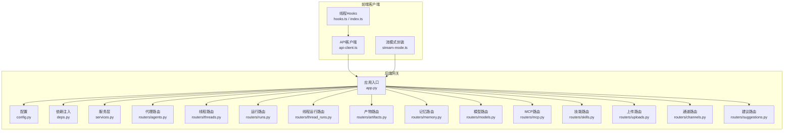
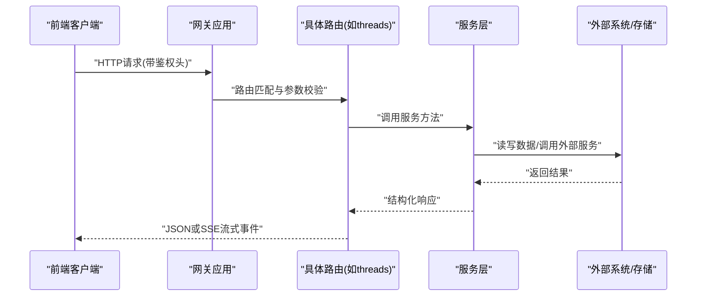
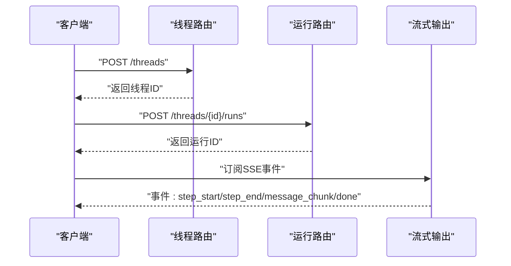
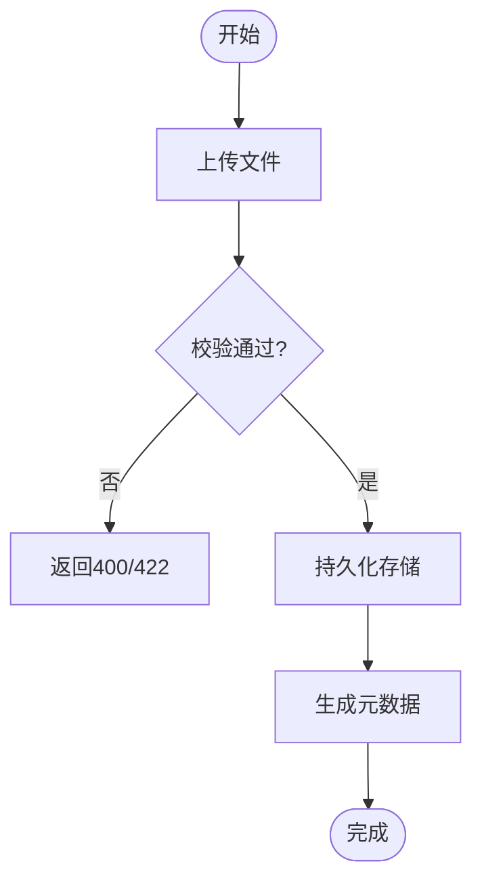
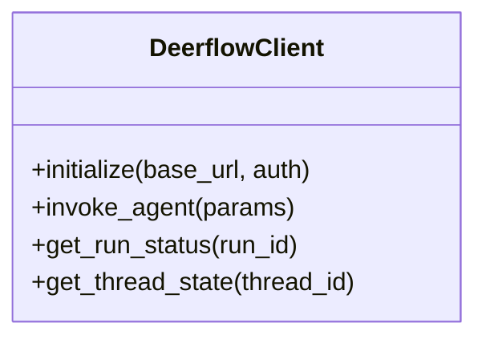
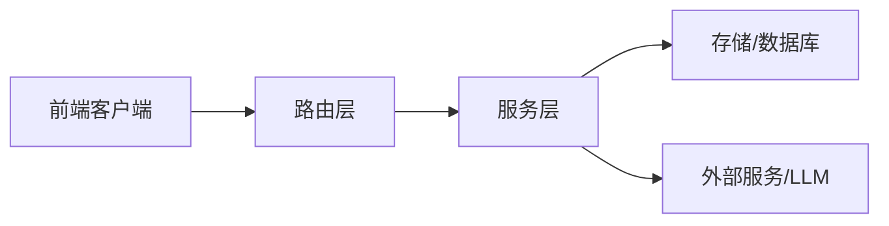

# API参考

<cite>
**本文引用的文件**   
- [backend/app/gateway/app.py](file://backend/app/gateway/app.py)
- [backend/app/gateway/routers/agents.py](file://backend/app/gateway/routers/agents.py)
- [backend/app/gateway/routers/artifacts.py](file://backend/app/gateway/routers/artifacts.py)
- [backend/app/gateway/routers/channels.py](file://backend/app/gateway/routers/channels.py)
- [backend/app/gateway/routers/mcp.py](file://backend/app/gateway/routers/mcp.py)
- [backend/app/gateway/routers/memory.py](file://backend/app/gateway/routers/memory.py)
- [backend/app/gateway/routers/models.py](file://backend/app/gateway/routers/models.py)
- [backend/app/gateway/routers/runs.py](file://backend/app/gateway/routers/runs.py)
- [backend/app/gateway/routers/skills.py](file://backend/app/gateway/routers/skills.py)
- [backend/app/gateway/routers/suggestions.py](file://backend/app/gateway/routers/suggestions.py)
- [backend/app/gateway/routers/thread_runs.py](file://backend/app/gateway/routers/thread_runs.py)
- [backend/app/gateway/routers/threads.py](file://backend/app/gateway/routers/threads.py)
- [backend/app/gateway/routers/uploads.py](file://backend/app/gateway/routers/uploads.py)
- [backend/app/gateway/config.py](file://backend/app/gateway/config.py)
- [backend/app/gateway/deps.py](file://backend/app/gateway/deps.py)
- [backend/app/gateway/services.py](file://backend/app/gateway/services.py)
- [backend/packages/harness/deerflow/client.py](file://backend/packages/harness/deerflow/client.py)
- [frontend/src/core/api/api-client.ts](file://frontend/src/core/api/api-client.ts)
- [frontend/src/core/api/stream-mode.ts](file://frontend/src/core/api/stream-mode.ts)
- [frontend/src/core/threads/index.ts](file://frontend/src/core/threads/index.ts)
- [frontend/src/core/threads/hooks.ts](file://frontend/src/core/threads/hooks.ts)
- [backend/docs/API.md](file://backend/docs/API.md)
- [backend/docs/STREAMING.md](file://backend/docs/STREAMING.md)
</cite>

## 目录
1. [简介](#简介)
2. [项目结构](#项目结构)
3. [核心组件](#核心组件)
4. [架构总览](#架构总览)
5. [详细组件分析](#详细组件分析)
6. [依赖分析](#依赖分析)
7. [性能考虑](#性能考虑)
8. [故障排查指南](#故障排查指南)
9. [结论](#结论)
10. [附录](#附录)

## 简介
本API参考文档面向DeerFlow后端网关与前端客户端，系统化梳理RESTful接口、WebSocket/SSE流式事件、LangGraph SDK使用方式、认证授权机制、版本管理与兼容性策略、限流与缓存建议、调试与监控指标等。读者可据此快速集成并稳定调用DeerFlow的代理运行、线程管理、记忆存储、模型配置、MCP工具、上传与产物等能力。

## 项目结构
后端采用FastAPI网关组织路由，按功能域划分到多个router模块；前端通过TypeScript API客户端封装HTTP与SSE流式交互，并提供React Hooks简化状态管理。

图表来源
- [backend/app/gateway/app.py](file://backend/app/gateway/app.py)
- [backend/app/gateway/routers/agents.py](file://backend/app/gateway/routers/agents.py)
- [backend/app/gateway/routers/threads.py](file://backend/app/gateway/routers/threads.py)
- [backend/app/gateway/routers/runs.py](file://backend/app/gateway/routers/runs.py)
- [backend/app/gateway/routers/thread_runs.py](file://backend/app/gateway/routers/thread_runs.py)
- [backend/app/gateway/routers/artifacts.py](file://backend/app/gateway/routers/artifacts.py)
- [backend/app/gateway/routers/memory.py](file://backend/app/gateway/routers/memory.py)
- [backend/app/gateway/routers/models.py](file://backend/app/gateway/routers/models.py)
- [backend/app/gateway/routers/mcp.py](file://backend/app/gateway/routers/mcp.py)
- [backend/app/gateway/routers/skills.py](file://backend/app/gateway/routers/skills.py)
- [backend/app/gateway/routers/uploads.py](file://backend/app/gateway/routers/uploads.py)
- [backend/app/gateway/routers/channels.py](file://backend/app/gateway/routers/channels.py)
- [backend/app/gateway/routers/suggestions.py](file://backend/app/gateway/routers/suggestions.py)
- [backend/app/gateway/config.py](file://backend/app/gateway/config.py)
- [backend/app/gateway/deps.py](file://backend/app/gateway/deps.py)
- [backend/app/gateway/services.py](file://backend/app/gateway/services.py)
- [frontend/src/core/api/api-client.ts](file://frontend/src/core/api/api-client.ts)
- [frontend/src/core/api/stream-mode.ts](file://frontend/src/core/api/stream-mode.ts)
- [frontend/src/core/threads/hooks.ts](file://frontend/src/core/threads/hooks.ts)
- [frontend/src/core/threads/index.ts](file://frontend/src/core/threads/index.ts)

章节来源
- [backend/app/gateway/app.py](file://backend/app/gateway/app.py)
- [backend/app/gateway/config.py](file://backend/app/gateway/config.py)
- [backend/app/gateway/deps.py](file://backend/app/gateway/deps.py)
- [backend/app/gateway/services.py](file://backend/app/gateway/services.py)
- [frontend/src/core/api/api-client.ts](file://frontend/src/core/api/api-client.ts)
- [frontend/src/core/api/stream-mode.ts](file://frontend/src/core/api/stream-mode.ts)
- [frontend/src/core/threads/hooks.ts](file://frontend/src/core/threads/hooks.ts)
- [frontend/src/core/threads/index.ts](file://frontend/src/core/threads/index.ts)

## 核心组件
- 网关应用与路由注册：集中挂载各功能域路由，统一前缀与中间件。
- 依赖注入与服务层：提供跨路由共享的服务实例（如运行时、持久化、外部服务）。
- 前端API客户端：封装基础请求、鉴权头、错误处理与重试策略。
- 流式传输封装：基于SSE/流式响应的事件解析与回调分发。
- LangGraph SDK客户端：用于初始化、代理调用与状态查询。

章节来源
- [backend/app/gateway/app.py](file://backend/app/gateway/app.py)
- [backend/app/gateway/deps.py](file://backend/app/gateway/deps.py)
- [backend/app/gateway/services.py](file://backend/app/gateway/services.py)
- [frontend/src/core/api/api-client.ts](file://frontend/src/core/api/api-client.ts)
- [frontend/src/core/api/stream-mode.ts](file://frontend/src/core/api/stream-mode.ts)
- [backend/packages/harness/deerflow/client.py](file://backend/packages/harness/deerflow/client.py)

## 架构总览
整体采用“前端TS客户端 + FastAPI网关 + 多路由模块化”的分层架构。前端通过统一的API客户端访问后端，所有业务路由集中在网关下，服务层负责编排与外部系统交互。

图表来源
- [backend/app/gateway/app.py](file://backend/app/gateway/app.py)
- [backend/app/gateway/routers/threads.py](file://backend/app/gateway/routers/threads.py)
- [backend/app/gateway/services.py](file://backend/app/gateway/services.py)

## 详细组件分析

### RESTful API总览
- 通用约定
  - 基础路径：由网关配置决定，通常以固定前缀暴露。
  - 鉴权：在请求头中携带令牌（例如Authorization），由网关或中间件校验。
  - 内容类型：默认application/json；文件上传使用multipart/form-data。
  - 分页：列表接口支持page/page_size或offset/limit等参数（依具体路由实现）。
  - 错误响应：包含错误码、消息与可选详情字段。

- 主要路由域
  - 代理：创建、列举、更新、删除、执行等。
  - 线程与运行：线程生命周期、消息发送、运行启动/暂停/恢复、历史查询。
  - 产物与上传：文件上传、产物下载、元数据查询。
  - 记忆与模型：记忆读写、模型配置与切换。
  - MCP与技能：MCP工具发现与调用、技能安装与管理。
  - 通道与建议：第三方通道对接、智能建议生成。

- 典型错误码
  - 400：请求参数错误或校验失败。
  - 401：未认证或令牌无效。
  - 403：权限不足。
  - 404：资源不存在。
  - 409：冲突（如重复创建）。
  - 422：语义校验失败（Pydantic等）。
  - 429：限流触发。
  - 500：服务端异常。

章节来源
- [backend/app/gateway/app.py](file://backend/app/gateway/app.py)
- [backend/app/gateway/routers/agents.py](file://backend/app/gateway/routers/agents.py)
- [backend/app/gateway/routers/threads.py](file://backend/app/gateway/routers/threads.py)
- [backend/app/gateway/routers/runs.py](file://backend/app/gateway/routers/runs.py)
- [backend/app/gateway/routers/thread_runs.py](file://backend/app/gateway/routers/thread_runs.py)
- [backend/app/gateway/routers/artifacts.py](file://backend/app/gateway/routers/artifacts.py)
- [backend/app/gateway/routers/memory.py](file://backend/app/gateway/routers/memory.py)
- [backend/app/gateway/routers/models.py](file://backend/app/gateway/routers/models.py)
- [backend/app/gateway/routers/mcp.py](file://backend/app/gateway/routers/mcp.py)
- [backend/app/gateway/routers/skills.py](file://backend/app/gateway/routers/skills.py)
- [backend/app/gateway/routers/uploads.py](file://backend/app/gateway/routers/uploads.py)
- [backend/app/gateway/routers/channels.py](file://backend/app/gateway/routers/channels.py)
- [backend/app/gateway/routers/suggestions.py](file://backend/app/gateway/routers/suggestions.py)

### 线程与运行（示例）
- 线程CRUD
  - 列出线程：GET /threads?page=...&page_size=...
  - 获取线程：GET /threads/{thread_id}
  - 创建线程：POST /threads
  - 更新线程：PATCH /threads/{thread_id}
  - 删除线程：DELETE /threads/{thread_id}
- 运行控制
  - 启动运行：POST /threads/{thread_id}/runs
  - 暂停/恢复：POST /threads/{thread_id}/runs/{run_id}/pause|resume
  - 终止运行：POST /threads/{thread_id}/runs/{run_id}/cancel
  - 运行历史：GET /threads/{thread_id}/runs
- 消息与事件
  - 发送消息：POST /threads/{thread_id}/messages
  - 流式事件：SSE/Server-Sent Events推送步骤、片段、完成等事件。

图表来源
- [backend/app/gateway/routers/threads.py](file://backend/app/gateway/routers/threads.py)
- [backend/app/gateway/routers/runs.py](file://backend/app/gateway/routers/runs.py)
- [backend/app/gateway/routers/thread_runs.py](file://backend/app/gateway/routers/thread_runs.py)
- [backend/docs/STREAMING.md](file://backend/docs/STREAMING.md)

章节来源
- [backend/app/gateway/routers/threads.py](file://backend/app/gateway/routers/threads.py)
- [backend/app/gateway/routers/runs.py](file://backend/app/gateway/routers/runs.py)
- [backend/app/gateway/routers/thread_runs.py](file://backend/app/gateway/routers/thread_runs.py)
- [backend/docs/STREAMING.md](file://backend/docs/STREAMING.md)

### 产物与上传（示例）
- 上传文件：POST /uploads（multipart/form-data）
- 获取上传信息：GET /uploads/{upload_id}
- 产物列表：GET /artifacts?thread_id=...
- 产物下载：GET /artifacts/{artifact_id}

图表来源
- [backend/app/gateway/routers/uploads.py](file://backend/app/gateway/routers/uploads.py)
- [backend/app/gateway/routers/artifacts.py](file://backend/app/gateway/routers/artifacts.py)

章节来源
- [backend/app/gateway/routers/uploads.py](file://backend/app/gateway/routers/uploads.py)
- [backend/app/gateway/routers/artifacts.py](file://backend/app/gateway/routers/artifacts.py)

### 记忆与模型（示例）
- 记忆
  - 写入记忆：POST /memory
  - 读取记忆：GET /memory?key=...
  - 删除记忆：DELETE /memory?key=...
- 模型
  - 列举模型：GET /models
  - 设置默认模型：PATCH /models/default
  - 查询当前模型：GET /models/current

章节来源
- [backend/app/gateway/routers/memory.py](file://backend/app/gateway/routers/memory.py)
- [backend/app/gateway/routers/models.py](file://backend/app/gateway/routers/models.py)

### MCP与技能（示例）
- MCP
  - 发现工具：GET /mcp/tools
  - 调用工具：POST /mcp/tools/{tool_name}
- 技能
  - 列举技能：GET /skills
  - 安装技能：POST /skills/install
  - 卸载技能：DELETE /skills/{skill_id}

章节来源
- [backend/app/gateway/routers/mcp.py](file://backend/app/gateway/routers/mcp.py)
- [backend/app/gateway/routers/skills.py](file://backend/app/gateway/routers/skills.py)

### 通道与建议（示例）
- 通道
  - 列举通道：GET /channels
  - 发送消息至通道：POST /channels/{channel_id}/send
- 建议
  - 生成建议：POST /suggestions

章节来源
- [backend/app/gateway/routers/channels.py](file://backend/app/gateway/routers/channels.py)
- [backend/app/gateway/routers/suggestions.py](file://backend/app/gateway/routers/suggestions.py)

### WebSocket与SSE流式事件
- 连接建立
  - SSE：GET /threads/{thread_id}/events（或类似路径，具体以路由实现为准）
  - WebSocket：若启用，则通过ws/wss协议连接指定端点（需确认网关是否暴露WS路由）。
- 事件类型（SSE）
  - step_start：步骤开始
  - step_end：步骤结束
  - message_chunk：增量文本片段
  - done：完成信号
- 重连与容错
  - 客户端应实现指数退避重连与心跳检测。

章节来源
- [backend/docs/STREAMING.md](file://backend/docs/STREAMING.md)
- [frontend/src/core/api/stream-mode.ts](file://frontend/src/core/api/stream-mode.ts)

### LangGraph SDK使用方法
- 客户端初始化
  - 导入SDK客户端类，传入基础URL与鉴权信息。
- 代理调用
  - 通过客户端方法发起代理运行，支持同步与异步。
- 状态查询
  - 查询运行状态、线程快照、检查点等。

图表来源
- [backend/packages/harness/deerflow/client.py](file://backend/packages/harness/deerflow/client.py)

章节来源
- [backend/packages/harness/deerflow/client.py](file://backend/packages/harness/deerflow/client.py)

### 认证与授权
- JWT令牌
  - 在请求头携带Authorization: Bearer <token>。
  - 网关或中间件校验签名与过期时间。
- OAuth流程
  - 支持第三方OAuth登录（如GitHub、Google等），前端跳转授权后换取令牌。
- 权限控制
  - 基于角色或资源的访问控制（RBAC/ABAC），在路由层或依赖注入中校验。

章节来源
- [backend/app/gateway/deps.py](file://backend/app/gateway/deps.py)
- [backend/app/gateway/app.py](file://backend/app/gateway/app.py)

### 版本管理与向后兼容
- 版本策略
  - URL前缀版本化（如/v1/），或在请求头中声明版本。
- 兼容性
  - 新增字段保持可选；废弃字段保留一段时间并给出警告。
  - 重大变更通过新版本路由发布，旧版本继续维护一定周期。

章节来源
- [backend/app/gateway/app.py](file://backend/app/gateway/app.py)

### 限流、缓存与性能优化
- 限流
  - 基于IP/用户/接口的速率限制，超限返回429。
- 缓存
  - 对只读接口启用短期缓存（ETag/Last-Modified）。
  - 热点数据使用内存缓存或分布式缓存。
- 性能优化
  - 异步I/O与连接池；批量操作合并；分页与字段裁剪。
  - 大对象分块传输与压缩。

章节来源
- [backend/app/gateway/app.py](file://backend/app/gateway/app.py)
- [backend/app/gateway/services.py](file://backend/app/gateway/services.py)

### 调试与监控
- 调试工具
  - OpenAPI文档自动生成交互界面。
  - 日志级别可调，便于定位问题。
- 监控指标
  - QPS、延迟分布、错误率、超时次数、缓存命中率。
  - 追踪链路ID贯穿请求全生命周期。

章节来源
- [backend/app/gateway/app.py](file://backend/app/gateway/app.py)
- [backend/docs/API.md](file://backend/docs/API.md)

## 依赖分析
- 组件耦合
  - 路由层依赖服务层，服务层依赖外部系统与存储。
  - 前端客户端强依赖网关契约（路径、参数、事件格式）。
- 外部依赖
  - LLM提供商、存储后端、消息总线、第三方通道。
- 潜在循环依赖
  - 避免路由与服务之间的双向引用，严格单向依赖。

图表来源
- [backend/app/gateway/app.py](file://backend/app/gateway/app.py)
- [backend/app/gateway/services.py](file://backend/app/gateway/services.py)

章节来源
- [backend/app/gateway/app.py](file://backend/app/gateway/app.py)
- [backend/app/gateway/services.py](file://backend/app/gateway/services.py)

## 性能考虑
- 合理分页与字段选择，减少网络负载。
- 使用SSE/流式传输降低首字节延迟。
- 对高频只读接口启用缓存与压缩。
- 控制并发与队列长度，防止雪崩。
- 监控关键指标并及时扩容。

[本节为通用指导，不直接分析具体文件]

## 故障排查指南
- 常见问题
  - 401/403：检查令牌有效性、作用域与权限。
  - 422：核对请求体结构与必填字段。
  - 429：降低请求频率或申请更高配额。
  - 5xx：查看服务端日志与链路追踪。
- 诊断步骤
  - 复现最小用例，开启调试日志。
  - 使用OpenAPI文档验证请求格式。
  - 检查上游服务健康与依赖可用性。

章节来源
- [backend/docs/API.md](file://backend/docs/API.md)

## 结论
本文档从架构、接口、流式通信、SDK使用、鉴权、版本与性能等方面全面梳理了DeerFlow的API体系。建议在实际集成中结合OpenAPI文档与测试套件进行联调，并遵循限流与缓存最佳实践以确保稳定性与可扩展性。

[本节为总结，不直接分析具体文件]

## 附录

### 前端客户端与Hooks要点
- API客户端
  - 统一封装请求、错误处理与重试。
- 流模式
  - 解析SSE事件，提供onStep/onMessage/onDone等回调。
- 线程Hooks
  - 提供useThreads/useThread/useRun等便捷方法，简化状态管理。

章节来源
- [frontend/src/core/api/api-client.ts](file://frontend/src/core/api/api-client.ts)
- [frontend/src/core/api/stream-mode.ts](file://frontend/src/core/api/stream-mode.ts)
- [frontend/src/core/threads/hooks.ts](file://frontend/src/core/threads/hooks.ts)
- [frontend/src/core/threads/index.ts](file://frontend/src/core/threads/index.ts)