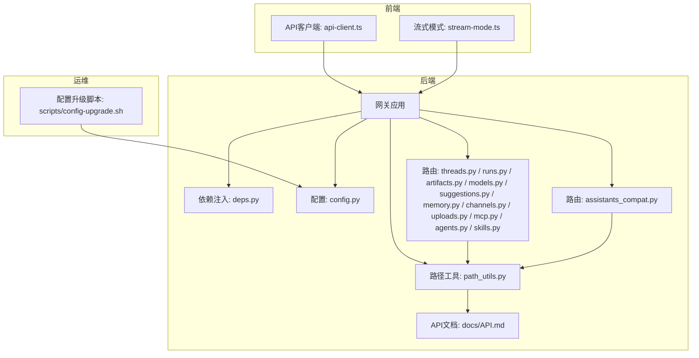
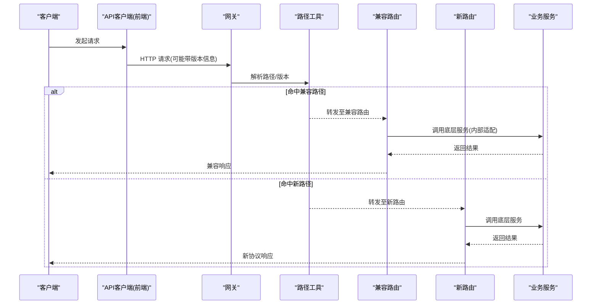
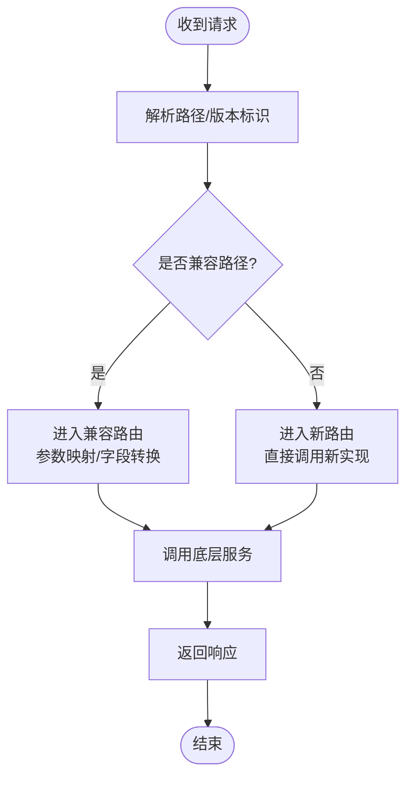
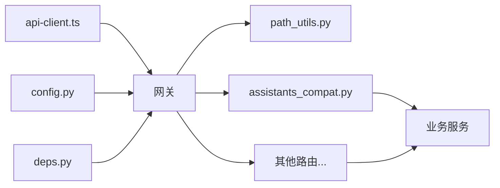

# API版本管理与兼容性

<cite>
**本文引用的文件**   
- [backend/app/gateway/routers/assistants_compat.py](file://backend/app/gateway/routers/assistants_compat.py)
- [backend/app/gateway/routers/threads.py](file://backend/app/gateway/routers/threads.py)
- [backend/app/gateway/routers/runs.py](file://backend/app/gateway/routers/runs.py)
- [backend/app/gateway/routers/artifacts.py](file://backend/app/gateway/routers/artifacts.py)
- [backend/app/gateway/routers/models.py](file://backend/app/gateway/routers/models.py)
- [backend/app/gateway/routers/suggestions.py](file://backend/app/gateway/routers/suggestions.py)
- [backend/app/gateway/routers/memory.py](file://backend/app/gateway/routers/memory.py)
- [backend/app/gateway/routers/channels.py](file://backend/app/gateway/routers/channels.py)
- [backend/app/gateway/routers/uploads.py](file://backend/app/gateway/routers/uploads.py)
- [backend/app/gateway/routers/mcp.py](file://backend/app/gateway/routers/mcp.py)
- [backend/app/gateway/routers/agents.py](file://backend/app/gateway/routers/agents.py)
- [backend/app/gateway/routers/skills.py](file://backend/app/gateway/routers/skills.py)
- [backend/app/gateway/path_utils.py](file://backend/app/gateway/path_utils.py)
- [backend/app/gateway/config.py](file://backend/app/gateway/config.py)
- [backend/app/gateway/deps.py](file://backend/app/gateway/deps.py)
- [backend/tests/test_config_version.py](file://backend/tests/test_config_version.py)
- [backend/docs/API.md](file://backend/docs/API.md)
- [frontend/src/core/api/api-client.ts](file://frontend/src/core/api/api-client.ts)
- [frontend/src/core/api/stream-mode.ts](file://frontend/src/core/api/stream-mode.ts)
- [scripts/config-upgrade.sh](file://scripts/config-upgrade.sh)
</cite>

## 目录
1. [简介](#简介)
2. [项目结构](#项目结构)
3. [核心组件](#核心组件)
4. [架构总览](#架构总览)
5. [详细组件分析](#详细组件分析)
6. [依赖关系分析](#依赖关系分析)
7. [性能考量](#性能考量)
8. [故障排查指南](#故障排查指南)
9. [结论](#结论)
10. [附录](#附录)

## 简介
本文件面向DeerFlow的API版本管理与向后兼容性，目标是帮助开发者与集成方理解：
- 版本号约定、发布周期与废弃政策
- 向后兼容性的保证边界（字段变更、新增功能、破坏性变更）
- 客户端如何检测与适配不同API版本
- 从旧版本升级到新版本的迁移步骤与注意事项
- API文档的版本化管理与在线文档切换方法
- 测试策略（兼容性测试与回归测试）
- 弃用通知与迁移工具的使用方式

## 项目结构
后端采用基于路由分发的网关架构，版本化能力集中在路由层与路径工具中；前端通过统一的API客户端进行请求封装。关键位置如下：
- 网关路由：按领域划分，包含兼容层与主路由
- 路径工具：提供统一的路径解析与版本选择逻辑
- 配置与依赖注入：集中管理版本相关配置与运行时依赖
- 测试：覆盖配置版本校验等场景
- 文档：后端API文档与前端流式模式定义
- 脚本：配置升级辅助脚本

图表来源
- [backend/app/gateway/routers/assistants_compat.py](file://backend/app/gateway/routers/assistants_compat.py)
- [backend/app/gateway/routers/threads.py](file://backend/app/gateway/routers/threads.py)
- [backend/app/gateway/routers/runs.py](file://backend/app/gateway/routers/runs.py)
- [backend/app/gateway/routers/artifacts.py](file://backend/app/gateway/routers/artifacts.py)
- [backend/app/gateway/routers/models.py](file://backend/app/gateway/routers/models.py)
- [backend/app/gateway/routers/suggestions.py](file://backend/app/gateway/routers/suggestions.py)
- [backend/app/gateway/routers/memory.py](file://backend/app/gateway/routers/memory.py)
- [backend/app/gateway/routers/channels.py](file://backend/app/gateway/routers/channels.py)
- [backend/app/gateway/routers/uploads.py](file://backend/app/gateway/routers/uploads.py)
- [backend/app/gateway/routers/mcp.py](file://backend/app/gateway/routers/mcp.py)
- [backend/app/gateway/routers/agents.py](file://backend/app/gateway/routers/agents.py)
- [backend/app/gateway/routers/skills.py](file://backend/app/gateway/routers/skills.py)
- [backend/app/gateway/path_utils.py](file://backend/app/gateway/path_utils.py)
- [backend/app/gateway/config.py](file://backend/app/gateway/config.py)
- [backend/app/gateway/deps.py](file://backend/app/gateway/deps.py)
- [backend/docs/API.md](file://backend/docs/API.md)
- [frontend/src/core/api/api-client.ts](file://frontend/src/core/api/api-client.ts)
- [frontend/src/core/api/stream-mode.ts](file://frontend/src/core/api/stream-mode.ts)
- [scripts/config-upgrade.sh](file://scripts/config-upgrade.sh)

章节来源
- [backend/app/gateway/routers/assistants_compat.py](file://backend/app/gateway/routers/assistants_compat.py)
- [backend/app/gateway/path_utils.py](file://backend/app/gateway/path_utils.py)
- [backend/app/gateway/config.py](file://backend/app/gateway/config.py)
- [backend/app/gateway/deps.py](file://backend/app/gateway/deps.py)
- [backend/docs/API.md](file://backend/docs/API.md)
- [frontend/src/core/api/api-client.ts](file://frontend/src/core/api/api-client.ts)
- [frontend/src/core/api/stream-mode.ts](file://frontend/src/core/api/stream-mode.ts)
- [scripts/config-upgrade.sh](file://scripts/config-upgrade.sh)

## 核心组件
- 兼容路由层：为旧版接口提供稳定入口，内部可转发或适配到新版实现，确保客户端无需立即改动即可继续工作。
- 路径工具：统一处理路径解析、版本选择与路由分发，是版本控制的关键枢纽。
- 配置与依赖注入：集中管理版本相关开关、默认行为与运行时依赖，便于灰度与回滚。
- 前端API客户端：封装基础URL、请求头与错误处理，支持在必要时携带版本信息或走兼容路径。
- 文档与脚本：API文档作为契约说明；配置升级脚本协助服务端平滑过渡。

章节来源
- [backend/app/gateway/routers/assistants_compat.py](file://backend/app/gateway/routers/assistants_compat.py)
- [backend/app/gateway/path_utils.py](file://backend/app/gateway/path_utils.py)
- [backend/app/gateway/config.py](file://backend/app/gateway/config.py)
- [backend/app/gateway/deps.py](file://backend/app/gateway/deps.py)
- [frontend/src/core/api/api-client.ts](file://frontend/src/core/api/api-client.ts)
- [scripts/config-upgrade.sh](file://scripts/config-upgrade.sh)

## 架构总览
下图展示了“客户端—网关—路由—路径工具—服务”的调用链，以及兼容层如何在不改变对外契约的前提下完成内部演进。

图表来源
- [backend/app/gateway/routers/assistants_compat.py](file://backend/app/gateway/routers/assistants_compat.py)
- [backend/app/gateway/path_utils.py](file://backend/app/gateway/path_utils.py)
- [backend/app/gateway/routers/threads.py](file://backend/app/gateway/routers/threads.py)
- [backend/app/gateway/routers/runs.py](file://backend/app/gateway/routers/runs.py)
- [backend/app/gateway/routers/artifacts.py](file://backend/app/gateway/routers/artifacts.py)
- [backend/app/gateway/routers/models.py](file://backend/app/gateway/routers/models.py)
- [backend/app/gateway/routers/suggestions.py](file://backend/app/gateway/routers/suggestions.py)
- [backend/app/gateway/routers/memory.py](file://backend/app/gateway/routers/memory.py)
- [backend/app/gateway/routers/channels.py](file://backend/app/gateway/routers/channels.py)
- [backend/app/gateway/routers/uploads.py](file://backend/app/gateway/routers/uploads.py)
- [backend/app/gateway/routers/mcp.py](file://backend/app/gateway/routers/mcp.py)
- [backend/app/gateway/routers/agents.py](file://backend/app/gateway/routers/agents.py)
- [backend/app/gateway/routers/skills.py](file://backend/app/gateway/routers/skills.py)

## 详细组件分析

### 兼容路由与版本分流
- 兼容路由负责承接旧版端点，并在内部做参数映射、字段转换与错误对齐，从而屏蔽后端实现变化。
- 路径工具根据请求路径或头部信息决定进入兼容路由还是新路由，从而实现无侵入的灰度与回滚。

图表来源
- [backend/app/gateway/routers/assistants_compat.py](file://backend/app/gateway/routers/assistants_compat.py)
- [backend/app/gateway/path_utils.py](file://backend/app/gateway/path_utils.py)

章节来源
- [backend/app/gateway/routers/assistants_compat.py](file://backend/app/gateway/routers/assistants_compat.py)
- [backend/app/gateway/path_utils.py](file://backend/app/gateway/path_utils.py)

### 各域路由的职责与版本化要点
- 线程与运行：threads.py、runs.py 承载会话与执行生命周期，需保证状态字段与事件流的稳定性。
- 工件与模型：artifacts.py、models.py 涉及资源与模型元数据，注意枚举值与字段语义的演进。
- 建议与记忆：suggestions.py、memory.py 关注数据结构扩展与查询语义的兼容。
- 渠道与上传：channels.py、uploads.py 涉及外部系统与IO，应保留旧格式并逐步淘汰。
- MCP与技能：mcp.py、agents.py、skills.py 需要保持插件生态的契约稳定。

章节来源
- [backend/app/gateway/routers/threads.py](file://backend/app/gateway/routers/threads.py)
- [backend/app/gateway/routers/runs.py](file://backend/app/gateway/routers/runs.py)
- [backend/app/gateway/routers/artifacts.py](file://backend/app/gateway/routers/artifacts.py)
- [backend/app/gateway/routers/models.py](file://backend/app/gateway/routers/models.py)
- [backend/app/gateway/routers/suggestions.py](file://backend/app/gateway/routers/suggestions.py)
- [backend/app/gateway/routers/memory.py](file://backend/app/gateway/routers/memory.py)
- [backend/app/gateway/routers/channels.py](file://backend/app/gateway/routers/channels.py)
- [backend/app/gateway/routers/uploads.py](file://backend/app/gateway/routers/uploads.py)
- [backend/app/gateway/routers/mcp.py](file://backend/app/gateway/routers/mcp.py)
- [backend/app/gateway/routers/agents.py](file://backend/app/gateway/routers/agents.py)
- [backend/app/gateway/routers/skills.py](file://backend/app/gateway/routers/skills.py)

### 前端API客户端与流式模式
- API客户端负责统一的基础URL、鉴权与重试策略，可在必要时附加版本信息或切换到兼容路径。
- 流式模式定义了SSE/流式响应的解析与降级策略，有助于在不同版本间平滑过渡。

章节来源
- [frontend/src/core/api/api-client.ts](file://frontend/src/core/api/api-client.ts)
- [frontend/src/core/api/stream-mode.ts](file://frontend/src/core/api/stream-mode.ts)

### 配置与依赖注入
- 配置模块集中管理版本开关、默认路由策略与特性标志，便于灰度发布与快速回滚。
- 依赖注入将版本相关的服务与中间件装配到网关，确保路由层只关注协议适配。

章节来源
- [backend/app/gateway/config.py](file://backend/app/gateway/config.py)
- [backend/app/gateway/deps.py](file://backend/app/gateway/deps.py)

### 文档与测试
- API文档作为契约说明，记录端点、字段与版本差异，指导客户端适配。
- 测试用例覆盖配置版本校验等关键路径，保障版本策略落地。

章节来源
- [backend/docs/API.md](file://backend/docs/API.md)
- [backend/tests/test_config_version.py](file://backend/tests/test_config_version.py)

## 依赖关系分析
- 路由层对路径工具存在强依赖，用于解析与分发；兼容路由对业务服务存在间接依赖。
- 前端API客户端仅依赖网关暴露的HTTP契约，不感知内部实现细节。
- 配置与依赖注入贯穿全链路，影响版本行为的生效范围。

图表来源
- [frontend/src/core/api/api-client.ts](file://frontend/src/core/api/api-client.ts)
- [backend/app/gateway/path_utils.py](file://backend/app/gateway/path_utils.py)
- [backend/app/gateway/routers/assistants_compat.py](file://backend/app/gateway/routers/assistants_compat.py)
- [backend/app/gateway/config.py](file://backend/app/gateway/config.py)
- [backend/app/gateway/deps.py](file://backend/app/gateway/deps.py)

章节来源
- [backend/app/gateway/path_utils.py](file://backend/app/gateway/path_utils.py)
- [backend/app/gateway/routers/assistants_compat.py](file://backend/app/gateway/routers/assistants_compat.py)
- [backend/app/gateway/config.py](file://backend/app/gateway/config.py)
- [backend/app/gateway/deps.py](file://backend/app/gateway/deps.py)
- [frontend/src/core/api/api-client.ts](file://frontend/src/core/api/api-client.ts)

## 性能考量
- 兼容路由引入额外映射与转换开销，建议在灰度过渡期使用，并逐步迁移到新路由。
- 路径解析应尽量轻量，避免在热路径上执行复杂计算。
- 流式响应需考虑背压与缓冲策略，防止内存占用过高。
- 配置加载与依赖注入应在启动时完成，避免请求路径上的重复初始化。

[本节为通用性能建议，不涉及具体文件分析]

## 故障排查指南
- 版本不匹配：检查客户端是否发送了正确的版本信息或访问了正确的路径；确认网关的路径解析规则。
- 兼容层异常：定位兼容路由的参数映射与字段转换逻辑，核对新旧字段语义差异。
- 配置未生效：验证配置项是否正确加载，确认灰度开关与默认策略是否符合预期。
- 文档不一致：对照API文档与实际响应，确认是否存在未更新的字段说明或示例。

章节来源
- [backend/app/gateway/routers/assistants_compat.py](file://backend/app/gateway/routers/assistants_compat.py)
- [backend/app/gateway/path_utils.py](file://backend/app/gateway/path_utils.py)
- [backend/app/gateway/config.py](file://backend/app/gateway/config.py)
- [backend/docs/API.md](file://backend/docs/API.md)

## 结论
通过“兼容路由+路径工具+配置开关”的组合，DeerFlow能够在不破坏既有客户端的前提下持续演进API。配合完善的文档、测试与迁移工具，可实现平滑升级与稳定的向后兼容。

[本节为总结性内容，不涉及具体文件分析]

## 附录

### 版本策略与约定
- 版本号约定：建议使用语义化版本，主版本表示破坏性变更，次版本表示新增功能，修订号表示非破坏性修复。
- 发布周期：建议以固定节奏发布，并为每个大版本提供至少一个兼容窗口期。
- 废弃政策：提前公告废弃计划，给出迁移指引与时间线，确保客户端有足够时间适配。

[本节为通用策略说明，不涉及具体文件分析]

### 向后兼容性保证
- 字段变更：新增字段应为可选且具备默认值；删除字段需先标记废弃并提供兼容层。
- 新增功能：通过新路径或新参数暴露，不影响现有路径的行为。
- 破坏性变更：必须提升主版本，并通过兼容路由提供过渡期支持。

[本节为通用原则说明，不涉及具体文件分析]

### 客户端检测与适配
- 版本协商：可通过请求头或路径前缀传递版本信息，由网关统一解析。
- 能力探测：客户端可调用轻量探针接口获取服务端能力与支持的版本范围。
- 降级策略：当检测到不兼容时，自动切换到兼容路径或提示用户升级。

章节来源
- [frontend/src/core/api/api-client.ts](file://frontend/src/core/api/api-client.ts)
- [backend/app/gateway/path_utils.py](file://backend/app/gateway/path_utils.py)

### 迁移指南（从旧版本升级到新版本）
- 评估影响：对照API文档，识别受影响端点与字段。
- 灰度上线：启用兼容路由与新路由并行，逐步切流。
- 客户端更新：引导客户端切换到新路径或适配新字段。
- 监控与回滚：观察错误率与延迟指标，必要时快速回滚。
- 清理旧路：在兼容窗口结束后下线兼容路由。

章节来源
- [backend/docs/API.md](file://backend/docs/API.md)
- [backend/app/gateway/routers/assistants_compat.py](file://backend/app/gateway/routers/assistants_compat.py)
- [backend/app/gateway/path_utils.py](file://backend/app/gateway/path_utils.py)

### API文档的版本化管理与在线切换
- 文档分层：按版本维护独立文档页，标注差异与迁移指引。
- 在线切换：提供版本选择器，动态加载对应版本的文档与示例。
- 自动化生成：结合代码注释与Schema自动生成文档，减少人工维护成本。

章节来源
- [backend/docs/API.md](file://backend/docs/API.md)

### 测试策略（兼容性与回归）
- 兼容性测试：针对兼容路由编写端到端用例，覆盖参数映射与字段转换。
- 回归测试：在新版本发布前，对关键路径进行全量回归，确保行为一致。
- 配置版本测试：验证配置项对版本行为的影响，包括灰度与回滚。

章节来源
- [backend/tests/test_config_version.py](file://backend/tests/test_config_version.py)

### 弃用通知与迁移工具
- 弃用通知：在响应头或日志中标注废弃字段/端点，并附带迁移链接。
- 迁移工具：提供脚本或CLI辅助批量替换旧路径与字段，降低迁移成本。
- 配置升级：使用配置升级脚本平滑过渡，避免手动修改带来的风险。

章节来源
- [scripts/config-upgrade.sh](file://scripts/config-upgrade.sh)