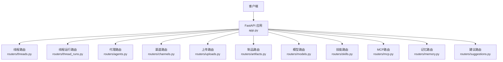
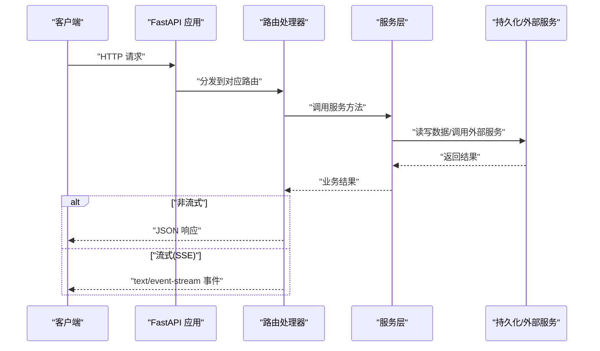
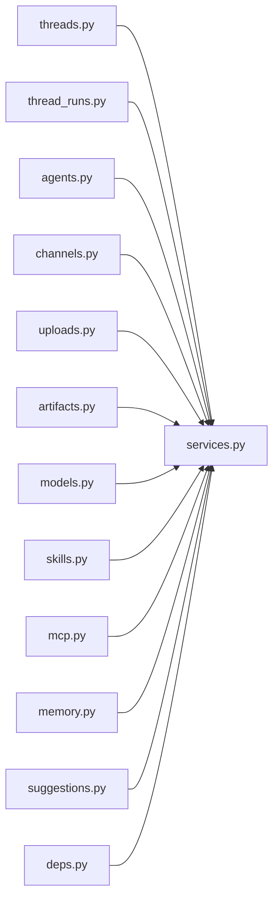

# RESTful API接口

<cite>
**本文引用的文件**   
- [backend/app/gateway/routers/threads.py](file://backend/app/gateway/routers/threads.py)
- [backend/app/gateway/routers/thread_runs.py](file://backend/app/gateway/routers/thread_runs.py)
- [backend/app/gateway/routers/agents.py](file://backend/app/gateway/routers/agents.py)
- [backend/app/gateway/routers/channels.py](file://backend/app/gateway/routers/channels.py)
- [backend/app/gateway/routers/uploads.py](file://backend/app/gateway/routers/uploads.py)
- [backend/app/gateway/routers/artifacts.py](file://backend/app/gateway/routers/artifacts.py)
- [backend/app/gateway/routers/models.py](file://backend/app/gateway/routers/models.py)
- [backend/app/gateway/routers/skills.py](file://backend/app/gateway/routers/skills.py)
- [backend/app/gateway/routers/mcp.py](file://backend/app/gateway/routers/mcp.py)
- [backend/app/gateway/routers/memory.py](file://backend/app/gateway/routers/memory.py)
- [backend/app/gateway/routers/suggestions.py](file://backend/app/gateway/routers/suggestions.py)
- [backend/app/gateway/app.py](file://backend/app/gateway/app.py)
- [backend/app/gateway/config.py](file://backend/app/gateway/config.py)
- [backend/app/gateway/deps.py](file://backend/app/gateway/deps.py)
- [backend/app/gateway/services.py](file://backend/app/gateway/services.py)
- [backend/docs/API.md](file://backend/docs/API.md)
- [backend/docs/STREAMING.md](file://backend/docs/STREAMING.md)
- [backend/docs/FILE_UPLOAD.md](file://backend/docs/FILE_UPLOAD.md)
</cite>

## 目录
1. [简介](#简介)
2. [项目结构](#项目结构)
3. [核心组件](#核心组件)
4. [架构总览](#架构总览)
5. [详细组件分析](#详细组件分析)
6. [依赖分析](#依赖分析)
7. [性能考虑](#性能考虑)
8. [故障排查指南](#故障排查指南)
9. [结论](#结论)
10. [附录](#附录)

## 简介
本文件为 DeerFlow 后端网关的 RESTful API 接口文档，覆盖线程管理、代理管理、渠道管理、文件上传、模型与技能等核心能力。文档提供端点路径、HTTP方法、请求参数、响应格式、错误码说明，以及分页、排序、过滤等通用查询参数的使用方式，并给出 curl、Python、JavaScript 客户端调用示例。

## 项目结构
DeerFlow 后端采用 FastAPI 网关模式，路由按功能域拆分到独立模块，统一挂载于应用入口。关键目录：
- backend/app/gateway/routers：各业务域的路由定义（线程、运行、代理、渠道、上传、制品、模型、技能、MCP、记忆、建议等）
- backend/app/gateway/app.py：FastAPI 应用装配与全局配置
- backend/app/gateway/config.py：网关配置项
- backend/app/gateway/deps.py：依赖注入与公共校验逻辑
- backend/app/gateway/services.py：服务层封装（跨路由复用）

图表来源
- [backend/app/gateway/app.py](file://backend/app/gateway/app.py)
- [backend/app/gateway/routers/threads.py](file://backend/app/gateway/routers/threads.py)
- [backend/app/gateway/routers/thread_runs.py](file://backend/app/gateway/routers/thread_runs.py)
- [backend/app/gateway/routers/agents.py](file://backend/app/gateway/routers/agents.py)
- [backend/app/gateway/routers/channels.py](file://backend/app/gateway/routers/channels.py)
- [backend/app/gateway/routers/uploads.py](file://backend/app/gateway/routers/uploads.py)
- [backend/app/gateway/routers/artifacts.py](file://backend/app/gateway/routers/artifacts.py)
- [backend/app/gateway/routers/models.py](file://backend/app/gateway/routers/models.py)
- [backend/app/gateway/routers/skills.py](file://backend/app/gateway/routers/skills.py)
- [backend/app/gateway/routers/mcp.py](file://backend/app/gateway/routers/mcp.py)
- [backend/app/gateway/routers/memory.py](file://backend/app/gateway/routers/memory.py)
- [backend/app/gateway/routers/suggestions.py](file://backend/app/gateway/routers/suggestions.py)

章节来源
- [backend/app/gateway/app.py](file://backend/app/gateway/app.py)
- [backend/app/gateway/config.py](file://backend/app/gateway/config.py)
- [backend/app/gateway/deps.py](file://backend/app/gateway/deps.py)
- [backend/app/gateway/services.py](file://backend/app/gateway/services.py)

## 核心组件
- 路由层：按功能域组织，每个路由文件负责一组相关端点的注册与处理。
- 服务层：封装跨路由复用的业务逻辑，如运行编排、存储访问、外部服务调用等。
- 依赖注入：通过 deps.py 提供数据库连接、认证上下文、限流策略等共享依赖。
- 配置中心：config.py 集中管理网关行为、超时、日志、安全等开关。

章节来源
- [backend/app/gateway/deps.py](file://backend/app/gateway/deps.py)
- [backend/app/gateway/services.py](file://backend/app/gateway/services.py)
- [backend/app/gateway/config.py](file://backend/app/gateway/config.py)

## 架构总览
下图展示从客户端到具体业务路由的调用关系，以及流式响应的 SSE 通道。

图表来源
- [backend/app/gateway/app.py](file://backend/app/gateway/app.py)
- [backend/app/gateway/routers/threads.py](file://backend/app/gateway/routers/threads.py)
- [backend/app/gateway/routers/thread_runs.py](file://backend/app/gateway/routers/thread_runs.py)
- [backend/app/gateway/services.py](file://backend/app/gateway/services.py)

## 详细组件分析

### 线程管理 API
- 基础路径：/api/v1/threads
- 能力：创建、列出、获取详情、更新元信息、删除线程；支持分页、排序、过滤。

常用查询参数
- page：页码，默认 1
- page_size：每页数量，默认 20
- sort_by：排序字段，如 created_at、updated_at
- order：排序方向 asc/desc
- q：全文检索关键词（可选）
- status：状态过滤（如 active、archived）

典型端点
- POST /api/v1/threads：创建线程
- GET /api/v1/threads：列表（支持分页、排序、过滤）
- GET /api/v1/threads/{thread_id}：获取详情
- PUT /api/v1/threads/{thread_id}：更新元信息
- DELETE /api/v1/threads/{thread_id}：删除线程

请求示例（curl）
- 创建线程
  - curl -X POST http://localhost:8000/api/v1/threads -H "Content-Type: application/json" -d '{"title":"测试线程","metadata":{"env":"dev"}}'
- 列出线程
  - curl "http://localhost:8000/api/v1/threads?page=1&page_size=20&sort_by=created_at&order=desc&q=测试"
- 获取详情
  - curl http://localhost:8000/api/v1/threads/{thread_id}
- 更新元信息
  - curl -X PUT http://localhost:8000/api/v1/threads/{thread_id} -H "Content-Type: application/json" -d '{"title":"新标题"}'
- 删除线程
  - curl -X DELETE http://localhost:8000/api/v1/threads/{thread_id}

响应示例（JSON）
- 列表
  - {"items":[...],"total":100,"page":1,"page_size":20}
- 详情/更新/删除成功
  - {"id":"uuid","title":"...","status":"active","created_at":"...","updated_at":"..."}

错误码
- 400：参数校验失败
- 404：线程不存在
- 409：资源冲突（如重复名称）
- 500：服务器内部错误

章节来源
- [backend/app/gateway/routers/threads.py](file://backend/app/gateway/routers/threads.py)

### 线程运行 API
- 基础路径：/api/v1/threads/{thread_id}/runs
- 能力：在指定线程中创建运行、查询运行列表、获取运行详情、取消运行、流式输出。

典型端点
- POST /api/v1/threads/{thread_id}/runs：创建运行
- GET /api/v1/threads/{thread_id}/runs：运行列表（分页、过滤）
- GET /api/v1/threads/{thread_id}/runs/{run_id}：运行详情
- DELETE /api/v1/threads/{thread_id}/runs/{run_id}：取消运行
- GET /api/v1/threads/{thread_id}/runs/{run_id}/events：SSE 流式事件

请求示例（curl）
- 创建运行
  - curl -X POST http://localhost:8000/api/v1/threads/{thread_id}/runs -H "Content-Type: application/json" -d '{"prompt":"请总结以下内容..."}'
- 获取运行详情
  - curl http://localhost:8000/api/v1/threads/{thread_id}/runs/{run_id}
- 订阅流式事件
  - curl -N http://localhost:8000/api/v1/threads/{thread_id}/runs/{run_id}/events

响应示例（JSON）
- 运行详情
  - {"id":"uuid","thread_id":"uuid","status":"running|completed|failed","result":{...},"created_at":"...","updated_at":"..."}

错误码
- 400：请求体或路径参数无效
- 404：线程或运行不存在
- 409：运行已终止或不可操作
- 500：执行异常

章节来源
- [backend/app/gateway/routers/thread_runs.py](file://backend/app/gateway/routers/thread_runs.py)
- [backend/docs/STREAMING.md](file://backend/docs/STREAMING.md)

### 代理管理 API
- 基础路径：/api/v1/agents
- 能力：创建、列出、获取详情、更新配置、删除代理；支持分页、排序、过滤。

典型端点
- POST /api/v1/agents：创建代理
- GET /api/v1/agents：列表（分页、排序、过滤）
- GET /api/v1/agents/{agent_id}：获取详情
- PUT /api/v1/agents/{agent_id}：更新配置
- DELETE /api/v1/agents/{agent_id}：删除代理

请求示例（curl）
- 创建代理
  - curl -X POST http://localhost:8000/api/v1/agents -H "Content-Type: application/json" -d '{"name":"研究助手","model":"gpt-4o-mini","tools":["web_search"],"system_prompt":"你是一个专业的研究助手。"}'
- 列出代理
  - curl "http://localhost:8000/api/v1/agents?page=1&page_size=20&sort_by=created_at&order=desc&q=研究"
- 更新配置
  - curl -X PUT http://localhost:8000/api/v1/agents/{agent_id} -H "Content-Type: application/json" -d '{"system_prompt":"更新后的提示词"}'

响应示例（JSON）
- 详情
  - {"id":"uuid","name":"研究助手","model":"gpt-4o-mini","tools":["web_search"],"system_prompt":"...","status":"active","created_at":"...","updated_at":"..."}

错误码
- 400：参数校验失败
- 404：代理不存在
- 409：名称冲突或配置不兼容
- 500：服务器内部错误

章节来源
- [backend/app/gateway/routers/agents.py](file://backend/app/gateway/routers/agents.py)

### 渠道管理 API
- 基础路径：/api/v1/channels
- 能力：多渠道连接配置（如 Slack、Discord、飞书、企业微信、Telegram、微信等），包括启用/禁用、消息收发、附件处理。

典型端点
- POST /api/v1/channels：新增渠道配置
- GET /api/v1/channels：渠道列表
- GET /api/v1/channels/{channel_id}：渠道详情
- PUT /api/v1/channels/{channel_id}：更新配置
- DELETE /api/v1/channels/{channel_id}：删除渠道
- POST /api/v1/channels/{channel_id}/messages：发送消息
- GET /api/v1/channels/{channel_id}/messages：拉取历史消息

请求示例（curl）
- 新增渠道
  - curl -X POST http://localhost:8000/api/v1/channels -H "Content-Type: application/json" -d '{"type":"slack","config":{"token":"xoxb-...","channel":"general"}}'
- 发送消息
  - curl -X POST http://localhost:8000/api/v1/channels/{channel_id}/messages -H "Content-Type: application/json" -d '{"content":"你好","attachments":[{"filename":"report.pdf","url":"https://..."}]}'

响应示例（JSON）
- 渠道详情
  - {"id":"uuid","type":"slack","status":"connected","created_at":"...","updated_at":"..."}

错误码
- 400：渠道类型或配置无效
- 404：渠道不存在
- 409：重复配置或连接冲突
- 500：渠道服务异常

章节来源
- [backend/app/gateway/routers/channels.py](file://backend/app/gateway/routers/channels.py)

### 文件上传 API
- 基础路径：/api/v1/uploads
- 能力：上传文件、获取上传状态、下载文件、删除上传记录。

典型端点
- POST /api/v1/uploads：上传文件（multipart/form-data）
- GET /api/v1/uploads/{upload_id}：获取上传详情
- GET /api/v1/uploads/{upload_id}/download：下载文件
- DELETE /api/v1/uploads/{upload_id}：删除上传记录

请求示例（curl）
- 上传文件
  - curl -X POST http://localhost:8000/api/v1/uploads -F "file=@/path/to/report.pdf" -F "metadata={\"category\":\"report\"}"
- 下载文件
  - curl -O http://localhost:8000/api/v1/uploads/{upload_id}/download

响应示例（JSON）
- 上传详情
  - {"id":"uuid","filename":"report.pdf","size":12345,"mime_type":"application/pdf","status":"uploaded","created_at":"..."}

错误码
- 400：文件格式或大小不符合限制
- 404：上传记录不存在
- 500：存储异常

章节来源
- [backend/app/gateway/routers/uploads.py](file://backend/app/gateway/routers/uploads.py)
- [backend/docs/FILE_UPLOAD.md](file://backend/docs/FILE_UPLOAD.md)

### 制品（Artifacts）API
- 基础路径：/api/v1/artifacts
- 能力：与运行产物相关的增删改查，如报告、图表、代码片段等。

典型端点
- POST /api/v1/artifacts：创建制品
- GET /api/v1/artifacts：列表（分页、过滤）
- GET /api/v1/artifacts/{artifact_id}：详情
- PUT /api/v1/artifacts/{artifact_id}：更新
- DELETE /api/v1/artifacts/{artifact_id}：删除

请求示例（curl）
- 创建制品
  - curl -X POST http://localhost:8000/api/v1/artifacts -H "Content-Type: application/json" -d '{"name":"分析报告","type":"markdown","content":"# 报告内容"}'

响应示例（JSON）
- 详情
  - {"id":"uuid","name":"分析报告","type":"markdown","status":"published","created_at":"...","updated_at":"..."}

错误码
- 400：参数校验失败
- 404：制品不存在
- 500：服务器内部错误

章节来源
- [backend/app/gateway/routers/artifacts.py](file://backend/app/gateway/routers/artifacts.py)

### 模型管理 API
- 基础路径：/api/v1/models
- 能力：列出可用模型、获取模型详情、切换默认模型。

典型端点
- GET /api/v1/models：模型列表
- GET /api/v1/models/{model_id}：模型详情
- PUT /api/v1/models/default：设置默认模型

请求示例（curl）
- 列出模型
  - curl http://localhost:8000/api/v1/models
- 设置默认模型
  - curl -X PUT http://localhost:8000/api/v1/models/default -H "Content-Type: application/json" -d '{"model_id":"gpt-4o-mini"}'

响应示例（JSON）
- 列表
  - {"models":[{"id":"gpt-4o-mini","provider":"openai","capabilities":["chat","completion"]}]}

错误码
- 404：模型不存在
- 500：服务异常

章节来源
- [backend/app/gateway/routers/models.py](file://backend/app/gateway/routers/models.py)

### 技能（Skills）API
- 基础路径：/api/v1/skills
- 能力：安装、卸载、启用/禁用、查询技能清单与详情。

典型端点
- GET /api/v1/skills：技能列表
- GET /api/v1/skills/{skill_id}：技能详情
- POST /api/v1/skills/{skill_id}/install：安装技能
- DELETE /api/v1/skills/{skill_id}：卸载技能
- PUT /api/v1/skills/{skill_id}/toggle：启用/禁用

请求示例（curl）
- 安装技能
  - curl -X POST http://localhost:8000/api/v1/skills/{skill_id}/install
- 启用技能
  - curl -X PUT http://localhost:8000/api/v1/skills/{skill_id}/toggle -H "Content-Type: application/json" -d '{"enabled":true}'

响应示例（JSON）
- 详情
  - {"id":"uuid","name":"数据分析","version":"1.0.0","status":"installed","enabled":true}

错误码
- 400：技能版本不兼容
- 404：技能不存在
- 500：安装/卸载失败

章节来源
- [backend/app/gateway/routers/skills.py](file://backend/app/gateway/routers/skills.py)

### MCP 管理 API
- 基础路径：/api/v1/mcp
- 能力：MCP 服务端配置、工具发现、调用。

典型端点
- GET /api/v1/mcp/tools：列出可用工具
- POST /api/v1/mcp/call：调用工具

请求示例（curl）
- 列出工具
  - curl http://localhost:8000/api/v1/mcp/tools
- 调用工具
  - curl -X POST http://localhost:8000/api/v1/mcp/call -H "Content-Type: application/json" -d '{"tool":"search_web","params":{"query":"DeerFlow"}}'

响应示例（JSON）
- 工具列表
  - {"tools":[{"name":"search_web","description":"搜索网页","parameters":{...}}]}

错误码
- 400：工具参数校验失败
- 404：工具不存在
- 500：MCP 服务异常

章节来源
- [backend/app/gateway/routers/mcp.py](file://backend/app/gateway/routers/mcp.py)

### 记忆（Memory）API
- 基础路径：/api/v1/memory
- 能力：读取/写入会话记忆、清理记忆、导出导入。

典型端点
- GET /api/v1/memory：读取记忆
- POST /api/v1/memory：写入记忆
- DELETE /api/v1/memory：清理记忆
- GET /api/v1/memory/export：导出记忆
- POST /api/v1/memory/import：导入记忆

请求示例（curl）
- 写入记忆
  - curl -X POST http://localhost:8000/api/v1/memory -H "Content-Type: application/json" -d '{"key":"user_preference","value":{"theme":"dark"}}'

响应示例（JSON）
- 读取记忆
  - {"memory":{"user_preference":{"theme":"dark"}}}

错误码
- 400：键值格式非法
- 500：存储异常

章节来源
- [backend/app/gateway/routers/memory.py](file://backend/app/gateway/routers/memory.py)

### 建议（Suggestions）API
- 基础路径：/api/v1/suggestions
- 能力：生成对话建议、收藏/删除建议。

典型端点
- GET /api/v1/suggestions：获取建议列表
- POST /api/v1/suggestions：生成建议
- DELETE /api/v1/suggestions/{suggestion_id}：删除建议

请求示例（curl）
- 生成建议
  - curl -X POST http://localhost:8000/api/v1/suggestions -H "Content-Type: application/json" -d '{"context":"用户当前任务摘要"}'

响应示例（JSON）
- 列表
  - {"suggestions":[{"id":"uuid","text":"下一步建议...","created_at":"..."}]}

错误码
- 400：上下文缺失
- 500：生成失败

章节来源
- [backend/app/gateway/routers/suggestions.py](file://backend/app/gateway/routers/suggestions.py)

## 依赖分析
- 路由间耦合度低，主要依赖 services.py 提供的服务方法与 deps.py 的共享依赖。
- 外部依赖包括：模型提供商、渠道服务、MCP 服务端、对象存储等。
- 潜在循环依赖：应避免在路由与服务之间互相引用，保持单向依赖。

图表来源
- [backend/app/gateway/routers/threads.py](file://backend/app/gateway/routers/threads.py)
- [backend/app/gateway/routers/thread_runs.py](file://backend/app/gateway/routers/thread_runs.py)
- [backend/app/gateway/routers/agents.py](file://backend/app/gateway/routers/agents.py)
- [backend/app/gateway/routers/channels.py](file://backend/app/gateway/routers/channels.py)
- [backend/app/gateway/routers/uploads.py](file://backend/app/gateway/routers/uploads.py)
- [backend/app/gateway/routers/artifacts.py](file://backend/app/gateway/routers/artifacts.py)
- [backend/app/gateway/routers/models.py](file://backend/app/gateway/routers/models.py)
- [backend/app/gateway/routers/skills.py](file://backend/app/gateway/routers/skills.py)
- [backend/app/gateway/routers/mcp.py](file://backend/app/gateway/routers/mcp.py)
- [backend/app/gateway/routers/memory.py](file://backend/app/gateway/routers/memory.py)
- [backend/app/gateway/routers/suggestions.py](file://backend/app/gateway/routers/suggestions.py)
- [backend/app/gateway/services.py](file://backend/app/gateway/services.py)
- [backend/app/gateway/deps.py](file://backend/app/gateway/deps.py)

章节来源
- [backend/app/gateway/services.py](file://backend/app/gateway/services.py)
- [backend/app/gateway/deps.py](file://backend/app/gateway/deps.py)

## 性能考虑
- 分页与索引：对高频查询字段建立索引，合理设置 page_size 上限。
- 流式输出：长耗时任务优先使用 SSE 流式返回，降低客户端等待时间。
- 缓存：对只读列表与配置类数据引入缓存层，减少数据库压力。
- 并发控制：对写操作进行幂等设计，避免重复提交导致的数据不一致。

## 故障排查指南
- 常见错误码
  - 400：请求参数校验失败，检查必填字段与格式
  - 404：资源不存在，确认 ID 是否正确
  - 409：资源冲突，检查唯一性约束
  - 500：服务器内部错误，查看后端日志
- 流式调试
  - 使用 curl -N 或浏览器控制台观察 SSE 事件
  - 关注事件类型与 payload 结构是否符合规范
- 上传问题
  - 检查文件大小与 MIME 类型限制
  - 确认存储后端可达性与权限

章节来源
- [backend/docs/STREAMING.md](file://backend/docs/STREAMING.md)
- [backend/docs/FILE_UPLOAD.md](file://backend/docs/FILE_UPLOAD.md)

## 结论
DeerFlow 网关以模块化路由为核心，结合服务层与依赖注入，提供了完整的线程、代理、渠道、上传、制品、模型、技能、MCP、记忆与建议等 RESTful 接口。通过统一的分页、排序、过滤机制与流式输出能力，满足复杂业务场景需求。建议在集成时遵循错误码规范与最佳实践，确保稳定性与可维护性。

## 附录

### 通用查询参数
- page：页码，整数，默认 1
- page_size：每页数量，整数，默认 20
- sort_by：排序字段，字符串
- order：排序方向，asc/desc
- q：全文检索关键词，字符串
- status：状态过滤，枚举值依资源而定

### 客户端调用示例
- curl
  - 创建线程：curl -X POST http://localhost:8000/api/v1/threads -H "Content-Type: application/json" -d '{"title":"测试线程"}'
  - 列出线程：curl "http://localhost:8000/api/v1/threads?page=1&page_size=20&sort_by=created_at&order=desc&q=测试"
  - 上传文件：curl -X POST http://localhost:8000/api/v1/uploads -F "file=@/path/to/file.pdf"
- Python（requests）
  - import requests; r = requests.post("http://localhost:8000/api/v1/threads", json={"title":"测试线程"})
- JavaScript（fetch）
  - fetch("http://localhost:8000/api/v1/threads", {method:"POST",headers:{"Content-Type":"application/json"},body:JSON.stringify({title:"测试线程"})})

### 状态码说明
- 2xx：成功
- 4xx：客户端错误（参数、权限、资源不存在）
- 5xx：服务端错误（内部异常、下游服务不可用）

章节来源
- [backend/docs/API.md](file://backend/docs/API.md)