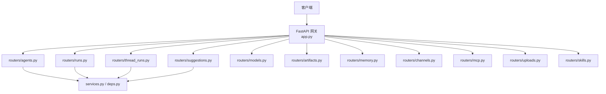
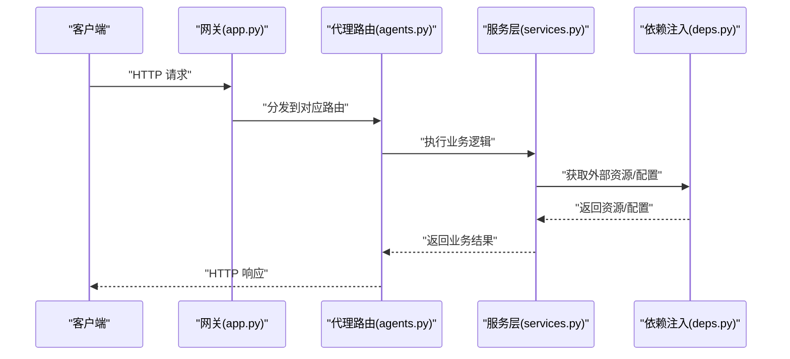
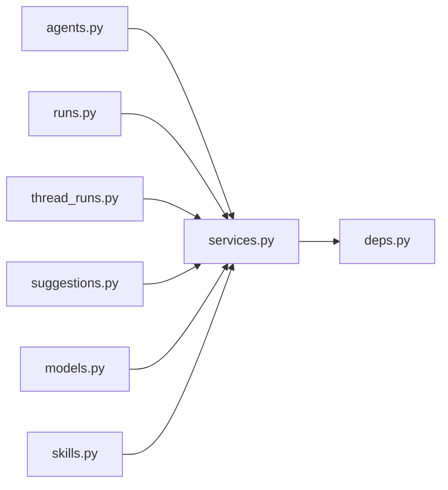

# 代理管理API

<cite>
**本文引用的文件**   
- [backend/app/gateway/routers/agents.py](file://backend/app/gateway/routers/agents.py)
- [backend/app/gateway/routers/suggestions.py](file://backend/app/gateway/routers/suggestions.py)
- [backend/app/gateway/routers/runs.py](file://backend/app/gateway/routers/runs.py)
- [backend/app/gateway/routers/thread_runs.py](file://backend/app/gateway/routers/thread_runs.py)
- [backend/app/gateway/routers/models.py](file://backend/app/gateway/routers/models.py)
- [backend/app/gateway/routers/artifacts.py](file://backend/app/gateway/routers/artifacts.py)
- [backend/app/gateway/routers/memory.py](file://backend/app/gateway/routers/memory.py)
- [backend/app/gateway/routers/channels.py](file://backend/app/gateway/routers/channels.py)
- [backend/app/gateway/routers/mcp.py](file://backend/app/gateway/routers/mcp.py)
- [backend/app/gateway/routers/uploads.py](file://backend/app/gateway/routers/uploads.py)
- [backend/app/gateway/routers/skills.py](file://backend/app/gateway/routers/skills.py)
- [backend/app/gateway/app.py](file://backend/app/gateway/app.py)
- [backend/app/gateway/config.py](file://backend/app/gateway/config.py)
- [backend/app/gateway/deps.py](file://backend/app/gateway/deps.py)
- [backend/app/gateway/services.py](file://backend/app/gateway/services.py)
- [backend/docs/API.md](file://backend/docs/API.md)
</cite>

## 目录
1. [简介](#简介)
2. [项目结构](#项目结构)
3. [核心组件](#核心组件)
4. [架构总览](#架构总览)
5. [详细组件分析](#详细组件分析)
6. [依赖分析](#依赖分析)
7. [性能考虑](#性能考虑)
8. [故障排查指南](#故障排查指南)
9. [结论](#结论)
10. [附录](#附录)

## 简介
本文件为 DeerFlow 代理管理 RESTful API 的完整文档，聚焦于代理生命周期管理的 HTTP 端点与相关能力，包括：
- 代理配置参数、执行模式、工具绑定与技能集成说明
- 代理执行 API（启动、停止、监控）
- 建议生成 API 的使用方法与时序
- 完整的请求示例与错误处理指南

该文档面向开发者与系统集成者，帮助快速理解并正确使用 DeerFlow 网关暴露的代理管理与运行接口。

## 项目结构
DeerFlow 后端采用 FastAPI 网关架构，路由按功能模块拆分在 gateway/routers 下，统一挂载到应用入口。与代理管理相关的核心路由包括 agents、runs、thread_runs、suggestions、models、artifacts、memory、channels、mcp、uploads、skills 等。

图表来源
- [backend/app/gateway/app.py](file://backend/app/gateway/app.py)
- [backend/app/gateway/routers/agents.py](file://backend/app/gateway/routers/agents.py)
- [backend/app/gateway/routers/runs.py](file://backend/app/gateway/routers/runs.py)
- [backend/app/gateway/routers/thread_runs.py](file://backend/app/gateway/routers/thread_runs.py)
- [backend/app/gateway/routers/suggestions.py](file://backend/app/gateway/routers/suggestions.py)
- [backend/app/gateway/routers/models.py](file://backend/app/gateway/routers/models.py)
- [backend/app/gateway/routers/artifacts.py](file://backend/app/gateway/routers/artifacts.py)
- [backend/app/gateway/routers/memory.py](file://backend/app/gateway/routers/memory.py)
- [backend/app/gateway/routers/channels.py](file://backend/app/gateway/routers/channels.py)
- [backend/app/gateway/routers/mcp.py](file://backend/app/gateway/routers/mcp.py)
- [backend/app/gateway/routers/uploads.py](file://backend/app/gateway/routers/uploads.py)
- [backend/app/gateway/routers/skills.py](file://backend/app/gateway/routers/skills.py)

章节来源
- [backend/app/gateway/app.py](file://backend/app/gateway/app.py)
- [backend/app/gateway/config.py](file://backend/app/gateway/config.py)

## 核心组件
- 网关应用与路由注册：负责将各功能路由挂载到统一前缀，提供统一的入口与中间件能力。
- 代理路由（agents）：提供代理的创建、查询、详情、更新、删除等生命周期管理能力。
- 运行路由（runs、thread_runs）：提供代理运行的启动、停止、状态查询、结果获取等执行期能力。
- 建议路由（suggestions）：提供基于当前上下文或历史对话的建议生成能力。
- 模型路由（models）：提供可用模型列表与选择能力。
- 其他辅助路由：artifacts、memory、channels、mcp、uploads、skills 等，用于增强代理能力与扩展性。

章节来源
- [backend/app/gateway/routers/agents.py](file://backend/app/gateway/routers/agents.py)
- [backend/app/gateway/routers/runs.py](file://backend/app/gateway/routers/runs.py)
- [backend/app/gateway/routers/thread_runs.py](file://backend/app/gateway/routers/thread_runs.py)
- [backend/app/gateway/routers/suggestions.py](file://backend/app/gateway/routers/suggestions.py)
- [backend/app/gateway/routers/models.py](file://backend/app/gateway/routers/models.py)
- [backend/app/gateway/routers/artifacts.py](file://backend/app/gateway/routers/artifacts.py)
- [backend/app/gateway/routers/memory.py](file://backend/app/gateway/routers/memory.py)
- [backend/app/gateway/routers/channels.py](file://backend/app/gateway/routers/channels.py)
- [backend/app/gateway/routers/mcp.py](file://backend/app/gateway/routers/mcp.py)
- [backend/app/gateway/routers/uploads.py](file://backend/app/gateway/routers/uploads.py)
- [backend/app/gateway/routers/skills.py](file://backend/app/gateway/routers/skills.py)

## 架构总览
下图展示了代理管理 API 的整体调用链路：客户端通过网关访问具体路由，路由层解析请求、校验参数、调用服务层，最终返回结构化响应。

图表来源
- [backend/app/gateway/app.py](file://backend/app/gateway/app.py)
- [backend/app/gateway/routers/agents.py](file://backend/app/gateway/routers/agents.py)
- [backend/app/gateway/services.py](file://backend/app/gateway/services.py)
- [backend/app/gateway/deps.py](file://backend/app/gateway/deps.py)

## 详细组件分析

### 代理生命周期管理 API
以下端点用于代理的创建、查询、详情、更新与删除。所有路径均以 /api/v1 为前缀。

- 创建代理
  - 方法：POST
  - 路径：/api/v1/agents
  - 请求体字段（示例键名）：
    - name: 字符串，代理唯一标识
    - description: 字符串，代理描述
    - model: 字符串，指定使用的模型名称
    - tools: 数组，工具集合（如搜索、代码执行、MCP 工具等）
    - skills: 数组，技能集合（如报告生成、数据分析等）
    - execution_mode: 字符串，执行模式（同步/异步/流式）
    - memory: 对象，记忆配置（短期/长期、存储策略）
    - guardrails: 对象，安全护栏配置（内容过滤、速率限制）
    - sandbox: 对象，沙箱配置（隔离环境、权限控制）
    - metadata: 对象，自定义元数据
  - 成功响应：返回已创建的代理信息（包含 id、name、status、created_at 等）
  - 常见错误：
    - 400 参数校验失败
    - 409 名称冲突
    - 500 内部错误

- 查询代理列表
  - 方法：GET
  - 路径：/api/v1/agents
  - 查询参数：
    - page: 整数，页码
    - size: 整数，每页数量
    - sort_by: 字符串，排序字段
    - order: 字符串，升序/降序
    - filter: 字符串，过滤条件（如 status=active）
  - 成功响应：分页结果（items、total、page、size）

- 获取代理详情
  - 方法：GET
  - 路径：/api/v1/agents/{agent_name}
  - 路径参数：
    - agent_name: 字符串，代理名称
  - 成功响应：返回代理完整配置与运行时状态

- 更新代理配置
  - 方法：PUT
  - 路径：/api/v1/agents/{agent_name}
  - 请求体字段：同创建时字段，支持增量更新
  - 成功响应：返回更新后的代理信息

- 删除代理
  - 方法：DELETE
  - 路径：/api/v1/agents/{agent_name}
  - 成功响应：返回确认消息或空体

请求示例（以 JSON 为例）
- 创建代理
  - 请求体示例键值：
    - {
        "name": "research_assistant",
        "description": "研究助手",
        "model": "gpt-4o",
        "tools": ["web_search", "code_executor"],
        "skills": ["deep_research", "report_generation"],
        "execution_mode": "async",
        "memory": {"type": "vector", "ttl": 3600},
        "guardrails": {"enabled": true, "filters": ["pii"]},
        "sandbox": {"mode": "docker", "timeout": 120},
        "metadata": {"owner": "team-a"}
      }
  - 响应示例键值：
    - {
        "id": "a1b2c3d4",
        "name": "research_assistant",
        "status": "created",
        "created_at": "2025-01-01T00:00:00Z"
      }

- 查询代理列表
  - 查询参数示例：
    - ?page=1&size=10&sort_by=created_at&order=desc&filter=status%3Dactive
  - 响应示例键值：
    - {
        "items": [{"id": "...", "name": "...", "status": "..."}],
        "total": 100,
        "page": 1,
        "size": 10
      }

- 获取代理详情
  - 响应示例键值：
    - {
        "id": "...",
        "name": "...",
        "config": {...},
        "status": "running",
        "updated_at": "..."
      }

- 更新代理配置
  - 请求体示例键值：
    - {
        "tools": ["web_search", "code_executor", "mcp_client"],
        "execution_mode": "streaming",
        "memory": {"type": "redis", "ttl": 7200}
      }
  - 响应示例键值：
    - {
        "id": "...",
        "name": "...",
        "status": "updated",
        "updated_at": "..."
      }

- 删除代理
  - 响应示例键值：
    - {
        "message": "Agent deleted successfully"
      }

错误处理指南
- 400 Bad Request：请求体缺失必填字段或格式不正确
- 404 Not Found：代理不存在
- 409 Conflict：代理名称冲突
- 422 Unprocessable Entity：参数校验失败
- 500 Internal Server Error：服务器内部错误

章节来源
- [backend/app/gateway/routers/agents.py](file://backend/app/gateway/routers/agents.py)

### 代理执行 API（启动、停止、监控）
- 启动代理运行
  - 方法：POST
  - 路径：/api/v1/runs
  - 请求体字段：
    - agent_name: 字符串，目标代理
    - prompt: 字符串，用户输入
    - mode: 字符串，执行模式（sync/async/stream）
    - thread_id: 可选，会话标识
    - artifacts: 可选，附件或上下文数据
  - 成功响应：返回运行 ID 与初始状态

- 停止代理运行
  - 方法：DELETE
  - 路径：/api/v1/runs/{run_id}
  - 成功响应：返回停止确认

- 查询运行状态
  - 方法：GET
  - 路径：/api/v1/runs/{run_id}
  - 成功响应：返回运行状态、进度、输出摘要

- 线程化运行（会话级）
  - 方法：POST
  - 路径：/api/v1/thread-runs
  - 请求体字段：
    - thread_id: 字符串，会话标识
    - agent_name: 字符串，目标代理
    - messages: 数组，多轮对话消息
  - 成功响应：返回运行 ID 与增量结果

- 线程化运行状态
  - 方法：GET
  - 路径：/api/v1/thread-runs/{thread_id}/runs/{run_id}
  - 成功响应：返回线程内特定运行的状态与输出

请求示例（JSON）
- 启动运行
  - 请求体示例键值：
    - {
        "agent_name": "research_assistant",
        "prompt": "请总结最新技术趋势",
        "mode": "stream",
        "thread_id": "t-001",
        "artifacts": []
      }
  - 响应示例键值：
    - {
        "run_id": "r-abc123",
        "status": "started",
        "created_at": "..."
      }

- 停止运行
  - 响应示例键值：
    - {
        "message": "Run stopped"
      }

- 查询运行状态
  - 响应示例键值：
    - {
        "run_id": "r-abc123",
        "status": "completed",
        "output_summary": "...",
        "duration_ms": 1234
      }

- 线程化运行
  - 请求体示例键值：
    - {
        "thread_id": "t-001",
        "agent_name": "research_assistant",
        "messages": [
          {"role": "user", "content": "你好"},
          {"role": "assistant", "content": "有什么可以帮你的？"}
        ]
      }
  - 响应示例键值：
    - {
        "run_id": "r-def456",
        "status": "processing",
        "delta": "部分输出片段"
      }

章节来源
- [backend/app/gateway/routers/runs.py](file://backend/app/gateway/routers/runs.py)
- [backend/app/gateway/routers/thread_runs.py](file://backend/app/gateway/routers/thread_runs.py)

### 建议生成 API
- 获取建议
  - 方法：GET
  - 路径：/api/v1/suggestions
  - 查询参数：
    - context: 字符串，上下文提示
    - history: 字符串，历史消息摘要
    - limit: 整数，建议数量上限
  - 成功响应：返回建议列表（文本片段）

- 生成建议（基于当前运行）
  - 方法：POST
  - 路径：/api/v1/suggestions
  - 请求体字段：
    - run_id: 字符串，关联的运行 ID
    - type: 字符串，建议类型（follow-up/summary/next-step）
  - 成功响应：返回建议列表

请求示例（JSON）
- 获取建议
  - 查询参数示例：
    - ?context=技术趋势&history=最近一周讨论&limit=5
  - 响应示例键值：
    - {
        "suggestions": ["深入分析AI模型优化", "关注边缘计算进展", "探索大模型安全治理"]
      }

- 生成建议
  - 请求体示例键值：
    - {
        "run_id": "r-abc123",
        "type": "follow-up"
      }
  - 响应示例键值：
    - {
        "suggestions": ["是否需要进一步细化某个方向？", "是否要对比不同方案？"]
      }

章节来源
- [backend/app/gateway/routers/suggestions.py](file://backend/app/gateway/routers/suggestions.py)

### 模型与工具、技能集成
- 模型列表
  - 方法：GET
  - 路径：/api/v1/models
  - 成功响应：返回可用模型清单（名称、供应商、能力标签）

- 工具与技能
  - 工具：通过 agents 配置的 tools 字段绑定，支持内置与 MCP 工具
  - 技能：通过 agents 配置的 skills 字段集成，支持安装、启用、版本管理

章节来源
- [backend/app/gateway/routers/models.py](file://backend/app/gateway/routers/models.py)
- [backend/app/gateway/routers/skills.py](file://backend/app/gateway/routers/skills.py)

### 其他辅助能力
- 工件（Artifacts）：上传、下载、列出运行产物
- 记忆（Memory）：读写短期/长期记忆
- 通道（Channels）：接入 Discord、Slack、飞书、微信等平台
- MCP：管理 Model Context Protocol 客户端与工具
- 上传（Uploads）：通用文件上传与管理

章节来源
- [backend/app/gateway/routers/artifacts.py](file://backend/app/gateway/routers/artifacts.py)
- [backend/app/gateway/routers/memory.py](file://backend/app/gateway/routers/memory.py)
- [backend/app/gateway/routers/channels.py](file://backend/app/gateway/routers/channels.py)
- [backend/app/gateway/routers/mcp.py](file://backend/app/gateway/routers/mcp.py)
- [backend/app/gateway/routers/uploads.py](file://backend/app/gateway/routers/uploads.py)

## 依赖分析
- 路由耦合度：各路由相对独立，职责清晰，便于扩展与维护
- 服务层依赖：路由层通过 services.py 与 deps.py 解耦外部资源与配置
- 外部集成：模型、工具、技能、通道、MCP 等通过配置与插件机制集成

图表来源
- [backend/app/gateway/routers/agents.py](file://backend/app/gateway/routers/agents.py)
- [backend/app/gateway/routers/runs.py](file://backend/app/gateway/routers/runs.py)
- [backend/app/gateway/routers/thread_runs.py](file://backend/app/gateway/routers/thread_runs.py)
- [backend/app/gateway/routers/suggestions.py](file://backend/app/gateway/routers/suggestions.py)
- [backend/app/gateway/routers/models.py](file://backend/app/gateway/routers/models.py)
- [backend/app/gateway/routers/skills.py](file://backend/app/gateway/routers/skills.py)
- [backend/app/gateway/services.py](file://backend/app/gateway/services.py)
- [backend/app/gateway/deps.py](file://backend/app/gateway/deps.py)

章节来源
- [backend/app/gateway/services.py](file://backend/app/gateway/services.py)
- [backend/app/gateway/deps.py](file://backend/app/gateway/deps.py)

## 性能考虑
- 流式响应：对于长耗时任务建议使用 streaming 模式，降低首字节延迟
- 分页与过滤：列表接口应使用分页与过滤，避免一次性返回大量数据
- 缓存策略：对静态配置（如模型列表）进行缓存，减少重复查询
- 并发控制：对高并发场景增加限流与队列机制，保护后端稳定性

## 故障排查指南
- 常见问题
  - 400/422：检查请求体字段与类型是否符合规范
  - 404：确认代理名称或运行 ID 是否正确
  - 409：更换代理名称以避免冲突
  - 500：查看服务端日志，定位异常堆栈
- 调试建议
  - 开启网关调试日志
  - 使用最小可复现请求体逐步缩小问题范围
  - 检查外部依赖（模型、工具、MCP）连通性与鉴权

章节来源
- [backend/docs/API.md](file://backend/docs/API.md)

## 结论
本文档系统梳理了 DeerFlow 代理管理 RESTful API 的核心能力，涵盖代理生命周期管理、执行期控制、建议生成以及模型与工具、技能的集成方式。通过清晰的端点定义、请求/响应示例与错误处理指南，读者可以快速上手并稳定集成 DeerFlow 的代理管理能力。

## 附录
- 术语表
  - 代理（Agent）：具备特定能力与配置的 AI 实体
  - 运行（Run）：一次代理执行的实例
  - 线程（Thread）：会话级上下文，承载多轮交互
  - 工具（Tool）：可被代理调用的外部能力
  - 技能（Skill）：可被代理启用的模块化能力包
  - 工件（Artifact）：运行过程中产生的产物（文件、报告等）
  - 记忆（Memory）：短期/长期上下文存储
  - 通道（Channel）：与外部平台对接的消息通道
  - MCP：Model Context Protocol，标准化模型上下文协议