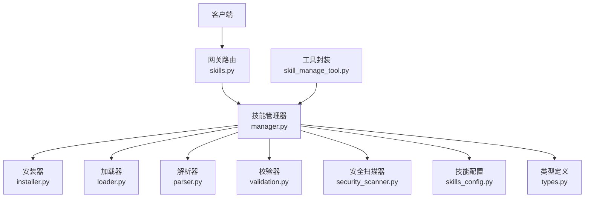
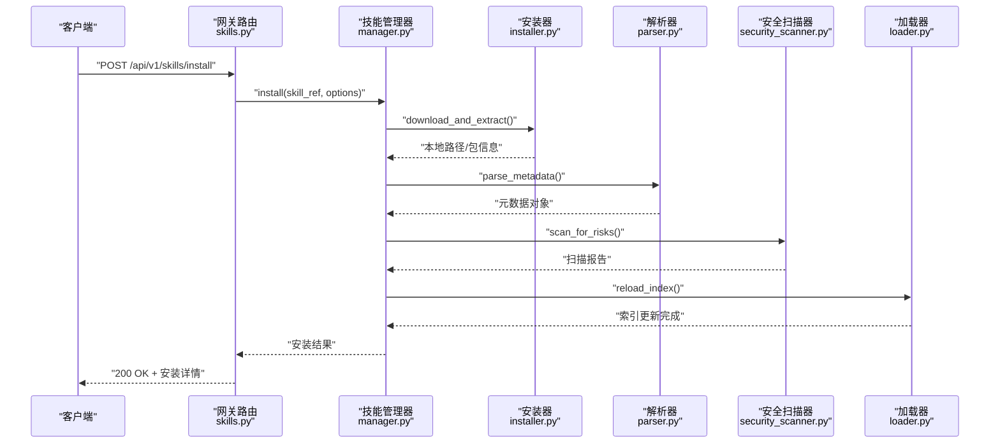
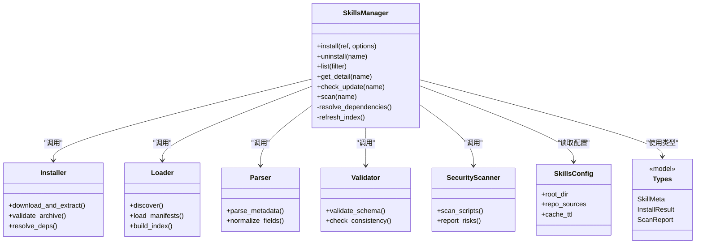

# 技能管理API

<cite>
**本文引用的文件**   
- [backend/app/gateway/routers/skills.py](file://backend/app/gateway/routers/skills.py)
- [backend/packages/harness/deerflow/skills/manager.py](file://backend/packages/harness/deerflow/skills/manager.py)
- [backend/packages/harness/deerflow/skills/installer.py](file://backend/packages/harness/deerflow/skills/installer.py)
- [backend/packages/harness/deerflow/skills/loader.py](file://backend/packages/harness/deerflow/skills/loader.py)
- [backend/packages/harness/deerflow/skills/parser.py](file://backend/packages/harness/deerflow/skills/parser.py)
- [backend/packages/harness/deerflow/skills/security_scanner.py](file://backend/packages/harness/deerflow/skills/security_scanner.py)
- [backend/packages/harness/deerflow/skills/validation.py](file://backend/packages/harness/deerflow/skills/validation.py)
- [backend/packages/harness/deerflow/skills/types.py](file://backend/packages/harness/deerflow/skills/types.py)
- [backend/packages/harness/deerflow/config/skills_config.py](file://backend/packages/harness/deerflow/config/skills_config.py)
- [backend/packages/harness/deerflow/tools/skill_manage_tool.py](file://backend/packages/harness/deerflow/tools/skill_manage_tool.py)
- [backend/tests/test_skills_custom_router.py](file://backend/tests/test_skills_custom_router.py)
- [backend/tests/test_skills_installer.py](file://backend/tests/test_skills_installer.py)
- [backend/tests/test_skills_loader.py](file://backend/tests/test_skills_loader.py)
- [backend/tests/test_skills_parser.py](file://backend/tests/test_skills_parser.py)
- [backend/tests/test_skills_validation.py](file://backend/tests/test_skills_validation.py)
- [backend/tests/test_security_scanner.py](file://backend/tests/test_security_scanner.py)
- [skills/public/bootstrap/SKILL.md](file://skills/public/bootstrap/SKILL.md)
</cite>

## 目录
1. [简介](#简介)
2. [项目结构](#项目结构)
3. [核心组件](#核心组件)
4. [架构总览](#架构总览)
5. [详细组件分析](#详细组件分析)
6. [依赖关系分析](#依赖关系分析)
7. [性能考虑](#性能考虑)
8. [故障排查指南](#故障排查指南)
9. [结论](#结论)
10. [附录](#附录)

## 简介
本文件面向DeerFlow技能生态系统的RESTful API，聚焦“技能生命周期管理”的接口与实现。文档覆盖：
- 技能安装、列表查询、详情获取、卸载等HTTP端点
- 技能包结构与元数据规范（SKILL.md）
- 依赖管理与版本控制机制
- 技能市场浏览、搜索与筛选能力
- 权限验证、安全扫描与更新检查
- 开发集成示例与最佳实践

## 项目结构
后端网关通过路由层暴露技能相关API，调用技能管理器进行安装、卸载、加载与校验；解析器与安全扫描器负责解析技能元数据与执行安全检查；配置模块提供技能目录、仓库源、缓存策略等参数。

图示来源
- [backend/app/gateway/routers/skills.py](file://backend/app/gateway/routers/skills.py)
- [backend/packages/harness/deerflow/skills/manager.py](file://backend/packages/harness/deerflow/skills/manager.py)
- [backend/packages/harness/deerflow/skills/installer.py](file://backend/packages/harness/deerflow/skills/installer.py)
- [backend/packages/harness/deerflow/skills/loader.py](file://backend/packages/harness/deerflow/skills/loader.py)
- [backend/packages/harness/deerflow/skills/parser.py](file://backend/packages/harness/deerflow/skills/parser.py)
- [backend/packages/harness/deerflow/skills/validation.py](file://backend/packages/harness/deerflow/skills/validation.py)
- [backend/packages/harness/deerflow/skills/security_scanner.py](file://backend/packages/harness/deerflow/skills/security_scanner.py)
- [backend/packages/harness/deerflow/config/skills_config.py](file://backend/packages/harness/deerflow/config/skills_config.py)
- [backend/packages/harness/deerflow/tools/skill_manage_tool.py](file://backend/packages/harness/deerflow/tools/skill_manage_tool.py)

章节来源
- [backend/app/gateway/routers/skills.py](file://backend/app/gateway/routers/skills.py)
- [backend/packages/harness/deerflow/skills/manager.py](file://backend/packages/harness/deerflow/skills/manager.py)
- [backend/packages/harness/deerflow/config/skills_config.py](file://backend/packages/harness/deerflow/config/skills_config.py)

## 核心组件
- 网关路由层：注册并处理 /api/v1/skills 系列请求，统一入参校验与错误响应。
- 技能管理器：协调安装、卸载、加载、解析、校验、扫描与缓存，维护已安装技能索引。
- 安装器：从本地或远程仓库拉取技能包，解压到目标目录，处理依赖与版本约束。
- 加载器：按约定路径发现并加载已安装技能，构建运行时可用清单。
- 解析器：读取并解析 SKILL.md 中的元数据（名称、版本、描述、依赖、脚本入口等）。
- 校验器：对元数据与包结构进行一致性校验，确保可被系统正确消费。
- 安全扫描器：对脚本与资源进行静态检查，拦截高风险操作。
- 配置：技能根目录、仓库源、缓存策略、扫描规则等。
- 类型定义：统一的技能元数据结构与返回模型。

章节来源
- [backend/packages/harness/deerflow/skills/manager.py](file://backend/packages/harness/deerflow/skills/manager.py)
- [backend/packages/harness/deerflow/skills/installer.py](file://backend/packages/harness/deerflow/skills/installer.py)
- [backend/packages/harness/deerflow/skills/loader.py](file://backend/packages/harness/deerflow/skills/loader.py)
- [backend/packages/harness/deerflow/skills/parser.py](file://backend/packages/harness/deerflow/skills/parser.py)
- [backend/packages/harness/deerflow/skills/validation.py](file://backend/packages/harness/deerflow/skills/validation.py)
- [backend/packages/harness/deerflow/skills/security_scanner.py](file://backend/packages/harness/deerflow/skills/security_scanner.py)
- [backend/packages/harness/deerflow/config/skills_config.py](file://backend/packages/harness/deerflow/config/skills_config.py)
- [backend/packages/harness/deerflow/skills/types.py](file://backend/packages/harness/deerflow/skills/types.py)

## 架构总览
下图展示一次“安装技能”的典型调用链：网关路由接收请求，交由管理器协调安装器完成下载与解压，随后由解析器与安全扫描器对包内容进行解析与检查，最终由加载器刷新索引并返回结果。

图示来源
- [backend/app/gateway/routers/skills.py](file://backend/app/gateway/routers/skills.py)
- [backend/packages/harness/deerflow/skills/manager.py](file://backend/packages/harness/deerflow/skills/manager.py)
- [backend/packages/harness/deerflow/skills/installer.py](file://backend/packages/harness/deerflow/skills/installer.py)
- [backend/packages/harness/deerflow/skills/parser.py](file://backend/packages/harness/deerflow/skills/parser.py)
- [backend/packages/harness/deerflow/skills/security_scanner.py](file://backend/packages/harness/deerflow/skills/security_scanner.py)
- [backend/packages/harness/deerflow/skills/loader.py](file://backend/packages/harness/deerflow/skills/loader.py)

## 详细组件分析

### 技能生命周期管理API
以下端点用于管理技能的完整生命周期。所有路径前缀为 /api/v1/skills。

- 安装技能
  - 方法：POST
  - 路径：/api/v1/skills/install
  - 功能：从指定源安装技能，支持本地路径或远程仓库引用；可选参数包括目标版本、是否强制覆盖、是否跳过安全扫描等。
  - 成功响应：返回安装后的技能标识、版本、路径及扫描结果摘要。
  - 失败场景：源不可达、包结构不合法、安全扫描未通过、依赖冲突等。

- 列出已安装技能
  - 方法：GET
  - 路径：/api/v1/skills
  - 功能：返回当前环境已安装的技能清单，包含名称、版本、状态、最后更新时间等。
  - 查询参数：可按名称、版本范围、状态过滤。

- 获取技能详情
  - 方法：GET
  - 路径：/api/v1/skills/{skill_name}
  - 功能：返回指定技能的详细信息，包括元数据、依赖、脚本入口、模板与参考文档等。
  - 失败场景：技能不存在、元数据缺失或不一致。

- 卸载技能
  - 方法：DELETE
  - 路径：/api/v1/skills/{skill_name}
  - 功能：移除指定技能及其关联资源，清理索引与缓存。
  - 失败场景：技能未安装、正在使用中、权限不足。

- 更新检查
  - 方法：GET
  - 路径：/api/v1/skills/{skill_name}/update-check
  - 功能：对比本地已安装版本与仓库最新版本，返回是否有可用更新及变更摘要。
  - 失败场景：仓库不可达、版本解析失败。

- 安全扫描
  - 方法：POST
  - 路径：/api/v1/skills/{skill_name}/scan
  - 功能：对已安装技能重新执行安全扫描，返回风险项与建议修复措施。
  - 失败场景：扫描引擎异常、文件访问受限。

- 市场浏览与搜索
  - 方法：GET
  - 路径：/api/v1/skills/market
  - 功能：列出仓库中可安装的技能集合，支持分页、关键词搜索与分类筛选。
  - 查询参数：q（关键词）、category（分类）、author（作者）、min_version（最低版本）、page/page_size（分页）。
  - 失败场景：仓库不可达、索引为空。

- 自定义扩展点
  - 方法：GET
  - 路径：/api/v1/skills/custom
  - 功能：返回自定义路由或插件能力说明，便于第三方扩展。
  - 失败场景：未启用自定义扩展。

注意：
- 上述端点的实际行为以网关路由与技能管理器实现为准。若某些端点在代码中未实现，将返回相应错误码与提示信息。
- 建议客户端在调用安装与卸载接口时携带幂等键或版本号，避免重复操作导致的状态不一致。

章节来源
- [backend/app/gateway/routers/skills.py](file://backend/app/gateway/routers/skills.py)
- [backend/packages/harness/deerflow/skills/manager.py](file://backend/packages/harness/deerflow/skills/manager.py)
- [backend/tests/test_skills_custom_router.py](file://backend/tests/test_skills_custom_router.py)

### 技能包结构与元数据规范
- 根文件：SKILL.md
  - 必须字段：名称、版本、描述、作者、许可证、依赖声明、脚本入口、模板与参考文档路径等。
  - 可选字段：图标、标签、兼容性矩阵、更新说明等。
- 目录约定：
  - scripts/：可执行脚本（Shell/Python等），需通过安全扫描。
  - templates/：输出模板文件。
  - references/：参考文档与SOP。
  - assets/：静态资源（图片、样式等）。
- 版本控制：
  - 使用语义化版本（SemVer），安装时可指定精确版本或范围。
  - 更新检查基于仓库标签或发布记录比对。

章节来源
- [backend/packages/harness/deerflow/skills/parser.py](file://backend/packages/harness/deerflow/skills/parser.py)
- [backend/packages/harness/deerflow/skills/validation.py](file://backend/packages/harness/deerflow/skills/validation.py)
- [skills/public/bootstrap/SKILL.md](file://skills/public/bootstrap/SKILL.md)

### 依赖管理与版本控制机制
- 依赖声明：
  - 在 SKILL.md 中声明外部依赖（如工具、库、环境变量、服务地址）。
  - 安装器会尝试自动满足基础依赖，必要时提示用户手动配置。
- 版本约束：
  - 支持精确版本与范围匹配，冲突时优先保留更高兼容版本。
  - 更新检查仅比较主版本与次版本，补丁版本默认忽略。
- 缓存策略：
  - 已解析的元数据与扫描结果可缓存，减少重复IO与计算开销。
  - 缓存失效条件：源内容变更、配置更新、强制刷新。

章节来源
- [backend/packages/harness/deerflow/skills/installer.py](file://backend/packages/harness/deerflow/skills/installer.py)
- [backend/packages/harness/deerflow/skills/loader.py](file://backend/packages/harness/deerflow/skills/loader.py)
- [backend/packages/harness/deerflow/config/skills_config.py](file://backend/packages/harness/deerflow/config/skills_config.py)

### 权限验证、安全扫描与更新检查
- 权限验证：
  - 安装与卸载需要管理员权限；普通用户仅能浏览与查询。
  - 可通过网关中间件或令牌校验实现。
- 安全扫描：
  - 对脚本与资源进行静态检查，识别潜在风险（如危险命令、网络外联、敏感信息泄露）。
  - 扫描结果可配置为阻断或告警模式。
- 更新检查：
  - 定期或按需触发，对比本地与仓库版本，生成更新建议。
  - 支持灰度发布与回滚策略。

章节来源
- [backend/packages/harness/deerflow/skills/security_scanner.py](file://backend/packages/harness/deerflow/skills/security_scanner.py)
- [backend/packages/harness/deerflow/skills/manager.py](file://backend/packages/harness/deerflow/skills/manager.py)

### 开发集成示例与最佳实践
- 快速开始：
  - 准备 SKILL.md 与必要目录结构，遵循命名与路径约定。
  - 使用安装器进行本地测试，确认解析与扫描通过。
- 调试技巧：
  - 开启详细日志，定位解析失败与扫描告警原因。
  - 使用单元测试模拟仓库与文件系统，验证边界情况。
- 最佳实践：
  - 保持元数据简洁明确，避免歧义。
  - 脚本最小权限原则，避免高危操作。
  - 提供清晰的升级说明与回滚方案。

章节来源
- [backend/packages/harness/deerflow/tools/skill_manage_tool.py](file://backend/packages/harness/deerflow/tools/skill_manage_tool.py)
- [backend/tests/test_skills_installer.py](file://backend/tests/test_skills_installer.py)
- [backend/tests/test_skills_loader.py](file://backend/tests/test_skills_loader.py)
- [backend/tests/test_skills_parser.py](file://backend/tests/test_skills_parser.py)
- [backend/tests/test_skills_validation.py](file://backend/tests/test_skills_validation.py)
- [backend/tests/test_security_scanner.py](file://backend/tests/test_security_scanner.py)

## 依赖关系分析
技能管理器作为中枢，聚合安装、加载、解析、校验与扫描能力；配置模块提供全局参数；类型定义保证接口契约稳定。

图示来源
- [backend/packages/harness/deerflow/skills/manager.py](file://backend/packages/harness/deerflow/skills/manager.py)
- [backend/packages/harness/deerflow/skills/installer.py](file://backend/packages/harness/deerflow/skills/installer.py)
- [backend/packages/harness/deerflow/skills/loader.py](file://backend/packages/harness/deerflow/skills/loader.py)
- [backend/packages/harness/deerflow/skills/parser.py](file://backend/packages/harness/deerflow/skills/parser.py)
- [backend/packages/harness/deerflow/skills/validation.py](file://backend/packages/harness/deerflow/skills/validation.py)
- [backend/packages/harness/deerflow/skills/security_scanner.py](file://backend/packages/harness/deerflow/skills/security_scanner.py)
- [backend/packages/harness/deerflow/config/skills_config.py](file://backend/packages/harness/deerflow/config/skills_config.py)
- [backend/packages/harness/deerflow/skills/types.py](file://backend/packages/harness/deerflow/skills/types.py)

章节来源
- [backend/packages/harness/deerflow/skills/manager.py](file://backend/packages/harness/deerflow/skills/manager.py)
- [backend/packages/harness/deerflow/skills/types.py](file://backend/packages/harness/deerflow/skills/types.py)

## 性能考虑
- 索引与缓存：
  - 对已解析的元数据与扫描结果进行缓存，降低重复IO与CPU消耗。
  - 合理设置缓存TTL，平衡一致性与性能。
- 并发与锁：
  - 安装与卸载操作应加锁，避免并发修改索引导致的竞争条件。
- 流式处理：
  - 大体积技能包采用分块下载与增量更新，减少内存占用。
- 扫描优化：
  - 并行扫描脚本与资源，限制最大并发数，防止系统过载。

[本节为通用指导，无需具体文件来源]

## 故障排查指南
- 安装失败：
  - 检查源可达性与认证配置，确认仓库URL与凭据正确。
  - 查看解析与校验日志，定位元数据缺失或格式错误。
- 安全扫描告警：
  - 根据扫描报告修复高风险脚本，调整扫描规则或白名单。
- 更新检查无结果：
  - 确认仓库索引可用，检查版本标签是否符合语义化版本。
- 权限问题：
  - 验证调用方令牌与角色权限，确保具备安装/卸载所需权限。

章节来源
- [backend/tests/test_skills_installer.py](file://backend/tests/test_skills_installer.py)
- [backend/tests/test_security_scanner.py](file://backend/tests/test_security_scanner.py)
- [backend/tests/test_skills_loader.py](file://backend/tests/test_skills_loader.py)

## 结论
DeerFlow技能生态系统通过清晰的分层设计与完善的校验与扫描机制，提供了稳定的技能生命周期管理能力。开发者应遵循包结构与元数据规范，结合安全扫描与权限控制，构建高质量的可复用技能。

[本节为总结性内容，无需具体文件来源]

## 附录
- 术语表：
  - 技能：一组可复用的工作流与工具的集合，通过SKILL.md描述其元数据与行为。
  - 仓库：托管技能包的远程或本地源，支持多源与镜像。
  - 索引：已安装技能的元数据与状态汇总，供查询与调度使用。
- 参考实现：
  - 内置示例技能位于 skills/public 目录，可作为开发起点。

章节来源
- [skills/public/bootstrap/SKILL.md](file://skills/public/bootstrap/SKILL.md)