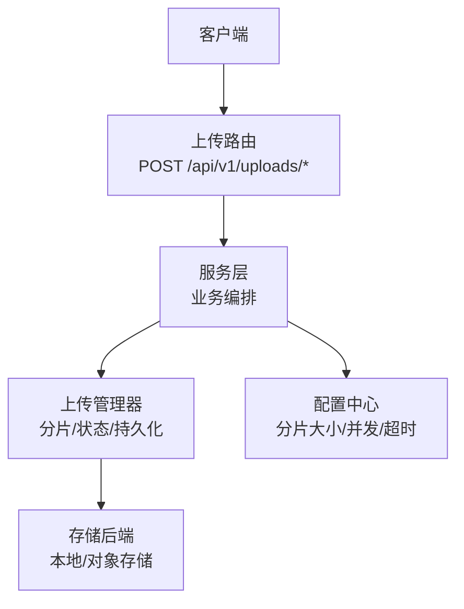
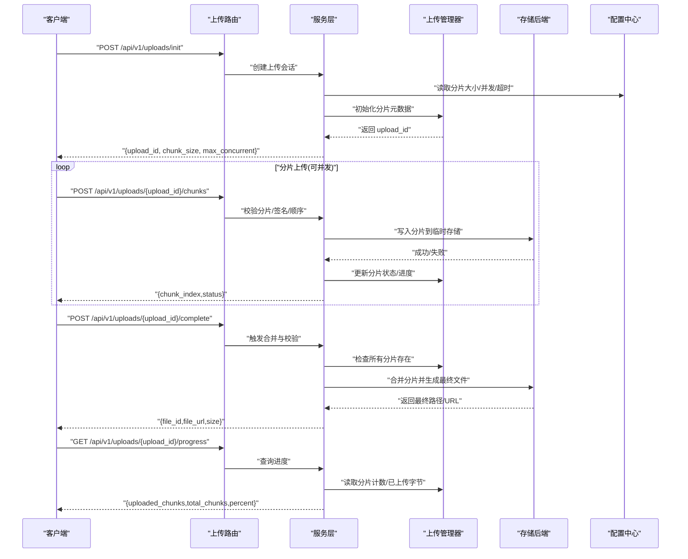
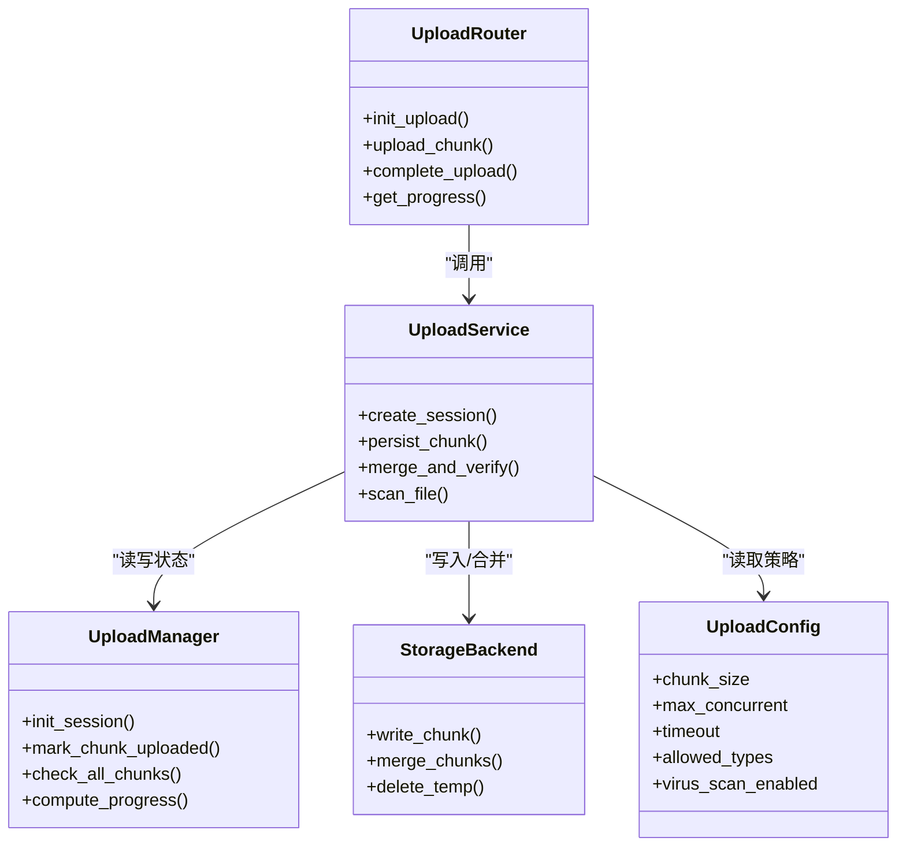

# 文件上传API

<cite>
**本文引用的文件**   
- [backend/app/gateway/routers/uploads.py](file://backend/app/gateway/routers/uploads.py)
- [backend/app/gateway/config.py](file://backend/app/gateway/config.py)
- [backend/app/gateway/services.py](file://backend/app/gateway/services.py)
- [backend/docs/FILE_UPLOAD.md](file://backend/docs/FILE_UPLOAD.md)
- [backend/tests/test_uploads_router.py](file://backend/tests/test_uploads_router.py)
- [backend/tests/test_uploads_manager.py](file://backend/tests/test_uploads_manager.py)
</cite>

## 目录
1. [简介](#简介)
2. [项目结构](#项目结构)
3. [核心组件](#核心组件)
4. [架构总览](#架构总览)
5. [详细组件分析](#详细组件分析)
6. [依赖分析](#依赖分析)
7. [性能考虑](#性能考虑)
8. [故障排查指南](#故障排查指南)
9. [结论](#结论)
10. [附录](#附录)

## 简介
本文件为 DeerFlow 后端“文件上传”RESTful API 的权威文档，覆盖大文件与分片上传、进度跟踪、断点续传、并发控制、文件类型校验、病毒扫描与存储策略等关键能力。目标读者包括前端集成工程师、平台运维与二次开发者。

## 项目结构
DeerFlow 的后端采用 FastAPI 网关路由组织接口，上传功能位于 gateway 层的路由与服务模块中，并通过配置中心暴露可调节参数（如分片大小、并发限制、超时等）。测试用例覆盖了路由行为与管理器逻辑。

图示来源
- [backend/app/gateway/routers/uploads.py](file://backend/app/gateway/routers/uploads.py)
- [backend/app/gateway/services.py](file://backend/app/gateway/services.py)
- [backend/app/gateway/config.py](file://backend/app/gateway/config.py)

章节来源
- [backend/app/gateway/routers/uploads.py](file://backend/app/gateway/routers/uploads.py)
- [backend/app/gateway/services.py](file://backend/app/gateway/services.py)
- [backend/app/gateway/config.py](file://backend/app/gateway/config.py)

## 核心组件
- 上传路由：提供初始化、分片上传、完成确认、进度查询等HTTP端点。
- 服务层：编排上传流程，协调校验、扫描、落盘、状态更新。
- 上传管理器：维护上传会话、分片索引、进度与完整性校验。
- 配置中心：集中管理分片大小、并发上限、超时、白名单、扫描开关等。
- 存储后端：对接本地磁盘或对象存储，支持分块写入与合并。

章节来源
- [backend/app/gateway/routers/uploads.py](file://backend/app/gateway/routers/uploads.py)
- [backend/app/gateway/services.py](file://backend/app/gateway/services.py)
- [backend/app/gateway/config.py](file://backend/app/gateway/config.py)

## 架构总览
以下序列图展示一次典型的大文件分片上传端到端流程，涵盖初始化、分片提交、完成确认与进度查询。

图示来源
- [backend/app/gateway/routers/uploads.py](file://backend/app/gateway/routers/uploads.py)
- [backend/app/gateway/services.py](file://backend/app/gateway/services.py)
- [backend/app/gateway/config.py](file://backend/app/gateway/config.py)

## 详细组件分析

### 上传路由（REST 端点）
- 初始化上传
  - 方法：POST
  - 路径：/api/v1/uploads/init
  - 请求体：包含文件名、文件大小、可选的MD5/SHA1摘要、业务标签等
  - 响应：返回 upload_id、分片大小、最大并发数、过期时间等
- 分片上传
  - 方法：POST
  - 路径：/api/v1/uploads/{upload_id}/chunks
  - 请求体：multipart/form-data，字段包含 chunk_index、chunk_data、可选的 chunk_md5
  - 响应：返回分片序号与状态
- 完成确认
  - 方法：POST
  - 路径：/api/v1/uploads/{upload_id}/complete
  - 响应：返回最终文件标识、访问地址、大小、哈希等
- 进度查询
  - 方法：GET
  - 路径：/api/v1/uploads/{upload_id}/progress
  - 响应：返回已上传分片数、总分片数、百分比、当前状态

章节来源
- [backend/app/gateway/routers/uploads.py](file://backend/app/gateway/routers/uploads.py)

### 服务层（上传编排）
- 职责
  - 解析并校验请求参数
  - 调用上传管理器进行分片落盘与状态更新
  - 在 complete 时执行完整性校验与合并
  - 根据配置启用文件类型校验与病毒扫描
- 关键点
  - 并发控制：基于配置的最大并发分片数进行限流
  - 幂等性：同一分片重复提交应被识别并安全处理
  - 事务性：完成阶段若任一环节失败需回滚或标记异常

章节来源
- [backend/app/gateway/services.py](file://backend/app/gateway/services.py)

### 上传管理器（会话与分片）
- 职责
  - 维护 upload_id 对应的会话元数据
  - 记录每个分片的上传状态、偏移量、哈希
  - 计算整体进度与剩余时间估算
  - 清理过期会话与孤儿分片
- 关键点
  - 断点续传：允许客户端按 chunk_index 重试未完成的分片
  - 一致性：通过全局校验和确保最终文件完整
  - 存储抽象：对底层存储进行封装，屏蔽差异

章节来源
- [backend/app/gateway/services.py](file://backend/app/gateway/services.py)

### 配置中心（上传策略）
- 关键配置项
  - 分片大小：默认值与上下限
  - 最大并发：单会话同时上传的分片数量
  - 超时：分片上传与合并操作的超时阈值
  - 文件类型白名单：允许的文件扩展名/MIME类型
  - 病毒扫描：是否启用、扫描引擎、隔离策略
  - 存储策略：本地路径或对象存储桶、前缀规则、生命周期
- 作用范围
  - 影响路由校验、服务编排与存储写入行为

章节来源
- [backend/app/gateway/config.py](file://backend/app/gateway/config.py)

### 错误码与异常处理
- 常见错误
  - 400 参数错误：缺少必填字段、分片序号越界、分片大小不符
  - 404 会话不存在：upload_id 无效或已过期
  - 409 冲突：分片重复或会话处于不可变状态
  - 413 文件过大：超过系统限制
  - 415 不支持的类型：不在白名单内
  - 429 限流：超过并发或速率限制
  - 500 内部错误：存储或扫描失败
- 建议策略
  - 客户端侧实现指数退避重试
  - 使用幂等键避免重复分片造成不一致
  - 对 4xx 快速失败，对 5xx 重试并上报监控

章节来源
- [backend/app/gateway/routers/uploads.py](file://backend/app/gateway/routers/uploads.py)
- [backend/app/gateway/services.py](file://backend/app/gateway/services.py)

### 完整上传流程示例（步骤说明）
- 步骤一：初始化
  - 调用初始化接口获取 upload_id、分片大小、并发上限
- 步骤二：分片上传
  - 将文件切分为固定大小的分片，按序号并行上传
  - 遇到网络抖动可对单个分片重试，无需重传全部
- 步骤三：完成确认
  - 所有分片上传成功后发起完成请求
  - 服务端进行完整性校验与合并，返回最终文件信息
- 步骤四：进度查询
  - 任意时刻查询进度，用于前端展示与自动重试

章节来源
- [backend/app/gateway/routers/uploads.py](file://backend/app/gateway/routers/uploads.py)
- [backend/app/gateway/services.py](file://backend/app/gateway/services.py)

## 依赖分析
- 路由依赖服务层，服务层依赖上传管理器与配置中心
- 存储后端作为外部依赖，通过抽象接口接入
- 测试覆盖路由与服务层的关键路径，保障契约稳定

图示来源
- [backend/app/gateway/routers/uploads.py](file://backend/app/gateway/routers/uploads.py)
- [backend/app/gateway/services.py](file://backend/app/gateway/services.py)
- [backend/app/gateway/config.py](file://backend/app/gateway/config.py)

章节来源
- [backend/app/gateway/routers/uploads.py](file://backend/app/gateway/routers/uploads.py)
- [backend/app/gateway/services.py](file://backend/app/gateway/services.py)
- [backend/app/gateway/config.py](file://backend/app/gateway/config.py)

## 性能考虑
- 分片大小
  - 过小会增加请求开销与元数据压力；过大不利于断点续传与内存占用
  - 建议根据网络质量与服务器吞吐调优，默认值可在配置中心调整
- 并发上传
  - 受限于服务端并发上限与存储I/O能力，建议结合带宽与CPU动态调整
- 合并与校验
  - 合并操作应在空闲时段或异步队列中进行，避免阻塞主线程
  - 校验可采用增量校验与并行哈希降低延迟
- 存储优化
  - 使用对象存储的分片上传能力可减少服务端内存峰值
  - 合理设置临时目录与清理策略，避免磁盘膨胀

[本节为通用指导，不直接分析具体文件]

## 故障排查指南
- 常见问题定位
  - 初始化失败：检查请求体字段与权限、配置项是否生效
  - 分片上传失败：核对 chunk_index 与分片大小，查看服务端日志与存储可用性
  - 完成确认失败：确认所有分片是否存在，检查合并与校验结果
  - 进度查询无变化：检查分片状态是否更新、是否有锁竞争或队列积压
- 诊断手段
  - 开启调试日志，关注分片写入与合并事件
  - 监控指标：分片成功率、平均耗时、合并失败率、存储I/O
  - 使用进度接口辅助复现问题场景
- 恢复策略
  - 客户端侧实现幂等与重试，服务端保证分片幂等写入
  - 对长时间挂起的会话实施清理与告警

章节来源
- [backend/app/gateway/routers/uploads.py](file://backend/app/gateway/routers/uploads.py)
- [backend/app/gateway/services.py](file://backend/app/gateway/services.py)

## 结论
DeerFlow 的文件上传API以清晰的分层设计与完善的配置能力，提供了高可靠、可扩展的大文件上传方案。通过分片与断点续传、并发控制、类型校验与病毒扫描，能够满足生产环境的稳定性与安全要求。建议在生产环境结合监控与自动化治理，持续优化分片大小与并发策略。

[本节为总结，不直接分析具体文件]

## 附录

### 配置项参考
- 分片大小：默认值与上下限，单位字节
- 最大并发：单会话并发上传分片数
- 超时：分片上传与合并超时阈值
- 文件类型白名单：允许的扩展名与MIME类型
- 病毒扫描：开关、引擎、隔离策略
- 存储策略：本地路径或对象存储桶、前缀、生命周期

章节来源
- [backend/app/gateway/config.py](file://backend/app/gateway/config.py)

### 相关文档与测试
- 官方上传文档：包含总体设计、部署与使用指引
- 路由测试：验证各端点的输入输出与边界条件
- 管理器测试：验证分片状态、进度计算与清理逻辑

章节来源
- [backend/docs/FILE_UPLOAD.md](file://backend/docs/FILE_UPLOAD.md)
- [backend/tests/test_uploads_router.py](file://backend/tests/test_uploads_router.py)
- [backend/tests/test_uploads_manager.py](file://backend/tests/test_uploads_manager.py)