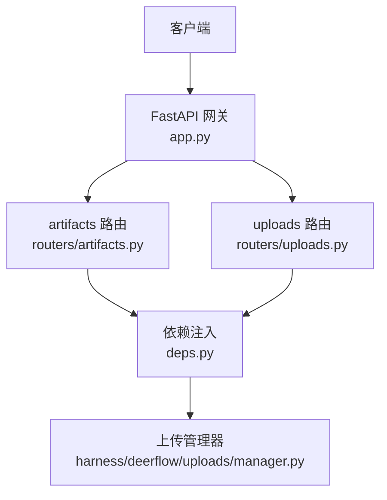
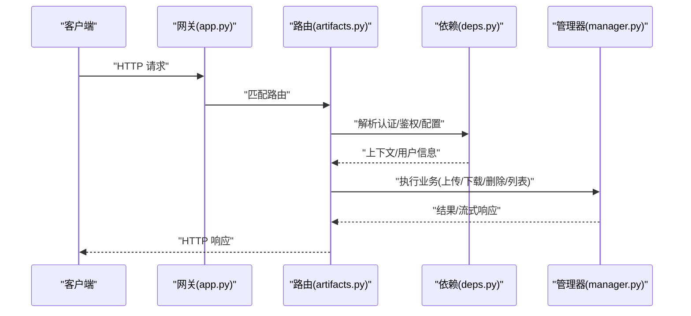
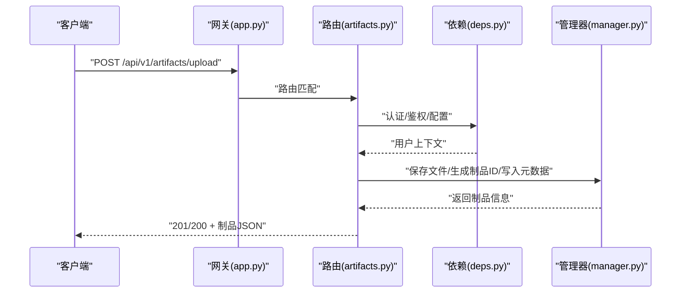
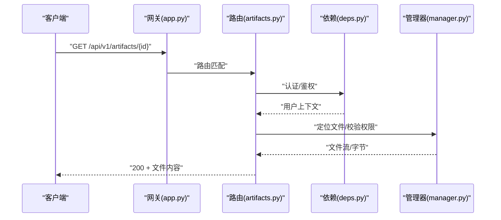
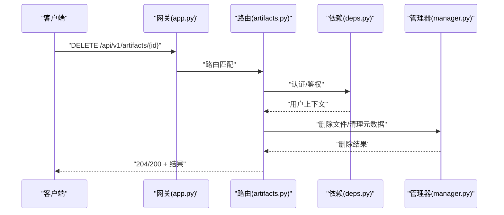
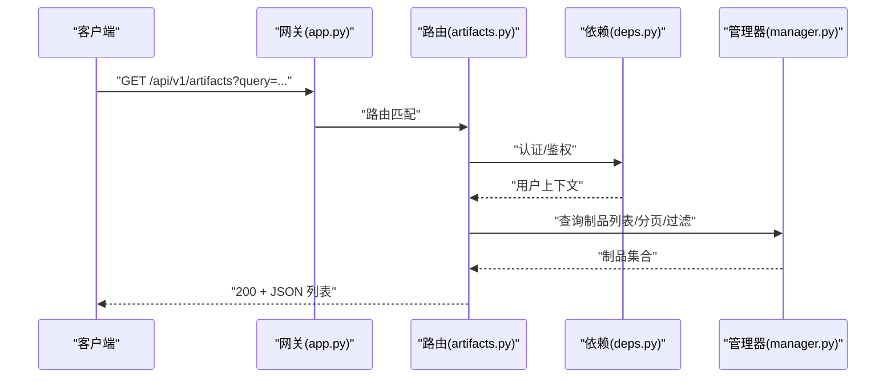
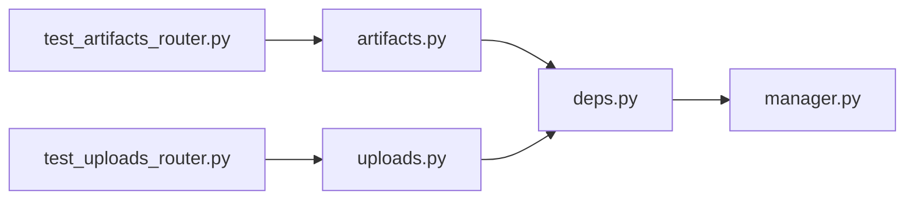

# 文件制品API

<cite>
**本文引用的文件**   
- [backend/app/gateway/routers/artifacts.py](file://backend/app/gateway/routers/artifacts.py)
- [backend/app/gateway/routers/uploads.py](file://backend/app/gateway/routers/uploads.py)
- [backend/app/gateway/app.py](file://backend/app/gateway/app.py)
- [backend/app/gateway/deps.py](file://backend/app/gateway/deps.py)
- [backend/app/harness/deerflow/uploads/manager.py](file://backend/app/harness/deerflow/uploads/manager.py)
- [backend/tests/test_artifacts_router.py](file://backend/tests/test_artifacts_router.py)
- [backend/tests/test_uploads_router.py](file://backend/tests/test_uploads_router.py)
- [backend/docs/API.md](file://backend/docs/API.md)
</cite>

## 目录
1. [简介](#简介)
2. [项目结构](#项目结构)
3. [核心组件](#核心组件)
4. [架构总览](#架构总览)
5. [详细组件分析](#详细组件分析)
6. [依赖分析](#依赖分析)
7. [性能考虑](#性能考虑)
8. [故障排查指南](#故障排查指南)
9. [结论](#结论)
10. [附录](#附录)

## 简介
本文件为 DeerFlow 后端“文件制品（Artifacts）”RESTful API 的完整文档，覆盖以下能力：
- 文件上传、下载、预览与管理
- 文件列表查询与删除
- 访问权限控制、存储路径规则、大小限制与格式支持说明
- 版本管理与批量操作接口（如存在）
- 请求示例、响应格式与错误处理指南

该文档面向开发者与集成方，帮助快速对接并正确使用文件制品相关接口。

## 项目结构
DeerFlow 后端采用 FastAPI 网关路由组织 REST 接口，其中“文件制品”相关路由位于 gateway 层，具体实现由 uploads 模块提供。

图表来源
- [backend/app/gateway/app.py](file://backend/app/gateway/app.py)
- [backend/app/gateway/routers/artifacts.py](file://backend/app/gateway/routers/artifacts.py)
- [backend/app/gateway/routers/uploads.py](file://backend/app/gateway/routers/uploads.py)
- [backend/app/gateway/deps.py](file://backend/app/gateway/deps.py)
- [backend/app/harness/deerflow/uploads/manager.py](file://backend/app/harness/deerflow/uploads/manager.py)

章节来源
- [backend/app/gateway/app.py](file://backend/app/gateway/app.py)
- [backend/app/gateway/routers/artifacts.py](file://backend/app/gateway/routers/artifacts.py)
- [backend/app/gateway/routers/uploads.py](file://backend/app/gateway/routers/uploads.py)
- [backend/app/gateway/deps.py](file://backend/app/gateway/deps.py)
- [backend/app/harness/deerflow/uploads/manager.py](file://backend/app/harness/deerflow/uploads/manager.py)

## 核心组件
- 路由层
  - artifacts 路由：暴露 /api/v1/artifacts 系列端点，用于制品的上传、列表、下载、删除等。
  - uploads 路由：提供通用上传入口（如 multipart/form-data），供前端或工具调用。
- 依赖注入层
  - deps：集中管理认证、鉴权、配置加载等依赖，供路由使用。
- 业务逻辑层
  - uploads manager：封装文件持久化、命名、路径规划、元数据记录、版本策略等。
- 测试
  - test_artifacts_router、test_uploads_router：覆盖关键流程与边界条件。

章节来源
- [backend/app/gateway/routers/artifacts.py](file://backend/app/gateway/routers/artifacts.py)
- [backend/app/gateway/routers/uploads.py](file://backend/app/gateway/routers/uploads.py)
- [backend/app/gateway/deps.py](file://backend/app/gateway/deps.py)
- [backend/app/harness/deerflow/uploads/manager.py](file://backend/app/harness/deerflow/uploads/manager.py)
- [backend/tests/test_artifacts_router.py](file://backend/tests/test_artifacts_router.py)
- [backend/tests/test_uploads_router.py](file://backend/tests/test_uploads_router.py)

## 架构总览
下图展示了从客户端到存储层的典型调用链，包括认证、路由分发、业务处理与返回结果。

图表来源
- [backend/app/gateway/app.py](file://backend/app/gateway/app.py)
- [backend/app/gateway/routers/artifacts.py](file://backend/app/gateway/routers/artifacts.py)
- [backend/app/gateway/deps.py](file://backend/app/gateway/deps.py)
- [backend/app/harness/deerflow/uploads/manager.py](file://backend/app/harness/deerflow/uploads/manager.py)

## 详细组件分析

### 端点清单与行为
以下为当前仓库中可确认存在的制品相关端点及行为要点。若某端点在代码中未定义，则视为“未实现”。

- POST /api/v1/artifacts/upload
  - 功能：上传文件并创建制品条目
  - 输入：multipart/form-data，字段名以实际路由实现为准
  - 输出：制品元数据（ID、名称、类型、大小、时间戳等）
  - 限制：大小限制、允许的文件扩展名、安全校验由路由与依赖共同决定
  - 权限：需通过依赖注入的认证/鉴权中间件
  - 状态码：201/200（成功）、400（参数/校验失败）、401/403（认证/鉴权失败）、413（过大）、5xx（服务端异常）

- GET /api/v1/artifacts
  - 功能：列出当前上下文下的制品集合
  - 查询参数：分页、过滤（按类型/时间/所有者等，取决于实现）
  - 输出：制品列表（每项包含 ID、名称、类型、大小、时间戳等）
  - 权限：需具备读取权限
  - 状态码：200（成功）、401/403（认证/鉴权失败）、5xx（服务端异常）

- GET /api/v1/artifacts/{artifact_id}
  - 功能：下载指定制品
  - 路径参数：artifact_id
  - 输出：二进制文件或文本内容，Content-Type 根据文件类型设置
  - 权限：需具备读取权限
  - 状态码：200（成功）、404（不存在）、401/403（认证/鉴权失败）、5xx（服务端异常）

- DELETE /api/v1/artifacts/{artifact_id}
  - 功能：删除指定制品
  - 路径参数：artifact_id
  - 输出：删除结果（通常为成功/失败消息）
  - 权限：需具备删除权限
  - 状态码：204/200（成功）、404（不存在）、401/403（认证/鉴权失败）、5xx（服务端异常）

- 其他端点（如预览、版本管理、批量操作）
  - 若未在路由中定义，则视为“未实现”。可在后续迭代中扩展。

章节来源
- [backend/app/gateway/routers/artifacts.py](file://backend/app/gateway/routers/artifacts.py)
- [backend/app/gateway/routers/uploads.py](file://backend/app/gateway/routers/uploads.py)
- [backend/tests/test_artifacts_router.py](file://backend/tests/test_artifacts_router.py)
- [backend/tests/test_uploads_router.py](file://backend/tests/test_uploads_router.py)

### 文件上传流程（POST /api/v1/artifacts/upload）

图表来源
- [backend/app/gateway/routers/artifacts.py](file://backend/app/gateway/routers/artifacts.py)
- [backend/app/gateway/deps.py](file://backend/app/gateway/deps.py)
- [backend/app/harness/deerflow/uploads/manager.py](file://backend/app/harness/deerflow/uploads/manager.py)

章节来源
- [backend/app/gateway/routers/artifacts.py](file://backend/app/gateway/routers/artifacts.py)
- [backend/app/gateway/deps.py](file://backend/app/gateway/deps.py)
- [backend/app/harness/deerflow/uploads/manager.py](file://backend/app/harness/deerflow/uploads/manager.py)

### 文件下载流程（GET /api/v1/artifacts/{artifact_id}）

图表来源
- [backend/app/gateway/routers/artifacts.py](file://backend/app/gateway/routers/artifacts.py)
- [backend/app/gateway/deps.py](file://backend/app/gateway/deps.py)
- [backend/app/harness/deerflow/uploads/manager.py](file://backend/app/harness/deerflow/uploads/manager.py)

章节来源
- [backend/app/gateway/routers/artifacts.py](file://backend/app/gateway/routers/artifacts.py)
- [backend/app/gateway/deps.py](file://backend/app/gateway/deps.py)
- [backend/app/harness/deerflow/uploads/manager.py](file://backend/app/harness/deerflow/uploads/manager.py)

### 文件删除流程（DELETE /api/v1/artifacts/{artifact_id}）

图表来源
- [backend/app/gateway/routers/artifacts.py](file://backend/app/gateway/routers/artifacts.py)
- [backend/app/gateway/deps.py](file://backend/app/gateway/deps.py)
- [backend/app/harness/deerflow/uploads/manager.py](file://backend/app/harness/deerflow/uploads/manager.py)

章节来源
- [backend/app/gateway/routers/artifacts.py](file://backend/app/gateway/routers/artifacts.py)
- [backend/app/gateway/deps.py](file://backend/app/gateway/deps.py)
- [backend/app/harness/deerflow/uploads/manager.py](file://backend/app/harness/deerflow/uploads/manager.py)

### 文件列表查询（GET /api/v1/artifacts）

图表来源
- [backend/app/gateway/routers/artifacts.py](file://backend/app/gateway/routers/artifacts.py)
- [backend/app/gateway/deps.py](file://backend/app/gateway/deps.py)
- [backend/app/harness/deerflow/uploads/manager.py](file://backend/app/harness/deerflow/uploads/manager.py)

章节来源
- [backend/app/gateway/routers/artifacts.py](file://backend/app/gateway/routers/artifacts.py)
- [backend/app/gateway/deps.py](file://backend/app/gateway/deps.py)
- [backend/app/harness/deerflow/uploads/manager.py](file://backend/app/harness/deerflow/uploads/manager.py)

### 上传表单处理（通用上传入口）
当需要更灵活的上传场景时，可使用通用上传路由。其职责通常包括：
- 接收 multipart/form-data
- 校验文件名、大小、类型
- 落盘与元数据记录
- 返回制品标识以便后续操作

章节来源
- [backend/app/gateway/routers/uploads.py](file://backend/app/gateway/routers/uploads.py)
- [backend/app/harness/deerflow/uploads/manager.py](file://backend/app/harness/deerflow/uploads/manager.py)

## 依赖分析
- 路由对依赖注入的耦合
  - 所有路由均通过 deps 获取认证、鉴权、配置等上下文，降低硬编码耦合度。
- 管理器作为单一职责
  - uploads manager 负责文件持久化、命名、路径规划、元数据管理等，便于替换存储后端或调整策略。
- 测试驱动验证
  - artifacts 与 uploads 路由均有对应测试，保障基本流程稳定。

图表来源
- [backend/app/gateway/routers/artifacts.py](file://backend/app/gateway/routers/artifacts.py)
- [backend/app/gateway/routers/uploads.py](file://backend/app/gateway/routers/uploads.py)
- [backend/app/gateway/deps.py](file://backend/app/gateway/deps.py)
- [backend/app/harness/deerflow/uploads/manager.py](file://backend/app/harness/deerflow/uploads/manager.py)
- [backend/tests/test_artifacts_router.py](file://backend/tests/test_artifacts_router.py)
- [backend/tests/test_uploads_router.py](file://backend/tests/test_uploads_router.py)

章节来源
- [backend/app/gateway/routers/artifacts.py](file://backend/app/gateway/routers/artifacts.py)
- [backend/app/gateway/routers/uploads.py](file://backend/app/gateway/routers/uploads.py)
- [backend/app/gateway/deps.py](file://backend/app/gateway/deps.py)
- [backend/app/harness/deerflow/uploads/manager.py](file://backend/app/harness/deerflow/uploads/manager.py)
- [backend/tests/test_artifacts_router.py](file://backend/tests/test_artifacts_router.py)
- [backend/tests/test_uploads_router.py](file://backend/tests/test_uploads_router.py)

## 性能考虑
- 大文件传输
  - 建议启用分块上传与断点续传（若后续扩展）。
  - 合理设置网关与应用的超时与缓冲参数。
- 并发与锁
  - 避免同一文件并发写入冲突；在 manager 层引入写锁或原子写入策略。
- 缓存与索引
  - 对高频访问的制品元数据建立缓存，减少重复 IO。
- 压缩与转码
  - 针对图片/视频等大体积媒体，按需进行压缩或转码以降低带宽占用。

[本节为通用指导，不直接分析具体文件]

## 故障排查指南
- 常见错误码
  - 400：请求参数缺失或校验失败（如文件名非法、类型不支持）
  - 401/403：认证失败或无权限访问
  - 404：制品不存在
  - 413：文件大小超过限制
  - 5xx：服务端异常（IO 错误、存储不可用等）
- 日志与追踪
  - 检查网关与应用日志，定位路由匹配与依赖注入阶段问题。
  - 关注 manager 层的 IO 异常与路径拼接错误。
- 复现步骤
  - 使用最小请求体复现问题，逐步增加参数定位根因。
  - 对比测试用例，确保环境一致。

章节来源
- [backend/tests/test_artifacts_router.py](file://backend/tests/test_artifacts_router.py)
- [backend/tests/test_uploads_router.py](file://backend/tests/test_uploads_router.py)

## 结论
DeerFlow 的文件制品 API 通过清晰的路由分层与依赖注入机制，提供了上传、下载、列表与删除等基础能力。建议在后续迭代中补充：
- 预览接口（如图片缩略图、PDF 预览）
- 版本管理（历史版本回溯与合并）
- 批量操作（批量删除、批量导出）
- 更完善的配额与审计能力

[本节为总结性内容，不直接分析具体文件]

## 附录

### 请求与响应示例（占位）
- 上传
  - 请求：multipart/form-data，字段名以路由实现为准
  - 响应：制品元数据 JSON
- 列表
  - 请求：GET /api/v1/artifacts?limit=&offset=&type=...
  - 响应：制品列表 JSON
- 下载
  - 请求：GET /api/v1/artifacts/{artifact_id}
  - 响应：二进制内容，Content-Type 正确设置
- 删除
  - 请求：DELETE /api/v1/artifacts/{artifact_id}
  - 响应：空体或成功消息

[本节为通用示例，不直接分析具体文件]

### 参考文档
- 后端 API 概览与约定
  - [backend/docs/API.md](file://backend/docs/API.md)

章节来源
- [backend/docs/API.md](file://backend/docs/API.md)