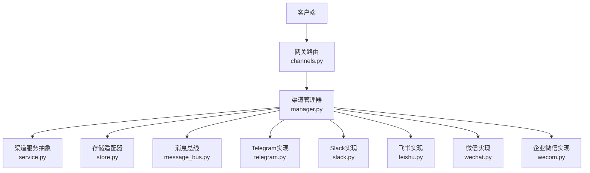
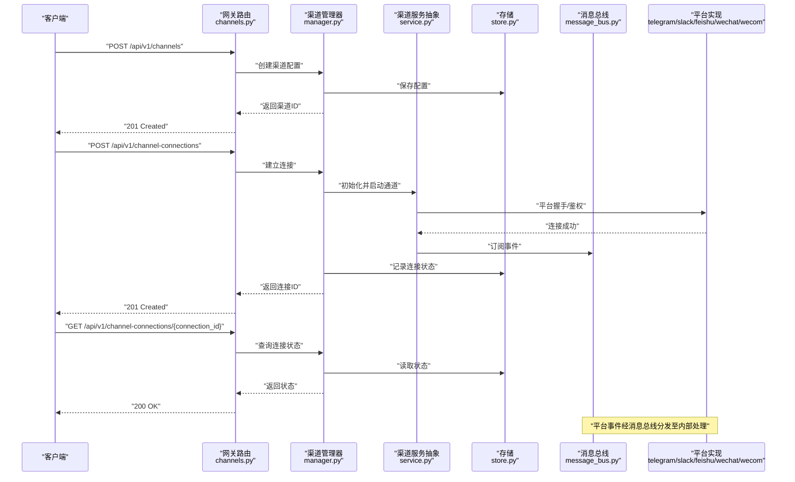
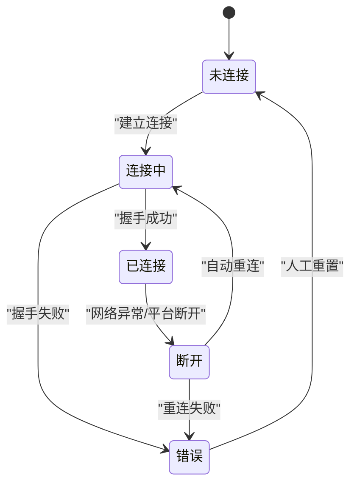
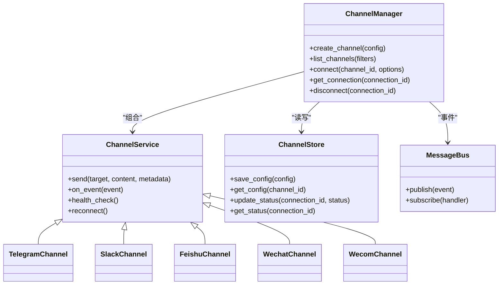

# 渠道管理API

<cite>
**本文引用的文件**   
- [backend/app/gateway/routers/channels.py](file://backend/app/gateway/routers/channels.py)
- [backend/app/channels/manager.py](file://backend/app/channels/manager.py)
- [backend/app/channels/service.py](file://backend/app/channels/service.py)
- [backend/app/channels/store.py](file://backend/app/channels/store.py)
- [backend/app/channels/base.py](file://backend/app/channels/base.py)
- [backend/app/channels/telegram.py](file://backend/app/channels/telegram.py)
- [backend/app/channels/slack.py](file://backend/app/channels/slack.py)
- [backend/app/channels/feishu.py](file://backend/app/channels/feishu.py)
- [backend/app/channels/wechat.py](file://backend/app/channels/wechat.py)
- [backend/app/channels/wecom.py](file://backend/app/channels/wecom.py)
- [backend/app/channels/message_bus.py](file://backend/app/channels/message_bus.py)
- [backend/app/channels/__init__.py](file://backend/app/channels/__init__.py)
- [backend/tests/test_channels.py](file://backend/tests/test_channels.py)
</cite>

## 目录
1. [简介](#简介)
2. [项目结构](#项目结构)
3. [核心组件](#核心组件)
4. [架构总览](#架构总览)
5. [详细组件分析](#详细组件分析)
6. [依赖关系分析](#依赖关系分析)
7. [性能考虑](#性能考虑)
8. [故障排查指南](#故障排查指南)
9. [结论](#结论)
10. [附录](#附录)

## 简介
本文件面向DeerFlow的“渠道管理”RESTful API，聚焦多渠道集成能力。文档覆盖以下范围：
- 渠道配置管理：创建与列举渠道（POST /api/v1/channels、GET /api/v1/channels）
- 渠道连接管理：建立连接与查询连接状态（POST /api/v1/channel-connections、GET /api/v1/channel-connections/{connection_id}）
- 渠道类型与认证方式：Telegram、Slack、飞书、微信、企业微信等
- 消息收发与连接监控：通过统一接口进行消息投递与接收、连接健康检查
- 错误处理策略与最佳实践

说明：
- 本文档以代码仓库中的网关路由与渠道实现为依据，提供端到端接口说明、数据流与调用时序。
- 为避免泄露敏感信息，示例中仅给出字段名与取值范围，不包含真实密钥或令牌。

## 项目结构
与渠道管理API相关的后端模块主要位于 backend/app/gateway/routers 与 backend/app/channels 下：
- 网关层：负责HTTP路由、请求校验、响应封装
- 渠道管理层：负责渠道注册、生命周期管理、持久化、消息总线桥接
- 渠道实现层：各平台的具体接入逻辑（Telegram、Slack、飞书、微信、企业微信）

图表来源
- [backend/app/gateway/routers/channels.py](file://backend/app/gateway/routers/channels.py)
- [backend/app/channels/manager.py](file://backend/app/channels/manager.py)
- [backend/app/channels/service.py](file://backend/app/channels/service.py)
- [backend/app/channels/store.py](file://backend/app/channels/store.py)
- [backend/app/channels/message_bus.py](file://backend/app/channels/message_bus.py)
- [backend/app/channels/telegram.py](file://backend/app/channels/telegram.py)
- [backend/app/channels/slack.py](file://backend/app/channels/slack.py)
- [backend/app/channels/feishu.py](file://backend/app/channels/feishu.py)
- [backend/app/channels/wechat.py](file://backend/app/channels/wechat.py)
- [backend/app/channels/wecom.py](file://backend/app/channels/wecom.py)

章节来源
- [backend/app/gateway/routers/channels.py](file://backend/app/gateway/routers/channels.py)
- [backend/app/channels/manager.py](file://backend/app/channels/manager.py)
- [backend/app/channels/service.py](file://backend/app/channels/service.py)
- [backend/app/channels/store.py](file://backend/app/channels/store.py)
- [backend/app/channels/message_bus.py](file://backend/app/channels/message_bus.py)
- [backend/app/channels/telegram.py](file://backend/app/channels/telegram.py)
- [backend/app/channels/slack.py](file://backend/app/channels/slack.py)
- [backend/app/channels/feishu.py](file://backend/app/channels/feishu.py)
- [backend/app/channels/wechat.py](file://backend/app/channels/wechat.py)
- [backend/app/channels/wecom.py](file://backend/app/channels/wecom.py)

## 核心组件
- 网关路由（channels.py）
  - 暴露统一的REST端点，负责参数校验、鉴权（由上层中间件处理）、调用渠道管理器
- 渠道管理器（manager.py）
  - 维护渠道实例、连接对象、状态机；协调存储与消息总线
- 渠道服务抽象（service.py）
  - 定义渠道通用能力（发送、接收、心跳、重连、元数据）
- 存储适配器（store.py）
  - 持久化渠道配置与连接状态，支持增删改查
- 消息总线（message_bus.py）
  - 解耦外部事件与内部处理流程，支持异步分发
- 具体渠道实现（telegram.py、slack.py、feishu.py、wechat.py、wecom.py）
  - 实现各自平台的认证、消息收发、回调处理、错误重试等

章节来源
- [backend/app/gateway/routers/channels.py](file://backend/app/gateway/routers/channels.py)
- [backend/app/channels/manager.py](file://backend/app/channels/manager.py)
- [backend/app/channels/service.py](file://backend/app/channels/service.py)
- [backend/app/channels/store.py](file://backend/app/channels/store.py)
- [backend/app/channels/message_bus.py](file://backend/app/channels/message_bus.py)
- [backend/app/channels/telegram.py](file://backend/app/channels/telegram.py)
- [backend/app/channels/slack.py](file://backend/app/channels/slack.py)
- [backend/app/channels/feishu.py](file://backend/app/channels/feishu.py)
- [backend/app/channels/wechat.py](file://backend/app/channels/wechat.py)
- [backend/app/channels/wecom.py](file://backend/app/channels/wecom.py)

## 架构总览
下图展示了从HTTP请求到渠道实现的完整链路，以及关键的数据流转。

图表来源
- [backend/app/gateway/routers/channels.py](file://backend/app/gateway/routers/channels.py)
- [backend/app/channels/manager.py](file://backend/app/channels/manager.py)
- [backend/app/channels/service.py](file://backend/app/channels/service.py)
- [backend/app/channels/store.py](file://backend/app/channels/store.py)
- [backend/app/channels/message_bus.py](file://backend/app/channels/message_bus.py)
- [backend/app/channels/telegram.py](file://backend/app/channels/telegram.py)
- [backend/app/channels/slack.py](file://backend/app/channels/slack.py)
- [backend/app/channels/feishu.py](file://backend/app/channels/feishu.py)
- [backend/app/channels/wechat.py](file://backend/app/channels/wechat.py)
- [backend/app/channels/wecom.py](file://backend/app/channels/wecom.py)

## 详细组件分析

### 渠道配置管理
- 创建渠道配置
  - 方法：POST
  - 路径：/api/v1/channels
  - 功能：新增一个渠道配置项，包含渠道类型、平台标识、认证凭据等
  - 请求体关键字段（示例字段名，不含真实值）：
    - channel_type：枚举，如 telegram、slack、feishu、wechat、wecom
    - name：渠道名称
    - enabled：是否启用
    - config：平台相关配置（见后文“支持的渠道类型与认证方式”）
  - 响应：
    - 201 Created：返回 channel_id 与基础信息
    - 400 Bad Request：参数校验失败
    - 409 Conflict：重复配置
    - 500 Internal Server Error：内部异常
- 列举渠道配置
  - 方法：GET
  - 路径：/api/v1/channels
  - 查询参数：
    - type：按渠道类型过滤
    - enabled：按启用状态过滤
  - 响应：
    - 200 OK：返回渠道列表（隐藏敏感字段）

章节来源
- [backend/app/gateway/routers/channels.py](file://backend/app/gateway/routers/channels.py)
- [backend/app/channels/manager.py](file://backend/app/channels/manager.py)
- [backend/app/channels/store.py](file://backend/app/channels/store.py)

### 渠道连接管理
- 建立连接
  - 方法：POST
  - 路径：/api/v1/channel-connections
  - 请求体关键字段：
    - channel_id：关联的渠道配置ID
    - options：可选的连接选项（如超时、重试策略）
  - 行为：
    - 根据 channel_id 加载配置，实例化对应渠道服务
    - 执行平台握手与鉴权
    - 启动事件监听与消息转发
    - 持久化连接状态为“已连接”
  - 响应：
    - 201 Created：返回 connection_id 与初始状态
    - 400 Bad Request：参数校验失败
    - 404 Not Found：渠道配置不存在
    - 401 Unauthorized：认证失败
    - 409 Conflict：已有活跃连接
    - 500 Internal Server Error：内部异常
- 查询连接状态
  - 方法：GET
  - 路径：/api/v1/channel-connections/{connection_id}
  - 响应：
    - 200 OK：返回连接状态、最后心跳时间、错误信息等
    - 404 Not Found：连接不存在

章节来源
- [backend/app/gateway/routers/channels.py](file://backend/app/gateway/routers/channels.py)
- [backend/app/channels/manager.py](file://backend/app/channels/manager.py)
- [backend/app/channels/store.py](file://backend/app/channels/store.py)

### 渠道消息收发
- 发送消息
  - 方法：POST
  - 路径：/api/v1/messages/send
  - 请求体关键字段：
    - connection_id：目标连接ID
    - target：目标标识（如用户ID、群组ID）
    - content：消息内容（文本、富文本、附件等）
    - metadata：扩展元数据（可选）
  - 响应：
    - 202 Accepted：消息进入队列
    - 200 OK：同步发送成功（视实现而定）
    - 400/404/401/500：相应错误码
- 接收消息（事件回调）
  - 机制：平台侧回调或长轮询，经由消息总线分发至内部处理器
  - 事件模型：
    - event_type：如 message_received、attachment_uploaded
    - payload：平台原始事件载荷（标准化后）
    - connection_id：来源连接
  - 注意：该部分通常不直接暴露HTTP端点，而是通过内部事件总线驱动业务处理

章节来源
- [backend/app/channels/message_bus.py](file://backend/app/channels/message_bus.py)
- [backend/app/channels/manager.py](file://backend/app/channels/manager.py)
- [backend/app/channels/service.py](file://backend/app/channels/service.py)

### 支持的渠道类型与认证方式
以下为常见渠道类型的典型配置字段与认证方式（字段名为约定键名，实际以实现为准）：
- Telegram
  - 认证：bot_token
  - 常用配置：
    - bot_token：机器人令牌
    - webhook_url：可选，Webhook地址
    - allowed_users：白名单用户ID集合
- Slack
  - 认证：OAuth App Token 或 Bot Token
  - 常用配置：
    - app_token：应用令牌
    - bot_token：机器人令牌
    - signing_secret：签名密钥（用于验证回调）
    - team_id：团队ID
- 飞书（Feishu/Lark）
  - 认证：App ID + App Secret
  - 常用配置：
    - app_id：应用ID
    - app_secret：应用密钥
    - verification_token：事件验证令牌
    - encrypt_key：可选，加密密钥
- 微信（WeChat）
  - 认证：AppID + AppSecret + Token
  - 常用配置：
    - appid：应用ID
    - secret：应用密钥
    - token：消息签名令牌
    - encoding_aes_key：AES密钥（可选）
- 企业微信（WeCom）
  - 认证：CorpID + AgentId + Secret
  - 常用配置：
    - corp_id：企业ID
    - agent_id：应用ID
    - secret：应用密钥
    - token：消息签名令牌
    - encoding_aes_key：AES密钥（可选）

说明：
- 以上字段仅为约定示例，具体以各渠道实现类为准。
- 所有敏感字段在存储时应加密，并在API响应中脱敏。

章节来源
- [backend/app/channels/telegram.py](file://backend/app/channels/telegram.py)
- [backend/app/channels/slack.py](file://backend/app/channels/slack.py)
- [backend/app/channels/feishu.py](file://backend/app/channels/feishu.py)
- [backend/app/channels/wechat.py](file://backend/app/channels/wechat.py)
- [backend/app/channels/wecom.py](file://backend/app/channels/wecom.py)

### 连接状态监控与健康检查
- 健康检查
  - 方法：GET
  - 路径：/api/v1/channel-connections/{connection_id}/health
  - 响应：
    - 200 OK：返回健康状态、最近一次心跳、错误计数等
    - 503 Service Unavailable：连接不可用
- 连接生命周期状态机
  - 状态包括：未连接、连接中、已连接、断开、错误
  - 转换规则：
    - 未连接 -> 连接中：发起握手
    - 连接中 -> 已连接：握手成功
    - 已连接 -> 断开：网络异常或平台主动断开
    - 断开 -> 连接中：自动重连
    - 任意 -> 错误：认证失败、配置错误等

图表来源
- [backend/app/channels/manager.py](file://backend/app/channels/manager.py)
- [backend/app/channels/service.py](file://backend/app/channels/service.py)

章节来源
- [backend/app/gateway/routers/channels.py](file://backend/app/gateway/routers/channels.py)
- [backend/app/channels/manager.py](file://backend/app/channels/manager.py)
- [backend/app/channels/service.py](file://backend/app/channels/service.py)

### 错误处理策略
- 统一错误响应格式
  - code：错误码（字符串或数字）
  - message：人类可读的错误描述
  - details：附加信息（可选）
- 常见错误码
  - CHANNEL_NOT_FOUND：渠道配置不存在
  - CONNECTION_NOT_FOUND：连接不存在
  - AUTH_FAILED：认证失败
  - INVALID_CONFIG：配置参数无效
  - ALREADY_CONNECTED：连接已存在
  - PLATFORM_ERROR：平台侧错误
  - INTERNAL_ERROR：内部错误
- 重试与退避
  - 对可恢复的网络错误采用指数退避重试
  - 超过最大重试次数后标记为错误状态并告警
- 幂等性
  - 建立连接与发送消息应支持幂等键（如 request_id），避免重复提交导致副作用

章节来源
- [backend/app/gateway/routers/channels.py](file://backend/app/gateway/routers/channels.py)
- [backend/app/channels/manager.py](file://backend/app/channels/manager.py)
- [backend/app/channels/service.py](file://backend/app/channels/service.py)

## 依赖关系分析
- 耦合与内聚
  - 网关路由仅负责HTTP契约，业务逻辑下沉至管理器与服务抽象，提升内聚性
  - 存储与消息总线作为基础设施被管理器组合使用，降低耦合度
- 外部依赖
  - 各渠道实现依赖第三方SDK或HTTP客户端
  - 消息总线可能基于内存队列或外部消息系统（如Redis/RabbitMQ）
- 循环依赖
  - 通过抽象接口（service.py）与事件总线（message_bus.py）避免循环引用

图表来源
- [backend/app/channels/manager.py](file://backend/app/channels/manager.py)
- [backend/app/channels/service.py](file://backend/app/channels/service.py)
- [backend/app/channels/store.py](file://backend/app/channels/store.py)
- [backend/app/channels/message_bus.py](file://backend/app/channels/message_bus.py)
- [backend/app/channels/telegram.py](file://backend/app/channels/telegram.py)
- [backend/app/channels/slack.py](file://backend/app/channels/slack.py)
- [backend/app/channels/feishu.py](file://backend/app/channels/feishu.py)
- [backend/app/channels/wechat.py](file://backend/app/channels/wechat.py)
- [backend/app/channels/wecom.py](file://backend/app/channels/wecom.py)

章节来源
- [backend/app/channels/manager.py](file://backend/app/channels/manager.py)
- [backend/app/channels/service.py](file://backend/app/channels/service.py)
- [backend/app/channels/store.py](file://backend/app/channels/store.py)
- [backend/app/channels/message_bus.py](file://backend/app/channels/message_bus.py)
- [backend/app/channels/telegram.py](file://backend/app/channels/telegram.py)
- [backend/app/channels/slack.py](file://backend/app/channels/slack.py)
- [backend/app/channels/feishu.py](file://backend/app/channels/feishu.py)
- [backend/app/channels/wechat.py](file://backend/app/channels/wechat.py)
- [backend/app/channels/wecom.py](file://backend/app/channels/wecom.py)

## 性能考虑
- 连接池与会话复用
  - 同一渠道的多连接场景下，复用底层会话以减少握手开销
- 异步I/O
  - 使用异步客户端与事件循环，提高并发处理能力
- 背压与限流
  - 对高吞吐平台（如Slack、飞书）实施速率限制与批量发送
- 缓存
  - 缓存渠道配置与连接状态，减少频繁IO
- 监控与指标
  - 暴露连接数、消息吞吐、错误率、延迟等指标，便于容量规划

[本节为通用指导，无需源码引用]

## 故障排查指南
- 常见问题定位
  - 认证失败：检查渠道配置的凭证是否正确、权限是否足够
  - 连接中断：查看连接状态与错误日志，确认网络与平台侧状态
  - 消息丢失：核对消息总线消费情况与重试策略
- 诊断步骤
  - 获取连接详情与最近错误
  - 触发健康检查，观察心跳与重连行为
  - 开启调试日志，捕获平台回调与内部事件
- 回滚与恢复
  - 若配置变更导致问题，快速回滚至上一版本配置
  - 对异常连接进行强制断开与重建

章节来源
- [backend/app/gateway/routers/channels.py](file://backend/app/gateway/routers/channels.py)
- [backend/app/channels/manager.py](file://backend/app/channels/manager.py)
- [backend/app/channels/service.py](file://backend/app/channels/service.py)

## 结论
DeerFlow的渠道管理API通过清晰的网关契约、可扩展的渠道抽象与稳定的连接管理，实现了多平台消息通道的统一接入与管理。借助消息总线与状态机，系统在可靠性、可观测性与可维护性方面具备良好基础。建议在生产环境完善监控告警、安全审计与自动化测试，确保多渠道集成的稳定运行。

[本节为总结，无需源码引用]

## 附录

### 配置示例（字段级）
- 创建渠道配置（POST /api/v1/channels）
  - 示例字段：
    - channel_type: "telegram"
    - name: "客服机器人"
    - enabled: true
    - config:
      - bot_token: "<你的Bot令牌>"
      - allowed_users: ["user1", "user2"]
- 建立连接（POST /api/v1/channel-connections）
  - 示例字段：
    - channel_id: "<渠道ID>"
    - options:
      - timeout_ms: 5000
      - retry_max: 3
- 查询连接状态（GET /api/v1/channel-connections/{connection_id}）
  - 返回字段：
    - connection_id
    - status: "connected|connecting|disconnected|error"
    - last_heartbeat_at
    - error_message

章节来源
- [backend/app/gateway/routers/channels.py](file://backend/app/gateway/routers/channels.py)
- [backend/app/channels/manager.py](file://backend/app/channels/manager.py)
- [backend/app/channels/store.py](file://backend/app/channels/store.py)

### 单元测试参考
- 渠道管理相关用例
  - 覆盖创建、列举、连接建立、状态查询、错误分支等场景
  - 可通过测试套件验证API契约与错误码一致性

章节来源
- [backend/tests/test_channels.py](file://backend/tests/test_channels.py)