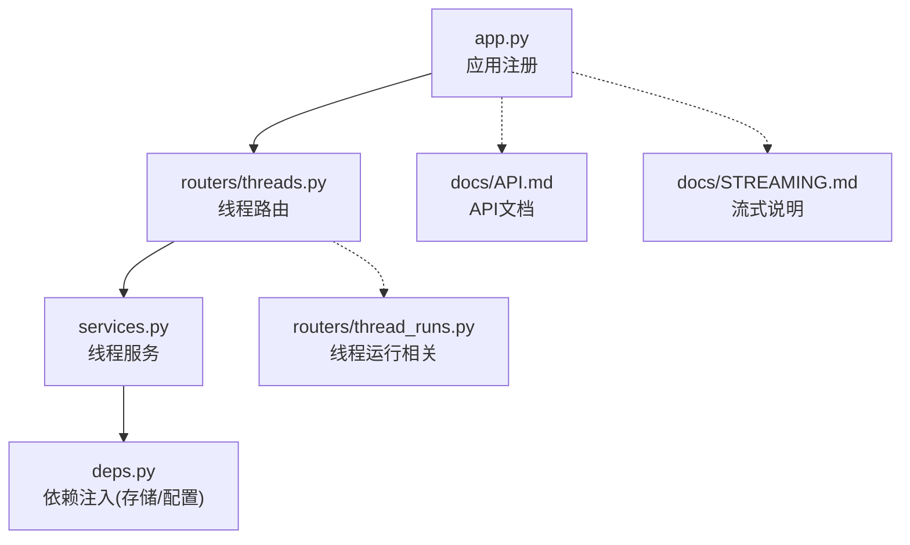
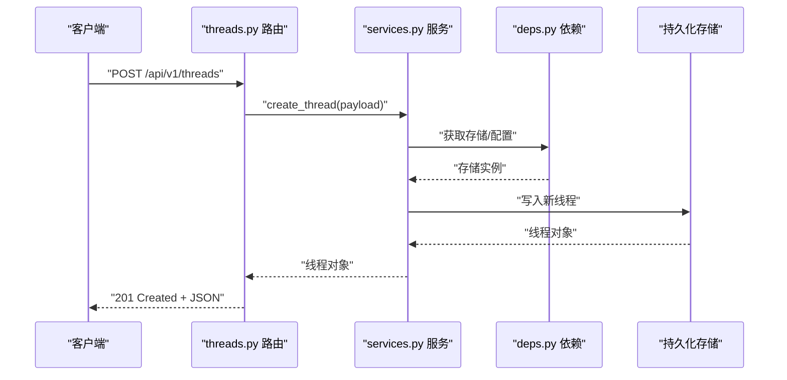

# 线程管理API

<cite>
**本文引用的文件**   
- [backend/app/gateway/routers/threads.py](file://backend/app/gateway/routers/threads.py)
- [backend/app/gateway/routers/thread_runs.py](file://backend/app/gateway/routers/thread_runs.py)
- [backend/app/gateway/services.py](file://backend/app/gateway/services.py)
- [backend/app/gateway/deps.py](file://backend/app/gateway/deps.py)
- [backend/app/gateway/app.py](file://backend/app/gateway/app.py)
- [backend/docs/API.md](file://backend/docs/API.md)
- [backend/docs/STREAMING.md](file://backend/docs/STREAMING.md)
</cite>

## 目录
1. [简介](#简介)
2. [项目结构](#项目结构)
3. [核心组件](#核心组件)
4. [架构总览](#架构总览)
5. [详细组件分析](#详细组件分析)
6. [依赖分析](#依赖分析)
7. [性能考虑](#性能考虑)
8. [故障排查指南](#故障排查指南)
9. [结论](#结论)
10. [附录](#附录)

## 简介
本文件面向后端开发者与集成方，系统化梳理 DeerFlow 的“线程管理”RESTful API。内容覆盖：
- 线程生命周期接口：创建、列表、详情、更新、删除
- 分页、排序与过滤参数约定
- 请求与响应格式（JSON）
- 错误码与异常处理
- 线程状态管理与消息历史查询
- 实时流式响应（SSE）机制与使用方式

## 项目结构
与线程管理相关的后端实现位于 gateway 层，路由定义集中在 routers 下，服务逻辑在 services 中，依赖注入在 deps 中，应用挂载在 app 中。

图表来源
- [backend/app/gateway/app.py](file://backend/app/gateway/app.py)
- [backend/app/gateway/routers/threads.py](file://backend/app/gateway/routers/threads.py)
- [backend/app/gateway/services.py](file://backend/app/gateway/services.py)
- [backend/app/gateway/deps.py](file://backend/app/gateway/deps.py)
- [backend/app/gateway/routers/thread_runs.py](file://backend/app/gateway/routers/thread_runs.py)
- [backend/docs/API.md](file://backend/docs/API.md)
- [backend/docs/STREAMING.md](file://backend/docs/STREAMING.md)

章节来源
- [backend/app/gateway/app.py](file://backend/app/gateway/app.py)
- [backend/app/gateway/routers/threads.py](file://backend/app/gateway/routers/threads.py)
- [backend/app/gateway/services.py](file://backend/app/gateway/services.py)
- [backend/app/gateway/deps.py](file://backend/app/gateway/deps.py)
- [backend/app/gateway/routers/thread_runs.py](file://backend/app/gateway/routers/thread_runs.py)
- [backend/docs/API.md](file://backend/docs/API.md)
- [backend/docs/STREAMING.md](file://backend/docs/STREAMING.md)

## 核心组件
- 路由层：负责HTTP端点定义、参数校验、返回统一响应结构
- 服务层：封装业务逻辑（线程CRUD、分页/过滤/排序、消息历史、运行控制等）
- 依赖注入：提供持久化存储、配置项、外部服务客户端
- 文档与规范：API.md 与 STREAMING.md 作为对外契约与行为约定

章节来源
- [backend/app/gateway/routers/threads.py](file://backend/app/gateway/routers/threads.py)
- [backend/app/gateway/services.py](file://backend/app/gateway/services.py)
- [backend/app/gateway/deps.py](file://backend/app/gateway/deps.py)
- [backend/docs/API.md](file://backend/docs/API.md)
- [backend/docs/STREAMING.md](file://backend/docs/STREAMING.md)

## 架构总览
下图展示了从客户端到服务端的路由、服务与依赖关系，以及流式响应的关键路径。

图表来源
- [backend/app/gateway/routers/threads.py](file://backend/app/gateway/routers/threads.py)
- [backend/app/gateway/services.py](file://backend/app/gateway/services.py)
- [backend/app/gateway/deps.py](file://backend/app/gateway/deps.py)

## 详细组件分析

### 线程管理 REST 端点
以下端点均基于 /api/v1/threads 前缀。

- 创建线程
  - 方法：POST
  - 路径：/api/v1/threads
  - 请求体字段（示例字段名，具体以实现为准）：
    - title: string | null（可选）
    - metadata: object | null（可选）
    - tags: string[] | null（可选）
    - status: enum（可选，默认由系统决定）
    - created_by: string | null（可选）
  - 成功响应：201 Created
    - 字段：id, title, status, created_at, updated_at, metadata, tags, created_by
  - 失败响应：
    - 400 Bad Request：参数校验失败
    - 409 Conflict：重复键冲突（如唯一约束）
    - 500 Internal Server Error：内部错误

- 查询线程列表
  - 方法：GET
  - 路径：/api/v1/threads
  - 查询参数：
    - page: integer（默认1）
    - size: integer（默认20，最大受服务端限制）
    - sort_by: string（支持字段如 created_at, updated_at, title）
    - order: asc|desc（默认desc）
    - filter_status: string[]（可选，多值）
    - filter_tag: string[]（可选，多值）
    - q: string（可选，全文或模糊匹配）
  - 成功响应：200 OK
    - 字段：items[], total, page, size, has_more
  - 失败响应：
    - 400 Bad Request：参数非法
    - 500 Internal Server Error：内部错误

- 获取线程详情
  - 方法：GET
  - 路径：/api/v1/threads/{thread_id}
  - 路径参数：thread_id: string（UUID）
  - 成功响应：200 OK
    - 字段：id, title, status, created_at, updated_at, metadata, tags, created_by
  - 失败响应：
    - 404 Not Found：线程不存在
    - 500 Internal Server Error：内部错误

- 更新线程
  - 方法：PUT
  - 路径：/api/v1/threads/{thread_id}
  - 路径参数：thread_id: string（UUID）
  - 请求体字段（可部分更新）：title, metadata, tags, status
  - 成功响应：200 OK
    - 字段：更新后的完整线程对象
  - 失败响应：
    - 400 Bad Request：参数校验失败
    - 404 Not Found：线程不存在
    - 409 Conflict：状态变更不合法
    - 500 Internal Server Error：内部错误

- 删除线程
  - 方法：DELETE
  - 路径：/api/v1/threads/{thread_id}
  - 路径参数：thread_id: string（UUID）
  - 成功响应：204 No Content
  - 失败响应：
    - 404 Not Found：线程不存在
    - 500 Internal Server Error：内部错误

章节来源
- [backend/app/gateway/routers/threads.py](file://backend/app/gateway/routers/threads.py)
- [backend/app/gateway/services.py](file://backend/app/gateway/services.py)
- [backend/docs/API.md](file://backend/docs/API.md)

### 分页、排序与过滤
- 分页
  - 参数：page, size
  - 响应包含：total, page, size, has_more
- 排序
  - 参数：sort_by, order
  - 支持常见时间戳与文本字段
- 过滤
  - 参数：filter_status, filter_tag, q
  - 多值参数以数组形式传递

章节来源
- [backend/app/gateway/routers/threads.py](file://backend/app/gateway/routers/threads.py)
- [backend/app/gateway/services.py](file://backend/app/gateway/services.py)
- [backend/docs/API.md](file://backend/docs/API.md)

### 线程状态管理
- 典型状态枚举：pending, running, completed, failed, cancelled
- 状态流转建议：
  - 新建：pending
  - 开始执行：running
  - 结束：completed 或 failed
  - 主动终止：cancelled
- 状态变更需遵循幂等性与一致性约束

章节来源
- [backend/app/gateway/services.py](file://backend/app/gateway/services.py)
- [backend/docs/API.md](file://backend/docs/API.md)

### 消息历史查询
- 端点：通常与线程运行相关，参考 thread_runs 路由
- 能力：按线程ID拉取历史消息/事件，支持分页与过滤
- 注意：消息结构与线程对象分离，便于扩展

章节来源
- [backend/app/gateway/routers/thread_runs.py](file://backend/app/gateway/routers/thread_runs.py)
- [backend/app/gateway/services.py](file://backend/app/gateway/services.py)

### 实时流式响应（SSE）
- 协议：Server-Sent Events（SSE）
- 适用场景：长耗时任务进度、增量输出、事件推送
- 连接建立：客户端发起长连接，服务端持续推送事件片段
- 事件类型：
  - progress：进度事件
  - message：消息片段
  - error：错误事件
  - done：完成事件
- 重连策略：客户端应实现指数退避与最大重试次数
- 鉴权与会话：通过请求头或Cookie维持会话上下文

章节来源
- [backend/docs/STREAMING.md](file://backend/docs/STREAMING.md)
- [backend/app/gateway/routers/thread_runs.py](file://backend/app/gateway/routers/thread_runs.py)

### 请求与响应示例（示意）
以下为通用结构示意，实际字段以实现为准。

- 创建线程
  - 请求体示例字段：
    - { "title": "示例线程", "metadata": {}, "tags": ["research"], "status": "pending" }
  - 成功响应字段：
    - { "id": "uuid", "title": "示例线程", "status": "pending", "created_at": "ISO8601", "updated_at": "ISO8601", "metadata": {}, "tags": ["research"], "created_by": "user_1" }

- 查询线程列表
  - 查询参数示例：
    - ?page=1&size=20&sort_by=created_at&order=desc&filter_status=pending,running&filter_tag=research&q=关键词
  - 成功响应字段：
    - { "items": [...], "total": 123, "page": 1, "size": 20, "has_more": true }

- 获取线程详情
  - 成功响应字段：同创建响应中的线程对象

- 更新线程
  - 请求体示例字段：
    - { "title": "更新标题", "status": "running" }
  - 成功响应字段：更新后的线程对象

- 删除线程
  - 成功响应：204 No Content

章节来源
- [backend/app/gateway/routers/threads.py](file://backend/app/gateway/routers/threads.py)
- [backend/app/gateway/services.py](file://backend/app/gateway/services.py)
- [backend/docs/API.md](file://backend/docs/API.md)

### 错误处理与状态码
- 400 Bad Request：参数缺失或格式错误
- 404 Not Found：资源不存在
- 409 Conflict：数据冲突（如唯一约束、状态不合法）
- 500 Internal Server Error：服务器内部错误
- 503 Service Unavailable：下游依赖不可用（如存储/外部服务）

章节来源
- [backend/app/gateway/routers/threads.py](file://backend/app/gateway/routers/threads.py)
- [backend/app/gateway/services.py](file://backend/app/gateway/services.py)
- [backend/docs/API.md](file://backend/docs/API.md)

## 依赖分析
- 路由对服务的调用为单向依赖；服务通过依赖注入获取存储与配置
- 避免循环依赖：路由不应直接访问存储，服务不应反向依赖路由
- 可扩展点：新增过滤条件或排序字段时，优先在服务层抽象

图表来源
- [backend/app/gateway/routers/threads.py](file://backend/app/gateway/routers/threads.py)
- [backend/app/gateway/services.py](file://backend/app/gateway/services.py)
- [backend/app/gateway/deps.py](file://backend/app/gateway/deps.py)

章节来源
- [backend/app/gateway/routers/threads.py](file://backend/app/gateway/routers/threads.py)
- [backend/app/gateway/services.py](file://backend/app/gateway/services.py)
- [backend/app/gateway/deps.py](file://backend/app/gateway/deps.py)

## 性能考虑
- 分页与索引：确保常用过滤字段（status、tag、时间戳）具备合适索引
- 批量操作：列表查询尽量只返回必要字段，避免大对象序列化开销
- 缓存策略：热点线程详情可引入短期缓存（注意一致性）
- 流式传输：SSE 事件分片大小适中，避免过大导致前端渲染卡顿
- 超时与重试：对下游依赖设置合理超时与重试上限

[本节为通用指导，无需源码引用]

## 故障排查指南
- 常见问题
  - 400：检查必填字段与类型，确认分页/排序参数合法
  - 404：核对 thread_id 是否存在
  - 409：检查唯一约束与状态机合法性
  - 500：查看服务端日志与堆栈
- 定位步骤
  - 开启调试日志，记录请求ID
  - 复现最小用例，隔离网络与鉴权问题
  - 验证存储层连通性与权限
- 流式问题
  - 检查 SSE 事件是否按序发送
  - 客户端重连策略是否正确
  - 代理层是否支持长连接与缓冲

章节来源
- [backend/app/gateway/routers/threads.py](file://backend/app/gateway/routers/threads.py)
- [backend/app/gateway/services.py](file://backend/app/gateway/services.py)
- [backend/docs/STREAMING.md](file://backend/docs/STREAMING.md)

## 结论
DeerFlow 的线程管理API采用清晰的分层架构，提供完整的CRUD能力与分页/过滤/排序特性，并通过SSE支持实时交互。建议在集成时严格遵循参数约定与错误码语义，结合索引与缓存优化性能，并完善客户端的重连与容错策略。

[本节为总结性内容，无需源码引用]

## 附录
- 术语
  - 线程：一次对话或任务的上下文容器
  - 运行：线程内的一次执行过程
  - 事件：SSE推送的消息单元
- 参考文档
  - API 总览：backend/docs/API.md
  - 流式说明：backend/docs/STREAMING.md

章节来源
- [backend/docs/API.md](file://backend/docs/API.md)
- [backend/docs/STREAMING.md](file://backend/docs/STREAMING.md)