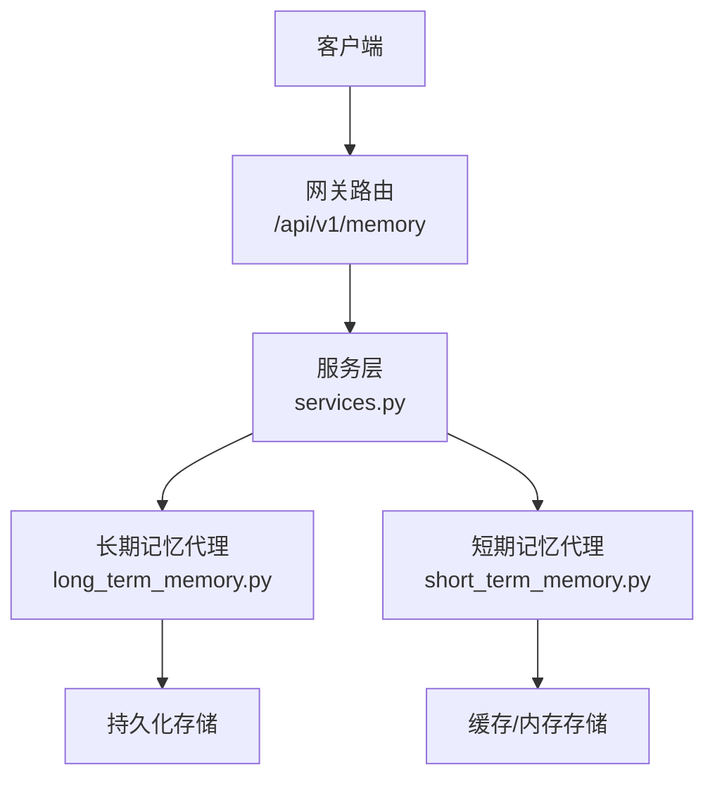
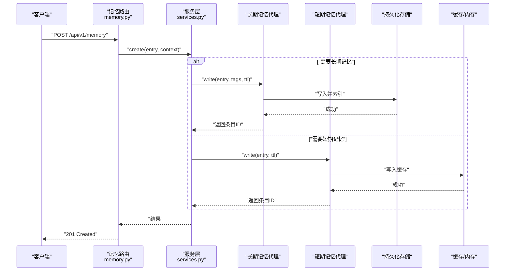
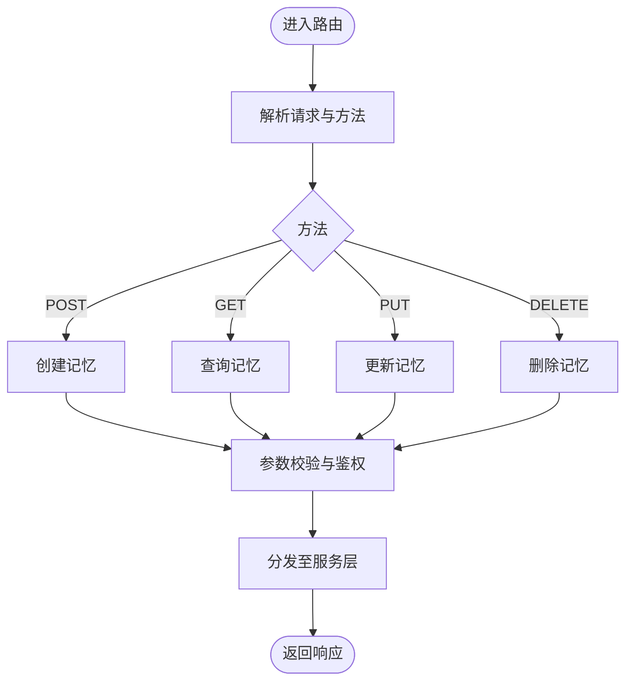
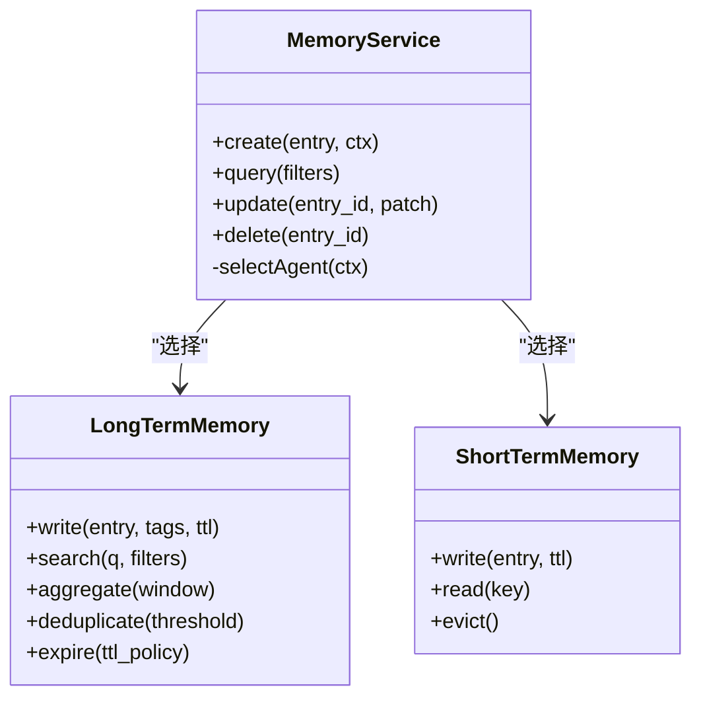
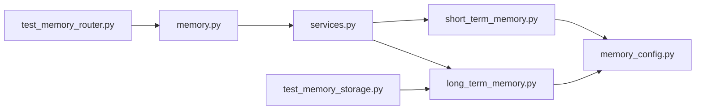

# 记忆管理API

<cite>
**本文引用的文件**   
- [backend/app/gateway/routers/memory.py](file://backend/app/gateway/routers/memory.py)
- [backend/app/gateway/services.py](file://backend/app/gateway/services.py)
- [backend/packages/harness/deerflow/agents/memory/__init__.py](file://backend/packages/harness/deerflow/agents/memory/__init__.py)
- [backend/packages/harness/deerflow/agents/memory/base.py](file://backend/packages/harness/deerflow/agents/memory/base.py)
- [backend/packages/harness/deerflow/agents/memory/long_term_memory.py](file://backend/packages/harness/deerflow/agents/memory/long_term_memory.py)
- [backend/packages/harness/deerflow/agents/memory/short_term_memory.py](file://backend/packages/harness/deerflow/agents/memory/short_term_memory.py)
- [backend/packages/harness/deerflow/config/memory_config.py](file://backend/packages/harness/deerflow/config/memory_config.py)
- [backend/docs/MEMORY_IMPROVEMENTS.md](file://backend/docs/MEMORY_IMPROVEMENTS.md)
- [backend/docs/MEMORY_SETTINGS_REVIEW.md](file://backend/docs/MEMORY_SETTINGS_REVIEW.md)
- [backend/tests/test_memory_router.py](file://backend/tests/test_memory_router.py)
- [backend/tests/test_memory_storage.py](file://backend/tests/test_memory_storage.py)
</cite>

## 目录
1. [简介](#简介)
2. [项目结构](#项目结构)
3. [核心组件](#核心组件)
4. [架构总览](#架构总览)
5. [详细组件分析](#详细组件分析)
6. [依赖关系分析](#依赖关系分析)
7. [性能考虑](#性能考虑)
8. [故障排查指南](#故障排查指南)
9. [结论](#结论)
10. [附录](#附录)

## 简介
本文件为 DeerFlow 记忆系统的 RESTful API 文档，覆盖长期记忆与短期记忆的 HTTP 端点、数据结构、检索算法、上下文关联机制、聚合/去重/过期策略配置、搜索与分类标签、权限控制以及请求示例与性能优化建议。目标读者包括后端开发者、集成方与运维人员。

## 项目结构
记忆系统在后端采用“网关路由 + 服务层 + 记忆代理”的分层设计：
- 网关路由层：暴露 REST 接口（如 /api/v1/memory），负责参数校验、鉴权、调用服务层。
- 服务层：编排业务逻辑，协调不同记忆类型（长期/短期）的读写与查询。
- 记忆代理层：封装具体存储与检索实现，提供统一的创建、更新、删除、查询、搜索等能力。

图表来源
- [backend/app/gateway/routers/memory.py](file://backend/app/gateway/routers/memory.py)
- [backend/app/gateway/services.py](file://backend/app/gateway/services.py)
- [backend/packages/harness/deerflow/agents/memory/long_term_memory.py](file://backend/packages/harness/deerflow/agents/memory/long_term_memory.py)
- [backend/packages/harness/deerflow/agents/memory/short_term_memory.py](file://backend/packages/harness/deerflow/agents/memory/short_term_memory.py)

章节来源
- [backend/app/gateway/routers/memory.py](file://backend/app/gateway/routers/memory.py)
- [backend/app/gateway/services.py](file://backend/app/gateway/services.py)

## 核心组件
- 记忆路由：定义 /api/v1/memory 相关端点，处理 POST/GET/PUT/DELETE 等操作。
- 记忆服务：统一入口，根据上下文选择长期或短期记忆代理执行操作。
- 长期记忆代理：面向持久化存储，支持聚合、去重、过期策略、全文检索与标签过滤。
- 短期记忆代理：面向会话级或短时缓存，强调低延迟与高吞吐。
- 记忆配置：集中管理聚合窗口、去重阈值、过期时间、索引与分页等参数。

章节来源
- [backend/packages/harness/deerflow/agents/memory/__init__.py](file://backend/packages/harness/deerflow/agents/memory/__init__.py)
- [backend/packages/harness/deerflow/agents/memory/base.py](file://backend/packages/harness/deerflow/agents/memory/base.py)
- [backend/packages/harness/deerflow/config/memory_config.py](file://backend/packages/harness/deerflow/config/memory_config.py)

## 架构总览
下图展示了从客户端到存储层的完整调用路径，以及长期/短期记忆的选择与数据流向。

图表来源
- [backend/app/gateway/routers/memory.py](file://backend/app/gateway/routers/memory.py)
- [backend/app/gateway/services.py](file://backend/app/gateway/services.py)
- [backend/packages/harness/deerflow/agents/memory/long_term_memory.py](file://backend/packages/harness/deerflow/agents/memory/long_term_memory.py)
- [backend/packages/harness/deerflow/agents/memory/short_term_memory.py](file://backend/packages/harness/deerflow/agents/memory/short_term_memory.py)

## 详细组件分析

### 记忆路由与HTTP端点
- 创建记忆：POST /api/v1/memory
  - 功能：在上下文中创建一条记忆条目，自动判定写入长期或短期记忆。
  - 请求体字段：内容、标签、上下文标识、可选过期时间、优先级等。
  - 响应：返回条目ID与状态。
- 查询记忆：GET /api/v1/memory
  - 功能：按条件筛选与分页返回记忆条目；支持关键词搜索、标签过滤、时间范围、排序。
  - 查询参数：q、tags、thread_id、user_id、start_time、end_time、page、size、sort_by、order。
- 更新记忆：PUT /api/v1/memory/{entry_id}
  - 功能：更新指定条目的内容、标签、过期时间等元数据。
  - 路径参数：entry_id。
  - 请求体：待更新的字段集合。
- 删除记忆：DELETE /api/v1/memory/{entry_id}
  - 功能：物理删除或软删除（取决于配置）。
  - 路径参数：entry_id。

图表来源
- [backend/app/gateway/routers/memory.py](file://backend/app/gateway/routers/memory.py)

章节来源
- [backend/app/gateway/routers/memory.py](file://backend/app/gateway/routers/memory.py)
- [backend/tests/test_memory_router.py](file://backend/tests/test_memory_router.py)

### 服务层编排
- 职责：接收路由层请求，依据上下文（如线程、用户、任务阶段）决定使用长期或短期记忆代理。
- 关键流程：
  - 创建：校验输入 -> 生成唯一ID -> 选择代理 -> 写入 -> 返回ID。
  - 查询：解析过滤条件 -> 构建查询 -> 合并长期/短期结果 -> 分页与排序 -> 返回。
  - 更新：定位条目 -> 校验权限 -> 应用变更 -> 刷新索引/缓存。
  - 删除：定位条目 -> 校验权限 -> 执行删除 -> 清理索引/缓存。

图表来源
- [backend/app/gateway/services.py](file://backend/app/gateway/services.py)
- [backend/packages/harness/deerflow/agents/memory/long_term_memory.py](file://backend/packages/harness/deerflow/agents/memory/long_term_memory.py)
- [backend/packages/harness/deerflow/agents/memory/short_term_memory.py](file://backend/packages/harness/deerflow/agents/memory/short_term_memory.py)

章节来源
- [backend/app/gateway/services.py](file://backend/app/gateway/services.py)
- [backend/packages/harness/deerflow/agents/memory/base.py](file://backend/packages/harness/deerflow/agents/memory/base.py)

### 长期记忆代理
- 能力：
  - 写入与索引：结构化存储与全文索引，支持标签与元数据。
  - 聚合：基于时间窗口或主题进行摘要聚合，减少冗余。
  - 去重：相似度阈值去重，避免重复知识积累。
  - 过期：按TTL策略清理过期条目，释放空间。
  - 搜索：关键词、标签、时间范围组合查询。
- 复杂度：
  - 写入：O(log N) 索引插入（近似），聚合与去重为批处理任务。
  - 查询：O(k log N) 近似最近邻或倒排索引扫描（k为候选数）。
- 优化：
  - 批量写入、异步索引、分片存储、冷热分层。

章节来源
- [backend/packages/harness/deerflow/agents/memory/long_term_memory.py](file://backend/packages/harness/deerflow/agents/memory/long_term_memory.py)
- [backend/packages/harness/deerflow/agents/memory/base.py](file://backend/packages/harness/deerflow/agents/memory/base.py)

### 短期记忆代理
- 能力：
  - 快速读写：适合会话内上下文片段、临时中间结果。
  - TTL与淘汰：LRU/LFU策略结合TTL，保障内存占用可控。
  - 轻量索引：键值索引，支持按会话/线程维度隔离。
- 复杂度：
  - 读写：O(1) 平均。
  - 淘汰：O(log M) 堆维护（M为缓存项数）。

章节来源
- [backend/packages/harness/deerflow/agents/memory/short_term_memory.py](file://backend/packages/harness/deerflow/agents/memory/short_term_memory.py)
- [backend/packages/harness/deerflow/agents/memory/base.py](file://backend/packages/harness/deerflow/agents/memory/base.py)

### 记忆数据结构
- 通用字段：
  - entry_id：唯一标识。
  - content：文本或结构化内容。
  - tags：分类标签列表。
  - metadata：扩展元数据（如来源、版本、权重）。
  - created_at/updated_at：时间戳。
  - ttl：过期时间（秒或绝对时间）。
  - scope：作用域（如 thread_id、user_id）。
- 长期记忆特有：
  - index_key：用于检索的关键字或向量特征。
  - aggregate_id：聚合后的父条目ID。
- 短期记忆特有：
  - session_key：会话键。
  - priority：优先级（影响淘汰顺序）。

章节来源
- [backend/packages/harness/deerflow/agents/memory/base.py](file://backend/packages/harness/deerflow/agents/memory/base.py)
- [backend/packages/harness/deerflow/agents/memory/long_term_memory.py](file://backend/packages/harness/deerflow/agents/memory/long_term_memory.py)
- [backend/packages/harness/deerflow/agents/memory/short_term_memory.py](file://backend/packages/harness/deerflow/agents/memory/short_term_memory.py)

### 检索算法与上下文关联
- 检索算法：
  - 关键词匹配：倒排索引 + 布尔/短语查询。
  - 语义检索：向量相似度（余弦/内积），支持Top-K召回与重排。
  - 混合检索：关键词与语义加权融合。
- 上下文关联：
  - 通过 thread_id/user_id/scope 限定查询范围。
  - 短期记忆优先命中，未命中再回退到长期记忆。
  - 可配置相关性阈值与最大返回数量。

章节来源
- [backend/packages/harness/deerflow/agents/memory/long_term_memory.py](file://backend/packages/harness/deerflow/agents/memory/long_term_memory.py)
- [backend/packages/harness/deerflow/agents/memory/short_term_memory.py](file://backend/packages/harness/deerflow/agents/memory/short_term_memory.py)

### 聚合、去重与过期策略配置
- 聚合：
  - 窗口大小：时间窗口（小时/天）或主题聚类。
  - 聚合粒度：按标签、来源、作者分组。
  - 输出：摘要或代表性片段。
- 去重：
  - 相似度阈值：0.8~0.95可调。
  - 比较维度：标题、正文、标签、元数据。
- 过期：
  - TTL策略：固定时长或相对更新时间。
  - 清理周期：定时任务或惰性清理。
- 配置位置：
  - memory_config.py 中集中管理上述参数。

章节来源
- [backend/packages/harness/deerflow/config/memory_config.py](file://backend/packages/harness/deerflow/config/memory_config.py)
- [backend/docs/MEMORY_SETTINGS_REVIEW.md](file://backend/docs/MEMORY_SETTINGS_REVIEW.md)

### 搜索、分类标签与权限控制
- 搜索：
  - 支持 q（关键词）、tags（多标签）、time_range、scope 过滤。
  - 排序：按相关性、时间、权重。
- 分类标签：
  - 标签层级与别名映射，支持模糊匹配。
  - 标签统计与热门标签推荐。
- 权限控制：
  - 基于用户/角色的访问控制（ACL）。
  - 资源级权限：thread_id/user_id 隔离。
  - 审计日志：记录敏感操作。

章节来源
- [backend/app/gateway/routers/memory.py](file://backend/app/gateway/routers/memory.py)
- [backend/app/gateway/services.py](file://backend/app/gateway/services.py)

### 请求示例与响应规范
- 创建记忆（POST /api/v1/memory）
  - 请求体包含：content、tags、metadata、ttl、scope。
  - 响应：201 Created，返回 entry_id 与状态。
- 查询记忆（GET /api/v1/memory）
  - 查询参数：q、tags、thread_id、user_id、start_time、end_time、page、size、sort_by、order。
  - 响应：200 OK，返回条目列表与分页信息。
- 更新记忆（PUT /api/v1/memory/{entry_id}）
  - 路径参数：entry_id。
  - 请求体：待更新字段。
  - 响应：200 OK，返回更新后条目。
- 删除记忆（DELETE /api/v1/memory/{entry_id}）
  - 路径参数：entry_id。
  - 响应：204 No Content 或 200 OK（软删除）。

章节来源
- [backend/app/gateway/routers/memory.py](file://backend/app/gateway/routers/memory.py)
- [backend/tests/test_memory_router.py](file://backend/tests/test_memory_router.py)

## 依赖关系分析
- 路由层依赖服务层，服务层依赖记忆代理，记忆代理依赖底层存储/缓存。
- 配置模块被服务层与代理层共同引用，确保行为一致。
- 测试用例覆盖路由与服务层关键路径，保障稳定性。

图表来源
- [backend/app/gateway/routers/memory.py](file://backend/app/gateway/routers/memory.py)
- [backend/app/gateway/services.py](file://backend/app/gateway/services.py)
- [backend/packages/harness/deerflow/agents/memory/long_term_memory.py](file://backend/packages/harness/deerflow/agents/memory/long_term_memory.py)
- [backend/packages/harness/deerflow/agents/memory/short_term_memory.py](file://backend/packages/harness/deerflow/agents/memory/short_term_memory.py)
- [backend/packages/harness/deerflow/config/memory_config.py](file://backend/packages/harness/deerflow/config/memory_config.py)
- [backend/tests/test_memory_router.py](file://backend/tests/test_memory_router.py)
- [backend/tests/test_memory_storage.py](file://backend/tests/test_memory_storage.py)

章节来源
- [backend/app/gateway/routers/memory.py](file://backend/app/gateway/routers/memory.py)
- [backend/app/gateway/services.py](file://backend/app/gateway/services.py)
- [backend/packages/harness/deerflow/config/memory_config.py](file://backend/packages/harness/deerflow/config/memory_config.py)
- [backend/tests/test_memory_router.py](file://backend/tests/test_memory_router.py)
- [backend/tests/test_memory_storage.py](file://backend/tests/test_memory_storage.py)

## 性能考虑
- 写入优化：
  - 批量写入与异步索引，降低主链路延迟。
  - 短期记忆优先，减少长尾查询。
- 查询优化：
  - 分页与游标，避免全表扫描。
  - 预取热点条目，缓存常用查询结果。
- 存储优化：
  - 冷热分层，冷数据归档。
  - 压缩与列式存储（针对大文本）。
- 监控与告警：
  - QPS、P99延迟、错误率、内存占用、索引大小。
  - 慢查询分析与自动降级。

[本节为通用指导，不直接分析具体文件]

## 故障排查指南
- 常见问题：
  - 404 Not Found：条目不存在或权限不足。
  - 400 Bad Request：参数缺失或格式错误。
  - 500 Internal Server Error：存储不可用或索引异常。
- 诊断步骤：
  - 检查路由日志与服务层trace。
  - 验证记忆代理健康状态与存储连接。
  - 查看配置是否生效（TTL、阈值、分页）。
- 恢复措施：
  - 重试与熔断，避免雪崩。
  - 重建索引与清理过期数据。
  - 回滚到上一稳定版本配置。

章节来源
- [backend/tests/test_memory_router.py](file://backend/tests/test_memory_router.py)
- [backend/tests/test_memory_storage.py](file://backend/tests/test_memory_storage.py)

## 结论
DeerFlow 记忆系统通过清晰的分层架构与可扩展的记忆代理，提供了健壮的长期/短期记忆管理能力。RESTful API 覆盖了CRUD、搜索、过滤与权限控制，配合聚合、去重与过期策略，满足复杂场景下的知识管理与上下文关联需求。建议在部署时关注性能指标与监控告警，持续优化索引与缓存策略。

[本节为总结性内容，不直接分析具体文件]

## 附录
- 参考文档：
  - MEMORY_IMPROVEMENTS.md：记忆改进设计与实践。
  - MEMORY_SETTINGS_REVIEW.md：记忆设置审查与最佳实践。

章节来源
- [backend/docs/MEMORY_IMPROVEMENTS.md](file://backend/docs/MEMORY_IMPROVEMENTS.md)
- [backend/docs/MEMORY_SETTINGS_REVIEW.md](file://backend/docs/MEMORY_SETTINGS_REVIEW.md)