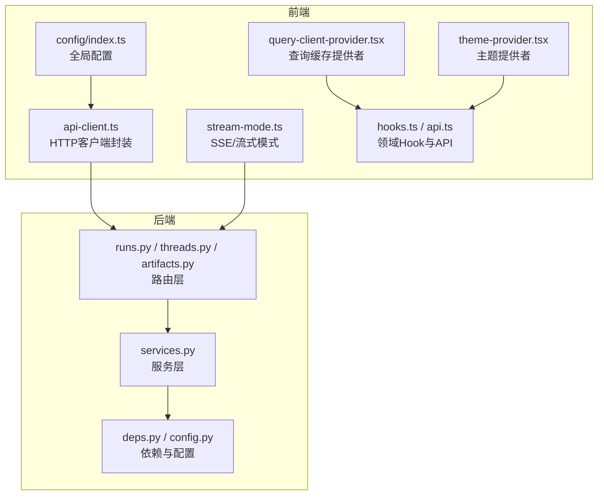
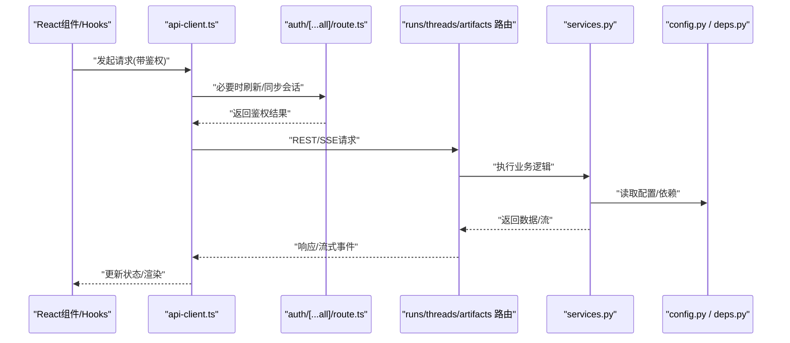
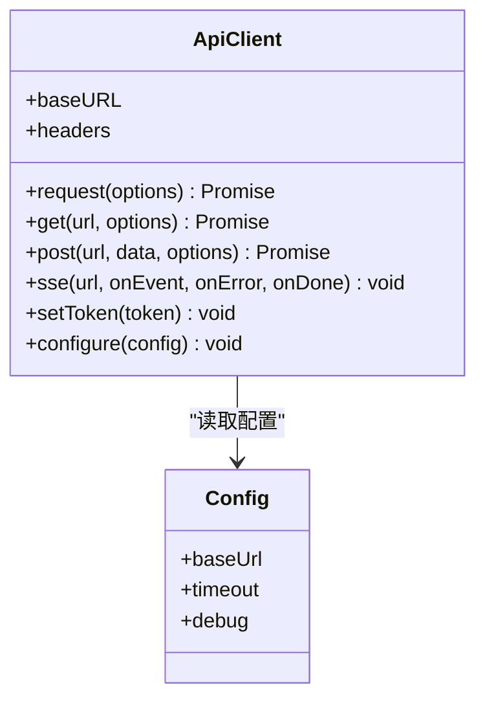
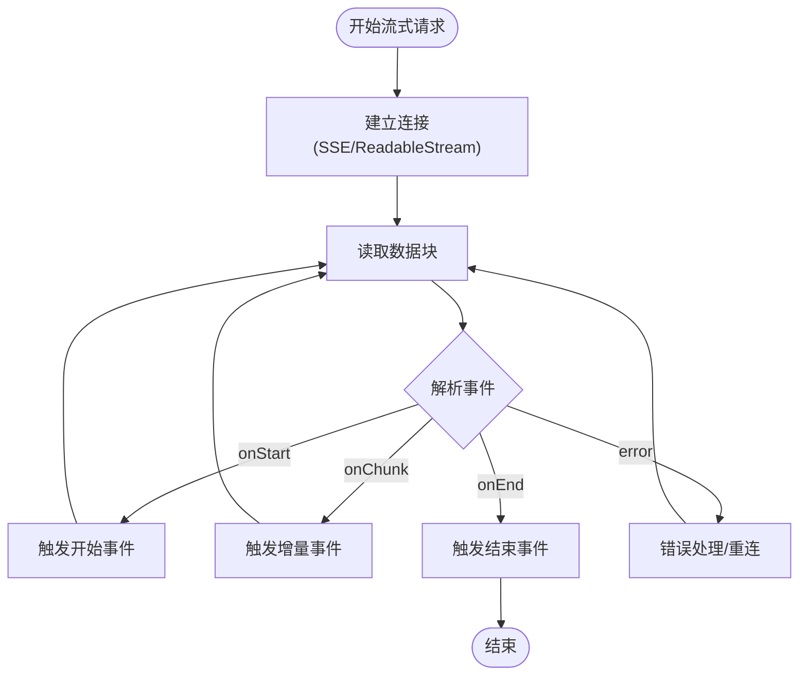
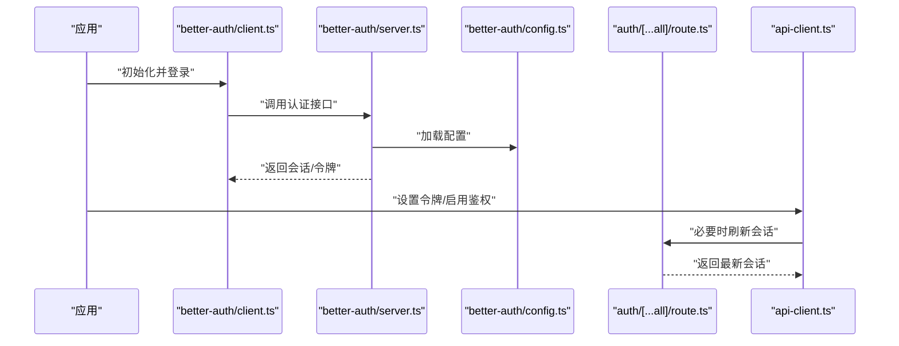
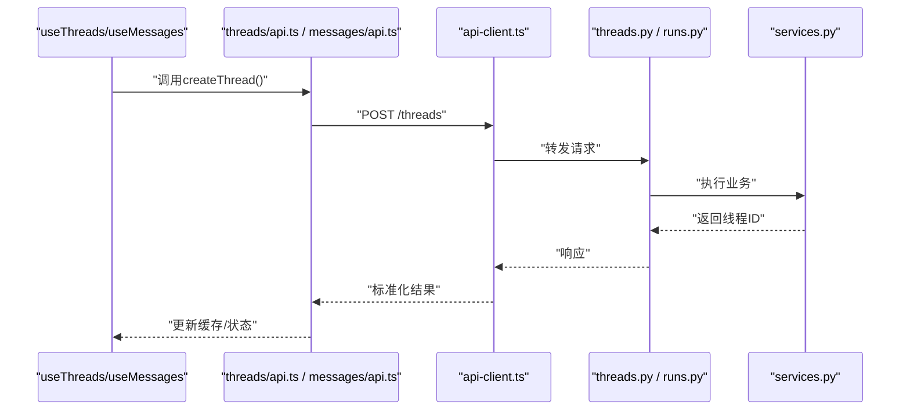
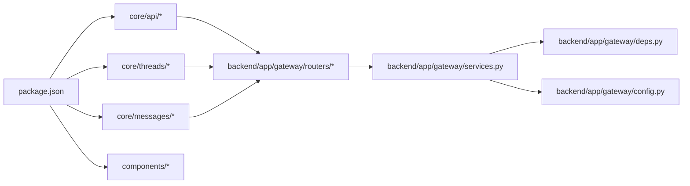

# JavaScript/TypeScript SDK集成

<cite>
**本文引用的文件**   
- [frontend/src/core/api/api-client.ts](file://frontend/src/core/api/api-client.ts)
- [frontend/src/core/api/stream-mode.ts](file://frontend/src/core/api/stream-mode.ts)
- [frontend/src/core/config/index.ts](file://frontend/src/core/config/index.ts)
- [frontend/src/app/api/auth/[...all]/route.ts](file://frontend/src/app/api/auth/[...all]/route.ts)
- [frontend/src/server/better-auth/client.ts](file://frontend/src/server/better-auth/client.ts)
- [frontend/src/server/better-auth/config.ts](file://frontend/src/server/better-auth/config.ts)
- [frontend/src/server/better-auth/server.ts](file://frontend/src/server/better-auth/server.ts)
- [frontend/src/core/threads/hooks.ts](file://frontend/src/core/threads/hooks.ts)
- [frontend/src/core/threads/api.ts](file://frontend/src/core/threads/api.ts)
- [frontend/src/core/messages/api.ts](file://frontend/src/core/messages/api.ts)
- [frontend/src/components/query-client-provider.tsx](file://frontend/src/components/query-client-provider.tsx)
- [frontend/src/components/theme-provider.tsx](file://frontend/src/components/theme-provider.tsx)
- [frontend/package.json](file://frontend/package.json)
- [backend/app/gateway/routers/runs.py](file://backend/app/gateway/routers/runs.py)
- [backend/app/gateway/routers/threads.py](file://backend/app/gateway/routers/threads.py)
- [backend/app/gateway/routers/artifacts.py](file://backend/app/gateway/routers/artifacts.py)
- [backend/app/gateway/services.py](file://backend/app/gateway/services.py)
- [backend/app/gateway/deps.py](file://backend/app/gateway/deps.py)
- [backend/app/gateway/config.py](file://backend/app/gateway/config.py)
</cite>

## 目录
1. [简介](#简介)
2. [项目结构](#项目结构)
3. [核心组件](#核心组件)
4. [架构总览](#架构总览)
5. [详细组件分析](#详细组件分析)
6. [依赖分析](#依赖分析)
7. [性能考虑](#性能考虑)
8. [故障排查指南](#故障排查指南)
9. [结论](#结论)
10. [附录](#附录)

## 简介
本指南面向在浏览器与Node.js环境中集成JavaScript/TypeScript SDK的开发者，覆盖安装与配置、客户端初始化、认证、API调用、React组件与Hooks集成、WebSocket实时通信、类型定义扩展、前端最佳实践（请求拦截器、错误处理、用户体验优化），并提供完整示例路径与常见问题解决方案。

## 项目结构
本项目采用前后端分离：
- 前端使用Next.js + React + TypeScript，提供SDK封装、状态管理、UI组件与演示页面。
- 后端基于Python FastAPI网关，暴露REST与流式接口，并通过服务层与中间件完成业务编排。

图表来源
- [frontend/src/core/api/api-client.ts](file://frontend/src/core/api/api-client.ts)
- [frontend/src/core/api/stream-mode.ts](file://frontend/src/core/api/stream-mode.ts)
- [frontend/src/core/config/index.ts](file://frontend/src/core/config/index.ts)
- [frontend/src/components/query-client-provider.tsx](file://frontend/src/components/query-client-provider.tsx)
- [frontend/src/components/theme-provider.tsx](file://frontend/src/components/theme-provider.tsx)
- [backend/app/gateway/routers/runs.py](file://backend/app/gateway/routers/runs.py)
- [backend/app/gateway/routers/threads.py](file://backend/app/gateway/routers/threads.py)
- [backend/app/gateway/routers/artifacts.py](file://backend/app/gateway/routers/artifacts.py)
- [backend/app/gateway/services.py](file://backend/app/gateway/services.py)
- [backend/app/gateway/deps.py](file://backend/app/gateway/deps.py)
- [backend/app/gateway/config.py](file://backend/app/gateway/config.py)

章节来源
- [frontend/package.json](file://frontend/package.json)
- [frontend/src/core/api/api-client.ts](file://frontend/src/core/api/api-client.ts)
- [frontend/src/core/api/stream-mode.ts](file://frontend/src/core/api/stream-mode.ts)
- [frontend/src/core/config/index.ts](file://frontend/src/core/config/index.ts)
- [backend/app/gateway/routers/runs.py](file://backend/app/gateway/routers/runs.py)
- [backend/app/gateway/routers/threads.py](file://backend/app/gateway/routers/threads.py)
- [backend/app/gateway/routers/artifacts.py](file://backend/app/gateway/routers/artifacts.py)
- [backend/app/gateway/services.py](file://backend/app/gateway/services.py)
- [backend/app/gateway/deps.py](file://backend/app/gateway/deps.py)
- [backend/app/gateway/config.py](file://backend/app/gateway/config.py)

## 核心组件
- HTTP客户端封装：统一请求头、鉴权注入、重试与错误转换。
- 流式模式：支持SSE/ReadableStream等流式响应解析与事件分发。
- 配置中心：集中管理基础URL、超时、代理、调试开关等。
- 认证桥接：通过Next.js API路由转发至后端认证服务，实现无感登录态同步。
- 领域API与Hooks：按功能域组织API调用与React Hooks，简化状态管理。
- 查询缓存与主题：提供通用能力，提升交互体验与一致性。

章节来源
- [frontend/src/core/api/api-client.ts](file://frontend/src/core/api/api-client.ts)
- [frontend/src/core/api/stream-mode.ts](file://frontend/src/core/api/stream-mode.ts)
- [frontend/src/core/config/index.ts](file://frontend/src/core/config/index.ts)
- [frontend/src/app/api/auth/[...all]/route.ts](file://frontend/src/app/api/auth/[...all]/route.ts)
- [frontend/src/core/threads/hooks.ts](file://frontend/src/core/threads/hooks.ts)
- [frontend/src/core/threads/api.ts](file://frontend/src/core/threads/api.ts)
- [frontend/src/core/messages/api.ts](file://frontend/src/core/messages/api.ts)
- [frontend/src/components/query-client-provider.tsx](file://frontend/src/components/query-client-provider.tsx)
- [frontend/src/components/theme-provider.tsx](file://frontend/src/components/theme-provider.tsx)

## 架构总览
下图展示从前端到后端的典型调用链，包括认证、REST与流式通信。

图表来源
- [frontend/src/core/api/api-client.ts](file://frontend/src/core/api/api-client.ts)
- [frontend/src/app/api/auth/[...all]/route.ts](file://frontend/src/app/api/auth/[...all]/route.ts)
- [backend/app/gateway/routers/runs.py](file://backend/app/gateway/routers/runs.py)
- [backend/app/gateway/routers/threads.py](file://backend/app/gateway/routers/threads.py)
- [backend/app/gateway/routers/artifacts.py](file://backend/app/gateway/routers/artifacts.py)
- [backend/app/gateway/services.py](file://backend/app/gateway/services.py)
- [backend/app/gateway/config.py](file://backend/app/gateway/config.py)
- [backend/app/gateway/deps.py](file://backend/app/gateway/deps.py)

## 详细组件分析

### HTTP客户端封装（api-client）
- 职责：统一构建请求、注入鉴权头、处理错误码、重试策略、取消请求、日志与调试。
- 关键点：
  - 基础URL与默认头来自配置中心。
  - 自动附加会话令牌或签名。
  - 对网络异常、超时、服务端错误进行规范化处理。
  - 为流式接口提供专用方法或标志位。

图表来源
- [frontend/src/core/api/api-client.ts](file://frontend/src/core/api/api-client.ts)
- [frontend/src/core/config/index.ts](file://frontend/src/core/config/index.ts)

章节来源
- [frontend/src/core/api/api-client.ts](file://frontend/src/core/api/api-client.ts)
- [frontend/src/core/config/index.ts](file://frontend/src/core/config/index.ts)

### 流式模式（stream-mode）
- 职责：解析SSE/ReadableStream，将字节流转换为结构化事件，触发回调或写入状态。
- 关键点：
  - 事件类型映射（如开始、增量、结束、错误）。
  - 断线重连与背压控制。
  - 与客户端封装协作，复用鉴权与错误处理。

图表来源
- [frontend/src/core/api/stream-mode.ts](file://frontend/src/core/api/stream-mode.ts)
- [frontend/src/core/api/api-client.ts](file://frontend/src/core/api/api-client.ts)

章节来源
- [frontend/src/core/api/stream-mode.ts](file://frontend/src/core/api/stream-mode.ts)
- [frontend/src/core/api/api-client.ts](file://frontend/src/core/api/api-client.ts)

### 认证与鉴权（Better-Auth桥接）
- 职责：在Next.js中桥接认证客户端与服务端，统一会话生命周期。
- 关键点：
  - 客户端侧初始化认证实例。
  - 服务端路由转发认证请求，保持前后端会话一致。
  - 在HTTP客户端中自动注入鉴权信息。

图表来源
- [frontend/src/server/better-auth/client.ts](file://frontend/src/server/better-auth/client.ts)
- [frontend/src/server/better-auth/server.ts](file://frontend/src/server/better-auth/server.ts)
- [frontend/src/server/better-auth/config.ts](file://frontend/src/server/better-auth/config.ts)
- [frontend/src/app/api/auth/[...all]/route.ts](file://frontend/src/app/api/auth/[...all]/route.ts)
- [frontend/src/core/api/api-client.ts](file://frontend/src/core/api/api-client.ts)

章节来源
- [frontend/src/server/better-auth/client.ts](file://frontend/src/server/better-auth/client.ts)
- [frontend/src/server/better-auth/server.ts](file://frontend/src/server/better-auth/server.ts)
- [frontend/src/server/better-auth/config.ts](file://frontend/src/server/better-auth/config.ts)
- [frontend/src/app/api/auth/[...all]/route.ts](file://frontend/src/app/api/auth/[...all]/route.ts)
- [frontend/src/core/api/api-client.ts](file://frontend/src/core/api/api-client.ts)

### 领域API与Hooks（Threads/Messages）
- 职责：封装线程与消息相关API，并提供React Hooks用于状态管理与副作用。
- 关键点：
  - 使用查询缓存减少重复请求。
  - 提供创建、更新、删除、列表等常用操作。
  - 结合流式模式实现实时消息推送。

图表来源
- [frontend/src/core/threads/hooks.ts](file://frontend/src/core/threads/hooks.ts)
- [frontend/src/core/threads/api.ts](file://frontend/src/core/threads/api.ts)
- [frontend/src/core/messages/api.ts](file://frontend/src/core/messages/api.ts)
- [frontend/src/core/api/api-client.ts](file://frontend/src/core/api/api-client.ts)
- [backend/app/gateway/routers/threads.py](file://backend/app/gateway/routers/threads.py)
- [backend/app/gateway/routers/runs.py](file://backend/app/gateway/routers/runs.py)
- [backend/app/gateway/services.py](file://backend/app/gateway/services.py)

章节来源
- [frontend/src/core/threads/hooks.ts](file://frontend/src/core/threads/hooks.ts)
- [frontend/src/core/threads/api.ts](file://frontend/src/core/threads/api.ts)
- [frontend/src/core/messages/api.ts](file://frontend/src/core/messages/api.ts)
- [frontend/src/core/api/api-client.ts](file://frontend/src/core/api/api-client.ts)
- [backend/app/gateway/routers/threads.py](file://backend/app/gateway/routers/threads.py)
- [backend/app/gateway/routers/runs.py](file://backend/app/gateway/routers/runs.py)
- [backend/app/gateway/services.py](file://backend/app/gateway/services.py)

### 查询缓存与主题（通用能力）
- 查询缓存：集中配置缓存策略、失效与预取，降低网络开销。
- 主题：统一样式上下文，便于切换深色/浅色模式。

章节来源
- [frontend/src/components/query-client-provider.tsx](file://frontend/src/components/query-client-provider.tsx)
- [frontend/src/components/theme-provider.tsx](file://frontend/src/components/theme-provider.tsx)

## 依赖分析
- 前端依赖：
  - Next.js、React、TypeScript、查询缓存库、主题库。
  - 自定义SDK模块位于core目录，按功能域拆分。
- 后端依赖：
  - FastAPI路由、服务层、配置与依赖注入。

图表来源
- [frontend/package.json](file://frontend/package.json)
- [frontend/src/core/api/api-client.ts](file://frontend/src/core/api/api-client.ts)
- [frontend/src/core/threads/hooks.ts](file://frontend/src/core/threads/hooks.ts)
- [frontend/src/core/threads/api.ts](file://frontend/src/core/threads/api.ts)
- [frontend/src/core/messages/api.ts](file://frontend/src/core/messages/api.ts)
- [backend/app/gateway/routers/runs.py](file://backend/app/gateway/routers/runs.py)
- [backend/app/gateway/routers/threads.py](file://backend/app/gateway/routers/threads.py)
- [backend/app/gateway/routers/artifacts.py](file://backend/app/gateway/routers/artifacts.py)
- [backend/app/gateway/services.py](file://backend/app/gateway/services.py)
- [backend/app/gateway/deps.py](file://backend/app/gateway/deps.py)
- [backend/app/gateway/config.py](file://backend/app/gateway/config.py)

章节来源
- [frontend/package.json](file://frontend/package.json)
- [backend/app/gateway/routers/runs.py](file://backend/app/gateway/routers/runs.py)
- [backend/app/gateway/routers/threads.py](file://backend/app/gateway/routers/threads.py)
- [backend/app/gateway/routers/artifacts.py](file://backend/app/gateway/routers/artifacts.py)
- [backend/app/gateway/services.py](file://backend/app/gateway/services.py)
- [backend/app/gateway/deps.py](file://backend/app/gateway/deps.py)
- [backend/app/gateway/config.py](file://backend/app/gateway/config.py)

## 性能考虑
- 请求合并与去抖：对高频输入（如搜索、流式增量）进行节流与合并。
- 缓存策略：合理设置TTL与失效条件，避免不必要的重拉取。
- 流式渲染：优先增量更新UI，减少整页重绘。
- 资源优化：图片懒加载、代码分割、按需引入SDK模块。
- 错误降级：在网络不稳定时提供离线提示与重试机制。

## 故障排查指南
- 认证失败：
  - 检查会话是否过期，确认认证桥接路由是否正常转发。
  - 查看客户端是否在请求头中携带有效令牌。
- 流式中断：
  - 检查SSE/ReadableStream连接是否被代理或防火墙阻断。
  - 确认服务端是否持续输出事件且未提前关闭连接。
- 跨域问题：
  - 校验CORS配置与请求域名白名单。
- 超时与重试：
  - 调整超时阈值与重试次数，避免雪崩效应。
- 日志与调试：
  - 开启客户端调试开关，记录请求/响应与错误堆栈。

章节来源
- [frontend/src/core/api/api-client.ts](file://frontend/src/core/api/api-client.ts)
- [frontend/src/core/api/stream-mode.ts](file://frontend/src/core/api/stream-mode.ts)
- [frontend/src/app/api/auth/[...all]/route.ts](file://frontend/src/app/api/auth/[...all]/route.ts)

## 结论
通过统一的HTTP客户端封装、流式模式、认证桥接与领域API/Hooks，前端可快速集成SDK并在浏览器与Node.js环境稳定运行。配合查询缓存与主题能力，能显著提升开发效率与用户体验。建议在生产环境完善监控、错误上报与性能指标采集。

## 附录

### 安装与配置（浏览器与Node.js）
- 浏览器环境：
  - 通过包管理器安装SDK依赖。
  - 在入口文件中初始化配置与客户端。
  - 在根布局中提供查询缓存与主题。
- Node.js环境：
  - 使用相同SDK包，初始化客户端并设置基础URL与超时。
  - 在服务端渲染场景下，确保会话与鉴权正确传递。

章节来源
- [frontend/package.json](file://frontend/package.json)
- [frontend/src/core/config/index.ts](file://frontend/src/core/config/index.ts)
- [frontend/src/components/query-client-provider.tsx](file://frontend/src/components/query-client-provider.tsx)
- [frontend/src/components/theme-provider.tsx](file://frontend/src/components/theme-provider.tsx)

### 客户端初始化与认证配置
- 初始化步骤：
  - 导入配置与客户端。
  - 设置基础URL、超时、调试开关。
  - 注入鉴权令牌或启用自动刷新。
- 认证流程：
  - 使用认证客户端登录。
  - 通过Next.js认证路由同步会话。
  - 在HTTP客户端中自动附加鉴权信息。

章节来源
- [frontend/src/core/api/api-client.ts](file://frontend/src/core/api/api-client.ts)
- [frontend/src/core/config/index.ts](file://frontend/src/core/config/index.ts)
- [frontend/src/server/better-auth/client.ts](file://frontend/src/server/better-auth/client.ts)
- [frontend/src/server/better-auth/server.ts](file://frontend/src/server/better-auth/server.ts)
- [frontend/src/server/better-auth/config.ts](file://frontend/src/server/better-auth/config.ts)
- [frontend/src/app/api/auth/[...all]/route.ts](file://frontend/src/app/api/auth/[...all]/route.ts)

### API调用方式
- REST调用：
  - 使用领域API封装的方法进行CRUD操作。
  - 结合查询缓存进行状态管理。
- 流式调用：
  - 使用流式模式监听事件，逐步渲染结果。
  - 处理错误与重连逻辑。

章节来源
- [frontend/src/core/threads/api.ts](file://frontend/src/core/threads/api.ts)
- [frontend/src/core/messages/api.ts](file://frontend/src/core/messages/api.ts)
- [frontend/src/core/api/stream-mode.ts](file://frontend/src/core/api/stream-mode.ts)
- [frontend/src/core/api/api-client.ts](file://frontend/src/core/api/api-client.ts)

### React组件集成与Hooks
- 使用领域Hooks获取数据与执行操作。
- 在组件中订阅状态变化，结合流式事件实时更新UI。
- 利用查询缓存与乐观更新提升交互体验。

章节来源
- [frontend/src/core/threads/hooks.ts](file://frontend/src/core/threads/hooks.ts)
- [frontend/src/components/query-client-provider.tsx](file://frontend/src/components/query-client-provider.tsx)

### WebSocket实时通信
- 说明：当前仓库主要采用SSE/ReadableStream进行实时通信；若需WebSocket，可在现有流式模式基础上扩展连接管理与事件分发。
- 建议：
  - 抽象连接工厂，统一处理心跳、重连与错误。
  - 与认证桥接集成，保证鉴权上下文。

章节来源
- [frontend/src/core/api/stream-mode.ts](file://frontend/src/core/api/stream-mode.ts)
- [frontend/src/core/api/api-client.ts](file://frontend/src/core/api/api-client.ts)

### TypeScript类型定义与扩展
- 使用SDK提供的类型定义，确保编译期安全。
- 在领域API中扩展自定义类型，保持前后端契约一致。
- 建议在类型变更时同步更新测试用例与文档。

章节来源
- [frontend/src/core/threads/api.ts](file://frontend/src/core/threads/api.ts)
- [frontend/src/core/messages/api.ts](file://frontend/src/core/messages/api.ts)

### 前端最佳实践
- 请求拦截器：
  - 统一添加鉴权头、追踪ID与请求时间戳。
  - 对特定错误码进行友好提示与重试。
- 错误处理：
  - 区分网络错误、业务错误与系统错误。
  - 提供用户可见的错误信息与恢复操作。
- 用户体验优化：
  - 骨架屏与占位符。
  - 流式增量渲染与进度反馈。
  - 防抖与节流，避免频繁请求。

章节来源
- [frontend/src/core/api/api-client.ts](file://frontend/src/core/api/api-client.ts)
- [frontend/src/core/api/stream-mode.ts](file://frontend/src/core/api/stream-mode.ts)

### 完整集成示例路径
- 认证桥接示例：[frontend/src/app/api/auth/[...all]/route.ts](file://frontend/src/app/api/auth/[...all]/route.ts)
- 客户端初始化示例：[frontend/src/core/api/api-client.ts](file://frontend/src/core/api/api-client.ts)
- 流式调用示例：[frontend/src/core/api/stream-mode.ts](file://frontend/src/core/api/stream-mode.ts)
- 领域API与Hooks示例：[frontend/src/core/threads/api.ts](file://frontend/src/core/threads/api.ts)、[frontend/src/core/threads/hooks.ts](file://frontend/src/core/threads/hooks.ts)
- 消息API示例：[frontend/src/core/messages/api.ts](file://frontend/src/core/messages/api.ts)

### 常见问题解决方案
- 跨域报错：检查后端CORS与前端请求域名。
- 401/403：确认会话是否有效，检查认证桥接路由。
- 流式无响应：检查服务端是否输出事件，确认代理与超时配置。
- 内存泄漏：确保流式连接在组件卸载时正确关闭。

章节来源
- [frontend/src/core/api/api-client.ts](file://frontend/src/core/api/api-client.ts)
- [frontend/src/core/api/stream-mode.ts](file://frontend/src/core/api/stream-mode.ts)
- [frontend/src/app/api/auth/[...all]/route.ts](file://frontend/src/app/api/auth/[...all]/route.ts)