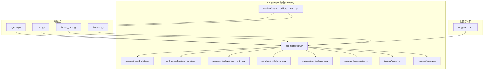
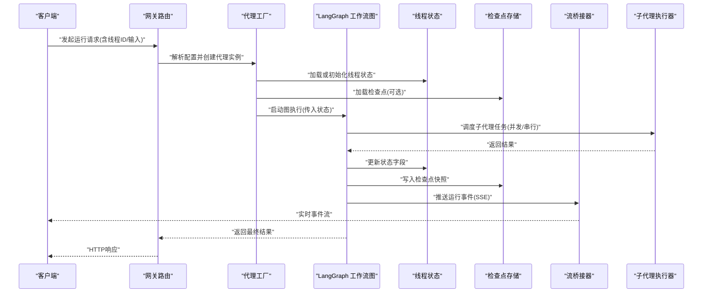
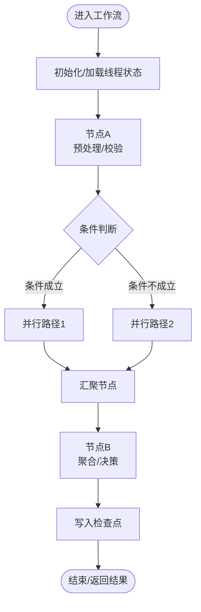
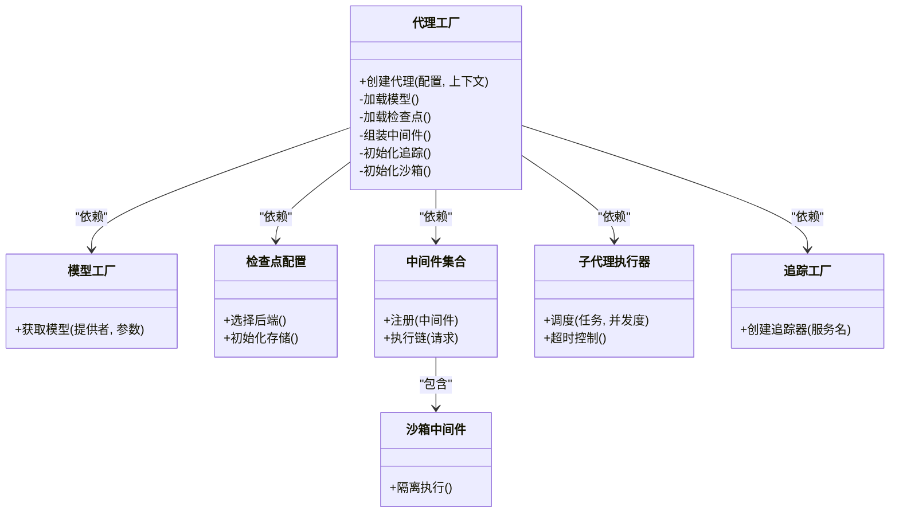
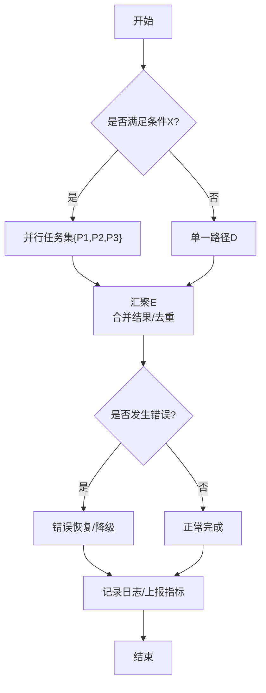
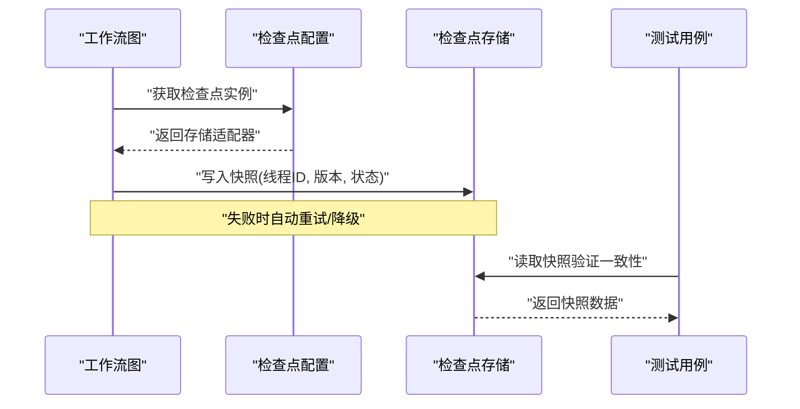
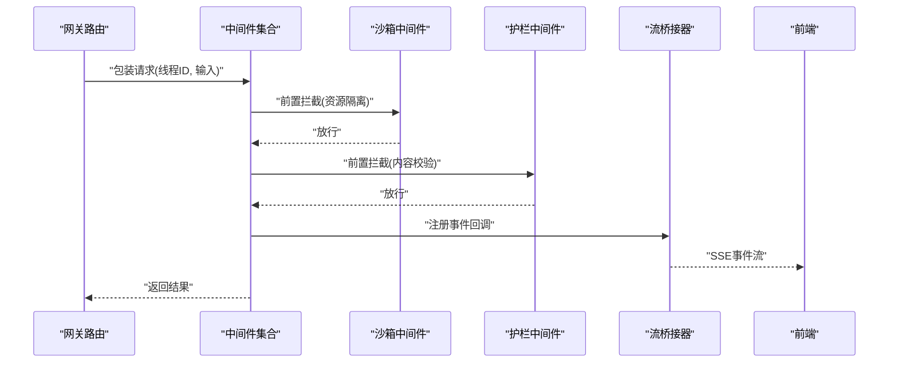
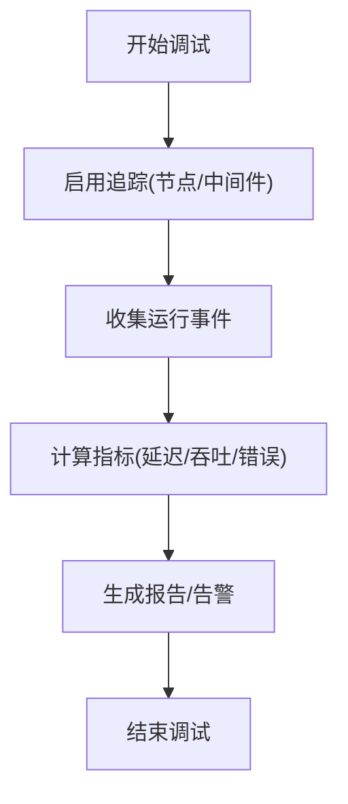
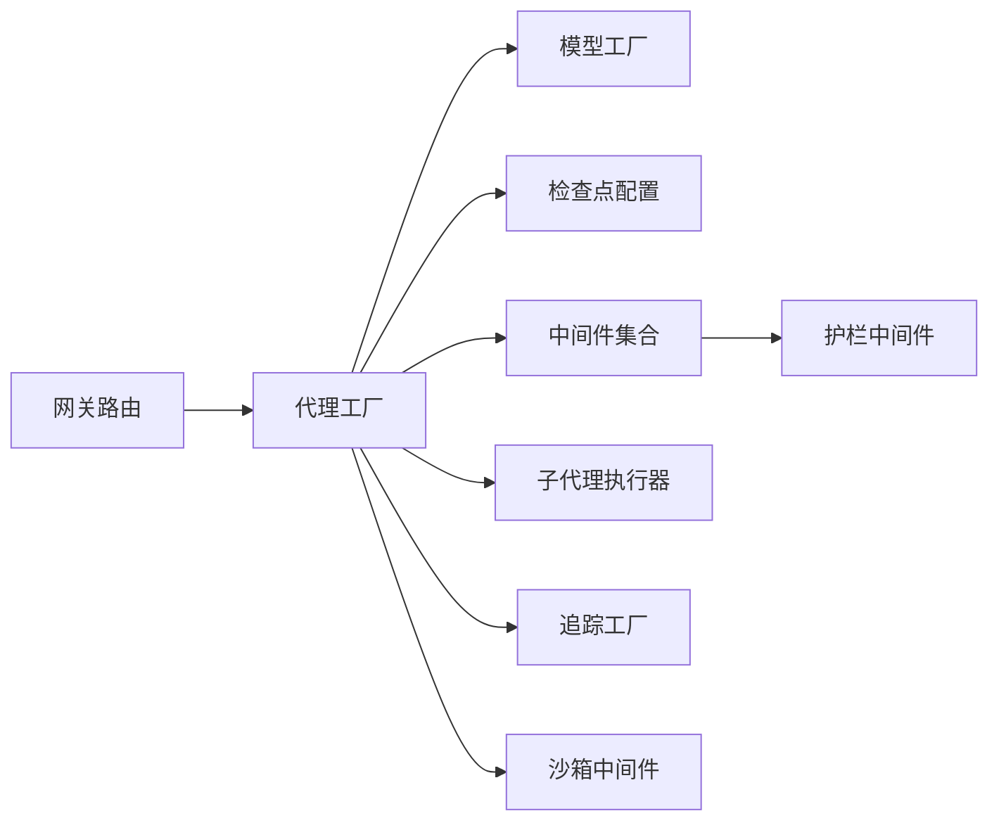

# LangGraph SDK集成

<cite>
**本文引用的文件**   
- [backend/langgraph.json](file://backend/langgraph.json)
- [backend/app/gateway/routers/agents.py](file://backend/app/gateway/routers/agents.py)
- [backend/app/gateway/routers/runs.py](file://backend/app/gateway/routers/runs.py)
- [backend/app/gateway/routers/thread_runs.py](file://backend/app/gateway/routers/thread_runs.py)
- [backend/app/gateway/routers/threads.py](file://backend/app/gateway/routers/threads.py)
- [backend/packages/harness/deerflow/agents/factory.py](file://backend/packages/harness/deerflow/agents/factory.py)
- [backend/packages/harness/deerflow/agents/thread_state.py](file://backend/packages/harness/deerflow/agents/thread_state.py)
- [backend/packages/harness/deerflow/config/checkpointer_config.py](file://backend/packages/harness/deerflow/config/checkpointer_config.py)
- [backend/packages/harness/deerflow/agents/middlewares/__init__.py](file://backend/packages/harness/deerflow/agents/middlewares/__init__.py)
- [backend/packages/harness/deerflow/runtime/stream_bridge/__init__.py](file://backend/packages/harness/deerflow/runtime/stream_bridge/__init__.py)
- [backend/packages/harness/deerflow/tracing/factory.py](file://backend/packages/harness/deerflow/tracing/factory.py)
- [backend/packages/harness/deerflow/models/factory.py](file://backend/packages/harness/deerflow/models/factory.py)
- [backend/packages/harness/deerflow/sandbox/middleware.py](file://backend/packages/harness/deerflow/sandbox/middleware.py)
- [backend/packages/harness/deerflow/guardrails/middleware.py](file://backend/packages/harness/deerflow/guardrails/middleware.py)
- [backend/packages/harness/deerflow/subagents/executor.py](file://backend/packages/harness/deerflow/subagents/executor.py)
- [backend/tests/test_checkpointer.py](file://backend/tests/test_checkpointer.py)
- [backend/tests/test_stream_bridge.py](file://backend/tests/test_stream_bridge.py)
</cite>

## 目录
1. [简介](#简介)
2. [项目结构](#项目结构)
3. [核心组件](#核心组件)
4. [架构总览](#架构总览)
5. [详细组件分析](#详细组件分析)
6. [依赖分析](#依赖分析)
7. [性能考虑](#性能考虑)
8. [故障排查指南](#故障排查指南)
9. [结论](#结论)
10. [附录](#附录)

## 简介
本指南面向在 DeerFlow 中集成与使用 LangGraph SDK 的开发者，围绕工作流图定义、节点编排、状态管理与数据流转、代理工厂与动态创建、复杂工作流构建（条件分支、并行执行、错误恢复）、检查点机制与状态持久化、与 DeerFlow 主系统的集成（中间件注册与事件处理）、调试工具与性能监控，以及生产部署与运维建议进行系统化说明。文档以仓库现有实现为依据，提供可追溯的文件来源与图示，帮助读者快速上手并安全落地到生产环境。

## 项目结构
DeerFlow 后端将 LangGraph 的工作流能力封装在 harness 包内，并通过网关路由暴露 API；运行时通过流桥接器对接前端 SSE 推送；配置中心统一管理模型、检查点、沙箱、追踪等外部依赖。

图表来源
- [backend/app/gateway/routers/agents.py](file://backend/app/gateway/routers/agents.py)
- [backend/app/gateway/routers/runs.py](file://backend/app/gateway/routers/runs.py)
- [backend/app/gateway/routers/thread_runs.py](file://backend/app/gateway/routers/thread_runs.py)
- [backend/app/gateway/routers/threads.py](file://backend/app/gateway/routers/threads.py)
- [backend/packages/harness/deerflow/agents/factory.py](file://backend/packages/harness/deerflow/agents/factory.py)
- [backend/packages/harness/deerflow/agents/thread_state.py](file://backend/packages/harness/deerflow/agents/thread_state.py)
- [backend/packages/harness/deerflow/config/checkpointer_config.py](file://backend/packages/harness/deerflow/config/checkpointer_config.py)
- [backend/packages/harness/deerflow/agents/middlewares/__init__.py](file://backend/packages/harness/deerflow/agents/middlewares/__init__.py)
- [backend/packages/harness/deerflow/sandbox/middleware.py](file://backend/packages/harness/deerflow/sandbox/middleware.py)
- [backend/packages/harness/deerflow/guardrails/middleware.py](file://backend/packages/harness/deerflow/guardrails/middleware.py)
- [backend/packages/harness/deerflow/subagents/executor.py](file://backend/packages/harness/deerflow/subagents/executor.py)
- [backend/packages/harness/deerflow/tracing/factory.py](file://backend/packages/harness/deerflow/tracing/factory.py)
- [backend/packages/harness/deerflow/models/factory.py](file://backend/packages/harness/deerflow/models/factory.py)
- [backend/packages/harness/deerflow/runtime/stream_bridge/__init__.py](file://backend/packages/harness/deerflow/runtime/stream_bridge/__init__.py)
- [backend/langgraph.json](file://backend/langgraph.json)

章节来源
- [backend/langgraph.json](file://backend/langgraph.json)
- [backend/app/gateway/routers/agents.py](file://backend/app/gateway/routers/agents.py)
- [backend/app/gateway/routers/runs.py](file://backend/app/gateway/routers/runs.py)
- [backend/app/gateway/routers/thread_runs.py](file://backend/app/gateway/routers/thread_runs.py)
- [backend/app/gateway/routers/threads.py](file://backend/app/gateway/routers/threads.py)
- [backend/packages/harness/deerflow/agents/factory.py](file://backend/packages/harness/deerflow/agents/factory.py)
- [backend/packages/harness/deerflow/agents/thread_state.py](file://backend/packages/harness/deerflow/agents/thread_state.py)
- [backend/packages/harness/deerflow/config/checkpointer_config.py](file://backend/packages/harness/deerflow/config/checkpointer_config.py)
- [backend/packages/harness/deerflow/agents/middlewares/__init__.py](file://backend/packages/harness/deerflow/agents/middlewares/__init__.py)
- [backend/packages/harness/deerflow/runtime/stream_bridge/__init__.py](file://backend/packages/harness/deerflow/runtime/stream_bridge/__init__.py)
- [backend/packages/harness/deerflow/tracing/factory.py](file://backend/packages/harness/deerflow/tracing/factory.py)
- [backend/packages/harness/deerflow/models/factory.py](file://backend/packages/harness/deerflow/models/factory.py)
- [backend/packages/harness/deerflow/sandbox/middleware.py](file://backend/packages/harness/deerflow/sandbox/middleware.py)
- [backend/packages/harness/deerflow/guardrails/middleware.py](file://backend/packages/harness/deerflow/guardrails/middleware.py)
- [backend/packages/harness/deerflow/subagents/executor.py](file://backend/packages/harness/deerflow/subagents/executor.py)

## 核心组件
- 工作流图与节点编排：通过 LangGraph 的图定义与节点函数组织业务逻辑，结合线程状态对象进行数据传递与更新。
- 代理工厂：统一负责从配置加载模型、检查点、中间件、子代理执行器等依赖，动态组装可运行的 Agent 实例。
- 状态管理：基于线程状态对象维护会话级上下文，支持增量更新与跨节点共享。
- 检查点与持久化：通过检查点配置选择存储后端，实现运行中断恢复与历史回溯。
- 流式输出：通过流桥接器将运行事件转换为 SSE 事件，供前端实时消费。
- 中间件体系：在调用链前后注入通用能力（如沙箱隔离、护栏校验、日志追踪等）。
- 子代理执行：在图中调度子代理任务，支持并发与超时控制。
- 追踪与可观测性：通过追踪工厂接入分布式追踪系统，记录关键路径指标。

章节来源
- [backend/packages/harness/deerflow/agents/factory.py](file://backend/packages/harness/deerflow/agents/factory.py)
- [backend/packages/harness/deerflow/agents/thread_state.py](file://backend/packages/harness/deerflow/agents/thread_state.py)
- [backend/packages/harness/deerflow/config/checkpointer_config.py](file://backend/packages/harness/deerflow/config/checkpointer_config.py)
- [backend/packages/harness/deerflow/agents/middlewares/__init__.py](file://backend/packages/harness/deerflow/agents/middlewares/__init__.py)
- [backend/packages/harness/deerflow/runtime/stream_bridge/__init__.py](file://backend/packages/harness/deerflow/runtime/stream_bridge/__init__.py)
- [backend/packages/harness/deerflow/subagents/executor.py](file://backend/packages/harness/deerflow/subagents/executor.py)
- [backend/packages/harness/deerflow/tracing/factory.py](file://backend/packages/harness/deerflow/tracing/factory.py)

## 架构总览
下图展示了从网关请求到 LangGraph 工作流执行的端到端流程，包括状态读取、中间件链、子代理执行、检查点写入与流式事件回传。

图表来源
- [backend/app/gateway/routers/runs.py](file://backend/app/gateway/routers/runs.py)
- [backend/app/gateway/routers/thread_runs.py](file://backend/app/gateway/routers/thread_runs.py)
- [backend/packages/harness/deerflow/agents/factory.py](file://backend/packages/harness/deerflow/agents/factory.py)
- [backend/packages/harness/deerflow/agents/thread_state.py](file://backend/packages/harness/deerflow/agents/thread_state.py)
- [backend/packages/harness/deerflow/config/checkpointer_config.py](file://backend/packages/harness/deerflow/config/checkpointer_config.py)
- [backend/packages/harness/deerflow/runtime/stream_bridge/__init__.py](file://backend/packages/harness/deerflow/runtime/stream_bridge/__init__.py)
- [backend/packages/harness/deerflow/subagents/executor.py](file://backend/packages/harness/deerflow/subagents/executor.py)

## 详细组件分析

### 工作流图定义与节点编排
- 图定义：在 harness 中以函数式节点组合成有向无环图，节点间通过状态对象传递数据。
- 节点编排：根据业务需求编排顺序、条件分支与并行路径；条件分支依据状态字段决定后续节点。
- 数据流转：每个节点接收当前状态，返回增量更新字典，由框架合并至全局状态。

图表来源
- [backend/packages/harness/deerflow/agents/thread_state.py](file://backend/packages/harness/deerflow/agents/thread_state.py)
- [backend/packages/harness/deerflow/config/checkpointer_config.py](file://backend/packages/harness/deerflow/config/checkpointer_config.py)

章节来源
- [backend/packages/harness/deerflow/agents/thread_state.py](file://backend/packages/harness/deerflow/agents/thread_state.py)
- [backend/packages/harness/deerflow/config/checkpointer_config.py](file://backend/packages/harness/deerflow/config/checkpointer_config.py)

### 代理工厂与动态创建
- 工厂职责：集中装配模型提供者、检查点、中间件、子代理执行器、追踪与沙箱等依赖，生成可运行代理。
- 动态创建：根据请求参数或配置动态切换模型、检查点后端与中间件集合。
- 配置管理：通过配置模块加载 JSON/YAML 设置，并在工厂中映射为具体实例。

图表来源
- [backend/packages/harness/deerflow/agents/factory.py](file://backend/packages/harness/deerflow/agents/factory.py)
- [backend/packages/harness/deerflow/models/factory.py](file://backend/packages/harness/deerflow/models/factory.py)
- [backend/packages/harness/deerflow/config/checkpointer_config.py](file://backend/packages/harness/deerflow/config/checkpointer_config.py)
- [backend/packages/harness/deerflow/agents/middlewares/__init__.py](file://backend/packages/harness/deerflow/agents/middlewares/__init__.py)
- [backend/packages/harness/deerflow/sandbox/middleware.py](file://backend/packages/harness/deerflow/sandbox/middleware.py)
- [backend/packages/harness/deerflow/subagents/executor.py](file://backend/packages/harness/deerflow/subagents/executor.py)
- [backend/packages/harness/deerflow/tracing/factory.py](file://backend/packages/harness/deerflow/tracing/factory.py)

章节来源
- [backend/packages/harness/deerflow/agents/factory.py](file://backend/packages/harness/deerflow/agents/factory.py)
- [backend/packages/harness/deerflow/models/factory.py](file://backend/packages/harness/deerflow/models/factory.py)
- [backend/packages/harness/deerflow/config/checkpointer_config.py](file://backend/packages/harness/deerflow/config/checkpointer_config.py)
- [backend/packages/harness/deerflow/agents/middlewares/__init__.py](file://backend/packages/harness/deerflow/agents/middlewares/__init__.py)
- [backend/packages/harness/deerflow/sandbox/middleware.py](file://backend/packages/harness/deerflow/sandbox/middleware.py)
- [backend/packages/harness/deerflow/subagents/executor.py](file://backend/packages/harness/deerflow/subagents/executor.py)
- [backend/packages/harness/deerflow/tracing/factory.py](file://backend/packages/harness/deerflow/tracing/factory.py)

### 复杂工作流构建示例
- 条件分支：在节点中读取状态字段，按规则选择不同子图或节点路径。
- 并行执行：使用子代理执行器并发调度多个独立任务，再在汇聚节点合并结果。
- 错误恢复：在中间件或节点捕获异常，写入降级结果或重试策略，确保工作流继续推进。

章节来源
- [backend/packages/harness/deerflow/subagents/executor.py](file://backend/packages/harness/deerflow/subagents/executor.py)
- [backend/packages/harness/deerflow/agents/middlewares/__init__.py](file://backend/packages/harness/deerflow/agents/middlewares/__init__.py)

### 检查点机制与状态持久化
- 检查点配置：通过配置模块选择后端（内存/数据库/对象存储），并初始化连接。
- 生命周期：在图执行的关键阶段写入快照，支持断点续跑与历史回溯。
- 测试验证：通过单元测试覆盖检查点的读写与一致性。

图表来源
- [backend/packages/harness/deerflow/config/checkpointer_config.py](file://backend/packages/harness/deerflow/config/checkpointer_config.py)
- [backend/tests/test_checkpointer.py](file://backend/tests/test_checkpointer.py)

章节来源
- [backend/packages/harness/deerflow/config/checkpointer_config.py](file://backend/packages/harness/deerflow/config/checkpointer_config.py)
- [backend/tests/test_checkpointer.py](file://backend/tests/test_checkpointer.py)

### 与 DeerFlow 主系统集成（中间件注册与事件处理）
- 中间件注册：在中间件集合中注册沙箱、护栏、日志等中间件，形成统一的执行链。
- 事件处理：流桥接器订阅运行事件，转换为 SSE 事件推送给前端。
- 网关路由：网关路由将 HTTP 请求映射到工作流执行，并透传线程上下文。

图表来源
- [backend/app/gateway/routers/agents.py](file://backend/app/gateway/routers/agents.py)
- [backend/app/gateway/routers/runs.py](file://backend/app/gateway/routers/runs.py)
- [backend/app/gateway/routers/thread_runs.py](file://backend/app/gateway/routers/thread_runs.py)
- [backend/packages/harness/deerflow/agents/middlewares/__init__.py](file://backend/packages/harness/deerflow/agents/middlewares/__init__.py)
- [backend/packages/harness/deerflow/sandbox/middleware.py](file://backend/packages/harness/deerflow/sandbox/middleware.py)
- [backend/packages/harness/deerflow/guardrails/middleware.py](file://backend/packages/harness/deerflow/guardrails/middleware.py)
- [backend/packages/harness/deerflow/runtime/stream_bridge/__init__.py](file://backend/packages/harness/deerflow/runtime/stream_bridge/__init__.py)

章节来源
- [backend/app/gateway/routers/agents.py](file://backend/app/gateway/routers/agents.py)
- [backend/app/gateway/routers/runs.py](file://backend/app/gateway/routers/runs.py)
- [backend/app/gateway/routers/thread_runs.py](file://backend/app/gateway/routers/thread_runs.py)
- [backend/packages/harness/deerflow/agents/middlewares/__init__.py](file://backend/packages/harness/deerflow/agents/middlewares/__init__.py)
- [backend/packages/harness/deerflow/sandbox/middleware.py](file://backend/packages/harness/deerflow/sandbox/middleware.py)
- [backend/packages/harness/deerflow/guardrails/middleware.py](file://backend/packages/h Harness/deerflow/guardrails/middleware.py)
- [backend/packages/harness/deerflow/runtime/stream_bridge/__init__.py](file://backend/packages/harness/deerflow/runtime/stream_bridge/__init__.py)

### 调试工具与性能监控
- 调试：利用追踪工厂创建追踪器，记录关键节点耗时、错误与上下文信息。
- 监控：结合流桥接器的事件统计与中间件埋点，输出延迟、吞吐与错误率指标。
- 测试：通过单元测试验证检查点、流桥接器行为与边界条件。

图表来源
- [backend/packages/harness/deerflow/tracing/factory.py](file://backend/packages/harness/deerflow/tracing/factory.py)
- [backend/packages/harness/deerflow/runtime/stream_bridge/__init__.py](file://backend/packages/harness/deerflow/runtime/stream_bridge/__init__.py)
- [backend/tests/test_stream_bridge.py](file://backend/tests/test_stream_bridge.py)

章节来源
- [backend/packages/harness/deerflow/tracing/factory.py](file://backend/packages/harness/deerflow/tracing/factory.py)
- [backend/packages/harness/deerflow/runtime/stream_bridge/__init__.py](file://backend/packages/harness/deerflow/runtime/stream_bridge/__init__.py)
- [backend/tests/test_stream_bridge.py](file://backend/tests/test_stream_bridge.py)

## 依赖分析
- 耦合关系：网关路由依赖代理工厂；工厂依赖模型、检查点、中间件、子代理执行器、追踪与沙箱。
- 外部依赖：模型提供者、检查点存储、追踪系统与沙箱环境。
- 循环依赖：未发现直接循环导入；各模块职责清晰，依赖方向自顶向下。

图表来源
- [backend/app/gateway/routers/agents.py](file://backend/app/gateway/routers/agents.py)
- [backend/packages/harness/deerflow/agents/factory.py](file://backend/packages/harness/deerflow/agents/factory.py)
- [backend/packages/harness/deerflow/models/factory.py](file://backend/packages/harness/deerflow/models/factory.py)
- [backend/packages/harness/deerflow/config/checkpointer_config.py](file://backend/packages/harness/deerflow/config/checkpointer_config.py)
- [backend/packages/harness/deerflow/agents/middlewares/__init__.py](file://backend/packages/harness/deerflow/agents/middlewares/__init__.py)
- [backend/packages/harness/deerflow/sandbox/middleware.py](file://backend/packages/harness/deerflow/sandbox/middleware.py)
- [backend/packages/harness/deerflow/guardrails/middleware.py](file://backend/packages/harness/deerflow/guardrails/middleware.py)
- [backend/packages/harness/deerflow/subagents/executor.py](file://backend/packages/harness/deerflow/subagents/executor.py)
- [backend/packages/harness/deerflow/tracing/factory.py](file://backend/packages/harness/deerflow/tracing/factory.py)

章节来源
- [backend/app/gateway/routers/agents.py](file://backend/app/gateway/routers/agents.py)
- [backend/packages/harness/deerflow/agents/factory.py](file://backend/packages/harness/deerflow/agents/factory.py)
- [backend/packages/harness/deerflow/models/factory.py](file://backend/packages/harness/deerflow/models/factory.py)
- [backend/packages/harness/deerflow/config/checkpointer_config.py](file://backend/packages/harness/deerflow/config/checkpointer_config.py)
- [backend/packages/harness/deerflow/agents/middlewares/__init__.py](file://backend/packages/harness/deerflow/agents/middlewares/__init__.py)
- [backend/packages/harness/deerflow/sandbox/middleware.py](file://backend/packages/harness/deerflow/sandbox/middleware.py)
- [backend/packages/harness/deerflow/guardrails/middleware.py](file://backend/packages/harness/deerflow/guardrails/middleware.py)
- [backend/packages/harness/deerflow/subagents/executor.py](file://backend/packages/harness/deerflow/subagents/executor.py)
- [backend/packages/harness/deerflow/tracing/factory.py](file://backend/packages/harness/deerflow/tracing/factory.py)

## 性能考虑
- 并发与批处理：合理设置子代理并发度，避免资源争用；对长尾任务采用批处理与限流。
- 检查点粒度：仅在关键节点写入检查点，减少 I/O 开销；使用增量快照降低存储压力。
- 流式传输：优先使用 SSE 流式输出，降低首字节延迟；在前端侧做节流与去抖。
- 缓存与复用：对热点模型与工具结果进行缓存，缩短冷启动时间。
- 资源隔离：通过沙箱中间件限制 CPU/内存/网络访问，防止恶意或失控任务影响整体稳定性。

[本节为通用指导，无需特定文件来源]

## 故障排查指南
- 常见问题定位：
  - 检查点读写失败：核对检查点配置与存储连通性，查看测试用例中的断言模式。
  - 流事件丢失：确认流桥接器事件订阅与 SSE 发送链路，参考流桥接器测试。
  - 中间件阻塞：逐一禁用中间件定位瓶颈，关注沙箱与护栏的执行耗时。
  - 子代理超时：调整执行器超时与重试策略，观察错误恢复路径。
- 日志与追踪：
  - 启用追踪工厂，记录节点与中间件耗时、异常堆栈与上下文。
  - 结合网关路由日志，关联请求 ID 与线程 ID，便于端到端追踪。

章节来源
- [backend/tests/test_checkpointer.py](file://backend/tests/test_checkpointer.py)
- [backend/tests/test_stream_bridge.py](file://backend/tests/test_stream_bridge.py)
- [backend/packages/harness/deerflow/tracing/factory.py](file://backend/packages/harness/deerflow/tracing/factory.py)
- [backend/packages/harness/deerflow/sandbox/middleware.py](file://backend/packages/harness/deerflow/sandbox/middleware.py)
- [backend/packages/harness/deerflow/guardrails/middleware.py](file://backend/packages/harness/deerflow/guardrails/middleware.py)
- [backend/packages/harness/deerflow/subagents/executor.py](file://backend/packages/harness/deerflow/subagents/executor.py)

## 结论
通过将 LangGraph 的工作流能力与 DeerFlow 的主系统深度集成，实现了灵活的状态驱动图执行、可靠的检查点持久化、可扩展的中间件体系与高效的流式事件处理。配合完善的调试与监控手段，可在保证稳定性的同时提升开发效率与用户体验。建议在复杂场景中优先采用条件分支与并行执行，并结合检查点与错误恢复策略，构建高可用的智能工作流。

[本节为总结性内容，无需特定文件来源]

## 附录
- 配置入口：工作流相关的全局配置位于 langgraph.json，用于指定图定义、默认模型与检查点后端等。
- 网关接口：通过 agents、runs、thread_runs、threads 路由暴露工作流运行与线程管理能力。
- 最佳实践：
  - 明确状态字段契约，避免隐式依赖。
  - 在中间件中统一处理鉴权、审计与限流。
  - 对长耗时任务启用检查点与重试策略。
  - 在生产环境开启追踪与告警，建立容量规划与弹性伸缩策略。

章节来源
- [backend/langgraph.json](file://backend/langgraph.json)
- [backend/app/gateway/routers/agents.py](file://backend/app/gateway/routers/agents.py)
- [backend/app/gateway/routers/runs.py](file://backend/app/gateway/routers/runs.py)
- [backend/app/gateway/routers/thread_runs.py](file://backend/app/gateway/routers/thread_runs.py)
- [backend/app/gateway/routers/threads.py](file://backend/app/gateway/routers/threads.py)