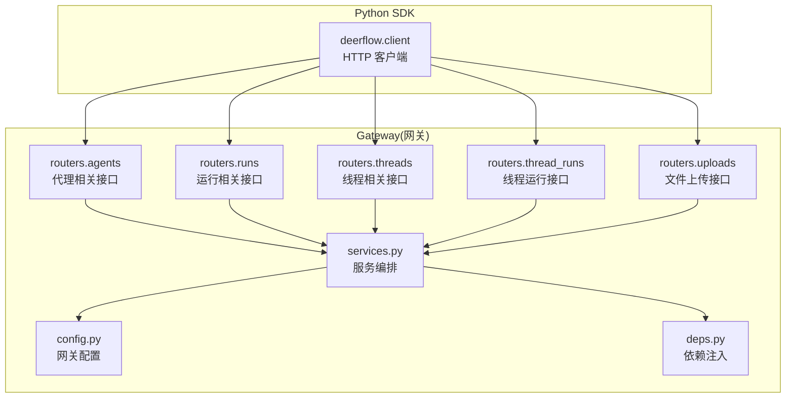
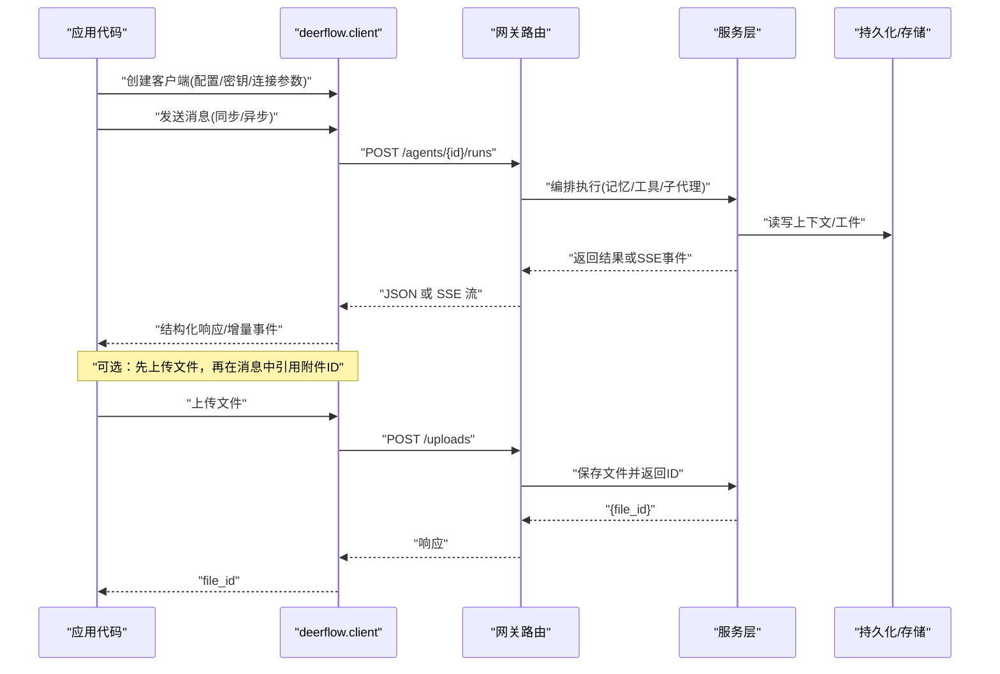
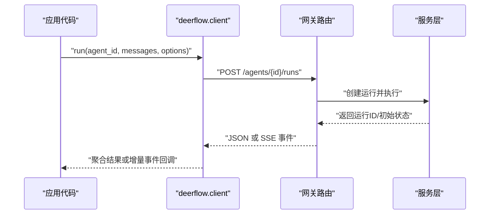
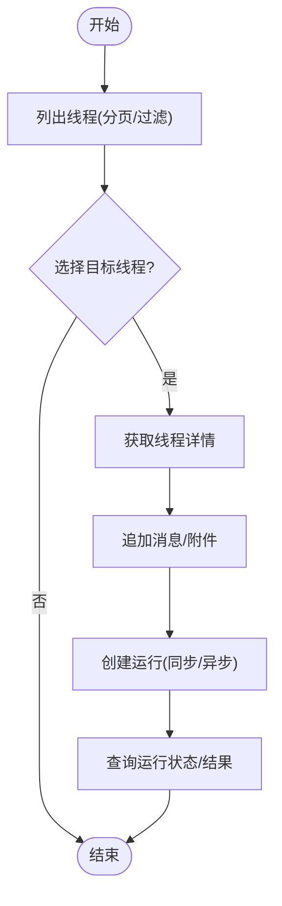
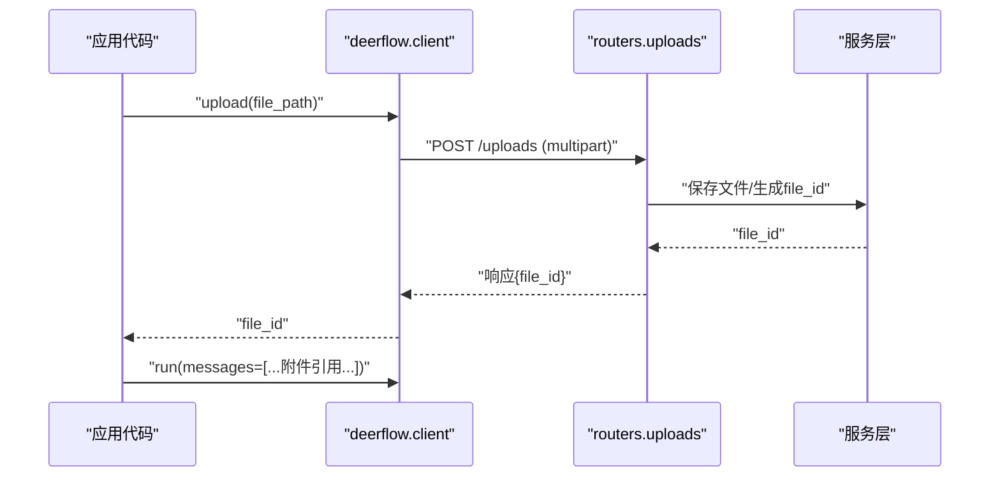
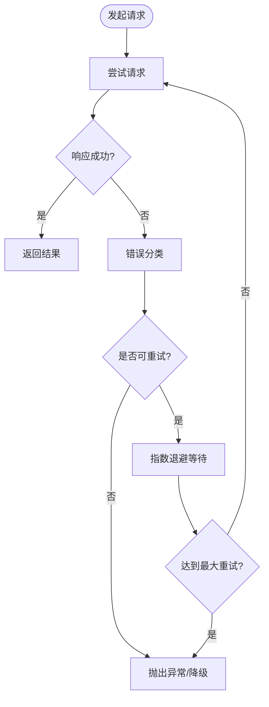
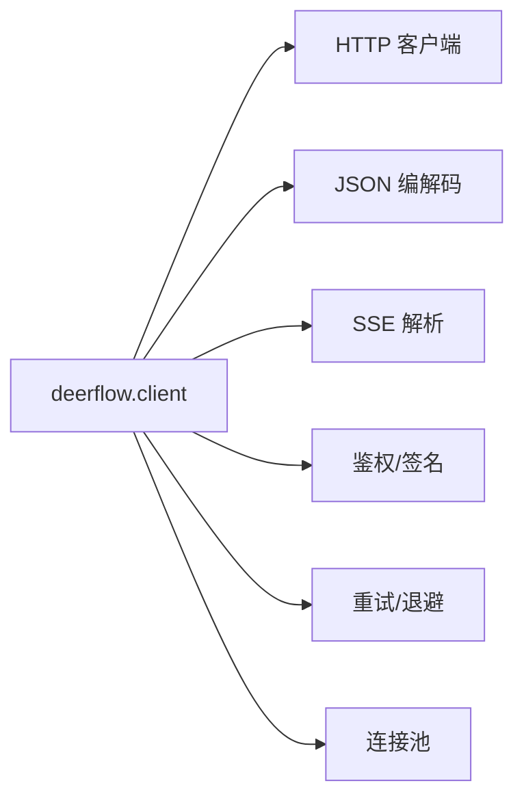

# Python SDK集成

<cite>
**本文引用的文件**   
- [backend/packages/harness/deerflow/client.py](file://backend/packages/harness/deerflow/client.py)
- [backend/app/gateway/routers/agents.py](file://backend/app/gateway/routers/agents.py)
- [backend/app/gateway/routers/uploads.py](file://backend/app/gateway/routers/uploads.py)
- [backend/app/gateway/routers/threads.py](file://backend/app/gateway/routers/threads.py)
- [backend/app/gateway/routers/runs.py](file://backend/app/gateway/routers/runs.py)
- [backend/app/gateway/routers/thread_runs.py](file://backend/app/gateway/routers/thread_runs.py)
- [backend/app/gateway/config.py](file://backend/app/gateway/config.py)
- [backend/app/gateway/services.py](file://backend/app/gateway/services.py)
- [backend/app/gateway/deps.py](file://backend/app/gateway/deps.py)
- [backend/docs/API.md](file://backend/docs/API.md)
- [backend/docs/STREAMING.md](file://backend/docs/STREAMING.md)
- [backend/docs/FILE_UPLOAD.md](file://backend/docs/FILE_UPLOAD.md)
- [backend/pyproject.toml](file://backend/pyproject.toml)
</cite>

## 目录
1. [简介](#简介)
2. [项目结构](#项目结构)
3. [核心组件](#核心组件)
4. [架构总览](#架构总览)
5. [详细组件分析](#详细组件分析)
6. [依赖分析](#依赖分析)
7. [性能考虑](#性能考虑)
8. [故障排查指南](#故障排查指南)
9. [结论](#结论)
10. [附录](#附录)

## 简介
本指南面向使用 DeerFlow Python SDK 的开发者，提供从环境搭建到生产调用的完整实践说明。内容覆盖：
- 客户端初始化与配置（API 密钥、连接参数、高级选项）
- 代理调用流程（同步/异步、消息格式、响应处理）
- 线程管理与会话状态查询
- 文件上传与附件引用
- 错误处理、重试策略与超时配置
- 性能优化建议（连接池、批量操作）
- 开发环境与依赖安装步骤

## 项目结构
DeerFlow 后端采用 FastAPI 网关暴露 REST/SSE 接口，Python SDK 通过 HTTP 客户端访问这些接口。关键路径包括：
- 网关路由：代理、运行、线程、上传等
- 服务层：业务编排与中间件
- 配置与依赖注入：认证、模型、存储等
- 文档：API、流式传输、文件上传规范

图表来源
- [backend/app/gateway/routers/agents.py](file://backend/app/gateway/routers/agents.py)
- [backend/app/gateway/routers/runs.py](file://backend/app/gateway/routers/runs.py)
- [backend/app/gateway/routers/threads.py](file://backend/app/gateway/routers/threads.py)
- [backend/app/gateway/routers/thread_runs.py](file://backend/app/gateway/routers/thread_runs.py)
- [backend/app/gateway/routers/uploads.py](file://backend/app/gateway/routers/uploads.py)
- [backend/app/gateway/services.py](file://backend/app/gateway/services.py)
- [backend/app/gateway/config.py](file://backend/app/gateway/config.py)
- [backend/app/gateway/deps.py](file://backend/app/gateway/deps.py)

章节来源
- [backend/app/gateway/routers/agents.py](file://backend/app/gateway/routers/agents.py)
- [backend/app/gateway/routers/runs.py](file://backend/app/gateway/routers/runs.py)
- [backend/app/gateway/routers/threads.py](file://backend/app/gateway/routers/threads.py)
- [backend/app/gateway/routers/thread_runs.py](file://backend/app/gateway/routers/thread_runs.py)
- [backend/app/gateway/routers/uploads.py](file://backend/app/gateway/routers/uploads.py)
- [backend/app/gateway/services.py](file://backend/app/gateway/services.py)
- [backend/app/gateway/config.py](file://backend/app/gateway/config.py)
- [backend/app/gateway/deps.py](file://backend/app/gateway/deps.py)

## 核心组件
- Python SDK 客户端：封装 HTTP 请求、鉴权、序列化与反序列化、流式事件解析、重试与超时控制。
- 网关路由：定义 REST/SSE 端点，接收并转发至服务层。
- 服务层：编排代理执行、记忆、工具、沙箱、MCP 等能力。
- 配置与依赖注入：集中管理认证、模型、存储、限流等。

章节来源
- [backend/packages/harness/deerflow/client.py](file://backend/packages/harness/deerflow/client.py)
- [backend/app/gateway/services.py](file://backend/app/gateway/services.py)
- [backend/app/gateway/config.py](file://backend/app/gateway/config.py)
- [backend/app/gateway/deps.py](file://backend/app/gateway/deps.py)

## 架构总览
下图展示从 SDK 到后端的典型调用链路，包括同步/异步、SSE 流式返回、文件上传与附件引用。

图表来源
- [backend/packages/harness/deerflow/client.py](file://backend/packages/harness/deerflow/client.py)
- [backend/app/gateway/routers/agents.py](file://backend/app/gateway/routers/agents.py)
- [backend/app/gateway/routers/uploads.py](file://backend/app/gateway/routers/uploads.py)
- [backend/app/gateway/services.py](file://backend/app/gateway/services.py)

## 详细组件分析

### 客户端初始化与配置
- API 密钥设置：通过环境变量或构造参数传入，SDK 自动附加到请求头。
- 连接参数：基础 URL、超时、重试次数、并发限制、连接池大小等。
- 高级选项：日志级别、调试开关、自定义用户代理、TLS 校验、代理服务器等。

章节来源
- [backend/packages/harness/deerflow/client.py](file://backend/packages/harness/deerflow/client.py)
- [backend/app/gateway/config.py](file://backend/app/gateway/config.py)

### 代理调用流程（同步/异步）
- 同步调用：阻塞等待最终结果，适合简单脚本与批处理任务。
- 异步调用：非阻塞，适合高并发场景；可配合事件循环与协程。
- 消息格式：包含文本、图片、文件附件等；支持多模态输入。
- 响应处理：支持 JSON 一次性返回与 SSE 增量事件两种模式。

图表来源
- [backend/app/gateway/routers/agents.py](file://backend/app/gateway/routers/agents.py)
- [backend/app/gateway/routers/runs.py](file://backend/app/gateway/routers/runs.py)
- [backend/app/gateway/services.py](file://backend/app/gateway/services.py)

章节来源
- [backend/app/gateway/routers/agents.py](file://backend/app/gateway/routers/agents.py)
- [backend/app/gateway/routers/runs.py](file://backend/app/gateway/routers/runs.py)
- [backend/docs/STREAMING.md](file://backend/docs/STREAMING.md)

### 线程管理与会话状态查询
- 线程（Thread）用于维护对话上下文，支持分页、过滤与排序。
- 查询线程列表、获取线程详情、追加消息、重置上下文等操作。
- 结合运行（Run）查看具体执行轨迹与产物。

图表来源
- [backend/app/gateway/routers/threads.py](file://backend/app/gateway/routers/threads.py)
- [backend/app/gateway/routers/thread_runs.py](file://backend/app/gateway/routers/thread_runs.py)

章节来源
- [backend/app/gateway/routers/threads.py](file://backend/app/gateway/routers/threads.py)
- [backend/app/gateway/routers/thread_runs.py](file://backend/app/gateway/routers/thread_runs.py)

### 文件上传与附件引用
- 上传文件：multipart/form-data 或分块上传，返回 file_id。
- 引用附件：在消息体中以附件 ID 形式引用，服务端进行安全扫描与类型转换。
- 常见类型：文本、图片、PDF、音视频等，受网关与沙箱策略限制。

图表来源
- [backend/app/gateway/routers/uploads.py](file://backend/app/gateway/routers/uploads.py)
- [backend/docs/FILE_UPLOAD.md](file://backend/docs/FILE_UPLOAD.md)

章节来源
- [backend/app/gateway/routers/uploads.py](file://backend/app/gateway/routers/uploads.py)
- [backend/docs/FILE_UPLOAD.md](file://backend/docs/FILE_UPLOAD.md)

### 错误处理、重试策略与超时配置
- 错误分类：网络错误、鉴权失败、业务异常、资源不可用等。
- 重试策略：指数退避、最大重试次数、可重试状态码集合。
- 超时配置：连接超时、读取超时、写入超时、整体请求超时。
- 降级与熔断：对不稳定依赖进行快速失败与回退。

图表来源
- [backend/packages/harness/deerflow/client.py](file://backend/packages/harness/deerflow/client.py)

章节来源
- [backend/packages/harness/deerflow/client.py](file://backend/packages/harness/deerflow/client.py)

### 线程与并发模型
- 单进程多线程：适用于 I/O 密集场景，注意 GIL 影响与共享状态保护。
- 异步事件循环：推荐在高并发下使用，避免线程切换开销。
- 连接池：复用底层 TCP 连接，减少握手成本。
- 限流与背压：防止下游过载，保障系统稳定性。

章节来源
- [backend/packages/harness/deerflow/client.py](file://backend/packages/harness/deerflow/client.py)

## 依赖分析
- 运行时依赖：HTTP 客户端库、JSON 编解码、SSE 解析器、加密与签名库。
- 构建与发布：pyproject.toml 声明包元数据与依赖版本约束。
- 外部集成：网关配置、认证提供者、存储后端、模型提供商。

图表来源
- [backend/packages/harness/deerflow/client.py](file://backend/packages/harness/deerflow/client.py)
- [backend/pyproject.toml](file://backend/pyproject.toml)

章节来源
- [backend/pyproject.toml](file://backend/pyproject.toml)

## 性能考虑
- 连接池配置：根据 QPS 与延迟目标调整最大连接数与空闲回收时间。
- 批量操作：合并小请求为批量提交，降低往返开销。
- 流式处理：优先使用 SSE 增量事件，减少首字节延迟。
- 缓存与去重：对热点结果进行本地缓存，避免重复计算。
- 压缩与分片：大文件上传启用分块与并行，提升吞吐。
- 监控与指标：采集请求耗时、错误率、重试次数、连接池利用率。

[本节为通用指导，不直接分析具体文件]

## 故障排查指南
- 常见问题：
  - 鉴权失败：检查 API Key 是否正确、权限范围是否足够。
  - 超时：增大超时阈值或优化上游处理逻辑。
  - 上传失败：确认文件大小、类型与命名空间配额。
  - 流中断：检查网络稳定性与服务端 SSE 推送。
- 诊断手段：
  - 开启调试日志，捕获请求/响应与错误堆栈。
  - 使用健康检查端点验证服务可用性。
  - 核对网关配置与依赖注入项。

章节来源
- [backend/app/gateway/config.py](file://backend/app/gateway/config.py)
- [backend/app/gateway/deps.py](file://backend/app/gateway/deps.py)
- [backend/docs/API.md](file://backend/docs/API.md)

## 结论
通过合理配置客户端、选择合适的调用模式（同步/异步）、利用流式响应与文件附件能力，并结合健壮的错误处理与性能优化策略，可以在生产环境中稳定高效地使用 DeerFlow Python SDK。

[本节为总结性内容，不直接分析具体文件]

## 附录

### 开发环境搭建与依赖安装
- 准备 Python 环境（建议 3.10+）。
- 克隆仓库并进入后端目录。
- 安装依赖：使用包管理器安装 pyproject.toml 中声明的依赖。
- 配置环境变量：设置 API Key、网关地址、日志级别等。
- 启动本地服务（如需联调）：按后端文档指引启动网关。
- 运行示例：参考测试用例与文档中的调用示例。

章节来源
- [backend/pyproject.toml](file://backend/pyproject.toml)
- [backend/docs/API.md](file://backend/docs/API.md)