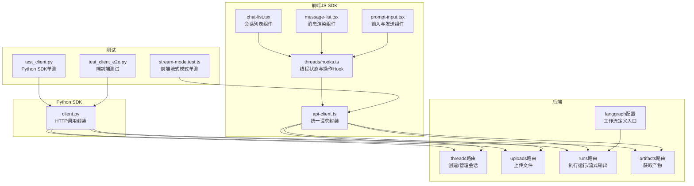
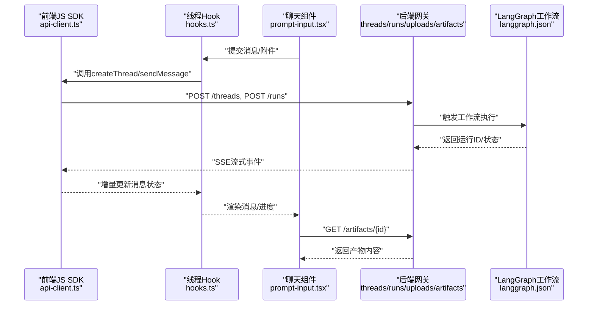
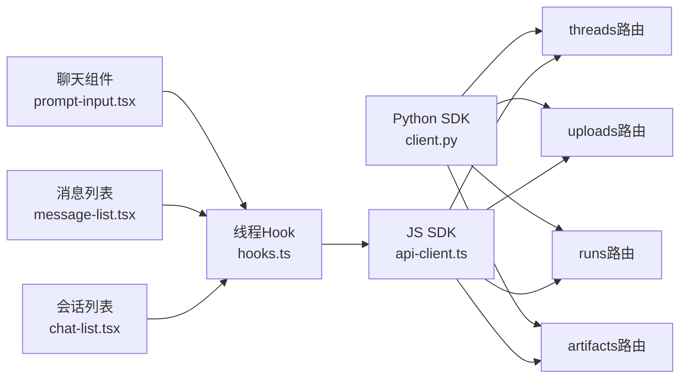

# SDK使用示例

<cite>
**本文引用的文件**   
- [backend/packages/harness/deerflow/client.py](file://backend/packages/harness/deerflow/client.py)
- [backend/app/gateway/routers/threads.py](file://backend/app/gateway/routers/threads.py)
- [backend/app/gateway/routers/uploads.py](file://backend/app/gateway/routers/uploads.py)
- [backend/app/gateway/routers/runs.py](file://backend/app/gateway/routers/runs.py)
- [backend/app/gateway/routers/artifacts.py](file://backend/app/gateway/routers/artifacts.py)
- [frontend/src/core/api/api-client.ts](file://frontend/src/core/api/api-client.ts)
- [frontend/src/core/threads/hooks.ts](file://frontend/src/core/threads/hooks.ts)
- [frontend/src/components/workspace/chats/chat-list.tsx](file://frontend/src/components/workspace/chats/chat-list.tsx)
- [frontend/src/components/workspace/chats/message-list.tsx](file://frontend/src/components/workspace/chats/message-list.tsx)
- [frontend/src/components/workspace/chats/prompt-input.tsx](file://frontend/src/components/workspace/chats/prompt-input.tsx)
- [frontend/tests/unit/core/api/stream-mode.test.ts](file://frontend/tests/unit/core/api/stream-mode.test.ts)
- [backend/tests/test_client.py](file://backend/tests/test_client.py)
- [backend/tests/test_client_e2e.py](file://backend/tests/test_client_e2e.py)
- [backend/langgraph.json](file://backend/langgraph.json)
</cite>

## 目录
1. [简介](#简介)
2. [项目结构](#项目结构)
3. [核心组件](#核心组件)
4. [架构总览](#架构总览)
5. [详细组件分析](#详细组件分析)
6. [依赖关系分析](#依赖关系分析)
7. [性能考虑](#性能考虑)
8. [故障排查指南](#故障排查指南)
9. [结论](#结论)
10. [附录](#附录)

## 简介
本文件提供一套完整的SDK使用示例集合，覆盖Python SDK与JavaScript（前端）SDK的常见用法、LangGraph工作流编排、错误处理与异常恢复、性能优化实践以及端到端集成与测试调试技巧。文档以仓库中的实际实现为依据，通过“代码片段路径”的方式指引读者快速定位到具体源码位置，便于按需查阅与扩展。

## 项目结构
本项目包含后端网关API、Python SDK客户端、前端React应用与测试用例等关键模块。下图展示了与SDK使用相关的核心文件及其交互关系：

图表来源
- [backend/app/gateway/routers/threads.py](file://backend/app/gateway/routers/threads.py)
- [backend/app/gateway/routers/uploads.py](file://backend/app/gateway/routers/uploads.py)
- [backend/app/gateway/routers/runs.py](file://backend/app/gateway/routers/runs.py)
- [backend/app/gateway/routers/artifacts.py](file://backend/app/gateway/routers/artifacts.py)
- [backend/packages/harness/deerflow/client.py](file://backend/packages/harness/deerflow/client.py)
- [frontend/src/core/api/api-client.ts](file://frontend/src/core/api/api-client.ts)
- [frontend/src/core/threads/hooks.ts](file://frontend/src/core/threads/hooks.ts)
- [frontend/src/components/workspace/chats/chat-list.tsx](file://frontend/src/components/workspace/chats/chat-list.tsx)
- [frontend/src/components/workspace/chats/message-list.tsx](file://frontend/src/components/workspace/chats/message-list.tsx)
- [frontend/src/components/workspace/chats/prompt-input.tsx](file://frontend/src/components/workspace/chats/prompt-input.tsx)
- [backend/langgraph.json](file://backend/langgraph.json)
- [backend/tests/test_client.py](file://backend/tests/test_client.py)
- [backend/tests/test_client_e2e.py](file://backend/tests/test_client_e2e.py)
- [frontend/tests/unit/core/api/stream-mode.test.ts](file://frontend/tests/unit/core/api/stream-mode.test.ts)

章节来源
- [backend/packages/harness/deerflow/client.py](file://backend/packages/harness/deerflow/client.py)
- [backend/app/gateway/routers/threads.py](file://backend/app/gateway/routers/threads.py)
- [backend/app/gateway/routers/uploads.py](file://backend/app/gateway/routers/uploads.py)
- [backend/app/gateway/routers/runs.py](file://backend/app/gateway/routers/runs.py)
- [backend/app/gateway/routers/artifacts.py](file://backend/app/gateway/routers/artifacts.py)
- [frontend/src/core/api/api-client.ts](file://frontend/src/core/api/api-client.ts)
- [frontend/src/core/threads/hooks.ts](file://frontend/src/core/threads/hooks.ts)
- [frontend/src/components/workspace/chats/chat-list.tsx](file://frontend/src/components/workspace/chats/chat-list.tsx)
- [frontend/src/components/workspace/chats/message-list.tsx](file://frontend/src/components/workspace/chats/message-list.tsx)
- [frontend/src/components/workspace/chats/prompt-input.tsx](file://frontend/src/components/workspace/chats/prompt-input.tsx)
- [backend/langgraph.json](file://backend/langgraph.json)
- [backend/tests/test_client.py](file://backend/tests/test_client.py)
- [backend/tests/test_client_e2e.py](file://backend/tests/test_client_e2e.py)
- [frontend/tests/unit/core/api/stream-mode.test.ts](file://frontend/tests/unit/core/api/stream-mode.test.ts)

## 核心组件
- Python SDK客户端
  - 职责：封装对后端网关的HTTP调用，提供会话、运行、上传、产物等能力。
  - 参考路径：[backend/packages/harness/deerflow/client.py](file://backend/packages/harness/deerflow/client.py)
- 后端网关路由
  - 会话管理：创建、查询、更新线程；参考路径：[backend/app/gateway/routers/threads.py](file://backend/app/gateway/routers/threads.py)
  - 文件上传：接收并持久化用户文件；参考路径：[backend/app/gateway/routers/uploads.py](file://backend/app/gateway/routers/uploads.py)
  - 运行控制：启动任务、拉取流式事件；参考路径：[backend/app/gateway/routers/runs.py](file://backend/app/gateway/routers/runs.py)
  - 产物访问：读取生成结果或中间产物；参考路径：[backend/app/gateway/routers/artifacts.py](file://backend/app/gateway/routers/artifacts.py)
- 前端JS SDK
  - 统一请求封装：集中处理鉴权、重试、超时、SSE流式解析；参考路径：[frontend/src/core/api/api-client.ts](file://frontend/src/core/api/api-client.ts)
  - 线程状态Hook：封装线程生命周期与UI状态同步；参考路径：[frontend/src/core/threads/hooks.ts](file://frontend/src/core/threads/hooks.ts)
  - UI组件：会话列表、消息渲染、输入发送；参考路径：
    - [frontend/src/components/workspace/chats/chat-list.tsx](file://frontend/src/components/workspace/chats/chat-list.tsx)
    - [frontend/src/components/workspace/chats/message-list.tsx](file://frontend/src/components/workspace/chats/message-list.tsx)
    - [frontend/src/components/workspace/chats/prompt-input.tsx](file://frontend/src/components/workspace/chats/prompt-input.tsx)
- LangGraph工作流
  - 工作流定义入口：参考路径：[backend/langgraph.json](file://backend/langgraph.json)

章节来源
- [backend/packages/harness/deerflow/client.py](file://backend/packages/harness/deerflow/client.py)
- [backend/app/gateway/routers/threads.py](file://backend/app/gateway/routers/threads.py)
- [backend/app/gateway/routers/uploads.py](file://backend/app/gateway/routers/uploads.py)
- [backend/app/gateway/routers/runs.py](file://backend/app/gateway/routers/runs.py)
- [backend/app/gateway/routers/artifacts.py](file://backend/app/gateway/routers/artifacts.py)
- [frontend/src/core/api/api-client.ts](file://frontend/src/core/api/api-client.ts)
- [frontend/src/core/threads/hooks.ts](file://frontend/src/core/threads/hooks.ts)
- [frontend/src/components/workspace/chats/chat-list.tsx](file://frontend/src/components/workspace/chats/chat-list.tsx)
- [frontend/src/components/workspace/chats/message-list.tsx](file://frontend/src/components/workspace/chats/message-list.tsx)
- [frontend/src/components/workspace/chats/prompt-input.tsx](file://frontend/src/components/workspace/chats/prompt-input.tsx)
- [backend/langgraph.json](file://backend/langgraph.json)

## 架构总览
下图展示从前端到后端的完整调用链路，包括Python SDK与JS SDK的接入方式、流式输出与产物获取流程。

图表来源
- [frontend/src/core/api/api-client.ts](file://frontend/src/core/api/api-client.ts)
- [frontend/src/core/threads/hooks.ts](file://frontend/src/core/threads/hooks.ts)
- [frontend/src/components/workspace/chats/prompt-input.tsx](file://frontend/src/components/workspace/chats/prompt-input.tsx)
- [backend/app/gateway/routers/threads.py](file://backend/app/gateway/routers/threads.py)
- [backend/app/gateway/routers/runs.py](file://backend/app/gateway/routers/runs.py)
- [backend/app/gateway/routers/artifacts.py](file://backend/app/gateway/routers/artifacts.py)
- [backend/langgraph.json](file://backend/langgraph.json)

## 详细组件分析

### Python SDK基础用法示例
- 简单对话
  - 步骤要点：初始化客户端 -> 创建线程 -> 发送消息 -> 获取运行结果 -> 可选：拉取产物
  - 参考路径：
    - [backend/packages/harness/deerflow/client.py](file://backend/packages/harness/deerflow/client.py)
    - [backend/app/gateway/routers/threads.py](file://backend/app/gateway/routers/threads.py)
    - [backend/app/gateway/routers/runs.py](file://backend/app/gateway/routers/runs.py)
    - [backend/app/gateway/routers/artifacts.py](file://backend/app/gateway/routers/artifacts.py)
- 文件处理
  - 步骤要点：选择本地文件 -> 调用上传接口 -> 将文件ID附加到消息 -> 发起运行
  - 参考路径：
    - [backend/app/gateway/routers/uploads.py](file://backend/app/gateway/routers/uploads.py)
    - [backend/app/gateway/routers/threads.py](file://backend/app/gateway/routers/threads.py)
    - [backend/app/gateway/routers/runs.py](file://backend/app/gateway/routers/runs.py)
- 批量操作
  - 步骤要点：循环创建多个线程 -> 批量发送消息 -> 聚合结果与产物
  - 参考路径：
    - [backend/app/gateway/routers/threads.py](file://backend/app/gateway/routers/threads.py)
    - [backend/app/gateway/routers/runs.py](file://backend/app/gateway/routers/runs.py)
    - [backend/app/gateway/routers/artifacts.py](file://backend/app/gateway/routers/artifacts.py)

章节来源
- [backend/packages/harness/deerflow/client.py](file://backend/packages/harness/deerflow/client.py)
- [backend/app/gateway/routers/threads.py](file://backend/app/gateway/routers/threads.py)
- [backend/app/gateway/routers/uploads.py](file://backend/app/gateway/routers/uploads.py)
- [backend/app/gateway/routers/runs.py](file://backend/app/gateway/routers/runs.py)
- [backend/app/gateway/routers/artifacts.py](file://backend/app/gateway/routers/artifacts.py)

### JavaScript SDK前端集成示例
- React组件封装
  - 步骤要点：在组件中引入线程Hook -> 绑定输入框与发送按钮 -> 监听流式事件 -> 渲染消息与产物
  - 参考路径：
    - [frontend/src/core/threads/hooks.ts](file://frontend/src/core/threads/hooks.ts)
    - [frontend/src/components/workspace/chats/prompt-input.tsx](file://frontend/src/components/workspace/chats/prompt-input.tsx)
    - [frontend/src/components/workspace/chats/message-list.tsx](file://frontend/src/components/workspace/chats/message-list.tsx)
    - [frontend/src/components/workspace/chats/chat-list.tsx](file://frontend/src/components/workspace/chats/chat-list.tsx)
- 状态管理
  - 步骤要点：使用Hook维护线程ID、消息列表、运行状态、错误信息 -> 在组件中订阅与派发
  - 参考路径：
    - [frontend/src/core/threads/hooks.ts](file://frontend/src/core/threads/hooks.ts)
    - [frontend/src/core/api/api-client.ts](file://frontend/src/core/api/api-client.ts)

章节来源
- [frontend/src/core/threads/hooks.ts](file://frontend/src/core/threads/hooks.ts)
- [frontend/src/components/workspace/chats/prompt-input.tsx](file://frontend/src/components/workspace/chats/prompt-input.tsx)
- [frontend/src/components/workspace/chats/message-list.tsx](file://frontend/src/components/workspace/chats/message-list.tsx)
- [frontend/src/components/workspace/chats/chat-list.tsx](file://frontend/src/components/workspace/chats/chat-list.tsx)
- [frontend/src/core/api/api-client.ts](file://frontend/src/core/api/api-client.ts)

### LangGraph工作流案例
- 多步骤任务编排
  - 说明：通过工作流定义入口组织节点与边，实现顺序/分支/汇聚等多步逻辑
  - 参考路径：
    - [backend/langgraph.json](file://backend/langgraph.json)
    - [backend/app/gateway/routers/runs.py](file://backend/app/gateway/routers/runs.py)
- 条件逻辑处理
  - 说明：根据上游节点输出决定后续分支，结合运行时参数进行动态路由
  - 参考路径：
    - [backend/langgraph.json](file://backend/langgraph.json)
    - [backend/app/gateway/routers/runs.py](file://backend/app/gateway/routers/runs.py)

章节来源
- [backend/langgraph.json](file://backend/langgraph.json)
- [backend/app/gateway/routers/runs.py](file://backend/app/gateway/routers/runs.py)

### 错误处理与异常恢复示例
- Python SDK
  - 建议：捕获网络异常、超时、业务错误码；实现指数退避重试；记录上下文以便排障
  - 参考路径：
    - [backend/packages/harness/deerflow/client.py](file://backend/packages/harness/deerflow/client.py)
    - [backend/tests/test_client.py](file://backend/tests/test_client.py)
- 前端JS SDK
  - 建议：统一拦截器处理错误；区分可重试与不可重试错误；在UI层提示用户并支持重试
  - 参考路径：
    - [frontend/src/core/api/api-client.ts](file://frontend/src/core/api/api-client.ts)
    - [frontend/tests/unit/core/api/stream-mode.test.ts](file://frontend/tests/unit/core/api/stream-mode.test.ts)

章节来源
- [backend/packages/harness/deerflow/client.py](file://backend/packages/harness/deerflow/client.py)
- [backend/tests/test_client.py](file://backend/tests/test_client.py)
- [frontend/src/core/api/api-client.ts](file://frontend/src/core/api/api-client.ts)
- [frontend/tests/unit/core/api/stream-mode.test.ts](file://frontend/tests/unit/core/api/stream-mode.test.ts)

### 性能优化实战
- 连接池配置
  - 建议：复用HTTP连接、合理设置最大连接数与空闲超时；避免频繁创建销毁客户端实例
  - 参考路径：
    - [backend/packages/harness/deerflow/client.py](file://backend/packages/harness/deerflow/client.py)
    - [frontend/src/core/api/api-client.ts](file://frontend/src/core/api/api-client.ts)
- 缓存策略
  - 建议：对只读数据（如模型列表、技能元数据）做短期缓存；对大产物采用分块加载与懒加载
  - 参考路径：
    - [frontend/src/core/api/api-client.ts](file://frontend/src/core/api/api-client.ts)
    - [backend/app/gateway/routers/artifacts.py](file://backend/app/gateway/routers/artifacts.py)

章节来源
- [backend/packages/harness/deerflow/client.py](file://backend/packages/harness/deerflow/client.py)
- [frontend/src/core/api/api-client.ts](file://frontend/src/core/api/api-client.ts)
- [backend/app/gateway/routers/artifacts.py](file://backend/app/gateway/routers/artifacts.py)

### 端到端集成示例
- 环境搭建
  - 步骤要点：安装依赖 -> 配置环境变量 -> 启动后端服务 -> 启动前端开发服务器
  - 参考路径：
    - [backend/langgraph.json](file://backend/langgraph.json)
    - [backend/app/gateway/routers/threads.py](file://backend/app/gateway/routers/threads.py)
    - [frontend/src/core/api/api-client.ts](file://frontend/src/core/api/api-client.ts)
- 功能实现
  - 步骤要点：创建线程 -> 上传文件（可选）-> 发送消息 -> 监听流式输出 -> 获取产物
  - 参考路径：
    - [backend/app/gateway/routers/threads.py](file://backend/app/gateway/routers/threads.py)
    - [backend/app/gateway/routers/uploads.py](file://backend/app/gateway/routers/uploads.py)
    - [backend/app/gateway/routers/runs.py](file://backend/app/gateway/routers/runs.py)
    - [backend/app/gateway/routers/artifacts.py](file://backend/app/gateway/routers/artifacts.py)
    - [frontend/src/core/threads/hooks.ts](file://frontend/src/core/threads/hooks.ts)
    - [frontend/src/components/workspace/chats/prompt-input.tsx](file://frontend/src/components/workspace/chats/prompt-input.tsx)

章节来源
- [backend/langgraph.json](file://backend/langgraph.json)
- [backend/app/gateway/routers/threads.py](file://backend/app/gateway/routers/threads.py)
- [backend/app/gateway/routers/uploads.py](file://backend/app/gateway/routers/uploads.py)
- [backend/app/gateway/routers/runs.py](file://backend/app/gateway/routers/runs.py)
- [backend/app/gateway/routers/artifacts.py](file://backend/app/gateway/routers/artifacts.py)
- [frontend/src/core/threads/hooks.ts](file://frontend/src/core/threads/hooks.ts)
- [frontend/src/components/workspace/chats/prompt-input.tsx](file://frontend/src/components/workspace/chats/prompt-input.tsx)

### 测试用例与调试技巧
- Python SDK测试
  - 单测：验证客户端方法行为与错误分支
  - 端到端：模拟真实调用链路与流式输出
  - 参考路径：
    - [backend/tests/test_client.py](file://backend/tests/test_client.py)
    - [backend/tests/test_client_e2e.py](file://backend/tests/test_client_e2e.py)
- 前端测试
  - 单测：验证流式模式解析与错误处理
  - 参考路径：
    - [frontend/tests/unit/core/api/stream-mode.test.ts](file://frontend/tests/unit/core/api/stream-mode.test.ts)
- 调试技巧
  - 启用日志与追踪：在后端与前端开启详细日志，记录请求ID与运行ID
  - 断点与回放：利用运行ID回放特定会话，定位问题根因

章节来源
- [backend/tests/test_client.py](file://backend/tests/test_client.py)
- [backend/tests/test_client_e2e.py](file://backend/tests/test_client_e2e.py)
- [frontend/tests/unit/core/api/stream-mode.test.ts](file://frontend/tests/unit/core/api/stream-mode.test.ts)

## 依赖关系分析
下图展示SDK与后端路由之间的直接依赖关系，帮助理解调用边界与耦合度。

图表来源
- [backend/packages/harness/deerflow/client.py](file://backend/packages/harness/deerflow/client.py)
- [backend/app/gateway/routers/threads.py](file://backend/app/gateway/routers/threads.py)
- [backend/app/gateway/routers/uploads.py](file://backend/app/gateway/routers/uploads.py)
- [backend/app/gateway/routers/runs.py](file://backend/app/gateway/routers/runs.py)
- [backend/app/gateway/routers/artifacts.py](file://backend/app/gateway/routers/artifacts.py)
- [frontend/src/core/api/api-client.ts](file://frontend/src/core/api/api-client.ts)
- [frontend/src/core/threads/hooks.ts](file://frontend/src/core/threads/hooks.ts)
- [frontend/src/components/workspace/chats/prompt-input.tsx](file://frontend/src/components/workspace/chats/prompt-input.tsx)
- [frontend/src/components/workspace/chats/message-list.tsx](file://frontend/src/components/workspace/chats/message-list.tsx)
- [frontend/src/components/workspace/chats/chat-list.tsx](file://frontend/src/components/workspace/chats/chat-list.tsx)

章节来源
- [backend/packages/harness/deerflow/client.py](file://backend/packages/harness/deerflow/client.py)
- [backend/app/gateway/routers/threads.py](file://backend/app/gateway/routers/threads.py)
- [backend/app/gateway/routers/uploads.py](file://backend/app/gateway/routers/uploads.py)
- [backend/app/gateway/routers/runs.py](file://backend/app/gateway/routers/runs.py)
- [backend/app/gateway/routers/artifacts.py](file://backend/app/gateway/routers/artifacts.py)
- [frontend/src/core/api/api-client.ts](file://frontend/src/core/api/api-client.ts)
- [frontend/src/core/threads/hooks.ts](file://frontend/src/core/threads/hooks.ts)
- [frontend/src/components/workspace/chats/prompt-input.tsx](file://frontend/src/components/workspace/chats/prompt-input.tsx)
- [frontend/src/components/workspace/chats/message-list.tsx](file://frontend/src/components/workspace/chats/message-list.tsx)
- [frontend/src/components/workspace/chats/chat-list.tsx](file://frontend/src/components/workspace/chats/chat-list.tsx)

## 性能考虑
- 连接复用与限流
  - 建议：为HTTP客户端配置合理的连接池大小与超时时间；在高并发场景下限制并发度，避免压垮后端
  - 参考路径：
    - [backend/packages/harness/deerflow/client.py](file://backend/packages/harness/deerflow/client.py)
    - [frontend/src/core/api/api-client.ts](file://frontend/src/core/api/api-client.ts)
- 流式传输优化
  - 建议：前端按事件增量渲染，减少DOM重排；后端按需推送最小必要字段
  - 参考路径：
    - [frontend/src/core/api/api-client.ts](file://frontend/src/core/api/api-client.ts)
    - [backend/app/gateway/routers/runs.py](file://backend/app/gateway/routers/runs.py)
- 产物缓存与分片
  - 建议：对大文件产物采用分片下载与本地缓存；对静态资源启用浏览器缓存头
  - 参考路径：
    - [backend/app/gateway/routers/artifacts.py](file://backend/app/gateway/routers/artifacts.py)
    - [frontend/src/core/api/api-client.ts](file://frontend/src/core/api/api-client.ts)

章节来源
- [backend/packages/harness/deerflow/client.py](file://backend/packages/harness/deerflow/client.py)
- [frontend/src/core/api/api-client.ts](file://frontend/src/core/api/api-client.ts)
- [backend/app/gateway/routers/runs.py](file://backend/app/gateway/routers/runs.py)
- [backend/app/gateway/routers/artifacts.py](file://backend/app/gateway/routers/artifacts.py)

## 故障排查指南
- 常见问题定位
  - 网络与鉴权：检查请求头与令牌有效性；确认网关可达性与跨域配置
  - 运行失败：依据运行ID回溯日志，查看工作流节点输出与错误堆栈
  - 流式中断：检查SSE连接稳定性与前端事件解析逻辑
- 工具与技巧
  - 使用单测与端到端用例复现问题；在前端控制台与后端日志中关联请求ID与运行ID
  - 参考路径：
    - [backend/tests/test_client.py](file://backend/tests/test_client.py)
    - [backend/tests/test_client_e2e.py](file://backend/tests/test_client_e2e.py)
    - [frontend/tests/unit/core/api/stream-mode.test.ts](file://frontend/tests/unit/core/api/stream-mode.test.ts)

章节来源
- [backend/tests/test_client.py](file://backend/tests/test_client.py)
- [backend/tests/test_client_e2e.py](file://backend/tests/test_client_e2e.py)
- [frontend/tests/unit/core/api/stream-mode.test.ts](file://frontend/tests/unit/core/api/stream-mode.test.ts)

## 结论
本文基于仓库实际实现，提供了Python SDK与JavaScript SDK的使用示例集合，涵盖基础对话、文件处理、批量操作、LangGraph工作流编排、错误处理与恢复、性能优化与端到端集成，并附带测试与调试技巧。通过“代码片段路径”的定位方式，读者可以快速对照源码进行二次开发与定制。

## 附录
- 术语表
  - 线程：一次对话的上下文载体，用于保存消息与状态
  - 运行：一次任务执行的实例，可能产生流式输出与产物
  - 产物：运行过程中生成的文件或结构化结果
- 参考路径汇总
  - Python SDK：[backend/packages/harness/deerflow/client.py](file://backend/packages/harness/deerflow/client.py)
  - 后端路由：
    - [backend/app/gateway/routers/threads.py](file://backend/app/gateway/routers/threads.py)
    - [backend/app/gateway/routers/uploads.py](file://backend/app/gateway/routers/uploads.py)
    - [backend/app/gateway/routers/runs.py](file://backend/app/gateway/routers/runs.py)
    - [backend/app/gateway/routers/artifacts.py](file://backend/app/gateway/routers/artifacts.py)
  - 前端SDK与组件：
    - [frontend/src/core/api/api-client.ts](file://frontend/src/core/api/api-client.ts)
    - [frontend/src/core/threads/hooks.ts](file://frontend/src/core/threads/hooks.ts)
    - [frontend/src/components/workspace/chats/prompt-input.tsx](file://frontend/src/components/workspace/chats/prompt-input.tsx)
    - [frontend/src/components/workspace/chats/message-list.tsx](file://frontend/src/components/workspace/chats/message-list.tsx)
    - [frontend/src/components/workspace/chats/chat-list.tsx](file://frontend/src/components/workspace/chats/chat-list.tsx)
  - 工作流与测试：
    - [backend/langgraph.json](file://backend/langgraph.json)
    - [backend/tests/test_client.py](file://backend/tests/test_client.py)
    - [backend/tests/test_client_e2e.py](file://backend/tests/test_client_e2e.py)
    - [frontend/tests/unit/core/api/stream-mode.test.ts](file://frontend/tests/unit/core/api/stream-mode.test.ts)