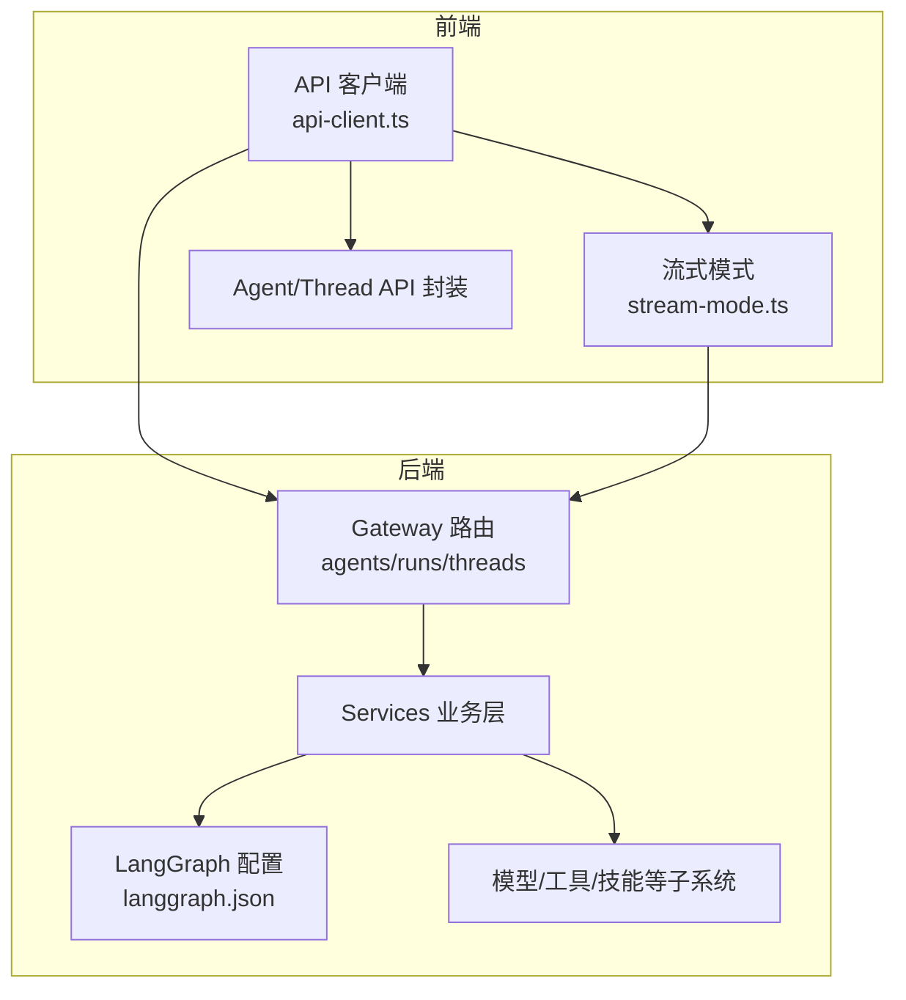
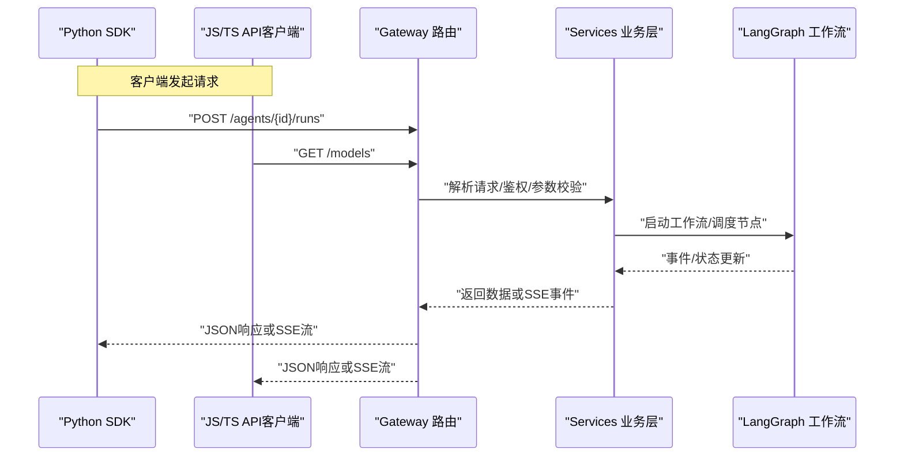
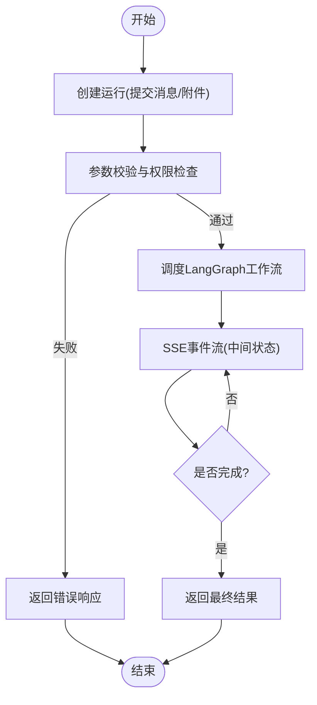

# SDK集成指南

<cite>
**本文引用的文件**   
- [backend/packages/harness/deerflow/client.py](file://backend/packages/harness/deerflow/client.py)
- [backend/app/gateway/routers/agents.py](file://backend/app/gateway/routers/agents.py)
- [backend/app/gateway/routers/runs.py](file://backend/app/gateway/routers/runs.py)
- [backend/app/gateway/routers/threads.py](file://backend/app/gateway/routers/threads.py)
- [backend/app/gateway/routers/artifacts.py](file://backend/app/gateway/routers/artifacts.py)
- [backend/app/gateway/routers/models.py](file://backend/app/gateway/routers/models.py)
- [backend/app/gateway/routers/skills.py](file://backend/app/gateway/routers/skills.py)
- [backend/app/gateway/routers/mcp.py](file://backend/app/gateway/routers/mcp.py)
- [backend/app/gateway/config.py](file://backend/app/gateway/config.py)
- [backend/app/gateway/services.py](file://backend/app/gateway/services.py)
- [backend/langgraph.json](file://backend/langgraph.json)
- [frontend/src/core/api/api-client.ts](file://frontend/src/core/api/api-client.ts)
- [frontend/src/core/api/stream-mode.ts](file://frontend/src/core/api/stream-mode.ts)
- [frontend/src/core/agents/api.ts](file://frontend/src/core/agents/api.ts)
- [frontend/src/core/threads/api.ts](file://frontend/src/core/threads/api.ts)
- [frontend/package.json](file://frontend/package.json)
- [backend/pyproject.toml](file://backend/pyproject.toml)
- [backend/docs/API.md](file://backend/docs/API.md)
</cite>

## 目录
1. [简介](#简介)
2. [项目结构](#项目结构)
3. [核心组件](#核心组件)
4. [架构总览](#架构总览)
5. [详细组件分析](#详细组件分析)
6. [依赖与版本管理](#依赖与版本管理)
7. [性能考虑](#性能考虑)
8. [故障排查指南](#故障排查指南)
9. [结论](#结论)
10. [附录](#附录)

## 简介
本指南面向希望在DeerFlow中集成SDK的开发者，覆盖以下语言与框架：
- Python SDK：客户端初始化、配置选项、代理调用、状态查询、流式处理。
- JavaScript/TypeScript SDK：浏览器与Node.js环境集成、API客户端封装、流式模式。
- LangGraph SDK：工作流定义、节点编排与执行控制（基于后端LangGraph配置）。
同时提供错误处理、调试方法、性能优化建议与最佳实践。

## 项目结构
仓库采用前后端分离与多包组织方式：
- 后端Python服务包含网关路由、运行时、工具与技能等模块，并提供Python SDK入口。
- 前端TypeScript应用封装了HTTP与SSE流式通信能力，可作为JS/TS SDK参考实现。
- LangGraph通过后端配置文件声明工作流图与运行参数。

图表来源
- [backend/app/gateway/routers/agents.py](file://backend/app/gateway/routers/agents.py)
- [backend/app/gateway/routers/runs.py](file://backend/app/gateway/routers/runs.py)
- [backend/app/gateway/routers/threads.py](file://backend/app/gateway/routers/threads.py)
- [backend/app/gateway/services.py](file://backend/app/gateway/services.py)
- [backend/langgraph.json](file://backend/langgraph.json)
- [frontend/src/core/api/api-client.ts](file://frontend/src/core/api/api-client.ts)
- [frontend/src/core/api/stream-mode.ts](file://frontend/src/core/api/stream-mode.ts)

章节来源
- [backend/pyproject.toml](file://backend/pyproject.toml)
- [frontend/package.json](file://frontend/package.json)

## 核心组件
- Python SDK客户端：提供创建代理、发送消息、获取结果、查询运行状态、上传附件、访问模型列表等能力。
- JS/TS API客户端：统一HTTP请求封装，支持SSE流式事件订阅，适配浏览器与Node.js。
- Gateway路由：对外暴露REST/SSE接口，承载Agent/Run/Thread/Artifacts/MCP等域操作。
- Services层：聚合业务逻辑，协调LangGraph工作流、工具与外部服务。
- LangGraph配置：以JSON形式声明工作流图、节点与边，驱动后端执行。

章节来源
- [backend/packages/harness/deerflow/client.py](file://backend/packages/harness/deerflow/client.py)
- [backend/app/gateway/routers/agents.py](file://backend/app/gateway/routers/agents.py)
- [backend/app/gateway/routers/runs.py](file://backend/app/gateway/routers/runs.py)
- [backend/app/gateway/routers/threads.py](file://backend/app/gateway/routers/threads.py)
- [backend/app/gateway/routers/artifacts.py](file://backend/app/gateway/routers/artifacts.py)
- [backend/app/gateway/routers/models.py](file://backend/app/gateway/routers/models.py)
- [backend/app/gateway/routers/skills.py](file://backend/app/gateway/routers/skills.py)
- [backend/app/gateway/routers/mcp.py](file://backend/app/gateway/routers/mcp.py)
- [backend/app/gateway/services.py](file://backend/app/gateway/services.py)
- [backend/langgraph.json](file://backend/langgraph.json)
- [frontend/src/core/api/api-client.ts](file://frontend/src/core/api/api-client.ts)
- [frontend/src/core/api/stream-mode.ts](file://frontend/src/core/api/stream-mode.ts)

## 架构总览
下图展示了从客户端到后端的典型交互路径，包括同步调用与SSE流式响应。

图表来源
- [backend/app/gateway/routers/agents.py](file://backend/app/gateway/routers/agents.py)
- [backend/app/gateway/routers/runs.py](file://backend/app/gateway/routers/runs.py)
- [backend/app/gateway/services.py](file://backend/app/gateway/services.py)
- [backend/langgraph.json](file://backend/langgraph.json)
- [frontend/src/core/api/api-client.ts](file://frontend/src/core/api/api-client.ts)
- [frontend/src/core/api/stream-mode.ts](file://frontend/src/core/api/stream-mode.ts)

## 详细组件分析

### Python SDK使用指南
- 客户端初始化
  - 设置基础URL、超时、重试策略、认证头（如需要）。
  - 可选启用日志与调试输出。
- 配置选项
  - 模型选择、线程上下文、检查点、沙箱与安全策略等可通过配置对象传入。
- 代理调用
  - 创建或选择代理ID，提交用户消息，支持附件与元数据。
  - 支持同步等待结果与异步回调两种模式。
- 状态查询
  - 根据run_id查询运行状态、中间结果与最终输出。
- 流式处理
  - 通过SSE接收增量事件，逐步渲染或执行业务逻辑。
- 常见场景示例路径
  - 创建代理并发送消息：[backend/packages/harness/deerflow/client.py](file://backend/packages/harness/deerflow/client.py)
  - 查询运行状态：[backend/packages/harness/deerflow/client.py](file://backend/packages/harness/deerflow/client.py)
  - 获取模型列表：[backend/app/gateway/routers/models.py](file://backend/app/gateway/routers/models.py)
  - 上传附件：[backend/app/gateway/routers/artifacts.py](file://backend/app/gateway/routers/artifacts.py)

章节来源
- [backend/packages/harness/deerflow/client.py](file://backend/packages/harness/deerflow/client.py)
- [backend/app/gateway/routers/models.py](file://backend/app/gateway/routers/models.py)
- [backend/app/gateway/routers/artifacts.py](file://backend/app/gateway/routers/artifacts.py)

### JavaScript/TypeScript SDK使用指南
- 环境集成
  - 浏览器：通过ESM/CJS引入，配置跨域与CORS。
  - Node.js：使用fetch或http库进行网络请求；注意环境变量与代理设置。
- API客户端封装
  - 统一请求拦截器：自动附加认证头、重试与错误转换。
  - SSE流式订阅：按事件类型分发，支持断线重连与背压控制。
- Agent与Thread API
  - 封装Agent/Thread相关接口，简化调用流程。
- 常见场景示例路径
  - 通用API客户端：[frontend/src/core/api/api-client.ts](file://frontend/src/core/api/api-client.ts)
  - 流式模式处理：[frontend/src/core/api/stream-mode.ts](file://frontend/src/core/api/stream-mode.ts)
  - Agent API封装：[frontend/src/core/agents/api.ts](file://frontend/src/core/agents/api.ts)
  - Thread API封装：[frontend/src/core/threads/api.ts](file://frontend/src/core/threads/api.ts)

章节来源
- [frontend/src/core/api/api-client.ts](file://frontend/src/core/api/api-client.ts)
- [frontend/src/core/api/stream-mode.ts](file://frontend/src/core/api/stream-mode.ts)
- [frontend/src/core/agents/api.ts](file://frontend/src/core/agents/api.ts)
- [frontend/src/core/threads/api.ts](file://frontend/src/core/threads/api.ts)

### LangGraph SDK集成方法
- 工作流定义
  - 在配置文件中声明节点、边与条件跳转，描述任务编排逻辑。
- 节点编排
  - 将业务逻辑拆分为可复用的节点函数，由LangGraph调度执行。
- 执行控制
  - 通过运行ID跟踪状态，支持中断、恢复与检查点持久化。
- 参考位置
  - 工作流配置：[backend/langgraph.json](file://backend/langgraph.json)
  - 服务层协调：[backend/app/gateway/services.py](file://backend/app/gateway/services.py)

章节来源
- [backend/langgraph.json](file://backend/langgraph.json)
- [backend/app/gateway/services.py](file://backend/app/gateway/services.py)

### 关键流程图：代理运行生命周期

图表来源
- [backend/app/gateway/routers/agents.py](file://backend/app/gateway/routers/agents.py)
- [backend/app/gateway/routers/runs.py](file://backend/app/gateway/routers/runs.py)
- [backend/app/gateway/services.py](file://backend/app/gateway/services.py)
- [backend/langgraph.json](file://backend/langgraph.json)

## 依赖与版本管理
- Python依赖
  - 查看后端包的依赖与版本约束：[backend/pyproject.toml](file://backend/pyproject.toml)
- JS/TS依赖
  - 查看前端包的依赖与版本约束：[frontend/package.json](file://frontend/package.json)
- 安装建议
  - Python：使用虚拟环境与包管理器安装后端SDK与依赖。
  - JS/TS：使用pnpm/npm/yarn安装前端依赖，构建产物按需发布。

章节来源
- [backend/pyproject.toml](file://backend/pyproject.toml)
- [frontend/package.json](file://frontend/package.json)

## 性能考虑
- 连接与超时
  - 合理设置HTTP与SSE超时，避免长连接阻塞。
- 并发与限流
  - 对高频调用实施令牌桶或滑动窗口限流，保护后端资源。
- 缓存与去重
  - 对只读查询（如模型列表）启用缓存；对重复请求做幂等处理。
- 流式渲染
  - 前端按事件增量渲染，降低首屏延迟与内存占用。
- 资源隔离
  - 使用沙箱与权限控制限制工具执行范围，减少系统开销。

## 故障排查指南
- 常见问题定位
  - 网络与鉴权：检查基础URL、CORS、认证头与证书。
  - 参数校验：核对必填字段、类型与大小限制。
  - 运行状态：根据run_id查询状态，确认是否处于进行中或已完成。
- 日志与调试
  - 开启SDK调试日志，记录请求/响应与SSE事件。
  - 在后端网关与服务层增加结构化日志，便于追踪链路。
- 错误分类与处理
  - 区分客户端错误（4xx）、服务端错误（5xx）与网络异常，分别采取重试、降级或告警策略。
- 参考文档
  - 后端API说明：[backend/docs/API.md](file://backend/docs/API.md)

章节来源
- [backend/docs/API.md](file://backend/docs/API.md)
- [backend/app/gateway/config.py](file://backend/app/gateway/config.py)

## 结论
通过Python与JS/TS SDK以及LangGraph工作流，开发者可以快速集成DeerFlow的多代理协作能力。遵循本文的配置、调用与排错建议，可在保证稳定性的前提下获得良好的性能与用户体验。

## 附录
- 快速上手清单
  - 初始化客户端并配置基础URL与认证。
  - 选择或创建代理，提交消息并监听SSE事件。
  - 根据run_id查询运行状态与最终结果。
  - 结合LangGraph配置扩展工作流节点与编排逻辑。
- 参考文件索引
  - Python SDK入口：[backend/packages/harness/deerflow/client.py](file://backend/packages/harness/deerflow/client.py)
  - Gateway路由：[backend/app/gateway/routers/agents.py](file://backend/app/gateway/routers/agents.py)、[backend/app/gateway/routers/runs.py](file://backend/app/gateway/routers/runs.py)、[backend/app/gateway/routers/threads.py](file://backend/app/gateway/routers/threads.py)、[backend/app/gateway/routers/artifacts.py](file://backend/app/gateway/routers/artifacts.py)、[backend/app/gateway/routers/models.py](file://backend/app/gateway/routers/models.py)、[backend/app/gateway/routers/skills.py](file://backend/app/gateway/routers/skills.py)、[backend/app/gateway/routers/mcp.py](file://backend/app/gateway/routers/mcp.py)
  - 服务层：[backend/app/gateway/services.py](file://backend/app/gateway/services.py)
  - LangGraph配置：[backend/langgraph.json](file://backend/langgraph.json)
  - JS/TS客户端：[frontend/src/core/api/api-client.ts](file://frontend/src/core/api/api-client.ts)、[frontend/src/core/api/stream-mode.ts](file://frontend/src/core/api/stream-mode.ts)、[frontend/src/core/agents/api.ts](file://frontend/src/core/agents/api.ts)、[frontend/src/core/threads/api.ts](file://frontend/src/core/threads/api.ts)
  - 依赖与版本：[backend/pyproject.toml](file://backend/pyproject.toml)、[frontend/package.json](file://frontend/package.json)
  - API文档：[backend/docs/API.md](file://backend/docs/API.md)