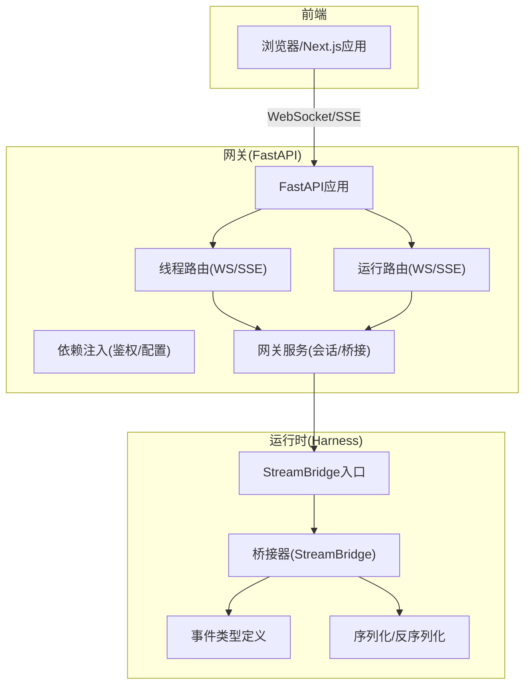
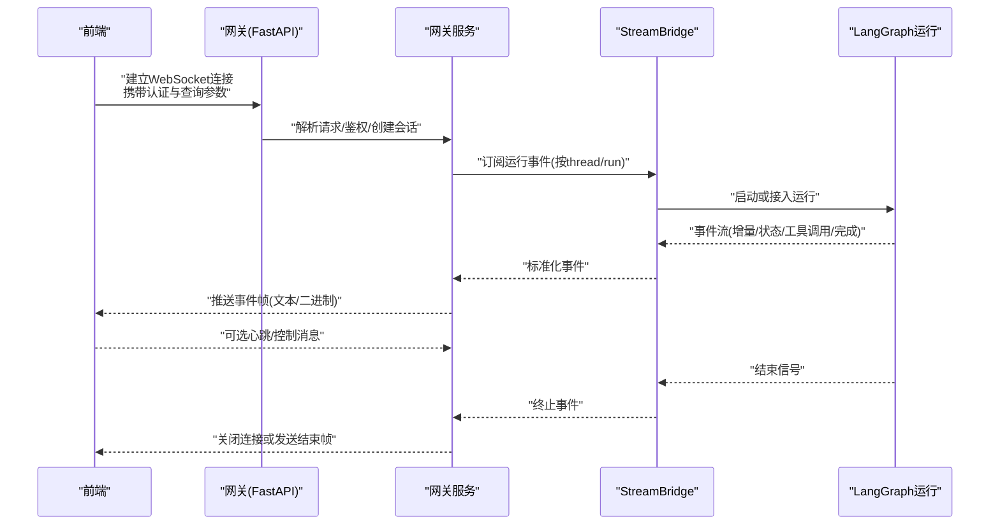
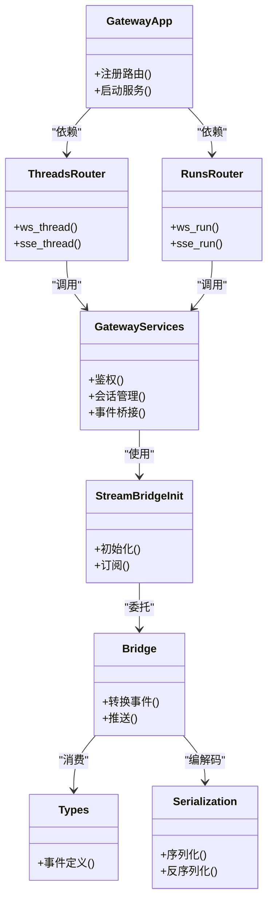

# WebSocket实时通信

<cite>
**本文引用的文件**   
- [backend/app/gateway/routers/threads.py](file://backend/app/gateway/routers/threads.py)
- [backend/app/gateway/routers/runs.py](file://backend/app/gateway/routers/runs.py)
- [backend/app/gateway/services.py](file://backend/app/gateway/services.py)
- [backend/app/gateway/deps.py](file://backend/app/gateway/deps.py)
- [backend/app/gateway/config.py](file://backend/app/gateway/config.py)
- [backend/app/gateway/app.py](file://backend/app/gateway/app.py)
- [backend/packages/harness/deerflow/runtime/stream_bridge/__init__.py](file://backend/packages/harness/deerflow/runtime/stream_bridge/__init__.py)
- [backend/packages/harness/deerflow/runtime/stream_bridge/bridge.py](file://backend/packages/harness/deerflow/runtime/stream_bridge/bridge.py)
- [backend/packages/harness/deerflow/runtime/stream_bridge/types.py](file://backend/packages/harness/deerflow/runtime/stream_bridge/types.py)
- [backend/packages/harness/deerflow/runtime/serialization.py](file://backend/packages/harness/deerflow/runtime/serialization.py)
- [frontend/src/core/api/stream-mode.ts](file://frontend/src/core/api/stream-mode.ts)
- [frontend/src/components/workspace/streaming-indicator.tsx](file://frontend/src/components/workspace/streaming-indicator.tsx)
</cite>

## 目录
1. [简介](#简介)
2. [项目结构](#项目结构)
3. [核心组件](#核心组件)
4. [架构总览](#架构总览)
5. [详细组件分析](#详细组件分析)
6. [依赖关系分析](#依赖关系分析)
7. [性能考虑](#性能考虑)
8. [故障排查指南](#故障排查指南)
9. [结论](#结论)
10. [附录](#附录)

## 简介
本文件面向DeerFlow的WebSocket实时通信能力，聚焦于：
- WebSocket连接的建立、认证与参数约定
- 消息格式定义（事件类型、数据结构、字段含义与序列化）
- 实时推送机制（流式响应、增量更新、断线重连）
- 前端监听与处理策略（消息流、进度、错误等）
- 客户端实现示例（连接管理、消息处理、错误恢复）
- 性能优化建议与最佳实践

说明：后端采用FastAPI + Uvicorn提供HTTP/SSE/WS服务；运行时通过LangGraph StreamBridge将Agent运行状态以事件形式推送到网关层，再由网关转发至前端。

## 项目结构
与WebSocket实时通信相关的代码主要分布在以下位置：
- 网关路由与服务：负责注册WS端点、鉴权、会话管理与事件桥接
- 运行时StreamBridge：封装LangGraph流式事件到统一协议
- 前端流模式：基于SSE/WS的事件订阅与渲染

图表来源
- [backend/app/gateway/app.py](file://backend/app/gateway/app.py)
- [backend/app/gateway/routers/threads.py](file://backend/app/gateway/routers/threads.py)
- [backend/app/gateway/routers/runs.py](file://backend/app/gateway/routers/runs.py)
- [backend/app/gateway/services.py](file://backend/app/gateway/services.py)
- [backend/app/gateway/deps.py](file://backend/app/gateway/deps.py)
- [backend/packages/harness/deerflow/runtime/stream_bridge/__init__.py](file://backend/packages/harness/deerflow/runtime/stream_bridge/__init__.py)
- [backend/packages/harness/deerflow/runtime/stream_bridge/bridge.py](file://backend/packages/harness/deerflow/runtime/stream_bridge/bridge.py)
- [backend/packages/harness/deerflow/runtime/stream_bridge/types.py](file://backend/packages/harness/deerflow/runtime/stream_bridge/types.py)
- [backend/packages/harness/deerflow/runtime/serialization.py](file://backend/packages/harness/deerflow/runtime/serialization.py)

章节来源
- [backend/app/gateway/app.py](file://backend/app/gateway/app.py)
- [backend/app/gateway/routers/threads.py](file://backend/app/gateway/routers/threads.py)
- [backend/app/gateway/routers/runs.py](file://backend/app/gateway/routers/runs.py)
- [backend/app/gateway/services.py](file://backend/app/gateway/services.py)
- [backend/app/gateway/deps.py](file://backend/app/gateway/deps.py)
- [backend/packages/harness/deerflow/runtime/stream_bridge/__init__.py](file://backend/packages/harness/deerflow/runtime/stream_bridge/__init__.py)
- [backend/packages/harness/deerflow/runtime/stream_bridge/bridge.py](file://backend/packages/harness/deerflow/runtime/stream_bridge/bridge.py)
- [backend/packages/harness/deerflow/runtime/stream_bridge/types.py](file://backend/packages/harness/deerflow/runtime/stream_bridge/types.py)
- [backend/packages/harness/deerflow/runtime/serialization.py](file://backend/packages/harness/deerflow/runtime/serialization.py)

## 核心组件
- 网关路由层
  - 线程路由：提供基于线程维度的WS/SSE端点，用于订阅某条对话的运行事件
  - 运行路由：提供基于运行ID的WS/SSE端点，用于订阅具体一次运行的事件
- 网关服务层
  - 会话与连接管理：维护连接上下文、权限校验、连接池
  - 事件桥接：将运行时事件转换为网关协议并推送给前端
- 运行时StreamBridge
  - 从LangGraph获取结构化事件流，统一为Gateway可消费的协议
  - 负责事件类型映射、增量更新与结束信号
- 序列化模块
  - 定义事件结构的序列化和反序列化规则，确保前后端一致

章节来源
- [backend/app/gateway/routers/threads.py](file://backend/app/gateway/routers/threads.py)
- [backend/app/gateway/routers/runs.py](file://backend/app/gateway/routers/runs.py)
- [backend/app/gateway/services.py](file://backend/app/gateway/services.py)
- [backend/packages/harness/deerflow/runtime/stream_bridge/__init__.py](file://backend/packages/harness/deerflow/runtime/stream_bridge/__init__.py)
- [backend/packages/harness/deerflow/runtime/stream_bridge/bridge.py](file://backend/packages/harness/deerflow/runtime/stream_bridge/bridge.py)
- [backend/packages/harness/deerflow/runtime/stream_bridge/types.py](file://backend/packages/harness/deerflow/runtime/stream_bridge/types.py)
- [backend/packages/harness/deerflow/runtime/serialization.py](file://backend/packages/harness/deerflow/runtime/serialization.py)

## 架构总览
下图展示了从前端发起连接到接收流式事件的端到端流程。

图表来源
- [backend/app/gateway/routers/threads.py](file://backend/app/gateway/routers/threads.py)
- [backend/app/gateway/routers/runs.py](file://backend/app/gateway/routers/runs.py)
- [backend/app/gateway/services.py](file://backend/app/gateway/services.py)
- [backend/packages/harness/deerflow/runtime/stream_bridge/__init__.py](file://backend/packages/harness/deerflow/runtime/stream_bridge/__init__.py)
- [backend/packages/harness/deerflow/runtime/stream_bridge/bridge.py](file://backend/packages/harness/deerflow/runtime/stream_bridge/bridge.py)

## 详细组件分析

### 连接建立与认证
- 连接方式
  - WebSocket：适用于需要双向通信的场景（如心跳、取消）
  - SSE：适用于单向推送场景（只读流），在网关中通常与WS共享鉴权逻辑
- 认证方式
  - 建议在查询参数或握手头中携带令牌（例如token或session标识）
  - 网关在依赖注入阶段进行鉴权，失败则拒绝连接
- 关键参数
  - thread_id：指定要订阅的线程
  - run_id：指定要订阅的具体运行
  - token/session：认证凭据
  - heartbeat_interval_ms：心跳间隔（可选）
  - reconnect_backoff_ms：重连退避基值（可选）

章节来源
- [backend/app/gateway/routers/threads.py](file://backend/app/gateway/routers/threads.py)
- [backend/app/gateway/routers/runs.py](file://backend/app/gateway/routers/runs.py)
- [backend/app/gateway/deps.py](file://backend/app/gateway/deps.py)
- [backend/app/gateway/config.py](file://backend/app/gateway/config.py)

### 消息格式与事件类型
- 通用事件结构
  - type：事件类型（如“开始”、“增量内容”、“工具调用”、“状态变更”、“完成”、“错误”）
  - id：事件唯一标识
  - ts：时间戳
  - data：事件载荷（随type变化）
  - meta：元数据（如来源、版本、追踪ID）
- 典型事件
  - 开始：包含run/thread信息、模型与参数摘要
  - 增量内容：文本片段或结构化增量，支持合并顺序
  - 工具调用：工具名、输入、输出引用
  - 状态变更：运行状态（进行中/等待/完成/失败）
  - 完成：最终结果或摘要
  - 错误：错误码、消息、是否可重试
- 序列化
  - 使用统一的JSON序列化，必要时对大对象进行分片
  - 二进制内容（如图片/文件）采用base64或分块传输，并在meta中标明编码与长度

章节来源
- [backend/packages/harness/deerflow/runtime/stream_bridge/types.py](file://backend/packages/harness/deerflow/runtime/stream_bridge/types.py)
- [backend/packages/harness/deerflow/runtime/serialization.py](file://backend/packages/harness/deerflow/runtime/serialization.py)

### 实时推送机制
- 流式响应
  - 服务端持续推送事件，直到运行结束或客户端断开
  - 增量内容按到达顺序推送，前端需按id或ts排序合并
- 增量更新
  - 对于长文本或大对象，采用增量拼接策略，避免重复渲染
- 断线重连
  - 客户端检测心跳超时或连接异常后触发重连
  - 指数退避+抖动，避免雪崩
  - 支持断点续传：携带last_event_id，服务端从该事件之后继续推送

章节来源
- [backend/packages/harness/deerflow/runtime/stream_bridge/bridge.py](file://backend/packages/harness/deerflow/runtime/stream_bridge/bridge.py)
- [backend/app/gateway/services.py](file://backend/app/gateway/services.py)

### 前端监听与处理
- 事件订阅
  - 根据thread_id或run_id建立连接，订阅对应事件流
  - 对不同类型事件分发到相应处理器（消息、进度、错误）
- 渲染策略
  - 增量内容采用追加渲染，避免整段替换导致闪烁
  - 工具调用与中间状态以折叠面板或占位符展示
- 错误处理
  - 网络错误：自动重连
  - 业务错误：显示错误提示，允许用户重试或取消
- 交互控制
  - 支持暂停/恢复（若协议支持）
  - 心跳保活，防止代理或防火墙中断

章节来源
- [frontend/src/core/api/stream-mode.ts](file://frontend/src/core/api/stream-mode.ts)
- [frontend/src/components/workspace/streaming-indicator.tsx](file://frontend/src/components/workspace/streaming-indicator.tsx)

### 客户端实现示例（步骤化）
- 连接管理
  - 构建URL：包含thread_id/run_id与认证参数
  - 建立WebSocket连接，设置onopen/onmessage/onclose/onerror
  - 启动心跳定时器，定期发送ping
- 消息处理
  - 解析事件type，路由到对应处理器
  - 增量内容按id/seq合并，保持顺序一致性
- 错误恢复
  - onerror触发重连，带指数退避与最大重试次数
  - 携带last_event_id实现断点续传
- 资源清理
  - 组件卸载时主动关闭连接，清除定时器

章节来源
- [frontend/src/core/api/stream-mode.ts](file://frontend/src/core/api/stream-mode.ts)

## 依赖关系分析
- 网关依赖
  - FastAPI应用注册WS/SSE路由
  - 依赖注入提供鉴权与配置
  - 服务层对接StreamBridge
- 运行时依赖
  - StreamBridge封装LangGraph事件
  - 类型与序列化保证协议一致性

图表来源
- [backend/app/gateway/app.py](file://backend/app/gateway/app.py)
- [backend/app/gateway/routers/threads.py](file://backend/app/gateway/routers/threads.py)
- [backend/app/gateway/routers/runs.py](file://backend/app/gateway/routers/runs.py)
- [backend/app/gateway/services.py](file://backend/app/gateway/services.py)
- [backend/packages/harness/deerflow/runtime/stream_bridge/__init__.py](file://backend/packages/harness/deerflow/runtime/stream_bridge/__init__.py)
- [backend/packages/harness/deerflow/runtime/stream_bridge/bridge.py](file://backend/packages/harness/deerflow/runtime/stream_bridge/bridge.py)
- [backend/packages/harness/deerflow/runtime/stream_bridge/types.py](file://backend/packages/harness/deerflow/runtime/stream_bridge/types.py)
- [backend/packages/harness/deerflow/runtime/serialization.py](file://backend/packages/harness/deerflow/runtime/serialization.py)

章节来源
- [backend/app/gateway/app.py](file://backend/app/gateway/app.py)
- [backend/app/gateway/routers/threads.py](file://backend/app/gateway/routers/threads.py)
- [backend/app/gateway/routers/runs.py](file://backend/app/gateway/routers/runs.py)
- [backend/app/gateway/services.py](file://backend/app/gateway/services.py)
- [backend/packages/harness/deerflow/runtime/stream_bridge/__init__.py](file://backend/packages/harness/deerflow/runtime/stream_bridge/__init__.py)
- [backend/packages/harness/deerflow/runtime/stream_bridge/bridge.py](file://backend/packages/harness/deerflow/runtime/stream_bridge/bridge.py)
- [backend/packages/harness/deerflow/runtime/stream_bridge/types.py](file://backend/packages/harness/deerflow/runtime/stream_bridge/types.py)
- [backend/packages/harness/deerflow/runtime/serialization.py](file://backend/packages/harness/deerflow/runtime/serialization.py)

## 性能考虑
- 事件批处理
  - 高频小事件可聚合发送，降低网络开销
- 增量合并
  - 前端按顺序合并增量，避免全量重建DOM
- 心跳与保活
  - 合理设置心跳间隔，避免频繁往返
- 背压与限流
  - 当客户端处理慢时，服务端应缓冲或丢弃低优先级事件
- 资源释放
  - 及时关闭连接与清理定时器，避免内存泄漏

[本节为通用指导，不直接分析具体文件]

## 故障排查指南
- 连接失败
  - 检查认证参数是否正确
  - 确认网关路由已注册且端口可达
- 事件丢失或乱序
  - 核对事件id/seq，确保前端按序合并
  - 检查网络丢包与重连策略
- 长时间无响应
  - 检查心跳是否生效
  - 查看服务端日志与运行状态
- 错误通知
  - 捕获错误事件，记录错误码与消息
  - 提供重试或回退方案

章节来源
- [backend/app/gateway/deps.py](file://backend/app/gateway/deps.py)
- [backend/app/gateway/services.py](file://backend/app/gateway/services.py)
- [backend/packages/harness/deerflow/runtime/stream_bridge/bridge.py](file://backend/packages/harness/deerflow/runtime/stream_bridge/bridge.py)

## 结论
DeerFlow的WebSocket实时通信通过网关路由与服务层对接运行时StreamBridge，实现了稳定高效的流式事件推送。前端应遵循统一的鉴权与事件协议，结合心跳、重连与增量合并策略，获得良好的用户体验。在生产环境中，建议关注背压、限流与资源释放，以确保系统在高并发下的稳定性。

[本节为总结性内容，不直接分析具体文件]

## 附录
- 常用查询参数
  - thread_id：线程标识
  - run_id：运行标识
  - token：认证令牌
  - heartbeat_interval_ms：心跳间隔
  - reconnect_backoff_ms：重连退避基值
- 事件类型参考
  - 开始、增量内容、工具调用、状态变更、完成、错误
- 前端参考实现
  - 流模式API与组件示例路径见“本文引用的文件”

章节来源
- [frontend/src/core/api/stream-mode.ts](file://frontend/src/core/api/stream-mode.ts)
- [frontend/src/components/workspace/streaming-indicator.tsx](file://frontend/src/components/workspace/streaming-indicator.tsx)