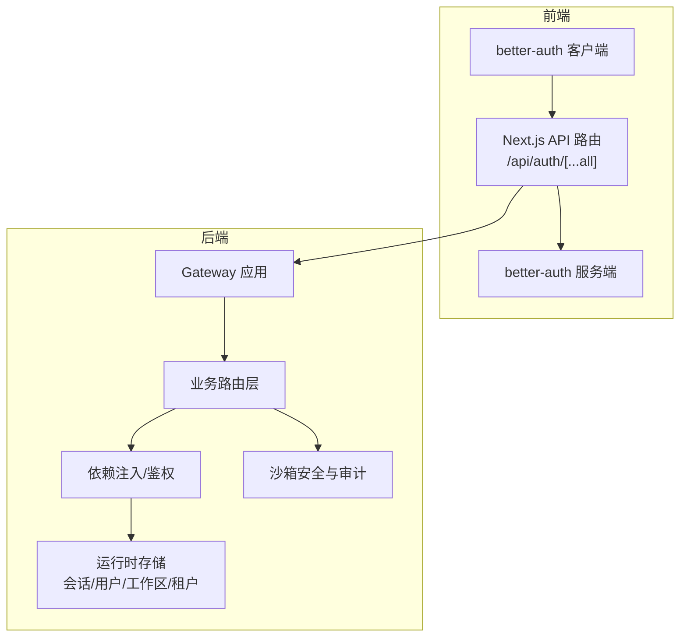
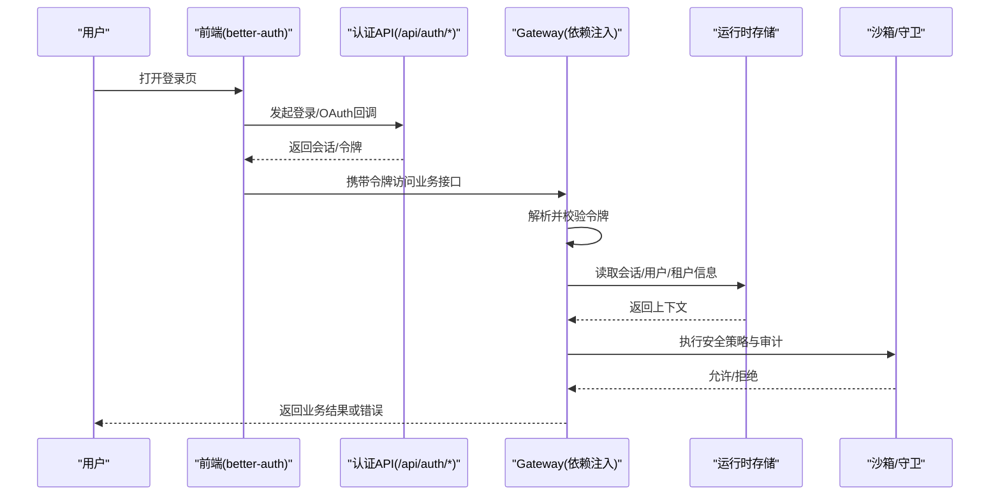
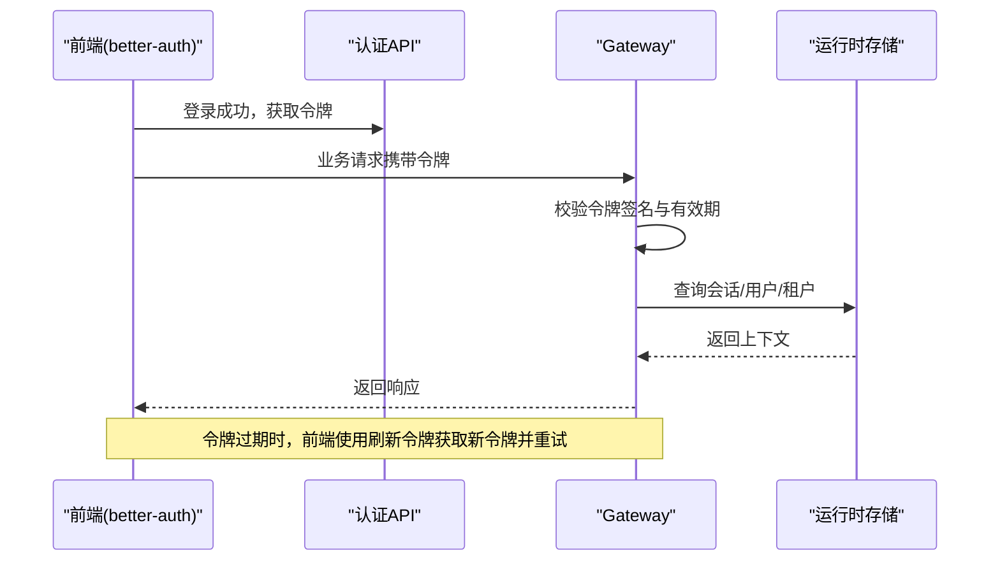
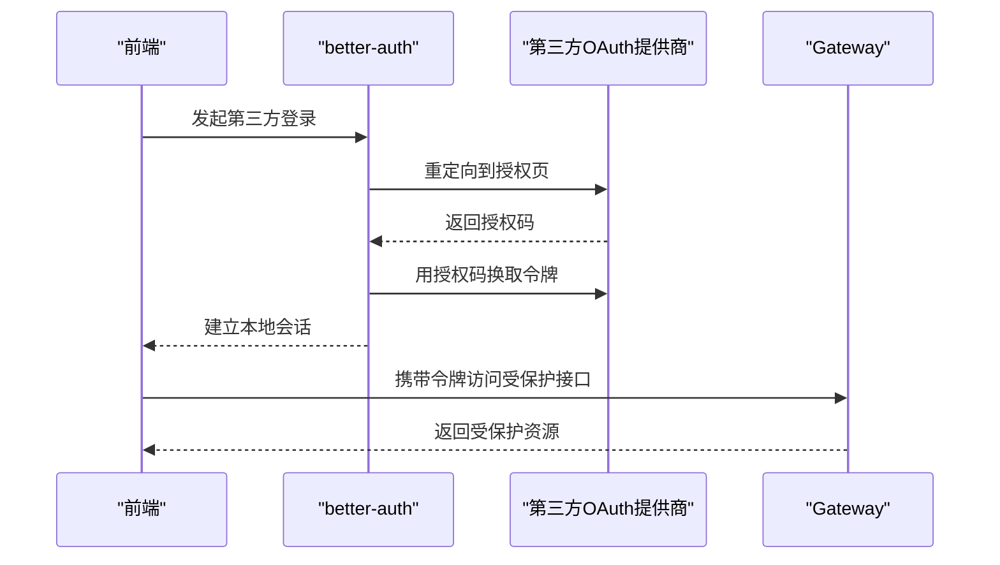
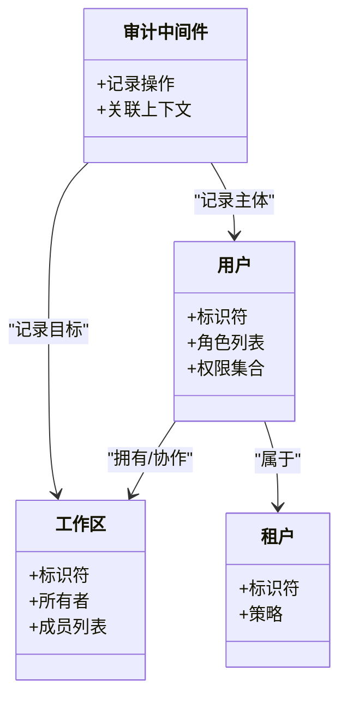
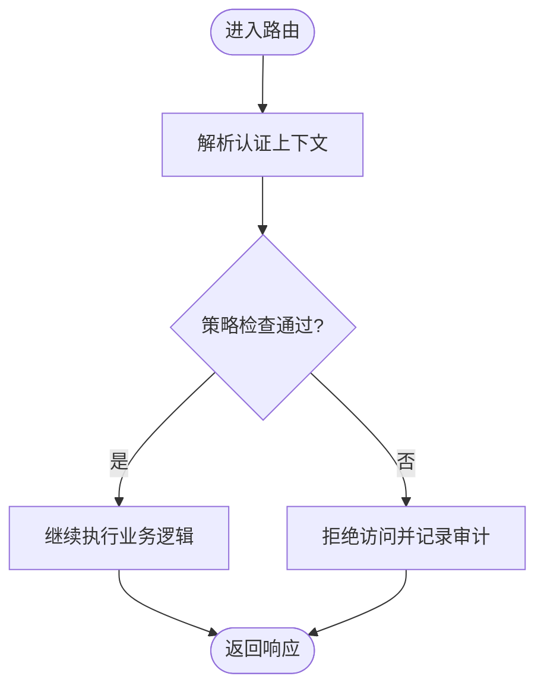
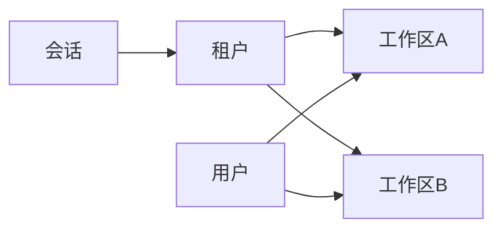
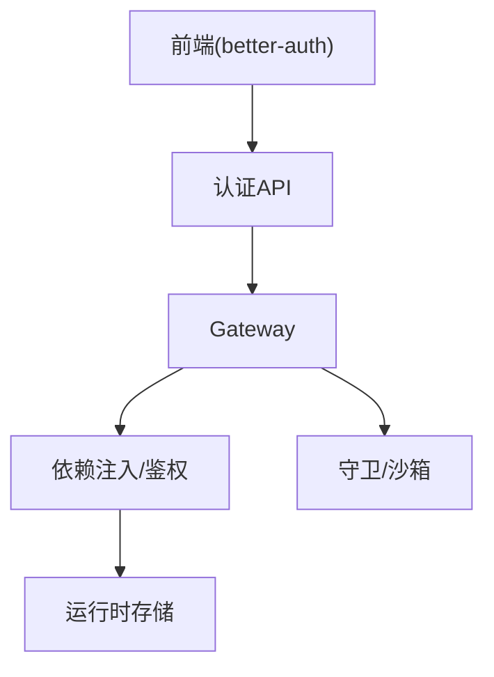

# 认证授权机制

<cite>
**本文引用的文件**   
- [backend/app/gateway/routers/agents.py](file://backend/app/gateway/routers/agents.py)
- [backend/app/gateway/routers/artifacts.py](file://backend/app/gateway/routers/artifacts.py)
- [backend/app/gateway/routers/channels.py](file://backend/app/gateway/routers/channels.py)
- [backend/app/gateway/routers/mcp.py](file://backend/app/gateway/routers/mcp.py)
- [backend/app/gateway/routers/memory.py](file://backend/app/gateway/routers/memory.py)
- [backend/app/gateway/routers/models.py](file://backend/app/gateway/routers/models.py)
- [backend/app/gateway/routers/runs.py](file://backend/app/gateway/routers/runs.py)
- [backend/app/gateway/routers/skills.py](file://backend/app/gateway/routers/skills.py)
- [backend/app/gateway/routers/suggestions.py](file://backend/app/gateway/routers/suggestions.py)
- [backend/app/gateway/routers/thread_runs.py](file://backend/app/gateway/routers/thread_runs.py)
- [backend/app/gateway/routers/threads.py](file://backend/app/gateway/routers/threads.py)
- [backend/app/gateway/routers/uploads.py](file://backend/app/gateway/routers/uploads.py)
- [backend/app/gateway/deps.py](file://backend/app/gateway/deps.py)
- [backend/app/gateway/config.py](file://backend/app/gateway/config.py)
- [backend/app/gateway/services.py](file://backend/app/gateway/services.py)
- [backend/app/gateway/app.py](file://backend/app/gateway/app.py)
- [frontend/src/server/better-auth/client.ts](file://frontend/src/server/better-auth/client.ts)
- [frontend/src/server/better-auth/config.ts](file://frontend/src/server/better-auth/config.ts)
- [frontend/src/server/better-auth/index.ts](file://frontend/src/server/better-auth/index.ts)
- [frontend/src/server/better-auth/server.ts](file://frontend/src/server/better-auth/server.ts)
- [frontend/src/app/api/auth/[...all]/route.ts](file://frontend/src/app/api/auth/[...all]/route.ts)
- [backend/packages/harness/deerflow/mcp/oauth.py](file://backend/packages/harness/deerflow/mcp/oauth.py)
- [backend/packages/harness/deerflow/mcp/client.py](file://backend/packages/harness/deerflow/mcp/client.py)
- [backend/packages/harness/deerflow/mcp/tools.py](file://backend/packages/harness/deerflow/mcp/tools.py)
- [backend/packages/harness/deerflow/middleware.py](file://backend/packages/harness/deerflow/guardrails/middleware.py)
- [backend/packages/harness/deerflow/guardrails/provider.py](file://backend/packages/harness/deerflow/guardrails/provider.py)
- [backend/packages/harness/deerflow/sandbox/security.py](file://backend/packages/harness/deerflow/sandbox/security.py)
- [backend/packages/harness/deerflow/sandbox/middleware.py](file://backend/packages/harness/deerflow/sandbox/middleware.py)
- [backend/packages/harness/deerflow/agents/middlewares/audit_middleware.py](file://backend/packages/harness/deerflow/agents/middlewares/audit_middleware.py)
- [backend/packages/harness/deerflow/agents/middlewares/thread_state_middleware.py](file://backend/packages/harness/deerflow/agents/middlewares/thread_state_middleware.py)
- [backend/packages/harness/deerflow/runtime/store/session_store.py](file://backend/packages/harness/deerflow/runtime/store/session_store.py)
- [backend/packages/harness/deerflow/runtime/store/user_store.py](file://backend/packages/harness/deerflow/runtime/store/user_store.py)
- [backend/packages/harness/deerflow/runtime/store/workspace_store.py](file://backend/packages/harness/deerflow/runtime/store/workspace_store.py)
- [backend/packages/harness/deerflow/runtime/store/tenant_store.py](file://backend/packages/harness/deerflow/runtime/store/tenant_store.py)
</cite>

## 目录
1. [简介](#简介)
2. [项目结构](#项目结构)
3. [核心组件](#核心组件)
4. [架构总览](#架构总览)
5. [详细组件分析](#详细组件分析)
6. [依赖关系分析](#依赖关系分析)
7. [性能考虑](#性能考虑)
8. [故障排查指南](#故障排查指南)
9. [结论](#结论)
10. [附录](#附录)

## 简介
本文件系统性梳理 DeerFlow 的认证与授权机制，覆盖以下主题：
- JWT 令牌的生成、验证与刷新流程（前端集成）
- OAuth2.0 集成（提供商配置与用户信息获取）
- 内部服务间认证与安全通信
- 权限控制（角色、资源访问控制、操作审计）
- 认证中间件的使用与自定义扩展
- 多租户环境下的用户隔离与数据安全
- 安全最佳实践与常见安全问题防护
- 认证失败的错误处理与日志记录方法

## 项目结构
DeerFlow 采用前后端分离架构。认证相关能力主要分布在：
- 前端 Next.js 应用：基于 better-auth 提供登录、会话管理、OAuth 回调路由等
- 后端 Gateway：FastAPI 网关，承载业务路由与依赖注入
- 运行期存储：会话、用户、工作区与租户数据持久化
- 沙箱与守卫：执行安全策略、审计与上下文注入

图表来源
- [frontend/src/app/api/auth/[...all]/route.ts](file://frontend/src/app/api/auth/[...all]/route.ts)
- [frontend/src/server/better-auth/client.ts](file://frontend/src/server/better-auth/client.ts)
- [frontend/src/server/better-auth/server.ts](file://frontend/src/server/better-auth/server.ts)
- [backend/app/gateway/app.py](file://backend/app/gateway/app.py)
- [backend/app/gateway/deps.py](file://backend/app/gateway/deps.py)
- [backend/packages/harness/deerflow/runtime/store/session_store.py](file://backend/packages/harness/deerflow/runtime/store/session_store.py)
- [backend/packages/harness/deerflow/runtime/store/user_store.py](file://backend/packages/harness/deerflow/runtime/store/user_store.py)
- [backend/packages/harness/deerflow/runtime/store/workspace_store.py](file://backend/packages/harness/deerflow/runtime/store/workspace_store.py)
- [backend/packages/harness/deerflow/runtime/store/tenant_store.py](file://backend/packages/harness/deerflow/runtime/store/tenant_store.py)
- [backend/packages/harness/deerflow/sandbox/security.py](file://backend/packages/harness/deerflow/sandbox/security.py)
- [backend/packages/harness/deerflow/sandbox/middleware.py](file://backend/packages/harness/deerflow/sandbox/middleware.py)

章节来源
- [backend/app/gateway/app.py](file://backend/app/gateway/app.py)
- [backend/app/gateway/deps.py](file://backend/app/gateway/deps.py)
- [frontend/src/app/api/auth/[...all]/route.ts](file://frontend/src/app/api/auth/[...all]/route.ts)
- [frontend/src/server/better-auth/server.ts](file://frontend/src/server/better-auth/server.ts)
- [frontend/src/server/better-auth/client.ts](file://frontend/src/server/better-auth/client.ts)

## 核心组件
- 前端认证栈（better-auth）
  - 提供统一的认证入口 /api/auth/[...all]，封装登录、注册、密码重置、第三方 OAuth 回调等
  - 通过客户端 SDK 在浏览器侧维护会话状态与令牌
- 后端网关与依赖注入
  - 所有业务路由均通过依赖注入解析当前会话/用户上下文
  - 统一校验请求头中的认证凭据并注入到处理器
- 运行时存储
  - 会话、用户、工作区与租户数据由运行时存储模块负责读写
- 沙箱与守卫
  - 在执行敏感操作前进行安全检查与审计，确保最小权限原则

章节来源
- [frontend/src/app/api/auth/[...all]/route.ts](file://frontend/src/app/api/auth/[...all]/route.ts)
- [frontend/src/server/better-auth/client.ts](file://frontend/src/server/better-auth/client.ts)
- [frontend/src/server/better-auth/config.ts](file://frontend/src/server/better-auth/config.ts)
- [frontend/src/server/better-auth/index.ts](file://frontend/src/server/better-auth/index.ts)
- [backend/app/gateway/deps.py](file://backend/app/gateway/deps.py)
- [backend/packages/harness/deerflow/runtime/store/session_store.py](file://backend/packages/harness/deerflow/runtime/store/session_store.py)
- [backend/packages/harness/deerflow/runtime/store/user_store.py](file://backend/packages/harness/deerflow/runtime/store/user_store.py)
- [backend/packages/harness/deerflow/runtime/store/workspace_store.py](file://backend/packages/harness/deerflow/runtime/store/workspace_store.py)
- [backend/packages/harness/deerflow/runtime/store/tenant_store.py](file://backend/packages/harness/deerflow/runtime/store/tenant_store.py)
- [backend/packages/harness/deerflow/sandbox/security.py](file://backend/packages/harness/deerflow/sandbox/security.py)
- [backend/packages/harness/deerflow/sandbox/middleware.py](file://backend/packages/harness/deerflow/sandbox/middleware.py)

## 架构总览
下图展示从前端发起认证到后端鉴权的端到端流程，以及后续业务调用时的鉴权路径。

图表来源
- [frontend/src/app/api/auth/[...all]/route.ts](file://frontend/src/app/api/auth/[...all]/route.ts)
- [frontend/src/server/better-auth/client.ts](file://frontend/src/server/better-auth/client.ts)
- [backend/app/gateway/deps.py](file://backend/app/gateway/deps.py)
- [backend/packages/harness/deerflow/runtime/store/session_store.py](file://backend/packages/harness/deerflow/runtime/store/session_store.py)
- [backend/packages/harness/deerflow/runtime/store/user_store.py](file://backend/packages/harness/deerflow/runtime/store/user_store.py)
- [backend/packages/harness/deerflow/runtime/store/tenant_store.py](file://backend/packages/harness/deerflow/runtime/store/tenant_store.py)
- [backend/packages/harness/deerflow/sandbox/security.py](file://backend/packages/harness/deerflow/sandbox/security.py)

## 详细组件分析

### JWT 令牌：生成、验证与刷新
- 生成
  - 前端通过 better-auth 完成身份核验后，获得会话与令牌，并在后续请求中自动附加
- 验证
  - 后端 Gateway 在依赖注入阶段解析请求头中的令牌，校验签名与有效期，并加载用户与会话上下文
- 刷新
  - 前端在令牌即将过期时触发刷新逻辑，使用刷新令牌换取新令牌，保持会话连续性

图表来源
- [frontend/src/app/api/auth/[...all]/route.ts](file://frontend/src/app/api/auth/[...all]/route.ts)
- [frontend/src/server/better-auth/client.ts](file://frontend/src/server/better-auth/client.ts)
- [backend/app/gateway/deps.py](file://backend/app/gateway/deps.py)
- [backend/packages/harness/deerflow/runtime/store/session_store.py](file://backend/packages/harness/deerflow/runtime/store/session_store.py)
- [backend/packages/harness/deerflow/runtime/store/user_store.py](file://backend/packages/harness/deerflow/runtime/store/user_store.py)

章节来源
- [frontend/src/server/better-auth/client.ts](file://frontend/src/server/better-auth/client.ts)
- [frontend/src/app/api/auth/[...all]/route.ts](file://frontend/src/app/api/auth/[...all]/route.ts)
- [backend/app/gateway/deps.py](file://backend/app/gateway/deps.py)
- [backend/packages/harness/deerflow/runtime/store/session_store.py](file://backend/packages/harness/deerflow/runtime/store/session_store.py)
- [backend/packages/harness/deerflow/runtime/store/user_store.py](file://backend/packages/harness/deerflow/runtime/store/user_store.py)

### OAuth2.0 集成：提供商配置与用户信息获取
- 提供商配置
  - 在前端 better-auth 配置中声明支持的第三方提供商（如 GitHub、Google 等），设置客户端 ID、密钥与回调地址
- 用户信息获取
  - 用户选择第三方登录后，前端跳转到对应提供商授权页面，回调至 /api/auth/[...all]，完成令牌交换与用户信息拉取
- MCP OAuth（可选）
  - 当调用外部 MCP 工具时，可复用 OAuth 流程为工具调用获取访问令牌

图表来源
- [frontend/src/server/better-auth/config.ts](file://frontend/src/server/better-auth/config.ts)
- [frontend/src/app/api/auth/[...all]/route.ts](file://frontend/src/app/api/auth/[...all]/route.ts)
- [backend/packages/harness/deerflow/mcp/oauth.py](file://backend/packages/harness/deerflow/mcp/oauth.py)

章节来源
- [frontend/src/server/better-auth/config.ts](file://frontend/src/server/better-auth/config.ts)
- [frontend/src/app/api/auth/[...all]/route.ts](file://frontend/src/app/api/auth/[...all]/route.ts)
- [backend/packages/harness/deerflow/mcp/oauth.py](file://backend/packages/harness/deerflow/mcp/oauth.py)

### 内部服务间认证与安全通信
- 服务发现
  - 通过 Gateway 作为统一入口，内部服务以可信网络访问 Gateway，再由 Gateway 转发到具体服务
- 安全通信
  - 服务间调用建议使用 mTLS 或内部网络隔离；Gateway 对内部服务调用进行白名单与来源校验
- 令牌传递
  - 内部服务调用需透传上游会话令牌，以便下游进行细粒度鉴权与审计

章节来源
- [backend/app/gateway/app.py](file://backend/app/gateway/app.py)
- [backend/app/gateway/deps.py](file://backend/app/gateway/deps.py)

### 权限控制系统：角色、资源访问控制与操作审计
- 角色定义
  - 在用户上下文中包含角色与权限集合，用于决定资源访问范围
- 资源访问控制
  - 路由层根据资源归属（如工作区、租户）与用户权限进行判定
- 操作审计
  - 关键操作经审计中间件记录，包括操作主体、目标资源与结果

图表来源
- [backend/packages/harness/deerflow/agents/middlewares/audit_middleware.py](file://backend/packages/harness/deerflow/agents/middlewares/audit_middleware.py)
- [backend/packages/harness/deerflow/runtime/store/user_store.py](file://backend/packages/harness/deerflow/runtime/store/user_store.py)
- [backend/packages/harness/deerflow/runtime/store/workspace_store.py](file://backend/packages/harness/deerflow/runtime/store/workspace_store.py)
- [backend/packages/harness/deerflow/runtime/store/tenant_store.py](file://backend/packages/harness/deerflow/runtime/store/tenant_store.py)

章节来源
- [backend/packages/harness/deerflow/agents/middlewares/audit_middleware.py](file://backend/packages/harness/deerflow/agents/middlewares/audit_middleware.py)
- [backend/packages/harness/deerflow/runtime/store/user_store.py](file://backend/packages/harness/deerflow/runtime/store/user_store.py)
- [backend/packages/harness/deerflow/runtime/store/workspace_store.py](file://backend/packages/harness/deerflow/runtime/store/workspace_store.py)
- [backend/packages/harness/deerflow/runtime/store/tenant_store.py](file://backend/packages/harness/deerflow/runtime/store/tenant_store.py)

### 认证中间件：使用方法与自定义扩展
- 使用方法
  - 在 Gateway 依赖注入中解析认证上下文，将用户、会话、租户与工作区信息注入到请求处理函数
- 自定义扩展
  - 可在守卫与沙箱中间件中插入自定义策略，例如动态权限检查、IP 白名单、速率限制等

图表来源
- [backend/app/gateway/deps.py](file://backend/app/gateway/deps.py)
- [backend/packages/harness/deerflow/guardrails/middleware.py](file://backend/packages/harness/deerflow/guardrails/middleware.py)
- [backend/packages/harness/deerflow/sandbox/middleware.py](file://backend/packages/harness/deerflow/sandbox/middleware.py)

章节来源
- [backend/app/gateway/deps.py](file://backend/app/gateway/deps.py)
- [backend/packages/harness/deerflow/guardrails/middleware.py](file://backend/packages/harness/deerflow/guardrails/middleware.py)
- [backend/packages/harness/deerflow/sandbox/middleware.py](file://backend/packages/harness/deerflow/sandbox/middleware.py)

### 多租户环境：用户隔离与数据安全
- 租户隔离
  - 每个租户拥有独立策略与数据边界，用户上下文携带租户标识
- 工作区隔离
  - 工作区作为资源单元，结合用户角色实现细粒度访问控制
- 会话隔离
  - 会话数据按租户维度存储与检索，避免跨租户泄露

图表来源
- [backend/packages/harness/deerflow/runtime/store/tenant_store.py](file://backend/packages/harness/deerflow/runtime/store/tenant_store.py)
- [backend/packages/harness/deerflow/runtime/store/workspace_store.py](file://backend/packages/harness/deerflow/runtime/store/workspace_store.py)
- [backend/packages/harness/deerflow/runtime/store/user_store.py](file://backend/packages/harness/deerflow/runtime/store/user_store.py)
- [backend/packages/harness/deerflow/runtime/store/session_store.py](file://backend/packages/harness/deerflow/runtime/store/session_store.py)

章节来源
- [backend/packages/harness/deerflow/runtime/store/tenant_store.py](file://backend/packages/harness/deerflow/runtime/store/tenant_store.py)
- [backend/packages/harness/deerflow/runtime/store/workspace_store.py](file://backend/packages/harness/deerflow/runtime/store/workspace_store.py)
- [backend/packages/harness/deerflow/runtime/store/user_store.py](file://backend/packages/harness/deerflow/runtime/store/user_store.py)
- [backend/packages/harness/deerflow/runtime/store/session_store.py](file://backend/packages/harness/deerflow/runtime/store/session_store.py)

### 外部工具 OAuth（MCP）
- 场景
  - 调用外部 MCP 工具时需要访问令牌
- 流程
  - 复用 OAuth 流程获取访问令牌，并在工具调用时附带令牌
- 注意
  - 令牌应仅用于必要的最小权限范围，并遵循短期有效与刷新策略

章节来源
- [backend/packages/harness/deerflow/mcp/oauth.py](file://backend/packages/harness/deerflow/mcp/oauth.py)
- [backend/packages/harness/deerflow/mcp/client.py](file://backend/packages/harness/deerflow/mcp/client.py)
- [backend/packages/harness/deerflow/mcp/tools.py](file://backend/packages/harness/deerflow/mcp/tools.py)

## 依赖关系分析
- 前端依赖 better-auth 提供认证能力，并通过 API 路由集中处理
- 后端 Gateway 依赖注入解析认证上下文，连接运行时存储
- 沙箱与守卫在业务执行前后施加安全策略与审计

图表来源
- [frontend/src/server/better-auth/client.ts](file://frontend/src/server/better-auth/client.ts)
- [frontend/src/app/api/auth/[...all]/route.ts](file://frontend/src/app/api/auth/[...all]/route.ts)
- [backend/app/gateway/deps.py](file://backend/app/gateway/deps.py)
- [backend/packages/harness/deerflow/runtime/store/session_store.py](file://backend/packages/harness/deerflow/runtime/store/session_store.py)
- [backend/packages/harness/deerflow/sandbox/security.py](file://backend/packages/harness/deerflow/sandbox/security.py)

章节来源
- [frontend/src/server/better-auth/client.ts](file://frontend/src/server/better-auth/client.ts)
- [frontend/src/app/api/auth/[...all]/route.ts](file://frontend/src/app/api/auth/[...all]/route.ts)
- [backend/app/gateway/deps.py](file://backend/app/gateway/deps.py)
- [backend/packages/harness/deerflow/runtime/store/session_store.py](file://backend/packages/harness/deerflow/runtime/store/session_store.py)
- [backend/packages/harness/deerflow/sandbox/security.py](file://backend/packages/harness/deerflow/sandbox/security.py)

## 性能考虑
- 令牌校验缓存
  - 对高频校验的令牌进行短期缓存，减少存储查询压力
- 会话与用户信息预取
  - 在依赖注入阶段批量加载所需上下文，避免多次 I/O
- 限流与熔断
  - 对认证与敏感接口实施限流，防止滥用与雪崩
- 异步与批处理
  - 审计日志写入采用异步队列，降低主链路延迟

[本节为通用指导，不直接分析具体文件]

## 故障排查指南
- 常见问题
  - 令牌无效或过期：检查前端是否已刷新令牌，确认后端校验逻辑与时间同步
  - 权限不足：核对用户角色与工作区成员关系，确认策略配置
  - 第三方登录失败：检查提供商客户端 ID/密钥与回调地址配置
- 错误处理
  - 认证失败应返回明确的状态码与消息，便于前端提示
  - 记录必要的审计事件，包括失败原因与来源 IP
- 日志记录
  - 记录认证生命周期关键节点（登录、刷新、登出、授权失败）
  - 对敏感字段脱敏，避免泄露隐私

章节来源
- [backend/packages/harness/deerflow/agents/middlewares/audit_middleware.py](file://backend/packages/harness/deerflow/agents/middlewares/audit_middleware.py)
- [backend/packages/harness/deerflow/sandbox/middleware.py](file://backend/packages/harness/deerflow/sandbox/middleware.py)

## 结论
DeerFlow 的认证与授权体系以前端 better-auth 为核心，结合后端 Gateway 的依赖注入与运行时存储，实现了统一的会话管理与细粒度权限控制。通过沙箱与守卫机制，系统在保障功能的同时强化了安全与审计能力。在多租户环境下，借助租户与工作区的数据隔离，进一步提升了安全性与可扩展性。建议在生产环境中严格遵循令牌安全、最小权限与审计留痕的最佳实践，并持续监控与优化性能。

[本节为总结性内容，不直接分析具体文件]

## 附录
- 参考路由与依赖
  - 业务路由示例：[backend/app/gateway/routers/agents.py](file://backend/app/gateway/routers/agents.py)、[backend/app/gateway/routers/threads.py](file://backend/app/gateway/routers/threads.py)、[backend/app/gateway/routers/uploads.py](file://backend/app/gateway/routers/uploads.py)
  - 依赖注入与配置：[backend/app/gateway/deps.py](file://backend/app/gateway/deps.py)、[backend/app/gateway/config.py](file://backend/app/gateway/config.py)
  - 服务层：[backend/app/gateway/services.py](file://backend/app/gateway/services.py)

章节来源
- [backend/app/gateway/routers/agents.py](file://backend/app/gateway/routers/agents.py)
- [backend/app/gateway/routers/threads.py](file://backend/app/gateway/routers/threads.py)
- [backend/app/gateway/routers/uploads.py](file://backend/app/gateway/routers/uploads.py)
- [backend/app/gateway/deps.py](file://backend/app/gateway/deps.py)
- [backend/app/gateway/config.py](file://backend/app/gateway/config.py)
- [backend/app/gateway/services.py](file://backend/app/gateway/services.py)