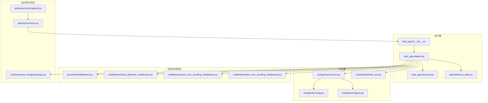
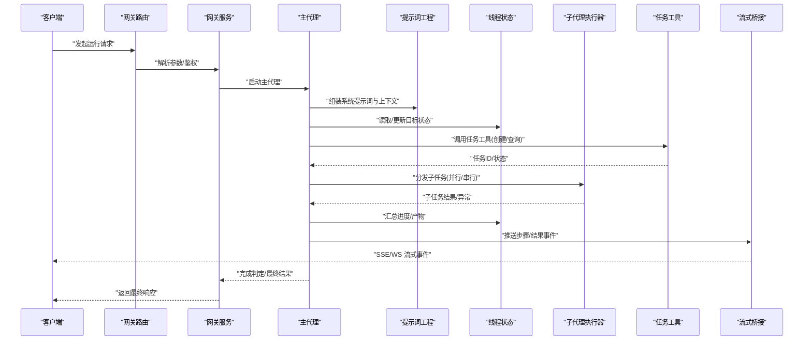
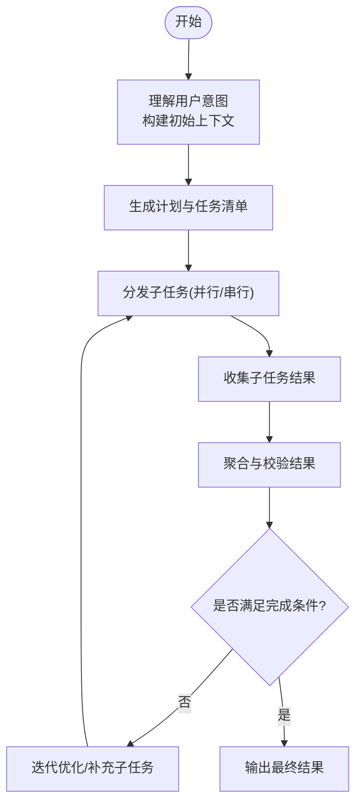
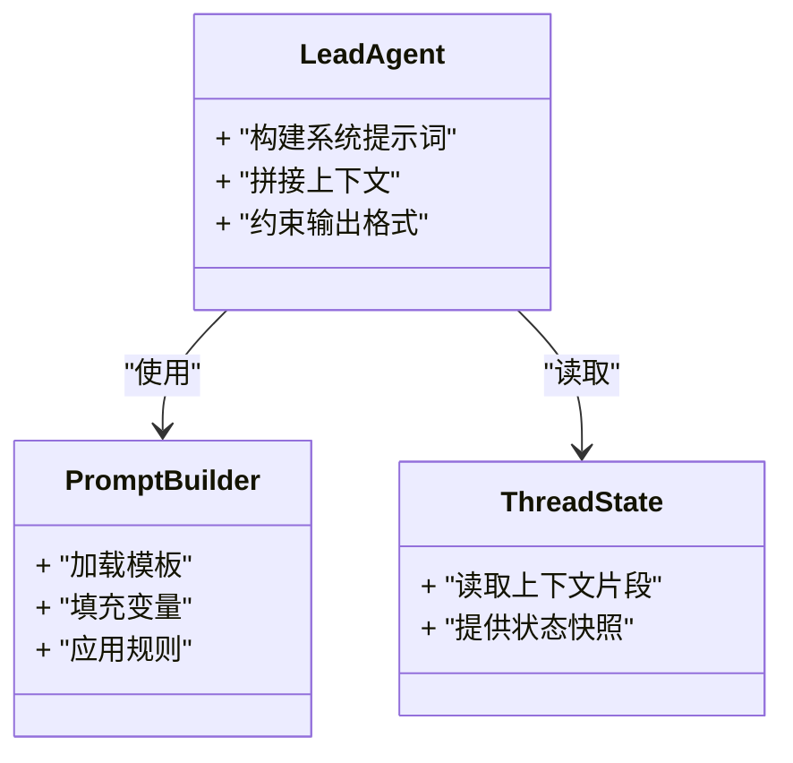
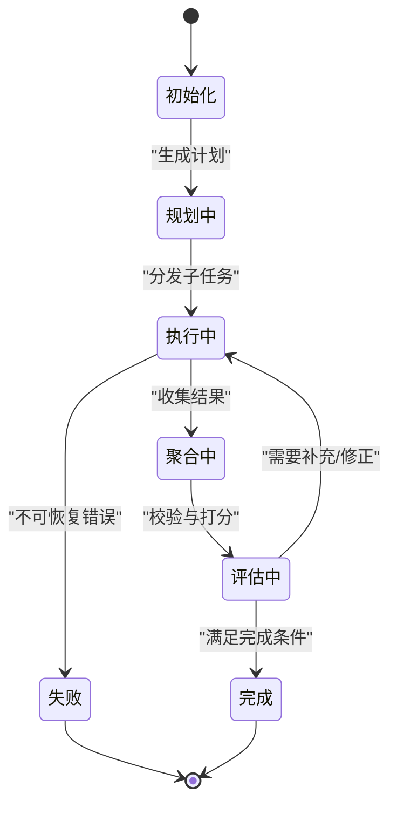
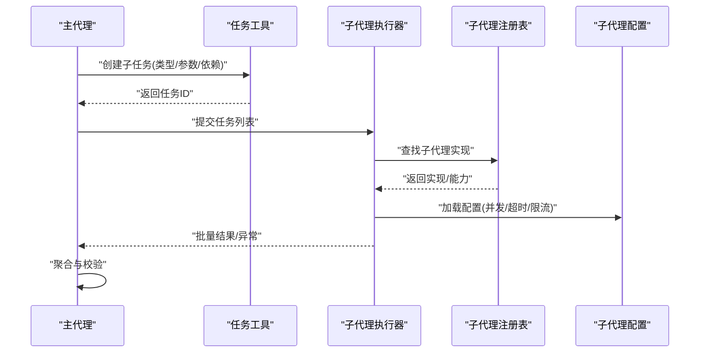
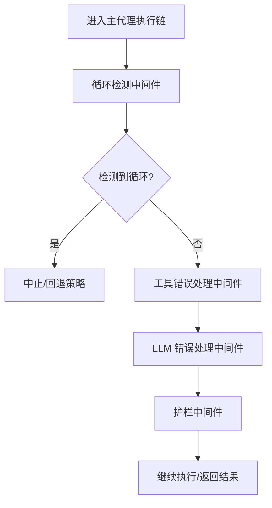
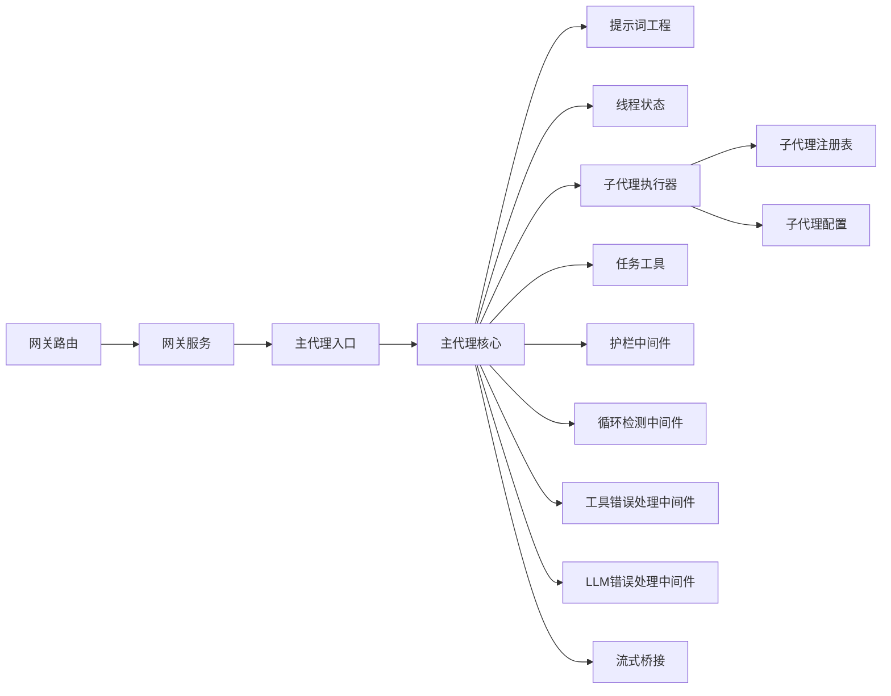

# 主代理管理

<cite>
**本文引用的文件**   
- [backend/packages/harness/deerflow/agents/lead_agent/__init__.py](file://backend/packages/harness/deerflow/agents/lead_agent/__init__.py)
- [backend/packages/harness/deerflow/agents/lead_agent/agent.py](file://backend/packages/harness/deerflow/agents/lead_agent/agent.py)
- [backend/packages/harness/deerflow/agents/lead_agent/prompt.py](file://backend/packages/harness/deerflow/agents/lead_agent/prompt.py)
- [backend/packages/harness/deerflow/agents/thread_state.py](file://backend/packages/harness/deerflow/agents/thread_state.py)
- [backend/packages/harness/deerflow/subagents/executor.py](file://backend/packages/harness/deerflow/subagents/executor.py)
- [backend/packages/harness/deerflow/subagents/config.py](file://backend/packages/harness/deerflow/subagents/config.py)
- [backend/packages/harness/deerflow/subagents/registry.py](file://backend/packages/harness/deerflow/subagents/registry.py)
- [backend/packages/harness/deerflow/tools/builtins/task_tool.py](file://backend/packages/harness/deerflow/tools/builtins/task_tool.py)
- [backend/packages/harness/deerflow/guardrails/middleware.py](file://backend/packages/harness/deerflow/guardrails/middleware.py)
- [backend/packages/harness/deerflow/middlewares/loop_detection_middleware.py](file://backend/packages/harness/deerflow/middlewares/loop_detection_middleware.py)
- [backend/packages/harness/deerflow/middlewares/tool_error_handling_middleware.py](file://backend/packages/harness/deerflow/middlewares/tool_error_handling_middleware.py)
- [backend/packages/harness/deerflow/middlewares/llm_error_handling_middleware.py](file://backend/packages/harness/deerflow/middlewares/llm_error_handling_middleware.py)
- [backend/packages/harness/deerflow/runtime/stream_bridge/manager.py](file://backend/packages/harness/deerflow/runtime/stream_bridge/manager.py)
- [backend/app/gateway/routers/agents.py](file://backend/app/gateway/routers/agents.py)
- [backend/app/gateway/services.py](file://backend/app/gateway/services.py)
- [backend/tests/test_lead_agent_prompt.py](file://backend/tests/test_lead_agent_prompt.py)
- [backend/tests/test_lead_agent_skills.py](file://backend/tests/test_lead_agent_skills.py)
- [backend/tests/test_subagent_executor.py](file://backend/tests/test_subagent_executor.py)
</cite>

## 目录
1. [简介](#简介)
2. [项目结构](#项目结构)
3. [核心组件](#核心组件)
4. [架构总览](#架构总览)
5. [详细组件分析](#详细组件分析)
6. [依赖关系分析](#依赖关系分析)
7. [性能考虑](#性能考虑)
8. [故障排查指南](#故障排查指南)
9. [结论](#结论)
10. [附录](#附录)

## 简介
本文件面向“主代理(Lead Agent)”的管理与扩展，系统性阐述其职责、工作流程、提示词工程、目标状态管理、与子代理的交互协议，以及自定义开发指南。文档同时提供架构图、流程图和时序图，帮助读者从高层到代码级全面理解主代理在 Deer-Flow 多智能体系统中的编排角色。

## 项目结构
围绕主代理的关键实现位于后端 harness 的 agents 与 subagents 模块中，配合工具、中间件、流式桥接与网关路由共同构成完整的执行链路。下图给出与主代理相关的核心文件组织概览。

图表来源
- [backend/packages/harness/deerflow/agents/lead_agent/__init__.py](file://backend/packages/harness/deerflow/agents/lead_agent/__init__.py)
- [backend/packages/harness/deerflow/agents/lead_agent/agent.py](file://backend/packages/harness/deerflow/agents/lead_agent/agent.py)
- [backend/packages/harness/deerflow/agents/lead_agent/prompt.py](file://backend/packages/harness/deerflow/agents/lead_agent/prompt.py)
- [backend/packages/harness/deerflow/agents/thread_state.py](file://backend/packages/harness/deerflow/agents/thread_state.py)
- [backend/packages/harness/deerflow/subagents/executor.py](file://backend/packages/harness/deerflow/subagents/executor.py)
- [backend/packages/harness/deerflow/subagents/config.py](file://backend/packages/harness/deerflow/subagents/config.py)
- [backend/packages/harness/deerflow/subagents/registry.py](file://backend/packages/harness/deerflow/subagents/registry.py)
- [backend/packages/harness/deerflow/tools/builtins/task_tool.py](file://backend/packages/harness/deerflow/tools/builtins/task_tool.py)
- [backend/packages/harness/deerflow/guardrails/middleware.py](file://backend/packages/harness/deerflow/guardrails/middleware.py)
- [backend/packages/harness/deerflow/middlewares/loop_detection_middleware.py](file://backend/packages/harness/deerflow/middlewares/loop_detection_middleware.py)
- [backend/packages/harness/deerflow/middlewares/tool_error_handling_middleware.py](file://backend/packages/harness/deerflow/middlewares/tool_error_handling_middleware.py)
- [backend/packages/harness/deerflow/middlewares/llm_error_handling_middleware.py](file://backend/packages/harness/deerflow/middlewares/llm_error_handling_middleware.py)
- [backend/packages/harness/deerflow/runtime/stream_bridge/manager.py](file://backend/packages/harness/deerflow/runtime/stream_bridge/manager.py)
- [backend/app/gateway/routers/agents.py](file://backend/app/gateway/routers/agents.py)
- [backend/app/gateway/services.py](file://backend/app/gateway/services.py)

章节来源
- [backend/packages/harness/deerflow/agents/lead_agent/__init__.py](file://backend/packages/harness/deerflow/agents/lead_agent/__init__.py)
- [backend/packages/harness/deerflow/agents/lead_agent/agent.py](file://backend/packages/harness/deerflow/agents/lead_agent/agent.py)
- [backend/packages/harness/deerflow/agents/lead_agent/prompt.py](file://backend/packages/harness/deerflow/agents/lead_agent/prompt.py)
- [backend/packages/harness/deerflow/agents/thread_state.py](file://backend/packages/harness/deerflow/agents/thread_state.py)
- [backend/packages/harness/deerflow/subagents/executor.py](file://backend/packages/harness/deerflow/subagents/executor.py)
- [backend/packages/harness/deerflow/subagents/config.py](file://backend/packages/harness/deerflow/subagents/config.py)
- [backend/packages/harness/deerflow/subagents/registry.py](file://backend/packages/harness/deerflow/subagents/registry.py)
- [backend/packages/harness/deerflow/tools/builtins/task_tool.py](file://backend/packages/harness/deerflow/tools/builtins/task_tool.py)
- [backend/packages/harness/deerflow/guardrails/middleware.py](file://backend/packages/harness/deerflow/guardrails/middleware.py)
- [backend/packages/harness/deerflow/middlewares/loop_detection_middleware.py](file://backend/packages/harness/deerflow/middlewares/loop_detection_middleware.py)
- [backend/packages/harness/deerflow/middlewares/tool_error_handling_middleware.py](file://backend/packages/harness/deerflow/middlewares/tool_error_handling_middleware.py)
- [backend/packages/harness/deerflow/middlewares/llm_error_handling_middleware.py](file://backend/packages/harness/deerflow/middlewares/llm_error_handling_middleware.py)
- [backend/packages/harness/deerflow/runtime/stream_bridge/manager.py](file://backend/packages/harness/deerflow/runtime/stream_bridge/manager.py)
- [backend/app/gateway/routers/agents.py](file://backend/app/gateway/routers/agents.py)
- [backend/app/gateway/services.py](file://backend/app/gateway/services.py)

## 核心组件
- 主代理入口与装配：负责注册、初始化与暴露主代理能力，串联提示词、线程状态、子代理执行器与中间件。
- 主代理核心逻辑：承载任务理解、分解策略、协调调度、结果聚合与完成判定等关键流程。
- 提示词工程：系统提示词模板、上下文拼装、输出格式控制与约束。
- 线程状态管理：维护会话级目标、进度、产物与中间态，支撑可观测性与恢复。
- 子代理执行器：按主代理指令分发任务、收集结果、处理异常与超时。
- 内置任务工具：将“创建/查询/更新任务”的能力以工具形式暴露给主代理调用。
- 中间件与防护：循环检测、工具错误降级、LLM 错误处理、护栏校验等。
- 流式桥接：将运行期事件（如步骤、工具调用、结果）实时推送至前端或外部消费者。
- 网关路由与服务：对外暴露 API，接收请求并驱动主代理执行。

章节来源
- [backend/packages/harness/deerflow/agents/lead_agent/__init__.py](file://backend/packages/harness/deerflow/agents/lead_agent/__init__.py)
- [backend/packages/harness/deerflow/agents/lead_agent/agent.py](file://backend/packages/harness/deerflow/agents/lead_agent/agent.py)
- [backend/packages/harness/deerflow/agents/lead_agent/prompt.py](file://backend/packages/harness/deerflow/agents/lead_agent/prompt.py)
- [backend/packages/harness/deerflow/agents/thread_state.py](file://backend/packages/harness/deerflow/agents/thread_state.py)
- [backend/packages/harness/deerflow/subagents/executor.py](file://backend/packages/harness/deerflow/subagents/executor.py)
- [backend/packages/harness/deerflow/tools/builtins/task_tool.py](file://backend/packages/harness/deerflow/tools/builtins/task_tool.py)
- [backend/packages/harness/deerflow/guardrails/middleware.py](file://backend/packages/harness/deerflow/guardrails/middleware.py)
- [backend/packages/harness/deerflow/middlewares/loop_detection_middleware.py](file://backend/packages/harness/deerflow/middlewares/loop_detection_middleware.py)
- [backend/packages/harness/deerflow/middlewares/tool_error_handling_middleware.py](file://backend/packages/harness/deerflow/middlewares/tool_error_handling_middleware.py)
- [backend/packages/harness/deerflow/middlewares/llm_error_handling_middleware.py](file://backend/packages/harness/deerflow/middlewares/llm_error_handling_middleware.py)
- [backend/packages/harness/deerflow/runtime/stream_bridge/manager.py](file://backend/packages/harness/deerflow/runtime/stream_bridge/manager.py)
- [backend/app/gateway/routers/agents.py](file://backend/app/gateway/routers/agents.py)
- [backend/app/gateway/services.py](file://backend/app/gateway/services.py)

## 架构总览
下图展示一次典型的用户请求如何经由网关进入主代理，再由主代理进行任务理解、分解与子代理协作，最终返回结果并持续流式上报。

图表来源
- [backend/app/gateway/routers/agents.py](file://backend/app/gateway/routers/agents.py)
- [backend/app/gateway/services.py](file://backend/app/gateway/services.py)
- [backend/packages/harness/deerflow/agents/lead_agent/agent.py](file://backend/packages/harness/deerflow/agents/lead_agent/agent.py)
- [backend/packages/harness/deerflow/agents/lead_agent/prompt.py](file://backend/packages/harness/deerflow/agents/lead_agent/prompt.py)
- [backend/packages/harness/deerflow/agents/thread_state.py](file://backend/packages/harness/deerflow/agents/thread_state.py)
- [backend/packages/harness/deerflow/subagents/executor.py](file://backend/packages/harness/deerflow/subagents/executor.py)
- [backend/packages/harness/deerflow/tools/builtins/task_tool.py](file://backend/packages/harness/deerflow/tools/builtins/task_tool.py)
- [backend/packages/harness/deerflow/runtime/stream_bridge/manager.py](file://backend/packages/harness/deerflow/runtime/stream_bridge/manager.py)

## 详细组件分析

### 主代理核心逻辑与工作流程
- 任务理解：基于用户输入与上下文，结合系统提示词生成结构化计划（任务清单、依赖、优先级）。
- 分解策略：将复杂目标拆分为可独立执行的子任务；支持并行与顺序组合。
- 协调机制：通过任务工具与子代理执行器进行调度；对失败重试、超时与资源限制进行治理。
- 结果聚合：合并子任务产出，形成阶段性成果与最终交付物。
- 完成判定：依据目标状态中的验收条件与进度阈值决定是否结束。

章节来源
- [backend/packages/harness/deerflow/agents/lead_agent/agent.py](file://backend/packages/harness/deerflow/agents/lead_agent/agent.py)
- [backend/packages/harness/deerflow/agents/thread_state.py](file://backend/packages/harness/deerflow/agents/thread_state.py)
- [backend/packages/harness/deerflow/tools/builtins/task_tool.py](file://backend/packages/harness/deerflow/tools/builtins/task_tool.py)
- [backend/packages/harness/deerflow/subagents/executor.py](file://backend/packages/harness/deerflow/subagents/executor.py)

### 提示词工程(Prompt Engineering)
- 系统提示词设计：定义角色、边界、输出格式、安全约束与工具使用规范。
- 上下文管理：动态注入历史对话、记忆摘要、技能参考、工具描述与当前状态。
- 输出格式控制：强制结构化输出（如 JSON Schema），便于下游解析与自动化处理。
- 测试与验证：通过单元测试覆盖提示词在不同输入下的稳定性与一致性。

图表来源
- [backend/packages/harness/deerflow/agents/lead_agent/prompt.py](file://backend/packages/harness/deerflow/agents/lead_agent/prompt.py)
- [backend/packages/harness/deerflow/agents/thread_state.py](file://backend/packages/harness/deerflow/agents/thread_state.py)
- [backend/tests/test_lead_agent_prompt.py](file://backend/tests/test_lead_agent_prompt.py)

章节来源
- [backend/packages/harness/deerflow/agents/lead_agent/prompt.py](file://backend/packages/harness/deerflow/agents/lead_agent/prompt.py)
- [backend/tests/test_lead_agent_prompt.py](file://backend/tests/test_lead_agent_prompt.py)

### 目标状态管理(Goal State)
- 目标跟踪：记录目标描述、验收标准、里程碑与产物清单。
- 进度监控：统计已完成/进行中/失败的任务数，计算整体进度百分比。
- 完成判定：根据验收条件、质量阈值与依赖闭合情况决定终止。
- 持久化与恢复：支持检查点写入，以便中断后恢复执行。

章节来源
- [backend/packages/harness/deerflow/agents/thread_state.py](file://backend/packages/harness/deerflow/agents/thread_state.py)
- [backend/packages/harness/deerflow/agents/lead_agent/agent.py](file://backend/packages/harness/deerflow/agents/lead_agent/agent.py)

### 主代理与子代理的交互协议
- 任务分发：主代理通过任务工具创建子任务，指定类型、参数、依赖与超时。
- 结果收集：子代理执行器异步执行并回传结果，主代理按依赖顺序聚合。
- 异常处理：统一捕获工具/模型/网络异常，执行重试、降级或标记失败。
- 并发控制：限制并发度、队列长度与资源配额，避免过载。

图表来源
- [backend/packages/harness/deerflow/tools/builtins/task_tool.py](file://backend/packages/harness/deerflow/tools/builtins/task_tool.py)
- [backend/packages/harness/deerflow/subagents/executor.py](file://backend/packages/harness/deerflow/subagents/executor.py)
- [backend/packages/harness/deerflow/subagents/registry.py](file://backend/packages/harness/deerflow/subagents/registry.py)
- [backend/packages/harness/deerflow/subagents/config.py](file://backend/packages/harness/deerflow/subagents/config.py)
- [backend/tests/test_subagent_executor.py](file://backend/tests/test_subagent_executor.py)

章节来源
- [backend/packages/harness/deerflow/tools/builtins/task_tool.py](file://backend/packages/harness/deerflow/tools/builtins/task_tool.py)
- [backend/packages/harness/deerflow/subagents/executor.py](file://backend/packages/harness/deerflow/subagents/executor.py)
- [backend/packages/harness/deerflow/subagents/registry.py](file://backend/packages/harness/deerflow/subagents/registry.py)
- [backend/packages/harness/deerflow/subagents/config.py](file://backend/packages/harness/deerflow/subagents/config.py)
- [backend/tests/test_subagent_executor.py](file://backend/tests/test_subagent_executor.py)

### 中间件与防护
- 循环检测：识别重复调用模式，防止无限循环。
- 工具错误处理：对工具调用异常进行降级、重试与日志记录。
- LLM 错误处理：对模型调用失败进行退避、切换与告警。
- 护栏校验：在关键路径上执行安全与合规检查。

图表来源
- [backend/packages/harness/deerflow/middlewares/loop_detection_middleware.py](file://backend/packages/harness/deerflow/middlewares/loop_detection_middleware.py)
- [backend/packages/harness/deerflow/middlewares/tool_error_handling_middleware.py](file://backend/packages/harness/deerflow/middlewares/tool_error_handling_middleware.py)
- [backend/packages/harness/deerflow/middlewares/llm_error_handling_middleware.py](file://backend/packages/harness/deerflow/middlewares/llm_error_handling_middleware.py)
- [backend/packages/harness/deerflow/guardrails/middleware.py](file://backend/packages/harness/deerflow/guardrails/middleware.py)

章节来源
- [backend/packages/harness/deerflow/middlewares/loop_detection_middleware.py](file://backend/packages/harness/deerflow/middlewares/loop_detection_middleware.py)
- [backend/packages/harness/deerflow/middlewares/tool_error_handling_middleware.py](file://backend/packages/harness/deerflow/middlewares/tool_error_handling_middleware.py)
- [backend/packages/harness/deerflow/middlewares/llm_error_handling_middleware.py](file://backend/packages/harness/deerflow/middlewares/llm_error_handling_middleware.py)
- [backend/packages/harness/deerflow/guardrails/middleware.py](file://backend/packages/harness/deerflow/guardrails/middleware.py)

### 流式桥接与可观测性
- 事件类型：步骤开始/结束、工具调用、子任务结果、错误与完成信号。
- 传输通道：SSE/WebSocket 等长连接，确保低延迟与高吞吐。
- 消费端：前端可视化、审计系统与外部集成。

章节来源
- [backend/packages/harness/deerflow/runtime/stream_bridge/manager.py](file://backend/packages/harness/deerflow/runtime/stream_bridge/manager.py)

### 网关接入与运行生命周期
- 路由层：解析请求、鉴权、参数校验与路由转发。
- 服务层：构造运行上下文、驱动主代理、管理流式输出与结果封装。

章节来源
- [backend/app/gateway/routers/agents.py](file://backend/app/gateway/routers/agents.py)
- [backend/app/gateway/services.py](file://backend/app/gateway/services.py)

## 依赖关系分析
主代理依赖子代理执行器、任务工具、提示词与线程状态；受中间件与护栏保护；通过流式桥接对外暴露事件；由网关路由提供服务入口。

图表来源
- [backend/app/gateway/routers/agents.py](file://backend/app/gateway/routers/agents.py)
- [backend/app/gateway/services.py](file://backend/app/gateway/services.py)
- [backend/packages/harness/deerflow/agents/lead_agent/__init__.py](file://backend/packages/harness/deerflow/agents/lead_agent/__init__.py)
- [backend/packages/harness/deerflow/agents/lead_agent/agent.py](file://backend/packages/harness/deerflow/agents/lead_agent/agent.py)
- [backend/packages/harness/deerflow/agents/lead_agent/prompt.py](file://backend/packages/harness/deerflow/agents/lead_agent/prompt.py)
- [backend/packages/harness/deerflow/agents/thread_state.py](file://backend/packages/harness/deerflow/agents/thread_state.py)
- [backend/packages/harness/deerflow/subagents/executor.py](file://backend/packages/harness/deerflow/subagents/executor.py)
- [backend/packages/harness/deerflow/subagents/registry.py](file://backend/packages/harness/deerflow/subagents/registry.py)
- [backend/packages/harness/deerflow/subagents/config.py](file://backend/packages/harness/deerflow/subagents/config.py)
- [backend/packages/harness/deerflow/tools/builtins/task_tool.py](file://backend/packages/harness/deerflow/tools/builtins/task_tool.py)
- [backend/packages/harness/deerflow/guardrails/middleware.py](file://backend/packages/harness/deerflow/guardrails/middleware.py)
- [backend/packages/harness/deerflow/middlewares/loop_detection_middleware.py](file://backend/packages/harness/deerflow/middlewares/loop_detection_middleware.py)
- [backend/packages/harness/deerflow/middlewares/tool_error_handling_middleware.py](file://backend/packages/harness/deerflow/middlewares/tool_error_handling_middleware.py)
- [backend/packages/harness/deerflow/middlewares/llm_error_handling_middleware.py](file://backend/packages/harness/deerflow/middlewares/llm_error_handling_middleware.py)
- [backend/packages/harness/deerflow/runtime/stream_bridge/manager.py](file://backend/packages/harness/deerflow/runtime/stream_bridge/manager.py)

## 性能考虑
- 并发与限流：合理设置子代理并发度与队列容量，避免资源争用与雪崩。
- 批处理与缓存：对相似查询与工具结果进行缓存，减少重复开销。
- 流式输出：尽早推送中间结果，降低端到端时延。
- 提示词裁剪：按需注入上下文，控制 token 用量与成本。
- 错误快速失败：对不可恢复错误及时短路，释放资源并提升吞吐。

[本节为通用指导，不直接分析具体文件]

## 故障排查指南
- 循环检测：若出现重复调用模式，检查任务依赖与终止条件，必要时调整循环检测阈值。
- 工具错误：查看工具错误处理中间件的降级策略与重试次数，定位外部依赖问题。
- LLM 错误：关注模型错误处理中间件的退避与切换逻辑，确认密钥与配额。
- 子代理执行：核对子代理注册表与配置，检查超时、并发与权限。
- 流式事件：确认流式桥接的连接与事件类型，验证前端订阅是否正确。

章节来源
- [backend/packages/harness/deerflow/middlewares/loop_detection_middleware.py](file://backend/packages/harness/deerflow/middlewares/loop_detection_middleware.py)
- [backend/packages/harness/deerflow/middlewares/tool_error_handling_middleware.py](file://backend/packages/harness/deerflow/middlewares/tool_error_handling_middleware.py)
- [backend/packages/harness/deerflow/middlewares/llm_error_handling_middleware.py](file://backend/packages/harness/deerflow/middlewares/llm_error_handling_middleware.py)
- [backend/packages/harness/deerflow/subagents/executor.py](file://backend/packages/harness/deerflow/subagents/executor.py)
- [backend/packages/harness/deerflow/runtime/stream_bridge/manager.py](file://backend/packages/harness/deerflow/runtime/stream_bridge/manager.py)

## 结论
主代理在多智能体系统中承担“大脑”角色，负责理解目标、制定计划、协调执行与收敛结果。通过完善的提示词工程、健壮的目标状态管理与可靠的子代理交互协议，系统在复杂任务场景下具备高可用与可扩展性。结合中间件与流式桥接，可实现稳定、可观测且高性能的运行体验。

## 附录

### 自定义主代理开发指南
- 继承现有实现：在主代理入口文件中注册新类型，复用提示词与线程状态基础设施。
- 创建全新主代理：实现核心方法（理解、分解、协调、聚合、完成判定），对接子代理执行器与任务工具。
- 提示词定制：扩展系统提示词模板与上下文注入逻辑，保证输出格式稳定。
- 目标状态扩展：新增字段与校验规则，完善完成判定逻辑。
- 中间件适配：根据需要插入新的中间件（如审计、指标采集）。
- 测试与回归：编写单元测试覆盖提示词、状态流转与子代理交互路径。

章节来源
- [backend/packages/harness/deerflow/agents/lead_agent/__init__.py](file://backend/packages/harness/deerflow/agents/lead_agent/__init__.py)
- [backend/packages/harness/deerflow/agents/lead_agent/agent.py](file://backend/packages/harness/deerflow/agents/lead_agent/agent.py)
- [backend/packages/harness/deerflow/agents/lead_agent/prompt.py](file://backend/packages/harness/deerflow/agents/lead_agent/prompt.py)
- [backend/packages/harness/deerflow/agents/thread_state.py](file://backend/packages/harness/deerflow/agents/thread_state.py)
- [backend/packages/harness/deerflow/subagents/executor.py](file://backend/packages/harness/deerflow/subagents/executor.py)
- [backend/packages/harness/deerflow/tools/builtins/task_tool.py](file://backend/packages/harness/deerflow/tools/builtins/task_tool.py)
- [backend/tests/test_lead_agent_prompt.py](file://backend/tests/test_lead_agent_prompt.py)
- [backend/tests/test_lead_agent_skills.py](file://backend/tests/test_lead_agent_skills.py)
- [backend/tests/test_subagent_executor.py](file://backend/tests/test_subagent_executor.py)