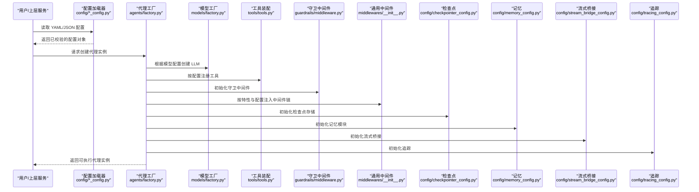
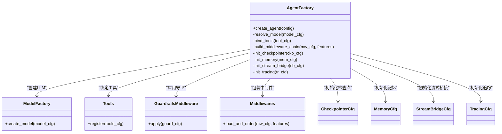
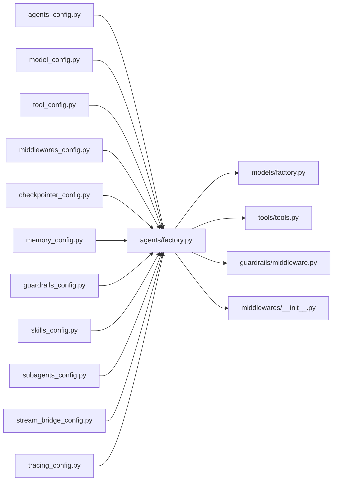

# 代理创建与配置

<cite>
**本文引用的文件**   
- [backend/packages/harness/deerflow/agents/factory.py](file://backend/packages/harness/deerflow/agents/factory.py)
- [backend/packages/harness/deerflow/agents/features.py](file://backend/packages/harness/deerflow/agents/features.py)
- [backend/packages/harness/deerflow/config/agents_config.py](file://backend/packages/harness/deerflow/config/agents_config.py)
- [backend/packages/harness/deerflow/config/model_config.py](file://backend/packages/harness/deerflow/config/model_config.py)
- [backend/packages/harness/deerflow/config/tool_config.py](file://backend/packages/harness/deerflow/config/tool_config.py)
- [backend/packages/harness/deerflow/config/middlewares_config.py](file://backend/packages/harness/deerflow/config/middlewares_config.py)
- [backend/packages/harness/deerflow/config/checkpointer_config.py](file://backend/packages/harness/deerflow/config/checkpointer_config.py)
- [backend/packages/harness/deerflow/config/memory_config.py](file://backend/packages/harness/deerflow/config/memory_config.py)
- [backend/packages/harness/deerflow/config/guardrails_config.py](file://backend/packages/harness/deerflow/config/guardrails_config.py)
- [backend/packages/harness/deerflow/config/skills_config.py](file://backend/packages/harness/deerflow/config/skills_config.py)
- [backend/packages/harness/deerflow/config/subagents_config.py](file://backend/packages/harness/deerflow/config/subagents_config.py)
- [backend/packages/harness/deerflow/config/stream_bridge_config.py](file://backend/packages/harness/deerflow/config/stream_bridge_config.py)
- [backend/packages/harness/deerflow/config/tracing_config.py](file://backend/packages/harness/deerflow/config/tracing_config.py)
- [backend/packages/harness/deerflow/config/app_config.py](file://backend/packages/harness/deerflow/config/app_config.py)
- [backend/packages/harness/deerflow/models/factory.py](file://backend/packages/harness/deerflow/models/factory.py)
- [backend/packages/harness/deerflow/tools/tools.py](file://backend/packages/harness/deerflow/tools/tools.py)
- [backend/packages/harness/deerflow/guardrails/middleware.py](file://backend/packages/harness/deerflow/guardrails/middleware.py)
- [backend/packages/harness/deerflow/middlewares/__init__.py](file://backend/packages/harness/deerflow/middlewares/__init__.py)
- [config.example.yaml](file://config.example.yaml)
- [extensions_config.example.json](file://extensions_config.example.json)
</cite>

## 目录
1. [简介](#简介)
2. [项目结构](#项目结构)
3. [核心组件](#核心组件)
4. [架构总览](#架构总览)
5. [详细组件分析](#详细组件分析)
6. [依赖关系分析](#依赖关系分析)
7. [性能考量](#性能考量)
8. [故障排查指南](#故障排查指南)
9. [结论](#结论)
10. [附录](#附录)

## 简介
本文件聚焦于“代理创建与配置”的完整说明，覆盖以下主题：
- 代理定义文件的结构与语法（YAML/JSON）
- 代理工厂（Factory）的动态实例化机制
- 代理配置参数详解（模型选择、工具绑定、中间件、检查点、记忆、技能、子代理等）
- 特性（Features）系统的启用与禁用方式
- 从基础到高级的完整配置示例
- 配置校验与错误处理机制

## 项目结构
与代理创建和配置相关的核心代码位于后端 harness 包中，主要涉及：
- 代理工厂与特性系统：agents 目录
- 配置模型与加载：config 目录
- 模型工厂与提供者：models 目录
- 工具注册与装配：tools 目录
- 守卫中间件：guardrails 目录
- 通用中间件集合：middlewares 目录
- 根级示例配置文件：config.example.yaml、extensions_config.example.json

```mermaid
graph TB
subgraph "代理核心"
F["agents/factory.py"]
FEAT["agents/features.py"]
end
subgraph "配置层"
AC["config/agents_config.py"]
MC["config/model_config.py"]
TC["config/tool_config.py"]
MW["config/middlewares_config.py"]
CKP["config/checkpointer_config.py"]
MEM["config/memory_config.py"]
GR["config/guardrails_config.py"]
SK["config/skills_config.py"]
SA["config/subagents_config.py"]
SB["config/stream_bridge_config.py"]
TR["config/tracing_config.py"]
APP["config/app_config.py"]
end
subgraph "运行时能力"
MF["models/factory.py"]
TOOLS["tools/tools.py"]
GMW["guardrails/middleware.py"]
MWS["middlewares/__init__.py"]
end
subgraph "示例配置"
YML["config.example.yaml"]
EXT["extensions_config.example.json"]
end
F --> AC
F --> MC
F --> TC
F --> MW
F --> CKP
F --> MEM
F --> GR
F --> SK
F --> SA
F --> SB
F --> TR
F --> APP
F --> MF
F --> TOOLS
F --> GMW
F --> MWS
YML --> AC
EXT --> AC
```

图表来源
- [backend/packages/harness/deerflow/agents/factory.py](file://backend/packages/harness/deerflow/agents/factory.py)
- [backend/packages/harness/deerflow/agents/features.py](file://backend/packages/harness/deerflow/agents/features.py)
- [backend/packages/harness/deerflow/config/agents_config.py](file://backend/packages/harness/deerflow/config/agents_config.py)
- [backend/packages/harness/deerflow/config/model_config.py](file://backend/packages/harness/deerflow/config/model_config.py)
- [backend/packages/harness/deerflow/config/tool_config.py](file://backend/packages/harness/deerflow/config/tool_config.py)
- [backend/packages/harness/deerflow/config/middlewares_config.py](file://backend/packages/harness/deerflow/config/middlewares_config.py)
- [backend/packages/harness/deerflow/config/checkpointer_config.py](file://backend/packages/harness/deerflow/config/checkpointer_config.py)
- [backend/packages/harness/deerflow/config/memory_config.py](file://backend/packages/harness/deerflow/config/memory_config.py)
- [backend/packages/harness/deerflow/config/guardrails_config.py](file://backend/packages/harness/deerflow/config/guardrails_config.py)
- [backend/packages/harness/deerflow/config/skills_config.py](file://backend/packages/harness/deerflow/config/skills_config.py)
- [backend/packages/harness/deerflow/config/subagents_config.py](file://backend/packages/harness/deerflow/config/subagents_config.py)
- [backend/packages/harness/deerflow/config/stream_bridge_config.py](file://backend/packages/harness/deerflow/config/stream_bridge_config.py)
- [backend/packages/harness/deerflow/config/tracing_config.py](file://backend/packages/harness/deerflow/config/tracing_config.py)
- [backend/packages/harness/deerflow/config/app_config.py](file://backend/packages/harness/deerflow/config/app_config.py)
- [backend/packages/harness/deerflow/models/factory.py](file://backend/packages/harness/deerflow/models/factory.py)
- [backend/packages/harness/deerflow/tools/tools.py](file://backend/packages/harness/deerflow/tools/tools.py)
- [backend/packages/harness/deerflow/guardrails/middleware.py](file://backend/packages/harness/deerflow/guardrails/middleware.py)
- [backend/packages/harness/deerflow/middlewares/__init__.py](file://backend/packages/harness/deerflow/middlewares/__init__.py)
- [config.example.yaml](file://config.example.yaml)
- [extensions_config.example.json](file://extensions_config.example.json)

章节来源
- [backend/packages/harness/deerflow/agents/factory.py](file://backend/packages/harness/deerflow/agents/factory.py)
- [backend/packages/harness/deerflow/agents/features.py](file://backend/packages/harness/deerflow/agents/features.py)
- [backend/packages/harness/deerflow/config/agents_config.py](file://backend/packages/harness/deerflow/config/agents_config.py)
- [backend/packages/harness/deerflow/config/model_config.py](file://backend/packages/harness/deerflow/config/model_config.py)
- [backend/packages/harness/deerflow/config/tool_config.py](file://backend/packages/harness/deerflow/config/tool_config.py)
- [backend/packages/harness/deerflow/config/middlewares_config.py](file://backend/packages/harness/deerflow/config/middlewares_config.py)
- [backend/packages/harness/deerflow/config/checkpointer_config.py](file://backend/packages/harness/deerflow/config/checkpointer_config.py)
- [backend/packages/harness/deerflow/config/memory_config.py](file://backend/packages/harness/deerflow/config/memory_config.py)
- [backend/packages/harness/deerflow/config/guardrails_config.py](file://backend/packages/harness/deerflow/config/guardrails_config.py)
- [backend/packages/harness/deerflow/config/skills_config.py](file://backend/packages/harness/deerflow/config/skills_config.py)
- [backend/packages/harness/deerflow/config/subagents_config.py](file://backend/packages/harness/deerflow/config/subagents_config.py)
- [backend/packages/harness/deerflow/config/stream_bridge_config.py](file://backend/packages/harness/deerflow/config/stream_bridge_config.py)
- [backend/packages/harness/deerflow/config/tracing_config.py](file://backend/packages/harness/deerflow/config/tracing_config.py)
- [backend/packages/harness/deerflow/config/app_config.py](file://backend/packages/harness/deerflow/config/app_config.py)
- [backend/packages/harness/deerflow/models/factory.py](file://backend/packages/harness/deerflow/models/factory.py)
- [backend/packages/harness/deerflow/tools/tools.py](file://backend/packages/harness/deerflow/tools/tools.py)
- [backend/packages/harness/deerflow/guardrails/middleware.py](file://backend/packages/harness/deerflow/guardrails/middleware.py)
- [backend/packages/harness/deerflow/middlewares/__init__.py](file://backend/packages/harness/deerflow/middlewares/__init__.py)
- [config.example.yaml](file://config.example.yaml)
- [extensions_config.example.json](file://extensions_config.example.json)

## 核心组件
- 代理工厂（Agent Factory）
  - 负责解析代理定义、合并默认配置、动态创建模型、装配工具、注入中间件与守卫、初始化记忆与检查点、构建流式桥接与追踪等。
- 特性系统（Features）
  - 提供开关式的功能控制，如是否启用某些中间件、工具集或行为策略。
- 配置模型（Config Models）
  - 以 Pydantic 风格的数据类描述各子系统配置，并提供默认值与校验逻辑。
- 模型工厂（Model Factory）
  - 根据配置动态选择并实例化不同 LLM 提供者。
- 工具装配（Tools）
  - 将内置与扩展工具按配置注册到代理上下文。
- 守卫与中间件（Guardrails & Middlewares）
  - 在调用前后执行安全、审计、限流、日志等横切逻辑。

章节来源
- [backend/packages/harness/deerflow/agents/factory.py](file://backend/packages/harness/deerflow/agents/factory.py)
- [backend/packages/harness/deerflow/agents/features.py](file://backend/packages/harness/deerflow/agents/features.py)
- [backend/packages/harness/deerflow/config/agents_config.py](file://backend/packages/harness/deerflow/config/agents_config.py)
- [backend/packages/harness/deerflow/models/factory.py](file://backend/packages/harness/deerflow/models/factory.py)
- [backend/packages/harness/deerflow/tools/tools.py](file://backend/packages/harness/deerflow/tools/tools.py)
- [backend/packages/harness/deerflow/guardrails/middleware.py](file://backend/packages/harness/deerflow/guardrails/middleware.py)
- [backend/packages/harness/deerflow/middlewares/__init__.py](file://backend/packages/harness/deerflow/middlewares/__init__.py)

## 架构总览
下图展示了从配置到运行时的关键路径：配置加载 → 配置校验 → 工厂组装 → 模型/工具/中间件/记忆/检查点/流式桥接/追踪 → 可执行代理实例。

图表来源
- [backend/packages/harness/deerflow/agents/factory.py](file://backend/packages/harness/deerflow/agents/factory.py)
- [backend/packages/harness/deerflow/config/agents_config.py](file://backend/packages/harness/deerflow/config/agents_config.py)
- [backend/packages/harness/deerflow/models/factory.py](file://backend/packages/harness/deerflow/models/factory.py)
- [backend/packages/harness/deerflow/tools/tools.py](file://backend/packages/harness/deerflow/tools/tools.py)
- [backend/packages/harness/deerflow/guardrails/middleware.py](file://backend/packages/harness/deerflow/guardrails/middleware.py)
- [backend/packages/harness/deerflow/middlewares/__init__.py](file://backend/packages/harness/deerflow/middlewares/__init__.py)
- [backend/packages/harness/deerflow/config/checkpointer_config.py](file://backend/packages/harness/deerflow/config/checkpointer_config.py)
- [backend/packages/harness/deerflow/config/memory_config.py](file://backend/packages/harness/deerflow/config/memory_config.py)
- [backend/packages/harness/deerflow/config/stream_bridge_config.py](file://backend/packages/harness/deerflow/config/stream_bridge_config.py)
- [backend/packages/harness/deerflow/config/tracing_config.py](file://backend/packages/harness/deerflow/config/tracing_config.py)

## 详细组件分析

### 代理工厂（Factory）实现原理
- 输入：已校验的代理配置对象（包含模型、工具、中间件、记忆、检查点、流式桥接、追踪、特性等）。
- 处理流程：
  - 解析并合并默认配置与用户配置。
  - 通过模型工厂创建具体 LLM 实例。
  - 依据工具配置完成工具注册与依赖注入。
  - 根据特性与配置顺序组装中间件链与守卫。
  - 初始化记忆与检查点，建立持久化与断点续跑能力。
  - 可选启用流式桥接与追踪。
- 输出：一个具备完整能力的代理实例。

图表来源
- [backend/packages/harness/deerflow/agents/factory.py](file://backend/packages/harness/deerflow/agents/factory.py)
- [backend/packages/harness/deerflow/models/factory.py](file://backend/packages/harness/deerflow/models/factory.py)
- [backend/packages/harness/deerflow/tools/tools.py](file://backend/packages/harness/deerflow/tools/tools.py)
- [backend/packages/harness/deerflow/guardrails/middleware.py](file://backend/packages/harness/deerflow/guardrails/middleware.py)
- [backend/packages/harness/deerflow/middlewares/__init__.py](file://backend/packages/harness/deerflow/middlewares/__init__.py)
- [backend/packages/harness/deerflow/config/checkpointer_config.py](file://backend/packages/harness/deerflow/config/checkpointer_config.py)
- [backend/packages/harness/deerflow/config/memory_config.py](file://backend/packages/harness/deerflow/config/memory_config.py)
- [backend/packages/harness/deerflow/config/stream_bridge_config.py](file://backend/packages/harness/deerflow/config/stream_bridge_config.py)
- [backend/packages/harness/deerflow/config/tracing_config.py](file://backend/packages/harness/deerflow/config/tracing_config.py)

章节来源
- [backend/packages/harness/deerflow/agents/factory.py](file://backend/packages/harness/deerflow/agents/factory.py)

### 特性（Features）系统
- 作用：以布尔开关或枚举形式控制特定功能的启用/禁用，例如是否启用某类中间件、是否开启某种工具集、是否启用流式输出等。
- 使用方式：
  - 在代理配置的 features 字段中声明所需特性。
  - 工厂在组装中间件与工具时读取该字段进行条件装配。
- 建议：
  - 保持最小可用原则，按需启用以减少开销与副作用。
  - 对生产环境进行灰度开启与监控。

章节来源
- [backend/packages/harness/deerflow/agents/features.py](file://backend/packages/harness/deerflow/agents/features.py)
- [backend/packages/harness/deerflow/agents/factory.py](file://backend/packages/harness/deerflow/agents/factory.py)

### 配置参数详解
以下为常用配置项的含义与用法说明（对应各配置数据类）：
- 模型选择（model_config）
  - 用于指定 LLM 提供商、模型名称、鉴权信息、并发与重试策略等。
- 工具绑定（tool_config）
  - 声明要启用的工具列表及其参数；支持内置与扩展工具。
- 中间件配置（middlewares_config）
  - 定义中间件清单、执行顺序、参数；可与特性联动。
- 检查点（checkpointer_config）
  - 配置持久化存储类型与连接参数，支持断点续跑与状态回滚。
- 记忆（memory_config）
  - 配置短期/长期记忆、检索策略、容量上限等。
- 守卫（guardrails_config）
  - 配置内容安全、输入输出过滤、敏感词检测等规则。
- 技能（skills_config）
  - 管理技能包的加载、版本与权限控制。
- 子代理（subagents_config）
  - 定义子代理模板、路由策略与资源配额。
- 流式桥接（stream_bridge_config）
  - 配置 SSE/WS 等流式通道参数。
- 追踪（tracing_config）
  - 配置链路追踪后端、采样率与隐私脱敏策略。
- 应用级（app_config）
  - 全局开关、日志级别、超时、端口等。

章节来源
- [backend/packages/harness/deerflow/config/model_config.py](file://backend/packages/harness/deerflow/config/model_config.py)
- [backend/packages/harness/deerflow/config/tool_config.py](file://backend/packages/harness/deerflow/config/tool_config.py)
- [backend/packages/harness/deerflow/config/middlewares_config.py](file://backend/packages/harness/deerflow/config/middlewares_config.py)
- [backend/packages/harness/deerflow/config/checkpointer_config.py](file://backend/packages/harness/deerflow/config/checkpointer_config.py)
- [backend/packages/harness/deerflow/config/memory_config.py](file://backend/packages/harness/deerflow/config/memory_config.py)
- [backend/packages/harness/deerflow/config/guardrails_config.py](file://backend/packages/harness/deerflow/config/guardrails_config.py)
- [backend/packages/harness/deerflow/config/skills_config.py](file://backend/packages/harness/deerflow/config/skills_config.py)
- [backend/packages/harness/deerflow/config/subagents_config.py](file://backend/packages/harness/deerflow/config/subagents_config.py)
- [backend/packages/harness/deerflow/config/stream_bridge_config.py](file://backend/packages/harness/deerflow/config/stream_bridge_config.py)
- [backend/packages/harness/deerflow/config/tracing_config.py](file://backend/packages/harness/deerflow/config/tracing_config.py)
- [backend/packages/harness/deerflow/config/app_config.py](file://backend/packages/harness/deerflow/config/app_config.py)

### 代理定义文件格式与语法
- 支持的格式
  - YAML：适合人类阅读与编辑，推荐作为主配置。
  - JSON：便于程序生成与自动化流水线集成。
- 基本结构
  - 顶层包含代理元信息、模型、工具、中间件、记忆、检查点、流式桥接、追踪、特性等节点。
  - 各节点遵循对应配置数据类的字段约束。
- 示例位置
  - YAML 示例：[config.example.yaml](file://config.example.yaml)
  - 扩展配置示例（JSON）：[extensions_config.example.json](file://extensions_config.example.json)

章节来源
- [config.example.yaml](file://config.example.yaml)
- [extensions_config.example.json](file://extensions_config.example.json)

### 配置验证与错误处理
- 验证机制
  - 基于配置数据类的强类型校验，缺失必填字段、类型不匹配、非法取值将被拒绝。
  - 默认值填充：未显式设置的字段采用安全默认值。
- 常见错误
  - 模型鉴权失败、工具不可用、中间件加载失败、检查点连接异常、记忆存储不可写等。
- 处理策略
  - 启动阶段即进行全量校验，尽早暴露问题。
  - 运行时捕获可降级错误，记录日志并返回友好提示。
  - 针对关键路径（模型、检查点、记忆）提供快速失败与重试策略。

章节来源
- [backend/packages/harness/deerflow/config/agents_config.py](file://backend/packages/harness/deerflow/config/agents_config.py)
- [backend/packages/harness/deerflow/config/model_config.py](file://backend/packages/harness/deerflow/config/model_config.py)
- [backend/packages/harness/deerflow/config/checkpointer_config.py](file://backend/packages/harness/deerflow/config/checkpointer_config.py)
- [backend/packages/harness/deerflow/config/memory_config.py](file://backend/packages/harness/deerflow/config/memory_config.py)

### 完整配置示例（从基础到高级）
- 基础配置
  - 仅设置必要模型与最少工具，关闭非必需特性。
  - 参考：[config.example.yaml](file://config.example.yaml)
- 中级配置
  - 增加中间件链、启用记忆与检查点、配置流式桥接与追踪。
  - 参考：[config.example.yaml](file://config.example.yaml)
- 高级定制
  - 精细控制子代理、技能包、守卫规则、工具白名单与参数、追踪采样与脱敏。
  - 参考：[extensions_config.example.json](file://extensions_config.example.json)

章节来源
- [config.example.yaml](file://config.example.yaml)
- [extensions_config.example.json](file://extensions_config.example.json)

## 依赖关系分析
- 耦合与内聚
  - 代理工厂集中编排，内聚度高；各配置模块职责清晰，低耦合。
- 外部依赖
  - 模型提供者、工具库、检查点存储、记忆后端、流式通道、追踪后端均为可插拔依赖。
- 循环依赖
  - 通过配置数据类与工厂解耦，避免直接循环导入。

图表来源
- [backend/packages/harness/deerflow/config/agents_config.py](file://backend/packages/harness/deerflow/config/agents_config.py)
- [backend/packages/harness/deerflow/agents/factory.py](file://backend/packages/harness/deerflow/agents/factory.py)
- [backend/packages/harness/deerflow/config/model_config.py](file://backend/packages/harness/deerflow/config/model_config.py)
- [backend/packages/harness/deerflow/config/tool_config.py](file://backend/packages/harness/deerflow/config/tool_config.py)
- [backend/packages/harness/deerflow/config/middlewares_config.py](file://backend/packages/harness/deerflow/config/middlewares_config.py)
- [backend/packages/harness/deerflow/config/checkpointer_config.py](file://backend/packages/harness/deerflow/config/checkpointer_config.py)
- [backend/packages/harness/deerflow/config/memory_config.py](file://backend/packages/harness/deerflow/config/memory_config.py)
- [backend/packages/harness/deerflow/config/guardrails_config.py](file://backend/packages/harness/deerflow/config/guardrails_config.py)
- [backend/packages/harness/deerflow/config/skills_config.py](file://backend/packages/harness/deerflow/config/skills_config.py)
- [backend/packages/harness/deerflow/config/subagents_config.py](file://backend/packages/harness/deerflow/config/subagents_config.py)
- [backend/packages/harness/deerflow/config/stream_bridge_config.py](file://backend/packages/harness/deerflow/config/stream_bridge_config.py)
- [backend/packages/harness/deerflow/config/tracing_config.py](file://backend/packages/harness/deerflow/config/tracing_config.py)
- [backend/packages/harness/deerflow/models/factory.py](file://backend/packages/harness/deerflow/models/factory.py)
- [backend/packages/harness/deerflow/tools/tools.py](file://backend/packages/harness/deerflow/tools/tools.py)
- [backend/packages/harness/deerflow/guardrails/middleware.py](file://backend/packages/harness/deerflow/guardrails/middleware.py)
- [backend/packages/harness/deerflow/middlewares/__init__.py](file://backend/packages/harness/deerflow/middlewares/__init__.py)

章节来源
- [backend/packages/harness/deerflow/agents/factory.py](file://backend/packages/harness/deerflow/agents/factory.py)
- [backend/packages/harness/deerflow/config/agents_config.py](file://backend/packages/harness/deerflow/config/agents_config.py)

## 性能考量
- 模型侧
  - 合理设置并发、超时与重试；优先选择延迟更低的模型端点。
- 工具侧
  - 减少不必要的工具调用；对耗时工具启用缓存与去重。
- 中间件侧
  - 精简中间件数量与复杂度；避免在热路径中进行重型计算。
- 记忆与检查点
  - 控制记忆窗口大小与写入频率；检查点采用增量更新策略。
- 流式与追踪
  - 仅在需要时启用流式桥接；追踪采样率在生产环境适度降低。

## 故障排查指南
- 常见问题定位
  - 模型鉴权失败：检查模型配置中的密钥与端点。
  - 工具不可用：确认工具名与参数正确，依赖已安装。
  - 中间件加载失败：核对中间件清单与特性开关。
  - 检查点/记忆异常：验证存储连接与权限。
  - 流式/追踪异常：检查网络连通性与后端服务可用性。
- 建议步骤
  - 先最小化配置复现问题，逐步添加配置项定位。
  - 开启调试日志，关注关键路径的错误堆栈。
  - 使用示例配置作为基线，对比差异。

章节来源
- [backend/packages/harness/deerflow/config/agents_config.py](file://backend/packages/harness/deerflow/config/agents_config.py)
- [backend/packages/harness/deerflow/config/model_config.py](file://backend/packages/harness/deerflow/config/model_config.py)
- [backend/packages/harness/deerflow/config/checkpointer_config.py](file://backend/packages/harness/deerflow/config/checkpointer_config.py)
- [backend/packages/harness/deerflow/config/memory_config.py](file://backend/packages/harness/deerflow/config/memory_config.py)

## 结论
通过统一的配置模型与代理工厂，系统实现了高内聚、低耦合的代理创建与装配流程。配合特性系统与完善的校验机制，可在保证稳定性的同时灵活定制代理行为。建议在生产环境中遵循最小可用原则，结合监控与日志持续优化。

## 附录
- 相关文档与示例
  - YAML 示例：[config.example.yaml](file://config.example.yaml)
  - JSON 扩展示例：[extensions_config.example.json](file://extensions_config.example.json)
- 关键源码路径
  - 代理工厂：[backend/packages/harness/deerflow/agents/factory.py](file://backend/packages/harness/deerflow/agents/factory.py)
  - 特性系统：[backend/packages/harness/deerflow/agents/features.py](file://backend/packages/harness/deerflow/agents/features.py)
  - 配置模型：见 config 目录下各 *_config.py 文件
  - 模型工厂：[backend/packages/harness/deerflow/models/factory.py](file://backend/packages/harness/deerflow/models/factory.py)
  - 工具装配：[backend/packages/harness/deerflow/tools/tools.py](file://backend/packages/harness/deerflow/tools/tools.py)
  - 守卫中间件：[backend/packages/harness/deerflow/guardrails/middleware.py](file://backend/packages/harness/deerflow/guardrails/middleware.py)
  - 通用中间件：[backend/packages/harness/deerflow/middlewares/__init__.py](file://backend/packages/harness/deerflow/middlewares/__init__.py)