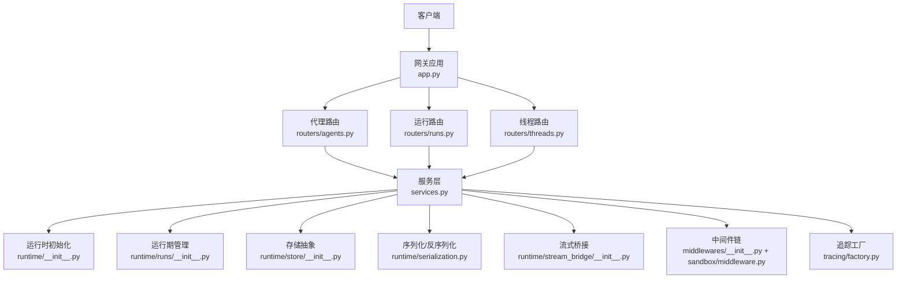
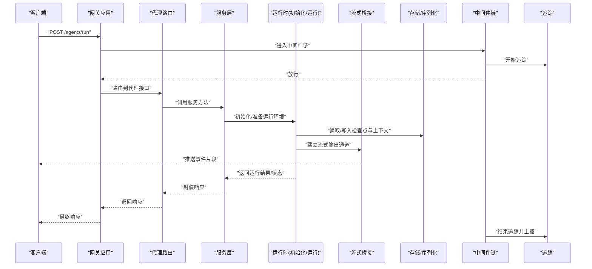
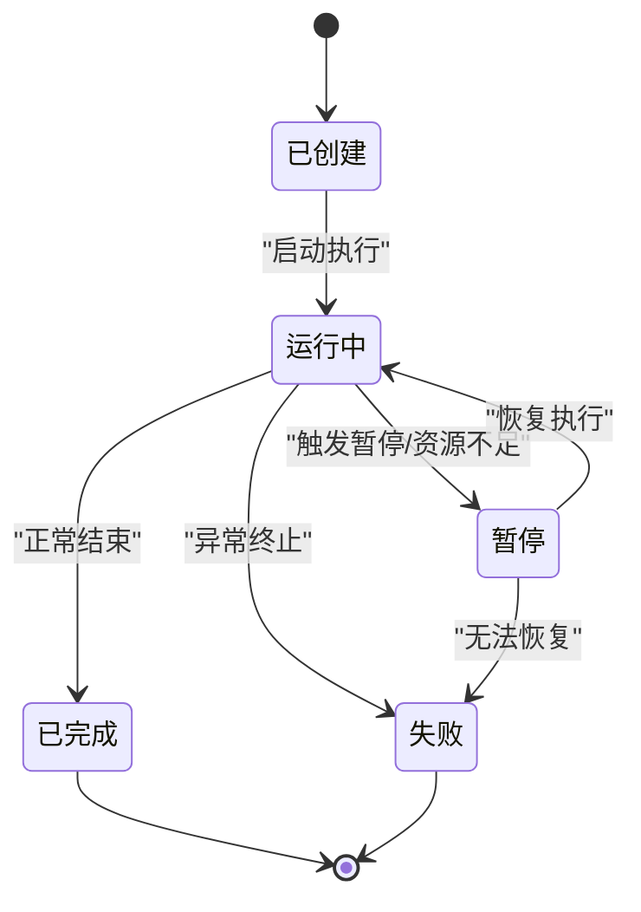
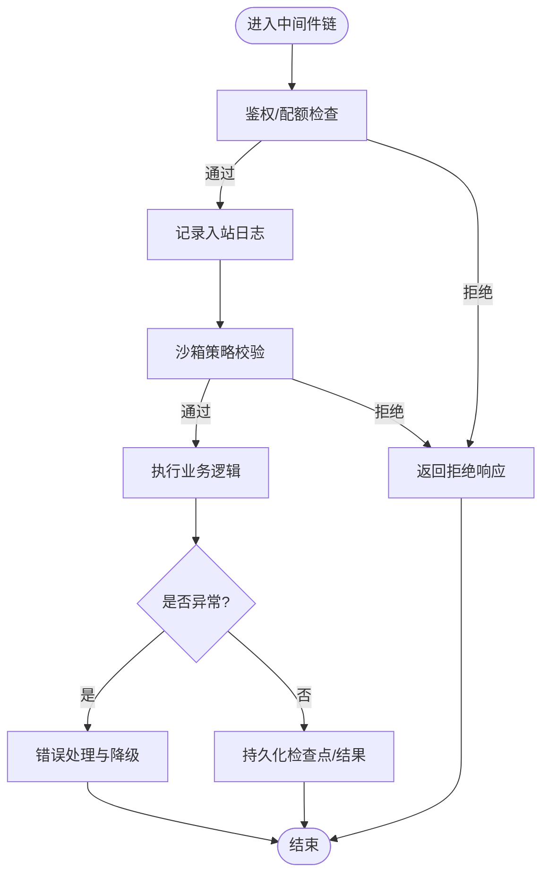
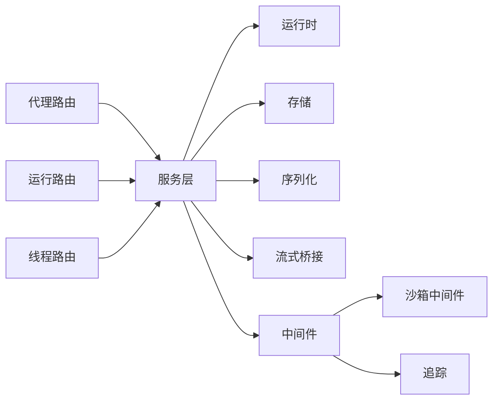

# 代理生命周期

<cite>
**本文引用的文件**   
- [backend/app/gateway/app.py](file://backend/app/gateway/app.py)
- [backend/app/gateway/routers/agents.py](file://backend/app/gateway/routers/agents.py)
- [backend/app/gateway/routers/runs.py](file://backend/app/gateway/routers/runs.py)
- [backend/app/gateway/routers/threads.py](file://backend/app/gateway/routers/threads.py)
- [backend/app/gateway/services.py](file://backend/app/gateway/services.py)
- [backend/packages/harness/deerflow/runtime/__init__.py](file://backend/packages/harness/deerflow/runtime/__init__.py)
- [backend/packages/harness/deerflow/runtime/serialization.py](file://backend/packages/harness/deerflow/runtime/serialization.py)
- [backend/packages/harness/deerflow/runtime/stream_bridge/__init__.py](file://backend/packages/harness/deerflow/runtime/stream_bridge/__init__.py)
- [backend/packages/harness/deerflow/runtime/runs/__init__.py](file://backend/packages/harness/deerflow/runtime/runs/__init__.py)
- [backend/packages/harness/deerflow/runtime/store/__init__.py](file://backend/packages/harness/deerflow/runtime/store/__init__.py)
- [backend/packages/harness/deerflow/agents/thread_state.py](file://backend/packages/harness/deerflow/agents/thread_state.py)
- [backend/packages/harness/deerflow/agents/middlewares/__init__.py](file://backend/packages/harness/deerflow/agents/middlewares/__init__.py)
- [backend/packages/harness/deerflow/sandbox/middleware.py](file://backend/packages/harness/deerflow/sandbox/middleware.py)
- [backend/packages/harness/deerflow/tracing/factory.py](file://backend/packages/harness/deerflow/tracing/factory.py)
- [backend/docs/middleware-execution-flow.md](file://backend/docs/middleware-execution-flow.md)
</cite>

## 目录
1. [简介](#简介)
2. [项目结构](#项目结构)
3. [核心组件](#核心组件)
4. [架构总览](#架构总览)
5. [详细组件分析](#详细组件分析)
6. [依赖关系分析](#依赖关系分析)
7. [性能考量](#性能考量)
8. [故障排查指南](#故障排查指南)
9. [结论](#结论)
10. [附录](#附录)

## 简介
本文件围绕“代理生命周期”展开，系统性阐述从初始化、运行、暂停、恢复到销毁的完整流程；深入解析线程状态(Thread State)管理机制（含状态持久化、并发控制与迁移）；说明运行时环境(Runtime)在资源管理、环境变量注入与安全隔离中的作用；介绍中间件(Middleware)系统在生命周期中的应用（请求拦截、日志记录、错误处理等）；并给出监控与诊断机制（性能指标收集、日志分析与调试支持），以及最佳实践与常见问题解决方案。

## 项目结构
后端采用网关路由与服务编排的分层设计：HTTP 入口通过网关路由将请求分发到服务层，服务层协调运行时子系统（运行期、流式桥接、存储、序列化等）完成代理执行与状态管理。中间件贯穿请求链路，提供横切能力（鉴权、限流、审计、沙箱、追踪等）。

图表来源
- [backend/app/gateway/app.py](file://backend/app/gateway/app.py)
- [backend/app/gateway/routers/agents.py](file://backend/app/gateway/routers/agents.py)
- [backend/app/gateway/routers/runs.py](file://backend/app/gateway/routers/runs.py)
- [backend/app/gateway/routers/threads.py](file://backend/app/gateway/routers/threads.py)
- [backend/app/gateway/services.py](file://backend/app/gateway/services.py)
- [backend/packages/harness/deerflow/runtime/__init__.py](file://backend/packages/harness/deerflow/runtime/__init__.py)
- [backend/packages/harness/deerflow/runtime/runs/__init__.py](file://backend/packages/harness/deerflow/runtime/runs/__init__.py)
- [backend/packages/harness/deerflow/runtime/store/__init__.py](file://backend/packages/harness/deerflow/runtime/store/__init__.py)
- [backend/packages/harness/deerflow/runtime/serialization.py](file://backend/packages/harness/deerflow/runtime/serialization.py)
- [backend/packages/harness/deerflow/runtime/stream_bridge/__init__.py](file://backend/packages/harness/deerflow/runtime/stream_bridge/__init__.py)
- [backend/packages/harness/deerflow/agents/middlewares/__init__.py](file://backend/packages/harness/deerflow/agents/middlewares/__init__.py)
- [backend/packages/harness/deerflow/sandbox/middleware.py](file://backend/packages/harness/deerflow/sandbox/middleware.py)
- [backend/packages/harness/deerflow/tracing/factory.py](file://backend/packages/harness/deerflow/tracing/factory.py)

章节来源
- [backend/app/gateway/app.py](file://backend/app/gateway/app.py)
- [backend/app/gateway/services.py](file://backend/app/gateway/services.py)
- [backend/packages/harness/deerflow/runtime/__init__.py](file://backend/packages/harness/deerflow/runtime/__init__.py)

## 核心组件
- 网关与应用装配：负责注册路由、挂载中间件、启动/停止服务。
- 路由层：按领域划分（代理、运行、线程），将外部请求映射到服务方法。
- 服务层：编排运行时子系统的调用，封装业务语义。
- 运行时子系统：
  - 初始化与配置加载
  - 运行期调度与生命周期控制
  - 存储抽象（检查点、上下文、结果）
  - 序列化/反序列化（跨进程/持久化）
  - 流式桥接（SSE/WebSocket 等）
- 中间件系统：请求拦截、日志、审计、安全、沙箱、追踪等。
- 追踪与可观测性：统一追踪工厂，贯穿请求链路。

章节来源
- [backend/app/gateway/routers/agents.py](file://backend/app/gateway/routers/agents.py)
- [backend/app/gateway/routers/runs.py](file://backend/app/gateway/routers/runs.py)
- [backend/app/gateway/routers/threads.py](file://backend/app/gateway/routers/threads.py)
- [backend/app/gateway/services.py](file://backend/app/gateway/services.py)
- [backend/packages/harness/deerflow/runtime/runs/__init__.py](file://backend/packages/harness/deerflow/runtime/runs/__init__.py)
- [backend/packages/harness/deerflow/runtime/store/__init__.py](file://backend/packages/harness/deerflow/runtime/store/__init__.py)
- [backend/packages/harness/deerflow/runtime/serialization.py](file://backend/packages/harness/deerflow/runtime/serialization.py)
- [backend/packages/harness/deerflow/runtime/stream_bridge/__init__.py](file://backend/packages/harness/deerflow/runtime/stream_bridge/__init__.py)
- [backend/packages/harness/deerflow/agents/middlewares/__init__.py](file://backend/packages/harness/deerflow/agents/middlewares/__init__.py)
- [backend/packages/harness/deerflow/sandbox/middleware.py](file://backend/packages/harness/deerflow/sandbox/middleware.py)
- [backend/packages/harness/deerflow/tracing/factory.py](file://backend/packages/harness/deerflow/tracing/factory.py)

## 架构总览
下图展示一次典型“创建并运行代理”的请求在系统中的流转路径，包括中间件链、服务编排与运行时子系统的协作。

图表来源
- [backend/app/gateway/app.py](file://backend/app/gateway/app.py)
- [backend/app/gateway/routers/agents.py](file://backend/app/gateway/routers/agents.py)
- [backend/app/gateway/services.py](file://backend/app/gateway/services.py)
- [backend/packages/harness/deerflow/runtime/__init__.py](file://backend/packages/harness/deerflow/runtime/__init__.py)
- [backend/packages/harness/deerflow/runtime/stream_bridge/__init__.py](file://backend/packages/harness/deerflow/runtime/stream_bridge/__init__.py)
- [backend/packages/harness/deerflow/runtime/store/__init__.py](file://backend/packages/harness/deerflow/runtime/store/__init__.py)
- [backend/packages/harness/deerflow/runtime/serialization.py](file://backend/packages/harness/deerflow/runtime/serialization.py)
- [backend/packages/harness/deerflow/agents/middlewares/__init__.py](file://backend/packages/harness/deerflow/agents/middlewares/__init__.py)
- [backend/packages/harness/deerflow/tracing/factory.py](file://backend/packages/harness/deerflow/tracing/factory.py)

## 详细组件分析

### 代理生命周期阶段
- 初始化
  - 网关装配中间件与路由，加载配置。
  - 服务层根据请求参数构建运行时上下文，完成模型、工具、沙箱等资源的准备。
  - 运行时进行必要的预热（如连接池、缓存、追踪实例）。
- 运行
  - 路由接收请求，服务层编排中间件链与运行时。
  - 运行时驱动代理执行，期间通过流式桥接向客户端推送增量事件。
  - 关键中间态与结果由存储/序列化模块持久化或传输。
- 暂停
  - 当触发条件满足（如用户主动暂停、超时、资源不足），运行时挂起当前执行上下文。
  - 将必要状态快照落盘，确保可恢复性。
- 恢复
  - 基于检查点重建上下文，恢复中间件链与运行时环境。
  - 继续执行直至完成或再次暂停。
- 销毁
  - 清理资源（连接、临时文件、沙箱容器等）。
  - 关闭流式通道，释放锁与追踪上下文。
  - 归档最终状态与审计日志。

章节来源
- [backend/app/gateway/app.py](file://backend/app/gateway/app.py)
- [backend/app/gateway/routers/agents.py](file://backend/app/gateway/routers/agents.py)
- [backend/app/gateway/services.py](file://backend/app/gateway/services.py)
- [backend/packages/harness/deerflow/runtime/__init__.py](file://backend/packages/harness/deerflow/runtime/__init__.py)
- [backend/packages/harness/deerflow/runtime/runs/__init__.py](file://backend/packages/harness/deerflow/runtime/runs/__init__.py)
- [backend/packages/harness/deerflow/runtime/stream_bridge/__init__.py](file://backend/packages/harness/deerflow/runtime/stream_bridge/__init__.py)
- [backend/packages/harness/deerflow/runtime/store/__init__.py](file://backend/packages/harness/deerflow/runtime/store/__init__.py)
- [backend/packages/harness/deerflow/runtime/serialization.py](file://backend/packages/harness/deerflow/runtime/serialization.py)

### 线程状态(Thread State)管理机制
- 状态定义与迁移
  - 线程状态用于描述代理执行的阶段性（如新建、运行中、暂停、完成、失败）。
  - 状态迁移需保证幂等性与一致性，避免竞态导致的状态回退。
- 并发控制
  - 使用细粒度锁保护同一线程的多写操作，读多写少场景下优先乐观更新+重试。
  - 对长耗时任务引入取消令牌与心跳检测，防止僵尸状态。
- 状态持久化
  - 关键状态变更伴随检查点写入，支持断点续跑。
  - 序列化模块负责对象到可持久化格式的转换与版本兼容。
- 与运行时的耦合
  - 运行时在每次重要步骤后同步状态，并在异常时回滚至最近一致检查点。

图表来源
- [backend/packages/harness/deerflow/agents/thread_state.py](file://backend/packages/harness/deerflow/agents/thread_state.py)
- [backend/packages/harness/deerflow/runtime/runs/__init__.py](file://backend/packages/harness/deerflow/runtime/runs/__init__.py)
- [backend/packages/harness/deerflow/runtime/store/__init__.py](file://backend/packages/harness/deerflow/runtime/store/__init__.py)
- [backend/packages/harness/deerflow/runtime/serialization.py](file://backend/packages/harness/deerflow/runtime/serialization.py)

章节来源
- [backend/packages/harness/deerflow/agents/thread_state.py](file://backend/packages/harness/deerflow/agents/thread_state.py)
- [backend/packages/harness/deerflow/runtime/runs/__init__.py](file://backend/packages/harness/deerflow/runtime/runs/__init__.py)
- [backend/packages/harness/deerflow/runtime/store/__init__.py](file://backend/packages/harness/deerflow/runtime/store/__init__.py)
- [backend/packages/harness/deerflow/runtime/serialization.py](file://backend/packages/harness/deerflow/runtime/serialization.py)

### 运行时环境(Runtime)的作用
- 资源管理
  - 统一分配与回收模型、工具、沙箱等资源，避免泄漏。
  - 为每个代理运行提供隔离的执行上下文。
- 环境变量注入
  - 在运行时注入密钥、端点、特性开关等环境变量，供下游组件按需读取。
- 安全隔离
  - 结合沙箱中间件限制文件系统、网络访问与命令执行范围。
  - 对输入输出进行校验与脱敏，降低注入风险。

章节来源
- [backend/packages/harness/deerflow/runtime/__init__.py](file://backend/packages/harness/deerflow/runtime/__init__.py)
- [backend/packages/harness/deerflow/sandbox/middleware.py](file://backend/packages/harness/deerflow/sandbox/middleware.py)

### 中间件(Middleware)系统在生命周期中的应用
- 请求拦截
  - 鉴权、配额与速率限制在进入核心逻辑前完成。
- 日志记录
  - 结构化日志包含请求ID、线程ID、耗时、状态码等维度。
- 错误处理
  - 捕获并分类异常，转换为标准错误响应，同时保留原始堆栈用于诊断。
- 沙箱与审计
  - 在执行前后记录审计事件，限制危险操作。
- 追踪集成
  - 以追踪工厂为中心，贯穿中间件链与运行时，形成端到端链路视图。

图表来源
- [backend/packages/harness/deerflow/agents/middlewares/__init__.py](file://backend/packages/harness/deerflow/agents/middlewares/__init__.py)
- [backend/packages/harness/deerflow/sandbox/middleware.py](file://backend/packages/harness/deerflow/sandbox/middleware.py)
- [backend/packages/harness/deerflow/tracing/factory.py](file://backend/packages/harness/deerflow/tracing/factory.py)
- [backend/docs/middleware-execution-flow.md](file://backend/docs/middleware-execution-flow.md)

章节来源
- [backend/packages/harness/deerflow/agents/middlewares/__init__.py](file://backend/packages/harness/deerflow/agents/middlewares/__init__.py)
- [backend/packages/harness/deerflow/sandbox/middleware.py](file://backend/packages/harness/deerflow/sandbox/middleware.py)
- [backend/packages/harness/deerflow/tracing/factory.py](file://backend/packages/harness/deerflow/tracing/factory.py)
- [backend/docs/middleware-execution-flow.md](file://backend/docs/middleware-execution-flow.md)

### 监控与诊断机制
- 性能指标收集
  - 在关键路径埋点（请求耗时、吞吐、错误率、资源占用）。
  - 结合流式桥接统计事件数量与延迟分布。
- 日志分析
  - 统一日志格式，关联请求ID与追踪ID，便于聚合检索。
- 调试支持
  - 开启详细追踪与采样策略，定位慢调用与异常分支。
  - 提供健康检查与就绪探针，辅助编排平台进行滚动升级与自愈。

章节来源
- [backend/packages/harness/deerflow/tracing/factory.py](file://backend/packages/harness/deerflow/tracing/factory.py)
- [backend/packages/harness/deerflow/runtime/stream_bridge/__init__.py](file://backend/packages/harness/deerflow/runtime/stream_bridge/__init__.py)

## 依赖关系分析
- 低耦合高内聚
  - 路由仅做分发，服务层编排运行时，运行时专注执行与状态管理。
- 直接依赖
  - 路由依赖服务层；服务层依赖运行时、存储、序列化、流式桥接与中间件。
- 潜在循环
  - 中间件与运行时之间通过接口解耦，避免直接双向引用。
- 外部依赖
  - 追踪、沙箱、存储后端均为可替换实现，便于扩展与替换。

图表来源
- [backend/app/gateway/routers/agents.py](file://backend/app/gateway/routers/agents.py)
- [backend/app/gateway/routers/runs.py](file://backend/app/gateway/routers/runs.py)
- [backend/app/gateway/routers/threads.py](file://backend/app/gateway/routers/threads.py)
- [backend/app/gateway/services.py](file://backend/app/gateway/services.py)
- [backend/packages/harness/deerflow/runtime/__init__.py](file://backend/packages/harness/deerflow/runtime/__init__.py)
- [backend/packages/harness/deerflow/runtime/store/__init__.py](file://backend/packages/harness/deerflow/runtime/store/__init__.py)
- [backend/packages/harness/deerflow/runtime/serialization.py](file://backend/packages/harness/deerflow/runtime/serialization.py)
- [backend/packages/harness/deerflow/runtime/stream_bridge/__init__.py](file://backend/packages/harness/deerflow/runtime/stream_bridge/__init__.py)
- [backend/packages/harness/deerflow/agents/middlewares/__init__.py](file://backend/packages/harness/deerflow/agents/middlewares/__init__.py)
- [backend/packages/harness/deerflow/sandbox/middleware.py](file://backend/packages/harness/deerflow/sandbox/middleware.py)
- [backend/packages/harness/deerflow/tracing/factory.py](file://backend/packages/harness/deerflow/tracing/factory.py)

章节来源
- [backend/app/gateway/services.py](file://backend/app/gateway/services.py)
- [backend/packages/harness/deerflow/runtime/__init__.py](file://backend/packages/harness/deerflow/runtime/__init__.py)

## 性能考量
- 减少不必要的序列化开销，仅在边界处进行持久化与跨进程传输。
- 合理设置流式事件批大小，平衡实时性与带宽占用。
- 对热点数据引入本地缓存，注意失效策略与一致性。
- 使用连接池与异步I/O提升吞吐，避免阻塞调用。
- 对长任务启用分片与并行度控制，避免单点过载。

[本节为通用指导，不直接分析具体文件]

## 故障排查指南
- 常见症状
  - 代理长时间处于“运行中”无进展：检查心跳与取消令牌、资源配额与沙箱限制。
  - 状态不一致或重复执行：确认检查点写入时机与幂等键。
  - 流式输出中断：检查流式桥接连接与客户端断开重连策略。
- 定位手段
  - 通过追踪ID串联中间件、运行时与存储日志。
  - 查看健康检查与探针状态，确认服务可用性。
  - 对比最近一次成功检查点与失败现场差异。
- 修复建议
  - 增加重试与退避策略，避免瞬时抖动引发雪崩。
  - 完善错误分类与降级路径，保障核心链路可用。
  - 调整日志级别与采样率，兼顾可观测性与成本。

章节来源
- [backend/packages/harness/deerflow/runtime/runs/__init__.py](file://backend/packages/harness/deerflow/runtime/runs/__init__.py)
- [backend/packages/harness/deerflow/runtime/stream_bridge/__init__.py](file://backend/packages/harness/deerflow/runtime/stream_bridge/__init__.py)
- [backend/packages/harness/deerflow/tracing/factory.py](file://backend/packages/harness/deerflow/tracing/factory.py)

## 结论
代理生命周期通过网关—服务—运行时的分层协作，配合中间件链与追踪体系，实现了可观测、可恢复、可扩展的执行环境。线程状态管理与检查点机制保障了运行的可靠性；沙箱与资源隔离提升了安全性；流式桥接增强了交互体验。遵循本文的最佳实践与排障建议，可在复杂生产环境中稳定运行。

[本节为总结性内容，不直接分析具体文件]

## 附录
- 术语
  - 代理：具备特定能力的智能体，可被编排执行任务。
  - 运行时：提供执行上下文、资源与环境支持的子系统。
  - 中间件：横切关注点的可插拔组件。
  - 检查点：用于恢复执行的关键状态快照。
- 参考文档
  - 中间件执行流程说明

章节来源
- [backend/docs/middleware-execution-flow.md](file://backend/docs/middleware-execution-flow.md)