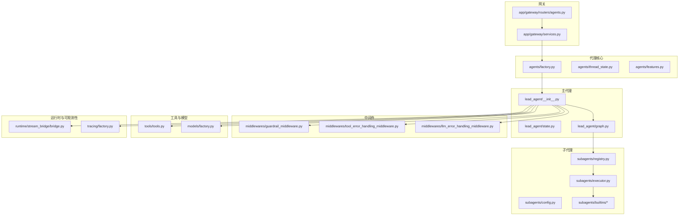
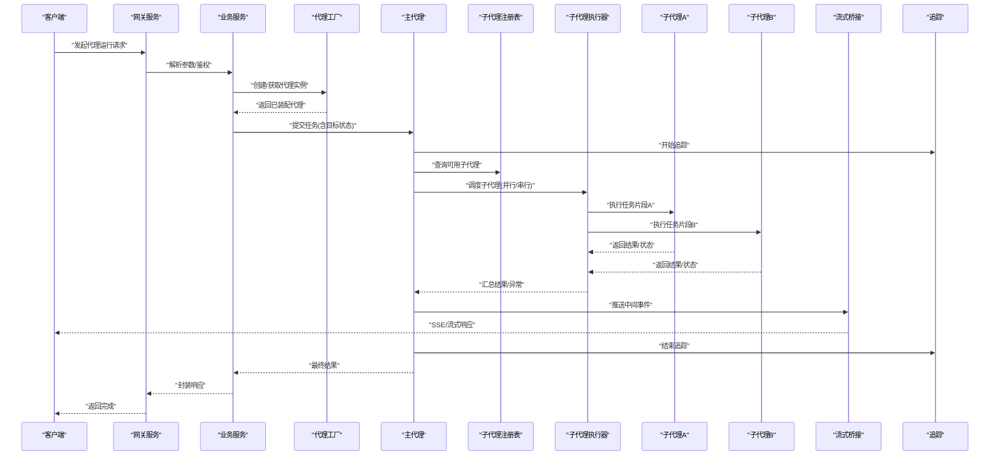
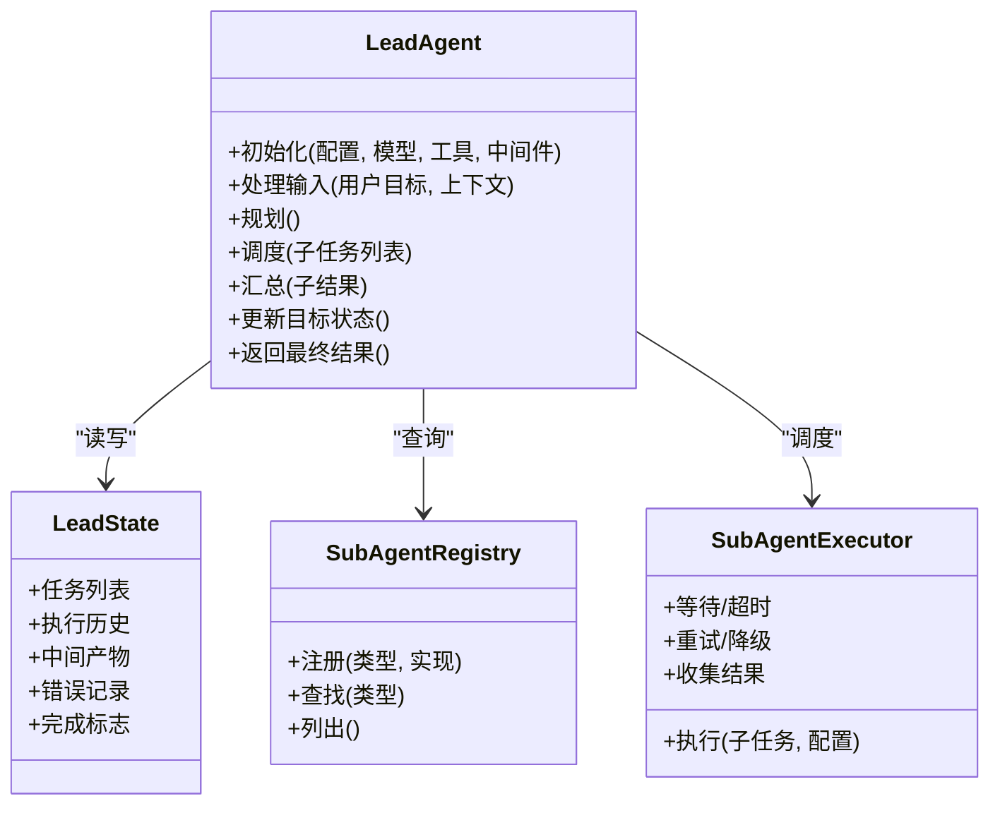
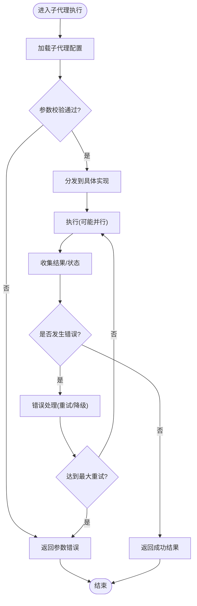
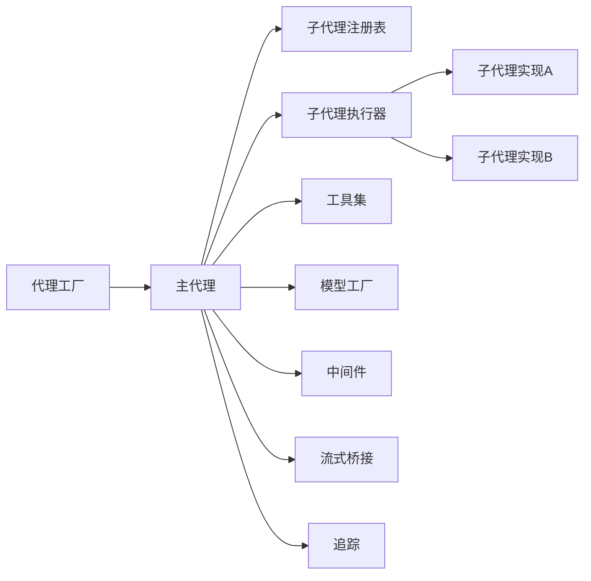

# 代理系统

<cite>
**本文引用的文件**   
- [backend/packages/harness/deerflow/agents/factory.py](file://backend/packages/harness/deerflow/agents/factory.py)
- [backend/packages/harness/deerflow/agents/thread_state.py](file://backend/packages/harness/deerflow/agents/thread_state.py)
- [backend/packages/harness/deerflow/agents/features.py](file://backend/packages/harness/deerflow/agents/features.py)
- [backend/packages/harness/deerflow/agents/lead_agent/__init__.py](file://backend/packages/harness/deerflow/agents/lead_agent/__init__.py)
- [backend/packages/harness/deerflow/agents/lead_agent/state.py](file://backend/packages/harness/deerflow/agents/lead_agent/state.py)
- [backend/packages/harness/deerflow/agents/lead_agent/graph.py](file://backend/packages/harness/deerflow/agents/lead_agent/graph.py)
- [backend/packages/harness/deerflow/subagents/config.py](file://backend/packages/harness/deerflow/subagents/config.py)
- [backend/packages/harness/deerflow/subagents/executor.py](file://backend/packages/harness/deerflow/subagents/executor.py)
- [backend/packages/harness/deerflow/subagents/registry.py](file://backend/packages/harness/deerflow/subagents/registry.py)
- [backend/packages/harness/deerflow/subagents/builtins/code_execution.py](file://backend/packages/harness/deerflow/subagents/builtins/code_execution.py)
- [backend/packages/harness/deerflow/subagents/builtins/web_search.py](file://backend/packages/harness/deerflow/subagents/builtins/web_search.py)
- [backend/packages/harness/deerflow/subagents/builtins/file_operation.py](file://backend/packages/harness/deerflow/subagents/builtins/file_operation.py)
- [backend/packages/harness/deerflow/middlewares/guardrail_middleware.py](file://backend/packages/harness/deerflow/middlewares/guardrail_middleware.py)
- [backend/packages/harness/deerflow/middlewares/tool_error_handling_middleware.py](file://backend/packages/harness/deerflow/middlewares/tool_error_handling_middleware.py)
- [backend/packages/harness/deerflow/middlewares/llm_error_handling_middleware.py](file://backend/packages/harness/deerflow/middlewares/llm_error_handling_middleware.py)
- [backend/packages/harness/deerflow/tools/tools.py](file://backend/packages/harness/deerflow/tools/tools.py)
- [backend/packages/harness/deerflow/models/factory.py](file://backend/packages/harness/deerflow/models/factory.py)
- [backend/packages/harness/deerflow/runtime/stream_bridge/bridge.py](file://backend/packages/harness/deerflow/runtime/stream_bridge/bridge.py)
- [backend/packages/harness/deerflow/tracing/factory.py](file://backend/packages/harness/deerflow/tracing/factory.py)
- [backend/app/gateway/routers/agents.py](file://backend/app/gateway/routers/agents.py)
- [backend/app/gateway/services.py](file://backend/app/gateway/services.py)
- [backend/tests/test_create_deerflow_agent.py](file://backend/tests/test_create_deerflow_agent.py)
- [backend/tests/test_custom_agent.py](file://backend/tests/test_custom_agent.py)
- [backend/tests/test_subagent_executor.py](file://backend/tests/test_subagent_executor.py)
- [backend/tests/test_lead_agent_prompt.py](file://backend/tests/test_lead_agent_prompt.py)
- [backend/tests/test_lead_agent_skills.py](file://backend/tests/test_lead_agent_skills.py)
- [backend/tests/test_guardrail_middleware.py](file://backend/tests/test_guardrail_middleware.py)
- [backend/tests/test_tool_error_handling_middleware.py](file://backend/tests/test_tool_error_handling_middleware.py)
- [backend/tests/test_llm_error_handling_middleware.py](file://backend/tests/test_llm_error_handling_middleware.py)
</cite>

## 目录
1. [简介](#简介)
2. [项目结构](#项目结构)
3. [核心组件](#核心组件)
4. [架构总览](#架构总览)
5. [详细组件分析](#详细组件分析)
6. [依赖关系分析](#依赖关系分析)
7. [性能考量](#性能考量)
8. [故障排查指南](#故障排查指南)
9. [结论](#结论)
10. [附录](#附录)

## 简介
本文件面向DeerFlow多代理系统的开发者与使用者，系统性阐述代理的创建与配置、主代理(Lead Agent)的职责与工作流、子代理(SubAgent)的执行机制、代理工厂(Facotry)的动态创建与管理、目标状态管理(Goal State)，并提供完整的自定义代理开发示例与调试监控最佳实践。文档以代码级事实为依据，辅以可视化图示，帮助读者快速理解并高效扩展DeerFlow代理能力。

## 项目结构
DeerFlow后端采用分层与模块化组织方式：
- agents：代理核心（工厂、线程状态、特性开关）
- lead_agent：主代理图与状态定义
- subagents：子代理注册表、执行器与内置实现
- middlewares：中间件（安全护栏、错误处理等）
- tools：工具集
- models：模型工厂与提供者适配
- runtime：运行时（流式桥接、序列化等）
- tracing：可观测性（追踪）
- gateway：HTTP网关路由与服务编排
- tests：单元测试与集成测试

图表来源
- [backend/packages/harness/deerflow/agents/factory.py](file://backend/packages/harness/deerflow/agents/factory.py)
- [backend/packages/harness/deerflow/agents/thread_state.py](file://backend/packages/harness/deerflow/agents/thread_state.py)
- [backend/packages/harness/deerflow/agents/features.py](file://backend/packages/harness/deerflow/agents/features.py)
- [backend/packages/harness/deerflow/agents/lead_agent/__init__.py](file://backend/packages/harness/deerflow/agents/lead_agent/__init__.py)
- [backend/packages/harness/deerflow/agents/lead_agent/state.py](file://backend/packages/harness/deerflow/agents/lead_agent/state.py)
- [backend/packages/harness/deerflow/agents/lead_agent/graph.py](file://backend/packages/harness/deerflow/agents/lead_agent/graph.py)
- [backend/packages/harness/deerflow/subagents/registry.py](file://backend/packages/harness/deerflow/subagents/registry.py)
- [backend/packages/harness/deerflow/subagents/executor.py](file://backend/packages/harness/deerflow/subagents/executor.py)
- [backend/packages/harness/deerflow/subagents/config.py](file://backend/packages/harness/deerflow/subagents/config.py)
- [backend/packages/harness/deerflow/subagents/builtins/code_execution.py](file://backend/packages/harness/deerflow/subagents/builtins/code_execution.py)
- [backend/packages/harness/deerflow/subagents/builtins/web_search.py](file://backend/packages/harness/deerflow/subagents/builtins/web_search.py)
- [backend/packages/harness/deerflow/subagents/builtins/file_operation.py](file://backend/packages/harness/deerflow/subagents/builtins/file_operation.py)
- [backend/packages/harness/deerflow/middlewares/guardrail_middleware.py](file://backend/packages/harness/deerflow/middlewares/guardrail_middleware.py)
- [backend/packages/harness/deerflow/middlewares/tool_error_handling_middleware.py](file://backend/packages/harness/deerflow/middlewares/tool_error_handling_middleware.py)
- [backend/packages/harness/deerflow/middlewares/llm_error_handling_middleware.py](file://backend/packages/harness/deerflow/middlewares/llm_error_handling_middleware.py)
- [backend/packages/harness/deerflow/tools/tools.py](file://backend/packages/harness/deerflow/tools/tools.py)
- [backend/packages/harness/deerflow/models/factory.py](file://backend/packages/harness/deerflow/models/factory.py)
- [backend/packages/harness/deerflow/runtime/stream_bridge/bridge.py](file://backend/packages/harness/deerflow/runtime/stream_bridge/bridge.py)
- [backend/packages/harness/deerflow/tracing/factory.py](file://backend/packages/harness/deerflow/tracing/factory.py)
- [backend/app/gateway/routers/agents.py](file://backend/app/gateway/routers/agents.py)
- [backend/app/gateway/services.py](file://backend/app/gateway/services.py)

章节来源
- [backend/packages/harness/deerflow/agents/factory.py](file://backend/packages/harness/deerflow/agents/factory.py)
- [backend/packages/harness/deerflow/agents/thread_state.py](file://backend/packages/harness/deerflow/agents/thread_state.py)
- [backend/packages/harness/deerflow/agents/features.py](file://backend/packages/harness/deerflow/agents/features.py)
- [backend/packages/harness/deerflow/agents/lead_agent/__init__.py](file://backend/packages/harness/deerflow/agents/lead_agent/__init__.py)
- [backend/packages/harness/deerflow/agents/lead_agent/state.py](file://backend/packages/harness/deerflow/agents/lead_agent/state.py)
- [backend/packages/harness/deerflow/agents/lead_agent/graph.py](file://backend/packages/harness/deerflow/agents/lead_agent/graph.py)
- [backend/packages/harness/deerflow/subagents/registry.py](file://backend/packages/harness/deerflow/subagents/registry.py)
- [backend/packages/harness/deerflow/subagents/executor.py](file://backend/packages/harness/deerflow/subagents/executor.py)
- [backend/packages/harness/deerflow/subagents/config.py](file://backend/packages/harness/deerflow/subagents/config.py)
- [backend/packages/harness/deerflow/subagents/builtins/code_execution.py](file://backend/packages/harness/deerflow/subagents/builtins/code_execution.py)
- [backend/packages/harness/deerflow/subagents/builtins/web_search.py](file://backend/packages/harness/deerflow/subagents/builtins/web_search.py)
- [backend/packages/harness/deerflow/subagents/builtins/file_operation.py](file://backend/packages/harness/deerflow/subagents/builtins/file_operation.py)
- [backend/packages/harness/deerflow/middlewares/guardrail_middleware.py](file://backend/packages/harness/deerflow/middlewares/guardrail_middleware.py)
- [backend/packages/harness/deerflow/middlewares/tool_error_handling_middleware.py](file://backend/packages/harness/deerflow/middlewares/tool_error_handling_middleware.py)
- [backend/packages/harness/deerflow/middlewares/llm_error_handling_middleware.py](file://backend/packages/harness/deerflow/middlewares/llm_error_handling_middleware.py)
- [backend/packages/harness/deerflow/tools/tools.py](file://backend/packages/harness/deerflow/tools/tools.py)
- [backend/packages/harness/deerflow/models/factory.py](file://backend/packages/harness/deerflow/models/factory.py)
- [backend/packages/harness/deerflow/runtime/stream_bridge/bridge.py](file://backend/packages/harness/deerflow/runtime/stream_bridge/bridge.py)
- [backend/packages/harness/deerflow/tracing/factory.py](file://backend/packages/harness/deerflow/tracing/factory.py)
- [backend/app/gateway/routers/agents.py](file://backend/app/gateway/routers/agents.py)
- [backend/app/gateway/services.py](file://backend/app/gateway/services.py)

## 核心组件
- 代理工厂(Facotry)：负责根据配置动态创建不同类型的代理实例，统一装配模型、工具、中间件与运行期能力。
- 线程状态(Thread State)：维护会话上下文、任务队列、结果聚合与进度信息，贯穿整个执行生命周期。
- 特性开关(Features)：集中管理可选能力的启用/禁用，如子代理并行度、安全护栏、流式输出等。
- 主代理(Lead Agent)：负责任务分解、策略选择、子代理调度与结果汇总；通过图(graph)驱动状态流转。
- 子代理(SubAgent)：按类型注册与执行，支持并行、超时、重试与错误降级；内置多种能力（代码执行、搜索、文件操作）。
- 中间件(Middlewares)：在调用链前后注入横切关注点，如安全护栏、LLM错误处理、工具错误处理。
- 工具(Tools)：为代理提供外部能力（搜索、计算、文件系统、沙箱等）。
- 模型工厂(Models Factory)：抽象不同模型提供方，统一接口供代理使用。
- 运行时(RunTime)：流式桥接与序列化，支撑前端实时展示与持久化。
- 追踪(Tracing)：为关键路径埋点，便于问题定位与性能分析。

章节来源
- [backend/packages/harness/deerflow/agents/factory.py](file://backend/packages/harness/deerflow/agents/factory.py)
- [backend/packages/harness/deerflow/agents/thread_state.py](file://backend/packages/harness/deerflow/agents/thread_state.py)
- [backend/packages/harness/deerflow/agents/features.py](file://backend/packages/harness/deerflow/agents/features.py)
- [backend/packages/harness/deerflow/agents/lead_agent/__init__.py](file://backend/packages/harness/deerflow/agents/lead_agent/__init__.py)
- [backend/packages/harness/deerflow/agents/lead_agent/state.py](file://backend/packages/harness/deerflow/agents/lead_agent/state.py)
- [backend/packages/harness/deerflow/agents/lead_agent/graph.py](file://backend/packages/harness/deerflow/agents/lead_agent/graph.py)
- [backend/packages/harness/deerflow/subagents/registry.py](file://backend/packages/harness/deerflow/subagents/registry.py)
- [backend/packages/harness/deerflow/subagents/executor.py](file://backend/packages/harness/deerflow/subagents/executor.py)
- [backend/packages/harness/deerflow/subagents/config.py](file://backend/packages/harness/deerflow/subagents/config.py)
- [backend/packages/harness/deerflow/subagents/builtins/code_execution.py](file://backend/packages/harness/deerflow/subagents/builtins/code_execution.py)
- [backend/packages/harness/deerflow/subagents/builtins/web_search.py](file://backend/packages/harness/deerflow/subagents/builtins/web_search.py)
- [backend/packages/harness/deerflow/subagents/builtins/file_operation.py](file://backend/packages/harness/deerflow/subagents/builtins/file_operation.py)
- [backend/packages/harness/deerflow/middlewares/guardrail_middleware.py](file://backend/packages/harness/deerflow/middlewares/guardrail_middleware.py)
- [backend/packages/harness/deerflow/middlewares/tool_error_handling_middleware.py](file://backend/packages/harness/deerflow/middlewares/tool_error_handling_middleware.py)
- [backend/packages/harness/deerflow/middlewares/llm_error_handling_middleware.py](file://backend/packages/harness/deerflow/middlewares/llm_error_handling_middleware.py)
- [backend/packages/harness/deerflow/tools/tools.py](file://backend/packages/harness/deerflow/tools/tools.py)
- [backend/packages/harness/deerflow/models/factory.py](file://backend/packages/harness/deerflow/models/factory.py)
- [backend/packages/harness/deerflow/runtime/stream_bridge/bridge.py](file://backend/packages/harness/deerflow/runtime/stream_bridge/bridge.py)
- [backend/packages/harness/deerflow/tracing/factory.py](file://backend/packages/harness/deerflow/tracing/factory.py)

## 架构总览
下图展示了从HTTP请求到代理执行的端到端流程，包括主代理的任务分解、子代理的并行执行、中间件的横切处理以及流式输出与追踪。

图表来源
- [backend/app/gateway/routers/agents.py](file://backend/app/gateway/routers/agents.py)
- [backend/app/gateway/services.py](file://backend/app/gateway/services.py)
- [backend/packages/harness/deerflow/agents/factory.py](file://backend/packages/harness/deerflow/agents/factory.py)
- [backend/packages/harness/deerflow/agents/lead_agent/graph.py](file://backend/packages/harness/deerflow/agents/lead_agent/graph.py)
- [backend/packages/harness/deerflow/subagents/registry.py](file://backend/packages/harness/deerflow/subagents/registry.py)
- [backend/packages/harness/deerflow/subagents/executor.py](file://backend/packages/harness/deerflow/subagents/executor.py)
- [backend/packages/harness/deerflow/runtime/stream_bridge/bridge.py](file://backend/packages/harness/deerflow/runtime/stream_bridge/bridge.py)
- [backend/packages/harness/deerflow/tracing/factory.py](file://backend/packages/harness/deerflow/tracing/factory.py)

## 详细组件分析

### 代理工厂(Facotry)
- 职责：根据配置动态创建代理实例，装配模型、工具、中间件、流式桥接与追踪。
- 关键点：
  - 支持多类型代理（如研究、写作、数据分析等），通过类型标识或配置键区分。
  - 将线程状态、特性开关注入到代理上下文中。
  - 统一错误处理与日志埋点。
- 扩展建议：新增代理类型时，在工厂中注册对应构建逻辑，并确保配置项完备。

章节来源
- [backend/packages/harness/deerflow/agents/factory.py](file://backend/packages/harness/deerflow/agents/factory.py)
- [backend/packages/harness/deerflow/agents/thread_state.py](file://backend/packages/harness/deerflow/agents/thread_state.py)
- [backend/packages/harness/deerflow/agents/features.py](file://backend/packages/harness/deerflow/agents/features.py)
- [backend/packages/harness/deerflow/models/factory.py](file://backend/packages/harness/deerflow/models/factory.py)
- [backend/packages/harness/deerflow/runtime/stream_bridge/bridge.py](file://backend/packages/harness/deerflow/runtime/stream_bridge/bridge.py)
- [backend/packages/harness/deerflow/tracing/factory.py](file://backend/packages/harness/deerflow/tracing/factory.py)

### 主代理(Lead Agent)
- 职责：
  - 任务分解：将用户目标拆解为可执行的子任务。
  - 策略选择：依据任务特征选择合适子代理类型。
  - 调度与汇总：协调子代理执行，合并结果，更新目标状态。
- 工作流：
  - 入口节点接收输入与初始目标状态。
  - 规划节点生成子任务清单与依赖关系。
  - 调度节点并发/串行触发子代理执行。
  - 汇聚节点校验与整合结果，必要时进行二次迭代。
  - 结束节点产出最终答案与元数据。
- 状态管理：
  - 使用独立的状态定义，包含任务列表、执行历史、中间产物、错误记录与完成标志。

图表来源
- [backend/packages/harness/deerflow/agents/lead_agent/__init__.py](file://backend/packages/harness/deerflow/agents/lead_agent/__init__.py)
- [backend/packages/harness/deerflow/agents/lead_agent/state.py](file://backend/packages/harness/deerflow/agents/lead_agent/state.py)
- [backend/packages/harness/deerflow/agents/lead_agent/graph.py](file://backend/packages/harness/deerflow/agents/lead_agent/graph.py)
- [backend/packages/harness/deerflow/subagents/registry.py](file://backend/packages/harness/deerflow/subagents/registry.py)
- [backend/packages/harness/deerflow/subagents/executor.py](file://backend/packages/harness/deerflow/subagents/executor.py)

章节来源
- [backend/packages/harness/deerflow/agents/lead_agent/__init__.py](file://backend/packages/harness/deerflow/agents/lead_agent/__init__.py)
- [backend/packages/harness/deerflow/agents/lead_agent/state.py](file://backend/packages/harness/deerflow/agents/lead_agent/state.py)
- [backend/packages/harness/deerflow/agents/lead_agent/graph.py](file://backend/packages/harness/deerflow/agents/lead_agent/graph.py)
- [backend/packages/harness/deerflow/subagents/registry.py](file://backend/packages/harness/deerflow/subagents/registry.py)
- [backend/packages/harness/deerflow/subagents/executor.py](file://backend/packages/harness/deerflow/subagents/executor.py)

### 子代理(SubAgent)
- 执行机制：
  - 注册表：集中管理子代理类型与实现映射，支持热插拔。
  - 执行器：负责并发控制、超时、重试、错误降级与结果收集。
  - 配置：每个子代理可携带独立参数（如搜索关键词、代码环境、文件路径等）。
- 内置实现：
  - 代码执行：在受控环境中运行脚本，返回输出与状态。
  - 网络搜索：基于搜索引擎检索信息，结构化返回摘要与来源。
  - 文件操作：在沙箱内读取/写入/移动文件，保障安全边界。
- 并行与同步：
  - 支持按依赖关系分组并行执行，减少整体耗时。
  - 通过执行器统一收集状态，确保主代理能正确判定完成条件。
- 错误处理：
  - 捕获工具/网络/运行时异常，进行降级或重试。
  - 上报错误详情至追踪系统，便于定位。

图表来源
- [backend/packages/harness/deerflow/subagents/registry.py](file://backend/packages/harness/deerflow/subagents/registry.py)
- [backend/packages/harness/deerflow/subagents/executor.py](file://backend/packages/harness/deerflow/subagents/executor.py)
- [backend/packages/harness/deerflow/subagents/config.py](file://backend/packages/harness/deerflow/subagents/config.py)
- [backend/packages/harness/deerflow/subagents/builtins/code_execution.py](file://backend/packages/harness/deerflow/subagents/builtins/code_execution.py)
- [backend/packages/harness/deerflow/subagents/builtins/web_search.py](file://backend/packages/harness/deerflow/subagents/builtins/web_search.py)
- [backend/packages/harness/deerflow/subagents/builtins/file_operation.py](file://backend/packages/harness/deerflow/subagents/builtins/file_operation.py)

章节来源
- [backend/packages/harness/deerflow/subagents/registry.py](file://backend/packages/harness/deerflow/subagents/registry.py)
- [backend/packages/harness/deerflow/subagents/executor.py](file://backend/packages/harness/deerflow/subagents/executor.py)
- [backend/packages/harness/deerflow/subagents/config.py](file://backend/packages/harness/deerflow/subagents/config.py)
- [backend/packages/harness/deerflow/subagents/builtins/code_execution.py](file://backend/packages/harness/deerflow/subagents/builtins/code_execution.py)
- [backend/packages/harness/deerflow/subagents/builtins/web_search.py](file://backend/packages/harness/deerflow/subagents/builtins/web_search.py)
- [backend/packages/harness/deerflow/subagents/builtins/file_operation.py](file://backend/packages/harness/deerflow/subagents/builtins/file_operation.py)

### 目标状态管理(Goal State)
- 目标跟踪：维护目标描述、子任务清单、依赖关系与优先级。
- 进度监控：记录各子任务的开始/结束时间、状态码、错误信息与产出物。
- 完成判定：当所有必需子任务成功且满足质量阈值时，标记完成；否则触发再规划或重试。
- 与线程状态的关系：目标状态作为线程状态的一部分，贯穿会话生命周期，支持断点续跑与回溯。

章节来源
- [backend/packages/harness/deerflow/agents/thread_state.py](file://backend/packages/harness/deerflow/agents/thread_state.py)
- [backend/packages/harness/deerflow/agents/lead_agent/state.py](file://backend/packages/harness/deerflow/agents/lead_agent/state.py)

### 中间件与错误处理
- 安全护栏：对输入/输出进行合规检查，拦截敏感或不安全内容。
- 工具错误处理：捕获工具调用异常，进行降级或提示，避免中断主流程。
- LLM错误处理：针对模型调用失败进行重试、切换模型或回退策略。
- 可观测性：结合追踪系统记录关键事件，辅助排障与性能优化。

章节来源
- [backend/packages/harness/deerflow/middlewares/guardrail_middleware.py](file://backend/packages/harness/deerflow/middlewares/guardrail_middleware.py)
- [backend/packages/harness/deerflow/middlewares/tool_error_handling_middleware.py](file://backend/packages/harness/deerflow/middlewares/tool_error_handling_middleware.py)
- [backend/packages/harness/deerflow/middlewares/llm_error_handling_middleware.py](file://backend/packages/harness/deerflow/middlewares/llm_error_handling_middleware.py)
- [backend/packages/harness/deerflow/tracing/factory.py](file://backend/packages/harness/deerflow/tracing/factory.py)

### 工具与模型
- 工具集：为代理提供通用能力（搜索、计算、文件、沙箱等），可通过中间件增强安全性与可观测性。
- 模型工厂：统一抽象不同模型提供方，支持凭据加载、限流与计费统计。

章节来源
- [backend/packages/harness/deerflow/tools/tools.py](file://backend/packages/harness/deerflow/tools/tools.py)
- [backend/packages/harness/deerflow/models/factory.py](file://backend/packages/harness/deerflow/models/factory.py)

### 网关与服务编排
- 网关路由：暴露REST接口，接收代理运行请求，转发至业务服务。
- 业务服务：组装参数、调用工厂创建代理、启动执行、返回结果。

章节来源
- [backend/app/gateway/routers/agents.py](file://backend/app/gateway/routers/agents.py)
- [backend/app/gateway/services.py](file://backend/app/gateway/services.py)

## 依赖关系分析
- 松耦合设计：
  - 工厂与代理解耦，通过配置与接口约定装配。
  - 子代理注册表与执行器分离，便于扩展新类型。
- 直接依赖：
  - 主代理依赖注册表与执行器。
  - 执行器依赖具体子代理实现。
  - 中间件在调用链前后注入，不改变核心逻辑。
- 潜在循环依赖：
  - 应避免主代理与子代理实现互相引用，保持单向依赖。
- 外部依赖：
  - 模型提供方、搜索引擎、文件系统、沙箱等通过适配器接入。

图表来源
- [backend/packages/harness/deerflow/agents/factory.py](file://backend/packages/harness/deerflow/agents/factory.py)
- [backend/packages/harness/deerflow/agents/lead_agent/graph.py](file://backend/packages/harness/deerflow/agents/lead_agent/graph.py)
- [backend/packages/harness/deerflow/subagents/registry.py](file://backend/packages/harness/deerflow/subagents/registry.py)
- [backend/packages/harness/deerflow/subagents/executor.py](file://backend/packages/harness/deerflow/subagents/executor.py)
- [backend/packages/harness/deerflow/tools/tools.py](file://backend/packages/harness/deerflow/tools/tools.py)
- [backend/packages/harness/deerflow/models/factory.py](file://backend/packages/harness/deerflow/models/factory.py)
- [backend/packages/harness/deerflow/runtime/stream_bridge/bridge.py](file://backend/packages/harness/deerflow/runtime/stream_bridge/bridge.py)
- [backend/packages/harness/deerflow/tracing/factory.py](file://backend/packages/harness/deerflow/tracing/factory.py)

章节来源
- [backend/packages/harness/deerflow/agents/factory.py](file://backend/packages/harness/deerflow/agents/factory.py)
- [backend/packages/harness/deerflow/agents/lead_agent/graph.py](file://backend/packages/harness/deerflow/agents/lead_agent/graph.py)
- [backend/packages/harness/deerflow/subagents/registry.py](file://backend/packages/harness/deerflow/subagents/registry.py)
- [backend/packages/harness/deerflow/subagents/executor.py](file://backend/packages/harness/deerflow/subagents/executor.py)
- [backend/packages/harness/deerflow/tools/tools.py](file://backend/packages/harness/deerflow/tools/tools.py)
- [backend/packages/harness/deerflow/models/factory.py](file://backend/packages/harness/deerflow/models/factory.py)
- [backend/packages/harness/deerflow/runtime/stream_bridge/bridge.py](file://backend/packages/harness/deerflow/runtime/stream_bridge/bridge.py)
- [backend/packages/harness/deerflow/tracing/factory.py](file://backend/packages/harness/deerflow/tracing/factory.py)

## 性能考量
- 并行执行：合理设置子代理并行度，避免资源争用与下游限流。
- 超时与重试：为外部调用设置合理超时与指数退避重试，提升鲁棒性。
- 结果缓存：对重复查询与计算结果进行缓存，降低延迟。
- 流式输出：尽早推送中间结果，改善用户体验。
- 追踪采样：在高负载场景下调整追踪采样率，平衡可观测性与开销。

[本节为通用指导，无需特定文件来源]

## 故障排查指南
- 常见问题：
  - 子代理执行失败：检查注册表是否正确注册、参数是否合法、依赖服务是否可用。
  - 主代理无法完成：查看目标状态中的错误记录与执行历史，确认完成条件是否满足。
  - 工具调用异常：通过工具错误处理中间件日志定位，必要时降级或切换工具。
  - LLM调用失败：检查模型工厂配置与凭据，尝试切换模型或增加重试。
- 调试技巧：
  - 开启追踪并导出事件，结合时间戳定位瓶颈。
  - 使用最小复现用例隔离问题，逐步缩小范围。
  - 利用流式输出观察中间状态，快速发现卡点。
- 参考测试：
  - 子代理执行器行为验证
  - 主代理提示词与技能集成
  - 中间件错误处理覆盖

章节来源
- [backend/tests/test_subagent_executor.py](file://backend/tests/test_subagent_executor.py)
- [backend/tests/test_lead_agent_prompt.py](file://backend/tests/test_lead_agent_prompt.py)
- [backend/tests/test_lead_agent_skills.py](file://backend/tests/test_lead_agent_skills.py)
- [backend/tests/test_guardrail_middleware.py](file://backend/tests/test_guardrail_middleware.py)
- [backend/tests/test_tool_error_handling_middleware.py](file://backend/tests/test_tool_error_handling_middleware.py)
- [backend/tests/test_llm_error_handling_middleware.py](file://backend/tests/test_llm_error_handling_middleware.py)

## 结论
DeerFlow代理系统通过工厂模式、注册表与执行器实现了高可扩展的多代理架构。主代理负责任务分解与结果汇总，子代理提供多样化能力并支持并行执行与错误降级。配合中间件、流式输出与追踪，系统在功能、性能与可观测性方面具备良好平衡。开发者可按需扩展子代理类型与工具，快速构建面向复杂任务的智能体团队。

[本节为总结，无需特定文件来源]

## 附录

### 代理开发与部署流程示例
- 自定义代理创建：
  - 在子代理注册表中声明新类型与实现。
  - 编写配置项与参数校验逻辑。
  - 在主代理的策略中选择新类型用于特定任务。
- 测试：
  - 编写单元测试覆盖正常路径与异常路径。
  - 使用集成测试验证端到端流程。
- 部署：
  - 更新工厂装配逻辑，确保新代理被正确创建。
  - 在网关路由中添加必要权限与限流策略。
  - 启用追踪与告警，持续监控运行状况。

章节来源
- [backend/tests/test_create_deerflow_agent.py](file://backend/tests/test_create_deerflow_agent.py)
- [backend/tests/test_custom_agent.py](file://backend/tests/test_custom_agent.py)
- [backend/packages/harness/deerflow/agents/factory.py](file://backend/packages/harness/deerflow/agents/factory.py)
- [backend/packages/harness/deerflow/subagents/registry.py](file://backend/packages/harness/deerflow/subagents/registry.py)
- [backend/packages/harness/deerflow/subagents/config.py](file://backend/packages/harness/deerflow/subagents/config.py)
- [backend/app/gateway/routers/agents.py](file://backend/app/gateway/routers/agents.py)
- [backend/app/gateway/services.py](file://backend/app/gateway/services.py)