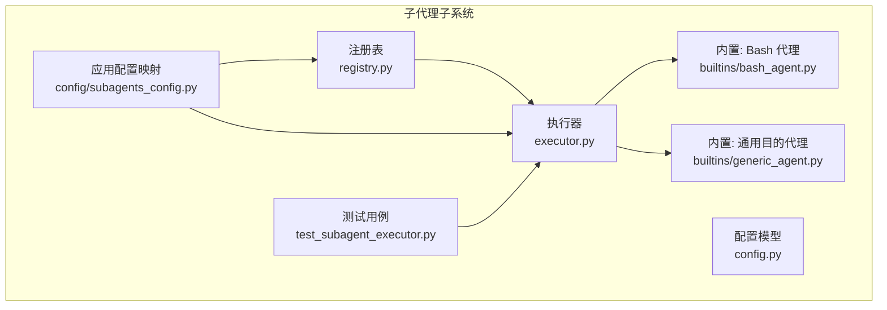
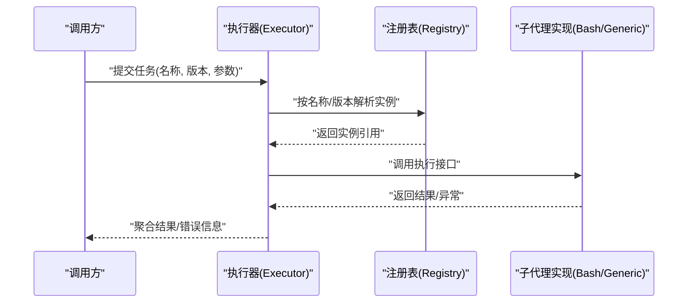
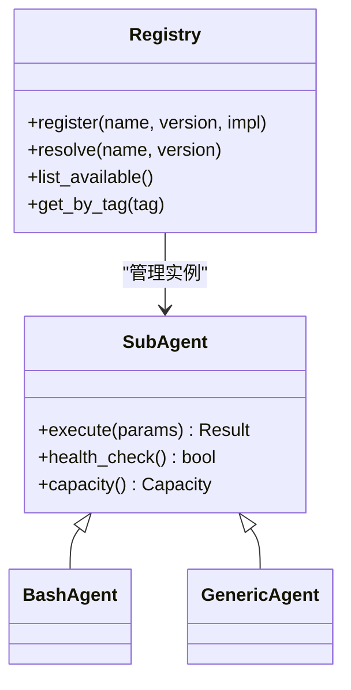
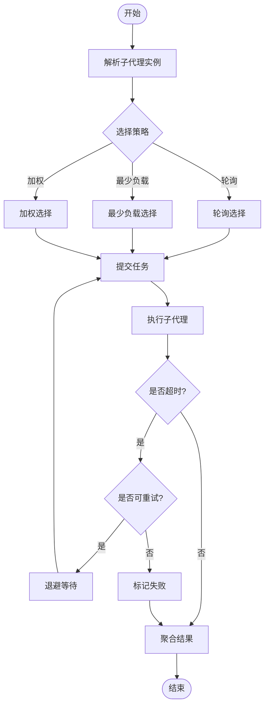
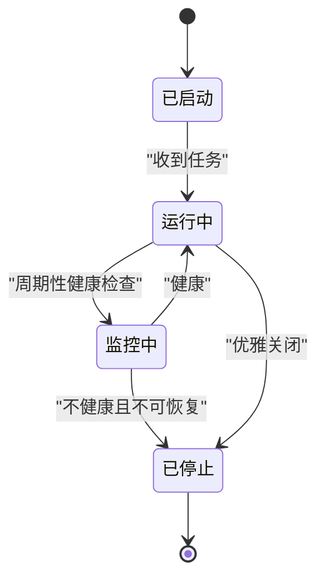
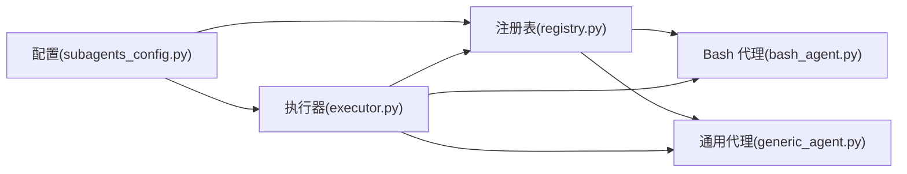

# 子代理调度

<cite>
**本文引用的文件**   
- [backend/packages/harness/deerflow/subagents/registry.py](file://backend/packages/harness/deerflow/subagents/registry.py)
- [backend/packages/harness/deerflow/subagents/executor.py](file://backend/packages/harness/deerflow/subagents/executor.py)
- [backend/packages/harness/deerflow/subagents/config.py](file://backend/packages/harness/deerflow/subagents/config.py)
- [backend/packages/harness/deerflow/subagents/builtins/bash_agent.py](file://backend/packages/harness/deerflow/subagents/builtins/bash_agent.py)
- [backend/packages/harness/deerflow/subagents/builtins/generic_agent.py](file://backend/packages/harness/deerflow/subagents/builtins/generic_agent.py)
- [backend/packages/harness/deerflow/config/subagents_config.py](file://backend/packages/harness/deerflow/config/subagents_config.py)
- [backend/tests/test_subagent_executor.py](file://backend/tests/test_subagent_executor.py)
</cite>

## 目录
1. [简介](#简介)
2. [项目结构](#项目结构)
3. [核心组件](#核心组件)
4. [架构总览](#架构总览)
5. [详细组件分析](#详细组件分析)
6. [依赖关系分析](#依赖关系分析)
7. [性能考虑](#性能考虑)
8. [故障排查指南](#故障排查指南)
9. [结论](#结论)
10. [附录](#附录)

## 简介
本文件围绕“子代理调度”展开，系统性阐述子代理的执行机制（并行执行、资源分配与负载均衡）、注册表（Registry）的工作原理（发现、加载与版本管理）、内置子代理（Bash 代理与通用目的代理）的使用场景与配置方法、生命周期管理（启动、执行、监控、清理）、通信与数据共享方式、自定义子代理开发指南，以及性能优化与故障恢复策略。文档面向不同技术背景的读者，既提供高层概览，也给出代码级细节与图示。

## 项目结构
与子代理调度相关的核心代码位于后端 harness 的 subagents 模块中，包含注册表、执行器、配置与内置实现；同时存在对应的配置模型与测试用例。

**图表来源**
- [backend/packages/harness/deerflow/subagents/registry.py](file://backend/packages/harness/deerflow/subagents/registry.py)
- [backend/packages/harness/deerflow/subagents/executor.py](file://backend/packages/harness/deerflow/subagents/executor.py)
- [backend/packages/harness/deerflow/subagents/config.py](file://backend/packages/harness/deerflow/subagents/config.py)
- [backend/packages/harness/deerflow/subagents/builtins/bash_agent.py](file://backend/packages/harness/deerflow/subagents/builtins/bash_agent.py)
- [backend/packages/harness/deerflow/subagents/builtins/generic_agent.py](file://backend/packages/harness/deerflow/subagents/builtins/generic_agent.py)
- [backend/packages/harness/deerflow/config/subagents_config.py](file://backend/packages/harness/deerflow/config/subagents_config.py)
- [backend/tests/test_subagent_executor.py](file://backend/tests/test_subagent_executor.py)

**章节来源**
- [backend/packages/harness/deerflow/subagents/registry.py](file://backend/packages/harness/deerflow/subagents/registry.py)
- [backend/packages/harness/deerflow/subagents/executor.py](file://backend/packages/harness/deerflow/subagents/executor.py)
- [backend/packages/harness/deerflow/subagents/config.py](file://backend/packages/harness/deerflow/subagents/config.py)
- [backend/packages/harness/deerflow/subagents/builtins/bash_agent.py](file://backend/packages/harness/deerflow/subagents/builtins/bash_agent.py)
- [backend/packages/harness/deerflow/subagents/builtins/generic_agent.py](file://backend/packages/harness/deerflow/subagents/builtins/generic_agent.py)
- [backend/packages/harness/deerflow/config/subagents_config.py](file://backend/packages/harness/deerflow/config/subagents_config.py)
- [backend/tests/test_subagent_executor.py](file://backend/tests/test_subagent_executor.py)

## 核心组件
- 注册表（Registry）：负责子代理的发现、加载、版本管理与路由选择。对外暴露按名称或版本获取实例的能力，并维护可用子代理清单。
- 执行器（Executor）：负责将任务提交到具体子代理实例，支持并发控制、超时、重试与结果聚合。
- 配置（Config）：定义子代理的运行时参数（如并发度、超时、资源配额等），并与上层应用配置进行映射。
- 内置子代理：
  - Bash 代理：用于在沙箱或本地环境中执行命令脚本，适合系统运维、数据处理流水线等场景。
  - 通用目的代理：以 LLM 驱动的任务执行体，适合需要推理与工具调用的复杂任务。
- 应用配置映射：将全局配置项解析为子代理子系统可用的配置对象。
- 测试：覆盖执行器的并发、超时、错误处理等关键路径。

**章节来源**
- [backend/packages/harness/deerflow/subagents/registry.py](file://backend/packages/harness/deerflow/subagents/registry.py)
- [backend/packages/harness/deerflow/subagents/executor.py](file://backend/packages/harness/deerflow/subagents/executor.py)
- [backend/packages/harness/deerflow/subagents/config.py](file://backend/packages/harness/deerflow/subagents/config.py)
- [backend/packages/harness/deerflow/subagents/builtins/bash_agent.py](file://backend/packages/harness/deerflow/subagents/builtins/bash_agent.py)
- [backend/packages/harness/deerflow/subagents/builtins/generic_agent.py](file://backend/packages/harness/deerflow/subagents/builtins/generic_agent.py)
- [backend/packages/harness/deerflow/config/subagents_config.py](file://backend/packages/harness/deerflow/config/subagents_config.py)
- [backend/tests/test_subagent_executor.py](file://backend/tests/test_subagent_executor.py)

## 架构总览
下图展示了从任务提交到子代理执行的端到端流程，包括注册表查找、执行器调度、内置代理执行与结果回传。

**图表来源**
- [backend/packages/harness/deerflow/subagents/executor.py](file://backend/packages/harness/deerflow/subagents/executor.py)
- [backend/packages/harness/deerflow/subagents/registry.py](file://backend/packages/harness/deerflow/subagents/registry.py)
- [backend/packages/harness/deerflow/subagents/builtins/bash_agent.py](file://backend/packages/harness/deerflow/subagents/builtins/bash_agent.py)
- [backend/packages/harness/deerflow/subagents/builtins/generic_agent.py](file://backend/packages/harness/deerflow/subagents/builtins/generic_agent.py)

## 详细组件分析

### 注册表（Registry）工作原理
- 发现与加载：
  - 扫描内置子代理模块，自动注册默认实现。
  - 支持通过配置或插件机制动态加载外部子代理。
- 版本管理：
  - 每个子代理可声明多个版本，注册表维护版本到实现的映射。
  - 查询时可按名称与版本精确匹配，未命中则回退至默认版本或报错。
- 路由与可用性：
  - 提供按标签/能力筛选的候选集，供执行器做负载均衡。
  - 维护健康状态与容量信息，避免向不可用实例派发任务。

**图表来源**
- [backend/packages/harness/deerflow/subagents/registry.py](file://backend/packages/harness/deerflow/subagents/registry.py)
- [backend/packages/harness/deerflow/subagents/builtins/bash_agent.py](file://backend/packages/harness/deerflow/subagents/builtins/bash_agent.py)
- [backend/packages/harness/deerflow/subagents/builtins/generic_agent.py](file://backend/packages/harness/deerflow/subagents/builtins/generic_agent.py)

**章节来源**
- [backend/packages/harness/deerflow/subagents/registry.py](file://backend/packages/harness/deerflow/subagents/registry.py)

### 执行器（Executor）与调度策略
- 并行执行：
  - 基于线程池或协程池并发调度多个子代理任务。
  - 支持最大并发度限制，防止资源耗尽。
- 资源分配与负载均衡：
  - 根据子代理的 capacity 与健康状态选择目标实例。
  - 支持轮询、最少负载或加权策略（由配置决定）。
- 超时与重试：
  - 为每次执行设置超时阈值，超时后中断并记录指标。
  - 支持可配置的重试次数与退避策略。
- 结果聚合与错误传播：
  - 收集各子代理输出，合并为统一结果结构。
  - 对失败任务进行降级处理或向上抛出明确错误。

**图表来源**
- [backend/packages/harness/deerflow/subagents/executor.py](file://backend/packages/harness/deerflow/subagents/executor.py)

**章节来源**
- [backend/packages/harness/deerflow/subagents/executor.py](file://backend/packages/harness/deerflow/subagents/executor.py)
- [backend/tests/test_subagent_executor.py](file://backend/tests/test_subagent_executor.py)

### 内置子代理：Bash 代理
- 使用场景：
  - 执行系统命令、数据处理脚本、批量转换任务。
  - 在受控沙箱内运行，确保安全性与隔离性。
- 配置要点：
  - 指定工作目录、环境变量、超时时间、资源上限。
  - 可选启用日志采集与审计。
- 安全与隔离：
  - 建议配合沙箱中间件，限制文件系统与网络访问。
  - 对输入参数进行白名单校验，避免注入风险。

**章节来源**
- [backend/packages/harness/deerflow/subagents/builtins/bash_agent.py](file://backend/packages/harness/deerflow/subagents/builtins/bash_agent.py)

### 内置子代理：通用目的代理（Generic Agent）
- 使用场景：
  - 需要 LLM 推理、多步规划与工具调用的复杂任务。
  - 结合技能（Skills）与工具（Tools）扩展能力。
- 配置要点：
  - 指定模型提供者、提示模板、工具列表、记忆上下文。
  - 调整采样参数、最大步数与输出格式约束。
- 扩展方式：
  - 通过中间件注入前置/后置逻辑（如限流、审计、缓存）。
  - 结合检查点（Checkpoint）实现断点续跑与状态持久化。

**章节来源**
- [backend/packages/harness/deerflow/subagents/builtins/generic_agent.py](file://backend/packages/harness/deerflow/subagents/builtins/generic_agent.py)

### 配置与版本管理
- 配置模型：
  - 定义子代理的默认参数、并发度、超时、重试策略等。
  - 支持按环境或租户维度覆盖默认值。
- 版本管理：
  - 子代理实现可声明兼容矩阵与迁移说明。
  - 注册表在升级时保持向后兼容，逐步淘汰旧版本。

**章节来源**
- [backend/packages/harness/deerflow/subagents/config.py](file://backend/packages/harness/deerflow/subagents/config.py)
- [backend/packages/harness/deerflow/config/subagents_config.py](file://backend/packages/harness/deerflow/config/subagents_config.py)

### 生命周期管理
- 启动：
  - 应用初始化时加载配置并构建注册表。
  - 预创建常用子代理实例，缩短首次请求延迟。
- 执行：
  - 接收任务后解析实例、选择策略、提交执行。
  - 记录追踪与指标，便于观测与排障。
- 监控：
  - 暴露健康检查接口，定期探测子代理可用性。
  - 统计吞吐、延迟、错误率与资源占用。
- 清理：
  - 优雅关闭时终止正在执行的任务或等待完成。
  - 释放资源（连接、句柄、临时文件），避免泄漏。

[此图为概念性生命周期示意，无需源码对应]

### 通信机制与数据共享
- 进程/容器间通信：
  - 通过标准输入/输出、消息队列或远程过程调用传递结构化数据。
  - 大对象采用共享存储（如对象存储或挂载卷）+ 引用传递。
- 内存共享：
  - 同进程内的子代理可通过共享内存或单例对象交换数据。
- 事件与流式输出：
  - 支持 SSE 或 WebSocket 推送执行进度与中间结果。
- 一致性保障：
  - 对写操作加锁或采用幂等设计，避免重复写入。
  - 使用事务或补偿机制保证最终一致性。

[本节为通用设计说明，不直接分析具体文件]

### 自定义子代理开发指南
- 接口定义：
  - 实现统一的执行接口，接受参数并返回标准化结果。
  - 提供健康检查与容量报告方法，便于调度器决策。
- 实现模式：
  - 无状态子代理：适合高并发、易水平扩展的场景。
  - 有状态子代理：需实现序列化/反序列化与状态恢复。
- 注册与版本：
  - 在模块初始化时向注册表登记名称、版本与能力标签。
  - 遵循语义化版本，发布变更时更新兼容性矩阵。
- 测试方法：
  - 单元测试：验证核心逻辑与边界条件。
  - 集成测试：模拟真实环境与依赖，验证端到端行为。
  - 压力测试：评估并发、吞吐与资源消耗。

**章节来源**
- [backend/packages/harness/deerflow/subagents/registry.py](file://backend/packages/harness/deerflow/subagents/registry.py)
- [backend/packages/harness/deerflow/subagents/config.py](file://backend/packages/harness/deerflow/subagents/config.py)
- [backend/tests/test_subagent_executor.py](file://backend/tests/test_subagent_executor.py)

## 依赖关系分析
- 内部依赖：
  - 执行器依赖注册表进行实例解析与选择。
  - 内置子代理通过统一接口被注册表管理。
  - 配置模块为注册表与执行器提供运行时参数。
- 外部依赖：
  - 沙箱与文件系统访问（Bash 代理）。
  - LLM 服务与工具生态（通用目的代理）。
  - 监控与追踪基础设施（可选）。

**图表来源**
- [backend/packages/harness/deerflow/config/subagents_config.py](file://backend/packages/harness/deerflow/config/subagents_config.py)
- [backend/packages/harness/deerflow/subagents/registry.py](file://backend/packages/harness/deerflow/subagents/registry.py)
- [backend/packages/harness/deerflow/subagents/executor.py](file://backend/packages/harness/deerflow/subagents/executor.py)
- [backend/packages/harness/deerflow/subagents/builtins/bash_agent.py](file://backend/packages/harness/deerflow/subagents/builtins/bash_agent.py)
- [backend/packages/harness/deerflow/subagents/builtins/generic_agent.py](file://backend/packages/harness/deerflow/subagents/builtins/generic_agent.py)

**章节来源**
- [backend/packages/harness/deerflow/config/subagents_config.py](file://backend/packages/harness/deerflow/config/subagents_config.py)
- [backend/packages/harness/deerflow/subagents/registry.py](file://backend/packages/harness/deerflow/subagents/registry.py)
- [backend/packages/harness/deerflow/subagents/executor.py](file://backend/packages/harness/deerflow/subagents/executor.py)

## 性能考虑
- 并发与吞吐：
  - 合理设置最大并发度，避免上下文切换开销过大。
  - 对 CPU 密集型任务使用进程池，I/O 密集型使用协程池。
- 资源隔离与配额：
  - 为每个子代理设定 CPU/内存上限，防止资源争抢。
  - 使用沙箱或容器隔离，提升稳定性与安全性。
- 负载均衡：
  - 根据历史延迟与错误率动态调整权重。
  - 引入亲和性策略，减少跨节点通信成本。
- 缓存与复用：
  - 对热数据与模型上下文进行缓存，降低冷启动开销。
  - 复用长连接与会话，减少握手成本。
- 可观测性：
  - 采集关键指标（QPS、P99 延迟、错误率、资源利用率）。
  - 建立告警规则，及时定位瓶颈与异常。

[本节为通用指导，不直接分析具体文件]

## 故障排查指南
- 常见问题：
  - 子代理不可用：检查健康检查与容量报告，确认实例状态。
  - 执行超时：调整超时阈值，分析慢查询或外部依赖延迟。
  - 资源不足：扩容或优化资源配额，识别热点任务。
  - 版本不兼容：核对注册表的版本映射与兼容性矩阵。
- 诊断步骤：
  - 查看执行器日志与追踪链路，定位失败阶段。
  - 检查子代理输出与中间状态，复现问题。
  - 使用最小化配置与数据集进行隔离测试。
- 恢复策略：
  - 自动重试与熔断，避免雪崩效应。
  - 快速回滚到稳定版本，保留现场以便复盘。

**章节来源**
- [backend/tests/test_subagent_executor.py](file://backend/tests/test_subagent_executor.py)

## 结论
子代理调度通过注册表与执行器的协同，实现了可扩展、可观测、可治理的多代理执行体系。内置的 Bash 与通用目的代理覆盖了从系统操作到智能推理的典型场景。通过合理的并发控制、负载均衡、超时重试与资源隔离，可在保证稳定性的前提下提升整体吞吐与响应速度。建议在生产环境中完善监控告警与灰度发布流程，持续优化性能与可靠性。

## 附录
- 术语表：
  - 子代理：可被主代理调度的独立执行单元。
  - 注册表：维护子代理元数据与实例的生命周期管理器。
  - 执行器：负责任务分发、并发控制与结果聚合的调度器。
- 参考链接：
  - 相关测试用例可用于理解执行器的行为与边界条件。