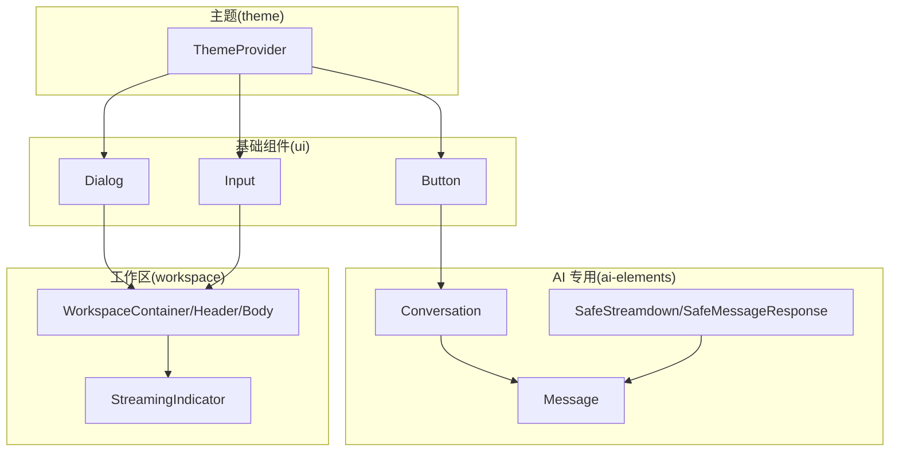
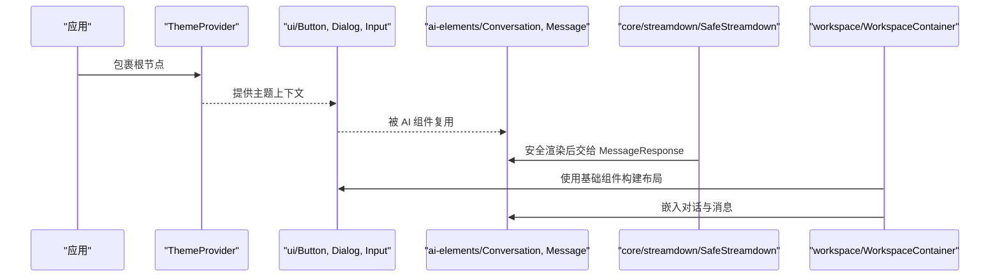
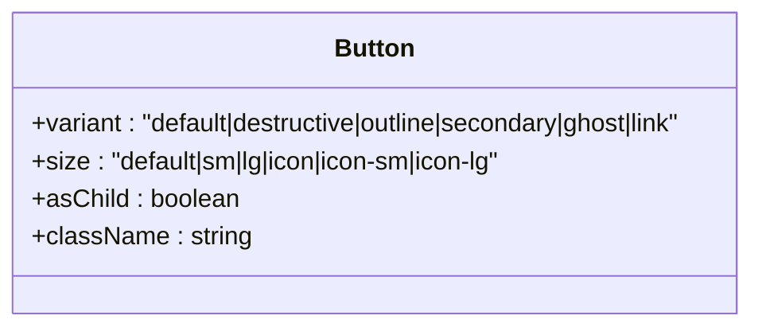
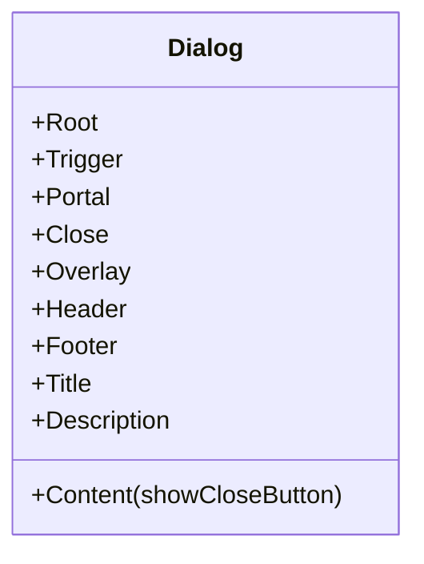
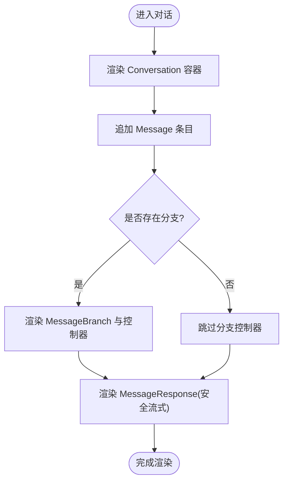
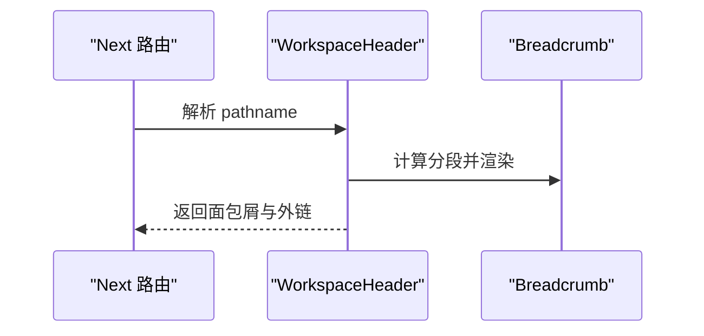
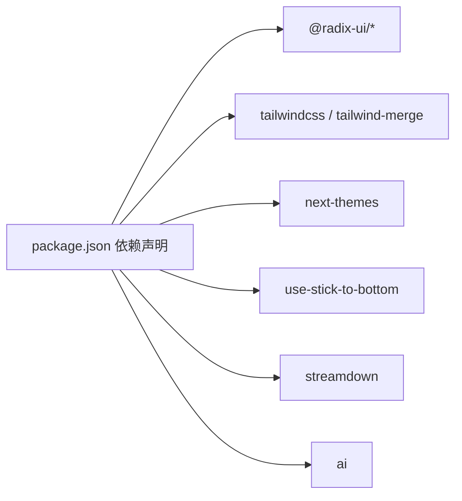

# UI 组件系统

<cite>
**本文引用的文件**   
- [frontend/package.json](file://frontend/package.json)
- [src/components/ui/button.tsx](file://frontend/src/components/ui/button.tsx)
- [src/components/ui/dialog.tsx](file://frontend/src/components/ui/dialog.tsx)
- [src/components/ui/input.tsx](file://frontend/src/components/ui/input.tsx)
- [src/components/ai-elements/conversation.tsx](file://frontend/src/components/ai-elements/conversation.tsx)
- [src/components/ai-elements/message.tsx](file://frontend/src/components/ai-elements/message.tsx)
- [src/components/workspace/workspace-container.tsx](file://frontend/src/components/workspace/workspace-container.tsx)
- [src/components/theme-provider.tsx](file://frontend/src/components/theme-provider.tsx)
- [src/components/workspace/streaming-indicator.tsx](file://frontend/src/components/workspace/streaming-indicator.tsx)
- [src/core/streamdown/components.tsx](file://frontend/src/core/streamdown/components.tsx)
</cite>

## 目录
1. [简介](#简介)
2. [项目结构](#项目结构)
3. [核心组件](#核心组件)
4. [架构总览](#架构总览)
5. [详细组件分析](#详细组件分析)
6. [依赖分析](#依赖分析)
7. [性能考虑](#性能考虑)
8. [故障排查指南](#故障排查指南)
9. [结论](#结论)
10. [附录](#附录)

## 简介
本文件为 DeerFlow 前端 UI 组件系统的技术文档，聚焦于基于 Radix UI 与 Tailwind CSS 的组件架构设计。内容覆盖基础组件库、业务组件与 AI 专用组件的分层结构；阐述可复用性、可访问性与响应式设计原则；记录聊天界面、工作区管理、设置对话框与实时状态显示等核心组件的实现细节；说明样式系统（主题定制、CSS 变量与暗色模式）；提供使用指南（Props 接口、事件处理与扩展方式）；并给出测试策略与文档生成机制建议。

## 项目结构
前端采用 Next.js + React 工程，组件按职责分层组织：
- ui：基础原子组件（按钮、输入、对话框、标签页等），封装 Radix UI 并提供一致的 Tailwind 样式与可访问性支持。
- ai-elements：面向 AI 对话场景的复合组件（对话容器、消息、流式渲染、工具栏等）。
- workspace：工作区业务组件（布局、导航、侧边栏、设置入口、实时指示器等）。
- core/streamdown：安全化的 Markdown/流式渲染桥接组件，统一输出到 ai-elements。
- theme-provider：全局主题提供者，结合 next-themes 实现明暗主题切换与首页强制暗色。

图表来源
- [src/components/ui/button.tsx:1-64](file://frontend/src/components/ui/button.tsx#L1-L64)
- [src/components/ui/dialog.tsx:1-144](file://frontend/src/components/ui/dialog.tsx#L1-L144)
- [src/components/ui/input.tsx:1-22](file://frontend/src/components/ui/input.tsx#L1-L22)
- [src/components/ai-elements/conversation.tsx:1-101](file://frontend/src/components/ai-elements/conversation.tsx#L1-L101)
- [src/components/ai-elements/message.tsx:1-450](file://frontend/src/components/ai-elements/message.tsx#L1-L450)
- [src/components/workspace/workspace-container.tsx:1-138](file://frontend/src/components/workspace/workspace-container.tsx#L1-L138)
- [src/components/workspace/streaming-indicator.tsx:1-35](file://frontend/src/components/workspace/streaming-indicator.tsx#L1-L35)
- [src/components/theme-provider.tsx:1-20](file://frontend/src/components/theme-provider.tsx#L1-L20)
- [src/core/streamdown/components.tsx:1-48](file://frontend/src/core/streamdown/components.tsx#L1-L48)

章节来源
- [frontend/package.json:1-120](file://frontend/package.json#L1-L120)

## 核心组件
本节概述关键组件的职责与交互关系，便于快速理解整体设计。

- 基础组件
  - Button：基于 Radix Slot 与 class-variance-authority 的变体系统，统一尺寸、风格与焦点态。
  - Dialog：基于 Radix Dialog 的完整弹窗组合，含 Overlay、Portal、Header/Footer、Title/Description 等。
  - Input：统一的输入控件，包含焦点环、禁用态与无障碍提示。

- AI 专用组件
  - Conversation：基于 use-stick-to-bottom 的滚动容器，提供“始终贴底”与“回到底部”能力。
  - Message：消息卡片，支持分支展示、附件、操作栏与富文本响应渲染。
  - SafeStreamdown/SafeMessageResponse：对 Markdown/流式内容进行安全化处理后，交由 MessageResponse 渲染。

- 工作区组件
  - WorkspaceContainer/Header/Body：应用级布局骨架，集成面包屑、国际化与 GitHub 快捷入口。
  - StreamingIndicator：三圆点弹跳动画，表示模型流式输出中。

- 主题
  - ThemeProvider：通过 next-themes 注入主题上下文，首页强制暗色，其余页面跟随用户偏好。

章节来源
- [src/components/ui/button.tsx:1-64](file://frontend/src/components/ui/button.tsx#L1-L64)
- [src/components/ui/dialog.tsx:1-144](file://frontend/src/components/ui/dialog.tsx#L1-L144)
- [src/components/ui/input.tsx:1-22](file://frontend/src/components/ui/input.tsx#L1-L22)
- [src/components/ai-elements/conversation.tsx:1-101](file://frontend/src/components/ai-elements/conversation.tsx#L1-L101)
- [src/components/ai-elements/message.tsx:1-450](file://frontend/src/components/ai-elements/message.tsx#L1-L450)
- [src/components/workspace/workspace-container.tsx:1-138](file://frontend/src/components/workspace/workspace-container.tsx#L1-L138)
- [src/components/workspace/streaming-indicator.tsx:1-35](file://frontend/src/components/workspace/streaming-indicator.tsx#L1-L35)
- [src/components/theme-provider.tsx:1-20](file://frontend/src/components/theme-provider.tsx#L1-L20)
- [src/core/streamdown/components.tsx:1-48](file://frontend/src/core/streamdown/components.tsx#L1-L48)

## 架构总览
下图展示了从主题到基础组件、再到 AI 与工作区组件的调用链，以及安全渲染桥接路径。

图表来源
- [src/components/theme-provider.tsx:1-20](file://frontend/src/components/theme-provider.tsx#L1-L20)
- [src/components/ui/button.tsx:1-64](file://frontend/src/components/ui/button.tsx#L1-L64)
- [src/components/ui/dialog.tsx:1-144](file://frontend/src/components/ui/dialog.tsx#L1-L144)
- [src/components/ui/input.tsx:1-22](file://frontend/src/components/ui/input.tsx#L1-L22)
- [src/components/ai-elements/conversation.tsx:1-101](file://frontend/src/components/ai-elements/conversation.tsx#L1-L101)
- [src/components/ai-elements/message.tsx:1-450](file://frontend/src/components/ai-elements/message.tsx#L1-L450)
- [src/core/streamdown/components.tsx:1-48](file://frontend/src/core/streamdown/components.tsx#L1-L48)
- [src/components/workspace/workspace-container.tsx:1-138](file://frontend/src/components/workspace/workspace-container.tsx#L1-L138)

## 详细组件分析

### 基础组件：Button
- 设计要点
  - 使用 class-variance-authority 定义 variant/size 变体，集中管理样式规则。
  - 通过 @radix-ui/react-slot 支持 asChild 透传，提升语义与可访问性。
  - 内置 focus-visible、aria-invalid 等可访问性与反馈样式。
- 使用建议
  - 优先通过 variant/size 控制外观，避免在业务层重复写样式。
  - 需要作为链接或自定义元素时，使用 asChild 透传。

图表来源
- [src/components/ui/button.tsx:1-64](file://frontend/src/components/ui/button.tsx#L1-L64)

章节来源
- [src/components/ui/button.tsx:1-64](file://frontend/src/components/ui/button.tsx#L1-L64)

### 基础组件：Dialog
- 设计要点
  - 基于 @radix-ui/react-dialog 封装 Root/Trigger/Portal/Close/Overlay/Content/Header/Footer/Title/Description。
  - Content 默认居中、带遮罩与缩放动画，支持 showCloseButton 开关关闭按钮。
  - 所有子元素均带有 data-slot 标记，便于自动化测试定位。
- 使用建议
  - 将复杂表单或设置面板放入 DialogContent，配合 Header/Footer 组织标题与操作。
  - 需要键盘与屏幕阅读器支持时，保持 Radix 原生命名空间不变。

图表来源
- [src/components/ui/dialog.tsx:1-144](file://frontend/src/components/ui/dialog.tsx#L1-L144)

章节来源
- [src/components/ui/dialog.tsx:1-144](file://frontend/src/components/ui/dialog.tsx#L1-L144)

### 基础组件：Input
- 设计要点
  - 统一边框、背景、占位符、禁用态与焦点环样式。
  - 兼容 file 类型输入的文件选择器样式。
- 使用建议
  - 与 Form 库或受控状态结合使用时，注意 aria-invalid 与错误提示联动。

章节来源
- [src/components/ui/input.tsx:1-22](file://frontend/src/components/ui/input.tsx#L1-L22)

### AI 专用：Conversation 与 Message
- Conversation
  - 基于 use-stick-to-bottom 的滚动容器，提供初始平滑滚动与 resize 行为。
  - 暴露 EmptyState 与 ScrollButton，增强空态与回到底部的体验。
- Message
  - 支持用户/助手两种角色样式区分。
  - 提供分支体系（MessageBranch/*）用于多路结果切换，附带前后翻页与页码。
  - 附件支持图片预览与文件图标，支持移除回调。
  - 响应区域使用 ClipboardSafeStreamdown 进行安全渲染。

图表来源
- [src/components/ai-elements/conversation.tsx:1-101](file://frontend/src/components/ai-elements/conversation.tsx#L1-L101)
- [src/components/ai-elements/message.tsx:1-450](file://frontend/src/components/ai-elements/message.tsx#L1-L450)

章节来源
- [src/components/ai-elements/conversation.tsx:1-101](file://frontend/src/components/ai-elements/conversation.tsx#L1-L101)
- [src/components/ai-elements/message.tsx:1-450](file://frontend/src/components/ai-elements/message.tsx#L1-L450)

### 工作区：WorkspaceContainer 与 StreamingIndicator
- WorkspaceContainer/Header/Body
  - 顶部 Header 集成 SidebarTrigger、Breadcrumb 与 GitHub 外链，自动根据路由生成分段名称。
  - Body 作为主内容区，适配不同宽度与折叠态。
- StreamingIndicator
  - 三个圆点依次弹跳，直观表达“正在生成”。

图表来源
- [src/components/workspace/workspace-container.tsx:1-138](file://frontend/src/components/workspace/workspace-container.tsx#L1-L138)
- [src/components/workspace/streaming-indicator.tsx:1-35](file://frontend/src/components/workspace/streaming-indicator.tsx#L1-L35)

章节来源
- [src/components/workspace/workspace-container.tsx:1-138](file://frontend/src/components/workspace/workspace-container.tsx#L1-L138)
- [src/components/workspace/streaming-indicator.tsx:1-35](file://frontend/src/components/workspace/streaming-indicator.tsx#L1-L35)

### 主题：ThemeProvider
- 通过 next-themes 提供主题上下文。
- 首页强制 dark 主题，其他页面遵循用户偏好。
- 与 Radix/Tailwind 的 CSS 变量协同，确保明暗切换一致。

章节来源
- [src/components/theme-provider.tsx:1-20](file://frontend/src/components/theme-provider.tsx#L1-L20)

### 安全渲染桥接：SafeStreamdown/SafeMessageResponse
- 对 children 进行安全化处理后再传入底层流式渲染组件，降低 XSS 风险。
- 与 MessageResponse 解耦，形成统一的安全渲染入口。

章节来源
- [src/core/streamdown/components.tsx:1-48](file://frontend/src/core/streamdown/components.tsx#L1-L48)

## 依赖分析
- 运行时依赖
  - Radix UI 系列：@radix-ui/react-* 提供无样式、高可访问性的基础构件。
  - Tailwind CSS 与 tailwind-merge：原子化样式与类名合并。
  - next-themes：主题切换与持久化。
  - use-stick-to-bottom：对话滚动与回到底部。
  - streamdown：Markdown/流式渲染。
  - ai：消息与流式协议相关类型与工具。
- 开发依赖
  - ESLint/Prettier/TypeScript：代码质量与类型检查。
  - Playwright/Rstest：端到端与单元测试框架。

图表来源
- [frontend/package.json:1-120](file://frontend/package.json#L1-L120)

章节来源
- [frontend/package.json:1-120](file://frontend/package.json#L1-L120)

## 性能考虑
- 列表与消息
  - 长列表建议使用虚拟滚动或分页加载；当前 Conversation 使用 stick-to-bottom 优化滚动体验。
- 渲染优化
  - MessageResponse 已使用 memo 减少不必要的重渲染；对大段落可考虑分块渲染。
- 动画与过渡
  - Dialog 的入场/退出动画与 StreamingIndicator 的弹跳动画应谨慎在低端设备上开启过多实例。
- 资源加载
  - 按需引入 Radix 子模块与图标，避免全量打包。

[本节为通用指导，不直接分析具体文件]

## 故障排查指南
- 主题未生效
  - 确认根节点已包裹 ThemeProvider，且页面非首页时未强制覆盖主题。
- 对话框无法关闭
  - 检查是否误用多个 Portal 或阻止了默认关闭行为；确认 showCloseButton 与外部触发逻辑。
- 输入框焦点环异常
  - 检查是否覆盖了 outline/focus-visible 样式；确保 aria-invalid 与错误提示联动。
- 对话不回到底部
  - 检查 Conversation 的 initial/resize 配置与父容器高度；确认是否有固定高度的外层遮挡。
- 流式内容渲染异常
  - 确认通过 SafeStreamdown/SafeMessageResponse 包装后再渲染；检查 children 是否为安全的字符串或 JSX。

章节来源
- [src/components/theme-provider.tsx:1-20](file://frontend/src/components/theme-provider.tsx#L1-L20)
- [src/components/ui/dialog.tsx:1-144](file://frontend/src/components/ui/dialog.tsx#L1-L144)
- [src/components/ui/input.tsx:1-22](file://frontend/src/components/ui/input.tsx#L1-L22)
- [src/components/ai-elements/conversation.tsx:1-101](file://frontend/src/components/ai-elements/conversation.tsx#L1-L101)
- [src/core/streamdown/components.tsx:1-48](file://frontend/src/core/streamdown/components.tsx#L1-L48)

## 结论
DeerFlow 前端 UI 组件系统以 Radix UI 为基石，结合 Tailwind CSS 的原子化样式与 class-variance-authority 的变体管理，构建了高内聚、低耦合的基础组件层；在此基础上，AI 专用组件与工作区组件实现了清晰的职责边界与良好的可复用性。主题系统通过 next-themes 统一管理，保障明暗模式一致性。整体架构兼顾可访问性、响应式与可扩展性，适合持续演进与团队协作。

[本节为总结性内容，不直接分析具体文件]

## 附录

### 组件使用指南（示例路径）
- 按钮
  - 参考：[src/components/ui/button.tsx:1-64](file://frontend/src/components/ui/button.tsx#L1-L64)
- 对话框
  - 参考：[src/components/ui/dialog.tsx:1-144](file://frontend/src/components/ui/dialog.tsx#L1-L144)
- 输入框
  - 参考：[src/components/ui/input.tsx:1-22](file://frontend/src/components/ui/input.tsx#L1-L22)
- 对话容器
  - 参考：[src/components/ai-elements/conversation.tsx:1-101](file://frontend/src/components/ai-elements/conversation.tsx#L1-L101)
- 消息与分支
  - 参考：[src/components/ai-elements/message.tsx:1-450](file://frontend/src/components/ai-elements/message.tsx#L1-L450)
- 工作区布局
  - 参考：[src/components/workspace/workspace-container.tsx:1-138](file://frontend/src/components/workspace/workspace-container.tsx#L1-L138)
- 实时指示器
  - 参考：[src/components/workspace/streaming-indicator.tsx:1-35](file://frontend/src/components/workspace/streaming-indicator.tsx#L1-L35)
- 主题
  - 参考：[src/components/theme-provider.tsx:1-20](file://frontend/src/components/theme-provider.tsx#L1-L20)
- 安全渲染桥接
  - 参考：[src/core/streamdown/components.tsx:1-48](file://frontend/src/core/streamdown/components.tsx#L1-L48)

### 样式系统与主题
- 主题定制
  - 通过 next-themes 在 ThemeProvider 中配置 forcedTheme 与存储策略。
- CSS 变量
  - 借助 Tailwind 的 CSS 变量（如 bg-primary、text-muted-foreground）实现明暗切换。
- 暗色模式
  - 首页强制暗色，其他页面跟随用户偏好；可在业务组件中以 data-theme 或类名驱动差异化样式。

章节来源
- [src/components/theme-provider.tsx:1-20](file://frontend/src/components/theme-provider.tsx#L1-L20)

### 测试策略与文档生成
- 单元测试
  - 使用 Rstest 对纯函数与 Hook 进行测试；对组件可使用快照与交互断言。
- 端到端测试
  - 使用 Playwright 验证关键流程（如打开对话框、发送消息、切换主题）。
- 文档生成
  - 建议结合 Storybook 或自建文档站点，导出组件 Props 与示例；对 Radix 组件保留其原生 API 命名以便查阅。

[本节为通用指导，不直接分析具体文件]