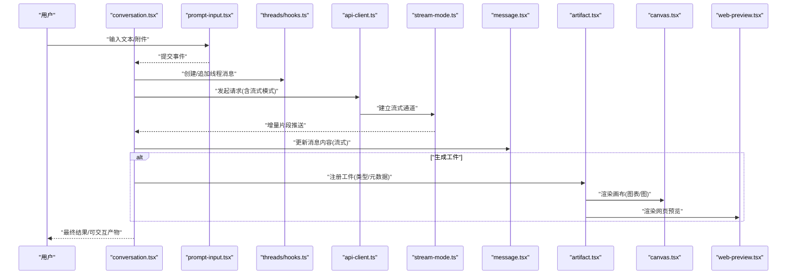
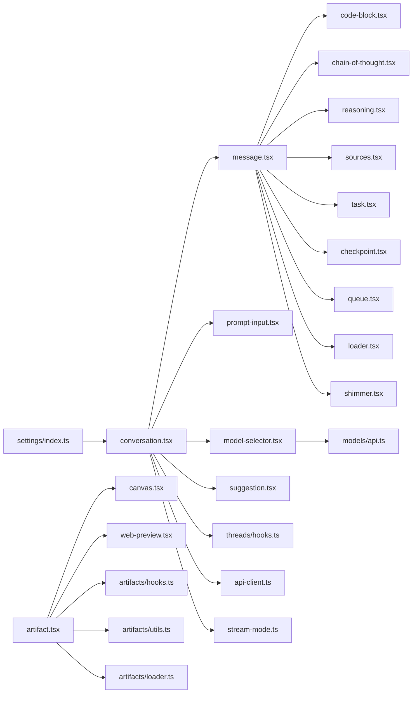

# AI专用组件

<cite>
**本文引用的文件**   
- [frontend/src/components/ai-elements/conversation.tsx](file://frontend/src/components/ai-elements/conversation.tsx)
- [frontend/src/components/ai-elements/message.tsx](file://frontend/src/components/ai-elements/message.tsx)
- [frontend/src/components/ai-elements/code-block.tsx](file://frontend/src/components/ai-elements/code-block.tsx)
- [frontend/src/components/ai-elements/canvas.tsx](file://frontend/src/components/ai-elements/canvas.tsx)
- [frontend/src/components/ai-elements/artifact.tsx](file://frontend/src/components/ai-elements/artifact.tsx)
- [frontend/src/components/ai-elements/chain-of-thought.tsx](file://frontend/src/components/ai-elements/chain-of-thought.tsx)
- [frontend/src/components/ai-elements/reasoning.tsx](file://frontend/src/components/ai-elements/reasoning.tsx)
- [frontend/src/components/ai-elements/prompt-input.tsx](file://frontend/src/components/ai-elements/prompt-input.tsx)
- [frontend/src/components/ai-elements/web-preview.tsx](file://frontend/src/components/ai-elements/web-preview.tsx)
- [frontend/src/components/ai-elements/model-selector.tsx](file://frontend/src/components/ai-elements/model-selector.tsx)
- [frontend/src/components/ai-elements/suggestion.tsx](file://frontend/src/components/ai-elements/suggestion.tsx)
- [frontend/src/components/ai-elements/sources.tsx](file://frontend/src/components/ai-elements/sources.tsx)
- [frontend/src/components/ai-elements/task.tsx](file://frontend/src/components/ai-elements/task.tsx)
- [frontend/src/components/ai-elements/checkpoint.tsx](file://frontend/src/components/ai-elements/checkpoint.tsx)
- [frontend/src/components/ai-elements/queue.tsx](file://frontend/src/components/ai-elements/queue.tsx)
- [frontend/src/components/ai-elements/context.tsx](file://frontend/src/components/ai-elements/context.tsx)
- [frontend/src/components/ai-elements/loader.tsx](file://frontend/src/components/ai-elements/loader.tsx)
- [frontend/src/components/ai-elements/shimmer.tsx](file://frontend/src/components/ai-elements/shimmer.tsx)
- [frontend/src/components/workspace/input-box.tsx](file://frontend/src/components/workspace/input-box.tsx)
- [frontend/src/components/workspace/streaming-indicator.tsx](file://frontend/src/components/workspace/streaming-indicator.tsx)
- [frontend/src/components/workspace/code-editor.tsx](file://frontend/src/components/workspace/code-editor.tsx)
- [frontend/src/core/api/api-client.ts](file://frontend/src/core/api/api-client.ts)
- [frontend/src/core/api/stream-mode.ts](file://frontend/src/core/api/stream-mode.ts)
- [frontend/src/core/messages/index.ts](file://frontend/src/core/messages/index.ts)
- [frontend/src/core/threads/hooks.ts](file://frontend/src/core/threads/hooks.ts)
- [frontend/src/core/artifacts/hooks.ts](file://frontend/src/core/artifacts/hooks.ts)
- [frontend/src/core/artifacts/utils.ts](file://frontend/src/core/artifacts/utils.ts)
- [frontend/src/core/artifacts/loader.ts](file://frontend/src/core/artifacts/loader.ts)
- [frontend/src/core/models/api.ts](file://frontend/src/core/models/api.ts)
- [frontend/src/core/settings/index.ts](file://frontend/src/core/settings/index.ts)
</cite>

## 目录
1. [简介](#简介)
2. [项目结构](#项目结构)
3. [核心组件](#核心组件)
4. [架构总览](#架构总览)
5. [详细组件分析](#详细组件分析)
6. [依赖分析](#依赖分析)
7. [性能考虑](#性能考虑)
8. [故障排查指南](#故障排查指南)
9. [结论](#结论)
10. [附录](#附录)

## 简介
本文件面向 DeerFlow 前端的“AI 专用组件”体系，聚焦对话与交互体验：消息气泡、思维链展示、代码块渲染、图表可视化、聊天界面（输入框、发送按钮、流式响应显示、错误处理）、工作区（文件预览、代码编辑器、画布、工具调用状态）等。文档同时覆盖状态管理、事件处理与后端实时通信机制，并提供定制扩展最佳实践、使用示例与性能优化建议。

## 项目结构
前端采用 Next.js + React 技术栈，AI 相关 UI 集中在 ai-elements 与 workspace 两个目录；数据与通信层位于 core 下，包含 API 客户端、流模式、消息模型、线程与工件（Artifacts）管理等。

```mermaid
graph TB
subgraph "AI 元素"
A_conv["conversation.tsx"]
A_msg["message.tsx"]
A_code["code-block.tsx"]
A_canvas["canvas.tsx"]
A_artifact["artifact.tsx"]
A_cot["chain-of-thought.tsx"]
A_reason["reasoning.tsx"]
A_input["prompt-input.tsx"]
A_web["web-preview.tsx"]
A_model["model-selector.tsx"]
A_sug["suggestion.tsx"]
A_src["sources.tsx"]
A_task["task.tsx"]
A_chk["checkpoint.tsx"]
A_q["queue.tsx"]
A_ctx["context.tsx"]
A_loader["loader.tsx"]
A_shim["shimmer.tsx"]
end
subgraph "工作区"
W_inbox["input-box.tsx"]
W_stream["streaming-indicator.tsx"]
W_editor["code-editor.tsx"]
end
subgraph "核心能力"
C_api["api-client.ts"]
C_stream["stream-mode.ts"]
C_msgs["messages/index.ts"]
C_threads["threads/hooks.ts"]
C_art_h["artifacts/hooks.ts"]
C_art_u["artifacts/utils.ts"]
C_art_l["artifacts/loader.ts"]
C_models["models/api.ts"]
C_settings["settings/index.ts"]
end
A_conv --> A_msg
A_conv --> A_input
A_conv --> A_model
A_conv --> A_sug
A_msg --> A_code
A_msg --> A_cot
A_msg --> A_reason
A_msg --> A_src
A_msg --> A_task
A_msg --> A_chk
A_msg --> A_q
A_msg --> A_loader
A_msg --> A_shim
A_artifact --> A_canvas
A_artifact --> A_web
A_artifact --> A_code
A_artifact --> A_src
A_input --> W_inbox
A_conv --> W_stream
A_conv --> C_threads
A_conv --> C_msgs
A_conv --> C_api
A_conv --> C_stream
A_artifact --> C_art_h
A_artifact --> C_art_u
A_artifact --> C_art_l
A_model --> C_models
A_conv --> C_settings
```

图示来源
- [frontend/src/components/ai-elements/conversation.tsx](file://frontend/src/components/ai-elements/conversation.tsx)
- [frontend/src/components/ai-elements/message.tsx](file://frontend/src/components/ai-elements/message.tsx)
- [frontend/src/components/ai-elements/code-block.tsx](file://frontend/src/components/ai-elements/code-block.tsx)
- [frontend/src/components/ai-elements/canvas.tsx](file://frontend/src/components/ai-elements/canvas.tsx)
- [frontend/src/components/ai-elements/artifact.tsx](file://frontend/src/components/ai-elements/artifact.tsx)
- [frontend/src/components/ai-elements/chain-of-thought.tsx](file://frontend/src/components/ai-elements/chain-of-thought.tsx)
- [frontend/src/components/ai-elements/reasoning.tsx](file://frontend/src/components/ai-elements/reasoning.tsx)
- [frontend/src/components/ai-elements/prompt-input.tsx](file://frontend/src/components/ai-elements/prompt-input.tsx)
- [frontend/src/components/ai-elements/web-preview.tsx](file://frontend/src/components/ai-elements/web-preview.tsx)
- [frontend/src/components/ai-elements/model-selector.tsx](file://frontend/src/components/ai-elements/model-selector.tsx)
- [frontend/src/components/ai-elements/suggestion.tsx](file://frontend/src/components/ai-elements/suggestion.tsx)
- [frontend/src/components/ai-elements/sources.tsx](file://frontend/src/components/ai-elements/sources.tsx)
- [frontend/src/components/ai-elements/task.tsx](file://frontend/src/components/ai-elements/task.tsx)
- [frontend/src/components/ai-elements/checkpoint.tsx](file://frontend/src/components/ai-elements/checkpoint.tsx)
- [frontend/src/components/ai-elements/queue.tsx](file://frontend/src/components/ai-elements/queue.tsx)
- [frontend/src/components/ai-elements/context.tsx](file://frontend/src/components/ai-elements/context.tsx)
- [frontend/src/components/ai-elements/loader.tsx](file://frontend/src/components/ai-elements/loader.tsx)
- [frontend/src/components/ai-elements/shimmer.tsx](file://frontend/src/components/ai-elements/shimmer.tsx)
- [frontend/src/components/workspace/input-box.tsx](file://frontend/src/components/workspace/input-box.tsx)
- [frontend/src/components/workspace/streaming-indicator.tsx](file://frontend/src/components/workspace/streaming-indicator.tsx)
- [frontend/src/components/workspace/code-editor.tsx](file://frontend/src/components/workspace/code-editor.tsx)
- [frontend/src/core/api/api-client.ts](file://frontend/src/core/api/api-client.ts)
- [frontend/src/core/api/stream-mode.ts](file://frontend/src/core/api/stream-mode.ts)
- [frontend/src/core/messages/index.ts](file://frontend/src/core/messages/index.ts)
- [frontend/src/core/threads/hooks.ts](file://frontend/src/core/threads/hooks.ts)
- [frontend/src/core/artifacts/hooks.ts](file://frontend/src/core/artifacts/hooks.ts)
- [frontend/src/core/artifacts/utils.ts](file://frontend/src/core/artifacts/utils.ts)
- [frontend/src/core/artifacts/loader.ts](file://frontend/src/core/artifacts/loader.ts)
- [frontend/src/core/models/api.ts](file://frontend/src/core/models/api.ts)
- [frontend/src/core/settings/index.ts](file://frontend/src/core/settings/index.ts)

章节来源
- [frontend/src/components/ai-elements/conversation.tsx](file://frontend/src/components/ai-elements/conversation.tsx)
- [frontend/src/core/api/api-client.ts](file://frontend/src/core/api/api-client.ts)
- [frontend/src/core/threads/hooks.ts](file://frontend/src/core/threads/hooks.ts)

## 核心组件
本节概述关键 AI 交互组件的职责与协作关系，帮助快速定位实现位置与扩展点。

- 对话容器 conversation.tsx
  - 职责：组织消息列表、控制输入与发送、集成流式响应、承载上下文与设置。
  - 关键子组件：message、prompt-input、model-selector、suggestion、streaming-indicator。
  - 数据源：threads hooks、messages 类型定义、API 客户端。

- 消息气泡 message.tsx
  - 职责：根据消息类型渲染不同内容（文本、代码、思维链、任务、引用、检查点、队列等）。
  - 组合：code-block、chain-of-thought、reasoning、sources、task、checkpoint、queue、loader、shimmer。

- 代码块 code-block.tsx
  - 职责：语法高亮、复制、语言选择、可折叠区域。
  - 扩展：自定义主题、行号、快捷键。

- 画布 canvas.tsx
  - 职责：节点/边渲染、拖拽缩放、交互事件。
  - 适用：流程图、思维导图、架构图等可视化。

- 工件 artifact.tsx
  - 职责：统一包装外部产物（Web 预览、图表、代码、文件），提供打开/切换/加载态。
  - 依赖：artifacts hooks/utils/loader。

- 思维链 chain-of-thought.tsx / reasoning.tsx
  - 职责：逐步推理过程的可折叠展示，支持展开/收起与步骤导航。

- 输入 prompt-input.tsx / input-box.tsx
  - 职责：多行输入、附件上传、快捷键、发送触发。
  - 集成：workspace input-box 复用通用输入逻辑。

- Web 预览 web-preview.tsx
  - 职责：安全沙箱内嵌浏览，URL 校验、加载指示、错误兜底。

- 模型选择 model-selector.tsx
  - 职责：列出可用模型、切换当前模型、缓存偏好。
  - 数据：models api。

- 引用 sources.tsx / suggestion.tsx
  - 职责：来源卡片、建议提示、点击跳转或二次提问。

- 任务 task.tsx / 检查点 checkpoint.tsx / 队列 queue.tsx
  - 职责：任务进度、中间结果、待执行队列的可视化。

- 上下文 context.tsx / loader.tsx / shimmer.tsx
  - 职责：全局上下文注入、骨架屏与加载占位。

章节来源
- [frontend/src/components/ai-elements/conversation.tsx](file://frontend/src/components/ai-elements/conversation.tsx)
- [frontend/src/components/ai-elements/message.tsx](file://frontend/src/components/ai-elements/message.tsx)
- [frontend/src/components/ai-elements/code-block.tsx](file://frontend/src/components/ai-elements/code-block.tsx)
- [frontend/src/components/ai-elements/canvas.tsx](file://frontend/src/components/ai-elements/canvas.tsx)
- [frontend/src/components/ai-elements/artifact.tsx](file://frontend/src/components/ai-elements/artifact.tsx)
- [frontend/src/components/ai-elements/chain-of-thought.tsx](file://frontend/src/components/ai-elements/chain-of-thought.tsx)
- [frontend/src/components/ai-elements/reasoning.tsx](file://frontend/src/components/ai-elements/reasoning.tsx)
- [frontend/src/components/ai-elements/prompt-input.tsx](file://frontend/src/components/ai-elements/prompt-input.tsx)
- [frontend/src/components/ai-elements/web-preview.tsx](file://frontend/src/components/ai-elements/web-preview.tsx)
- [frontend/src/components/ai-elements/model-selector.tsx](file://frontend/src/components/ai-elements/model-selector.tsx)
- [frontend/src/components/ai-elements/suggestion.tsx](file://frontend/src/components/ai-elements/suggestion.tsx)
- [frontend/src/components/ai-elements/sources.tsx](file://frontend/src/components/ai-elements/sources.tsx)
- [frontend/src/components/ai-elements/task.tsx](file://frontend/src/components/ai-elements/task.tsx)
- [frontend/src/components/ai-elements/checkpoint.tsx](file://frontend/src/components/ai-elements/checkpoint.tsx)
- [frontend/src/components/ai-elements/queue.tsx](file://frontend/src/components/ai-elements/queue.tsx)
- [frontend/src/components/ai-elements/context.tsx](file://frontend/src/components/ai-elements/context.tsx)
- [frontend/src/components/ai-elements/loader.tsx](file://frontend/src/components/ai-elements/loader.tsx)
- [frontend/src/components/ai-elements/shimmer.tsx](file://frontend/src/components/ai-elements/shimmer.tsx)
- [frontend/src/components/workspace/input-box.tsx](file://frontend/src/components/workspace/input-box.tsx)
- [frontend/src/components/workspace/streaming-indicator.tsx](file://frontend/src/components/workspace/streaming-indicator.tsx)
- [frontend/src/components/workspace/code-editor.tsx](file://frontend/src/components/workspace/code-editor.tsx)
- [frontend/src/core/messages/index.ts](file://frontend/src/core/messages/index.ts)
- [frontend/src/core/threads/hooks.ts](file://frontend/src/core/threads/hooks.ts)
- [frontend/src/core/artifacts/hooks.ts](file://frontend/src/core/artifacts/hooks.ts)
- [frontend/src/core/artifacts/utils.ts](file://frontend/src/core/artifacts/utils.ts)
- [frontend/src/core/artifacts/loader.ts](file://frontend/src/core/artifacts/loader.ts)
- [frontend/src/core/models/api.ts](file://frontend/src/core/models/api.ts)
- [frontend/src/core/settings/index.ts](file://frontend/src/core/settings/index.ts)

## 架构总览
下图展示了从用户输入到流式响应渲染的关键路径，以及工件与画布的联动。

图示来源
- [frontend/src/components/ai-elements/conversation.tsx](file://frontend/src/components/ai-elements/conversation.tsx)
- [frontend/src/components/ai-elements/prompt-input.tsx](file://frontend/src/components/ai-elements/prompt-input.tsx)
- [frontend/src/core/threads/hooks.ts](file://frontend/src/core/threads/hooks.ts)
- [frontend/src/core/api/api-client.ts](file://frontend/src/core/api/api-client.ts)
- [frontend/src/core/api/stream-mode.ts](file://frontend/src/core/api/stream-mode.ts)
- [frontend/src/components/ai-elements/message.tsx](file://frontend/src/components/ai-elements/message.tsx)
- [frontend/src/components/ai-elements/artifact.tsx](file://frontend/src/components/ai-elements/artifact.tsx)
- [frontend/src/components/ai-elements/canvas.tsx](file://frontend/src/components/ai-elements/canvas.tsx)
- [frontend/src/components/ai-elements/web-preview.tsx](file://frontend/src/components/ai-elements/web-preview.tsx)

## 详细组件分析

### 对话容器 conversation.tsx
- 角色：会话编排中心，负责消息生命周期、流式拼接、上下文与设置透传。
- 关键流程：
  - 初始化：加载线程、订阅消息变更、恢复上下文。
  - 发送：收集输入、附加模型/设置、调用 threads hooks 与 API 客户端。
  - 流式：按片段增量更新消息，避免整段重绘。
  - 错误：捕获网络/服务端异常，回退为错误消息并提示重试。
- 扩展点：
  - 自定义消息渲染策略（基于消息类型映射）。
  - 接入新的工件类型（如视频/音频）。
  - 注入自定义中间件（如审计、埋点）。

章节来源
- [frontend/src/components/ai-elements/conversation.tsx](file://frontend/src/components/ai-elements/conversation.tsx)
- [frontend/src/core/threads/hooks.ts](file://frontend/src/core/threads/hooks.ts)
- [frontend/src/core/api/api-client.ts](file://frontend/src/core/api/api-client.ts)
- [frontend/src/core/api/stream-mode.ts](file://frontend/src/core/api/stream-mode.ts)

### 消息气泡 message.tsx
- 角色：消息内容的“分发器”，依据消息体字段决定渲染分支。
- 典型分支：
  - 纯文本/Markdown：结合代码块与引用。
  - 代码片段：code-block。
  - 思维链/推理：chain-of-thought、reasoning。
  - 任务/检查点/队列：task、checkpoint、queue。
  - 来源/建议：sources、suggestion。
  - 加载态：loader、shimmer。
- 性能要点：
  - 大文本分片渲染，避免阻塞主线程。
  - 长列表虚拟滚动（由上层容器控制）。

章节来源
- [frontend/src/components/ai-elements/message.tsx](file://frontend/src/components/ai-elements/message.tsx)
- [frontend/src/components/ai-elements/code-block.tsx](file://frontend/src/components/ai-elements/code-block.tsx)
- [frontend/src/components/ai-elements/chain-of-thought.tsx](file://frontend/src/components/ai-elements/chain-of-thought.tsx)
- [frontend/src/components/ai-elements/reasoning.tsx](file://frontend/src/components/ai-elements/reasoning.tsx)
- [frontend/src/components/ai-elements/sources.tsx](file://frontend/src/components/ai-elements/sources.tsx)
- [frontend/src/components/ai-elements/task.tsx](file://frontend/src/components/ai-elements/task.tsx)
- [frontend/src/components/ai-elements/checkpoint.tsx](file://frontend/src/components/ai-elements/checkpoint.tsx)
- [frontend/src/components/ai-elements/queue.tsx](file://frontend/src/components/ai-elements/queue.tsx)
- [frontend/src/components/ai-elements/loader.tsx](file://frontend/src/components/ai-elements/loader.tsx)
- [frontend/src/components/ai-elements/shimmer.tsx](file://frontend/src/components/ai-elements/shimmer.tsx)

### 代码块 code-block.tsx
- 功能：语法高亮、语言标签、一键复制、折叠/展开、行号开关。
- 可配置项：主题、字体、行高、是否自动换行。
- 性能：对超长代码启用懒加载与分页渲染。

章节来源
- [frontend/src/components/ai-elements/code-block.tsx](file://frontend/src/components/ai-elements/code-block.tsx)

### 画布 canvas.tsx
- 功能：节点/边绘制、拖拽、缩放、选中、右键菜单。
- 数据结构：节点集合、边集合、视图变换矩阵。
- 交互：双击编辑、快捷键、撤销/重做。
- 扩展：自定义节点/边类型、导出图片/PDF。

章节来源
- [frontend/src/components/ai-elements/canvas.tsx](file://frontend/src/components/ai-elements/canvas.tsx)

### 工件 artifact.tsx
- 功能：将后端产出的“工件”以统一入口呈现，支持多种渲染器（代码、图表、网页预览等）。
- 生命周期：注册 -> 加载 -> 渲染 -> 销毁。
- 与画布/预览：通过内部路由或回调切换到对应渲染器。

章节来源
- [frontend/src/components/ai-elements/artifact.tsx](file://frontend/src/components/ai-elements/artifact.tsx)
- [frontend/src/core/artifacts/hooks.ts](file://frontend/src/core/artifacts/hooks.ts)
- [frontend/src/core/artifacts/utils.ts](file://frontend/src/core/artifacts/utils.ts)
- [frontend/src/core/artifacts/loader.ts](file://frontend/src/core/artifacts/loader.ts)

### 思维链 chain-of-thought.tsx / reasoning.tsx
- 功能：逐步推理过程的可视化，支持步骤导航、折叠、时间线。
- 用途：解释模型决策路径、调试复杂任务。

章节来源
- [frontend/src/components/ai-elements/chain-of-thought.tsx](file://frontend/src/components/ai-elements/chain-of-thought.tsx)
- [frontend/src/components/ai-elements/reasoning.tsx](file://frontend/src/components/ai-elements/reasoning.tsx)

### 输入 prompt-input.tsx / 工作区 input-box.tsx
- 功能：多行输入、粘贴/拖拽附件、快捷键（Enter 发送、Shift+Enter 换行）、发送禁用态。
- 集成：与 conversation 的提交事件对接，支持清空与历史回溯。

章节来源
- [frontend/src/components/ai-elements/prompt-input.tsx](file://frontend/src/components/ai-elements/prompt-input.tsx)
- [frontend/src/components/workspace/input-box.tsx](file://frontend/src/components/workspace/input-box.tsx)

### Web 预览 web-preview.tsx
- 功能：在受控环境中加载 URL，提供加载/错误态与返回按钮。
- 安全：白名单域名、限制弹窗与脚本权限。

章节来源
- [frontend/src/components/ai-elements/web-preview.tsx](file://frontend/src/components/ai-elements/web-preview.tsx)

### 模型选择 model-selector.tsx
- 功能：拉取可用模型列表、切换当前模型、持久化偏好。
- 数据：models api。

章节来源
- [frontend/src/components/ai-elements/model-selector.tsx](file://frontend/src/components/ai-elements/model-selector.tsx)
- [frontend/src/core/models/api.ts](file://frontend/src/core/models/api.ts)

### 引用 sources.tsx / 建议 suggestion.tsx
- 功能：来源卡片（标题、摘要、链接）、建议问题（快捷追问）。
- 交互：点击跳转、二次提问回填输入框。

章节来源
- [frontend/src/components/ai-elements/sources.tsx](file://frontend/src/components/ai-elements/sources.tsx)
- [frontend/src/components/ai-elements/suggestion.tsx](file://frontend/src/components/ai-elements/suggestion.tsx)

### 任务 task.tsx / 检查点 checkpoint.tsx / 队列 queue.tsx
- 功能：任务进度条、中间结果快照、待执行队列管理与取消。
- 场景：长时任务、批处理、多步工作流。

章节来源
- [frontend/src/components/ai-elements/task.tsx](file://frontend/src/components/ai-elements/task.tsx)
- [frontend/src/components/ai-elements/checkpoint.tsx](file://frontend/src/components/ai-elements/checkpoint.tsx)
- [frontend/src/components/ai-elements/queue.tsx](file://frontend/src/components/ai-elements/queue.tsx)

### 上下文 context.tsx / 加载 loader.tsx / 骨架 shimmer.tsx
- 功能：全局上下文（主题、语言、设置）注入；加载与骨架屏提升感知性能。

章节来源
- [frontend/src/components/ai-elements/context.tsx](file://frontend/src/components/ai-elements/context.tsx)
- [frontend/src/components/ai-elements/loader.tsx](file://frontend/src/components/ai-elements/loader.tsx)
- [frontend/src/components/ai-elements/shimmer.tsx](file://frontend/src/components/ai-elements/shimmer.tsx)

### 工作区：代码编辑器 code-editor.tsx
- 功能：在线代码编辑、保存、语法检查、版本对比。
- 集成：与工件系统联动，支持从对话中直接打开编辑。

章节来源
- [frontend/src/components/workspace/code-editor.tsx](file://frontend/src/components/workspace/code-editor.tsx)

### 流式指示 streaming-indicator.tsx
- 功能：在对话顶部或消息末尾显示“正在生成”状态，配合流式响应。

章节来源
- [frontend/src/components/workspace/streaming-indicator.tsx](file://frontend/src/components/workspace/streaming-indicator.tsx)

## 依赖分析
组件间依赖遵循“低耦合、高内聚”原则：UI 组件仅消费 hooks 与 API 客户端，不直接操作网络；工件渲染器通过统一接口接入。

图示来源
- [frontend/src/components/ai-elements/conversation.tsx](file://frontend/src/components/ai-elements/conversation.tsx)
- [frontend/src/components/ai-elements/message.tsx](file://frontend/src/components/ai-elements/message.tsx)
- [frontend/src/components/ai-elements/code-block.tsx](file://frontend/src/components/ai-elements/code-block.tsx)
- [frontend/src/components/ai-elements/chain-of-thought.tsx](file://frontend/src/components/ai-elements/chain-of-thought.tsx)
- [frontend/src/components/ai-elements/reasoning.tsx](file://frontend/src/components/ai-elements/reasoning.tsx)
- [frontend/src/components/ai-elements/sources.tsx](file://frontend/src/components/ai-elements/sources.tsx)
- [frontend/src/components/ai-elements/task.tsx](file://frontend/src/components/ai-elements/task.tsx)
- [frontend/src/components/ai-elements/checkpoint.tsx](file://frontend/src/components/ai-elements/checkpoint.tsx)
- [frontend/src/components/ai-elements/queue.tsx](file://frontend/src/components/ai-elements/queue.tsx)
- [frontend/src/components/ai-elements/loader.tsx](file://frontend/src/components/ai-elements/loader.tsx)
- [frontend/src/components/ai-elements/shimmer.tsx](file://frontend/src/components/ai-elements/shimmer.tsx)
- [frontend/src/components/ai-elements/artifact.tsx](file://frontend/src/components/ai-elements/artifact.tsx)
- [frontend/src/components/ai-elements/canvas.tsx](file://frontend/src/components/ai-elements/canvas.tsx)
- [frontend/src/components/ai-elements/web-preview.tsx](file://frontend/src/components/ai-elements/web-preview.tsx)
- [frontend/src/core/artifacts/hooks.ts](file://frontend/src/core/artifacts/hooks.ts)
- [frontend/src/core/artifacts/utils.ts](file://frontend/src/core/artifacts/utils.ts)
- [frontend/src/core/artifacts/loader.ts](file://frontend/src/core/artifacts/loader.ts)
- [frontend/src/core/models/api.ts](file://frontend/src/core/models/api.ts)
- [frontend/src/core/settings/index.ts](file://frontend/src/core/settings/index.ts)
- [frontend/src/core/threads/hooks.ts](file://frontend/src/core/threads/hooks.ts)
- [frontend/src/core/api/api-client.ts](file://frontend/src/core/api/api-client.ts)
- [frontend/src/core/api/stream-mode.ts](file://frontend/src/core/api/stream-mode.ts)

章节来源
- [frontend/src/components/ai-elements/conversation.tsx](file://frontend/src/components/ai-elements/conversation.tsx)
- [frontend/src/core/artifacts/hooks.ts](file://frontend/src/core/artifacts/hooks.ts)
- [frontend/src/core/models/api.ts](file://frontend/src/core/models/api.ts)
- [frontend/src/core/threads/hooks.ts](file://frontend/src/core/threads/hooks.ts)
- [frontend/src/core/api/api-client.ts](file://frontend/src/core/api/api-client.ts)
- [frontend/src/core/api/stream-mode.ts](file://frontend/src/core/api/stream-mode.ts)

## 性能考虑
- 流式渲染
  - 增量更新消息内容，避免整段替换。
  - 合并相邻片段，减少重排次数。
- 列表与虚拟化
  - 长对话启用虚拟滚动，仅渲染可视区域。
- 代码与大图
  - 代码块按需高亮与分页；图片懒加载与缩略图。
- 画布优化
  - 节点批量更新、离屏渲染、节流拖拽事件。
- 工件加载
  - 预取与缓存常用工件；失败重试与降级展示。
- 内存与清理
  - 及时释放监听器与定时器；卸载组件时中止流式连接。

[本节为通用指导，无需源码引用]

## 故障排查指南
- 流式无响应
  - 检查 stream-mode 连接状态与错误回调。
  - 确认后端 SSE/流式协议是否正常。
- 工件无法渲染
  - 核对工件类型与渲染器匹配。
  - 查看 artifacts loader 的错误日志与重试策略。
- 模型列表为空
  - 验证 models api 可达性与鉴权。
- 输入框无法发送
  - 检查表单校验与禁用态逻辑。
- 画布卡顿
  - 降低节点数量、关闭不必要的动画、开启离屏渲染。

章节来源
- [frontend/src/core/api/stream-mode.ts](file://frontend/src/core/api/stream-mode.ts)
- [frontend/src/core/artifacts/loader.ts](file://frontend/src/core/artifacts/loader.ts)
- [frontend/src/core/models/api.ts](file://frontend/src/core/models/api.ts)
- [frontend/src/components/ai-elements/prompt-input.tsx](file://frontend/src/components/ai-elements/prompt-input.tsx)
- [frontend/src/components/ai-elements/canvas.tsx](file://frontend/src/components/ai-elements/canvas.tsx)

## 结论
DeerFlow 的 AI 专用组件围绕“对话容器 + 消息分发 + 工件渲染 + 工作区工具”构建，具备清晰的分层与可扩展性。通过流式响应、工件系统与画布能力，实现了丰富的 AI 交互体验。建议在业务中优先复用现有组件，按需扩展渲染器与中间件，并结合性能优化策略保障大规模对话下的流畅度。

[本节为总结，无需源码引用]

## 附录

### 使用示例（路径指引）
- 在页面中嵌入对话
  - 参考：conversation.tsx 的使用方式与 props 说明。
- 自定义消息渲染
  - 参考：message.tsx 的消息类型分支与扩展点。
- 新增工件类型
  - 参考：artifact.tsx 的注册流程与 artifacts hooks/utils/loader。
- 接入新模型
  - 参考：model-selector.tsx 与 models/api.ts。
- 启用流式输出
  - 参考：api-client.ts 与 stream-mode.ts 的配置与错误处理。

章节来源
- [frontend/src/components/ai-elements/conversation.tsx](file://frontend/src/components/ai-elements/conversation.tsx)
- [frontend/src/components/ai-elements/message.tsx](file://frontend/src/components/ai-elements/message.tsx)
- [frontend/src/components/ai-elements/artifact.tsx](file://frontend/src/components/ai-elements/artifact.tsx)
- [frontend/src/core/artifacts/hooks.ts](file://frontend/src/core/artifacts/hooks.ts)
- [frontend/src/core/artifacts/utils.ts](file://frontend/src/core/artifacts/utils.ts)
- [frontend/src/core/artifacts/loader.ts](file://frontend/src/core/artifacts/loader.ts)
- [frontend/src/components/ai-elements/model-selector.tsx](file://frontend/src/components/ai-elements/model-selector.tsx)
- [frontend/src/core/models/api.ts](file://frontend/src/core/models/api.ts)
- [frontend/src/core/api/api-client.ts](file://frontend/src/core/api/api-client.ts)
- [frontend/src/core/api/stream-mode.ts](file://frontend/src/core/api/stream-mode.ts)