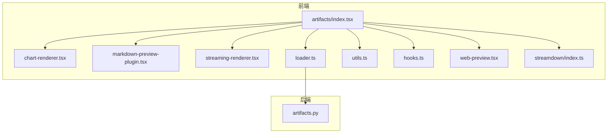
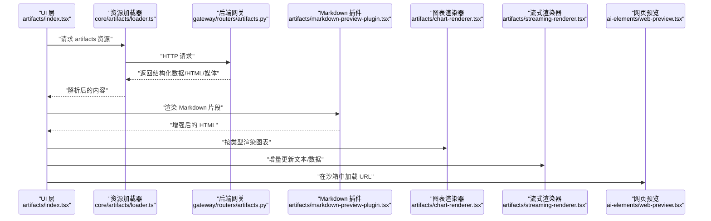
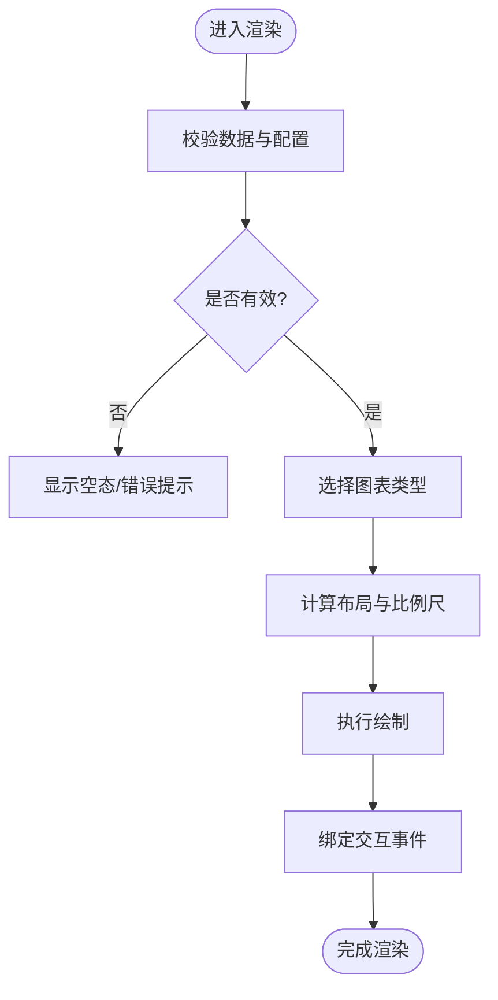
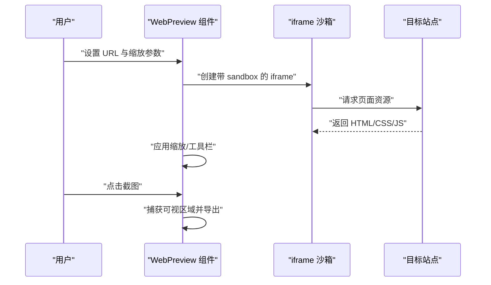
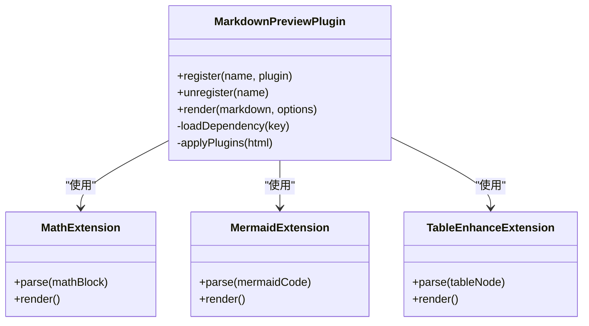
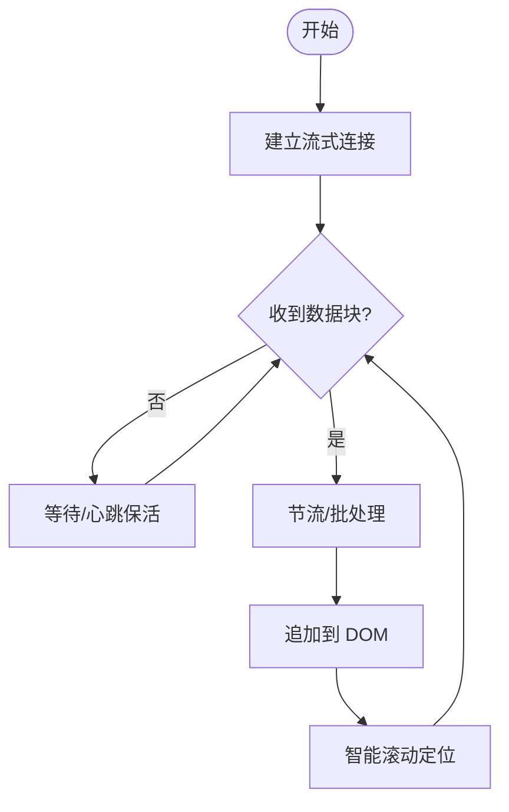
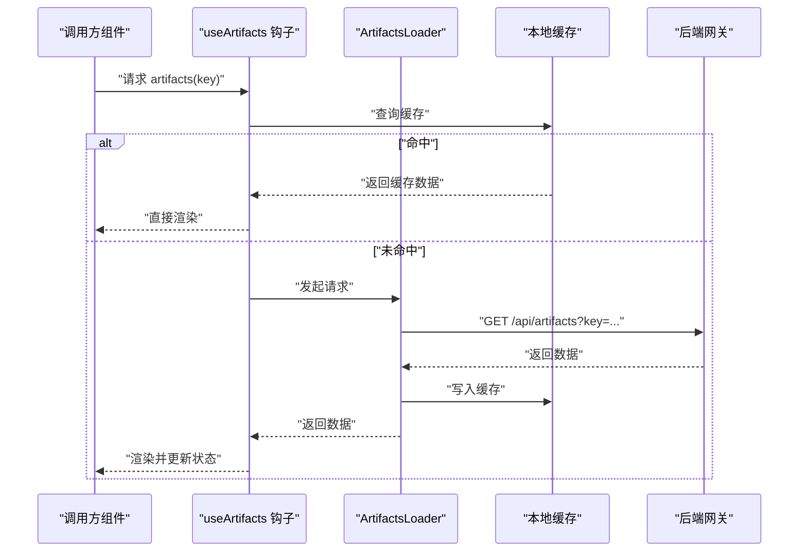
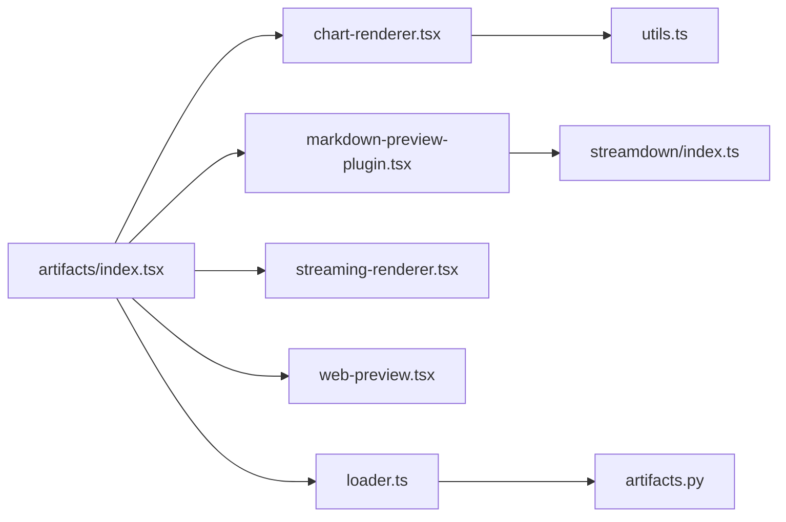

# 可视化组件

<cite>
**本文引用的文件**   
- [frontend/src/components/ai-elements/web-preview.tsx](file://frontend/src/components/ai-elements/web-preview.tsx)
- [frontend/src/components/artifacts/index.tsx](file://frontend/src/components/artifacts/index.tsx)
- [frontend/src/components/artifacts/chart-renderer.tsx](file://frontend/src/components/artifacts/chart-renderer.tsx)
- [frontend/src/components/artifacts/markdown-preview-plugin.tsx](file://frontend/src/components/artifacts/markdown-preview-plugin.tsx)
- [frontend/src/components/artifacts/streaming-renderer.tsx](file://frontend/src/components/artifacts/streaming-renderer.tsx)
- [frontend/src/core/artifacts/loader.ts](file://frontend/src/core/artifacts/loader.ts)
- [frontend/src/core/artifacts/utils.ts](file://frontend/src/core/artifacts/utils.ts)
- [frontend/src/core/artifacts/hooks.ts](file://frontend/src/core/artifacts/hooks.ts)
- [frontend/src/core/streamdown/index.ts](file://frontend/src/core/streamdown/index.ts)
- [backend/app/gateway/routers/artifacts.py](file://backend/app/gateway/routers/artifacts.py)
</cite>

## 目录
1. [简介](#简介)
2. [项目结构](#项目结构)
3. [核心组件](#核心组件)
4. [架构总览](#架构总览)
5. [详细组件分析](#详细组件分析)
6. [依赖关系分析](#依赖关系分析)
7. [性能考虑](#性能考虑)
8. [故障排查指南](#故障排查指南)
9. [结论](#结论)
10. [附录](#附录)

## 简介
本文件面向开发者与使用者，系统化梳理并文档化以下可视化能力：
- 图表渲染组件：支持折线图、柱状图、饼图、散点图等数据可视化类型。
- 网页预览组件：用于嵌入和展示外部网页内容，包含安全沙箱、缩放控制、截图等能力。
- Markdown 预览插件系统：支持数学公式、Mermaid 图表、表格增强等扩展功能。
- 流式渲染组件：实现渐进式内容展示与实时更新效果。
- 定制方法与性能优化策略：包括响应式设计与跨浏览器兼容性指导。

## 项目结构
前端以 Next.js 为框架，可视化相关代码主要分布在 components/artifacts 与 core/artifacts、core/streamdown 等目录；后端通过网关路由提供 artifacts 资源访问能力。下图给出与可视化相关的模块概览。

**图示来源** 
- [frontend/src/components/artifacts/index.tsx:1-200](file://frontend/src/components/artifacts/index.tsx#L1-L200)
- [frontend/src/components/artifacts/chart-renderer.tsx:1-200](file://frontend/src/components/artifacts/chart-renderer.tsx#L1-L200)
- [frontend/src/components/artifacts/markdown-preview-plugin.tsx:1-200](file://frontend/src/components/artifacts/markdown-preview-plugin.tsx#L1-L200)
- [frontend/src/components/artifacts/streaming-renderer.tsx:1-200](file://frontend/src/components/artifacts/streaming-renderer.tsx#L1-L200)
- [frontend/src/components/ai-elements/web-preview.tsx:1-200](file://frontend/src/components/ai-elements/web-preview.tsx#L1-L200)
- [frontend/src/core/artifacts/loader.ts:1-200](file://frontend/src/core/artifacts/loader.ts#L1-L200)
- [frontend/src/core/artifacts/utils.ts:1-200](file://frontend/src/core/artifacts/utils.ts#L1-L200)
- [frontend/src/core/artifacts/hooks.ts:1-200](file://frontend/src/core/artifacts/hooks.ts#L1-L200)
- [frontend/src/core/streamdown/index.ts:1-200](file://frontend/src/core/streamdown/index.ts#L1-L200)
- [backend/app/gateway/routers/artifacts.py:1-200](file://backend/app/gateway/routers/artifacts.py#L1-L200)

**章节来源**
- [frontend/src/components/artifacts/index.tsx:1-200](file://frontend/src/components/artifacts/index.tsx#L1-L200)
- [frontend/src/core/artifacts/loader.ts:1-200](file://frontend/src/core/artifacts/loader.ts#L1-L200)
- [backend/app/gateway/routers/artifacts.py:1-200](file://backend/app/gateway/routers/artifacts.py#L1-L200)

## 核心组件
- 图表渲染器（ChartRenderer）
  - 职责：根据传入的数据与配置，渲染折线、柱状、饼图、散点等多种图表类型。
  - 关键特性：主题适配、响应式尺寸、动画过渡、交互提示。
- Markdown 预览插件（MarkdownPreviewPlugin）
  - 职责：在 Markdown 渲染管线中注入扩展能力，如数学公式、Mermaid 流程图、表格增强等。
  - 关键特性：插件注册机制、按需加载、错误降级。
- 流式渲染器（StreamingRenderer）
  - 职责：对长文本或增量数据进行分块渲染，实现“打字机”式渐进展示。
  - 关键特性：节流/防抖、断点续渲、可暂停/恢复。
- 网页预览（WebPreview）
  - 职责：在沙箱 iframe 中安全加载外部页面，提供缩放、导航、截图等工具栏。
  - 关键特性：sandbox 策略、CSP 头、跨域限制、截图导出。
- 资源加载器与工具（ArtifactsLoader / Utils / Hooks）
  - 职责：统一加载 artifacts 资源、缓存、状态管理、错误处理与重试。

**章节来源**
- [frontend/src/components/artifacts/chart-renderer.tsx:1-200](file://frontend/src/components/artifacts/chart-renderer.tsx#L1-L200)
- [frontend/src/components/artifacts/markdown-preview-plugin.tsx:1-200](file://frontend/src/components/artifacts/markdown-preview-plugin.tsx#L1-L200)
- [frontend/src/components/artifacts/streaming-renderer.tsx:1-200](file://frontend/src/components/artifacts/streaming-renderer.tsx#L1-L200)
- [frontend/src/components/ai-elements/web-preview.tsx:1-200](file://frontend/src/components/ai-elements/web-preview.tsx#L1-L200)
- [frontend/src/core/artifacts/loader.ts:1-200](file://frontend/src/core/artifacts/loader.ts#L1-L200)
- [frontend/src/core/artifacts/utils.ts:1-200](file://frontend/src/core/artifacts/utils.ts#L1-L200)
- [frontend/src/core/artifacts/hooks.ts:1-200](file://frontend/src/core/artifacts/hooks.ts#L1-L200)

## 架构总览
下图展示了从后端到前端的端到端数据流与渲染路径，涵盖 artifacts 资源获取、Markdown 渲染、图表渲染与网页预览。

**图示来源** 
- [frontend/src/components/artifacts/index.tsx:1-200](file://frontend/src/components/artifacts/index.tsx#L1-L200)
- [frontend/src/core/artifacts/loader.ts:1-200](file://frontend/src/core/artifacts/loader.ts#L1-L200)
- [backend/app/gateway/routers/artifacts.py:1-200](file://backend/app/gateway/routers/artifacts.py#L1-L200)
- [frontend/src/components/artifacts/markdown-preview-plugin.tsx:1-200](file://frontend/src/components/artifacts/markdown-preview-plugin.tsx#L1-L200)
- [frontend/src/components/artifacts/chart-renderer.tsx:1-200](file://frontend/src/components/artifacts/chart-renderer.tsx#L1-L200)
- [frontend/src/components/artifacts/streaming-renderer.tsx:1-200](file://frontend/src/components/artifacts/streaming-renderer.tsx#L1-L200)
- [frontend/src/components/ai-elements/web-preview.tsx:1-200](file://frontend/src/components/ai-elements/web-preview.tsx#L1-L200)

## 详细组件分析

### 图表渲染组件（ChartRenderer）
- 设计要点
  - 数据契约：统一输入数据结构（系列、维度、度量、样式），内部转换为各图表库所需格式。
  - 类型分发：根据 type 字段选择具体渲染器（折线、柱状、饼、散点）。
  - 响应式：基于容器尺寸变化重算布局，避免重复绘制。
  - 主题：继承全局主题变量，支持明暗模式切换。
- 关键流程
  - 接收 props → 校验数据 → 选择渲染器 → 计算布局 → 绘制 → 绑定交互事件。
- 复杂度与优化
  - 大数据集采用抽样/聚合、虚拟滚动、增量更新。
  - 使用 requestAnimationFrame 合并绘制批次。
- 错误处理
  - 数据缺失/异常时回退到空态占位与友好提示。

**图示来源** 
- [frontend/src/components/artifacts/chart-renderer.tsx:1-200](file://frontend/src/components/artifacts/chart-renderer.tsx#L1-L200)

**章节来源**
- [frontend/src/components/artifacts/chart-renderer.tsx:1-200](file://frontend/src/components/artifacts/chart-renderer.tsx#L1-L200)
- [frontend/src/core/artifacts/utils.ts:1-200](file://frontend/src/core/artifacts/utils.ts#L1-L200)

### 网页预览组件（WebPreview）
- 设计要点
  - 安全沙箱：通过 iframe sandbox 属性限制脚本、表单、弹窗等能力，仅开放必要权限。
  - 缩放控制：提供缩放滑块与重置按钮，适配不同屏幕密度。
  - 截图导出：将可见区域渲染为图片并提供下载。
  - 跨域与 CSP：配合后端设置合适的 Content-Security-Policy，限制外链行为。
- 关键流程
  - 初始化沙箱 → 加载目标 URL → 监听缩放/导航事件 → 触发截图 → 清理资源。
- 错误处理
  - 网络失败、跨域拒绝、页面崩溃时的降级展示与重试策略。

**图示来源** 
- [frontend/src/components/ai-elements/web-preview.tsx:1-200](file://frontend/src/components/ai-elements/web-preview.tsx#L1-L200)

**章节来源**
- [frontend/src/components/ai-elements/web-preview.tsx:1-200](file://frontend/src/components/ai-elements/web-preview.tsx#L1-L200)

### Markdown 预览插件系统（MarkdownPreviewPlugin）
- 设计要点
  - 插件接口：定义统一的注册/卸载、生命周期钩子（before/after render）。
  - 内置扩展：数学公式（KaTeX/MathJax）、Mermaid 流程图、表格增强（排序/筛选）。
  - 按需加载：仅在检测到对应语法时加载相应库，减少首屏体积。
- 关键流程
  - 解析 Markdown → 识别扩展标记 → 动态加载插件 → 生成增强 DOM → 插入结果。
- 错误处理
  - 插件加载失败时静默降级，保留基础 Markdown 渲染。

**图示来源** 
- [frontend/src/components/artifacts/markdown-preview-plugin.tsx:1-200](file://frontend/src/components/artifacts/markdown-preview-plugin.tsx#L1-L200)

**章节来源**
- [frontend/src/components/artifacts/markdown-preview-plugin.tsx:1-200](file://frontend/src/components/artifacts/markdown-preview-plugin.tsx#L1-L200)

### 流式渲染组件（StreamingRenderer）
- 设计要点
  - 增量拼接：将流式数据块逐步拼接到已渲染内容末尾。
  - 节流与批处理：控制渲染频率，避免频繁重排。
  - 断点续渲：记录上次渲染位置，刷新后继续。
- 关键流程
  - 建立连接 → 接收数据块 → 节流合并 → 追加渲染 → 滚动定位。
- 错误处理
  - 连接中断自动重连，渲染失败回滚至上一稳定状态。

**图示来源** 
- [frontend/src/components/artifacts/streaming-renderer.tsx:1-200](file://frontend/src/components/artifacts/streaming-renderer.tsx#L1-L200)
- [frontend/src/core/streamdown/index.ts:1-200](file://frontend/src/core/streamdown/index.ts#L1-L200)

**章节来源**
- [frontend/src/components/artifacts/streaming-renderer.tsx:1-200](file://frontend/src/components/artifacts/streaming-renderer.tsx#L1-L200)
- [frontend/src/core/streamdown/index.ts:1-200](file://frontend/src/core/streamdown/index.ts#L1-L200)

### 资源加载与状态管理（ArtifactsLoader / Hooks / Utils）
- 职责
  - 统一发起 artifacts 请求、缓存命中、错误重试与超时控制。
  - 提供 React hooks 封装常用状态（加载中、错误、重试次数）。
  - 通用工具函数（URL 规范化、MIME 判断、大小写转换等）。
- 关键点
  - 缓存策略：内存缓存 + 可选持久化。
  - 幂等性：相同 key 的请求去重。
  - 可观测性：上报加载耗时与错误码。

**图示来源** 
- [frontend/src/core/artifacts/hooks.ts:1-200](file://frontend/src/core/artifacts/hooks.ts#L1-L200)
- [frontend/src/core/artifacts/loader.ts:1-200](file://frontend/src/core/artifacts/loader.ts#L1-L200)
- [backend/app/gateway/routers/artifacts.py:1-200](file://backend/app/gateway/routers/artifacts.py#L1-L200)

**章节来源**
- [frontend/src/core/artifacts/hooks.ts:1-200](file://frontend/src/core/artifacts/hooks.ts#L1-L200)
- [frontend/src/core/artifacts/loader.ts:1-200](file://frontend/src/core/artifacts/loader.ts#L1-L200)
- [frontend/src/core/artifacts/utils.ts:1-200](file://frontend/src/core/artifacts/utils.ts#L1-L200)
- [backend/app/gateway/routers/artifacts.py:1-200](file://backend/app/gateway/routers/artifacts.py#L1-L200)

## 依赖关系分析
- 组件耦合
  - artifacts/index.tsx 作为编排入口，组合图表、Markdown、流式与网页预览。
  - chart-renderer 依赖 utils 进行数据预处理与类型判定。
  - markdown-preview-plugin 依赖 streamdown 进行增量渲染辅助。
  - web-preview 独立性强，主要通过 iframe 与外部站点通信。
- 外部依赖
  - 图表库（如 ECharts/AntV）按需引入。
  - 数学公式与 Mermaid 按需加载，降低首屏开销。
- 潜在循环依赖
  - 通过 hooks 与 loader 解耦组件与网络层，避免循环引用。

**图示来源** 
- [frontend/src/components/artifacts/index.tsx:1-200](file://frontend/src/components/artifacts/index.tsx#L1-L200)
- [frontend/src/components/artifacts/chart-renderer.tsx:1-200](file://frontend/src/components/artifacts/chart-renderer.tsx#L1-L200)
- [frontend/src/components/artifacts/markdown-preview-plugin.tsx:1-200](file://frontend/src/components/artifacts/markdown-preview-plugin.tsx#L1-L200)
- [frontend/src/components/artifacts/streaming-renderer.tsx:1-200](file://frontend/src/components/artifacts/streaming-renderer.tsx#L1-L200)
- [frontend/src/components/ai-elements/web-preview.tsx:1-200](file://frontend/src/components/ai-elements/web-preview.tsx#L1-L200)
- [frontend/src/core/artifacts/utils.ts:1-200](file://frontend/src/core/artifacts/utils.ts#L1-L200)
- [frontend/src/core/artifacts/loader.ts:1-200](file://frontend/src/core/artifacts/loader.ts#L1-L200)
- [frontend/src/core/streamdown/index.ts:1-200](file://frontend/src/core/streamdown/index.ts#L1-L200)
- [backend/app/gateway/routers/artifacts.py:1-200](file://backend/app/gateway/routers/artifacts.py#L1-L200)

**章节来源**
- [frontend/src/components/artifacts/index.tsx:1-200](file://frontend/src/components/artifacts/index.tsx#L1-L200)
- [frontend/src/core/artifacts/loader.ts:1-200](file://frontend/src/core/artifacts/loader.ts#L1-L200)

## 性能考虑
- 渲染性能
  - 图表大数据集：采样、聚合、增量更新、requestAnimationFrame 批量绘制。
  - Markdown 大文档：分片渲染、懒加载插件、虚拟列表。
  - 流式渲染：节流/批处理、DOM 操作最小化、滚动锚点优化。
- 网络与缓存
  - 请求去重、缓存命中优先、断网降级与重试策略。
- 内存与资源
  - 组件卸载时释放事件监听、定时器与第三方实例。
  - 按需加载数学公式与 Mermaid，避免首屏阻塞。
- 响应式与兼容
  - 使用 ResizeObserver 监听容器变化，避免固定尺寸导致的溢出。
  - 针对 Safari/IE 等差异做 polyfill 与降级方案。

[本节为通用建议，不直接分析具体文件]

## 故障排查指南
- 常见问题
  - 图表空白：检查数据格式与必填字段、确认图表类型匹配。
  - Markdown 公式不显示：确认插件已加载且语法正确。
  - 网页预览白屏：检查 sandbox 权限、CSP 策略与跨域限制。
  - 流式渲染卡顿：调整节流阈值、减少每次渲染节点数量。
- 定位步骤
  - 查看网络面板确认 artifacts 请求状态码与响应体。
  - 打开控制台日志，关注插件加载与渲染错误堆栈。
  - 使用浏览器性能面板分析重绘/回流热点。

**章节来源**
- [frontend/src/core/artifacts/loader.ts:1-200](file://frontend/src/core/artifacts/loader.ts#L1-L200)
- [frontend/src/components/artifacts/markdown-preview-plugin.tsx:1-200](file://frontend/src/components/artifacts/markdown-preview-plugin.tsx#L1-L200)
- [frontend/src/components/ai-elements/web-preview.tsx:1-200](file://frontend/src/components/ai-elements/web-preview.tsx#L1-L200)
- [frontend/src/components/artifacts/streaming-renderer.tsx:1-200](file://frontend/src/components/artifacts/streaming-renderer.tsx#L1-L200)

## 结论
本可视化子系统围绕 artifacts 的统一编排，提供了图表、Markdown 增强、网页预览与流式渲染四大核心能力。通过清晰的组件边界、按需加载与完善的错误处理，既保证了用户体验，也兼顾了性能与安全性。后续可在插件生态、主题系统与国际化方面持续演进。

[本节为总结性内容，不直接分析具体文件]

## 附录
- 定制方法
  - 新增图表类型：在 chart-renderer 中注册新类型映射与渲染逻辑。
  - 新增 Markdown 插件：实现标准接口并通过 register 注册。
  - 自定义网页预览工具栏：扩展 WebPreview 的工具项与事件回调。
- 最佳实践
  - 保持数据契约稳定，变更需向后兼容。
  - 所有外部资源加载均需具备降级与超时保护。
  - 对敏感页面启用严格 sandbox 与 CSP。

[本节为补充说明，不直接分析具体文件]