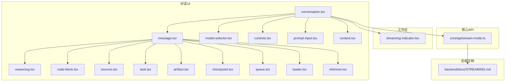
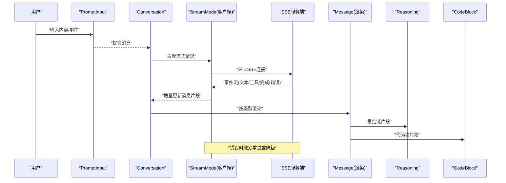
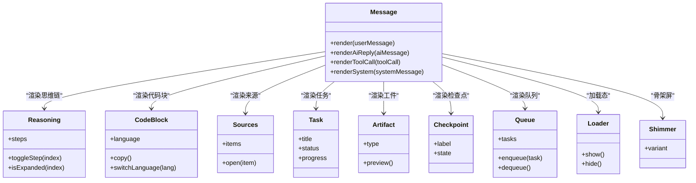
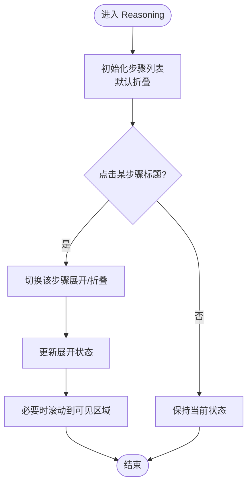
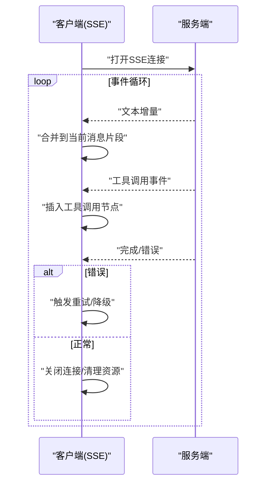
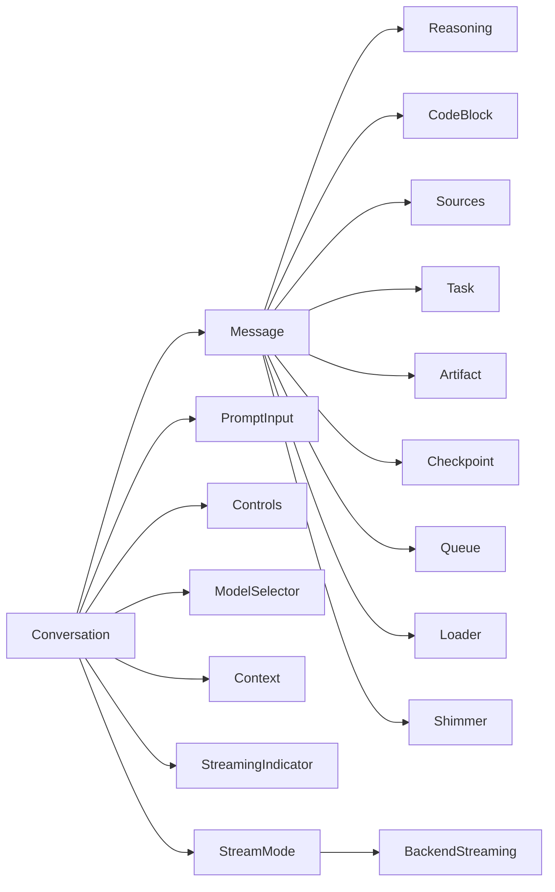

# 对话组件

<cite>
**本文引用的文件**   
- [frontend/src/components/ai-elements/message.tsx](file://frontend/src/components/ai-elements/message.tsx)
- [frontend/src/components/ai-elements/conversation.tsx](file://frontend/src/components/ai-elements/conversation.tsx)
- [frontend/src/components/ai-elements/reasoning.tsx](file://frontend/src/components/ai-elements/reasoning.tsx)
- [frontend/src/components/ai-elements/code-block.tsx](file://frontend/src/components/ai-elements/code-block.tsx)
- [frontend/src/components/ai-elements/prompt-input.tsx](file://frontend/src/components/ai-elements/prompt-input.tsx)
- [frontend/src/components/ai-elements/sources.tsx](file://frontend/src/components/ai-elements/sources.tsx)
- [frontend/src/components/ai-elements/task.tsx](file://frontend/src/components/ai-elements/task.tsx)
- [frontend/src/components/ai-elements/artifact.tsx](file://frontend/src/components/ai-elements/artifact.tsx)
- [frontend/src/components/ai-elements/checkpoint.tsx](file://frontend/src/components/ai-elements/checkpoint.tsx)
- [frontend/src/components/ai-elements/queue.tsx](file://frontend/src/components/ai-elements/queue.tsx)
- [frontend/src/components/ai-elements/loader.tsx](file://frontend/src/components/ai-elements/loader.tsx)
- [frontend/src/components/ai-elements/shimmer.tsx](file://frontend/src/components/ai-elements/shimmer.tsx)
- [frontend/src/components/ai-elements/model-selector.tsx](file://frontend/src/components/ai-elements/model-selector.tsx)
- [frontend/src/components/ai-elements/controls.tsx](file://frontend/src/components/ai-elements/controls.tsx)
- [frontend/src/components/ai-elements/context.tsx](file://frontend/src/components/ai-elements/context.tsx)
- [frontend/src/components/workspace/streaming-indicator.tsx](file://frontend/src/components/workspace/streaming-indicator.tsx)
- [frontend/src/core/api/stream-mode.ts](file://frontend/src/core/api/stream-mode.ts)
- [backend/docs/STREAMING.md](file://backend/docs/STREAMING.md)
</cite>

## 目录
1. [简介](#简介)
2. [项目结构](#项目结构)
3. [核心组件](#核心组件)
4. [架构总览](#架构总览)
5. [详细组件分析](#详细组件分析)
6. [依赖分析](#依赖分析)
7. [性能考虑](#性能考虑)
8. [故障排查指南](#故障排查指南)
9. [结论](#结论)
10. [附录](#附录)

## 简介
本文件面向 DeerFlow 前端“对话”相关组件，聚焦以下目标：
- 消息气泡组件：用户消息、AI 回复、工具调用结果等类型的渲染逻辑与组合方式。
- 思维链展示组件：推理过程可视化、步骤展开折叠、状态指示。
- 代码块渲染组件：语法高亮、复制功能、多语言切换等特性。
- 流式响应显示机制：SSE 连接处理、增量更新、错误重试。
- 组件定制指南与性能优化建议，并给出使用示例与最佳实践。

## 项目结构
对话能力由一组 React 组件构成，围绕“会话上下文 + 消息列表 + 输入框 + 流式指示器”组织。关键位置如下：
- ai-elements：对话 UI 的核心组件集合（消息、思维链、代码块、任务、来源、占位符等）。
- workspace：工作区容器与全局流式状态指示。
- core/api：流式模式定义与客户端侧的流式协议约定。
- backend/docs：后端流式协议文档，指导前后端交互。

图表来源
- [frontend/src/components/ai-elements/conversation.tsx](file://frontend/src/components/ai-elements/conversation.tsx)
- [frontend/src/components/ai-elements/message.tsx](file://frontend/src/components/ai-elements/message.tsx)
- [frontend/src/components/ai-elements/reasoning.tsx](file://frontend/src/components/ai-elements/reasoning.tsx)
- [frontend/src/components/ai-elements/code-block.tsx](file://frontend/src/components/ai-elements/code-block.tsx)
- [frontend/src/components/ai-elements/sources.tsx](file://frontend/src/components/ai-elements/sources.tsx)
- [frontend/src/components/ai-elements/task.tsx](file://frontend/src/components/ai-elements/task.tsx)
- [frontend/src/components/ai-elements/artifact.tsx](file://frontend/src/components/ai-elements/artifact.tsx)
- [frontend/src/components/ai-elements/checkpoint.tsx](file://frontend/src/components/ai-elements/checkpoint.tsx)
- [frontend/src/components/ai-elements/queue.tsx](file://frontend/src/components/ai-elements/queue.tsx)
- [frontend/src/components/ai-elements/loader.tsx](file://frontend/src/components/ai-elements/loader.tsx)
- [frontend/src/components/ai-elements/shimmer.tsx](file://frontend/src/components/ai-elements/shimmer.tsx)
- [frontend/src/components/ai-elements/model-selector.tsx](file://frontend/src/components/ai-elements/model-selector.tsx)
- [frontend/src/components/ai-elements/controls.tsx](file://frontend/src/components/ai-elements/controls.tsx)
- [frontend/src/components/ai-elements/prompt-input.tsx](file://frontend/src/components/ai-elements/prompt-input.tsx)
- [frontend/src/components/ai-elements/context.tsx](file://frontend/src/components/ai-elements/context.tsx)
- [frontend/src/components/workspace/streaming-indicator.tsx](file://frontend/src/components/workspace/streaming-indicator.tsx)
- [frontend/src/core/api/stream-mode.ts](file://frontend/src/core/api/stream-mode.ts)
- [backend/docs/STREAMING.md](file://backend/docs/STREAMING.md)

章节来源
- [frontend/src/components/ai-elements/conversation.tsx](file://frontend/src/components/ai-elements/conversation.tsx)
- [frontend/src/components/ai-elements/message.tsx](file://frontend/src/components/ai-elements/message.tsx)
- [frontend/src/core/api/stream-mode.ts](file://frontend/src/core/api/stream-mode.ts)
- [backend/docs/STREAMING.md](file://backend/docs/STREAMING.md)

## 核心组件
- 消息气泡（Message）：统一的消息渲染入口，根据消息类型路由到不同子组件（文本、思维链、代码块、任务、来源、检查点、队列、加载骨架等）。
- 对话容器（Conversation）：管理消息列表、滚动定位、输入与发送、模型选择、控制按钮、流式状态联动。
- 思维链（Reasoning）：以可折叠步骤呈现推理过程，支持逐步展开与状态指示。
- 代码块（CodeBlock）：提供语法高亮、复制、语言切换等能力。
- 来源（Sources）、任务（Task）、工件（Artifact）、检查点（Checkpoint）、队列（Queue）、加载（Loader/Shimmer）：辅助信息展示与占位。
- 输入框（PromptInput）：承载用户输入、附件、快捷键等。
- 模型选择（ModelSelector）与控件（Controls）：切换模型、停止生成、清空历史等。
- 上下文（Context）：为对话组件提供共享状态（如当前线程、消息、流式状态等）。
- 流式指示器（StreamingIndicator）：在页面级提示是否处于流式输出中。

章节来源
- [frontend/src/components/ai-elements/message.tsx](file://frontend/src/components/ai-elements/message.tsx)
- [frontend/src/components/ai-elements/conversation.tsx](file://frontend/src/components/ai-elements/conversation.tsx)
- [frontend/src/components/ai-elements/reasoning.tsx](file://frontend/src/components/ai-elements/reasoning.tsx)
- [frontend/src/components/ai-elements/code-block.tsx](file://frontend/src/components/ai-elements/code-block.tsx)
- [frontend/src/components/ai-elements/sources.tsx](file://frontend/src/components/ai-elements/sources.tsx)
- [frontend/src/components/ai-elements/task.tsx](file://frontend/src/components/ai-elements/task.tsx)
- [frontend/src/components/ai-elements/artifact.tsx](file://frontend/src/components/ai-elements/artifact.tsx)
- [frontend/src/components/ai-elements/checkpoint.tsx](file://frontend/src/components/ai-elements/checkpoint.tsx)
- [frontend/src/components/ai-elements/queue.tsx](file://frontend/src/components/ai-elements/queue.tsx)
- [frontend/src/components/ai-elements/loader.tsx](file://frontend/src/components/ai-elements/loader.tsx)
- [frontend/src/components/ai-elements/shimmer.tsx](file://frontend/src/components/ai-elements/shimmer.tsx)
- [frontend/src/components/ai-elements/prompt-input.tsx](file://frontend/src/components/ai-elements/prompt-input.tsx)
- [frontend/src/components/ai-elements/model-selector.tsx](file://frontend/src/components/ai-elements/model-selector.tsx)
- [frontend/src/components/ai-elements/controls.tsx](file://frontend/src/components/ai-elements/controls.tsx)
- [frontend/src/components/ai-elements/context.tsx](file://frontend/src/components/ai-elements/context.tsx)
- [frontend/src/components/workspace/streaming-indicator.tsx](file://frontend/src/components/workspace/streaming-indicator.tsx)

## 架构总览
对话组件采用“容器 + 渲染器”的分层设计：
- 容器层（Conversation）负责编排消息、输入、控制与流式状态。
- 渲染层（Message 及其子组件）负责将结构化数据渲染为 UI。
- 流式协议层（core/api/stream-mode.ts）定义事件类型与增量更新语义，并与后端 STREAMING 文档对齐。

图表来源
- [frontend/src/components/ai-elements/conversation.tsx](file://frontend/src/components/ai-elements/conversation.tsx)
- [frontend/src/components/ai-elements/message.tsx](file://frontend/src/components/ai-elements/message.tsx)
- [frontend/src/components/ai-elements/reasoning.tsx](file://frontend/src/components/ai-elements/reasoning.tsx)
- [frontend/src/components/ai-elements/code-block.tsx](file://frontend/src/components/ai-elements/code-block.tsx)
- [frontend/src/core/api/stream-mode.ts](file://frontend/src/core/api/stream-mode.ts)
- [backend/docs/STREAMING.md](file://backend/docs/STREAMING.md)

## 详细组件分析

### 消息气泡组件（Message）
- 职责：接收标准化消息对象，识别类型（用户/AI/工具/系统），分发至对应渲染器。
- 渲染策略：
  - 用户消息：右侧气泡，纯文本或富文本。
  - AI 回复：左侧气泡，支持内嵌思维链、代码块、来源引用、任务卡片、工件预览等。
  - 工具调用结果：以结构化卡片或折叠面板展示，包含名称、参数、输出摘要、状态。
- 组合关系：Message 作为门面，内部按需渲染 Reasoning、CodeBlock、Sources、Task、Artifact、Checkpoint、Queue、Loader/Shimmer 等。

图表来源
- [frontend/src/components/ai-elements/message.tsx](file://frontend/src/components/ai-elements/message.tsx)
- [frontend/src/components/ai-elements/reasoning.tsx](file://frontend/src/components/ai-elements/reasoning.tsx)
- [frontend/src/components/ai-elements/code-block.tsx](file://frontend/src/components/ai-elements/code-block.tsx)
- [frontend/src/components/ai-elements/sources.tsx](file://frontend/src/components/ai-elements/sources.tsx)
- [frontend/src/components/ai-elements/task.tsx](file://frontend/src/components/ai-elements/task.tsx)
- [frontend/src/components/ai-elements/artifact.tsx](file://frontend/src/components/ai-elements/artifact.tsx)
- [frontend/src/components/ai-elements/checkpoint.tsx](file://frontend/src/components/ai-elements/checkpoint.tsx)
- [frontend/src/components/ai-elements/queue.tsx](file://frontend/src/components/ai-elements/queue.tsx)
- [frontend/src/components/ai-elements/loader.tsx](file://frontend/src/components/ai-elements/loader.tsx)
- [frontend/src/components/ai-elements/shimmer.tsx](file://frontend/src/components/ai-elements/shimmer.tsx)

章节来源
- [frontend/src/components/ai-elements/message.tsx](file://frontend/src/components/ai-elements/message.tsx)

### 思维链展示组件（Reasoning）
- 功能要点：
  - 推理步骤数组化，支持逐步展开/折叠。
  - 每个步骤可携带状态（进行中/成功/失败/跳过）。
  - 支持点击标题切换展开，自动滚动到最新步骤。
- 交互流程：

图表来源
- [frontend/src/components/ai-elements/reasoning.tsx](file://frontend/src/components/ai-elements/reasoning.tsx)

章节来源
- [frontend/src/components/ai-elements/reasoning.tsx](file://frontend/src/components/ai-elements/reasoning.tsx)

### 代码块渲染组件（CodeBlock）
- 特性：
  - 语法高亮：基于语言标识进行着色。
  - 复制功能：一键复制代码到剪贴板，并提供反馈。
  - 多语言切换：允许手动指定或自动检测语言。
  - 行号与滚动：长代码友好展示。
- 使用建议：
  - 优先传递明确的 language 属性以获得最佳高亮效果。
  - 对超大代码块启用懒加载或分页渲染以提升性能。

章节来源
- [frontend/src/components/ai-elements/code-block.tsx](file://frontend/src/components/ai-elements/code-block.tsx)

### 流式响应显示机制（SSE）
- 协议约定：
  - 客户端通过 stream-mode 定义的事件类型解析增量内容（文本、工具调用、完成、错误等）。
  - 服务端遵循 STREAMING 文档，按事件推送增量数据。
- 客户端处理：
  - 建立 SSE 连接，监听事件流。
  - 增量更新消息片段，避免整段重绘。
  - 错误重试：网络异常或中断时，按策略重试或回退为一次性拉取。
- 序列图：

图表来源
- [frontend/src/core/api/stream-mode.ts](file://frontend/src/core/api/stream-mode.ts)
- [backend/docs/STREAMING.md](file://backend/docs/STREAMING.md)

章节来源
- [frontend/src/core/api/stream-mode.ts](file://frontend/src/core/api/stream-mode.ts)
- [backend/docs/STREAMING.md](file://backend/docs/STREAMING.md)

### 对话容器与输入（Conversation, PromptInput, Controls, ModelSelector）
- Conversation：
  - 维护消息列表、滚动锚点、流式状态。
  - 协调各子组件渲染与交互。
- PromptInput：
  - 支持多行输入、快捷键、附件上传。
  - 与 Conversation 集成，触发发送与重置。
- Controls：
  - 提供停止生成、清空历史等操作。
- ModelSelector：
  - 动态切换模型，影响后续请求参数。

章节来源
- [frontend/src/components/ai-elements/conversation.tsx](file://frontend/src/components/ai-elements/conversation.tsx)
- [frontend/src/components/ai-elements/prompt-input.tsx](file://frontend/src/components/ai-elements/prompt-input.tsx)
- [frontend/src/components/ai-elements/controls.tsx](file://frontend/src/components/ai-elements/controls.tsx)
- [frontend/src/components/ai-elements/model-selector.tsx](file://frontend/src/components/ai-elements/model-selector.tsx)

### 辅助组件（Sources, Task, Artifact, Checkpoint, Queue, Loader, Shimmer）
- Sources：来源引用列表，支持跳转与预览。
- Task：任务卡片，展示标题、进度、状态。
- Artifact：工件预览（图片、图表、文档等）。
- Checkpoint：检查点标记，用于分段展示或回溯。
- Queue：任务队列，展示待执行/执行中的任务。
- Loader/Shimmer：加载态与骨架屏，提升感知性能。

章节来源
- [frontend/src/components/ai-elements/sources.tsx](file://frontend/src/components/ai-elements/sources.tsx)
- [frontend/src/components/ai-elements/task.tsx](file://frontend/src/components/ai-elements/task.tsx)
- [frontend/src/components/ai-elements/artifact.tsx](file://frontend/src/components/ai-elements/artifact.tsx)
- [frontend/src/components/ai-elements/checkpoint.tsx](file://frontend/src/components/ai-elements/checkpoint.tsx)
- [frontend/src/components/ai-elements/queue.tsx](file://frontend/src/components/ai-elements/queue.tsx)
- [frontend/src/components/ai-elements/loader.tsx](file://frontend/src/components/ai-elements/loader.tsx)
- [frontend/src/components/ai-elements/shimmer.tsx](file://frontend/src/components/ai-elements/shimmer.tsx)

### 上下文与工作区（Context, StreamingIndicator）
- Context：为对话组件提供共享状态（如当前线程、消息、流式状态等）。
- StreamingIndicator：在工作区级别提示是否处于流式输出中，便于用户感知。

章节来源
- [frontend/src/components/ai-elements/context.tsx](file://frontend/src/components/ai-elements/context.tsx)
- [frontend/src/components/workspace/streaming-indicator.tsx](file://frontend/src/components/workspace/streaming-indicator.tsx)

## 依赖分析
- 组件耦合：
  - Message 强依赖 Reasoning、CodeBlock、Sources、Task、Artifact、Checkpoint、Queue、Loader、Shimmer。
  - Conversation 聚合上述所有渲染组件，并通过 Context 获取共享状态。
- 外部依赖：
  - 流式协议依赖 core/api/stream-mode.ts 与后端 STREAMING 文档对齐。
  - UI 基础组件来自 ui 目录（如 Button、Tabs、Dialog 等），用于增强交互体验。

图表来源
- [frontend/src/components/ai-elements/message.tsx](file://frontend/src/components/ai-elements/message.tsx)
- [frontend/src/components/ai-elements/conversation.tsx](file://frontend/src/components/ai-elements/conversation.tsx)
- [frontend/src/core/api/stream-mode.ts](file://frontend/src/core/api/stream-mode.ts)
- [backend/docs/STREAMING.md](file://backend/docs/STREAMING.md)

章节来源
- [frontend/src/components/ai-elements/message.tsx](file://frontend/src/components/ai-elements/message.tsx)
- [frontend/src/components/ai-elements/conversation.tsx](file://frontend/src/components/ai-elements/conversation.tsx)
- [frontend/src/core/api/stream-mode.ts](file://frontend/src/core/api/stream-mode.ts)
- [backend/docs/STREAMING.md](file://backend/docs/STREAMING.md)

## 性能考虑
- 增量渲染：利用流式事件增量更新消息片段，减少整段重绘。
- 虚拟滚动：当消息数量较大时，对消息列表启用虚拟滚动以降低内存占用。
- 代码块懒加载：大代码块延迟渲染或分页展示，避免首屏阻塞。
- 防抖与节流：输入框与搜索操作使用防抖；滚动与窗口缩放使用节流。
- 骨架屏与占位：在等待数据时使用 Shimmer/Loader 提升感知性能。
- 缓存与去重：对来源链接、模型列表等静态数据进行本地缓存。
- 错误降级：SSE 失败时回退为一次性拉取，保证可用性。

[本节为通用性能建议，不直接分析具体文件]

## 故障排查指南
- 流式连接问题：
  - 现象：长时间无增量、闪烁或中断。
  - 排查：检查 SSE 连接是否建立、事件类型是否正确解析、网络代理是否拦截。
  - 参考：查看 stream-mode 的事件定义与 STREAMING 文档的协议说明。
- 代码块高亮异常：
  - 现象：语言识别错误或高亮缺失。
  - 排查：确认传入 language 值是否受支持；检查语法高亮库版本。
- 思维链折叠失效：
  - 现象：点击无反应或状态不同步。
  - 排查：检查展开状态是否与步骤索引绑定正确；确认事件冒泡未被阻止。
- 复制失败：
  - 现象：点击复制无反馈或剪贴板写入失败。
  - 排查：浏览器权限与安全策略；降级方案为显示临时提示。

章节来源
- [frontend/src/core/api/stream-mode.ts](file://frontend/src/core/api/stream-mode.ts)
- [backend/docs/STREAMING.md](file://backend/docs/STREAMING.md)
- [frontend/src/components/ai-elements/code-block.tsx](file://frontend/src/components/ai-elements/code-block.tsx)
- [frontend/src/components/ai-elements/reasoning.tsx](file://frontend/src/components/ai-elements/reasoning.tsx)

## 结论
DeerFlow 对话组件通过清晰的“容器 + 渲染器”分层与标准化的流式协议，实现了高质量的用户体验：
- 消息气泡统一入口，灵活组合多种子组件。
- 思维链可视化增强可解释性。
- 代码块高亮与复制提升开发者效率。
- 流式响应确保实时性与稳定性。
结合本文的定制指南与性能优化建议，可在实际项目中快速落地并持续演进。

[本节为总结性内容，不直接分析具体文件]

## 附录
- 使用示例（路径指引）：
  - 在页面中引入 Conversation 组件，并传入必要的上下文与回调。
  - 通过 Message 的子组件扩展自定义消息类型（如新增“评测结果”卡片）。
  - 在 Reasoning 中接入新的步骤状态（如“验证中”）。
  - 在 CodeBlock 中配置默认语言与复制文案。
- 最佳实践：
  - 始终明确传递 language 给 CodeBlock。
  - 对长列表启用虚拟滚动与分页。
  - 为流式事件增加超时与重试策略。
  - 使用骨架屏提升首屏体验。

[本节为补充说明，不直接分析具体文件]