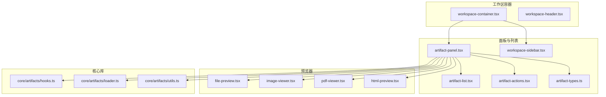
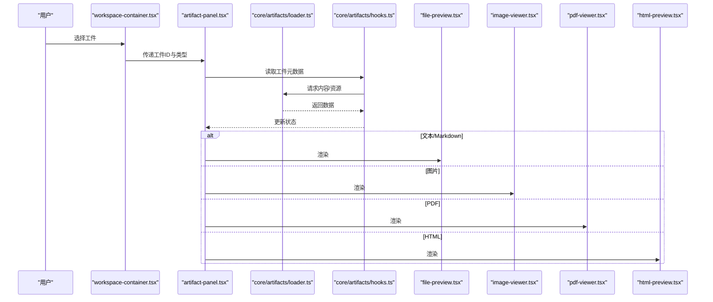
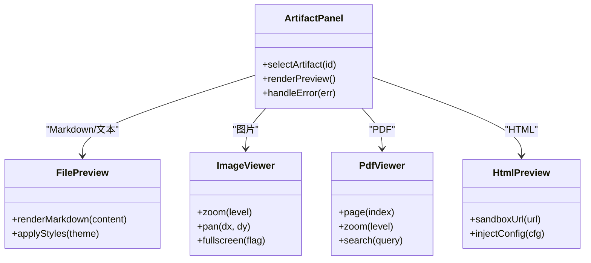
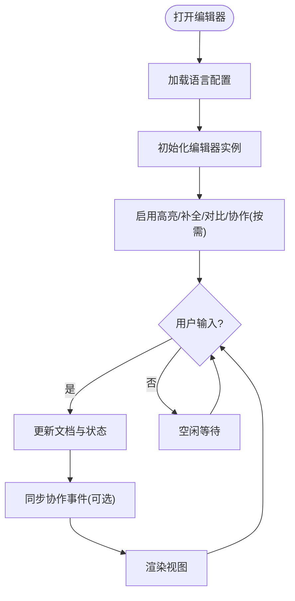
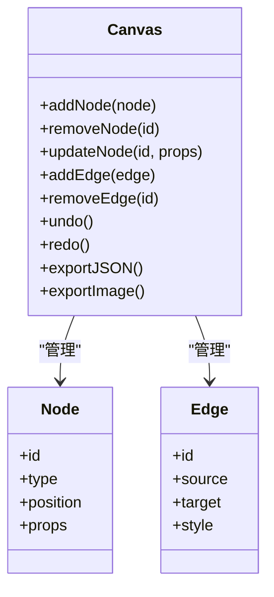
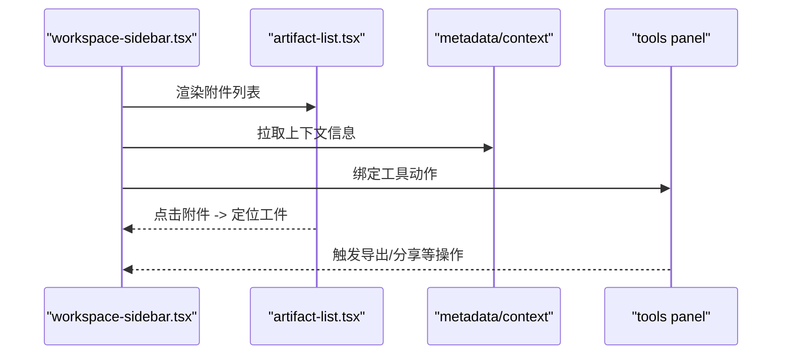
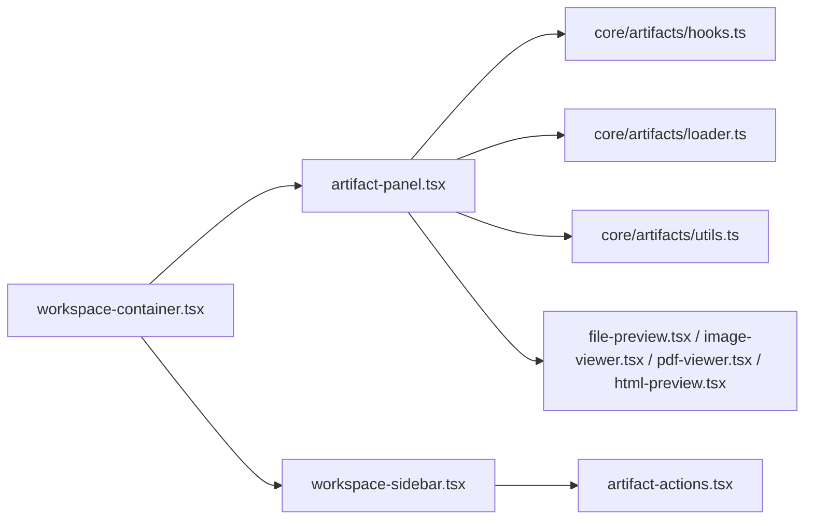

# 工作区组件

<cite>
**本文引用的文件**   
- [frontend/src/components/workspace/artifacts/file-preview.tsx](file://frontend/src/components/workspace/artifacts/file-preview.tsx)
- [frontend/src/components/workspace/artifacts/image-viewer.tsx](file://frontend/src/components/workspace/artifacts/image-viewer.tsx)
- [frontend/src/components/workspace/artifacts/pdf-viewer.tsx](file://frontend/src/components/workspace/artifacts/pdf-viewer.tsx)
- [frontend/src/components/workspace/artifacts/html-preview.tsx](file://frontend/src/components/workspace/artifacts/html-preview.tsx)
- [frontend/src/components/workspace/code-editor.tsx](file://frontend/src/components/workspace/code-editor.tsx)
- [frontend/src/components/ai-elements/canvas.tsx](file://frontend/src/components/ai-elements/canvas.tsx)
- [frontend/src/components/workspace/workspace-sidebar.tsx](file://frontend/src/components/workspace/workspace-sidebar.tsx)
- [frontend/src/components/workspace/artifacts/artifact-list.tsx](file://frontend/src/components/workspace/artifacts/artifact-list.tsx)
- [frontend/src/components/workspace/artifacts/artifact-panel.tsx](file://frontend/src/components/workspace/artifacts/artifact-panel.tsx)
- [frontend/src/components/workspace/artifacts/artifact-actions.tsx](file://frontend/src/components/workspace/artifacts/artifact-actions.tsx)
- [frontend/src/components/workspace/artifacts/artifact-types.ts](file://frontend/src/components/workspace/artifacts/artifact-types.ts)
- [frontend/src/core/artifacts/hooks.ts](file://frontend/src/core/artifacts/hooks.ts)
- [frontend/src/core/artifacts/loader.ts](file://frontend/src/core/artifacts/loader.ts)
- [frontend/src/core/artifacts/utils.ts](file://frontend/src/core/artifacts/utils.ts)
- [frontend/src/components/workspace/workspace-container.tsx](file://frontend/src/components/workspace/workspace-container.tsx)
- [frontend/src/components/workspace/workspace-header.tsx](file://frontend/src/components/workspace/workspace-header.tsx)
</cite>

## 目录
1. [简介](#简介)
2. [项目结构](#项目结构)
3. [核心组件](#核心组件)
4. [架构总览](#架构总览)
5. [详细组件分析](#详细组件分析)
6. [依赖分析](#依赖分析)
7. [性能考虑](#性能考虑)
8. [故障排查指南](#故障排查指南)
9. [结论](#结论)
10. [附录](#附录)

## 简介
本文件聚焦“工作区”前端组件体系，围绕以下目标展开：
- 文件预览：Markdown、图片、PDF、HTML 等多格式渲染与展示。
- 代码编辑器：语法高亮、自动补全、版本对比、实时协作等能力说明与集成要点。
- 画布组件：可视化图表、流程图、思维导图的创建与编辑。
- 侧边栏：参考附件管理、上下文信息展示、工具面板等。
- 集成与扩展：组件组合方式、二次开发方法、使用场景与性能调优建议。

## 项目结构
工作区相关的前端代码主要位于 frontend/src/components/workspace 与 frontend/src/components/ai-elements 下，配合 core/artifacts 提供数据加载与工具函数。整体采用“容器 + 面板 + 预览器”的分层组织方式：
- 容器层：负责布局、状态协调与生命周期（如 workspace-container）。
- 面板层：负责具体功能模块（如 artifact-panel、workspace-sidebar）。
- 预览器层：针对特定文件类型的渲染实现（如 file-preview、image-viewer、pdf-viewer、html-preview）。
- 核心库层：统一的数据加载、类型定义与通用工具（hooks、loader、utils）。

图示来源
- [frontend/src/components/workspace/workspace-container.tsx](file://frontend/src/components/workspace/workspace-container.tsx)
- [frontend/src/components/workspace/artifacts/artifact-panel.tsx](file://frontend/src/components/workspace/artifacts/artifact-panel.tsx)
- [frontend/src/components/workspace/artifacts/artifact-list.tsx](file://frontend/src/components/workspace/artifacts/artifact-list.tsx)
- [frontend/src/components/workspace/artifacts/artifact-actions.tsx](file://frontend/src/components/workspace/artifacts/artifact-actions.tsx)
- [frontend/src/components/workspace/artifacts/artifact-types.ts](file://frontend/src/components/workspace/artifacts/artifact-types.ts)
- [frontend/src/components/workspace/workspace-sidebar.tsx](file://frontend/src/components/workspace/workspace-sidebar.tsx)
- [frontend/src/components/workspace/artifacts/file-preview.tsx](file://frontend/src/components/workspace/artifacts/file-preview.tsx)
- [frontend/src/components/workspace/artifacts/image-viewer.tsx](file://frontend/src/components/workspace/artifacts/image-viewer.tsx)
- [frontend/src/components/workspace/artifacts/pdf-viewer.tsx](file://frontend/src/components/workspace/artifacts/pdf-viewer.tsx)
- [frontend/src/components/workspace/artifacts/html-preview.tsx](file://frontend/src/components/workspace/artifacts/html-preview.tsx)
- [frontend/src/core/artifacts/hooks.ts](file://frontend/src/core/artifacts/hooks.ts)
- [frontend/src/core/artifacts/loader.ts](file://frontend/src/core/artifacts/loader.ts)
- [frontend/src/core/artifacts/utils.ts](file://frontend/src/core/artifacts/utils.ts)

章节来源
- [frontend/src/components/workspace/workspace-container.tsx](file://frontend/src/components/workspace/workspace-container.tsx)
- [frontend/src/components/workspace/artifacts/artifact-panel.tsx](file://frontend/src/components/workspace/artifacts/artifact-panel.tsx)
- [frontend/src/core/artifacts/hooks.ts](file://frontend/src/core/artifacts/hooks.ts)
- [frontend/src/core/artifacts/loader.ts](file://frontend/src/core/artifacts/loader.ts)
- [frontend/src/core/artifacts/utils.ts](file://frontend/src/core/artifacts/utils.ts)

## 核心组件
本节概述工作区各关键组件的职责与交互关系，为后续深入分析奠定基础。

- 文件预览组件族
  - Markdown 渲染：通过 file-preview 对 .md/.markdown 进行安全渲染与样式适配。
  - 图片展示：image-viewer 支持缩放、平移、全屏等交互。
  - PDF 查看：pdf-viewer 提供分页、缩放、搜索等能力。
  - HTML 预览：html-preview 在沙箱环境中执行并隔离脚本风险。

- 代码编辑器组件
  - 语法高亮与自动补全：基于编辑器内核配置语言模式与补全源。
  - 版本对比：支持多版本差异视图与行级标注。
  - 实时协作：通过事件总线或 WebSocket 同步光标与变更（可选）。

- 画布组件
  - 用于绘制流程图、思维导图、网络图等；支持节点拖拽、连线、属性面板与撤销重做。

- 侧边栏组件
  - 参考附件管理：列出当前会话相关的上传与产物。
  - 上下文信息：显示元数据、标签、来源等。
  - 工具面板：快捷操作入口（导出、分享、设置等）。

章节来源
- [frontend/src/components/workspace/artifacts/file-preview.tsx](file://frontend/src/components/workspace/artifacts/file-preview.tsx)
- [frontend/src/components/workspace/artifacts/image-viewer.tsx](file://frontend/src/components/workspace/artifacts/image-viewer.tsx)
- [frontend/src/components/workspace/artifacts/pdf-viewer.tsx](file://frontend/src/components/workspace/artifacts/pdf-viewer.tsx)
- [frontend/src/components/workspace/artifacts/html-preview.tsx](file://frontend/src/components/workspace/artifacts/html-preview.tsx)
- [frontend/src/components/workspace/code-editor.tsx](file://frontend/src/components/workspace/code-editor.tsx)
- [frontend/src/components/ai-elements/canvas.tsx](file://frontend/src/components/ai-elements/canvas.tsx)
- [frontend/src/components/workspace/workspace-sidebar.tsx](file://frontend/src/components/workspace/workspace-sidebar.tsx)

## 架构总览
工作区以“面板驱动”的方式组织：artifact-panel 作为主面板，根据选中工件的类型动态挂载对应预览器；workspace-container 负责整体布局与状态；workspace-sidebar 提供辅助信息与操作。

图示来源
- [frontend/src/components/workspace/workspace-container.tsx](file://frontend/src/components/workspace/workspace-container.tsx)
- [frontend/src/components/workspace/artifacts/artifact-panel.tsx](file://frontend/src/components/workspace/artifacts/artifact-panel.tsx)
- [frontend/src/core/artifacts/loader.ts](file://frontend/src/core/artifacts/loader.ts)
- [frontend/src/core/artifacts/hooks.ts](file://frontend/src/core/artifacts/hooks.ts)
- [frontend/src/components/workspace/artifacts/file-preview.tsx](file://frontend/src/components/workspace/artifacts/file-preview.tsx)
- [frontend/src/components/workspace/artifacts/image-viewer.tsx](file://frontend/src/components/workspace/artifacts/image-viewer.tsx)
- [frontend/src/components/workspace/artifacts/pdf-viewer.tsx](file://frontend/src/components/workspace/artifacts/pdf-viewer.tsx)
- [frontend/src/components/workspace/artifacts/html-preview.tsx](file://frontend/src/components/workspace/artifacts/html-preview.tsx)

## 详细组件分析

### 文件预览组件族
文件预览组件族围绕 artifact-panel 的统一调度，按类型分发到具体渲染器。其职责包括：
- 类型识别与路由：根据工件类型决定使用哪个预览器。
- 资源加载与缓存：复用 loader 与 hooks 提供的数据获取与缓存策略。
- 安全渲染：对 HTML 与脚本执行进行隔离与白名单控制。
- 可访问性与国际化：遵循无障碍规范并提供本地化文案。

图示来源
- [frontend/src/components/workspace/artifacts/artifact-panel.tsx](file://frontend/src/components/workspace/artifacts/artifact-panel.tsx)
- [frontend/src/components/workspace/artifacts/file-preview.tsx](file://frontend/src/components/workspace/artifacts/file-preview.tsx)
- [frontend/src/components/workspace/artifacts/image-viewer.tsx](file://frontend/src/components/workspace/artifacts/image-viewer.tsx)
- [frontend/src/components/workspace/artifacts/pdf-viewer.tsx](file://frontend/src/components/workspace/artifacts/pdf-viewer.tsx)
- [frontend/src/components/workspace/artifacts/html-preview.tsx](file://frontend/src/components/workspace/artifacts/html-preview.tsx)

章节来源
- [frontend/src/components/workspace/artifacts/artifact-panel.tsx](file://frontend/src/components/workspace/artifacts/artifact-panel.tsx)
- [frontend/src/components/workspace/artifacts/file-preview.tsx](file://frontend/src/components/workspace/artifacts/file-preview.tsx)
- [frontend/src/components/workspace/artifacts/image-viewer.tsx](file://frontend/src/components/workspace/artifacts/image-viewer.tsx)
- [frontend/src/components/workspace/artifacts/pdf-viewer.tsx](file://frontend/src/components/workspace/artifacts/pdf-viewer.tsx)
- [frontend/src/components/workspace/artifacts/html-preview.tsx](file://frontend/src/components/workspace/artifacts/html-preview.tsx)

### 代码编辑器组件
代码编辑器组件提供面向开发者的高级编辑体验，典型能力如下：
- 语法高亮：按语言配置主题与词法规则。
- 自动补全：接入内置与自定义补全源，支持触发键与过滤策略。
- 版本对比：多版本切换与差异高亮，支持折叠与跳转。
- 实时协作：基于事件流同步光标位置与增量变更，冲突合并策略可插拔。
- 快捷键与命令面板：提升效率的操作路径。

章节来源
- [frontend/src/components/workspace/code-editor.tsx](file://frontend/src/components/workspace/code-editor.tsx)

### 画布组件
画布组件用于可视化图表、流程图、思维导图等的创建与编辑，具备：
- 节点与边的增删改查。
- 拖拽、缩放、网格对齐与吸附。
- 撤销/重做栈与快照。
- 导出为图片或 JSON 数据结构。

图示来源
- [frontend/src/components/ai-elements/canvas.tsx](file://frontend/src/components/ai-elements/canvas.tsx)

章节来源
- [frontend/src/components/ai-elements/canvas.tsx](file://frontend/src/components/ai-elements/canvas.tsx)

### 侧边栏组件
侧边栏承载参考附件、上下文信息与工具面板，常见职责：
- 参考附件管理：列出与当前工件关联的文件与链接，支持快速跳转与下载。
- 上下文信息：展示元数据、来源、标签、时间戳等。
- 工具面板：提供导出、分享、设置、帮助等快捷入口。

图示来源
- [frontend/src/components/workspace/workspace-sidebar.tsx](file://frontend/src/components/workspace/workspace-sidebar.tsx)
- [frontend/src/components/workspace/artifacts/artifact-list.tsx](file://frontend/src/components/workspace/artifacts/artifact-list.tsx)

章节来源
- [frontend/src/components/workspace/workspace-sidebar.tsx](file://frontend/src/components/workspace/workspace-sidebar.tsx)
- [frontend/src/components/workspace/artifacts/artifact-list.tsx](file://frontend/src/components/workspace/artifacts/artifact-list.tsx)

### 组件集成指南
- 容器装配
  - 在 workspace-container 中引入 artifact-panel 与 workspace-sidebar，并通过 props 注入当前工件 ID 与全局状态。
  - 使用 hooks 订阅工件变化，确保面板与侧边栏保持同步。
- 面板扩展
  - 新增预览器时，在 artifact-panel 的类型分支中添加新分支，并在 artifact-types 中注册类型常量。
  - 将新预览器置于 artifacts 目录下，遵循统一的 props 接口约定。
- 数据与工具
  - 通过 core/artifacts/loader 获取工件内容与资源，结合 hooks 管理加载状态与错误处理。
  - 使用 utils 中的通用函数进行类型判断、URL 解析与尺寸计算。
- 侧边栏增强
  - 在 workspace-sidebar 中增加新的工具项，绑定到 artifact-actions 的动作回调。
  - 将上下文信息从 hooks 或外部状态注入，避免重复请求。

章节来源
- [frontend/src/components/workspace/workspace-container.tsx](file://frontend/src/components/workspace/workspace-container.tsx)
- [frontend/src/components/workspace/artifacts/artifact-panel.tsx](file://frontend/src/components/workspace/artifacts/artifact-panel.tsx)
- [frontend/src/components/workspace/artifacts/artifact-types.ts](file://frontend/src/components/workspace/artifacts/artifact-types.ts)
- [frontend/src/core/artifacts/hooks.ts](file://frontend/src/core/artifacts/hooks.ts)
- [frontend/src/core/artifacts/loader.ts](file://frontend/src/core/artifacts/loader.ts)
- [frontend/src/core/artifacts/utils.ts](file://frontend/src/core/artifacts/utils.ts)
- [frontend/src/components/workspace/artifacts/artifact-actions.tsx](file://frontend/src/components/workspace/artifacts/artifact-actions.tsx)
- [frontend/src/components/workspace/workspace-sidebar.tsx](file://frontend/src/components/workspace/workspace-sidebar.tsx)

### 扩展开发方法
- 新增文件类型预览
  - 在 artifact-types 中声明新类型常量。
  - 新建 preview 组件，实现统一 props 接口（content、options、onError 等）。
  - 在 artifact-panel 的类型路由中注册该预览器。
- 扩展代码编辑器能力
  - 在 code-editor 中注册新的语言模式与补全源。
  - 如需协作，接入事件通道并在编辑器实例上监听/派发变更事件。
- 扩展画布节点类型
  - 在 canvas 中注册新节点类型及其渲染与交互逻辑。
  - 提供序列化/反序列化方法，保证导出导入一致性。
- 侧边栏插件化
  - 在 workspace-sidebar 中预留插件槽位，按配置动态挂载工具面板。
  - 通过 artifact-actions 暴露统一动作接口，便于跨组件调用。

章节来源
- [frontend/src/components/workspace/artifacts/artifact-types.ts](file://frontend/src/components/workspace/artifacts/artifact-types.ts)
- [frontend/src/components/workspace/artifacts/artifact-panel.tsx](file://frontend/src/components/workspace/artifacts/artifact-panel.tsx)
- [frontend/src/components/workspace/code-editor.tsx](file://frontend/src/components/workspace/code-editor.tsx)
- [frontend/src/components/ai-elements/canvas.tsx](file://frontend/src/components/ai-elements/canvas.tsx)
- [frontend/src/components/workspace/workspace-sidebar.tsx](file://frontend/src/components/workspace/workspace-sidebar.tsx)
- [frontend/src/components/workspace/artifacts/artifact-actions.tsx](file://frontend/src/components/workspace/artifacts/artifact-actions.tsx)

## 依赖分析
组件间依赖关系清晰，遵循单向数据流与低耦合原则：
- artifact-panel 依赖 core/artifacts 的 hooks、loader、utils。
- 预览器仅依赖基础 UI 与必要的第三方渲染库。
- workspace-container 聚合面板与侧边栏，不直接访问数据层。
- workspace-sidebar 与 artifact-list 解耦，通过事件或回调通信。

图示来源
- [frontend/src/components/workspace/workspace-container.tsx](file://frontend/src/components/workspace/workspace-container.tsx)
- [frontend/src/components/workspace/artifacts/artifact-panel.tsx](file://frontend/src/components/workspace/artifacts/artifact-panel.tsx)
- [frontend/src/components/workspace/workspace-sidebar.tsx](file://frontend/src/components/workspace/workspace-sidebar.tsx)
- [frontend/src/core/artifacts/hooks.ts](file://frontend/src/core/artifacts/hooks.ts)
- [frontend/src/core/artifacts/loader.ts](file://frontend/src/core/artifacts/loader.ts)
- [frontend/src/core/artifacts/utils.ts](file://frontend/src/core/artifacts/utils.ts)
- [frontend/src/components/workspace/artifacts/file-preview.tsx](file://frontend/src/components/workspace/artifacts/file-preview.tsx)
- [frontend/src/components/workspace/artifacts/image-viewer.tsx](file://frontend/src/components/workspace/artifacts/image-viewer.tsx)
- [frontend/src/components/workspace/artifacts/pdf-viewer.tsx](file://frontend/src/components/workspace/artifacts/pdf-viewer.tsx)
- [frontend/src/components/workspace/artifacts/html-preview.tsx](file://frontend/src/components/workspace/artifacts/html-preview.tsx)
- [frontend/src/components/workspace/artifacts/artifact-actions.tsx](file://frontend/src/components/workspace/artifacts/artifact-actions.tsx)

章节来源
- [frontend/src/components/workspace/workspace-container.tsx](file://frontend/src/components/workspace/workspace-container.tsx)
- [frontend/src/components/workspace/artifacts/artifact-panel.tsx](file://frontend/src/components/workspace/artifacts/artifact-panel.tsx)
- [frontend/src/components/workspace/workspace-sidebar.tsx](file://frontend/src/components/workspace/workspace-sidebar.tsx)
- [frontend/src/core/artifacts/hooks.ts](file://frontend/src/core/artifacts/hooks.ts)
- [frontend/src/core/artifacts/loader.ts](file://frontend/src/core/artifacts/loader.ts)
- [frontend/src/core/artifacts/utils.ts](file://frontend/src/core/artifacts/utils.ts)
- [frontend/src/components/workspace/artifacts/artifact-actions.tsx](file://frontend/src/components/workspace/artifacts/artifact-actions.tsx)

## 性能考虑
- 懒加载与虚拟滚动
  - 大列表（如附件列表）采用虚拟滚动减少 DOM 节点数量。
  - 预览器按需挂载，仅在可见时初始化重型渲染逻辑。
- 资源优化
  - 图片与 PDF 分块加载与缓存，避免重复请求。
  - HTML 预览使用沙箱与最小化注入，降低脚本开销。
- 渲染优化
  - 使用 memo 与选择性更新，避免不必要的重渲染。
  - 对长文本与复杂文档进行分页或分段渲染。
- 协作与并发
  - 增量同步与去抖合并，减少网络与渲染压力。
  - 冲突检测与回退策略，保障用户体验。

[本节为通用指导，无需源码引用]

## 故障排查指南
- 预览失败
  - 检查工件类型是否正确识别，确认类型常量与路由分支匹配。
  - 查看 loader 的错误回调与日志，定位资源加载问题。
- 渲染异常
  - 对于 HTML 预览，检查沙箱配置与 CSP 策略。
  - 对于 PDF 与图片，验证 URL 可达性与 MIME 类型。
- 协作不同步
  - 核对事件通道是否建立成功，确认客户端与服务端消息格式一致。
  - 检查去抖与合并策略是否导致丢帧或延迟。
- 侧边栏无数据
  - 确认上下文信息是否已正确注入，避免空值导致的渲染中断。
  - 校验 actions 回调是否被正确绑定与触发。

章节来源
- [frontend/src/core/artifacts/loader.ts](file://frontend/src/core/artifacts/loader.ts)
- [frontend/src/core/artifacts/hooks.ts](file://frontend/src/core/artifacts/hooks.ts)
- [frontend/src/components/workspace/artifacts/artifact-panel.tsx](file://frontend/src/components/workspace/artifacts/artifact-panel.tsx)
- [frontend/src/components/workspace/artifacts/html-preview.tsx](file://frontend/src/components/workspace/artifacts/html-preview.tsx)
- [frontend/src/components/workspace/artifacts/pdf-viewer.tsx](file://frontend/src/components/workspace/artifacts/pdf-viewer.tsx)
- [frontend/src/components/workspace/artifacts/image-viewer.tsx](file://frontend/src/components/workspace/artifacts/image-viewer.tsx)
- [frontend/src/components/workspace/workspace-sidebar.tsx](file://frontend/src/components/workspace/workspace-sidebar.tsx)

## 结论
工作区组件通过清晰的层次划分与松耦合设计，实现了多格式文件预览、高级代码编辑与可视化画布的有机整合。借助统一的类型系统与数据加载机制，系统具备良好的可扩展性与可维护性。在实际使用中，建议优先关注懒加载、资源缓存与渲染优化，以获得更流畅的用户体验。

[本节为总结性内容，无需源码引用]

## 附录
- 常用配置项
  - 预览器选项：主题、语言、默认缩放级别、是否启用搜索等。
  - 编辑器选项：字体大小、缩进风格、自动保存间隔、协作开关。
  - 画布选项：网格间距、吸附阈值、导出格式。
- 最佳实践
  - 为新类型预览器编写单元测试，覆盖边界条件与错误路径。
  - 对协作与异步操作进行超时与重试处理，提升鲁棒性。
  - 在侧边栏中提供明确的错误提示与恢复操作，改善可用性。

[本节为补充信息，无需源码引用]