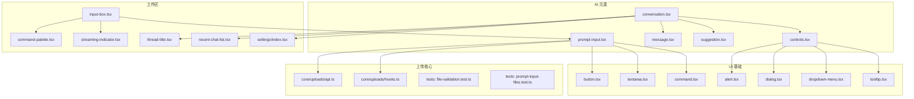
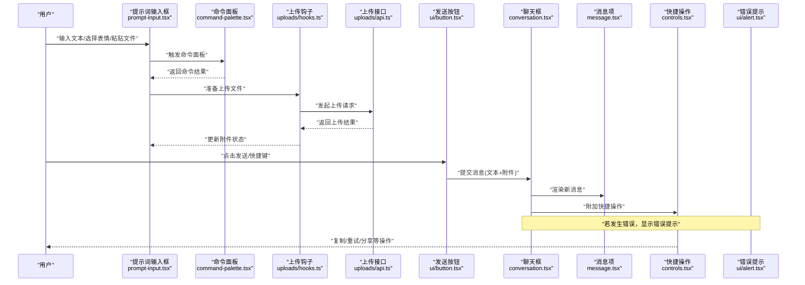
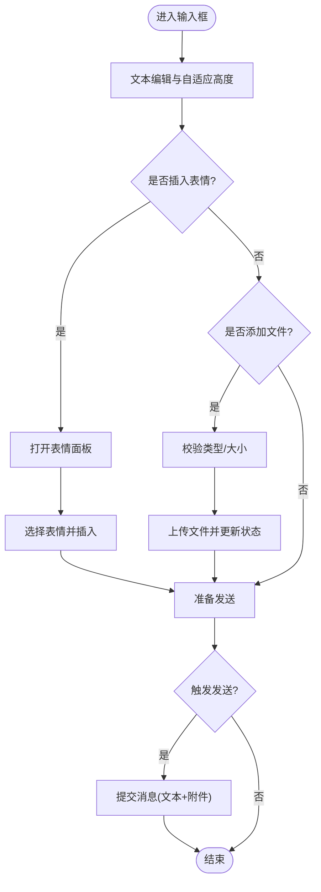
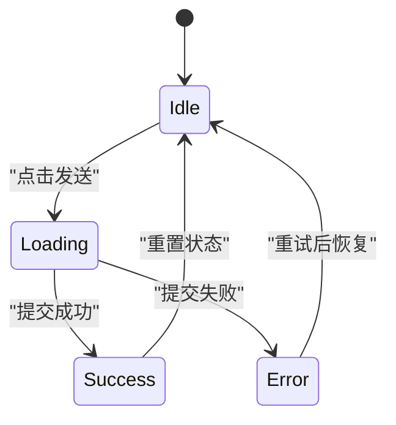
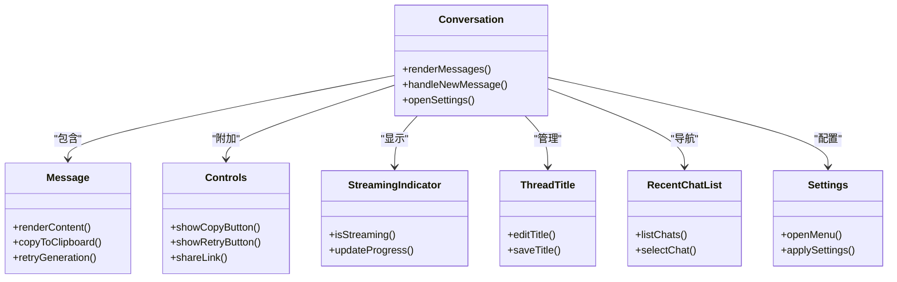
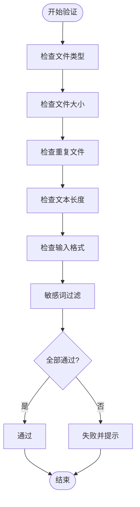
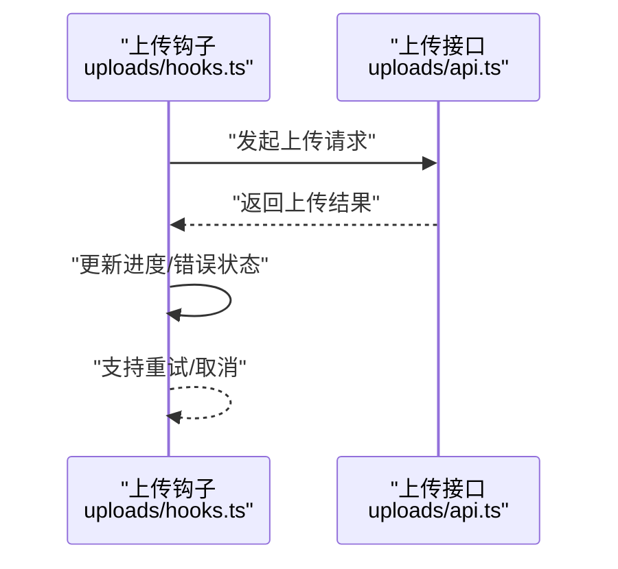
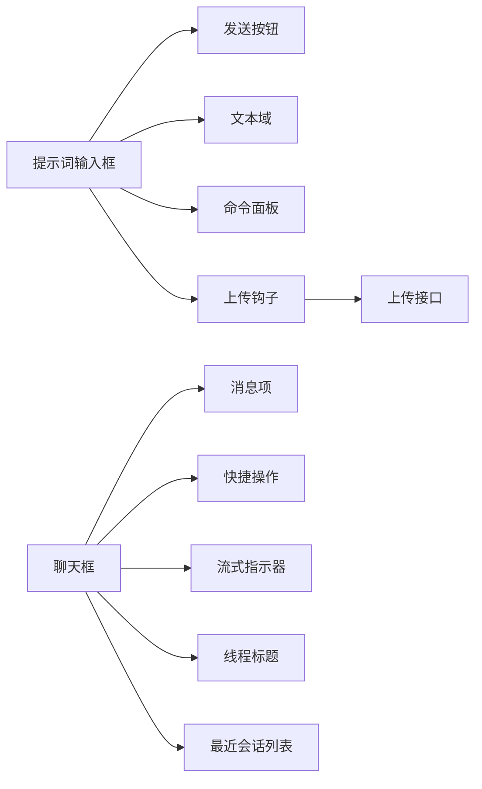

# 输入控制组件

<cite>
**本文引用的文件**   
- [frontend/src/components/ai-elements/prompt-input.tsx](file://frontend/src/components/ai-elements/prompt-input.tsx)
- [frontend/src/components/workspace/input-box.tsx](file://frontend/src/components/workspace/input-box.tsx)
- [frontend/src/components/ui/button.tsx](file://frontend/src/components/ui/button.tsx)
- [frontend/src/components/ui/textarea.tsx](file://frontend/src/components/ui/textarea.tsx)
- [frontend/src/components/ui/command.tsx](file://frontend/src/components/ui/command.tsx)
- [frontend/src/components/workspace/command-palette.tsx](file://frontend/src/components/workspace/command-palette.tsx)
- [frontend/src/core/uploads/api.ts](file://frontend/src/core/uploads/api.ts)
- [frontend/src/core/uploads/hooks.ts](file://frontend/src/core/uploads/hooks.ts)
- [frontend/tests/unit/core/uploads/file-validation.test.ts](file://frontend/tests/unit/core/uploads/file-validation.test.ts)
- [frontend/tests/unit/core/uploads/prompt-input-files.test.ts](file://frontend/tests/unit/core/uploads/prompt-input-files.test.ts)
- [frontend/src/components/workspace/streaming-indicator.tsx](file://frontend/src/components/workspace/streaming-indicator.tsx)
- [frontend/src/components/ui/alert.tsx](file://frontend/src/components/ui/alert.tsx)
- [frontend/src/components/ui/dialog.tsx](file://frontend/src/components/ui/dialog.tsx)
- [frontend/src/components/ui/dropdown-menu.tsx](file://frontend/src/components/ui/dropdown-menu.tsx)
- [frontend/src/components/ui/tooltip.tsx](file://frontend/src/components/ui/tooltip.tsx)
- [frontend/src/components/ai-elements/message.tsx](file://frontend/src/components/ai-elements/message.tsx)
- [frontend/src/components/ai-elements/conversation.tsx](file://frontend/src/components/ai-elements/conversation.tsx)
- [frontend/src/components/ai-elements/controls.tsx](file://frontend/src/components/ai-elements/controls.tsx)
- [frontend/src/components/ai-elements/suggestion.tsx](file://frontend/src/components/ai-elements/suggestion.tsx)
- [frontend/src/components/workspace/thread-title.tsx](file://frontend/src/components/workspace/thread-title.tsx)
- [frontend/src/components/workspace/recent-chat-list.tsx](file://frontend/src/components/workspace/recent-chat-list.tsx)
- [frontend/src/components/workspace/settings/index.tsx](file://frontend/src/components/workspace/settings/index.tsx)
</cite>

## 目录
1. [简介](#简介)
2. [项目结构](#项目结构)
3. [核心组件](#核心组件)
4. [架构总览](#架构总览)
5. [详细组件分析](#详细组件分析)
6. [依赖分析](#依赖分析)
7. [性能考虑](#性能考虑)
8. [故障排查指南](#故障排查指南)
9. [结论](#结论)
10. [附录](#附录)

## 简介
本文件聚焦于“输入控制组件”的完整文档，覆盖以下关键能力：
- 提示词输入框：文本编辑、多行自适应、表情符号插入、快捷命令（Command Palette）、附件上传与预览。
- 发送按钮：状态管理（空闲/加载中/错误）、加载动画、错误提示与可访问性支持。
- 聊天框：消息历史渲染、快捷操作（复制/重试/分享等）、设置菜单入口。
- 表单验证：输入格式检查、长度限制、敏感词过滤、文件类型与大小校验。
- 组合使用与自定义样式：如何拼装上述组件形成完整的对话输入体验，并提供用户体验优化建议与可访问性实践。

## 项目结构
前端代码中，输入控制相关的主要位置如下：
- 通用 AI 输入组件：位于 ai-elements 目录，提供 prompt-input、message、conversation、suggestion 等。
- 工作区输入容器：位于 workspace 目录，提供 input-box、command-palette、streaming-indicator 等。
- UI 基础控件：位于 ui 目录，提供 button、textarea、command、alert、dialog、dropdown-menu、tooltip 等。
- 上传能力：位于 core/uploads，提供 API 调用与 hooks，并在 tests 中有文件校验与输入框集成测试。

图表来源
- [frontend/src/components/ai-elements/prompt-input.tsx](file://frontend/src/components/ai-elements/prompt-input.tsx)
- [frontend/src/components/workspace/input-box.tsx](file://frontend/src/components/workspace/input-box.tsx)
- [frontend/src/components/ui/button.tsx](file://frontend/src/components/ui/button.tsx)
- [frontend/src/components/ui/textarea.tsx](file://frontend/src/components/ui/textarea.tsx)
- [frontend/src/components/ui/command.tsx](file://frontend/src/components/ui/command.tsx)
- [frontend/src/components/workspace/command-palette.tsx](file://frontend/src/components/workspace/command-palette.tsx)
- [frontend/src/core/uploads/api.ts](file://frontend/src/core/uploads/api.ts)
- [frontend/src/core/uploads/hooks.ts](file://frontend/src/core/uploads/hooks.ts)
- [frontend/tests/unit/core/uploads/file-validation.test.ts](file://frontend/tests/unit/core/uploads/file-validation.test.ts)
- [frontend/tests/unit/core/uploads/prompt-input-files.test.ts](file://frontend/tests/unit/core/uploads/prompt-input-files.test.ts)
- [frontend/src/components/workspace/streaming-indicator.tsx](file://frontend/src/components/workspace/streaming-indicator.tsx)
- [frontend/src/components/ui/alert.tsx](file://frontend/src/components/ui/alert.tsx)
- [frontend/src/components/ui/dialog.tsx](file://frontend/src/components/ui/dialog.tsx)
- [frontend/src/components/ui/dropdown-menu.tsx](file://frontend/src/components/ui/dropdown-menu.tsx)
- [frontend/src/components/ui/tooltip.tsx](file://frontend/src/components/ui/tooltip.tsx)
- [frontend/src/components/ai-elements/message.tsx](file://frontend/src/components/ai-elements/message.tsx)
- [frontend/src/components/ai-elements/conversation.tsx](file://frontend/src/components/ai-elements/conversation.tsx)
- [frontend/src/components/ai-elements/controls.tsx](file://frontend/src/components/ai-elements/controls.tsx)
- [frontend/src/components/ai-elements/suggestion.tsx](file://frontend/src/components/ai-elements/suggestion.tsx)
- [frontend/src/components/workspace/thread-title.tsx](file://frontend/src/components/workspace/thread-title.tsx)
- [frontend/src/components/workspace/recent-chat-list.tsx](file://frontend/src/components/workspace/recent-chat-list.tsx)
- [frontend/src/components/workspace/settings/index.tsx](file://frontend/src/components/workspace/settings/index.tsx)

章节来源
- [frontend/src/components/ai-elements/prompt-input.tsx](file://frontend/src/components/ai-elements/prompt-input.tsx)
- [frontend/src/components/workspace/input-box.tsx](file://frontend/src/components/workspace/input-box.tsx)
- [frontend/src/components/ui/button.tsx](file://frontend/src/components/ui/button.tsx)
- [frontend/src/components/ui/textarea.tsx](file://frontend/src/components/ui/textarea.tsx)
- [frontend/src/components/ui/command.tsx](file://frontend/src/components/ui/command.tsx)
- [frontend/src/components/workspace/command-palette.tsx](file://frontend/src/components/workspace/command-palette.tsx)
- [frontend/src/core/uploads/api.ts](file://frontend/src/core/uploads/api.ts)
- [frontend/src/core/uploads/hooks.ts](file://frontend/src/core/uploads/hooks.ts)
- [frontend/tests/unit/core/uploads/file-validation.test.ts](file://frontend/tests/unit/core/uploads/file-validation.test.ts)
- [frontend/tests/unit/core/uploads/prompt-input-files.test.ts](file://frontend/tests/unit/core/uploads/prompt-input-files.test.ts)
- [frontend/src/components/workspace/streaming-indicator.tsx](file://frontend/src/components/workspace/streaming-indicator.tsx)
- [frontend/src/components/ui/alert.tsx](file://frontend/src/components/ui/alert.tsx)
- [frontend/src/components/ui/dialog.tsx](file://frontend/src/components/ui/dialog.tsx)
- [frontend/src/components/ui/dropdown-menu.tsx](file://frontend/src/components/ui/dropdown-menu.tsx)
- [frontend/src/components/ui/tooltip.tsx](file://frontend/src/components/ui/tooltip.tsx)
- [frontend/src/components/ai-elements/message.tsx](file://frontend/src/components/ai-elements/message.tsx)
- [frontend/src/components/ai-elements/conversation.tsx](file://frontend/src/components/ai-elements/conversation.tsx)
- [frontend/src/components/ai-elements/controls.tsx](file://frontend/src/components/ai-elements/controls.tsx)
- [frontend/src/components/ai-elements/suggestion.tsx](file://frontend/src/components/ai-elements/suggestion.tsx)
- [frontend/src/components/workspace/thread-title.tsx](file://frontend/src/components/workspace/thread-title.tsx)
- [frontend/src/components/workspace/recent-chat-list.tsx](file://frontend/src/components/workspace/recent-chat-list.tsx)
- [frontend/src/components/workspace/settings/index.tsx](file://frontend/src/components/workspace/settings/index.tsx)

## 核心组件
本节对输入控制相关的核心组件进行概览说明，帮助读者快速建立整体认知。

- 提示词输入框（Prompt Input）
  - 功能要点：文本编辑、多行自适应、表情符号插入、快捷命令（Command Palette）、附件上传与预览、快捷键触发发送。
  - 交互反馈：输入长度提示、错误信息展示、上传进度与失败提示。
  - 可访问性：语义化标签、键盘导航、ARIA 属性、焦点管理。
  - 参考路径：[frontend/src/components/ai-elements/prompt-input.tsx](file://frontend/src/components/ai-elements/prompt-input.tsx)

- 发送按钮（Send Button）
  - 功能要点：状态管理（空闲/加载中/禁用）、加载动画、错误提示、快捷键绑定。
  - 参考路径：[frontend/src/components/ui/button.tsx](file://frontend/src/components/ui/button.tsx)

- 聊天框（Conversation）
  - 功能要点：消息历史渲染、快捷操作（复制/重试/分享等）、设置菜单入口、线程标题与最近会话列表。
  - 参考路径：
    - [frontend/src/components/ai-elements/conversation.tsx](file://frontend/src/components/ai-elements/conversation.tsx)
    - [frontend/src/components/ai-elements/message.tsx](file://frontend/src/components/ai-elements/message.tsx)
    - [frontend/src/components/ai-elements/suggestion.tsx](file://frontend/src/components/ai-elements/suggestion.tsx)
    - [frontend/src/components/ai-elements/controls.tsx](file://frontend/src/components/ai-elements/controls.tsx)
    - [frontend/src/components/workspace/thread-title.tsx](file://frontend/src/components/workspace/thread-title.tsx)
    - [frontend/src/components/workspace/recent-chat-list.tsx](file://frontend/src/components/workspace/recent-chat-list.tsx)

- 表单验证（Validation）
  - 功能要点：输入格式检查、长度限制、敏感词过滤、文件类型与大小校验。
  - 参考路径：
    - [frontend/tests/unit/core/uploads/file-validation.test.ts](file://frontend/tests/unit/core/uploads/file-validation.test.ts)
    - [frontend/tests/unit/core/uploads/prompt-input-files.test.ts](file://frontend/tests/unit/core/uploads/prompt-input-files.test.ts)

- 上传能力（Uploads）
  - 功能要点：API 调用封装、hooks 状态管理、错误处理与重试。
  - 参考路径：
    - [frontend/src/core/uploads/api.ts](file://frontend/src/core/uploads/api.ts)
    - [frontend/src/core/uploads/hooks.ts](file://frontend/src/core/uploads/hooks.ts)

章节来源
- [frontend/src/components/ai-elements/prompt-input.tsx](file://frontend/src/components/ai-elements/prompt-input.tsx)
- [frontend/src/components/ui/button.tsx](file://frontend/src/components/ui/button.tsx)
- [frontend/src/components/ai-elements/conversation.tsx](file://frontend/src/components/ai-elements/conversation.tsx)
- [frontend/src/components/ai-elements/message.tsx](file://frontend/src/components/ai-elements/message.tsx)
- [frontend/src/components/ai-elements/suggestion.tsx](file://frontend/src/components/ai-elements/suggestion.tsx)
- [frontend/src/components/ai-elements/controls.tsx](file://frontend/src/components/ai-elements/controls.tsx)
- [frontend/src/components/workspace/thread-title.tsx](file://frontend/src/components/workspace/thread-title.tsx)
- [frontend/src/components/workspace/recent-chat-list.tsx](file://frontend/src/components/workspace/recent-chat-list.tsx)
- [frontend/tests/unit/core/uploads/file-validation.test.ts](file://frontend/tests/unit/core/uploads/file-validation.test.ts)
- [frontend/tests/unit/core/uploads/prompt-input-files.test.ts](file://frontend/tests/unit/core/uploads/prompt-input-files.test.ts)
- [frontend/src/core/uploads/api.ts](file://frontend/src/core/uploads/api.ts)
- [frontend/src/core/uploads/hooks.ts](file://frontend/src/core/uploads/hooks.ts)

## 架构总览
下图展示了从用户输入到发送、上传、以及聊天框展示的端到端流程，并标注了关键组件与模块。

图表来源
- [frontend/src/components/ai-elements/prompt-input.tsx](file://frontend/src/components/ai-elements/prompt-input.tsx)
- [frontend/src/components/workspace/command-palette.tsx](file://frontend/src/components/workspace/command-palette.tsx)
- [frontend/src/core/uploads/hooks.ts](file://frontend/src/core/uploads/hooks.ts)
- [frontend/src/core/uploads/api.ts](file://frontend/src/core/uploads/api.ts)
- [frontend/src/components/ui/button.tsx](file://frontend/src/components/ui/button.tsx)
- [frontend/src/components/ai-elements/conversation.tsx](file://frontend/src/components/ai-elements/conversation.tsx)
- [frontend/src/components/ai-elements/message.tsx](file://frontend/src/components/ai-elements/message.tsx)
- [frontend/src/components/ai-elements/controls.tsx](file://frontend/src/components/ai-elements/controls.tsx)
- [frontend/src/components/ui/alert.tsx](file://frontend/src/components/ui/alert.tsx)

## 详细组件分析

### 提示词输入框（Prompt Input）
- 文本编辑
  - 多行自适应高度，支持换行与 IME 输入法兼容。
  - 参考路径：[frontend/src/components/ui/textarea.tsx](file://frontend/src/components/ui/textarea.tsx)
- 表情符号
  - 通过弹窗或面板插入表情，保持光标位置正确。
  - 参考路径：[frontend/src/components/ui/dialog.tsx](file://frontend/src/components/ui/dialog.tsx)
- 快捷命令
  - 支持命令面板唤起与执行，常用命令如“清空输入”、“插入模板”。
  - 参考路径：
    - [frontend/src/components/ui/command.tsx](file://frontend/src/components/ui/command.tsx)
    - [frontend/src/components/workspace/command-palette.tsx](file://frontend/src/components/workspace/command-palette.tsx)
- 文件上传
  - 拖拽/选择文件，类型与大小校验，上传进度与失败提示。
  - 参考路径：
    - [frontend/src/core/uploads/hooks.ts](file://frontend/src/core/uploads/hooks.ts)
    - [frontend/src/core/uploads/api.ts](file://frontend/src/core/uploads/api.ts)
    - [frontend/tests/unit/core/uploads/file-validation.test.ts](file://frontend/tests/unit/core/uploads/file-validation.test.ts)
    - [frontend/tests/unit/core/uploads/prompt-input-files.test.ts](file://frontend/tests/unit/core/uploads/prompt-input-files.test.ts)
- 快捷键与可访问性
  - Enter 发送、Shift+Enter 换行、Tab 跳转、ARIA 描述与焦点管理。
  - 参考路径：[frontend/src/components/ai-elements/prompt-input.tsx](file://frontend/src/components/ai-elements/prompt-input.tsx)

图表来源
- [frontend/src/components/ai-elements/prompt-input.tsx](file://frontend/src/components/ai-elements/prompt-input.tsx)
- [frontend/src/components/ui/dialog.tsx](file://frontend/src/components/ui/dialog.tsx)
- [frontend/src/core/uploads/hooks.ts](file://frontend/src/core/uploads/hooks.ts)
- [frontend/src/core/uploads/api.ts](file://frontend/src/core/uploads/api.ts)
- [frontend/tests/unit/core/uploads/file-validation.test.ts](file://frontend/tests/unit/core/uploads/file-validation.test.ts)
- [frontend/tests/unit/core/uploads/prompt-input-files.test.ts](file://frontend/tests/unit/core/uploads/prompt-input-files.test.ts)

章节来源
- [frontend/src/components/ai-elements/prompt-input.tsx](file://frontend/src/components/ai-elements/prompt-input.tsx)
- [frontend/src/components/ui/textarea.tsx](file://frontend/src/components/ui/textarea.tsx)
- [frontend/src/components/ui/dialog.tsx](file://frontend/src/components/ui/dialog.tsx)
- [frontend/src/components/ui/command.tsx](file://frontend/src/components/ui/command.tsx)
- [frontend/src/components/workspace/command-palette.tsx](file://frontend/src/components/workspace/command-palette.tsx)
- [frontend/src/core/uploads/hooks.ts](file://frontend/src/core/uploads/hooks.ts)
- [frontend/src/core/uploads/api.ts](file://frontend/src/core/uploads/api.ts)
- [frontend/tests/unit/core/uploads/file-validation.test.ts](file://frontend/tests/unit/core/uploads/file-validation.test.ts)
- [frontend/tests/unit/core/uploads/prompt-input-files.test.ts](file://frontend/tests/unit/core/uploads/prompt-input-files.test.ts)

### 发送按钮（Send Button）
- 状态管理
  - 空闲：可点击，显示发送图标。
  - 加载中：禁用点击，显示加载动画。
  - 错误：显示错误提示，允许重试。
- 快捷键与可访问性
  - 支持 Enter 触发、Tab 导航、aria-label 与 role 定义。
- 参考路径：[frontend/src/components/ui/button.tsx](file://frontend/src/components/ui/button.tsx)

图表来源
- [frontend/src/components/ui/button.tsx](file://frontend/src/components/ui/button.tsx)

章节来源
- [frontend/src/components/ui/button.tsx](file://frontend/src/components/ui/button.tsx)

### 聊天框（Conversation）
- 消息历史
  - 渲染用户与助手消息，支持流式输出指示器。
  - 参考路径：
    - [frontend/src/components/ai-elements/conversation.tsx](file://frontend/src/components/ai-elements/conversation.tsx)
    - [frontend/src/components/ai-elements/message.tsx](file://frontend/src/components/ai-elements/message.tsx)
    - [frontend/src/components/workspace/streaming-indicator.tsx](file://frontend/src/components/workspace/streaming-indicator.tsx)
- 快捷操作
  - 复制内容、重试生成、分享链接等。
  - 参考路径：[frontend/src/components/ai-elements/controls.tsx](file://frontend/src/components/ai-elements/controls.tsx)
- 设置菜单
  - 线程标题编辑、最近会话列表、设置入口。
  - 参考路径：
    - [frontend/src/components/workspace/thread-title.tsx](file://frontend/src/components/workspace/thread-title.tsx)
    - [frontend/src/components/workspace/recent-chat-list.tsx](file://frontend/src/components/workspace/recent-chat-list.tsx)
    - [frontend/src/components/workspace/settings/index.tsx](file://frontend/src/components/workspace/settings/index.tsx)
- 建议与引导
  - 根据上下文推荐下一步问题或操作。
  - 参考路径：[frontend/src/components/ai-elements/suggestion.tsx](file://frontend/src/components/ai-elements/suggestion.tsx)

图表来源
- [frontend/src/components/ai-elements/conversation.tsx](file://frontend/src/components/ai-elements/conversation.tsx)
- [frontend/src/components/ai-elements/message.tsx](file://frontend/src/components/ai-elements/message.tsx)
- [frontend/src/components/ai-elements/controls.tsx](file://frontend/src/components/ai-elements/controls.tsx)
- [frontend/src/components/workspace/streaming-indicator.tsx](file://frontend/src/components/workspace/streaming-indicator.tsx)
- [frontend/src/components/workspace/thread-title.tsx](file://frontend/src/components/workspace/thread-title.tsx)
- [frontend/src/components/workspace/recent-chat-list.tsx](file://frontend/src/components/workspace/recent-chat-list.tsx)
- [frontend/src/components/workspace/settings/index.tsx](file://frontend/src/components/workspace/settings/index.tsx)

章节来源
- [frontend/src/components/ai-elements/conversation.tsx](file://frontend/src/components/ai-elements/conversation.tsx)
- [frontend/src/components/ai-elements/message.tsx](file://frontend/src/components/ai-elements/message.tsx)
- [frontend/src/components/ai-elements/controls.tsx](file://frontend/src/components/ai-elements/controls.tsx)
- [frontend/src/components/workspace/streaming-indicator.tsx](file://frontend/src/components/workspace/streaming-indicator.tsx)
- [frontend/src/components/workspace/thread-title.tsx](file://frontend/src/components/workspace/thread-title.tsx)
- [frontend/src/components/workspace/recent-chat-list.tsx](file://frontend/src/components/workspace/recent-chat-list.tsx)
- [frontend/src/components/workspace/settings/index.tsx](file://frontend/src/components/workspace/settings/index.tsx)
- [frontend/src/components/ai-elements/suggestion.tsx](file://frontend/src/components/ai-elements/suggestion.tsx)

### 表单验证（Validation）
- 输入格式检查
  - 正则匹配、必填字段、邮箱/URL 等常见格式。
- 长度限制
  - 最小/最大字符数，实时提示剩余字数。
- 敏感词过滤
  - 本地黑名单与白名单策略，拦截不当输入。
- 文件校验
  - 类型白名单、大小上限、重复检测。
- 参考路径：
  - [frontend/tests/unit/core/uploads/file-validation.test.ts](file://frontend/tests/unit/core/uploads/file-validation.test.ts)
  - [frontend/tests/unit/core/uploads/prompt-input-files.test.ts](file://frontend/tests/unit/core/uploads/prompt-input-files.test.ts)

图表来源
- [frontend/tests/unit/core/uploads/file-validation.test.ts](file://frontend/tests/unit/core/uploads/file-validation.test.ts)
- [frontend/tests/unit/core/uploads/prompt-input-files.test.ts](file://frontend/tests/unit/core/uploads/prompt-input-files.test.ts)

章节来源
- [frontend/tests/unit/core/uploads/file-validation.test.ts](file://frontend/tests/unit/core/uploads/file-validation.test.ts)
- [frontend/tests/unit/core/uploads/prompt-input-files.test.ts](file://frontend/tests/unit/core/uploads/prompt-input-files.test.ts)

### 上传能力（Uploads）
- API 封装
  - 统一上传接口，错误码映射与重试机制。
- Hooks 状态管理
  - 上传进度、失败重试、取消上传。
- 参考路径：
  - [frontend/src/core/uploads/api.ts](file://frontend/src/core/uploads/api.ts)
  - [frontend/src/core/uploads/hooks.ts](file://frontend/src/core/uploads/hooks.ts)

图表来源
- [frontend/src/core/uploads/hooks.ts](file://frontend/src/core/uploads/hooks.ts)
- [frontend/src/core/uploads/api.ts](file://frontend/src/core/uploads/api.ts)

章节来源
- [frontend/src/core/uploads/api.ts](file://frontend/src/core/uploads/api.ts)
- [frontend/src/core/uploads/hooks.ts](file://frontend/src/core/uploads/hooks.ts)

## 依赖分析
输入控制组件之间的耦合关系如下：
- 提示词输入框依赖 UI 基础控件（按钮、文本域、命令面板）与上传能力。
- 聊天框依赖消息项、快捷操作、流式指示器、线程标题与最近会话列表。
- 发送按钮作为独立 UI 组件，被输入框与聊天框共同使用。
- 上传能力通过 API 与 hooks 解耦，便于复用与测试。

图表来源
- [frontend/src/components/ai-elements/prompt-input.tsx](file://frontend/src/components/ai-elements/prompt-input.tsx)
- [frontend/src/components/ui/button.tsx](file://frontend/src/components/ui/button.tsx)
- [frontend/src/components/ui/textarea.tsx](file://frontend/src/components/ui/textarea.tsx)
- [frontend/src/components/ui/command.tsx](file://frontend/src/components/ui/command.tsx)
- [frontend/src/components/workspace/command-palette.tsx](file://frontend/src/components/workspace/command-palette.tsx)
- [frontend/src/core/uploads/hooks.ts](file://frontend/src/core/uploads/hooks.ts)
- [frontend/src/core/uploads/api.ts](file://frontend/src/core/uploads/api.ts)
- [frontend/src/components/ai-elements/conversation.tsx](file://frontend/src/components/ai-elements/conversation.tsx)
- [frontend/src/components/ai-elements/message.tsx](file://frontend/src/components/ai-elements/message.tsx)
- [frontend/src/components/ai-elements/controls.tsx](file://frontend/src/components/ai-elements/controls.tsx)
- [frontend/src/components/workspace/streaming-indicator.tsx](file://frontend/src/components/workspace/streaming-indicator.tsx)
- [frontend/src/components/workspace/thread-title.tsx](file://frontend/src/components/workspace/thread-title.tsx)
- [frontend/src/components/workspace/recent-chat-list.tsx](file://frontend/src/components/workspace/recent-chat-list.tsx)

章节来源
- [frontend/src/components/ai-elements/prompt-input.tsx](file://frontend/src/components/ai-elements/prompt-input.tsx)
- [frontend/src/components/ui/button.tsx](file://frontend/src/components/ui/button.tsx)
- [frontend/src/components/ui/textarea.tsx](file://frontend/src/components/ui/textarea.tsx)
- [frontend/src/components/ui/command.tsx](file://frontend/src/components/ui/command.tsx)
- [frontend/src/components/workspace/command-palette.tsx](file://frontend/src/components/workspace/command-palette.tsx)
- [frontend/src/core/uploads/hooks.ts](file://frontend/src/core/uploads/hooks.ts)
- [frontend/src/core/uploads/api.ts](file://frontend/src/core/uploads/api.ts)
- [frontend/src/components/ai-elements/conversation.tsx](file://frontend/src/components/ai-elements/conversation.tsx)
- [frontend/src/components/ai-elements/message.tsx](file://frontend/src/components/ai-elements/message.tsx)
- [frontend/src/components/ai-elements/controls.tsx](file://frontend/src/components/ai-elements/controls.tsx)
- [frontend/src/components/workspace/streaming-indicator.tsx](file://frontend/src/components/workspace/streaming-indicator.tsx)
- [frontend/src/components/workspace/thread-title.tsx](file://frontend/src/components/workspace/thread-title.tsx)
- [frontend/src/components/workspace/recent-chat-list.tsx](file://frontend/src/components/workspace/recent-chat-list.tsx)

## 性能考虑
- 输入防抖与节流
  - 在长文本输入时减少不必要的重渲染与计算。
- 虚拟滚动
  - 对于大量消息历史，采用虚拟滚动提升渲染性能。
- 图片与文件预览
  - 使用缩略图与懒加载，避免一次性加载大资源。
- 上传分片与断点续传
  - 大文件分片上传，网络异常时自动续传。
- 流式输出
  - 增量渲染，降低首屏延迟。

[本节为通用指导，不直接分析具体文件]

## 故障排查指南
- 常见问题
  - 上传失败：检查文件类型与大小限制、网络状态、后端接口返回码。
  - 发送无响应：确认发送按钮状态是否为加载中、是否存在未通过的表单验证。
  - 表情无法插入：检查对话框打开逻辑与光标位置计算。
  - 命令面板无效：核对命令注册与快捷键冲突。
- 错误提示
  - 使用统一的 alert 组件展示错误信息，确保可访问性与国际化。
- 参考路径：
  - [frontend/src/components/ui/alert.tsx](file://frontend/src/components/ui/alert.tsx)
  - [frontend/src/components/ui/dialog.tsx](file://frontend/src/components/ui/dialog.tsx)
  - [frontend/src/components/ui/dropdown-menu.tsx](file://frontend/src/components/ui/dropdown-menu.tsx)
  - [frontend/src/components/ui/tooltip.tsx](file://frontend/src/components/ui/tooltip.tsx)

章节来源
- [frontend/src/components/ui/alert.tsx](file://frontend/src/components/ui/alert.tsx)
- [frontend/src/components/ui/dialog.tsx](file://frontend/src/components/ui/dialog.tsx)
- [frontend/src/components/ui/dropdown-menu.tsx](file://frontend/src/components/ui/dropdown-menu.tsx)
- [frontend/src/components/ui/tooltip.tsx](file://frontend/src/components/ui/tooltip.tsx)

## 结论
输入控制组件围绕“提示词输入框—发送按钮—聊天框—上传能力—表单验证”形成闭环。通过合理的状态管理与错误提示、完善的可访问性与性能优化，能够提供流畅且安全的对话输入体验。建议在业务场景中按需组合这些组件，并结合主题与样式系统实现一致的视觉风格。

[本节为总结，不直接分析具体文件]

## 附录
- 组合使用建议
  - 将提示词输入框与工作区输入容器结合，提供统一的输入体验。
  - 在聊天框中嵌入快捷操作与设置菜单，增强用户效率。
- 自定义样式
  - 基于 UI 基础控件的主题变量进行定制，保持全局一致性。
- 可访问性支持
  - 使用语义化标签、ARIA 属性、键盘导航与屏幕阅读器友好文案。

[本节为概念性内容，不直接分析具体文件]