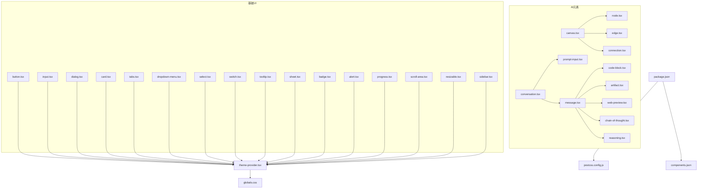
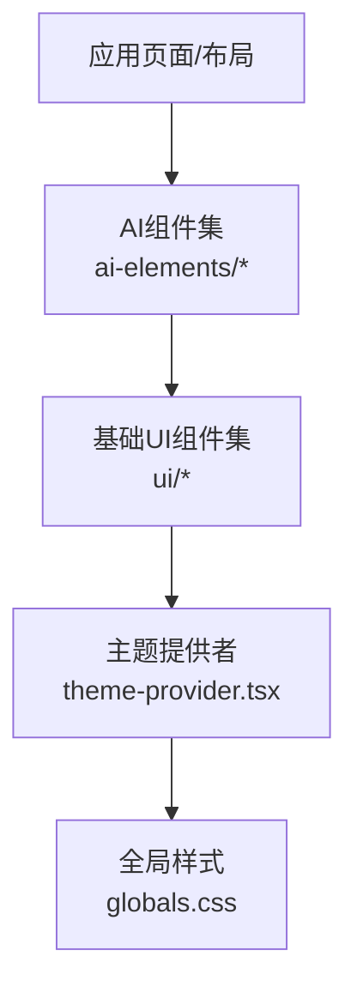
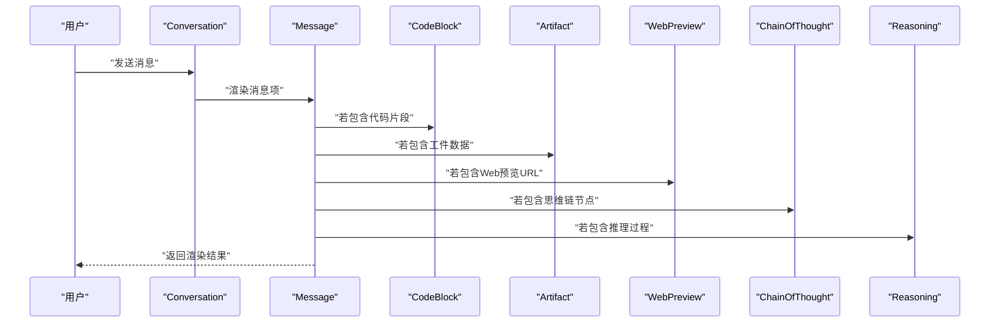
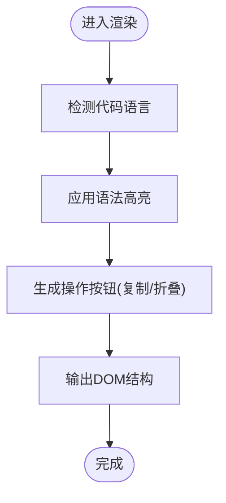
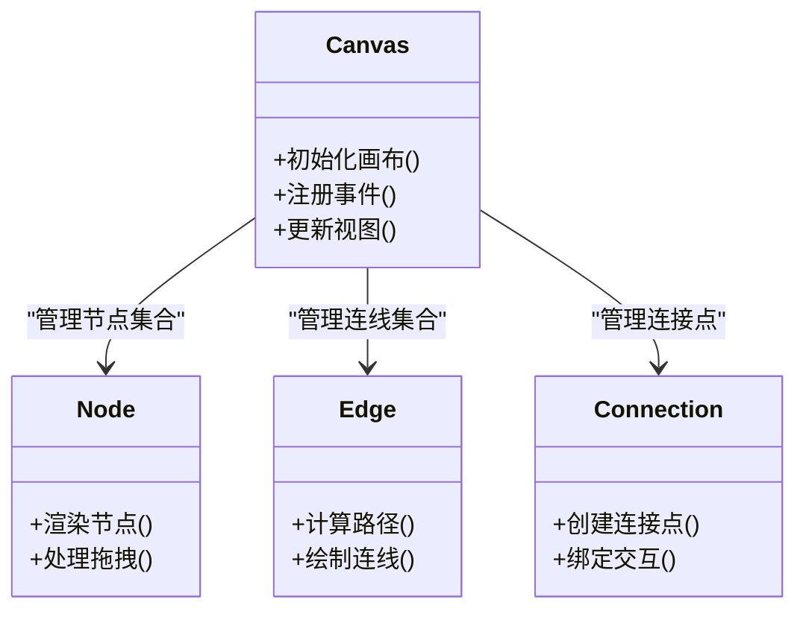
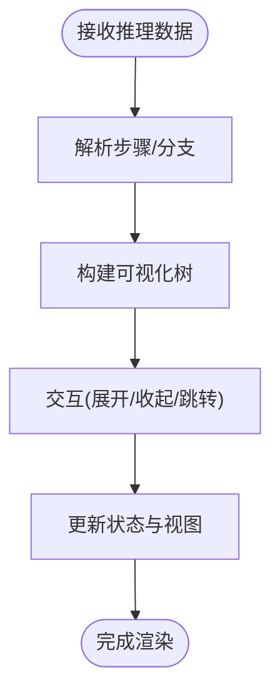
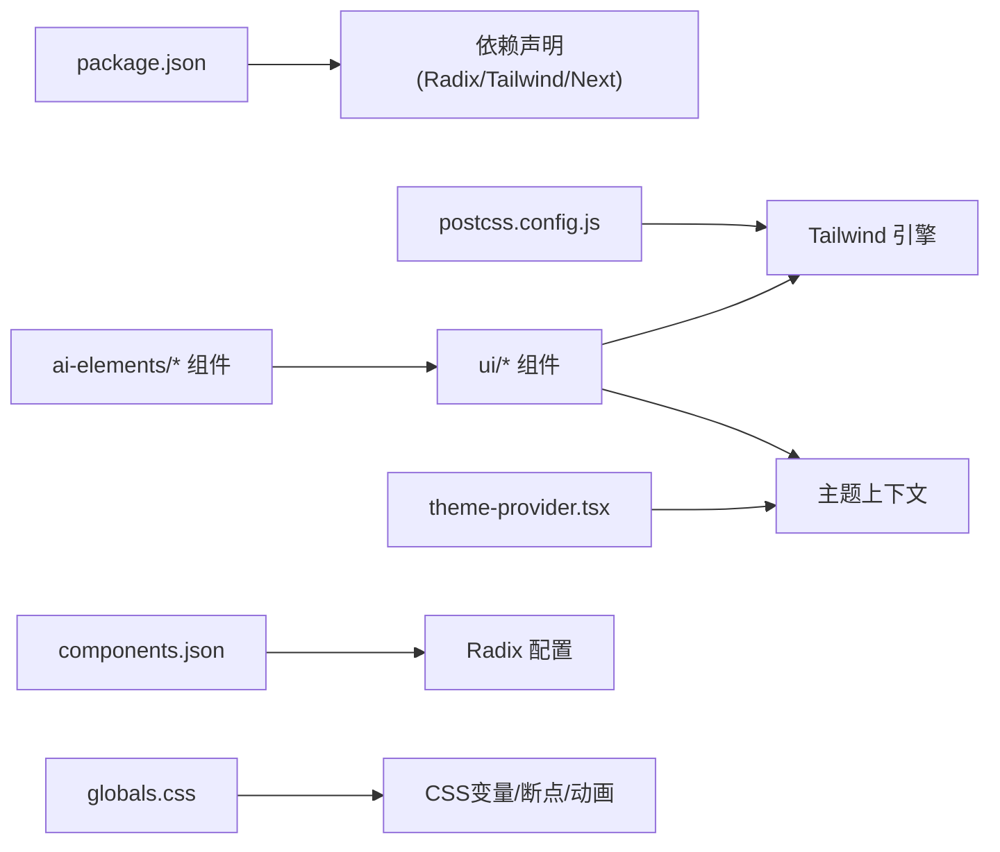

# UI组件库

<cite>
**本文引用的文件**   
- [frontend/src/components/ai-elements/conversation.tsx](file://frontend/src/components/ai-elements/conversation.tsx)
- [frontend/src/components/ai-elements/message.tsx](file://frontend/src/components/ai-elements/message.tsx)
- [frontend/src/components/ai-elements/code-block.tsx](file://frontend/src/components/ai-elements/code-block.tsx)
- [frontend/src/components/ai-elements/canvas.tsx](file://frontend/src/components/ai-elements/canvas.tsx)
- [frontend/src/components/ai-elements/node.tsx](file://frontend/src/components/ai-elements/node.tsx)
- [frontend/src/components/ai-elements/edge.tsx](file://frontend/src/components/ai-elements/edge.tsx)
- [frontend/src/components/ai-elements/connection.tsx](file://frontend/src/components/ai-elements/connection.tsx)
- [frontend/src/components/ai-elements/chain-of-thought.tsx](file://frontend/src/components/ai-elements/chain-of-thought.tsx)
- [frontend/src/components/ai-elements/reasoning.tsx](file://frontend/src/components/ai-elements/reasoning.tsx)
- [frontend/src/components/ai-elements/artifact.tsx](file://frontend/src/components/ai-elements/artifact.tsx)
- [frontend/src/components/ai-elements/web-preview.tsx](file://frontend/src/components/ai-elements/web-preview.tsx)
- [frontend/src/components/ai-elements/prompt-input.tsx](file://frontend/src/components/ai-elements/prompt-input.tsx)
- [frontend/src/components/ui/button.tsx](file://frontend/src/components/ui/button.tsx)
- [frontend/src/components/ui/input.tsx](file://frontend/src/components/ui/input.tsx)
- [frontend/src/components/ui/dialog.tsx](file://frontend/src/components/ui/dialog.tsx)
- [frontend/src/components/ui/card.tsx](file://frontend/src/components/ui/card.tsx)
- [frontend/src/components/ui/tabs.tsx](file://frontend/src/components/ui/tabs.tsx)
- [frontend/src/components/ui/dropdown-menu.tsx](file://frontend/src/components/ui/dropdown-menu.tsx)
- [frontend/src/components/ui/select.tsx](file://frontend/src/components/ui/select.tsx)
- [frontend/src/components/ui/switch.tsx](file://frontend/src/components/ui/switch.tsx)
- [frontend/src/components/ui/tooltip.tsx](file://frontend/src/components/ui/tooltip.tsx)
- [frontend/src/components/ui/sheet.tsx](file://frontend/src/components/ui/sheet.tsx)
- [frontend/src/components/ui/badge.tsx](file://frontend/src/components/ui/badge.tsx)
- [frontend/src/components/ui/alert.tsx](file://frontend/src/components/ui/alert.tsx)
- [frontend/src/components/ui/progress.tsx](file://frontend/src/components/ui/progress.tsx)
- [frontend/src/components/ui/scroll-area.tsx](file://frontend/src/components/ui/scroll-area.tsx)
- [frontend/src/components/ui/resizable.tsx](file://frontend/src/components/ui/resizable.tsx)
- [frontend/src/components/ui/sidebar.tsx](file://frontend/src/components/ui/sidebar.tsx)
- [frontend/src/components/theme-provider.tsx](file://frontend/src/components/theme-provider.tsx)
- [frontend/src/styles/globals.css](file://frontend/src/styles/globals.css)
- [frontend/package.json](file://frontend/package.json)
- [frontend/postcss.config.js](file://frontend/postcss.config.js)
- [frontend/components.json](file://frontend/components.json)
</cite>

## 目录
1. [简介](#简介)
2. [项目结构](#项目结构)
3. [核心组件](#核心组件)
4. [架构总览](#架构总览)
5. [详细组件分析](#详细组件分析)
6. [依赖关系分析](#依赖关系分析)
7. [性能考量](#性能考量)
8. [故障排查指南](#故障排查指南)
9. [结论](#结论)
10. [附录](#附录)

## 简介
本文件面向DeerFlow前端UI组件库，聚焦于基于Radix UI与Tailwind CSS的组件架构设计。文档覆盖AI专用组件（对话气泡、代码块渲染、图表可视化、思维链展示等）与基础UI组件（按钮、输入框、对话框、表格等通用能力），并系统阐述样式系统与主题定制机制（CSS变量、暗色模式、响应式）、可访问性与键盘导航支持、开发规范与测试策略，以及使用示例与最佳实践。

## 项目结构
前端采用Next.js工程组织，组件按领域分层：
- AI元素组件：位于 ai-elements 目录，封装对话、消息、代码块、画布、节点、边、连接、思维链、推理过程、工件、Web预览、提示输入等。
- 基础UI组件：位于 ui 目录，提供按钮、输入、对话框、卡片、标签页、下拉菜单、选择器、开关、工具提示、抽屉、徽章、告警、进度条、滚动区域、可调整大小容器、侧边栏等。
- 主题与全局样式：theme-provider 提供主题上下文；globals.css 定义全局样式与CSS变量。
- 构建与配置：package.json 管理依赖与脚本；postcss.config.js 集成Tailwind；components.json 用于Radix相关配置。

图示来源
- [frontend/src/components/ai-elements/conversation.tsx](file://frontend/src/components/ai-elements/conversation.tsx)
- [frontend/src/components/ai-elements/message.tsx](file://frontend/src/components/ai-elements/message.tsx)
- [frontend/src/components/ai-elements/code-block.tsx](file://frontend/src/components/ai-elements/code-block.tsx)
- [frontend/src/components/ai-elements/canvas.tsx](file://frontend/src/components/ai-elements/canvas.tsx)
- [frontend/src/components/ai-elements/node.tsx](file://frontend/src/components/ai-elements/node.tsx)
- [frontend/src/components/ai-elements/edge.tsx](file://frontend/src/components/ai-elements/edge.tsx)
- [frontend/src/components/ai-elements/connection.tsx](file://frontend/src/components/ai-elements/connection.tsx)
- [frontend/src/components/ai-elements/chain-of-thought.tsx](file://frontend/src/components/ai-elements/chain-of-thought.tsx)
- [frontend/src/components/ai-elements/reasoning.tsx](file://frontend/src/components/ai-elements/reasoning.tsx)
- [frontend/src/components/ai-elements/artifact.tsx](file://frontend/src/components/ai-elements/artifact.tsx)
- [frontend/src/components/ai-elements/web-preview.tsx](file://frontend/src/components/ai-elements/web-preview.tsx)
- [frontend/src/components/ai-elements/prompt-input.tsx](file://frontend/src/components/ai-elements/prompt-input.tsx)
- [frontend/src/components/ui/button.tsx](file://frontend/src/components/ui/button.tsx)
- [frontend/src/components/ui/input.tsx](file://frontend/src/components/ui/input.tsx)
- [frontend/src/components/ui/dialog.tsx](file://frontend/src/components/ui/dialog.tsx)
- [frontend/src/components/ui/card.tsx](file://frontend/src/components/ui/card.tsx)
- [frontend/src/components/ui/tabs.tsx](file://frontend/src/components/ui/tabs.tsx)
- [frontend/src/components/ui/dropdown-menu.tsx](file://frontend/src/components/ui/dropdown-menu.tsx)
- [frontend/src/components/ui/select.tsx](file://frontend/src/components/ui/select.tsx)
- [frontend/src/components/ui/switch.tsx](file://frontend/src/components/ui/switch.tsx)
- [frontend/src/components/ui/tooltip.tsx](file://frontend/src/components/ui/tooltip.tsx)
- [frontend/src/components/ui/sheet.tsx](file://frontend/src/components/ui/sheet.tsx)
- [frontend/src/components/ui/badge.tsx](file://frontend/src/components/ui/badge.tsx)
- [frontend/src/components/ui/alert.tsx](file://frontend/src/components/ui/alert.tsx)
- [frontend/src/components/ui/progress.tsx](file://frontend/src/components/ui/progress.tsx)
- [frontend/src/components/ui/scroll-area.tsx](file://frontend/src/components/ui/scroll-area.tsx)
- [frontend/src/components/ui/resizable.tsx](file://frontend/src/components/ui/resizable.tsx)
- [frontend/src/components/ui/sidebar.tsx](file://frontend/src/components/ui/sidebar.tsx)
- [frontend/src/components/theme-provider.tsx](file://frontend/src/components/theme-provider.tsx)
- [frontend/src/styles/globals.css](file://frontend/src/styles/globals.css)
- [frontend/package.json](file://frontend/package.json)
- [frontend/postcss.config.js](file://frontend/postcss.config.js)
- [frontend/components.json](file://frontend/components.json)

章节来源
- [frontend/package.json](file://frontend/package.json)
- [frontend/postcss.config.js](file://frontend/postcss.config.js)
- [frontend/components.json](file://frontend/components.json)
- [frontend/src/styles/globals.css](file://frontend/src/styles/globals.css)
- [frontend/src/components/theme-provider.tsx](file://frontend/src/components/theme-provider.tsx)

## 核心组件
本节概述AI专用与基础UI两类组件的职责边界与协作方式。

- AI专用组件
  - 对话与消息：conversation.tsx 负责会话编排与布局；message.tsx 负责单条消息渲染，内部组合 code-block、artifact、web-preview、chain-of-thought、reasoning 等子组件。
  - 代码块渲染：code-block.tsx 提供语法高亮与复制等交互。
  - 图表可视化：canvas.tsx 作为图/流程图容器，配合 node.tsx、edge.tsx、connection.tsx 实现节点与连线绘制与交互。
  - 思维链与推理：chain-of-thought.tsx 与 reasoning.tsx 以可折叠/可展开形式呈现中间思考步骤。
  - 工件与Web预览：artifact.tsx 承载结构化产物；web-preview.tsx 内嵌网页预览。
  - 提示输入：prompt-input.tsx 提供多行输入、附件、快捷键等能力。

- 基础UI组件
  - 交互控件：button.tsx、input.tsx、select.tsx、switch.tsx、tabs.tsx、dropdown-menu.tsx、tooltip.tsx、sheet.tsx、dialog.tsx、alert.tsx、badge.tsx、progress.tsx、scroll-area.tsx、resizable.tsx、sidebar.tsx、card.tsx 等。
  - 这些组件统一通过 theme-provider.tsx 提供的主题上下文与 Tailwind 类名进行样式驱动，遵循 Radix 的可访问性契约。

章节来源
- [frontend/src/components/ai-elements/conversation.tsx](file://frontend/src/components/ai-elements/conversation.tsx)
- [frontend/src/components/ai-elements/message.tsx](file://frontend/src/components/ai-elements/message.tsx)
- [frontend/src/components/ai-elements/code-block.tsx](file://frontend/src/components/ai-elements/code-block.tsx)
- [frontend/src/components/ai-elements/canvas.tsx](file://frontend/src/components/ai-elements/canvas.tsx)
- [frontend/src/components/ai-elements/node.tsx](file://frontend/src/components/ai-elements/node.tsx)
- [frontend/src/components/ai-elements/edge.tsx](file://frontend/src/components/ai-elements/edge.tsx)
- [frontend/src/components/ai-elements/connection.tsx](file://frontend/src/components/ai-elements/connection.tsx)
- [frontend/src/components/ai-elements/chain-of-thought.tsx](file://frontend/src/components/ai-elements/chain-of-thought.tsx)
- [frontend/src/components/ai-elements/reasoning.tsx](file://frontend/src/components/ai-elements/reasoning.tsx)
- [frontend/src/components/ai-elements/artifact.tsx](file://frontend/src/components/ai-elements/artifact.tsx)
- [frontend/src/components/ai-elements/web-preview.tsx](file://frontend/src/components/ai-elements/web-preview.tsx)
- [frontend/src/components/ai-elements/prompt-input.tsx](file://frontend/src/components/ai-elements/prompt-input.tsx)
- [frontend/src/components/ui/button.tsx](file://frontend/src/components/ui/button.tsx)
- [frontend/src/components/ui/input.tsx](file://frontend/src/components/ui/input.tsx)
- [frontend/src/components/ui/dialog.tsx](file://frontend/src/components/ui/dialog.tsx)
- [frontend/src/components/ui/card.tsx](file://frontend/src/components/ui/card.tsx)
- [frontend/src/components/ui/tabs.tsx](file://frontend/src/components/ui/tabs.tsx)
- [frontend/src/components/ui/dropdown-menu.tsx](file://frontend/src/components/ui/dropdown-menu.tsx)
- [frontend/src/components/ui/select.tsx](file://frontend/src/components/ui/select.tsx)
- [frontend/src/components/ui/switch.tsx](file://frontend/src/components/ui/switch.tsx)
- [frontend/src/components/ui/tooltip.tsx](file://frontend/src/components/ui/tooltip.tsx)
- [frontend/src/components/ui/sheet.tsx](file://frontend/src/components/ui/sheet.tsx)
- [frontend/src/components/ui/badge.tsx](file://frontend/src/components/ui/badge.tsx)
- [frontend/src/components/ui/alert.tsx](file://frontend/src/components/ui/alert.tsx)
- [frontend/src/components/ui/progress.tsx](file://frontend/src/components/ui/progress.tsx)
- [frontend/src/components/ui/scroll-area.tsx](file://frontend/src/components/ui/scroll-area.tsx)
- [frontend/src/components/ui/resizable.tsx](file://frontend/src/components/ui/resizable.tsx)
- [frontend/src/components/ui/sidebar.tsx](file://frontend/src/components/ui/sidebar.tsx)

## 架构总览
整体架构围绕“主题上下文 + 基础UI + AI业务组件”的分层展开。主题由 theme-provider.tsx 注入，全局样式在 globals.css 中集中管理；基础UI组件基于 Radix 原语与 Tailwind 原子类构建；AI组件组合基础UI与自身业务逻辑，形成对话、可视化、代码渲染等场景化能力。

图示来源
- [frontend/src/components/theme-provider.tsx](file://frontend/src/components/theme-provider.tsx)
- [frontend/src/styles/globals.css](file://frontend/src/styles/globals.css)
- [frontend/src/components/ui/button.tsx](file://frontend/src/components/ui/button.tsx)
- [frontend/src/components/ai-elements/conversation.tsx](file://frontend/src/components/ai-elements/conversation.tsx)

## 详细组件分析

### 对话与消息组件
- conversation.tsx：负责会话列表、滚动定位、消息流组装与用户输入入口。
- message.tsx：根据消息类型与内容片段，动态渲染文本、代码块、工件、Web预览、思维链与推理过程等。

图示来源
- [frontend/src/components/ai-elements/conversation.tsx](file://frontend/src/components/ai-elements/conversation.tsx)
- [frontend/src/components/ai-elements/message.tsx](file://frontend/src/components/ai-elements/message.tsx)
- [frontend/src/components/ai-elements/code-block.tsx](file://frontend/src/components/ai-elements/code-block.tsx)
- [frontend/src/components/ai-elements/artifact.tsx](file://frontend/src/components/ai-elements/artifact.tsx)
- [frontend/src/components/ai-elements/web-preview.tsx](file://frontend/src/components/ai-elements/web-preview.tsx)
- [frontend/src/components/ai-elements/chain-of-thought.tsx](file://frontend/src/components/ai-elements/chain-of-thought.tsx)
- [frontend/src/components/ai-elements/reasoning.tsx](file://frontend/src/components/ai-elements/reasoning.tsx)

章节来源
- [frontend/src/components/ai-elements/conversation.tsx](file://frontend/src/components/ai-elements/conversation.tsx)
- [frontend/src/components/ai-elements/message.tsx](file://frontend/src/components/ai-elements/message.tsx)

### 代码块渲染组件
- code-block.tsx：提供语言检测、语法高亮、复制、折叠/展开等交互，适配暗色主题与不同字号。

图示来源
- [frontend/src/components/ai-elements/code-block.tsx](file://frontend/src/components/ai-elements/code-block.tsx)

章节来源
- [frontend/src/components/ai-elements/code-block.tsx](file://frontend/src/components/ai-elements/code-block.tsx)

### 图表可视化组件
- canvas.tsx：作为可视化画布容器，处理缩放、平移、事件分发。
- node.tsx / edge.tsx / connection.tsx：分别负责节点渲染、连线绘制与连接点交互。

图示来源
- [frontend/src/components/ai-elements/canvas.tsx](file://frontend/src/components/ai-elements/canvas.tsx)
- [frontend/src/components/ai-elements/node.tsx](file://frontend/src/components/ai-elements/node.tsx)
- [frontend/src/components/ai-elements/edge.tsx](file://frontend/src/components/ai-elements/edge.tsx)
- [frontend/src/components/ai-elements/connection.tsx](file://frontend/src/components/ai-elements/connection.tsx)

章节来源
- [frontend/src/components/ai-elements/canvas.tsx](file://frontend/src/components/ai-elements/canvas.tsx)
- [frontend/src/components/ai-elements/node.tsx](file://frontend/src/components/ai-elements/node.tsx)
- [frontend/src/components/ai-elements/edge.tsx](file://frontend/src/components/ai-elements/edge.tsx)
- [frontend/src/components/ai-elements/connection.tsx](file://frontend/src/components/ai-elements/connection.tsx)

### 思维链与推理组件
- chain-of-thought.tsx：以树形或线性结构展示思考步骤，支持展开/收起与状态同步。
- reasoning.tsx：呈现模型推理过程摘要，便于调试与回溯。

图示来源
- [frontend/src/components/ai-elements/chain-of-thought.tsx](file://frontend/src/components/ai-elements/chain-of-thought.tsx)
- [frontend/src/components/ai-elements/reasoning.tsx](file://frontend/src/components/ai-elements/reasoning.tsx)

章节来源
- [frontend/src/components/ai-elements/chain-of-thought.tsx](file://frontend/src/components/ai-elements/chain-of-thought.tsx)
- [frontend/src/components/ai-elements/reasoning.tsx](file://frontend/src/components/ai-elements/reasoning.tsx)

### 工件与Web预览组件
- artifact.tsx：渲染结构化产物（如报告、JSON、图片等），提供下载/预览等操作。
- web-preview.tsx：安全地嵌入外部网页预览，支持加载态与错误态。

章节来源
- [frontend/src/components/ai-elements/artifact.tsx](file://frontend/src/components/ai-elements/artifact.tsx)
- [frontend/src/components/ai-elements/web-preview.tsx](file://frontend/src/components/ai-elements/web-preview.tsx)

### 提示输入组件
- prompt-input.tsx：提供多行输入、附件上传、快捷指令、键盘导航与提交行为。

章节来源
- [frontend/src/components/ai-elements/prompt-input.tsx](file://frontend/src/components/ai-elements/prompt-input.tsx)

### 基础UI组件
- 按钮与表单：button.tsx、input.tsx、select.tsx、switch.tsx、textarea（如有）等，统一受主题控制，具备焦点管理与无障碍属性。
- 反馈与导航：alert.tsx、badge.tsx、progress.tsx、tabs.tsx、dropdown-menu.tsx、tooltip.tsx、sheet.tsx、dialog.tsx、sidebar.tsx、scroll-area.tsx、resizable.tsx、card.tsx 等。

章节来源
- [frontend/src/components/ui/button.tsx](file://frontend/src/components/ui/button.tsx)
- [frontend/src/components/ui/input.tsx](file://frontend/src/components/ui/input.tsx)
- [frontend/src/components/ui/select.tsx](file://frontend/src/components/ui/select.tsx)
- [frontend/src/components/ui/switch.tsx](file://frontend/src/components/ui/switch.tsx)
- [frontend/src/components/ui/alert.tsx](file://frontend/src/components/ui/alert.tsx)
- [frontend/src/components/ui/badge.tsx](file://frontend/src/components/ui/badge.tsx)
- [frontend/src/components/ui/progress.tsx](file://frontend/src/components/ui/progress.tsx)
- [frontend/src/components/ui/tabs.tsx](file://frontend/src/components/ui/tabs.tsx)
- [frontend/src/components/ui/dropdown-menu.tsx](file://frontend/src/components/ui/dropdown-menu.tsx)
- [frontend/src/components/ui/tooltip.tsx](file://frontend/src/components/ui/tooltip.tsx)
- [frontend/src/components/ui/sheet.tsx](file://frontend/src/components/ui/sheet.tsx)
- [frontend/src/components/ui/dialog.tsx](file://frontend/src/components/ui/dialog.tsx)
- [frontend/src/components/ui/sidebar.tsx](file://frontend/src/components/ui/sidebar.tsx)
- [frontend/src/components/ui/scroll-area.tsx](file://frontend/src/components/ui/scroll-area.tsx)
- [frontend/src/components/ui/resizable.tsx](file://frontend/src/components/ui/resizable.tsx)
- [frontend/src/components/ui/card.tsx](file://frontend/src/components/ui/card.tsx)

## 依赖关系分析
- 运行时依赖
  - React/Next.js：组件框架与路由。
  - Radix UI：提供无样式、可访问的原语组件（对话框、下拉菜单、选择器、开关、工具提示等）。
  - Tailwind CSS：原子类样式引擎，结合 postcss.config.js 启用。
  - components.json：Radix 相关配置（如自定义变体、插件等）。
- 样式依赖
  - globals.css：定义全局CSS变量、主题断点、动画与通用排版。
  - theme-provider.tsx：将主题值注入React上下文，供各组件读取。

图示来源
- [frontend/package.json](file://frontend/package.json)
- [frontend/postcss.config.js](file://frontend/postcss.config.js)
- [frontend/components.json](file://frontend/components.json)
- [frontend/src/components/theme-provider.tsx](file://frontend/src/components/theme-provider.tsx)
- [frontend/src/styles/globals.css](file://frontend/src/styles/globals.css)

章节来源
- [frontend/package.json](file://frontend/package.json)
- [frontend/postcss.config.js](file://frontend/postcss.config.js)
- [frontend/components.json](file://frontend/components.json)
- [frontend/src/components/theme-provider.tsx](file://frontend/src/components/theme-provider.tsx)
- [frontend/src/styles/globals.css](file://frontend/src/styles/globals.css)

## 性能考量
- 大列表与长消息
  - 使用虚拟滚动或分页加载减少首屏渲染压力（参考 scroll-area.tsx 的使用模式）。
  - 对长文本与复杂内容进行懒加载与按需渲染。
- 代码块与高亮
  - 避免重复解析，缓存语言检测结果与高亮结果。
  - 对超大代码块进行分片渲染或延迟高亮。
- 图表与画布
  - 对节点/边数量进行节流更新，合并重绘批次。
  - 使用离屏渲染或增量更新策略降低主线程阻塞。
- 主题切换
  - 批量更新CSS变量，避免频繁触发回流。
- 网络与预览
  - 对 web-preview.tsx 的 iframe 加载增加超时与降级策略。

[本节为通用指导，不直接分析具体文件]

## 故障排查指南
- 主题未生效
  - 检查 theme-provider.tsx 是否正确包裹根组件。
  - 确认 globals.css 中的CSS变量是否被正确引用。
- 样式错乱
  - 核对 postcss.config.js 中 Tailwind 配置是否包含正确的扫描路径。
  - 检查 components.json 是否与 Radix 版本匹配。
- 可访问性问题
  - 确保所有Radix组件的 aria-* 属性未被覆盖。
  - 验证键盘导航顺序与焦点可见性。
- 代码块渲染异常
  - 检查语言检测逻辑与高亮库兼容性。
  - 确认复制/折叠交互的事件冒泡未被阻断。
- 画布交互卡顿
  - 审查节点/边的更新频率与事件监听器数量。
  - 考虑使用 requestAnimationFrame 或 Web Worker 优化。

章节来源
- [frontend/src/components/theme-provider.tsx](file://frontend/src/components/theme-provider.tsx)
- [frontend/src/styles/globals.css](file://frontend/src/styles/globals.css)
- [frontend/postcss.config.js](file://frontend/postcss.config.js)
- [frontend/components.json](file://frontend/components.json)
- [frontend/src/components/ai-elements/code-block.tsx](file://frontend/src/components/ai-elements/code-block.tsx)
- [frontend/src/components/ai-elements/canvas.tsx](file://frontend/src/components/ai-elements/canvas.tsx)

## 结论
本组件库以主题上下文为核心，结合Radix UI的可访问性原语与Tailwind CSS的原子样式，构建了AI场景下的高可用UI体系。AI专用组件围绕对话、代码、可视化与推理过程进行深度定制，基础UI组件则提供一致的交互体验与主题一致性。通过合理的依赖管理与性能优化策略，可在复杂场景中保持流畅与稳定。

[本节为总结性内容，不直接分析具体文件]

## 附录

### 样式系统与主题定制
- CSS变量与断点
  - 在 globals.css 中集中定义颜色、间距、圆角、阴影、字体与断点变量，供Tailwind与组件复用。
- 暗色模式
  - 通过 theme-provider.tsx 暴露主题状态，组件依据状态切换类名或CSS变量。
- 响应式设计
  - 基于Tailwind断点与移动端优先策略，保证在不同屏幕尺寸下的可用性。

章节来源
- [frontend/src/styles/globals.css](file://frontend/src/styles/globals.css)
- [frontend/src/components/theme-provider.tsx](file://frontend/src/components/theme-provider.tsx)

### 可访问性与键盘导航
- Radix原语默认提供完善的ARIA语义与键盘交互。
- 建议：
  - 为自定义交互补充 role、aria-* 与 tabIndex。
  - 确保焦点顺序符合阅读顺序，并提供跳过链接。
  - 在高对比度模式下验证可读性。

章节来源
- [frontend/src/components/ui/dialog.tsx](file://frontend/src/components/ui/dialog.tsx)
- [frontend/src/components/ui/dropdown-menu.tsx](file://frontend/src/components/ui/dropdown-menu.tsx)
- [frontend/src/components/ui/select.tsx](file://frontend/src/components/ui/select.tsx)
- [frontend/src/components/ui/switch.tsx](file://frontend/src/components/ui/switch.tsx)
- [frontend/src/components/ui/tooltip.tsx](file://frontend/src/components/ui/tooltip.tsx)

### 组件开发规范
- 命名与导出
  - 组件文件以小写短横线命名，导出默认组件与可选的类型定义。
- Props设计
  - 明确必填/可选字段，提供默认值与类型约束。
- 样式约定
  - 优先使用Tailwind原子类，必要时扩展CSS变量。
- 可访问性
  - 遵循WAI-ARIA最佳实践，确保键盘可达与屏幕阅读器友好。
- 错误处理
  - 对网络请求与渲染异常提供兜底UI与日志上报。

[本节为通用规范，不直接分析具体文件]

### 测试策略
- 单元测试
  - 针对纯函数与工具方法编写用例，覆盖边界条件。
- 组件测试
  - 使用React Testing Library模拟用户交互，验证渲染结果与可访问性属性。
- 集成测试
  - 对关键流程（如对话发送、代码块复制、画布拖拽）进行端到端验证。
- 回归与快照
  - 对复杂UI组件建立快照，防止样式回归。

[本节为通用策略，不直接分析具体文件]

### 使用示例与最佳实践
- 对话界面
  - 使用 conversation.tsx 作为容器，传入消息数组与输入回调。
  - 在 message.tsx 中根据消息类型选择子组件渲染。
- 代码块
  - 将代码字符串与语言标识传入 code-block.tsx，按需开启复制与折叠。
- 图表
  - 在 canvas.tsx 中注册节点与边数据，利用 node.tsx、edge.tsx、connection.tsx 完成绘制。
- 主题
  - 在应用根层级包裹 theme-provider.tsx，并通过全局变量控制暗色模式。
- 基础UI
  - 直接使用 ui/* 组件，结合 Tailwind 类名快速拼装页面。

章节来源
- [frontend/src/components/ai-elements/conversation.tsx](file://frontend/src/components/ai-elements/conversation.tsx)
- [frontend/src/components/ai-elements/message.tsx](file://frontend/src/components/ai-elements/message.tsx)
- [frontend/src/components/ai-elements/code-block.tsx](file://frontend/src/components/ai-elements/code-block.tsx)
- [frontend/src/components/ai-elements/canvas.tsx](file://frontend/src/components/ai-elements/canvas.tsx)
- [frontend/src/components/ai-elements/node.tsx](file://frontend/src/components/ai-elements/node.tsx)
- [frontend/src/components/ai-elements/edge.tsx](file://frontend/src/components/ai-elements/edge.tsx)
- [frontend/src/components/ai-elements/connection.tsx](file://frontend/src/components/ai-elements/connection.tsx)
- [frontend/src/components/theme-provider.tsx](file://frontend/src/components/theme-provider.tsx)
- [frontend/src/components/ui/button.tsx](file://frontend/src/components/ui/button.tsx)
- [frontend/src/components/ui/input.tsx](file://frontend/src/components/ui/input.tsx)
- [frontend/src/components/ui/dialog.tsx](file://frontend/src/components/ui/dialog.tsx)
- [frontend/src/components/ui/card.tsx](file://frontend/src/components/ui/card.tsx)
- [frontend/src/components/ui/tabs.tsx](file://frontend/src/components/ui/tabs.tsx)
- [frontend/src/components/ui/dropdown-menu.tsx](file://frontend/src/components/ui/dropdown-menu.tsx)
- [frontend/src/components/ui/select.tsx](file://frontend/src/components/ui/select.tsx)
- [frontend/src/components/ui/switch.tsx](file://frontend/src/components/ui/switch.tsx)
- [frontend/src/components/ui/tooltip.tsx](file://frontend/src/components/ui/tooltip.tsx)
- [frontend/src/components/ui/sheet.tsx](file://frontend/src/components/ui/sheet.tsx)
- [frontend/src/components/ui/badge.tsx](file://frontend/src/components/ui/badge.tsx)
- [frontend/src/components/ui/alert.tsx](file://frontend/src/components/ui/alert.tsx)
- [frontend/src/components/ui/progress.tsx](file://frontend/src/components/ui/progress.tsx)
- [frontend/src/components/ui/scroll-area.tsx](file://frontend/src/components/ui/scroll-area.tsx)
- [frontend/src/components/ui/resizable.tsx](file://frontend/src/components/ui/resizable.tsx)
- [frontend/src/components/ui/sidebar.tsx](file://frontend/src/components/ui/sidebar.tsx)