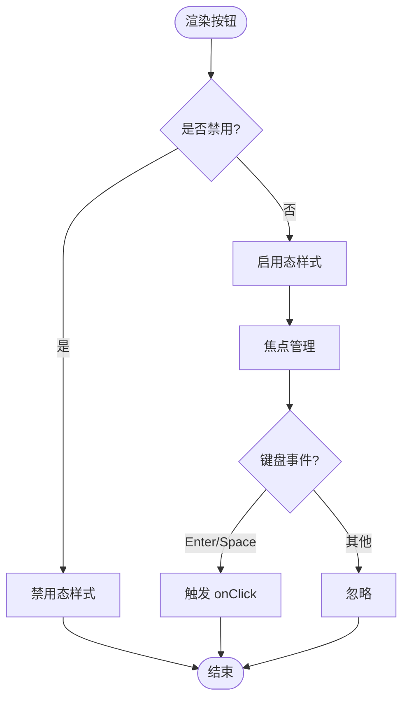
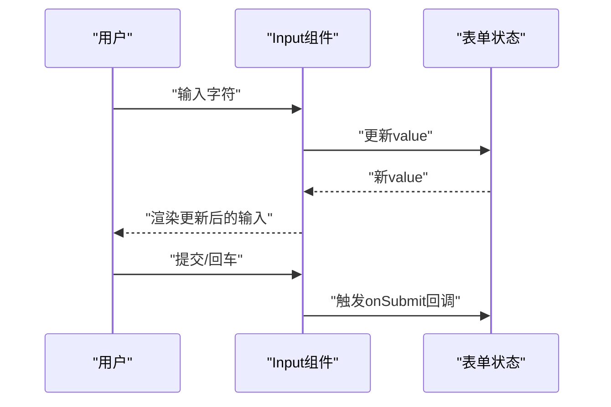
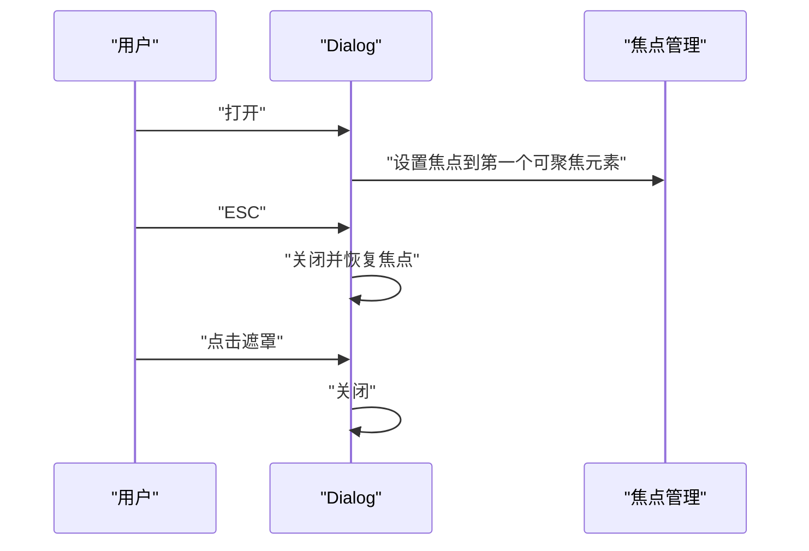
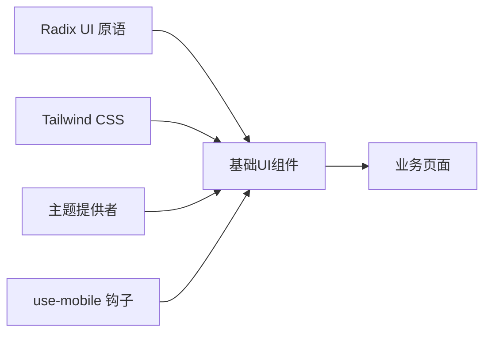

# 基础UI组件

<cite>
**本文引用的文件**   
- [frontend/src/components/ui/button.tsx](file://frontend/src/components/ui/button.tsx)
- [frontend/src/components/ui/input.tsx](file://frontend/src/components/ui/input.tsx)
- [frontend/src/components/ui/dialog.tsx](file://frontend/src/components/ui/dialog.tsx)
- [frontend/src/components/ui/dropdown-menu.tsx](file://frontend/src/components/ui/dropdown-menu.tsx)
- [frontend/src/components/ui/tabs.tsx](file://frontend/src/components/ui/tabs.tsx)
- [frontend/src/components/ui/card.tsx](file://frontend/src/components/ui/card.tsx)
- [frontend/src/components/ui/textarea.tsx](file://frontend/src/components/ui/textarea.tsx)
- [frontend/src/components/ui/select.tsx](file://frontend/src/components/ui/select.tsx)
- [frontend/src/components/ui/badge.tsx](file://frontend/src/components/ui/badge.tsx)
- [frontend/src/components/ui/alert.tsx](file://frontend/src/components/ui/alert.tsx)
- [frontend/src/components/ui/sheet.tsx](file://frontend/src/components/ui/sheet.tsx)
- [frontend/src/components/ui/tooltip.tsx](file://frontend/src/components/ui/tooltip.tsx)
- [frontend/src/components/ui/switch.tsx](file://frontend/src/components/ui/switch.tsx)
- [frontend/src/components/ui/collapsible.tsx](file://frontend/src/components/ui/collapsible.tsx)
- [frontend/src/components/ui/separator.tsx](file://frontend/src/components/ui/separator.tsx)
- [frontend/src/components/ui/progress.tsx](file://frontend/src/components/ui/progress.tsx)
- [frontend/src/components/ui/command.tsx](file://frontend/src/components/ui/command.tsx)
- [frontend/src/components/ui/sidebar.tsx](file://frontend/src/components/ui/sidebar.tsx)
- [frontend/src/components/ui/resizable.tsx](file://frontend/src/components/ui/resizable.tsx)
- [frontend/src/components/ui/hover-card.tsx](file://frontend/src/components/ui/hover-card.tsx)
- [frontend/src/components/ui/scroll-area.tsx](file://frontend/src/components/ui/scroll-area.tsx)
- [frontend/src/components/ui/avatar.tsx](file://frontend/src/components/ui/avatar.tsx)
- [frontend/src/components/ui/breadcrumb.tsx](file://frontend/src/components/ui/breadcrumb.tsx)
- [frontend/src/components/ui/button-group.tsx](file://frontend/src/components/ui/button-group.tsx)
- [frontend/src/components/ui/input-group.tsx](file://frontend/src/components/ui/input-group.tsx)
- [frontend/src/components/ui/toggle.tsx](file://frontend/src/components/ui/toggle.tsx)
- [frontend/src/components/ui/toggle-group.tsx](file://frontend/src/components/ui/toggle-group.tsx)
- [frontend/src/components/ui/skeleton.tsx](file://frontend/src/components/ui/skeleton.tsx)
- [frontend/src/components/ui/sonner.tsx](file://frontend/src/components/ui/sonner.tsx)
- [frontend/src/components/theme-provider.tsx](file://frontend/src/components/theme-provider.tsx)
- [frontend/src/hooks/use-mobile.ts](file://frontend/src/hooks/use-mobile.ts)
- [frontend/components.json](file://frontend/components.json)
- [frontend/package.json](file://frontend/package.json)
</cite>

## 目录
1. [简介](#简介)
2. [项目结构](#项目结构)
3. [核心组件](#核心组件)
4. [架构总览](#架构总览)
5. [详细组件分析](#详细组件分析)
6. [依赖分析](#依赖分析)
7. [性能考虑](#性能考虑)
8. [故障排查指南](#故障排查指南)
9. [结论](#结论)
10. [附录：API参考与使用示例](#附录api参考与使用示例)

## 简介
本文件面向 DeerFlow 前端的基础 UI 组件库，聚焦于基于 Radix UI 构建的通用组件。文档覆盖按钮、输入框、对话框、下拉菜单、标签页、卡片等核心组件的属性配置、事件处理、样式定制、可访问性（键盘导航、屏幕阅读器支持、ARIA）、响应式设计与移动端优化，并提供组合使用与自定义主题的方法。文末附有完整的 API 参考与使用示例路径，便于快速查阅与集成。

## 项目结构
DeerFlow 的前端采用 Next.js + React + TypeScript 技术栈，基础 UI 组件集中于 frontend/src/components/ui 目录，遵循 shadcn/ui 的组织方式，底层依赖 Radix UI 提供无样式、高可访问性的基础能力，并通过 Tailwind CSS 进行样式定制。

```mermaid
graph TB
subgraph "应用层"
APP["Next.js 应用"]
end
subgraph "主题与工具"
THEME["主题提供者<br/>theme-provider.tsx"]
MOBILE["移动端钩子<br/>use-mobile.ts"]
end
subgraph "基础UI组件"
BTN["button.tsx"]
INP["input.tsx"]
DIALOG["dialog.tsx"]
DROPDOWN["dropdown-menu.tsx"]
TABS["tabs.tsx"]
CARD["card.tsx"]
TEXTAREA["textarea.tsx"]
SELECT["select.tsx"]
BADGE["badge.tsx"]
ALERT["alert.tsx"]
SHEET["sheet.tsx"]
TOOLTIP["tooltip.tsx"]
SWITCH["switch.tsx"]
COLLAPSIBLE["collapsible.tsx"]
SEPARATOR["separator.tsx"]
PROGRESS["progress.tsx"]
COMMAND["command.tsx"]
SIDEBAR["sidebar.tsx"]
RESIZABLE["resizable.tsx"]
HOVERCARD["hover-card.tsx"]
SCROLLAREA["scroll-area.tsx"]
AVATAR["avatar.tsx"]
BREADCRUMB["breadcrumb.tsx"]
BUTTONGROUP["button-group.tsx"]
INPUTGROUP["input-group.tsx"]
TOGGLE["toggle.tsx"]
TOGGLEGROUP["toggle-group.tsx"]
SKELETON["skeleton.tsx"]
SONNER["sonner.tsx"]
end
APP --> THEME
APP --> MOBILE
APP --> BTN
APP --> INP
APP --> DIALOG
APP --> DROPDOWN
APP --> TABS
APP --> CARD
APP --> TEXTAREA
APP --> SELECT
APP --> BADGE
APP --> ALERT
APP --> SHEET
APP --> TOOLTIP
APP --> SWITCH
APP --> COLLAPSIBLE
APP --> SEPARATOR
APP --> PROGRESS
APP --> COMMAND
APP --> SIDEBAR
APP --> RESIZABLE
APP --> HOVERCARD
APP --> SCROLLAREA
APP --> AVATAR
APP --> BREADCRUMB
APP --> BUTTONGROUP
APP --> INPUTGROUP
APP --> TOGGLE
APP --> TOGGLEGROUP
APP --> SKELETON
APP --> SONNER
```

图表来源
- [frontend/src/components/theme-provider.tsx](file://frontend/src/components/theme-provider.tsx)
- [frontend/src/hooks/use-mobile.ts](file://frontend/src/hooks/use-mobile.ts)
- [frontend/src/components/ui/button.tsx](file://frontend/src/components/ui/button.tsx)
- [frontend/src/components/ui/input.tsx](file://frontend/src/components/ui/input.tsx)
- [frontend/src/components/ui/dialog.tsx](file://frontend/src/components/ui/dialog.tsx)
- [frontend/src/components/ui/dropdown-menu.tsx](file://frontend/src/components/ui/dropdown-menu.tsx)
- [frontend/src/components/ui/tabs.tsx](file://frontend/src/components/ui/tabs.tsx)
- [frontend/src/components/ui/card.tsx](file://frontend/src/components/ui/card.tsx)
- [frontend/src/components/ui/textarea.tsx](file://frontend/src/components/ui/textarea.tsx)
- [frontend/src/components/ui/select.tsx](file://frontend/src/components/ui/select.tsx)
- [frontend/src/components/ui/badge.tsx](file://frontend/src/components/ui/badge.tsx)
- [frontend/src/components/ui/alert.tsx](file://frontend/src/components/ui/alert.tsx)
- [frontend/src/components/ui/sheet.tsx](file://frontend/src/components/ui/sheet.tsx)
- [frontend/src/components/ui/tooltip.tsx](file://frontend/src/components/ui/tooltip.tsx)
- [frontend/src/components/ui/switch.tsx](file://frontend/src/components/ui/switch.tsx)
- [frontend/src/components/ui/collapsible.tsx](file://frontend/src/components/ui/collapsible.tsx)
- [frontend/src/components/ui/separator.tsx](file://frontend/src/components/ui/separator.tsx)
- [frontend/src/components/ui/progress.tsx](file://frontend/src/components/ui/progress.tsx)
- [frontend/src/components/ui/command.tsx](file://frontend/src/components/ui/command.tsx)
- [frontend/src/components/ui/sidebar.tsx](file://frontend/src/components/ui/sidebar.tsx)
- [frontend/src/components/ui/resizable.tsx](file://frontend/src/components/ui/resizable.tsx)
- [frontend/src/components/ui/hover-card.tsx](file://frontend/src/components/ui/hover-card.tsx)
- [frontend/src/components/ui/scroll-area.tsx](file://frontend/src/components/ui/scroll-area.tsx)
- [frontend/src/components/ui/avatar.tsx](file://frontend/src/components/ui/avatar.tsx)
- [frontend/src/components/ui/breadcrumb.tsx](file://frontend/src/components/ui/breadcrumb.tsx)
- [frontend/src/components/ui/button-group.tsx](file://frontend/src/components/ui/button-group.tsx)
- [frontend/src/components/ui/input-group.tsx](file://frontend/src/components/ui/input-group.tsx)
- [frontend/src/components/ui/toggle.tsx](file://frontend/src/components/ui/toggle.tsx)
- [frontend/src/components/ui/toggle-group.tsx](file://frontend/src/components/ui/toggle-group.tsx)
- [frontend/src/components/ui/skeleton.tsx](file://frontend/src/components/ui/skeleton.tsx)
- [frontend/src/components/ui/sonner.tsx](file://frontend/src/components/ui/sonner.tsx)

章节来源
- [frontend/components.json](file://frontend/components.json)
- [frontend/package.json](file://frontend/package.json)

## 核心组件
本节概述各基础组件的职责与典型用法要点，后续章节将给出更详细的属性、事件、可访问性与样式定制说明。

- 按钮 Button：用于触发操作，支持多种变体（如默认、幽灵、危险等）与尺寸，具备焦点可见性与键盘交互。
- 输入框 Input：文本输入控件，支持占位符、禁用态、只读、大小写控制等；常与表单状态管理结合。
- 文本域 Textarea：多行文本输入，适合长内容编辑场景。
- 选择 Select：原生语义化的下拉选择，支持单选/多选、搜索过滤（配合 Command）。
- 对话框 Dialog：模态窗口，包含标题、内容、动作区，具备焦点管理与 ESC 关闭等无障碍特性。
- 抽屉 Sheet：侧边滑出面板，常用于移动端或辅助信息展示。
- 下拉菜单 Dropdown Menu：上下文菜单或操作列表，支持分组、分隔符、快捷键提示。
- 标签页 Tabs：在多个视图间切换，保持各自状态。
- 卡片 Card：内容容器，常用于信息聚合与布局单元。
- 徽章 Badge：轻量状态标记，如计数、类型、等级等。
- 警告 Alert：反馈信息，如成功、错误、警告、提示等。
- 工具提示 Tooltip：悬停或聚焦时显示简短说明。
- 开关 Switch：布尔值开关控件。
- 折叠 Collapsible：可展开/收起的内容区块。
- 分割线 Separator：视觉分隔元素。
- 进度条 Progress：线性进度指示。
- 命令面板 Command：全局命令搜索与快捷操作入口。
- 侧边栏 Sidebar：页面导航与层级结构展示。
- 可调整大小 Resizable：拖拽调整面板尺寸。
- 悬浮卡片 Hover Card：鼠标悬停显示的详情卡片。
- 滚动区域 Scroll Area：跨平台一致的滚动体验。
- 头像 Avatar：用户或实体头像展示。
- 面包屑 Breadcrumb：页面层级导航。
- 按钮组 Button Group：一组相关按钮的容器。
- 输入组 Input Group：将输入框与前缀/后缀元素组合。
- 切换 Toggle / 切换组 Toggle Group：互斥或非互斥的切换项集合。
- 骨架屏 Skeleton：加载占位效果。
- 通知 Sonner：轻量级 Toast 通知。

章节来源
- [frontend/src/components/ui/button.tsx](file://frontend/src/components/ui/button.tsx)
- [frontend/src/components/ui/input.tsx](file://frontend/src/components/ui/input.tsx)
- [frontend/src/components/ui/textarea.tsx](file://frontend/src/components/ui/textarea.tsx)
- [frontend/src/components/ui/select.tsx](file://frontend/src/components/ui/select.tsx)
- [frontend/src/components/ui/dialog.tsx](file://frontend/src/components/ui/dialog.tsx)
- [frontend/src/components/ui/sheet.tsx](file://frontend/src/components/ui/sheet.tsx)
- [frontend/src/components/ui/dropdown-menu.tsx](file://frontend/src/components/ui/dropdown-menu.tsx)
- [frontend/src/components/ui/tabs.tsx](file://frontend/src/components/ui/tabs.tsx)
- [frontend/src/components/ui/card.tsx](file://frontend/src/components/ui/card.tsx)
- [frontend/src/components/ui/badge.tsx](file://frontend/src/components/ui/badge.tsx)
- [frontend/src/components/ui/alert.tsx](file://frontend/src/components/ui/alert.tsx)
- [frontend/src/components/ui/tooltip.tsx](file://frontend/src/components/ui/tooltip.tsx)
- [frontend/src/components/ui/switch.tsx](file://frontend/src/components/ui/switch.tsx)
- [frontend/src/components/ui/collapsible.tsx](file://frontend/src/components/ui/collapsible.tsx)
- [frontend/src/components/ui/separator.tsx](file://frontend/src/components/ui/separator.tsx)
- [frontend/src/components/ui/progress.tsx](file://frontend/src/components/ui/progress.tsx)
- [frontend/src/components/ui/command.tsx](file://frontend/src/components/ui/command.tsx)
- [frontend/src/components/ui/sidebar.tsx](file://frontend/src/components/ui/sidebar.tsx)
- [frontend/src/components/ui/resizable.tsx](file://frontend/src/components/ui/resizable.tsx)
- [frontend/src/components/ui/hover-card.tsx](file://frontend/src/components/ui/hover-card.tsx)
- [frontend/src/components/ui/scroll-area.tsx](file://frontend/src/components/ui/scroll-area.tsx)
- [frontend/src/components/ui/avatar.tsx](file://frontend/src/components/ui/avatar.tsx)
- [frontend/src/components/ui/breadcrumb.tsx](file://frontend/src/components/ui/breadcrumb.tsx)
- [frontend/src/components/ui/button-group.tsx](file://frontend/src/components/ui/button-group.tsx)
- [frontend/src/components/ui/input-group.tsx](file://frontend/src/components/ui/input-group.tsx)
- [frontend/src/components/ui/toggle.tsx](file://frontend/src/components/ui/toggle.tsx)
- [frontend/src/components/ui/toggle-group.tsx](file://frontend/src/components/ui/toggle-group.tsx)
- [frontend/src/components/ui/skeleton.tsx](file://frontend/src/components/ui/skeleton.tsx)
- [frontend/src/components/ui/sonner.tsx](file://frontend/src/components/ui/sonner.tsx)

## 架构总览
基础 UI 组件以“无样式、强可访问”的 Radix 原语为基石，通过 React 组合模式与 Tailwind CSS 实现外观与行为扩展。主题系统由 theme-provider 统一管理，移动端适配通过 use-mobile 钩子提供断点判断。

```mermaid
classDiagram
class ThemeProvider {
+提供主题上下文
+支持明暗主题切换
}
class UseMobile {
+返回当前是否移动端
}
class Button {
+变体 : 默认/幽灵/危险
+尺寸 : 默认/小/大
+禁用/加载态
}
class Input {
+占位符/禁用/只读
+大小写控制
}
class Dialog {
+打开/关闭状态
+焦点管理
+ESC关闭
}
class DropdownMenu {
+菜单项/分组/分隔符
+快捷键提示
}
class Tabs {
+激活态标签
+内容面板
}
class Card {
+头部/主体/底部
}
class Select {
+单选/多选
+搜索(可选)
}
class Tooltip {
+延迟显示
+定位策略
}
class Switch {
+受控/非受控
+禁用态
}
class Command {
+命令搜索
+快捷键绑定
}
class Sidebar {
+折叠/展开
+导航项
}
class Resizable {
+拖拽调整尺寸
}
class HoverCard {
+悬停显示详情
}
class ScrollArea {
+统一滚动样式
}
class Avatar {
+图片/首字母回退
}
class Breadcrumb {
+层级导航
}
class ButtonGroup {
+按钮分组容器
}
class InputGroup {
+前缀/后缀元素
}
class Toggle {
+选中/未选中
}
class ToggleGroup {
+互斥/非互斥
}
class Skeleton {
+加载骨架占位
}
class Sonner {
+Toast通知
}
ThemeProvider --> Button : "主题变量"
ThemeProvider --> Input : "主题变量"
ThemeProvider --> Dialog : "主题变量"
ThemeProvider --> DropdownMenu : "主题变量"
ThemeProvider --> Tabs : "主题变量"
ThemeProvider --> Card : "主题变量"
ThemeProvider --> Select : "主题变量"
ThemeProvider --> Tooltip : "主题变量"
ThemeProvider --> Switch : "主题变量"
ThemeProvider --> Command : "主题变量"
ThemeProvider --> Sidebar : "主题变量"
ThemeProvider --> Resizable : "主题变量"
ThemeProvider --> HoverCard : "主题变量"
ThemeProvider --> ScrollArea : "主题变量"
ThemeProvider --> Avatar : "主题变量"
ThemeProvider --> Breadcrumb : "主题变量"
ThemeProvider --> ButtonGroup : "主题变量"
ThemeProvider --> InputGroup : "主题变量"
ThemeProvider --> Toggle : "主题变量"
ThemeProvider --> ToggleGroup : "主题变量"
ThemeProvider --> Skeleton : "主题变量"
ThemeProvider --> Sonner : "主题变量"
UseMobile --> Button : "响应式尺寸"
UseMobile --> Input : "响应式间距"
UseMobile --> Dialog : "全屏/居中"
UseMobile --> Sheet : "全屏/边缘"
UseMobile --> Sidebar : "折叠/隐藏"
UseMobile --> Resizable : "限制最小宽度"
```

图表来源
- [frontend/src/components/theme-provider.tsx](file://frontend/src/components/theme-provider.tsx)
- [frontend/src/hooks/use-mobile.ts](file://frontend/src/hooks/use-mobile.ts)
- [frontend/src/components/ui/button.tsx](file://frontend/src/components/ui/button.tsx)
- [frontend/src/components/ui/input.tsx](file://frontend/src/components/ui/input.tsx)
- [frontend/src/components/ui/dialog.tsx](file://frontend/src/components/ui/dialog.tsx)
- [frontend/src/components/ui/dropdown-menu.tsx](file://frontend/src/components/ui/dropdown-menu.tsx)
- [frontend/src/components/ui/tabs.tsx](file://frontend/src/components/ui/tabs.tsx)
- [frontend/src/components/ui/card.tsx](file://frontend/src/components/ui/card.tsx)
- [frontend/src/components/ui/select.tsx](file://frontend/src/components/ui/select.tsx)
- [frontend/src/components/ui/tooltip.tsx](file://frontend/src/components/ui/tooltip.tsx)
- [frontend/src/components/ui/switch.tsx](file://frontend/src/components/ui/switch.tsx)
- [frontend/src/components/ui/command.tsx](file://frontend/src/components/ui/command.tsx)
- [frontend/src/components/ui/sidebar.tsx](file://frontend/src/components/ui/sidebar.tsx)
- [frontend/src/components/ui/resizable.tsx](file://frontend/src/components/ui/resizable.tsx)
- [frontend/src/components/ui/hover-card.tsx](file://frontend/src/components/ui/hover-card.tsx)
- [frontend/src/components/ui/scroll-area.tsx](file://frontend/src/components/ui/scroll-area.tsx)
- [frontend/src/components/ui/avatar.tsx](file://frontend/src/components/ui/avatar.tsx)
- [frontend/src/components/ui/breadcrumb.tsx](file://frontend/src/components/ui/breadcrumb.tsx)
- [frontend/src/components/ui/button-group.tsx](file://frontend/src/components/ui/button-group.tsx)
- [frontend/src/components/ui/input-group.tsx](file://frontend/src/components/ui/input-group.tsx)
- [frontend/src/components/ui/toggle.tsx](file://frontend/src/components/ui/toggle.tsx)
- [frontend/src/components/ui/toggle-group.tsx](file://frontend/src/components/ui/toggle-group.tsx)
- [frontend/src/components/ui/skeleton.tsx](file://frontend/src/components/ui/skeleton.tsx)
- [frontend/src/components/ui/sonner.tsx](file://frontend/src/components/ui/sonner.tsx)

## 详细组件分析

### 按钮 Button
- 功能与职责：触发操作，支持多种变体与尺寸，具备清晰的焦点环与键盘交互。
- 关键属性：
  - 变体：默认、幽灵、危险等
  - 尺寸：默认、小、大
  - 状态：禁用、加载
  - 事件：onClick、onKeyDown 等
- 可访问性：
  - 正确的 role 与 tabindex
  - 焦点可见性
  - 键盘 Enter/Space 触发
- 样式定制：
  - 通过 Tailwind 类名覆盖颜色、圆角、阴影
  - 主题变量驱动明暗主题
- 响应式与移动端：
  - 根据 use-mobile 调整尺寸与内边距
  - 触摸友好的点击区域

图表来源
- [frontend/src/components/ui/button.tsx](file://frontend/src/components/ui/button.tsx)
- [frontend/src/hooks/use-mobile.ts](file://frontend/src/hooks/use-mobile.ts)

章节来源
- [frontend/src/components/ui/button.tsx](file://frontend/src/components/ui/button.tsx)
- [frontend/src/hooks/use-mobile.ts](file://frontend/src/hooks/use-mobile.ts)

### 输入框 Input
- 功能与职责：单行文本输入，支持占位符、禁用、只读、大小写控制等。
- 关键属性：
  - value/onValueChange（受控）
  - placeholder、disabled、readOnly
  - type、maxLength、pattern 等原生属性透传
- 可访问性：
  - label 关联（通过 htmlFor 或 aria-label）
  - 错误提示（aria-describedby）
  - 焦点与键盘导航
- 样式定制：
  - 边框、圆角、背景、字体大小
  - 主题变量适配明暗
- 响应式与移动端：
  - 字体与内边距随设备调整
  - 输入法兼容（IME）

图表来源
- [frontend/src/components/ui/input.tsx](file://frontend/src/components/ui/input.tsx)

章节来源
- [frontend/src/components/ui/input.tsx](file://frontend/src/components/ui/input.tsx)

### 文本域 Textarea
- 功能与职责：多行文本输入，适合长内容编辑。
- 关键属性：
  - rows、cols、placeholder、disabled、readOnly
  - 自动高度（可选）
- 可访问性：
  - 与 label 关联
  - 错误描述 aria-describedby
- 样式定制：
  - 行高、字距、滚动条样式
- 响应式与移动端：
  - 自适应高度与键盘弹出空间

章节来源
- [frontend/src/components/ui/textarea.tsx](file://frontend/src/components/ui/textarea.tsx)

### 选择 Select
- 功能与职责：下拉选择，支持单选/多选与搜索（结合 Command）。
- 关键属性：
  - value/onValueChange（受控）
  - 选项数组、分组、禁用项
  - 搜索过滤（可选）
- 可访问性：
  - 键盘上下键导航、Enter确认、Esc关闭
  - ARIA 角色与状态同步
- 样式定制：
  - 下拉面板定位、滚动区域、选中态高亮
- 响应式与移动端：
  - 全屏/半屏面板适配

章节来源
- [frontend/src/components/ui/select.tsx](file://frontend/src/components/ui/select.tsx)
- [frontend/src/components/ui/command.tsx](file://frontend/src/components/ui/command.tsx)

### 对话框 Dialog
- 功能与职责：模态窗口，包含标题、内容、动作区。
- 关键属性：
  - open/onOpenChange
  - 标题、描述、动作按钮
- 可访问性：
  - 焦点陷阱、ESC关闭、返回历史
  - aria-modal、role="dialog"
- 样式定制：
  - 遮罩透明度、圆角、阴影、动画
- 响应式与移动端：
  - 全屏/居中显示，避免遮挡输入

图表来源
- [frontend/src/components/ui/dialog.tsx](file://frontend/src/components/ui/dialog.tsx)

章节来源
- [frontend/src/components/ui/dialog.tsx](file://frontend/src/components/ui/dialog.tsx)

### 抽屉 Sheet
- 功能与职责：侧边滑出面板，常用于移动端或辅助信息。
- 关键属性：
  - side（左/右/上/下）
  - open/onOpenChange
  - 遮罩与手势关闭（可选）
- 可访问性：
  - 焦点管理、ARIA 状态同步
- 样式定制：
  - 宽度/高度、阴影、过渡动画
- 响应式与移动端：
  - 全屏/边缘滑出，触控友好

章节来源
- [frontend/src/components/ui/sheet.tsx](file://frontend/src/components/ui/sheet.tsx)

### 下拉菜单 Dropdown Menu
- 功能与职责：上下文菜单或操作列表，支持分组、分隔符、快捷键提示。
- 关键属性：
  - 菜单项、禁用项、分隔符
  - 快捷键提示、嵌套菜单（可选）
- 可访问性：
  - 箭头键导航、Enter/Space 选择、Esc关闭
  - aria-haspopup、aria-expanded 等
- 样式定制：
  - 定位策略、滚动区域、选中态高亮
- 响应式与移动端：
  - 触底/触边修正定位

章节来源
- [frontend/src/components/ui/dropdown-menu.tsx](file://frontend/src/components/ui/dropdown-menu.tsx)

### 标签页 Tabs
- 功能与职责：在多个视图间切换，保持各自状态。
- 关键属性：
  - activeTab/onTabChange
  - 标签项与内容面板
- 可访问性：
  - 键盘左右切换、Enter激活
  - aria-selected、role="tablist/tab/tabpanel"
- 样式定制：
  - 激活态指示器、分隔线、动画
- 响应式与移动端：
  - 横向滚动、紧凑布局

章节来源
- [frontend/src/components/ui/tabs.tsx](file://frontend/src/components/ui/tabs.tsx)

### 卡片 Card
- 功能与职责：内容容器，常用于信息聚合与布局单元。
- 关键属性：
  - 头部、主体、底部插槽
  - 边框、阴影、圆角
- 可访问性：
  - 语义化结构（header/main/footer）
- 样式定制：
  - 背景、边框、间距、阴影
- 响应式与移动端：
  - 全宽/窄列布局、内边距调整

章节来源
- [frontend/src/components/ui/card.tsx](file://frontend/src/components/ui/card.tsx)

### 徽章 Badge
- 功能与职责：轻量状态标记，如计数、类型、等级。
- 关键属性：
  - 变体（成功、警告、错误、信息）
  - 尺寸、是否圆形
- 可访问性：
  - 语义化文本、必要时 aria-label
- 样式定制：
  - 颜色、圆角、字号
- 响应式与移动端：
  - 紧凑显示、避免溢出

章节来源
- [frontend/src/components/ui/badge.tsx](file://frontend/src/components/ui/badge.tsx)

### 警告 Alert
- 功能与职责：反馈信息，如成功、错误、警告、提示。
- 关键属性：
  - 变体、图标、标题、描述
  - 可关闭（可选）
- 可访问性：
  - role="alert" 或 status 语义
  - 自动聚焦（可选）
- 样式定制：
  - 颜色、边框、图标位置
- 响应式与移动端：
  - 全宽/窄列、内边距调整

章节来源
- [frontend/src/components/ui/alert.tsx](file://frontend/src/components/ui/alert.tsx)

### 工具提示 Tooltip
- 功能与职责：悬停或聚焦时显示简短说明。
- 关键属性：
  - 延迟显示、定位策略、触发方式（hover/focus）
- 可访问性：
  - aria-describedby、焦点可见性
- 样式定制：
  - 背景、圆角、阴影、字体大小
- 响应式与移动端：
  - 点击触发替代悬停（可选）

章节来源
- [frontend/src/components/ui/tooltip.tsx](file://frontend/src/components/ui/tooltip.tsx)

### 开关 Switch
- 功能与职责：布尔值开关控件。
- 关键属性：
  - checked/onCheckedChange、disabled
- 可访问性：
  - role="switch"、aria-checked
  - 键盘空格切换
- 样式定制：
  - 轨道与滑块样式、颜色
- 响应式与移动端：
  - 增大点击区域

章节来源
- [frontend/src/components/ui/switch.tsx](file://frontend/src/components/ui/switch.tsx)

### 折叠 Collapsible
- 功能与职责：可展开/收起的内容区块。
- 关键属性：
  - open/onOpenChange
  - 触发按钮与内容区域
- 可访问性：
  - aria-expanded、键盘 Enter/Space 切换
- 样式定制：
  - 过渡动画、图标旋转
- 响应式与移动端：
  - 默认展开/收起策略

章节来源
- [frontend/src/components/ui/collapsible.tsx](file://frontend/src/components/ui/collapsible.tsx)

### 分割线 Separator
- 功能与职责：视觉分隔元素。
- 关键属性：
  - orientation（水平/垂直）
  - 样式（粗细、颜色）
- 可访问性：
  - role="separator"
- 样式定制：
  - 边框、渐变、虚线
- 响应式与移动端：
  - 间距调整

章节来源
- [frontend/src/components/ui/separator.tsx](file://frontend/src/components/ui/separator.tsx)

### 进度条 Progress
- 功能与职责：线性进度指示。
- 关键属性：
  - value/max、indeterminate
  - 颜色与尺寸
- 可访问性：
  - role="progressbar"、aria-valuenow/min/max
- 样式定制：
  - 轨道与填充样式
- 响应式与移动端：
  - 全宽/窄列适配

章节来源
- [frontend/src/components/ui/progress.tsx](file://frontend/src/components/ui/progress.tsx)

### 命令面板 Command
- 功能与职责：全局命令搜索与快捷操作入口。
- 关键属性：
  - 命令列表、分组、快捷键提示
  - 搜索过滤、异步加载
- 可访问性：
  - 键盘导航、Enter执行、Esc关闭
- 样式定制：
  - 搜索框、结果高亮、滚动区域
- 响应式与移动端：
  - 全屏/半屏面板

章节来源
- [frontend/src/components/ui/command.tsx](file://frontend/src/components/ui/command.tsx)

### 侧边栏 Sidebar
- 功能与职责：页面导航与层级结构展示。
- 关键属性：
  - 折叠/展开、导航项、图标
  - 响应式隐藏/显示
- 可访问性：
  - 导航语义、键盘导航
- 样式定制：
  - 宽度、背景、选中态
- 响应式与移动端：
  - 抽屉式/固定式切换

章节来源
- [frontend/src/components/ui/sidebar.tsx](file://frontend/src/components/ui/sidebar.tsx)

### 可调整大小 Resizable
- 功能与职责：拖拽调整面板尺寸。
- 关键属性：
  - 最小/最大尺寸、方向（水平/垂直）
  - 拖拽手柄
- 可访问性：
  - 键盘微调（可选）
- 样式定制：
  - 手柄样式、边界吸附
- 响应式与移动端：
  - 触控拖拽、限制最小宽度

章节来源
- [frontend/src/components/ui/resizable.tsx](file://frontend/src/components/ui/resizable.tsx)

### 悬浮卡片 Hover Card
- 功能与职责：鼠标悬停显示的详情卡片。
- 关键属性：
  - 延迟显示、定位策略
  - 内容插槽
- 可访问性：
  - aria-describedby、焦点可见性
- 样式定制：
  - 阴影、圆角、背景
- 响应式与移动端：
  - 点击触发替代悬停（可选）

章节来源
- [frontend/src/components/ui/hover-card.tsx](file://frontend/src/components/ui/hover-card.tsx)

### 滚动区域 Scroll Area
- 功能与职责：跨平台一致的滚动体验。
- 关键属性：
  - 滚动条样式、方向
- 可访问性：
  - 焦点管理、键盘滚动
- 样式定制：
  - 滚动条宽度、颜色
- 响应式与移动端：
  - 触控滚动优化

章节来源
- [frontend/src/components/ui/scroll-area.tsx](file://frontend/src/components/ui/scroll-area.tsx)

### 头像 Avatar
- 功能与职责：用户或实体头像展示。
- 关键属性：
  - 图片源、首字母回退、尺寸
- 可访问性：
  - alt 文本、loading 懒加载
- 样式定制：
  - 圆角、边框、阴影
- 响应式与移动端：
  - 尺寸缩放

章节来源
- [frontend/src/components/ui/avatar.tsx](file://frontend/src/components/ui/avatar.tsx)

### 面包屑 Breadcrumb
- 功能与职责：页面层级导航。
- 关键属性：
  - 层级项、分隔符、当前页高亮
- 可访问性：
  - 导航语义、键盘导航
- 样式定制：
  - 颜色、间距、图标
- 响应式与移动端：
  - 省略中间项

章节来源
- [frontend/src/components/ui/breadcrumb.tsx](file://frontend/src/components/ui/breadcrumb.tsx)

### 按钮组 Button Group
- 功能与职责：一组相关按钮的容器。
- 关键属性：
  - 方向（水平/垂直）、间距
- 可访问性：
  - 键盘左右切换焦点
- 样式定制：
  - 边框合并、选中态
- 响应式与移动端：
  - 紧凑排列

章节来源
- [frontend/src/components/ui/button-group.tsx](file://frontend/src/components/ui/button-group.tsx)

### 输入组 Input Group
- 功能与职责：将输入框与前缀/后缀元素组合。
- 关键属性：
  - 前缀/后缀插槽、对齐方式
- 可访问性：
  - 与输入框联动焦点
- 样式定制：
  - 边框合并、背景色
- 响应式与移动端：
  - 纵向堆叠（可选）

章节来源
- [frontend/src/components/ui/input-group.tsx](file://frontend/src/components/ui/input-group.tsx)

### 切换 Toggle / 切换组 Toggle Group
- 功能与职责：互斥或非互斥的切换项集合。
- 关键属性：
  - 选中态、禁用态、值集合
- 可访问性：
  - 键盘导航、aria-pressed/aria-checked
- 样式定制：
  - 选中态高亮、边框合并
- 响应式与移动端：
  - 触控友好

章节来源
- [frontend/src/components/ui/toggle.tsx](file://frontend/src/components/ui/toggle.tsx)
- [frontend/src/components/ui/toggle-group.tsx](file://frontend/src/components/ui/toggle-group.tsx)

### 骨架屏 Skeleton
- 功能与职责：加载占位效果。
- 关键属性：
  - 形状（矩形/圆形）、尺寸
- 可访问性：
  - aria-busy 或 role="status"
- 样式定制：
  - 动画、颜色
- 响应式与移动端：
  - 尺寸缩放

章节来源
- [frontend/src/components/ui/skeleton.tsx](file://frontend/src/components/ui/skeleton.tsx)

### 通知 Sonner
- 功能与职责：轻量级 Toast 通知。
- 关键属性：
  - 类型（成功、错误、警告、信息）
  - 自动关闭、持久化
- 可访问性：
  - 屏幕阅读器播报
- 样式定制：
  - 位置、动画、颜色
- 响应式与移动端：
  - 顶部/底部固定

章节来源
- [frontend/src/components/ui/sonner.tsx](file://frontend/src/components/ui/sonner.tsx)

## 依赖分析
基础 UI 组件依赖 Radix UI 提供的无样式、可访问的原语，并通过 Tailwind CSS 进行样式定制。主题系统由 theme-provider 统一管理，移动端适配通过 use-mobile 钩子提供断点判断。

图表来源
- [frontend/package.json](file://frontend/package.json)
- [frontend/components.json](file://frontend/components.json)
- [frontend/src/components/theme-provider.tsx](file://frontend/src/components/theme-provider.tsx)
- [frontend/src/hooks/use-mobile.ts](file://frontend/src/hooks/use-mobile.ts)

章节来源
- [frontend/package.json](file://frontend/package.json)
- [frontend/components.json](file://frontend/components.json)

## 性能考虑
- 按需引入：仅导入使用的组件，减少打包体积。
- 懒加载：对重型组件（如命令面板、侧边栏）使用动态导入。
- 虚拟化：长列表场景使用虚拟滚动（可结合 Scroll Area）。
- 避免重排：批量更新 DOM，减少频繁状态变更。
- 主题切换：使用 CSS 变量与 Tailwind 类名切换，避免整树重渲染。
- 移动端优化：减少不必要的动画与阴影，提升滚动流畅度。

## 故障排查指南
- 焦点丢失：检查 Dialog/Sheet/Command 的焦点陷阱是否正确配置。
- 键盘不可用：确保所有交互组件具备正确的 role 与键盘事件处理。
- 主题不生效：确认 theme-provider 已包裹根节点，且 Tailwind 配置正确。
- 移动端错位：检查 use-mobile 断点与定位策略，必要时调整 z-index。
- 屏幕阅读器无播报：验证 aria-* 属性与语义化标签的使用。

## 结论
DeerFlow 的基础 UI 组件库以 Radix UI 为核心，结合 Tailwind CSS 与主题系统，提供了高可访问、易定制、响应式友好的通用组件。通过统一的 API 与设计规范，开发者可以快速构建一致的用户界面，并在不同设备上获得良好的交互体验。

## 附录：API参考与使用示例
以下为各组件的关键 API 与使用示例路径，便于快速查阅与集成。请根据实际项目需求选择合适的属性与事件。

- 按钮 Button
  - 属性：变体、尺寸、禁用、加载
  - 事件：onClick、onKeyDown
  - 示例路径：[frontend/src/components/ui/button.tsx](file://frontend/src/components/ui/button.tsx)

- 输入框 Input
  - 属性：value、placeholder、disabled、readOnly、type
  - 事件：onChange、onSubmit
  - 示例路径：[frontend/src/components/ui/input.tsx](file://frontend/src/components/ui/input.tsx)

- 文本域 Textarea
  - 属性：rows、cols、placeholder、disabled、readOnly
  - 事件：onChange、onSubmit
  - 示例路径：[frontend/src/components/ui/textarea.tsx](file://frontend/src/components/ui/textarea.tsx)

- 选择 Select
  - 属性：value、onValueChange、选项数组、分组、禁用项
  - 事件：onSelect、onSearch（可选）
  - 示例路径：[frontend/src/components/ui/select.tsx](file://frontend/src/components/ui/select.tsx)

- 对话框 Dialog
  - 属性：open、onOpenChange、标题、描述、动作
  - 事件：onClose、onAction
  - 示例路径：[frontend/src/components/ui/dialog.tsx](file://frontend/src/components/ui/dialog.tsx)

- 抽屉 Sheet
  - 属性：side、open、onOpenChange、遮罩
  - 事件：onClose
  - 示例路径：[frontend/src/components/ui/sheet.tsx](file://frontend/src/components/ui/sheet.tsx)

- 下拉菜单 Dropdown Menu
  - 属性：菜单项、分组、分隔符、快捷键提示
  - 事件：onSelect
  - 示例路径：[frontend/src/components/ui/dropdown-menu.tsx](file://frontend/src/components/ui/dropdown-menu.tsx)

- 标签页 Tabs
  - 属性：activeTab、onTabChange、标签项、内容面板
  - 事件：onTabChange
  - 示例路径：[frontend/src/components/ui/tabs.tsx](file://frontend/src/components/ui/tabs.tsx)

- 卡片 Card
  - 属性：头部、主体、底部插槽
  - 事件：无（容器组件）
  - 示例路径：[frontend/src/components/ui/card.tsx](file://frontend/src/components/ui/card.tsx)

- 徽章 Badge
  - 属性：变体、尺寸、是否圆形
  - 事件：无（展示组件）
  - 示例路径：[frontend/src/components/ui/badge.tsx](file://frontend/src/components/ui/badge.tsx)

- 警告 Alert
  - 属性：变体、图标、标题、描述、可关闭
  - 事件：onClose（可选）
  - 示例路径：[frontend/src/components/ui/alert.tsx](file://frontend/src/components/ui/alert.tsx)

- 工具提示 Tooltip
  - 属性：延迟显示、定位策略、触发方式
  - 事件：onShow、onHide（可选）
  - 示例路径：[frontend/src/components/ui/tooltip.tsx](file://frontend/src/components/ui/tooltip.tsx)

- 开关 Switch
  - 属性：checked、onCheckedChange、disabled
  - 事件：onCheckedChange
  - 示例路径：[frontend/src/components/ui/switch.tsx](file://frontend/src/components/ui/switch.tsx)

- 折叠 Collapsible
  - 属性：open、onOpenChange
  - 事件：onOpenChange
  - 示例路径：[frontend/src/components/ui/collapsible.tsx](file://frontend/src/components/ui/collapsible.tsx)

- 分割线 Separator
  - 属性：orientation、样式
  - 事件：无（展示组件）
  - 示例路径：[frontend/src/components/ui/separator.tsx](file://frontend/src/components/ui/separator.tsx)

- 进度条 Progress
  - 属性：value、max、indeterminate、颜色、尺寸
  - 事件：无（展示组件）
  - 示例路径：[frontend/src/components/ui/progress.tsx](file://frontend/src/components/ui/progress.tsx)

- 命令面板 Command
  - 属性：命令列表、分组、快捷键提示、搜索过滤
  - 事件：onSelect、onSearch
  - 示例路径：[frontend/src/components/ui/command.tsx](file://frontend/src/components/ui/command.tsx)

- 侧边栏 Sidebar
  - 属性：折叠/展开、导航项、图标
  - 事件：onToggle、onNavigate
  - 示例路径：[frontend/src/components/ui/sidebar.tsx](file://frontend/src/components/ui/sidebar.tsx)

- 可调整大小 Resizable
  - 属性：最小/最大尺寸、方向、拖拽手柄
  - 事件：onResize
  - 示例路径：[frontend/src/components/ui/resizable.tsx](file://frontend/src/components/ui/resizable.tsx)

- 悬浮卡片 Hover Card
  - 属性：延迟显示、定位策略、内容插槽
  - 事件：onShow、onHide（可选）
  - 示例路径：[frontend/src/components/ui/hover-card.tsx](file://frontend/src/components/ui/hover-card.tsx)

- 滚动区域 Scroll Area
  - 属性：滚动条样式、方向
  - 事件：onScroll（可选）
  - 示例路径：[frontend/src/components/ui/scroll-area.tsx](file://frontend/src/components/ui/scroll-area.tsx)

- 头像 Avatar
  - 属性：图片源、首字母回退、尺寸
  - 事件：onError（可选）
  - 示例路径：[frontend/src/components/ui/avatar.tsx](file://frontend/src/components/ui/avatar.tsx)

- 面包屑 Breadcrumb
  - 属性：层级项、分隔符、当前页高亮
  - 事件：onNavigate
  - 示例路径：[frontend/src/components/ui/breadcrumb.tsx](file://frontend/src/components/ui/breadcrumb.tsx)

- 按钮组 Button Group
  - 属性：方向、间距
  - 事件：无（容器组件）
  - 示例路径：[frontend/src/components/ui/button-group.tsx](file://frontend/src/components/ui/button-group.tsx)

- 输入组 Input Group
  - 属性：前缀/后缀插槽、对齐方式
  - 事件：与输入框联动
  - 示例路径：[frontend/src/components/ui/input-group.tsx](file://frontend/src/components/ui/input-group.tsx)

- 切换 Toggle / 切换组 Toggle Group
  - 属性：选中态、禁用态、值集合
  - 事件：onValueChange
  - 示例路径：[frontend/src/components/ui/toggle.tsx](file://frontend/src/components/ui/toggle.tsx)、[frontend/src/components/ui/toggle-group.tsx](file://frontend/src/components/ui/toggle-group.tsx)

- 骨架屏 Skeleton
  - 属性：形状、尺寸
  - 事件：无（展示组件）
  - 示例路径：[frontend/src/components/ui/skeleton.tsx](file://frontend/src/components/ui/skeleton.tsx)

- 通知 Sonner
  - 属性：类型、自动关闭、持久化
  - 事件：onDismiss（可选）
  - 示例路径：[frontend/src/components/ui/sonner.tsx](file://frontend/src/components/ui/sonner.tsx)