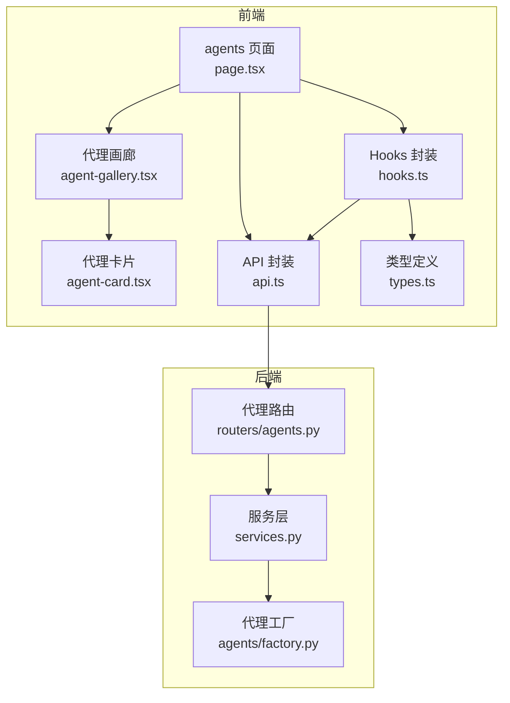
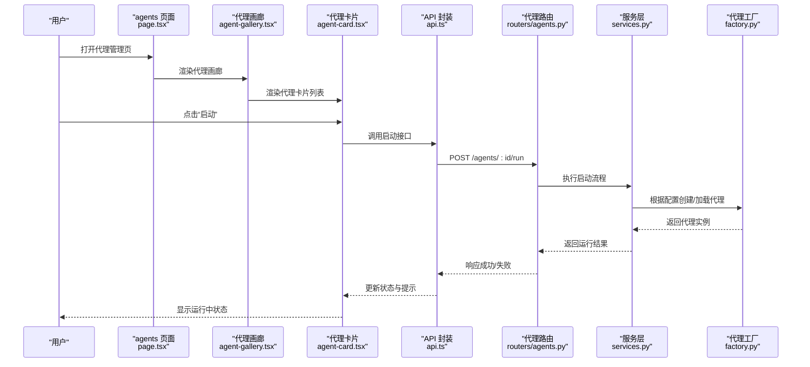
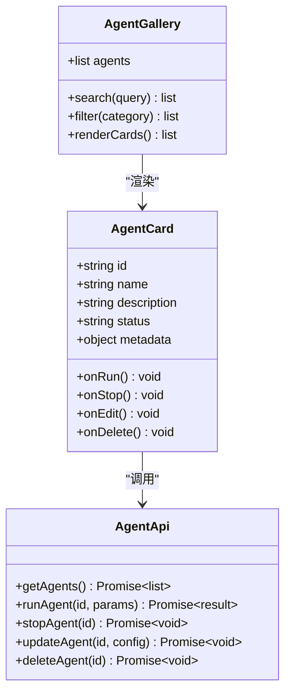
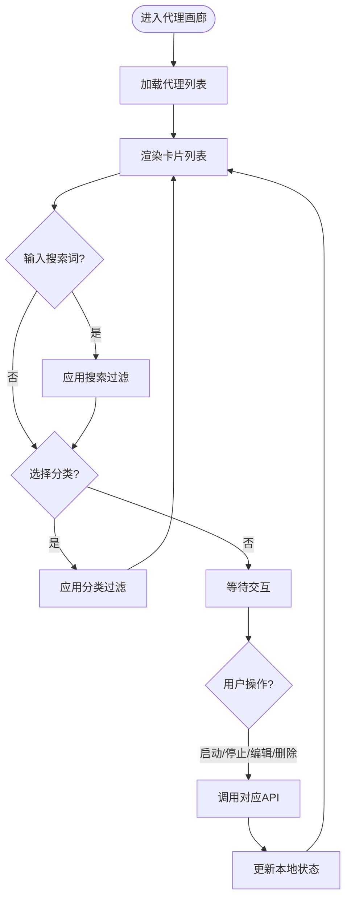
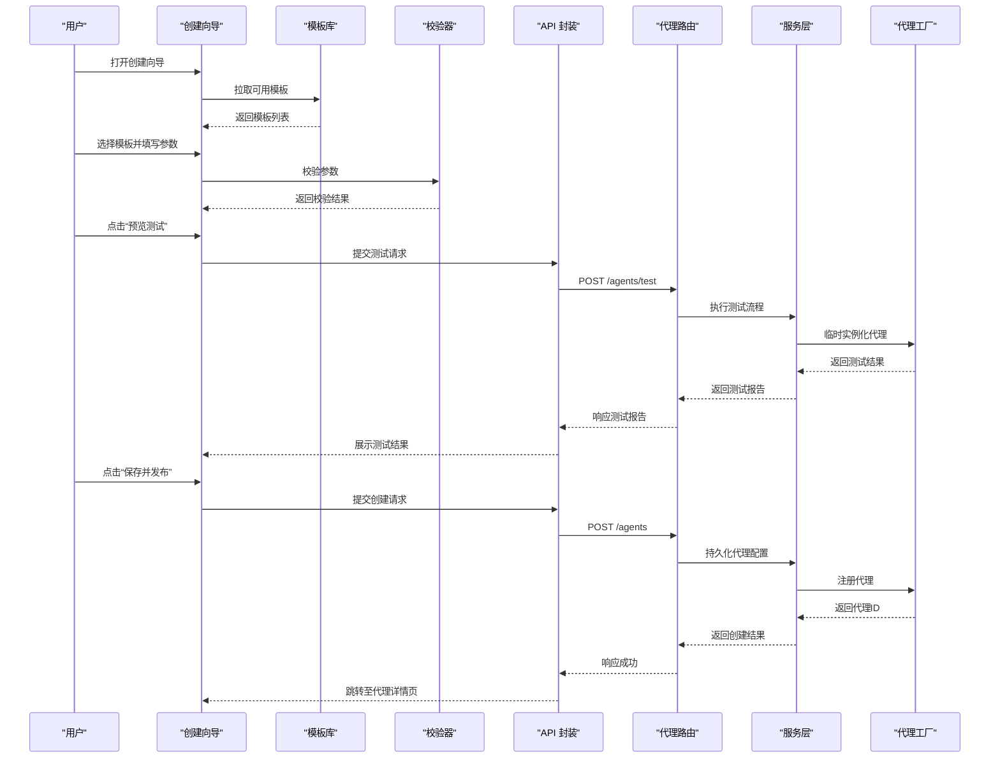
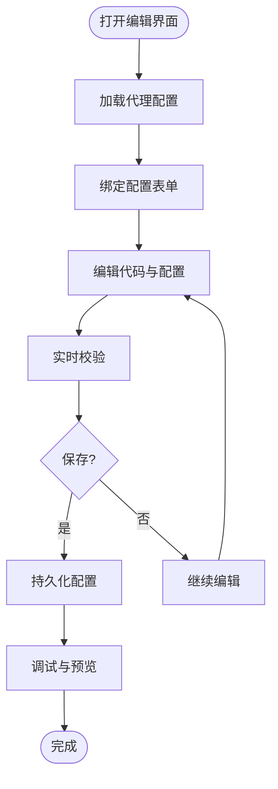
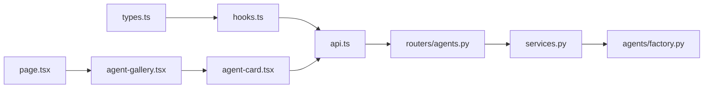

# 代理管理组件

<cite>
**本文引用的文件**
- [frontend/src/app/workspace/agents/page.tsx](file://frontend/src/app/workspace/agents/page.tsx)
- [frontend/src/components/workspace/agents/agent-card.tsx](file://frontend/src/components/workspace/agents/agent-card.tsx)
- [frontend/src/components/workspace/agents/agent-gallery.tsx](file://frontend/src/components/workspace/agents/agent-gallery.tsx)
- [frontend/src/core/agents/api.ts](file://frontend/src/core/agents/api.ts)
- [frontend/src/core/agents/hooks.ts](file://frontend/src/core/agents/hooks.ts)
- [frontend/src/core/agents/types.ts](file://frontend/src/core/agents/types.ts)
- [backend/app/gateway/routers/agents.py](file://backend/app/gateway/routers/agents.py)
- [backend/app/gateway/services.py](file://backend/app/gateway/services.py)
- [backend/packages/harness/deerflow/agents/factory.py](file://backend/packages/harness/deerflow/agents/factory.py)
</cite>

## 目录
1. [简介](#简介)
2. [项目结构](#项目结构)
3. [核心组件](#核心组件)
4. [架构总览](#架构总览)
5. [详细组件分析](#详细组件分析)
6. [依赖关系分析](#依赖关系分析)
7. [性能考虑](#性能考虑)
8. [故障排查指南](#故障排查指南)
9. [结论](#结论)
10. [附录](#附录)

## 简介
本文件面向DeerFlow的“代理管理”功能，聚焦前端代理卡片、代理画廊、创建向导与编辑界面，以及后端API集成与状态同步机制。文档以渐进式方式呈现：从整体架构到关键组件实现细节，再到数据流、错误处理与性能优化建议，并附带实际应用场景的代码示例路径，帮助读者快速理解与落地使用。

## 项目结构
代理管理相关的前端代码位于 frontend/src/app/workspace/agents 与 frontend/src/components/workspace/agents，核心类型与API封装在 frontend/src/core/agents；后端路由与服务逻辑位于 backend/app/gateway/routers/agents.py 与 services.py，代理工厂位于 backend/packages/harness/deerflow/agents/factory.py。

图表来源
- [frontend/src/app/workspace/agents/page.tsx](file://frontend/src/app/workspace/agents/page.tsx)
- [frontend/src/components/workspace/agents/agent-gallery.tsx](file://frontend/src/components/workspace/agents/agent-gallery.tsx)
- [frontend/src/components/workspace/agents/agent-card.tsx](file://frontend/src/components/workspace/agents/agent-card.tsx)
- [frontend/src/core/agents/types.ts](file://frontend/src/core/agents/types.ts)
- [frontend/src/core/agents/api.ts](file://frontend/src/core/agents/api.ts)
- [frontend/src/core/agents/hooks.ts](file://frontend/src/core/agents/hooks.ts)
- [backend/app/gateway/routers/agents.py](file://backend/app/gateway/routers/agents.py)
- [backend/app/gateway/services.py](file://backend/app/gateway/services.py)
- [backend/packages/harness/deerflow/agents/factory.py](file://backend/packages/harness/deerflow/agents/factory.py)

章节来源
- [frontend/src/app/workspace/agents/page.tsx](file://frontend/src/app/workspace/agents/page.tsx)
- [frontend/src/components/workspace/agents/agent-gallery.tsx](file://frontend/src/components/workspace/agents/agent-gallery.tsx)
- [frontend/src/components/workspace/agents/agent-card.tsx](file://frontend/src/components/workspace/agents/agent-card.tsx)
- [frontend/src/core/agents/types.ts](file://frontend/src/core/agents/types.ts)
- [frontend/src/core/agents/api.ts](file://frontend/src/core/agents/api.ts)
- [frontend/src/core/agents/hooks.ts](file://frontend/src/core/agents/hooks.ts)
- [backend/app/gateway/routers/agents.py](file://backend/app/gateway/routers/agents.py)
- [backend/app/gateway/services.py](file://backend/app/gateway/services.py)
- [backend/packages/harness/deerflow/agents/factory.py](file://backend/packages/harness/deerflow/agents/factory.py)

## 核心组件
本节概述代理管理的关键前端组件及其职责：
- 代理卡片（AgentCard）：展示单个代理的基本信息、运行状态、快捷操作（如启动、停止、编辑、删除等），并提供交互反馈。
- 代理画廊（AgentGallery）：聚合多个代理卡片，提供列表视图、搜索过滤、分类管理等能力。
- 代理创建向导（Wizard）：引导用户选择模板、配置参数、预览测试，最终生成可运行的代理。
- 代理编辑界面（Editor）：集成代码编辑器、配置表单与调试工具，支持实时保存与校验。

章节来源
- [frontend/src/components/workspace/agents/agent-card.tsx](file://frontend/src/components/workspace/agents/agent-card.tsx)
- [frontend/src/components/workspace/agents/agent-gallery.tsx](file://frontend/src/components/workspace/agents/agent-gallery.tsx)
- [frontend/src/app/workspace/agents/page.tsx](file://frontend/src/app/workspace/agents/page.tsx)

## 架构总览
代理管理前后端交互遵循“页面→组件→API封装→后端路由→服务层→工厂”的分层模式。前端通过 hooks 统一获取与缓存数据，组件仅关注展示与交互；后端路由负责请求解析与鉴权，服务层编排业务逻辑，工厂负责实例化具体代理。

图表来源
- [frontend/src/app/workspace/agents/page.tsx](file://frontend/src/app/workspace/agents/page.tsx)
- [frontend/src/components/workspace/agents/agent-gallery.tsx](file://frontend/src/components/workspace/agents/agent-gallery.tsx)
- [frontend/src/components/workspace/agents/agent-card.tsx](file://frontend/src/components/workspace/agents/agent-card.tsx)
- [frontend/src/core/agents/api.ts](file://frontend/src/core/agents/api.ts)
- [backend/app/gateway/routers/agents.py](file://backend/app/gateway/routers/agents.py)
- [backend/app/gateway/services.py](file://backend/app/gateway/services.py)
- [backend/packages/harness/deerflow/agents/factory.py](file://backend/packages/harness/deerflow/agents/factory.py)

## 详细组件分析

### 代理卡片（AgentCard）
代理卡片用于展示单个代理的信息与状态，并提供常用快捷操作。典型职责包括：
- 基本信息展示：名称、描述、标签、版本等。
- 状态指示：空闲、运行中、错误、已停止等，结合颜色或图标进行可视化。
- 快捷操作：启动、停止、编辑、删除、复制、分享等，触发后通过API更新状态并刷新UI。
- 交互反馈：加载中、成功、错误提示，确保用户体验一致。

图表来源
- [frontend/src/components/workspace/agents/agent-card.tsx](file://frontend/src/components/workspace/agents/agent-card.tsx)
- [frontend/src/components/workspace/agents/agent-gallery.tsx](file://frontend/src/components/workspace/agents/agent-gallery.tsx)
- [frontend/src/core/agents/api.ts](file://frontend/src/core/agents/api.ts)

章节来源
- [frontend/src/components/workspace/agents/agent-card.tsx](file://frontend/src/components/workspace/agents/agent-card.tsx)
- [frontend/src/core/agents/api.ts](file://frontend/src/core/agents/api.ts)

### 代理画廊（AgentGallery）
代理画廊负责聚合与展示多个代理卡片，并提供搜索过滤与分类管理能力：
- 列表展示：网格或列表布局，分页或虚拟滚动以提升性能。
- 搜索过滤：按名称、标签、状态等条件筛选。
- 分类管理：按类别分组，支持切换与多选。
- 批量操作：全选、批量启动/停止、批量删除等。

图表来源
- [frontend/src/components/workspace/agents/agent-gallery.tsx](file://frontend/src/components/workspace/agents/agent-gallery.tsx)
- [frontend/src/core/agents/api.ts](file://frontend/src/core/agents/api.ts)

章节来源
- [frontend/src/components/workspace/agents/agent-gallery.tsx](file://frontend/src/components/workspace/agents/agent-gallery.tsx)
- [frontend/src/core/agents/api.ts](file://frontend/src/core/agents/api.ts)

### 代理创建向导（Wizard）
代理创建向导引导用户完成模板选择、参数配置、预览测试与发布：
- 模板选择：从内置或自定义模板中选择基础骨架。
- 参数配置：填写必要参数，支持默认值与校验规则。
- 预览测试：在线预览或沙箱测试，验证配置有效性。
- 发布保存：将配置持久化，生成可运行的代理。

图表来源
- [frontend/src/app/workspace/agents/page.tsx](file://frontend/src/app/workspace/agents/page.tsx)
- [frontend/src/core/agents/api.ts](file://frontend/src/core/agents/api.ts)
- [backend/app/gateway/routers/agents.py](file://backend/app/gateway/routers/agents.py)
- [backend/app/gateway/services.py](file://backend/app/gateway/services.py)
- [backend/packages/harness/deerflow/agents/factory.py](file://backend/packages/harness/deerflow/agents/factory.py)

章节来源
- [frontend/src/app/workspace/agents/page.tsx](file://frontend/src/app/workspace/agents/page.tsx)
- [frontend/src/core/agents/api.ts](file://frontend/src/core/agents/api.ts)
- [backend/app/gateway/routers/agents.py](file://backend/app/gateway/routers/agents.py)
- [backend/app/gateway/services.py](file://backend/app/gateway/services.py)
- [backend/packages/harness/deerflow/agents/factory.py](file://backend/packages/harness/deerflow/agents/factory.py)

### 代理编辑界面（Editor）
代理编辑界面为开发者提供完整的开发环境：
- 代码编辑器：支持语法高亮、自动补全、错误检查。
- 配置表单：结构化表单绑定代理配置，支持动态字段与校验。
- 调试工具：日志查看、断点、单步执行、输出预览。
- 版本控制：保存历史、回滚、对比差异。

图表来源
- [frontend/src/app/workspace/agents/page.tsx](file://frontend/src/app/workspace/agents/page.tsx)
- [frontend/src/core/agents/api.ts](file://frontend/src/core/agents/api.ts)

章节来源
- [frontend/src/app/workspace/agents/page.tsx](file://frontend/src/app/workspace/agents/page.tsx)
- [frontend/src/core/agents/api.ts](file://frontend/src/core/agents/api.ts)

## 依赖关系分析
前端组件与API封装、类型定义之间的依赖清晰，后端路由与服务层解耦良好，工厂模块负责具体代理实例化。

图表来源
- [frontend/src/core/agents/types.ts](file://frontend/src/core/agents/types.ts)
- [frontend/src/core/agents/hooks.ts](file://frontend/src/core/agents/hooks.ts)
- [frontend/src/core/agents/api.ts](file://frontend/src/core/agents/api.ts)
- [frontend/src/app/workspace/agents/page.tsx](file://frontend/src/app/workspace/agents/page.tsx)
- [frontend/src/components/workspace/agents/agent-gallery.tsx](file://frontend/src/components/workspace/agents/agent-gallery.tsx)
- [frontend/src/components/workspace/agents/agent-card.tsx](file://frontend/src/components/workspace/agents/agent-card.tsx)
- [backend/app/gateway/routers/agents.py](file://backend/app/gateway/routers/agents.py)
- [backend/app/gateway/services.py](file://backend/app/gateway/services.py)
- [backend/packages/harness/deerflow/agents/factory.py](file://backend/packages/harness/deerflow/agents/factory.py)

章节来源
- [frontend/src/core/agents/types.ts](file://frontend/src/core/agents/types.ts)
- [frontend/src/core/agents/hooks.ts](file://frontend/src/core/agents/hooks.ts)
- [frontend/src/core/agents/api.ts](file://frontend/src/core/agents/api.ts)
- [frontend/src/app/workspace/agents/page.tsx](file://frontend/src/app/workspace/agents/page.tsx)
- [frontend/src/components/workspace/agents/agent-gallery.tsx](file://frontend/src/components/workspace/agents/agent-gallery.tsx)
- [frontend/src/components/workspace/agents/agent-card.tsx](file://frontend/src/components/workspace/agents/agent-card.tsx)
- [backend/app/gateway/routers/agents.py](file://backend/app/gateway/routers/agents.py)
- [backend/app/gateway/services.py](file://backend/app/gateway/services.py)
- [backend/packages/harness/deerflow/agents/factory.py](file://backend/packages/harness/deerflow/agents/factory.py)

## 性能考虑
- 列表渲染优化：对代理画廊采用分页或虚拟滚动，避免一次性渲染大量节点。
- 状态同步：使用hooks集中管理状态，减少重复请求与不必要的重渲染。
- 缓存策略：对静态模板与分类数据进行客户端缓存，降低网络开销。
- 错误降级：在网络异常或服务不可用时，提供友好的降级提示与重试机制。

[本节为通用指导，不直接分析具体文件]

## 故障排查指南
常见问题与定位思路：
- 启动失败：检查代理配置是否完整、必填项是否缺失、依赖是否安装。
- 状态不同步：确认hooks是否正确订阅状态变化，API响应是否包含最新状态。
- 预览测试报错：查看测试报告中的错误堆栈，定位配置或代码问题。
- 保存失败：检查权限与校验规则，确认后端服务是否正常。

章节来源
- [frontend/src/core/agents/api.ts](file://frontend/src/core/agents/api.ts)
- [frontend/src/core/agents/hooks.ts](file://frontend/src/core/agents/hooks.ts)
- [backend/app/gateway/routers/agents.py](file://backend/app/gateway/routers/agents.py)
- [backend/app/gateway/services.py](file://backend/app/gateway/services.py)

## 结论
代理管理组件通过清晰的前后端分层与模块化设计，提供了完善的代理生命周期管理能力。代理卡片与画廊提升了浏览与操作效率，创建向导与编辑界面降低了开发与调试门槛。结合统一的API封装与状态同步机制，系统具备良好的可扩展性与可维护性。

[本节为总结性内容，不直接分析具体文件]

## 附录
- 实际应用场景示例路径：
  - 启动代理：参考 [frontend/src/components/workspace/agents/agent-card.tsx](file://frontend/src/components/workspace/agents/agent-card.tsx) 中的启动交互与API调用。
  - 搜索过滤：参考 [frontend/src/components/workspace/agents/agent-gallery.tsx](file://frontend/src/components/workspace/agents/agent-gallery.tsx) 中的搜索与过滤逻辑。
  - 创建向导：参考 [frontend/src/app/workspace/agents/page.tsx](file://frontend/src/app/workspace/agents/page.tsx) 中的向导流程与API对接。
  - 编辑界面：参考 [frontend/src/app/workspace/agents/page.tsx](file://frontend/src/app/workspace/agents/page.tsx) 中的编辑器集成与保存逻辑。
  - 后端路由与服务：参考 [backend/app/gateway/routers/agents.py](file://backend/app/gateway/routers/agents.py) 与 [backend/app/gateway/services.py](file://backend/app/gateway/services.py)。
  - 代理工厂：参考 [backend/packages/harness/deerflow/agents/factory.py](file://backend/packages/harness/deerflow/agents/factory.py)。