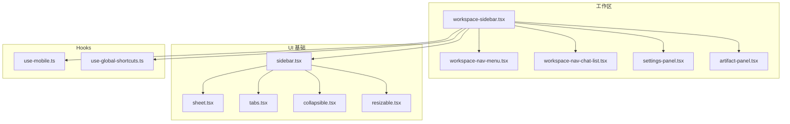
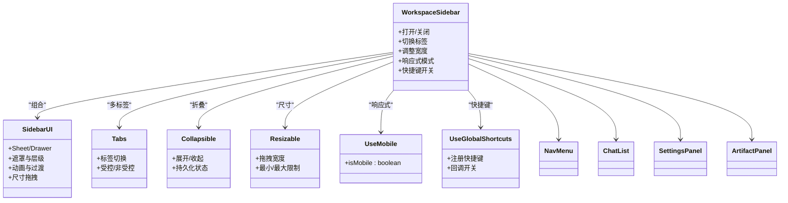
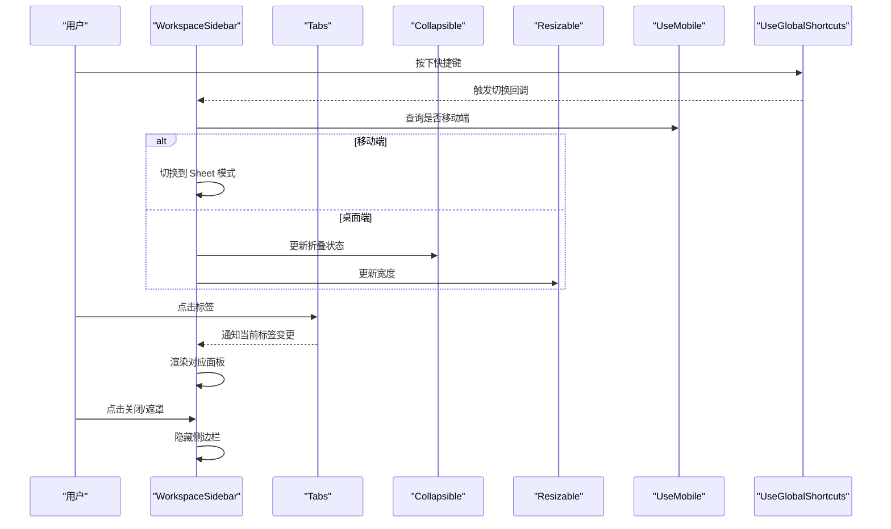
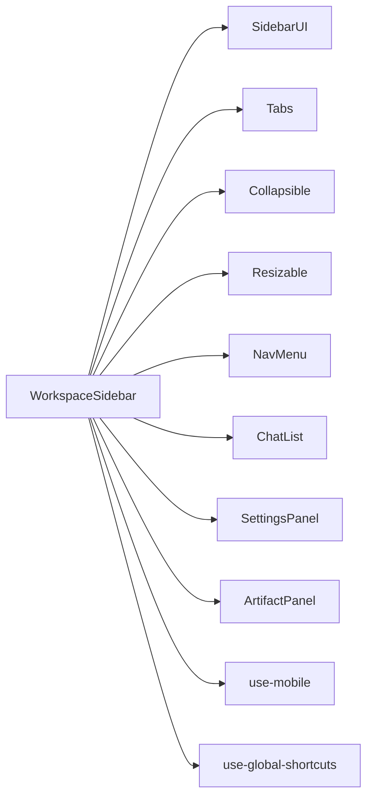

# 侧边栏组件

<cite>
**本文引用的文件**   
- [frontend/src/components/workspace/workspace-sidebar.tsx](file://frontend/src/components/workspace/workspace-sidebar.tsx)
- [frontend/src/components/ui/sidebar.tsx](file://frontend/src/components/ui/sidebar.tsx)
- [frontend/src/components/ui/sheet.tsx](file://frontend/src/components/ui/sheet.tsx)
- [frontend/src/components/ui/tabs.tsx](file://frontend/src/components/ui/tabs.tsx)
- [frontend/src/components/ui/collapsible.tsx](file://frontend/src/components/ui/collapsible.tsx)
- [frontend/src/components/ui/resizable.tsx](file://frontend/src/components/ui/resizable.tsx)
- [frontend/src/hooks/use-mobile.ts](file://frontend/src/hooks/use-mobile.ts)
- [frontend/src/hooks/use-global-shortcuts.ts](file://frontend/src/hooks/use-global-shortcuts.ts)
- [frontend/src/components/workspace/workspace-nav-menu.tsx](file://frontend/src/components/workspace/workspace-nav-menu.tsx)
- [frontend/src/components/workspace/workspace-nav-chat-list.tsx](file://frontend/src/components/workspace/workspace-nav-chat-list.tsx)
- [frontend/src/components/workspace/artifacts/artifact-panel.tsx](file://frontend/src/components/workspace/artifacts/artifact-panel.tsx)
- [frontend/src/components/workspace/messages/message-citations.tsx](file://frontend/src/components/workspace/messages/message-citations.tsx)
- [frontend/src/components/workspace/settings/settings-panel.tsx](file://frontend/src/components/workspace/settings/settings-panel.tsx)
</cite>

## 目录
1. [简介](#简介)
2. [项目结构](#项目结构)
3. [核心组件](#核心组件)
4. [架构总览](#架构总览)
5. [详细组件分析](#详细组件分析)
6. [依赖关系分析](#依赖关系分析)
7. [性能考虑](#性能考虑)
8. [故障排查指南](#故障排查指南)
9. [结论](#结论)
10. [附录](#附录)

## 简介
本文件面向 DeerFlow 前端工程中的“侧边栏”体系，系统性梳理并文档化以下能力：
- 侧边栏面板：可折叠、多标签页、内容区域管理
- 侧边栏触发器：悬浮按钮、快捷键支持、位置自适应
- 引用附件：文件关联、快速访问、预览
- 状态管理与数据共享机制
- 样式定制与主题适配方案
- 实际应用场景示例（以路径引用方式呈现）

该侧边栏在聊天/工作区场景中提供导航、上下文切换、工具面板与资源预览等能力，兼顾桌面端与移动端体验。

## 项目结构
侧边栏相关代码主要位于前端 src/components/workspace 与 src/components/ui 目录中，采用“功能域 + UI 基础库”的分层组织方式：
- workspace 层：业务侧边栏容器、导航菜单、聊天列表、设置面板、工件面板等
- ui 层：通用 UI 组件（Sheet、Tabs、Collapsible、Resizable 等）
- hooks 层：全局快捷键、移动端检测等横切能力

图表来源
- [frontend/src/components/workspace/workspace-sidebar.tsx](file://frontend/src/components/workspace/workspace-sidebar.tsx)
- [frontend/src/components/ui/sidebar.tsx](file://frontend/src/components/ui/sidebar.tsx)
- [frontend/src/components/ui/sheet.tsx](file://frontend/src/components/ui/sheet.tsx)
- [frontend/src/components/ui/tabs.tsx](file://frontend/src/components/ui/tabs.tsx)
- [frontend/src/components/ui/collapsible.tsx](file://frontend/src/components/ui/collapsible.tsx)
- [frontend/src/components/ui/resizable.tsx](file://frontend/src/components/ui/resizable.tsx)
- [frontend/src/hooks/use-mobile.ts](file://frontend/src/hooks/use-mobile.ts)
- [frontend/src/hooks/use-global-shortcuts.ts](file://frontend/src/hooks/use-global-shortcuts.ts)
- [frontend/src/components/workspace/workspace-nav-menu.tsx](file://frontend/src/components/workspace/workspace-nav-menu.tsx)
- [frontend/src/components/workspace/workspace-nav-chat-list.tsx](file://frontend/src/components/workspace/workspace-nav-chat-list.tsx)
- [frontend/src/components/workspace/artifacts/artifact-panel.tsx](file://frontend/src/components/workspace/artifacts/artifact-panel.tsx)
- [frontend/src/components/workspace/settings/settings-panel.tsx](file://frontend/src/components/workspace/settings/settings-panel.tsx)

章节来源
- [frontend/src/components/workspace/workspace-sidebar.tsx](file://frontend/src/components/workspace/workspace-sidebar.tsx)
- [frontend/src/components/ui/sidebar.tsx](file://frontend/src/components/ui/sidebar.tsx)
- [frontend/src/components/ui/sheet.tsx](file://frontend/src/components/ui/sheet.tsx)
- [frontend/src/components/ui/tabs.tsx](file://frontend/src/components/ui/tabs.tsx)
- [frontend/src/components/ui/collapsible.tsx](file://frontend/src/components/ui/collapsible.tsx)
- [frontend/src/components/ui/resizable.tsx](file://frontend/src/components/ui/resizable.tsx)
- [frontend/src/hooks/use-mobile.ts](file://frontend/src/hooks/use-mobile.ts)
- [frontend/src/hooks/use-global-shortcuts.ts](file://frontend/src/hooks/use-global-shortcuts.ts)
- [frontend/src/components/workspace/workspace-nav-menu.tsx](file://frontend/src/components/workspace/workspace-nav-menu.tsx)
- [frontend/src/components/workspace/workspace-nav-chat-list.tsx](file://frontend/src/components/workspace/workspace-nav-chat-list.tsx)
- [frontend/src/components/workspace/artifacts/artifact-panel.tsx](file://frontend/src/components/workspace/artifacts/artifact-panel.tsx)
- [frontend/src/components/workspace/settings/settings-panel.tsx](file://frontend/src/components/workspace/settings/settings-panel.tsx)

## 核心组件
- 侧边栏容器（WorkspaceSidebar）
  - 职责：组合导航、聊天列表、设置与工件面板；管理打开/关闭、宽度、定位与响应式行为；暴露快捷键开关入口。
  - 关键特性：
    - 可折叠：通过 Collapsible 控制展开/收起
    - 多标签页：通过 Tabs 切换不同子面板（如“聊天列表/设置/工件”）
    - 内容区域管理：根据当前激活标签渲染对应面板
    - 响应式：基于 use-mobile 在移动端使用 Sheet 模式，桌面端常驻或抽屉式
    - 快捷键：监听全局快捷键切换侧边栏显隐
- 基础侧边栏 UI（Sidebar UI）
  - 职责：封装侧边栏的布局、遮罩、动画、尺寸拖拽等通用能力
  - 关键特性：
    - 基于 Sheet 实现移动端覆盖式面板
    - 基于 Tabs/Collapsible/Resizable 提供交互与尺寸控制
- 导航与列表
  - 导航菜单（NavMenu）：提供侧边栏顶部导航入口
  - 聊天列表（ChatList）：展示会话列表，支持选中态与跳转
- 设置面板（SettingsPanel）
  - 职责：集中配置项（模型、记忆、上传等），与全局设置联动
- 工件面板（ArtifactPanel）
  - 职责：展示与管理生成的工件（报告、图表、代码片段等），支持预览与快速操作

章节来源
- [frontend/src/components/workspace/workspace-sidebar.tsx](file://frontend/src/components/workspace/workspace-sidebar.tsx)
- [frontend/src/components/ui/sidebar.tsx](file://frontend/src/components/ui/sidebar.tsx)
- [frontend/src/components/ui/sheet.tsx](file://frontend/src/components/ui/sheet.tsx)
- [frontend/src/components/ui/tabs.tsx](file://frontend/src/components/ui/tabs.tsx)
- [frontend/src/components/ui/collapsible.tsx](file://frontend/src/components/ui/collapsible.tsx)
- [frontend/src/components/ui/resizable.tsx](file://frontend/src/components/ui/resizable.tsx)
- [frontend/src/hooks/use-mobile.ts](file://frontend/src/hooks/use-mobile.ts)
- [frontend/src/hooks/use-global-shortcuts.ts](file://frontend/src/hooks/use-global-shortcuts.ts)
- [frontend/src/components/workspace/workspace-nav-menu.tsx](file://frontend/src/components/workspace/workspace-nav-menu.tsx)
- [frontend/src/components/workspace/workspace-nav-chat-list.tsx](file://frontend/src/components/workspace/workspace-nav-chat-list.tsx)
- [frontend/src/components/workspace/settings/settings-panel.tsx](file://frontend/src/components/workspace/settings/settings-panel.tsx)
- [frontend/src/components/workspace/artifacts/artifact-panel.tsx](file://frontend/src/components/workspace/artifacts/artifact-panel.tsx)

## 架构总览
侧边栏采用“容器 + 面板 + 基础 UI + Hooks”的分层架构。容器负责编排与状态，面板承载具体业务，基础 UI 提供一致的交互与视觉，Hooks 提供横切能力（移动端判断、快捷键）。

图表来源
- [frontend/src/components/workspace/workspace-sidebar.tsx](file://frontend/src/components/workspace/workspace-sidebar.tsx)
- [frontend/src/components/ui/sidebar.tsx](file://frontend/src/components/ui/sidebar.tsx)
- [frontend/src/components/ui/tabs.tsx](file://frontend/src/components/ui/tabs.tsx)
- [frontend/src/components/ui/collapsible.tsx](file://frontend/src/components/ui/collapsible.tsx)
- [frontend/src/components/ui/resizable.tsx](file://frontend/src/components/ui/resizable.tsx)
- [frontend/src/hooks/use-mobile.ts](file://frontend/src/hooks/use-mobile.ts)
- [frontend/src/hooks/use-global-shortcuts.ts](file://frontend/src/hooks/use-global-shortcuts.ts)
- [frontend/src/components/workspace/workspace-nav-menu.tsx](file://frontend/src/components/workspace/workspace-nav-menu.tsx)
- [frontend/src/components/workspace/workspace-nav-chat-list.tsx](file://frontend/src/components/workspace/workspace-nav-chat-list.tsx)
- [frontend/src/components/workspace/settings/settings-panel.tsx](file://frontend/src/components/workspace/settings/settings-panel.tsx)
- [frontend/src/components/workspace/artifacts/artifact-panel.tsx](file://frontend/src/components/workspace/artifacts/artifact-panel.tsx)

## 详细组件分析

### 侧边栏容器（WorkspaceSidebar）
- 功能要点
  - 统一维护侧边栏可见性、当前标签、宽度与响应式模式
  - 将导航、聊天列表、设置与工件面板组合为完整侧边栏
  - 暴露快捷键开关，便于从任意位置触发展示
- 交互流程（打开/切换/关闭）

图表来源
- [frontend/src/components/workspace/workspace-sidebar.tsx](file://frontend/src/components/workspace/workspace-sidebar.tsx)
- [frontend/src/components/ui/tabs.tsx](file://frontend/src/components/ui/tabs.tsx)
- [frontend/src/components/ui/collapsible.tsx](file://frontend/src/components/ui/collapsible.tsx)
- [frontend/src/components/ui/resizable.tsx](file://frontend/src/components/ui/resizable.tsx)
- [frontend/src/hooks/use-mobile.ts](file://frontend/src/hooks/use-mobile.ts)
- [frontend/src/hooks/use-global-shortcuts.ts](file://frontend/src/hooks/use-global-shortcuts.ts)

章节来源
- [frontend/src/components/workspace/workspace-sidebar.tsx](file://frontend/src/components/workspace/workspace-sidebar.tsx)
- [frontend/src/components/ui/tabs.tsx](file://frontend/src/components/ui/tabs.tsx)
- [frontend/src/components/ui/collapsible.tsx](file://frontend/src/components/ui/collapsible.tsx)
- [frontend/src/components/ui/resizable.tsx](file://frontend/src/components/ui/resizable.tsx)
- [frontend/src/hooks/use-mobile.ts](file://frontend/src/hooks/use-mobile.ts)
- [frontend/src/hooks/use-global-shortcuts.ts](file://frontend/src/hooks/use-global-shortcuts.ts)

### 基础侧边栏 UI（Sidebar UI）
- 职责与能力
  - 提供统一的侧边栏外壳：遮罩、层级、动画、滚动隔离
  - 在移动端以 Sheet 形式覆盖显示，桌面端以抽屉/常驻形式显示
  - 集成 Resizable 支持拖拽调整宽度，并提供最小/最大宽度约束
- 与上层容器的协作
  - 接收 visible/open 状态与回调
  - 透传 Tabs/Collapsible/Resizable 的配置

章节来源
- [frontend/src/components/ui/sidebar.tsx](file://frontend/src/components/ui/sidebar.tsx)
- [frontend/src/components/ui/sheet.tsx](file://frontend/src/components/ui/sheet.tsx)
- [frontend/src/components/ui/resizable.tsx](file://frontend/src/components/ui/resizable.tsx)

### 多标签页（Tabs）
- 设计要点
  - 支持受控与非受控两种模式
  - 标签切换时触发 onChange，由容器决定渲染哪个面板
  - 可配合键盘导航与无障碍属性
- 典型用法
  - 在侧边栏顶部放置 TabList，下方根据 activeTab 渲染对应面板

章节来源
- [frontend/src/components/ui/tabs.tsx](file://frontend/src/components/ui/tabs.tsx)

### 可折叠面板（Collapsible）
- 设计要点
  - 通过 open 状态控制展开/收起
  - 支持动画过渡与持久化（可选）
  - 适合用于分组导航或次级面板
- 在侧边栏中的应用
  - 用于折叠/展开整个侧边栏或某个分组区域

章节来源
- [frontend/src/components/ui/collapsible.tsx](file://frontend/src/components/ui/collapsible.tsx)

### 尺寸拖拽（Resizable）
- 设计要点
  - 支持水平拖拽改变宽度
  - 可配置最小/最大宽度与初始宽度
  - 与 Collapsible 配合，形成“半展开/全展开”体验
- 在侧边栏中的应用
  - 拖动右侧边缘调整侧边栏宽度，提升信息密度与可用性

章节来源
- [frontend/src/components/ui/resizable.tsx](file://frontend/src/components/ui/resizable.tsx)

### 导航与聊天列表（NavMenu / ChatList）
- 导航菜单
  - 提供侧边栏顶部入口，如“聊天/设置/工件”等
- 聊天列表
  - 展示会话列表，支持选中高亮与跳转
  - 与主聊天区域联动，切换会话时更新消息流

章节来源
- [frontend/src/components/workspace/workspace-nav-menu.tsx](file://frontend/src/components/workspace/workspace-nav-menu.tsx)
- [frontend/src/components/workspace/workspace-nav-chat-list.tsx](file://frontend/src/components/workspace/workspace-nav-chat-list.tsx)

### 设置面板（SettingsPanel）
- 功能范围
  - 模型选择、记忆策略、上传配置等
  - 与全局设置状态同步，保存后即时生效
- 与侧边栏的关系
  - 作为 Tabs 的一个面板，按需加载与卸载

章节来源
- [frontend/src/components/workspace/settings/settings-panel.tsx](file://frontend/src/components/workspace/settings/settings-panel.tsx)

### 工件面板（ArtifactPanel）
- 功能范围
  - 展示与管理工件（报告、图表、代码片段等）
  - 支持预览、复制、下载等操作
- 与侧边栏的关系
  - 作为 Tabs 的一个面板，与聊天消息中的引用联动

章节来源
- [frontend/src/components/workspace/artifacts/artifact-panel.tsx](file://frontend/src/components/workspace/artifacts/artifact-panel.tsx)

### 引用附件（Message Citations）
- 能力说明
  - 在消息中展示引用附件卡片，支持快速访问与预览
  - 点击后可在工作区或侧边栏中打开对应工件/文件
- 与侧边栏的联动
  - 通过路由或事件将工件 ID 传递到 ArtifactPanel，实现“从消息到工件”的快速跳转

章节来源
- [frontend/src/components/workspace/messages/message-citations.tsx](file://frontend/src/components/workspace/messages/message-citations.tsx)
- [frontend/src/components/workspace/artifacts/artifact-panel.tsx](file://frontend/src/components/workspace/artifacts/artifact-panel.tsx)

### 快捷键与触发器（Global Shortcuts）
- 能力说明
  - 监听全局快捷键（例如 Ctrl/Cmd + Shift + S）切换侧边栏显隐
  - 在移动端自动禁用或降级为触摸手势
- 与侧边栏的关系
  - 通过回调直接调用侧边栏的切换方法，无需聚焦输入框

章节来源
- [frontend/src/hooks/use-global-shortcuts.ts](file://frontend/src/hooks/use-global-shortcuts.ts)
- [frontend/src/components/workspace/workspace-sidebar.tsx](file://frontend/src/components/workspace/workspace-sidebar.tsx)

### 移动端适配（use-mobile）
- 能力说明
  - 提供 isMobile 布尔值，用于切换 Sheet 模式与常驻模式
- 与侧边栏的关系
  - 在移动端以全屏覆盖的方式展示，避免遮挡主内容

章节来源
- [frontend/src/hooks/use-mobile.ts](file://frontend/src/hooks/use-mobile.ts)
- [frontend/src/components/ui/sheet.tsx](file://frontend/src/components/ui/sheet.tsx)

## 依赖关系分析
- 组件耦合
  - WorkspaceSidebar 对 SidebarUI、Tabs、Collapsible、Resizable 存在强依赖
  - 面板（SettingsPanel、ArtifactPanel）仅依赖自身业务逻辑与必要的 UI 组件
- 外部依赖
  - 移动端检测与快捷键为横切关注点，通过 Hooks 注入
- 潜在循环依赖
  - 建议保持“容器 -> 面板”单向依赖，避免面板反向依赖容器

图表来源
- [frontend/src/components/workspace/workspace-sidebar.tsx](file://frontend/src/components/workspace/workspace-sidebar.tsx)
- [frontend/src/components/ui/sidebar.tsx](file://frontend/src/components/ui/sidebar.tsx)
- [frontend/src/components/ui/tabs.tsx](file://frontend/src/components/ui/tabs.tsx)
- [frontend/src/components/ui/collapsible.tsx](file://frontend/src/components/ui/collapsible.tsx)
- [frontend/src/components/ui/resizable.tsx](file://frontend/src/components/ui/resizable.tsx)
- [frontend/src/hooks/use-mobile.ts](file://frontend/src/hooks/use-mobile.ts)
- [frontend/src/hooks/use-global-shortcuts.ts](file://frontend/src/hooks/use-global-shortcuts.ts)
- [frontend/src/components/workspace/workspace-nav-menu.tsx](file://frontend/src/components/workspace/workspace-nav-menu.tsx)
- [frontend/src/components/workspace/workspace-nav-chat-list.tsx](file://frontend/src/components/workspace/workspace-nav-chat-list.tsx)
- [frontend/src/components/workspace/settings/settings-panel.tsx](file://frontend/src/components/workspace/settings/settings-panel.tsx)
- [frontend/src/components/workspace/artifacts/artifact-panel.tsx](file://frontend/src/components/workspace/artifacts/artifact-panel.tsx)

章节来源
- [frontend/src/components/workspace/workspace-sidebar.tsx](file://frontend/src/components/workspace/workspace-sidebar.tsx)
- [frontend/src/components/ui/sidebar.tsx](file://frontend/src/components/ui/sidebar.tsx)
- [frontend/src/components/ui/tabs.tsx](file://frontend/src/components/ui/tabs.tsx)
- [frontend/src/components/ui/collapsible.tsx](file://frontend/src/components/ui/collapsible.tsx)
- [frontend/src/components/ui/resizable.tsx](file://frontend/src/components/ui/resizable.tsx)
- [frontend/src/hooks/use-mobile.ts](file://frontend/src/hooks/use-mobile.ts)
- [frontend/src/hooks/use-global-shortcuts.ts](file://frontend/src/hooks/use-global-shortcuts.ts)
- [frontend/src/components/workspace/workspace-nav-menu.tsx](file://frontend/src/components/workspace/workspace-nav-menu.tsx)
- [frontend/src/components/workspace/workspace-nav-chat-list.tsx](file://frontend/src/components/workspace/workspace-nav-chat-list.tsx)
- [frontend/src/components/workspace/settings/settings-panel.tsx](file://frontend/src/components/workspace/settings/settings-panel.tsx)
- [frontend/src/components/workspace/artifacts/artifact-panel.tsx](file://frontend/src/components/workspace/artifacts/artifact-panel.tsx)

## 性能考虑
- 懒加载面板：仅在标签激活时渲染复杂面板（如设置、工件），减少首屏开销
- 列表虚拟化：长列表（如聊天列表）建议使用虚拟滚动，降低 DOM 节点数量
- 状态局部化：将频繁更新的局部状态下沉到面板内部，避免整棵侧边栏重渲染
- 动画与过渡：合理设置过渡时长与 GPU 加速，避免阻塞主线程
- 拖拽节流：Resizable 的拖拽回调进行节流/防抖，降低高频更新带来的压力

[本节为通用指导，不直接分析具体文件]

## 故障排查指南
- 侧边栏无法打开
  - 检查快捷键是否被系统或其他应用占用
  - 确认移动端模式下遮罩层级是否正确
- 标签切换无效
  - 确认 activeTab 状态是否受控且正确回写
  - 检查面板 key 是否稳定，避免不必要的重建
- 拖拽异常
  - 校验最小/最大宽度配置是否合法
  - 检查父容器 overflow 与 z-index 是否冲突
- 移动端显示错位
  - 确认 use-mobile 返回值与 Sheet 模式切换逻辑一致
- 引用附件无法预览
  - 检查工件 ID 是否正确传递至 ArtifactPanel
  - 确认预览接口与权限校验

章节来源
- [frontend/src/hooks/use-global-shortcuts.ts](file://frontend/src/hooks/use-global-shortcuts.ts)
- [frontend/src/components/ui/sheet.tsx](file://frontend/src/components/ui/sheet.tsx)
- [frontend/src/components/ui/tabs.tsx](file://frontend/src/components/ui/tabs.tsx)
- [frontend/src/components/ui/resizable.tsx](file://frontend/src/components/ui/resizable.tsx)
- [frontend/src/hooks/use-mobile.ts](file://frontend/src/hooks/use-mobile.ts)
- [frontend/src/components/workspace/artifacts/artifact-panel.tsx](file://frontend/src/components/workspace/artifacts/artifact-panel.tsx)

## 结论
DeerFlow 侧边栏通过清晰的层次划分与稳定的 UI 抽象，实现了可折叠、多标签、内容区域管理、快捷键与响应式等核心能力。结合引用附件与工件面板，形成了“从消息到资源”的高效闭环。建议在后续迭代中持续优化性能与可访问性，并完善主题与样式定制能力。

[本节为总结性内容，不直接分析具体文件]

## 附录

### 样式定制与主题适配方案
- 主题变量
  - 使用 CSS 自定义属性定义背景、边框、阴影、文字色等，便于暗色/亮色切换
- 尺寸与间距
  - 通过 CSS 变量控制侧边栏宽度、内边距、圆角等，保证在不同屏幕下的可读性
- 组件级覆盖
  - 在 Tabs/Collapsible/Resizable 外层包裹主题类名，按需提供变体样式
- 响应式断点
  - 结合 use-mobile 与媒体查询，确保移动端与桌面端的差异化表现

[本节为通用指导，不直接分析具体文件]

### 实际应用场景示例（路径引用）
- 场景一：从聊天消息跳转到工件面板
  - 参考路径：[message-citations.tsx](file://frontend/src/components/workspace/messages/message-citations.tsx)、[artifact-panel.tsx](file://frontend/src/components/workspace/artifacts/artifact-panel.tsx)
- 场景二：通过快捷键打开侧边栏并切换到设置
  - 参考路径：[use-global-shortcuts.ts](file://frontend/src/hooks/use-global-shortcuts.ts)、[workspace-sidebar.tsx](file://frontend/src/components/workspace/workspace-sidebar.tsx)、[settings-panel.tsx](file://frontend/src/components/workspace/settings/settings-panel.tsx)
- 场景三：移动端以 Sheet 模式展示侧边栏
  - 参考路径：[use-mobile.ts](file://frontend/src/hooks/use-mobile.ts)、[sheet.tsx](file://frontend/src/components/ui/sheet.tsx)、[workspace-sidebar.tsx](file://frontend/src/components/workspace/workspace-sidebar.tsx)

[本节为示例指引，不直接分析具体文件]