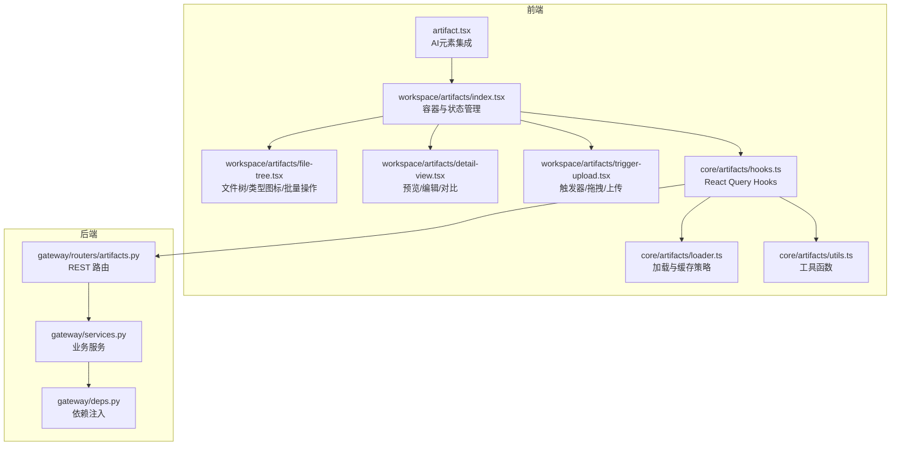
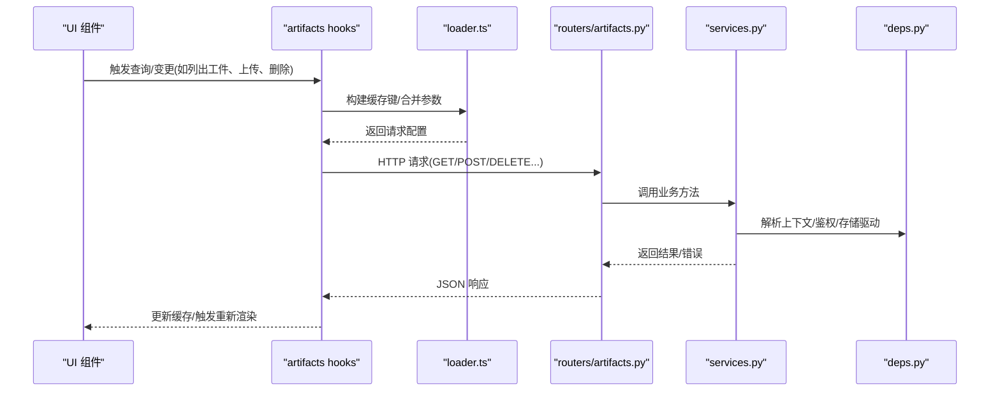
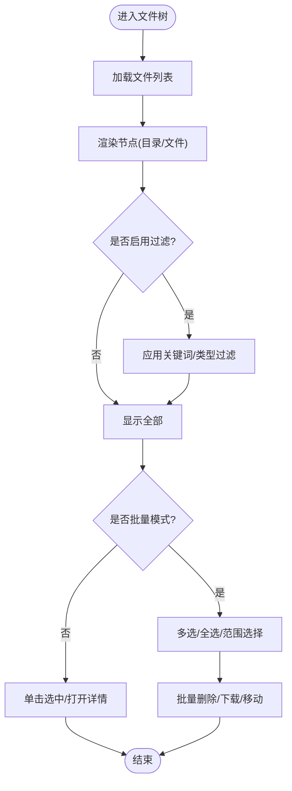
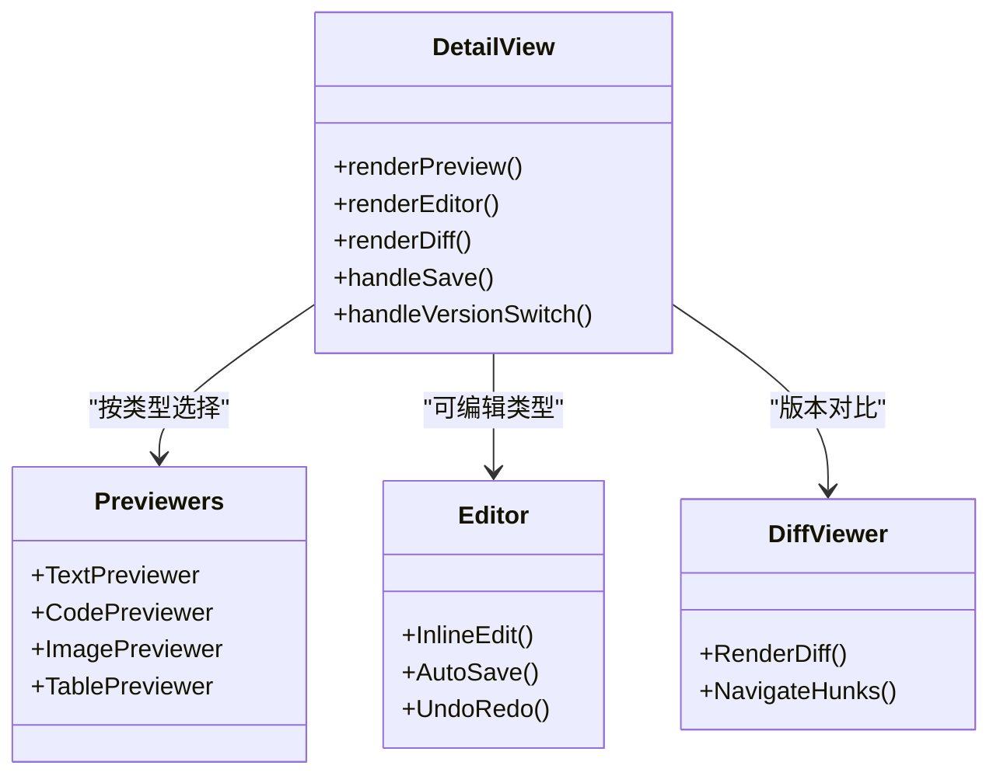
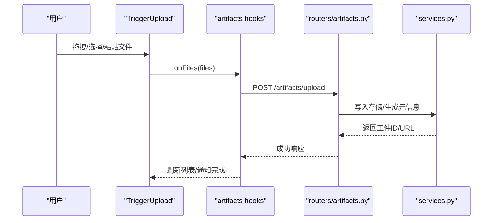
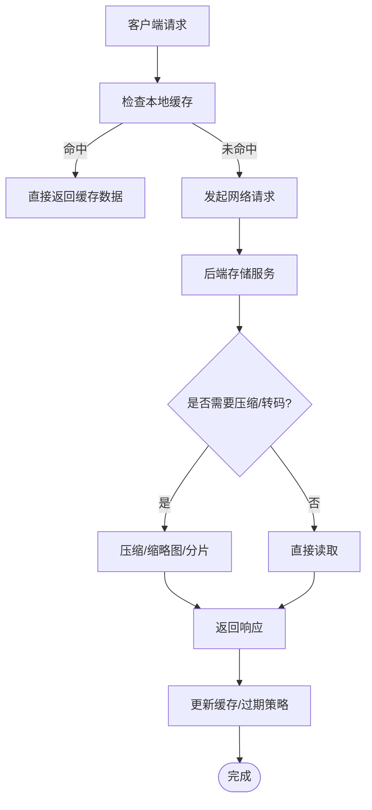
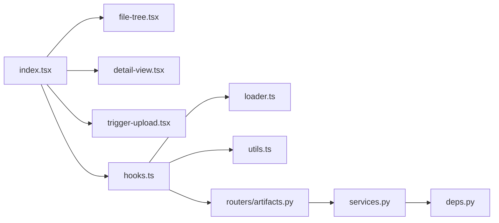

# 工件组件

<cite>
**本文引用的文件**   
- [frontend/src/components/ai-elements/artifact.tsx](file://frontend/src/components/ai-elements/artifact.tsx)
- [frontend/src/components/workspace/artifacts/index.tsx](file://frontend/src/components/workspace/artifacts/index.tsx)
- [frontend/src/components/workspace/artifacts/file-tree.tsx](file://frontend/src/components/workspace/artifacts/file-tree.tsx)
- [frontend/src/components/workspace/artifacts/detail-view.tsx](file://frontend/src/components/workspace/artifacts/detail-view.tsx)
- [frontend/src/components/workspace/artifacts/trigger-upload.tsx](file://frontend/src/components/workspace/artifacts/trigger-upload.tsx)
- [frontend/src/core/artifacts/hooks.ts](file://frontend/src/core/artifacts/hooks.ts)
- [frontend/src/core/artifacts/loader.ts](file://frontend/src/core/artifacts/loader.ts)
- [frontend/src/core/artifacts/utils.ts](file://frontend/src/core/artifacts/utils.ts)
- [backend/app/gateway/routers/artifacts.py](file://backend/app/gateway/routers/artifacts.py)
- [backend/app/gateway/services.py](file://backend/app/gateway/services.py)
- [backend/app/gateway/deps.py](file://backend/app/gateway/deps.py)
- [backend/tests/test_artifacts_router.py](file://backend/tests/test_artifacts_router.py)
</cite>

## 目录
1. [简介](#简介)
2. [项目结构](#项目结构)
3. [核心组件](#核心组件)
4. [架构总览](#架构总览)
5. [详细组件分析](#详细组件分析)
6. [依赖分析](#依赖分析)
7. [性能考虑](#性能考虑)
8. [故障排查指南](#故障排查指南)
9. [结论](#结论)
10. [附录](#附录)

## 简介
本文件面向 DeerFlow 的“工件（Artifacts）”子系统，聚焦前端工件组件与后端路由/服务之间的协作。文档覆盖以下目标：
- 工件文件列表组件：文件树展示、类型图标、批量操作等
- 工件详情组件：文件预览、内容编辑、版本对比等
- 工件触发器组件：自动检测、手动上传、拖拽支持等交互方式
- 工件存储管理机制：本地缓存、云端同步、压缩优化等策略
- 自定义渲染与扩展接口
- 实际应用场景的代码示例（以路径引用形式提供）

## 项目结构
工件相关的前端实现位于 workspace/artifacts 与 ai-elements/artifact 两个位置；核心数据访问与工具函数集中在 core/artifacts；后端通过 gateway/routers/artifacts.py 暴露 REST API，并由 services.py 与 deps.py 提供依赖注入与服务编排。测试用例位于 backend/tests/test_artifacts_router.py。

图表来源
- [frontend/src/components/ai-elements/artifact.tsx](file://frontend/src/components/ai-elements/artifact.tsx)
- [frontend/src/components/workspace/artifacts/index.tsx](file://frontend/src/components/workspace/artifacts/index.tsx)
- [frontend/src/components/workspace/artifacts/file-tree.tsx](file://frontend/src/components/workspace/artifacts/file-tree.tsx)
- [frontend/src/components/workspace/artifacts/detail-view.tsx](file://frontend/src/components/workspace/artifacts/detail-view.tsx)
- [frontend/src/components/workspace/artifacts/trigger-upload.tsx](file://frontend/src/components/workspace/artifacts/trigger-upload.tsx)
- [frontend/src/core/artifacts/hooks.ts](file://frontend/src/core/artifacts/hooks.ts)
- [frontend/src/core/artifacts/loader.ts](file://frontend/src/core/artifacts/loader.ts)
- [frontend/src/core/artifacts/utils.ts](file://frontend/src/core/artifacts/utils.ts)
- [backend/app/gateway/routers/artifacts.py](file://backend/app/gateway/routers/artifacts.py)
- [backend/app/gateway/services.py](file://backend/app/gateway/services.py)
- [backend/app/gateway/deps.py](file://backend/app/gateway/deps.py)

章节来源
- [frontend/src/components/ai-elements/artifact.tsx](file://frontend/src/components/ai-elements/artifact.tsx)
- [frontend/src/components/workspace/artifacts/index.tsx](file://frontend/src/components/workspace/artifacts/index.tsx)
- [frontend/src/core/artifacts/hooks.ts](file://frontend/src/core/artifacts/hooks.ts)
- [backend/app/gateway/routers/artifacts.py](file://backend/app/gateway/routers/artifacts.py)

## 核心组件
- 工件容器（index.tsx）：负责工件面板的生命周期、选中态、与消息流集成、调用 hooks 获取数据、组合子组件渲染。
- 文件树（file-tree.tsx）：递归渲染文件节点，按扩展名映射类型图标，支持多选、全选、批量删除/下载等。
- 详情视图（detail-view.tsx）：根据文件类型选择预览器（文本/代码/图片/表格等），提供内联编辑与版本对比能力。
- 触发器（trigger-upload.tsx）：封装上传入口，支持点击选择、拖拽放置、剪贴板粘贴、自动扫描输入框附件等。
- 数据层（hooks.ts/loader.ts/utils.ts）：封装 React Query 查询/变更、缓存键生成、去重、分页/增量更新、错误重试与退避。

章节来源
- [frontend/src/components/workspace/artifacts/index.tsx](file://frontend/src/components/workspace/artifacts/index.tsx)
- [frontend/src/components/workspace/artifacts/file-tree.tsx](file://frontend/src/components/workspace/artifacts/file-tree.tsx)
- [frontend/src/components/workspace/artifacts/detail-view.tsx](file://frontend/src/components/workspace/artifacts/detail-view.tsx)
- [frontend/src/components/workspace/artifacts/trigger-upload.tsx](file://frontend/src/components/workspace/artifacts/trigger-upload.tsx)
- [frontend/src/core/artifacts/hooks.ts](file://frontend/src/core/artifacts/hooks.ts)
- [frontend/src/core/artifacts/loader.ts](file://frontend/src/core/artifacts/loader.ts)
- [frontend/src/core/artifacts/utils.ts](file://frontend/src/core/artifacts/utils.ts)

## 架构总览
工件系统采用前后端分离的 REST 风格：前端通过 hooks 发起请求，后端路由接收并委派给服务层，服务层处理权限校验、存储读写、压缩与索引等逻辑。

图表来源
- [frontend/src/core/artifacts/hooks.ts](file://frontend/src/core/artifacts/hooks.ts)
- [frontend/src/core/artifacts/loader.ts](file://frontend/src/core/artifacts/loader.ts)
- [backend/app/gateway/routers/artifacts.py](file://backend/app/gateway/routers/artifacts.py)
- [backend/app/gateway/services.py](file://backend/app/gateway/services.py)
- [backend/app/gateway/deps.py](file://backend/app/gateway/deps.py)

## 详细组件分析

### 工件文件列表组件（文件树、类型图标、批量操作）
- 文件树展示
  - 递归渲染目录/文件节点，支持展开/折叠、搜索过滤、排序（名称/大小/时间）。
  - 使用 utils.ts 中的类型推断与格式化函数统一显示单位与日期。
- 类型图标
  - 基于扩展名映射到图标集合（文本、代码、图片、音视频、压缩包、二进制等）。
  - 对未知类型提供默认图标与提示。
- 批量操作
  - 支持全选/反选、范围选择、批量删除、批量下载（打包为 zip）。
  - 操作前进行二次确认与权限校验。

图表来源
- [frontend/src/components/workspace/artifacts/file-tree.tsx](file://frontend/src/components/workspace/artifacts/file-tree.tsx)
- [frontend/src/core/artifacts/utils.ts](file://frontend/src/core/artifacts/utils.ts)

章节来源
- [frontend/src/components/workspace/artifacts/file-tree.tsx](file://frontend/src/components/workspace/artifacts/file-tree.tsx)
- [frontend/src/core/artifacts/utils.ts](file://frontend/src/core/artifacts/utils.ts)

### 工件详情组件（预览、编辑、版本对比）
- 文件预览
  - 文本/代码：语法高亮、行号、复制、下载。
  - 图片：缩放、旋转、全屏查看。
  - 表格/CSV：分页与列筛选。
  - 其他：占位符与“无法预览”提示。
- 内容编辑
  - 文本/代码支持内联编辑，保存时走变更 hook，失败回滚。
  - 大文件分块加载与懒渲染，避免卡顿。
- 版本对比
  - 针对可比较类型（文本/代码/CSV）提供差异视图，支持左右对照与高亮差异。
  - 版本切换由 loader.ts 控制缓存键，确保快速切换。

图表来源
- [frontend/src/components/workspace/artifacts/detail-view.tsx](file://frontend/src/components/workspace/artifacts/detail-view.tsx)

章节来源
- [frontend/src/components/workspace/artifacts/detail-view.tsx](file://frontend/src/components/workspace/artifacts/detail-view.tsx)

### 工件触发器组件（自动检测、手动上传、拖拽支持）
- 自动检测
  - 监听输入框附件变化、剪贴板粘贴事件，自动识别文件类型与大小限制。
- 手动上传
  - 点击按钮弹出系统选择器，支持多文件、拖拽区放置。
- 拖拽支持
  - 全局或区域拖拽，拖入高亮反馈，释放后进入队列。
- 上传流程
  - 分片/进度条、断点续传（若后端支持）、失败重试与退避。
  - 上传完成后刷新文件树与详情缓存。

图表来源
- [frontend/src/components/workspace/artifacts/trigger-upload.tsx](file://frontend/src/components/workspace/artifacts/trigger-upload.tsx)
- [frontend/src/core/artifacts/hooks.ts](file://frontend/src/core/artifacts/hooks.ts)
- [backend/app/gateway/routers/artifacts.py](file://backend/app/gateway/routers/artifacts.py)
- [backend/app/gateway/services.py](file://backend/app/gateway/services.py)

章节来源
- [frontend/src/components/workspace/artifacts/trigger-upload.tsx](file://frontend/src/components/workspace/artifacts/trigger-upload.tsx)
- [frontend/src/core/artifacts/hooks.ts](file://frontend/src/core/artifacts/hooks.ts)

### 工件存储管理机制（本地缓存、云端同步、压缩优化）
- 本地缓存
  - 基于 React Query 的内存缓存与持久化键，结合 loader.ts 的缓存键策略，减少重复请求。
  - 对大文件采用分片/懒加载，按需拉取。
- 云端同步
  - 通过后端服务抽象存储驱动（本地磁盘/对象存储），统一接口与鉴权。
  - 支持并发写入锁与幂等上传（基于工件 ID/ETag）。
- 压缩优化
  - 批量下载时服务端打包为 zip；图片/文本在传输时可启用 gzip/br。
  - 预览图缩略图生成与缓存。

图表来源
- [frontend/src/core/artifacts/loader.ts](file://frontend/src/core/artifacts/loader.ts)
- [backend/app/gateway/services.py](file://backend/app/gateway/services.py)

章节来源
- [frontend/src/core/artifacts/loader.ts](file://frontend/src/core/artifacts/loader.ts)
- [backend/app/gateway/services.py](file://backend/app/gateway/services.py)

### 自定义渲染与扩展接口
- 自定义预览器
  - 在 detail-view.tsx 中注册新的预览器类型，匹配扩展名或 MIME 类型。
- 自定义类型图标
  - 在 file-tree.tsx 的类型映射表中新增条目，指向自定义 SVG/图标组件。
- 自定义上传行为
  - 在 trigger-upload.tsx 中扩展 onFiles 钩子，接入第三方上传 SDK 或分片策略。
- 自定义缓存策略
  - 在 loader.ts 中重写缓存键生成与失效规则，适配业务场景（如按会话隔离）。

章节来源
- [frontend/src/components/workspace/artifacts/detail-view.tsx](file://frontend/src/components/workspace/artifacts/detail-view.tsx)
- [frontend/src/components/workspace/artifacts/file-tree.tsx](file://frontend/src/components/workspace/artifacts/file-tree.tsx)
- [frontend/src/components/workspace/artifacts/trigger-upload.tsx](file://frontend/src/components/workspace/artifacts/trigger-upload.tsx)
- [frontend/src/core/artifacts/loader.ts](file://frontend/src/core/artifacts/loader.ts)

### 实际应用场景示例（路径引用）
- 在聊天消息中嵌入工件卡片
  - 参考：[frontend/src/components/ai-elements/artifact.tsx](file://frontend/src/components/ai-elements/artifact.tsx)
- 在工作区侧边栏展示工件列表
  - 参考：[frontend/src/components/workspace/artifacts/index.tsx](file://frontend/src/components/workspace/artifacts/index.tsx)
- 上传 CSV 并预览表格
  - 参考：[frontend/src/components/workspace/artifacts/detail-view.tsx](file://frontend/src/components/workspace/artifacts/detail-view.tsx)
- 批量导出工作区工件为压缩包
  - 参考：[frontend/src/components/workspace/artifacts/file-tree.tsx](file://frontend/src/components/workspace/artifacts/file-tree.tsx)
- 后端上传与列表接口
  - 参考：[backend/app/gateway/routers/artifacts.py](file://backend/app/gateway/routers/artifacts.py)

## 依赖分析
- 前端耦合关系
  - index.tsx 聚合 file-tree.tsx、detail-view.tsx、trigger-upload.tsx，并通过 hooks.ts 与 loader.ts 协同。
  - utils.ts 被多处复用，保证类型与格式一致性。
- 前后端契约
  - hooks.ts 定义请求方法与参数，routers/artifacts.py 暴露对应端点，services.py 实现具体逻辑。
- 外部依赖
  - React Query（缓存/重试/并发控制）、文件系统/对象存储（后端）、浏览器原生 API（拖拽/剪贴板）。

图表来源
- [frontend/src/components/workspace/artifacts/index.tsx](file://frontend/src/components/workspace/artifacts/index.tsx)
- [frontend/src/core/artifacts/hooks.ts](file://frontend/src/core/artifacts/hooks.ts)
- [backend/app/gateway/routers/artifacts.py](file://backend/app/gateway/routers/artifacts.py)
- [backend/app/gateway/services.py](file://backend/app/gateway/services.py)
- [backend/app/gateway/deps.py](file://backend/app/gateway/deps.py)

章节来源
- [frontend/src/components/workspace/artifacts/index.tsx](file://frontend/src/components/workspace/artifacts/index.tsx)
- [frontend/src/core/artifacts/hooks.ts](file://frontend/src/core/artifacts/hooks.ts)
- [backend/app/gateway/routers/artifacts.py](file://backend/app/gateway/routers/artifacts.py)

## 性能考虑
- 列表与树
  - 虚拟滚动/分页加载，避免一次性渲染大量节点。
  - 过滤与搜索采用防抖，减少频繁重排。
- 预览与编辑
  - 大文件分块加载与懒渲染；编辑器开启增量更新与撤销栈节流。
- 缓存与网络
  - 合理设置缓存时间与 stale-while-revalidate；失败指数退避重试。
- 传输与存储
  - 启用 gzip/br；图片缩略图与按需高清图；批量下载服务端打包。

## 故障排查指南
- 常见问题
  - 上传失败：检查文件大小/类型限制、网络超时、后端存储配额。
  - 预览空白：确认 MIME 类型与预览器注册；查看控制台错误。
  - 缓存不一致：清理 React Query 缓存或调整缓存键策略。
- 定位步骤
  - 前端：打开 Network 面板，核对请求 URL/参数/响应体；检查 hooks 的错误回调。
  - 后端：查看 artifacts 路由日志与 services 异常堆栈；验证存储驱动连通性。
- 回归验证
  - 使用测试用例覆盖关键路径，确保改动不破坏现有功能。

章节来源
- [backend/tests/test_artifacts_router.py](file://backend/tests/test_artifacts_router.py)

## 结论
工件组件体系在前端通过清晰的组件分层与数据层解耦，在后端通过路由与服务职责划分，实现了从上传、预览、编辑到版本对比的完整闭环。配合缓存、压缩与可扩展的渲染接口，既能满足通用场景，也便于业务定制与性能调优。

## 附录
- 术语
  - 工件（Artifact）：对话或任务产生的可复用产物，如文件、报告、图表等。
  - 触发器（Trigger）：触发工件上传或处理的入口控件。
- 最佳实践
  - 始终为大型资源启用懒加载与缓存。
  - 对敏感文件实施访问控制与审计。
  - 为自定义预览器编写最小可用实现，逐步增强。