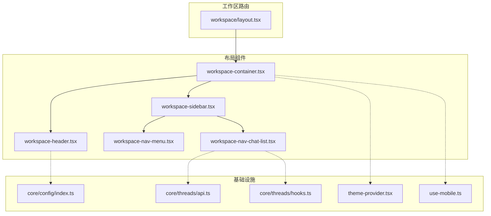
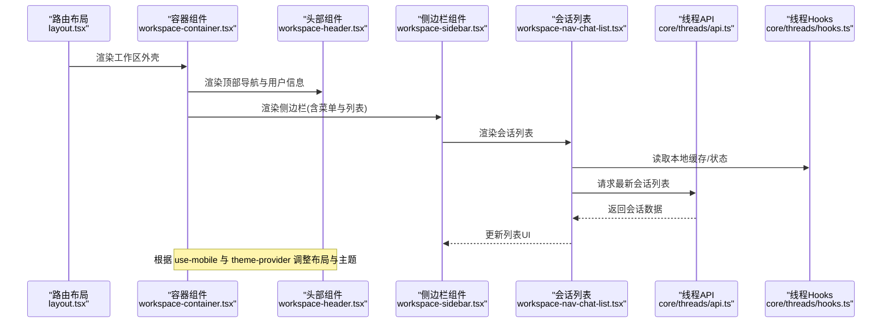
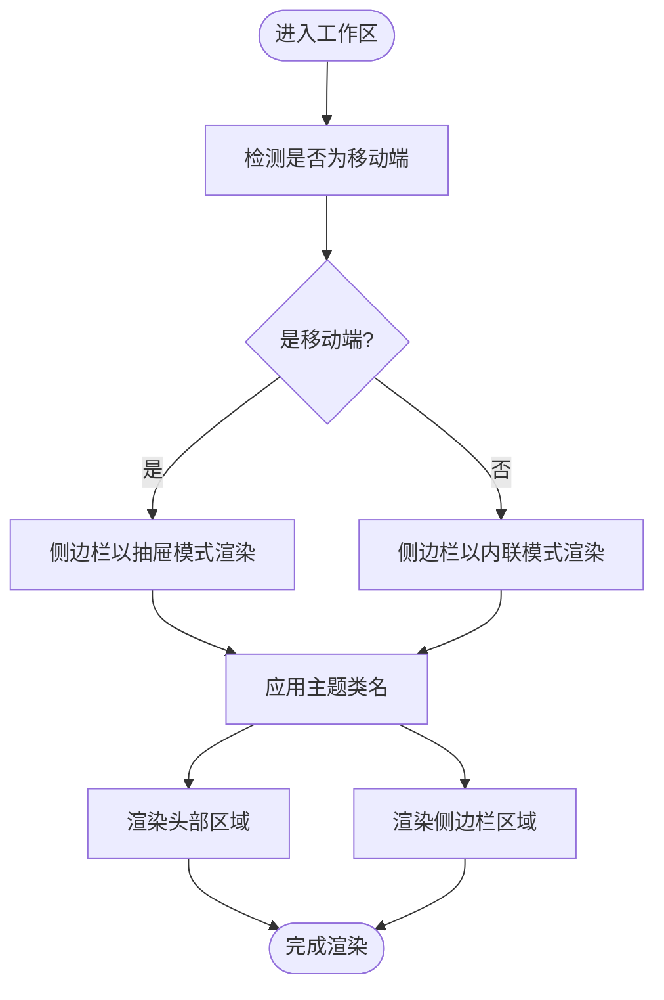
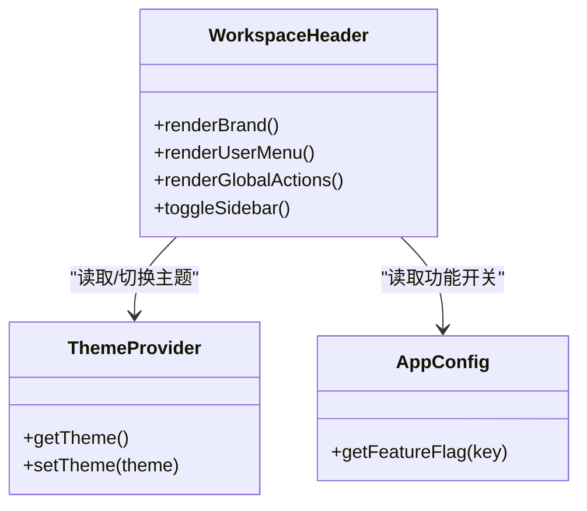
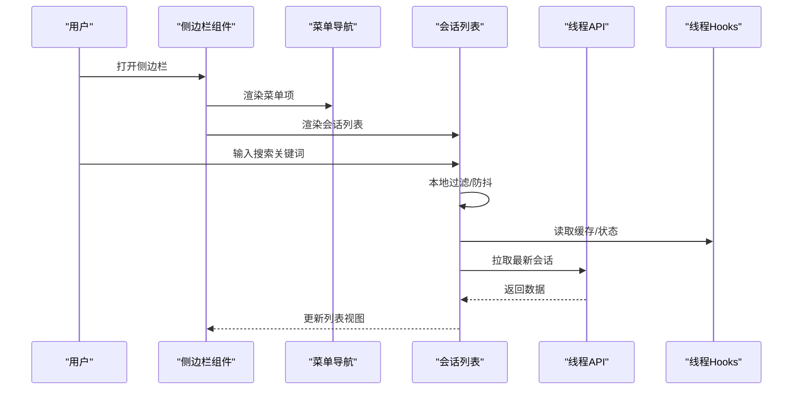
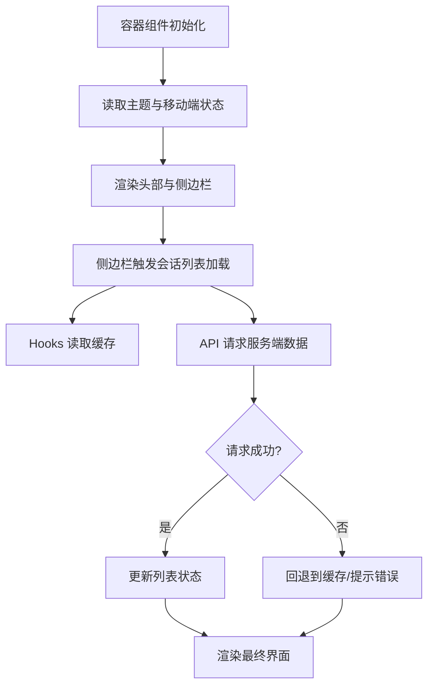
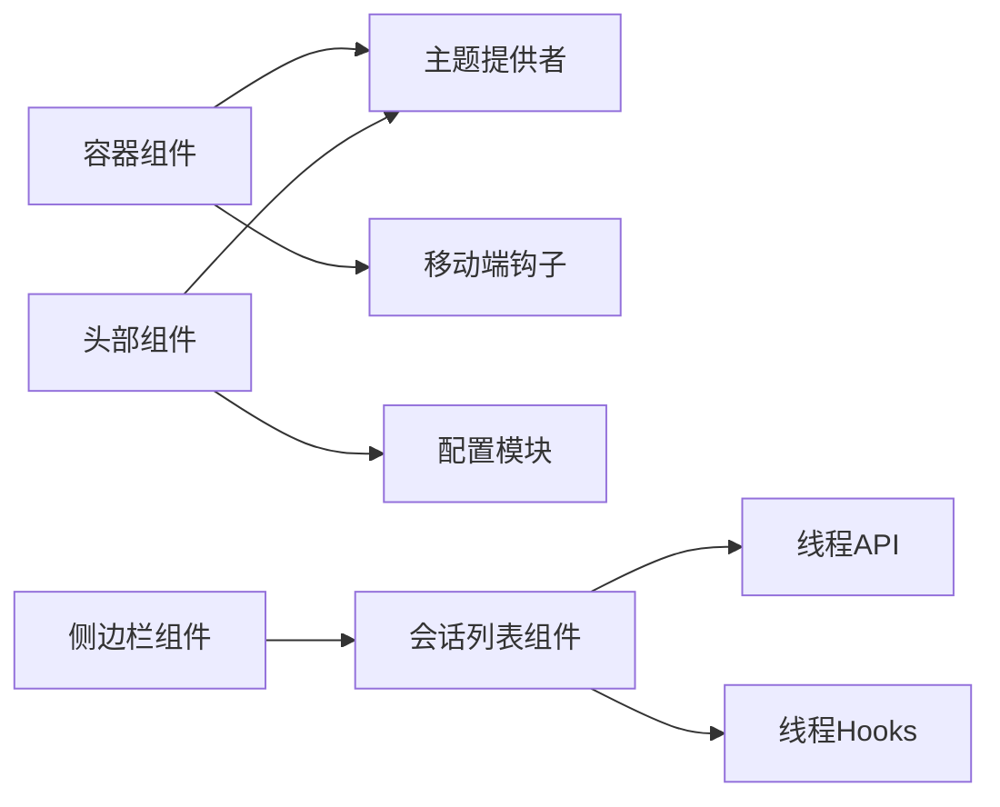

# 工作区布局组件

<cite>
**本文引用的文件**   
- [frontend/src/app/workspace/layout.tsx](file://frontend/src/app/workspace/layout.tsx)
- [frontend/src/components/workspace/workspace-container.tsx](file://frontend/src/components/workspace/workspace-container.tsx)
- [frontend/src/components/workspace/workspace-header.tsx](file://frontend/src/components/workspace/workspace-header.tsx)
- [frontend/src/components/workspace/workspace-sidebar.tsx](file://frontend/src/components/workspace/workspace-sidebar.tsx)
- [frontend/src/components/workspace/workspace-nav-menu.tsx](file://frontend/src/components/workspace/workspace-nav-menu.tsx)
- [frontend/src/components/workspace/workspace-nav-chat-list.tsx](file://frontend/src/components/workspace/workspace-nav-chat-list.tsx)
- [frontend/src/components/theme-provider.tsx](file://frontend/src/components/theme-provider.tsx)
- [frontend/src/hooks/use-mobile.ts](file://frontend/src/hooks/use-mobile.ts)
- [frontend/src/core/threads/api.ts](file://frontend/src/core/threads/api.ts)
- [frontend/src/core/threads/hooks.ts](file://frontend/src/core/threads/hooks.ts)
- [frontend/src/core/config/index.ts](file://frontend/src/core/config/index.ts)
</cite>

## 目录
1. [简介](#简介)
2. [项目结构](#项目结构)
3. [核心组件](#核心组件)
4. [架构总览](#架构总览)
5. [详细组件分析](#详细组件分析)
6. [依赖分析](#依赖分析)
7. [性能考虑](#性能考虑)
8. [故障排查指南](#故障排查指南)
9. [结论](#结论)
10. [附录](#附录)

## 简介
本文件聚焦 DeerFlow 前端“工作区”的布局体系，围绕以下目标展开：
- 工作区容器组件：整体布局结构、响应式设计与主题适配机制
- 工作区头部组件：导航栏、用户信息展示、全局操作按钮
- 侧边栏组件：菜单导航、会话列表、搜索交互逻辑
- 状态管理与数据流：布局相关状态如何组织与流转
- 定制与扩展：如何替换、组合与扩展现有布局
- 实际应用场景：结合真实路径的代码示例（以源码路径引用形式提供）

## 项目结构
工作区布局位于 Next.js 应用的路由与工作区组件层中。关键位置如下：
- 路由级布局：定义工作区页面壳结构与区域划分
- 容器组件：承载头部、侧边栏与主内容区的布局容器
- 头部组件：包含导航入口、用户信息与全局操作
- 侧边栏组件：包含菜单导航与会话列表等
- 主题与移动端钩子：支撑主题切换与响应式行为

图表来源
- [frontend/src/app/workspace/layout.tsx](file://frontend/src/app/workspace/layout.tsx)
- [frontend/src/components/workspace/workspace-container.tsx](file://frontend/src/components/workspace/workspace-container.tsx)
- [frontend/src/components/workspace/workspace-header.tsx](file://frontend/src/components/workspace/workspace-header.tsx)
- [frontend/src/components/workspace/workspace-sidebar.tsx](file://frontend/src/components/workspace/workspace-sidebar.tsx)
- [frontend/src/components/workspace/workspace-nav-menu.tsx](file://frontend/src/components/workspace/workspace-nav-menu.tsx)
- [frontend/src/components/workspace/workspace-nav-chat-list.tsx](file://frontend/src/components/workspace/workspace-nav-chat-list.tsx)
- [frontend/src/components/theme-provider.tsx](file://frontend/src/components/theme-provider.tsx)
- [frontend/src/hooks/use-mobile.ts](file://frontend/src/hooks/use-mobile.ts)
- [frontend/src/core/threads/api.ts](file://frontend/src/core/threads/api.ts)
- [frontend/src/core/threads/hooks.ts](file://frontend/src/core/threads/hooks.ts)
- [frontend/src/core/config/index.ts](file://frontend/src/core/config/index.ts)

章节来源
- [frontend/src/app/workspace/layout.tsx](file://frontend/src/app/workspace/layout.tsx)
- [frontend/src/components/workspace/workspace-container.tsx](file://frontend/src/components/workspace/workspace-container.tsx)
- [frontend/src/components/workspace/workspace-header.tsx](file://frontend/src/components/workspace/workspace-header.tsx)
- [frontend/src/components/workspace/workspace-sidebar.tsx](file://frontend/src/components/workspace/workspace-sidebar.tsx)
- [frontend/src/components/workspace/workspace-nav-menu.tsx](file://frontend/src/components/workspace/workspace-nav-menu.tsx)
- [frontend/src/components/workspace/workspace-nav-chat-list.tsx](file://frontend/src/components/workspace/workspace-nav-chat-list.tsx)
- [frontend/src/components/theme-provider.tsx](file://frontend/src/components/theme-provider.tsx)
- [frontend/src/hooks/use-mobile.ts](file://frontend/src/hooks/use-mobile.ts)
- [frontend/src/core/threads/api.ts](file://frontend/src/core/threads/api.ts)
- [frontend/src/core/threads/hooks.ts](file://frontend/src/core/threads/hooks.ts)
- [frontend/src/core/config/index.ts](file://frontend/src/core/config/index.ts)

## 核心组件
- 工作区容器组件
  - 职责：作为工作区页面的根容器，组织头部、侧边栏与主内容区；处理响应式断点与主题类名注入；在移动端控制侧边栏显隐。
  - 关键点：使用移动端钩子判断屏幕尺寸；通过主题提供者获取当前主题并应用到根节点或容器；为不同区域分配合适的栅格/弹性布局。
- 工作区头部组件
  - 职责：展示品牌/标题、全局操作（如设置、帮助、导出）、用户信息入口；在移动端可触发侧边栏打开。
  - 关键点：与配置模块联动显示功能开关；与主题系统联动切换图标/样式；与移动端钩子联动隐藏/显示部分元素。
- 侧边栏组件
  - 职责：聚合菜单导航与会话列表；提供搜索过滤；在移动端以抽屉形式呈现。
  - 关键点：集成会话列表组件与搜索输入；根据移动端状态切换抽屉模式；与线程 API/Hooks 协作加载与刷新会话数据。

章节来源
- [frontend/src/components/workspace/workspace-container.tsx](file://frontend/src/components/workspace/workspace-container.tsx)
- [frontend/src/components/workspace/workspace-header.tsx](file://frontend/src/components/workspace/workspace-header.tsx)
- [frontend/src/components/workspace/workspace-sidebar.tsx](file://frontend/src/components/workspace/workspace-sidebar.tsx)
- [frontend/src/components/workspace/workspace-nav-menu.tsx](file://frontend/src/components/workspace/workspace-nav-menu.tsx)
- [frontend/src/components/workspace/workspace-nav-chat-list.tsx](file://frontend/src/components/workspace/workspace-nav-chat-list.tsx)
- [frontend/src/hooks/use-mobile.ts](file://frontend/src/hooks/use-mobile.ts)
- [frontend/src/components/theme-provider.tsx](file://frontend/src/components/theme-provider.tsx)

## 架构总览
工作区布局采用“路由布局 + 容器组件 + 子组件”的分层方式。路由布局负责挂载容器；容器组件负责整体排布与响应式策略；头部与侧边栏各自承担导航与业务入口；数据层通过统一的 API 与 Hooks 管理会话等数据。

图表来源
- [frontend/src/app/workspace/layout.tsx](file://frontend/src/app/workspace/layout.tsx)
- [frontend/src/components/workspace/workspace-container.tsx](file://frontend/src/components/workspace/workspace-container.tsx)
- [frontend/src/components/workspace/workspace-header.tsx](file://frontend/src/components/workspace/workspace-header.tsx)
- [frontend/src/components/workspace/workspace-sidebar.tsx](file://frontend/src/components/workspace/workspace-sidebar.tsx)
- [frontend/src/components/workspace/workspace-nav-chat-list.tsx](file://frontend/src/components/workspace/workspace-nav-chat-list.tsx)
- [frontend/src/core/threads/api.ts](file://frontend/src/core/threads/api.ts)
- [frontend/src/core/threads/hooks.ts](file://frontend/src/core/threads/hooks.ts)

## 详细组件分析

### 工作区容器组件（WorkspaceContainer）
- 布局结构
  - 顶部固定头部区域
  - 左侧可折叠侧边栏区域
  - 右侧主内容区域
- 响应式设计
  - 基于移动端钩子判断是否处于小屏设备
  - 在小屏下将侧边栏切换为覆盖式抽屉，避免挤压主内容
- 主题适配
  - 从主题提供者读取当前主题
  - 将主题相关的类名或属性注入到容器根节点，确保全局样式一致
- 状态与副作用
  - 监听窗口尺寸变化，必要时重置侧边栏状态
  - 与路由参数联动，决定默认展开/收起状态

图表来源
- [frontend/src/components/workspace/workspace-container.tsx](file://frontend/src/components/workspace/workspace-container.tsx)
- [frontend/src/hooks/use-mobile.ts](file://frontend/src/hooks/use-mobile.ts)
- [frontend/src/components/theme-provider.tsx](file://frontend/src/components/theme-provider.tsx)

章节来源
- [frontend/src/components/workspace/workspace-container.tsx](file://frontend/src/components/workspace/workspace-container.tsx)
- [frontend/src/hooks/use-mobile.ts](file://frontend/src/hooks/use-mobile.ts)
- [frontend/src/components/theme-provider.tsx](file://frontend/src/components/theme-provider.tsx)

### 工作区头部组件（WorkspaceHeader）
- 导航栏
  - 品牌标识与页面标题
  - 移动端触发侧边栏的按钮
- 用户信息展示
  - 头像/用户名入口
  - 下拉菜单（设置、退出等）
- 全局操作按钮
  - 主题切换、语言切换、帮助/反馈、导出等
  - 根据配置动态显示/隐藏
- 与配置和主题的集成
  - 读取配置项控制功能可见性
  - 与主题提供者联动切换图标与样式

图表来源
- [frontend/src/components/workspace/workspace-header.tsx](file://frontend/src/components/workspace/workspace-header.tsx)
- [frontend/src/components/theme-provider.tsx](file://frontend/src/components/theme-provider.tsx)
- [frontend/src/core/config/index.ts](file://frontend/src/core/config/index.ts)

章节来源
- [frontend/src/components/workspace/workspace-header.tsx](file://frontend/src/components/workspace/workspace-header.tsx)
- [frontend/src/components/theme-provider.tsx](file://frontend/src/components/theme-provider.tsx)
- [frontend/src/core/config/index.ts](file://frontend/src/core/config/index.ts)

### 侧边栏组件（WorkspaceSidebar）
- 菜单导航
  - 常用入口（如新建会话、最近任务、设置等）
  - 支持分组与图标
- 会话列表
  - 展示历史会话，支持点击跳转
  - 支持分页/懒加载（视实现而定）
- 搜索功能
  - 输入框实时过滤会话名称
  - 防抖优化减少重渲染
- 移动端交互
  - 在移动端以抽屉形式出现，支持遮罩关闭
  - 与容器组件的状态同步

图表来源
- [frontend/src/components/workspace/workspace-sidebar.tsx](file://frontend/src/components/workspace/workspace-sidebar.tsx)
- [frontend/src/components/workspace/workspace-nav-menu.tsx](file://frontend/src/components/workspace/workspace-nav-menu.tsx)
- [frontend/src/components/workspace/workspace-nav-chat-list.tsx](file://frontend/src/components/workspace/workspace-nav-chat-list.tsx)
- [frontend/src/core/threads/api.ts](file://frontend/src/core/threads/api.ts)
- [frontend/src/core/threads/hooks.ts](file://frontend/src/core/threads/hooks.ts)

章节来源
- [frontend/src/components/workspace/workspace-sidebar.tsx](file://frontend/src/components/workspace/workspace-sidebar.tsx)
- [frontend/src/components/workspace/workspace-nav-menu.tsx](file://frontend/src/components/workspace/workspace-nav-menu.tsx)
- [frontend/src/components/workspace/workspace-nav-chat-list.tsx](file://frontend/src/components/workspace/workspace-nav-chat-list.tsx)
- [frontend/src/core/threads/api.ts](file://frontend/src/core/threads/api.ts)
- [frontend/src/core/threads/hooks.ts](file://frontend/src/core/threads/hooks.ts)

### 布局组件的状态管理与数据流
- 状态来源
  - 移动端状态：来自移动端钩子，用于切换侧边栏模式
  - 主题状态：来自主题提供者，用于全局样式与图标切换
  - 会话数据：来自线程 API 与 Hooks，用于列表渲染与搜索过滤
- 数据流向
  - 容器组件协调各子组件的布局与显隐
  - 头部组件读取配置与主题，驱动全局操作
  - 侧边栏组件通过 Hooks 订阅数据变更，调用 API 刷新列表
- 错误处理
  - 网络失败时回退到本地缓存
  - 空数据时展示占位提示
  - 用户输入异常时进行校验与提示

图表来源
- [frontend/src/components/workspace/workspace-container.tsx](file://frontend/src/components/workspace/workspace-container.tsx)
- [frontend/src/components/workspace/workspace-header.tsx](file://frontend/src/components/workspace/workspace-header.tsx)
- [frontend/src/components/workspace/workspace-sidebar.tsx](file://frontend/src/components/workspace/workspace-sidebar.tsx)
- [frontend/src/components/workspace/workspace-nav-chat-list.tsx](file://frontend/src/components/workspace/workspace-nav-chat-list.tsx)
- [frontend/src/core/threads/api.ts](file://frontend/src/core/threads/api.ts)
- [frontend/src/core/threads/hooks.ts](file://frontend/src/core/threads/hooks.ts)
- [frontend/src/components/theme-provider.tsx](file://frontend/src/components/theme-provider.tsx)
- [frontend/src/hooks/use-mobile.ts](file://frontend/src/hooks/use-mobile.ts)

章节来源
- [frontend/src/components/workspace/workspace-container.tsx](file://frontend/src/components/workspace/workspace-container.tsx)
- [frontend/src/components/workspace/workspace-header.tsx](file://frontend/src/components/workspace/workspace-header.tsx)
- [frontend/src/components/workspace/workspace-sidebar.tsx](file://frontend/src/components/workspace/workspace-sidebar.tsx)
- [frontend/src/components/workspace/workspace-nav-chat-list.tsx](file://frontend/src/components/workspace/workspace-nav-chat-list.tsx)
- [frontend/src/core/threads/api.ts](file://frontend/src/core/threads/api.ts)
- [frontend/src/core/threads/hooks.ts](file://frontend/src/core/threads/hooks.ts)
- [frontend/src/components/theme-provider.tsx](file://frontend/src/components/theme-provider.tsx)
- [frontend/src/hooks/use-mobile.ts](file://frontend/src/hooks/use-mobile.ts)

## 依赖分析
- 组件耦合关系
  - 容器组件依赖主题提供者与移动端钩子
  - 头部组件依赖配置模块与主题提供者
  - 侧边栏组件依赖会话列表与线程 API/Hooks
- 外部依赖
  - 线程 API 负责会话数据的增删改查
  - 线程 Hooks 负责状态管理与缓存
  - 主题提供者负责全局主题切换
  - 移动端钩子负责响应式判断

图表来源
- [frontend/src/components/workspace/workspace-container.tsx](file://frontend/src/components/workspace/workspace-container.tsx)
- [frontend/src/components/workspace/workspace-header.tsx](file://frontend/src/components/workspace/workspace-header.tsx)
- [frontend/src/components/workspace/workspace-sidebar.tsx](file://frontend/src/components/workspace/workspace-sidebar.tsx)
- [frontend/src/components/workspace/workspace-nav-chat-list.tsx](file://frontend/src/components/workspace/workspace-nav-chat-list.tsx)
- [frontend/src/components/theme-provider.tsx](file://frontend/src/components/theme-provider.tsx)
- [frontend/src/hooks/use-mobile.ts](file://frontend/src/hooks/use-mobile.ts)
- [frontend/src/core/threads/api.ts](file://frontend/src/core/threads/api.ts)
- [frontend/src/core/threads/hooks.ts](file://frontend/src/core/threads/hooks.ts)
- [frontend/src/core/config/index.ts](file://frontend/src/core/config/index.ts)

章节来源
- [frontend/src/components/workspace/workspace-container.tsx](file://frontend/src/components/workspace/workspace-container.tsx)
- [frontend/src/components/workspace/workspace-header.tsx](file://frontend/src/components/workspace/workspace-header.tsx)
- [frontend/src/components/workspace/workspace-sidebar.tsx](file://frontend/src/components/workspace/workspace-sidebar.tsx)
- [frontend/src/components/workspace/workspace-nav-chat-list.tsx](file://frontend/src/components/workspace/workspace-nav-chat-list.tsx)
- [frontend/src/components/theme-provider.tsx](file://frontend/src/components/theme-provider.tsx)
- [frontend/src/hooks/use-mobile.ts](file://frontend/src/hooks/use-mobile.ts)
- [frontend/src/core/threads/api.ts](file://frontend/src/core/threads/api.ts)
- [frontend/src/core/threads/hooks.ts](file://frontend/src/core/threads/hooks.ts)
- [frontend/src/core/config/index.ts](file://frontend/src/core/config/index.ts)

## 性能考虑
- 列表渲染优化
  - 对长列表使用虚拟滚动或分页加载
  - 搜索过滤加入防抖，避免频繁重渲染
- 网络请求优化
  - 合理设置缓存策略，优先读取本地缓存
  - 失败重试与降级策略，提升用户体验
- 主题与样式
  - 避免在高频事件中切换主题类名
  - 使用 CSS 变量或 Tailwind 类名批量切换
- 移动端体验
  - 侧边栏抽屉动画使用 GPU 加速
  - 避免在移动端执行重型计算

[本节为通用指导，不直接分析具体文件]

## 故障排查指南
- 侧边栏无法打开/关闭
  - 检查移动端钩子的返回值是否正确
  - 确认容器组件是否正确传递显隐状态
- 主题切换无效
  - 确认主题提供者已正确包裹应用根节点
  - 检查容器组件是否将主题类名应用到根节点
- 会话列表为空或加载失败
  - 查看线程 API 的错误日志与返回码
  - 检查 Hooks 的缓存状态与失效策略
- 搜索无结果
  - 确认搜索输入是否触发防抖
  - 检查过滤逻辑与数据字段匹配

章节来源
- [frontend/src/components/workspace/workspace-container.tsx](file://frontend/src/components/workspace/workspace-container.tsx)
- [frontend/src/components/workspace/workspace-sidebar.tsx](file://frontend/src/components/workspace/workspace-sidebar.tsx)
- [frontend/src/components/workspace/workspace-nav-chat-list.tsx](file://frontend/src/components/workspace/workspace-nav-chat-list.tsx)
- [frontend/src/core/threads/api.ts](file://frontend/src/core/threads/api.ts)
- [frontend/src/core/threads/hooks.ts](file://frontend/src/core/threads/hooks.ts)
- [frontend/src/components/theme-provider.tsx](file://frontend/src/components/theme-provider.tsx)
- [frontend/src/hooks/use-mobile.ts](file://frontend/src/hooks/use-mobile.ts)

## 结论
DeerFlow 的工作区布局通过清晰的分层与模块化设计，实现了良好的可扩展性与可维护性。容器组件负责整体布局与响应式策略，头部与侧边栏分别承担导航与业务入口，数据层通过统一的 API 与 Hooks 管理会话数据。配合主题提供者与移动端钩子，系统在多端与多主题场景下具备良好的一致性与体验。

[本节为总结性内容，不直接分析具体文件]

## 附录
- 开发指南：定制与扩展
  - 替换头部组件：在工作区容器中替换头部子组件，保持相同接口
  - 扩展侧边栏：新增菜单项或面板，复用会话列表与搜索能力
  - 自定义主题：在主题提供者中扩展主题键值，并在容器组件中应用
  - 接入新数据源：在会话列表中替换 API 调用与 Hooks 实现
- 实际应用场景（源码路径引用）
  - 工作区路由布局：[frontend/src/app/workspace/layout.tsx](file://frontend/src/app/workspace/layout.tsx)
  - 工作区容器组件：[frontend/src/components/workspace/workspace-container.tsx](file://frontend/src/components/workspace/workspace-container.tsx)
  - 工作区头部组件：[frontend/src/components/workspace/workspace-header.tsx](file://frontend/src/components/workspace/workspace-header.tsx)
  - 工作区侧边栏组件：[frontend/src/components/workspace/workspace-sidebar.tsx](file://frontend/src/components/workspace/workspace-sidebar.tsx)
  - 侧边栏菜单导航：[frontend/src/components/workspace/workspace-nav-menu.tsx](file://frontend/src/components/workspace/workspace-nav-menu.tsx)
  - 侧边栏会话列表：[frontend/src/components/workspace/workspace-nav-chat-list.tsx](file://frontend/src/components/workspace/workspace-nav-chat-list.tsx)
  - 主题提供者：[frontend/src/components/theme-provider.tsx](file://frontend/src/components/theme-provider.tsx)
  - 移动端钩子：[frontend/src/hooks/use-mobile.ts](file://frontend/src/hooks/use-mobile.ts)
  - 线程 API：[frontend/src/core/threads/api.ts](file://frontend/src/core/threads/api.ts)
  - 线程 Hooks：[frontend/src/core/threads/hooks.ts](file://frontend/src/core/threads/hooks.ts)
  - 配置模块：[frontend/src/core/config/index.ts](file://frontend/src/core/config/index.ts)