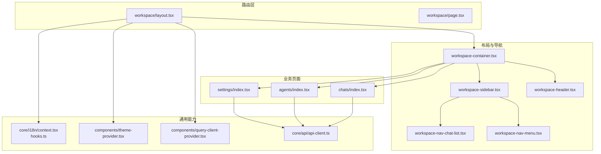
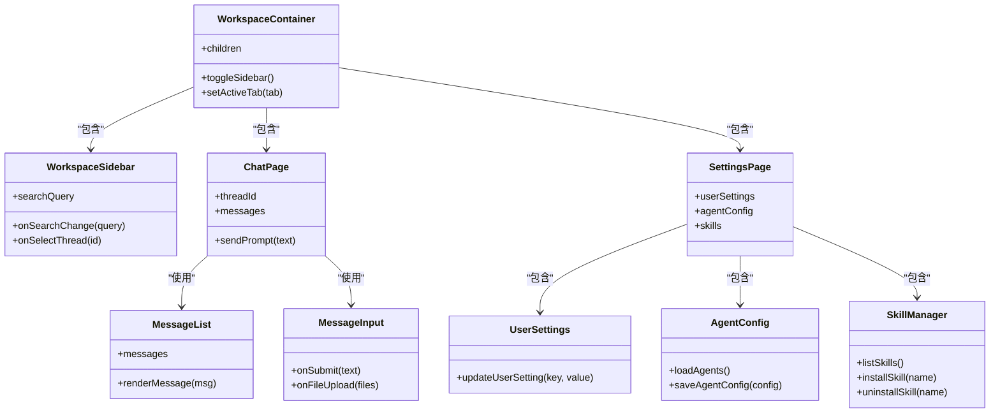
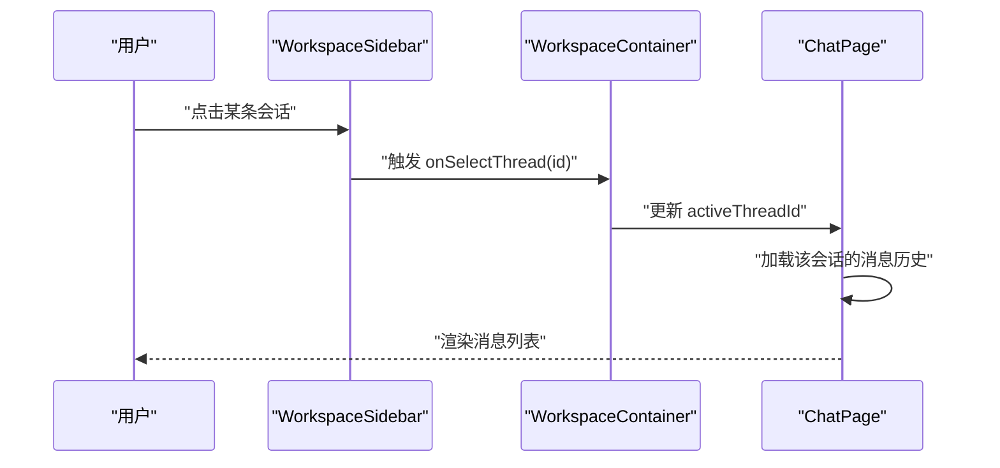
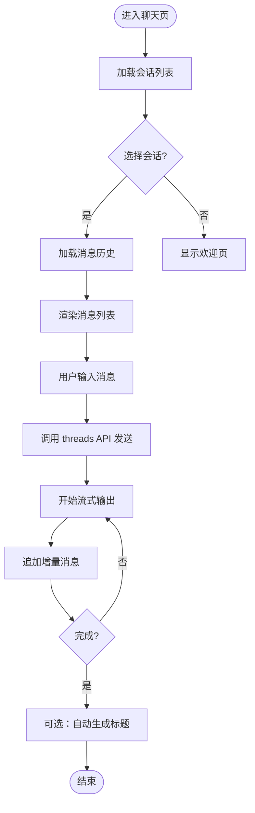
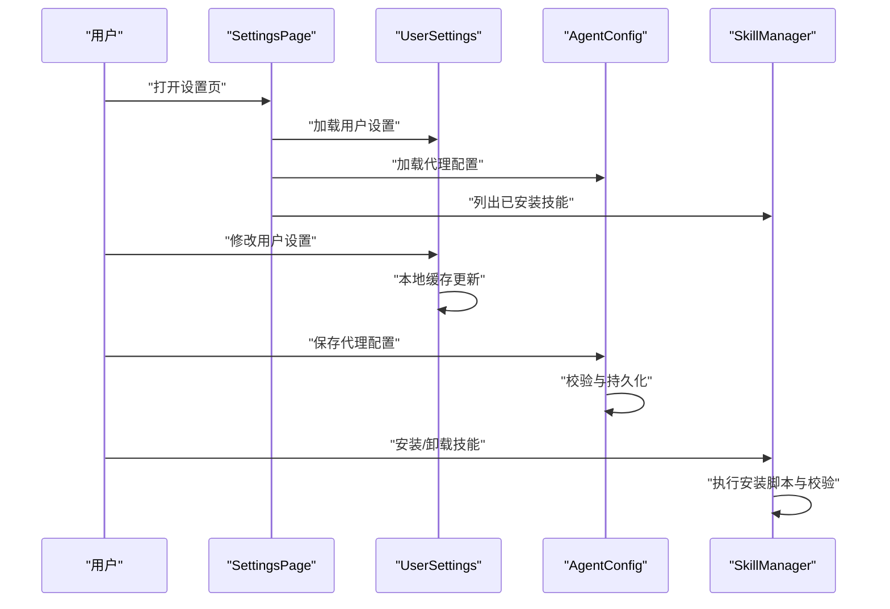
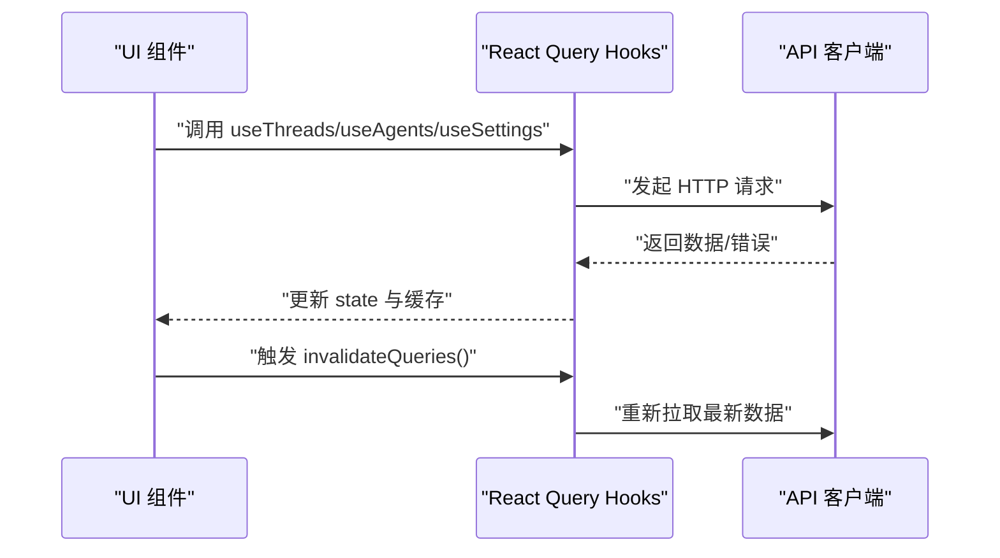
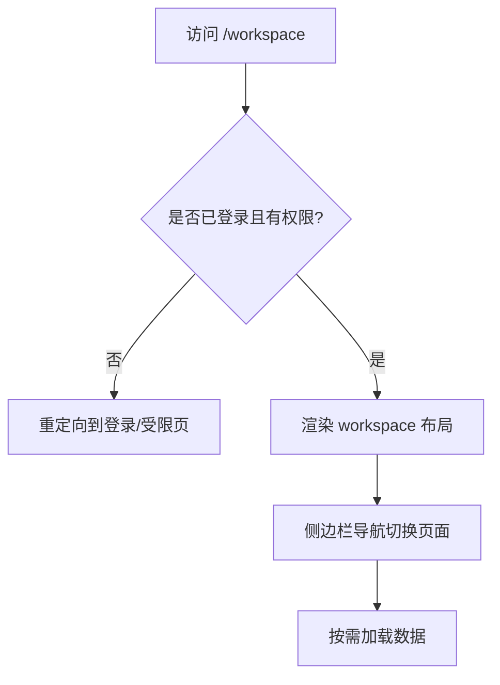
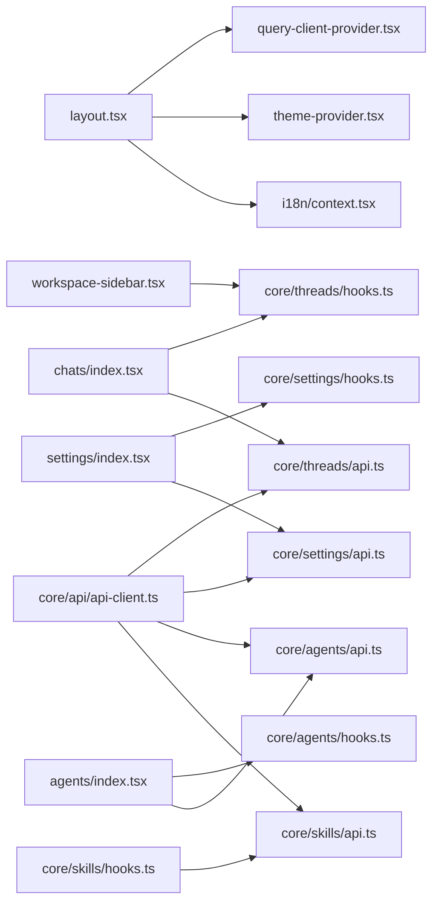

# 工作区组件

<cite>
**本文引用的文件**   
- [frontend/src/app/workspace/layout.tsx](file://frontend/src/app/workspace/layout.tsx)
- [frontend/src/app/workspace/page.tsx](file://frontend/src/app/workspace/page.tsx)
- [frontend/src/components/workspace/workspace-container.tsx](file://frontend/src/components/workspace/workspace-container.tsx)
- [frontend/src/components/workspace/workspace-sidebar.tsx](file://frontend/src/components/workspace/workspace-sidebar.tsx)
- [frontend/src/components/workspace/workspace-header.tsx](file://frontend/src/components/workspace/workspace-header.tsx)
- [frontend/src/components/workspace/workspace-nav-chat-list.tsx](file://frontend/src/components/workspace/workspace-nav-chat-list.tsx)
- [frontend/src/components/workspace/workspace-nav-menu.tsx](file://frontend/src/components/workspace/workspace-nav-menu.tsx)
- [frontend/src/components/workspace/agents/index.tsx](file://frontend/src/components/workspace/agents/index.tsx)
- [frontend/src/components/workspace/chats/index.tsx](file://frontend/src/components/workspace/chats/index.tsx)
- [frontend/src/components/workspace/settings/index.tsx](file://frontend/src/components/workspace/settings/index.tsx)
- [frontend/src/components/workspace/command-palette.tsx](file://frontend/src/components/workspace/command-palette.tsx)
- [frontend/src/components/workspace/recent-chat-list.tsx](file://frontend/src/components/workspace/recent-chat-list.tsx)
- [frontend/src/components/workspace/thread-title.tsx](file://frontend/src/components/workspace/thread-title.tsx)
- [frontend/src/components/workspace/input-box.tsx](file://frontend/src/components/workspace/input-box.tsx)
- [frontend/src/components/workspace/streaming-indicator.tsx](file://frontend/src/components/workspace/streaming-indicator.tsx)
- [frontend/src/components/workspace/token-usage-indicator.tsx](file://frontend/src/components/workspace/token-usage-indicator.tsx)
- [frontend/src/components/workspace/copy-button.tsx](file://frontend/src/components/workspace/copy-button.tsx)
- [frontend/src/components/workspace/export-trigger.tsx](file://frontend/src/components/workspace/export-trigger.tsx)
- [frontend/src/components/workspace/mode-hover-guide.tsx](file://frontend/src/components/workspace/mode-hover-guide.tsx)
- [frontend/src/components/workspace/welcome.tsx](file://frontend/src/components/workspace/welcome.tsx)
- [frontend/src/components/workspace/code-editor.tsx](file://frontend/src/components/workspace/code-editor.tsx)
- [frontend/src/components/workspace/todo-list.tsx](file://frontend/src/components/workspace/todo-list.tsx)
- [frontend/src/components/workspace/artifacts/index.tsx](file://frontend/src/components/workspace/artifacts/index.tsx)
- [frontend/src/components/workspace/messages/message-bubble.tsx](file://frontend/src/components/workspace/messages/message-bubble.tsx)
- [frontend/src/components/workspace/messages/message-list.tsx](file://frontend/src/components/workspace/messages/message-list.tsx)
- [frontend/src/components/workspace/messages/message-input.tsx](file://frontend/src/components/workspace/messages/message-input.tsx)
- [frontend/src/components/workspace/messages/message-renderer.tsx](file://frontend/src/components/workspace/messages/message-renderer.tsx)
- [frontend/src/components/workspace/settings/user-settings.tsx](file://frontend/src/components/workspace/settings/user-settings.tsx)
- [frontend/src/components/workspace/settings/agent-config.tsx](file://frontend/src/components/workspace/settings/agent-config.tsx)
- [frontend/src/components/workspace/settings/skill-manager.tsx](file://frontend/src/components/workspace/settings/skill-manager.tsx)
- [frontend/src/core/threads/hooks.ts](file://frontend/src/core/threads/hooks.ts)
- [frontend/src/core/threads/api.ts](file://frontend/src/core/threads/api.ts)
- [frontend/src/core/threads/types.ts](file://frontend/src/core/threads/types.ts)
- [frontend/src/core/agents/hooks.ts](file://frontend/src/core/agents/hooks.ts)
- [frontend/src/core/agents/api.ts](file://frontend/src/core/agents/api.ts)
- [frontend/src/core/agents/types.ts](file://frontend/src/core/agents/types.ts)
- [frontend/src/core/settings/hooks.ts](file://frontend/src/core/settings/hooks.ts)
- [frontend/src/core/settings/api.ts](file://frontend/src/core/settings/api.ts)
- [frontend/src/core/settings/types.ts](file://frontend/src/core/settings/types.ts)
- [frontend/src/core/skills/hooks.ts](file://frontend/src/core/skills/hooks.ts)
- [frontend/src/core/skills/api.ts](file://frontend/src/core/skills/api.ts)
- [frontend/src/core/skills/types.ts](file://frontend/src/core/skills/types.ts)
- [frontend/src/core/api/api-client.ts](file://frontend/src/core/api/api-client.ts)
- [frontend/src/core/i18n/context.tsx](file://frontend/src/core/i18n/context.tsx)
- [frontend/src/core/i18n/hooks.ts](file://frontend/src/core/i18n/hooks.ts)
- [frontend/src/components/query-client-provider.tsx](file://frontend/src/components/query-client-provider.tsx)
- [frontend/src/components/theme-provider.tsx](file://frontend/src/components/theme-provider.tsx)
</cite>

## 目录
1. [简介](#简介)
2. [项目结构](#项目结构)
3. [核心组件](#核心组件)
4. [架构总览](#架构总览)
5. [详细组件分析](#详细组件分析)
6. [依赖分析](#依赖分析)
7. [性能考虑](#性能考虑)
8. [故障排查指南](#故障排查指南)
9. [结论](#结论)
10. [附录](#附录)

## 简介
本文件聚焦 DeerFlow 前端“工作区”模块，系统性梳理工作区布局、聊天工作区与设置管理三大类组件，解释其职责边界、数据流与状态同步机制，并给出路由集成与权限控制实践建议。文档同时提供组件复用与扩展指南，以及典型场景的调用路径参考（以源码路径标注代替代码片段）。

## 项目结构
工作区位于 Next.js App Router 的 /workspace 路由下，采用“容器 + 侧边栏 + 主内容”的经典布局模式：
- 布局层：负责整体页面骨架、全局状态注入、国际化与主题上下文挂载。
- 导航层：侧边栏与顶部导航，承载会话列表、菜单入口与快捷操作。
- 业务层：聊天、代理、设置等子功能页面与对应组件。
- 能力层：基于 React Query 的数据获取与缓存、i18n 与主题上下文、API 客户端封装。

图示来源
- [frontend/src/app/workspace/layout.tsx](file://frontend/src/app/workspace/layout.tsx)
- [frontend/src/app/workspace/page.tsx](file://frontend/src/app/workspace/page.tsx)
- [frontend/src/components/workspace/workspace-container.tsx](file://frontend/src/components/workspace/workspace-container.tsx)
- [frontend/src/components/workspace/workspace-sidebar.tsx](file://frontend/src/components/workspace/workspace-sidebar.tsx)
- [frontend/src/components/workspace/workspace-header.tsx](file://frontend/src/components/workspace/workspace-header.tsx)
- [frontend/src/components/workspace/workspace-nav-chat-list.tsx](file://frontend/src/components/workspace/workspace-nav-chat-list.tsx)
- [frontend/src/components/workspace/workspace-nav-menu.tsx](file://frontend/src/components/workspace/workspace-nav-menu.tsx)
- [frontend/src/components/workspace/chats/index.tsx](file://frontend/src/components/workspace/chats/index.tsx)
- [frontend/src/components/workspace/agents/index.tsx](file://frontend/src/components/workspace/agents/index.tsx)
- [frontend/src/components/workspace/settings/index.tsx](file://frontend/src/components/workspace/settings/index.tsx)
- [frontend/src/core/i18n/context.tsx](file://frontend/src/core/i18n/context.tsx)
- [frontend/src/core/i18n/hooks.ts](file://frontend/src/core/i18n/hooks.ts)
- [frontend/src/components/theme-provider.tsx](file://frontend/src/components/theme-provider.tsx)
- [frontend/src/components/query-client-provider.tsx](file://frontend/src/components/query-client-provider.tsx)
- [frontend/src/core/api/api-client.ts](file://frontend/src/core/api/api-client.ts)

章节来源
- [frontend/src/app/workspace/layout.tsx](file://frontend/src/app/workspace/layout.tsx)
- [frontend/src/app/workspace/page.tsx](file://frontend/src/app/workspace/page.tsx)
- [frontend/src/components/workspace/workspace-container.tsx](file://frontend/src/components/workspace/workspace-container.tsx)
- [frontend/src/components/workspace/workspace-sidebar.tsx](file://frontend/src/components/workspace/workspace-sidebar.tsx)
- [frontend/src/components/workspace/workspace-header.tsx](file://frontend/src/components/workspace/workspace-header.tsx)
- [frontend/src/components/workspace/workspace-nav-chat-list.tsx](file://frontend/src/components/workspace/workspace-nav-chat-list.tsx)
- [frontend/src/components/workspace/workspace-nav-menu.tsx](file://frontend/src/components/workspace/workspace-nav-menu.tsx)
- [frontend/src/components/workspace/chats/index.tsx](file://frontend/src/components/workspace/chats/index.tsx)
- [frontend/src/components/workspace/agents/index.tsx](file://frontend/src/components/workspace/agents/index.tsx)
- [frontend/src/components/workspace/settings/index.tsx](file://frontend/src/components/workspace/settings/index.tsx)
- [frontend/src/core/i18n/context.tsx](file://frontend/src/core/i18n/context.tsx)
- [frontend/src/core/i18n/hooks.ts](file://frontend/src/core/i18n/hooks.ts)
- [frontend/src/components/theme-provider.tsx](file://frontend/src/components/theme-provider.tsx)
- [frontend/src/components/query-client-provider.tsx](file://frontend/src/components/query-client-provider.tsx)
- [frontend/src/core/api/api-client.ts](file://frontend/src/core/api/api-client.ts)

## 核心组件
本节概述工作区的三类核心组件及其职责：
- 布局与导航组件
  - workspace-container：工作区容器，承载侧边栏与主内容区域，提供响应式布局与全屏/分屏切换能力。
  - workspace-sidebar：侧边栏，聚合会话列表与导航菜单，支持折叠与搜索过滤。
  - workspace-header：顶部工具栏，包含标题、模式切换、导出、复制、令牌用量等快捷操作。
- 聊天工作区组件
  - chats/index：聊天页容器，组织消息历史、输入框、流式指示器与最近会话。
  - messages/*：消息气泡、消息列表、渲染器与输入框，负责消息展示与交互。
  - thread-title、recent-chat-list、streaming-indicator、token-usage-indicator、copy-button、export-trigger：辅助组件。
- 设置管理组件
  - settings/index：设置页容器，聚合用户设置、代理配置、技能管理等面板。
  - user-settings、agent-config、skill-manager：具体配置界面。

章节来源
- [frontend/src/components/workspace/workspace-container.tsx](file://frontend/src/components/workspace/workspace-container.tsx)
- [frontend/src/components/workspace/workspace-sidebar.tsx](file://frontend/src/components/workspace/workspace-sidebar.tsx)
- [frontend/src/components/workspace/workspace-header.tsx](file://frontend/src/components/workspace/workspace-header.tsx)
- [frontend/src/components/workspace/chats/index.tsx](file://frontend/src/components/workspace/chats/index.tsx)
- [frontend/src/components/workspace/messages/message-bubble.tsx](file://frontend/src/components/workspace/messages/message-bubble.tsx)
- [frontend/src/components/workspace/messages/message-list.tsx](file://frontend/src/components/workspace/messages/message-list.tsx)
- [frontend/src/components/workspace/messages/message-input.tsx](file://frontend/src/components/workspace/messages/message-input.tsx)
- [frontend/src/components/workspace/messages/message-renderer.tsx](file://frontend/src/components/workspace/messages/message-renderer.tsx)
- [frontend/src/components/workspace/thread-title.tsx](file://frontend/src/components/workspace/thread-title.tsx)
- [frontend/src/components/workspace/recent-chat-list.tsx](file://frontend/src/components/workspace/recent-chat-list.tsx)
- [frontend/src/components/workspace/streaming-indicator.tsx](file://frontend/src/components/workspace/streaming-indicator.tsx)
- [frontend/src/components/workspace/token-usage-indicator.tsx](file://frontend/src/components/workspace/token-usage-indicator.tsx)
- [frontend/src/components/workspace/copy-button.tsx](file://frontend/src/components/workspace/copy-button.tsx)
- [frontend/src/components/workspace/export-trigger.tsx](file://frontend/src/components/workspace/export-trigger.tsx)
- [frontend/src/components/workspace/settings/index.tsx](file://frontend/src/components/workspace/settings/index.tsx)
- [frontend/src/components/workspace/settings/user-settings.tsx](file://frontend/src/components/workspace/settings/user-settings.tsx)
- [frontend/src/components/workspace/settings/agent-config.tsx](file://frontend/src/components/workspace/settings/agent-config.tsx)
- [frontend/src/components/workspace/settings/skill-manager.tsx](file://frontend/src/components/workspace/settings/skill-manager.tsx)

## 架构总览
工作区采用“容器-页面-组件-能力”的分层架构：
- 容器层：workspace-container 负责布局与全局上下文挂载。
- 页面层：chats、agents、settings 作为功能入口，组合业务组件。
- 组件层：消息、设置、工具栏等细粒度 UI 组件。
- 能力层：React Query hooks、API 客户端、i18n、主题、快捷键与移动端适配。

图示来源
- [frontend/src/components/workspace/workspace-container.tsx](file://frontend/src/components/workspace/workspace-container.tsx)
- [frontend/src/components/workspace/workspace-sidebar.tsx](file://frontend/src/components/workspace/workspace-sidebar.tsx)
- [frontend/src/components/workspace/chats/index.tsx](file://frontend/src/components/workspace/chats/index.tsx)
- [frontend/src/components/workspace/messages/message-list.tsx](file://frontend/src/components/workspace/messages/message-list.tsx)
- [frontend/src/components/workspace/messages/message-input.tsx](file://frontend/src/components/workspace/messages/message-input.tsx)
- [frontend/src/components/workspace/settings/index.tsx](file://frontend/src/components/workspace/settings/index.tsx)
- [frontend/src/components/workspace/settings/user-settings.tsx](file://frontend/src/components/workspace/settings/user-settings.tsx)
- [frontend/src/components/workspace/settings/agent-config.tsx](file://frontend/src/components/workspace/settings/agent-config.tsx)
- [frontend/src/components/workspace/settings/skill-manager.tsx](file://frontend/src/components/workspace/settings/skill-manager.tsx)

## 详细组件分析

### 布局与导航组件
- workspace-container
  - 职责：统一布局、侧边栏显隐、主内容区域占位、全局快捷键与滚动行为。
  - 关键交互：切换侧边栏、响应式断点处理、全屏/分屏模式切换。
- workspace-sidebar
  - 职责：会话列表、搜索过滤、快速新建会话、导航菜单入口。
  - 关键交互：搜索实时过滤、选中高亮、键盘导航。
- workspace-header
  - 职责：当前会话标题、模式切换（如思考/执行）、导出、复制、令牌用量提示。
  - 关键交互：一键复制结果、导出为 Markdown/PDF、显示流式输出状态。

图示来源
- [frontend/src/components/workspace/workspace-sidebar.tsx](file://frontend/src/components/workspace/workspace-sidebar.tsx)
- [frontend/src/components/workspace/workspace-container.tsx](file://frontend/src/components/workspace/workspace-container.tsx)
- [frontend/src/components/workspace/chats/index.tsx](file://frontend/src/components/workspace/chats/index.tsx)

章节来源
- [frontend/src/components/workspace/workspace-container.tsx](file://frontend/src/components/workspace/workspace-container.tsx)
- [frontend/src/components/workspace/workspace-sidebar.tsx](file://frontend/src/components/workspace/workspace-sidebar.tsx)
- [frontend/src/components/workspace/workspace-header.tsx](file://frontend/src/components/workspace/workspace-header.tsx)

### 聊天工作区组件
- chats/index
  - 职责：组织消息历史、输入框、流式指示器、最近会话与线程标题。
  - 数据流：通过 threads hooks 拉取会话列表与消息；发送消息后进入流式输出阶段。
- messages/*
  - message-list：按时间顺序渲染消息，支持虚拟滚动优化长列表。
  - message-bubble：单条消息卡片，区分用户/系统/工具输出。
  - message-renderer：解析富文本、代码块、图表、链接等。
  - message-input：输入框、附件上传、快捷键提交。
- 辅助组件
  - thread-title：编辑与自动重命名。
  - recent-chat-list：最近会话快速跳转。
  - streaming-indicator：流式输出状态可视化。
  - token-usage-indicator：令牌用量统计与阈值告警。
  - copy-button、export-trigger：复制与导出。

图示来源
- [frontend/src/components/workspace/chats/index.tsx](file://frontend/src/components/workspace/chats/index.tsx)
- [frontend/src/components/workspace/messages/message-list.tsx](file://frontend/src/components/workspace/messages/message-list.tsx)
- [frontend/src/components/workspace/messages/message-input.tsx](file://frontend/src/components/workspace/messages/message-input.tsx)
- [frontend/src/components/workspace/streaming-indicator.tsx](file://frontend/src/components/workspace/streaming-indicator.tsx)
- [frontend/src/components/workspace/thread-title.tsx](file://frontend/src/components/workspace/thread-title.tsx)

章节来源
- [frontend/src/components/workspace/chats/index.tsx](file://frontend/src/components/workspace/chats/index.tsx)
- [frontend/src/components/workspace/messages/message-list.tsx](file://frontend/src/components/workspace/messages/message-list.tsx)
- [frontend/src/components/workspace/messages/message-bubble.tsx](file://frontend/src/components/workspace/messages/message-bubble.tsx)
- [frontend/src/components/workspace/messages/message-input.tsx](file://frontend/src/components/workspace/messages/message-input.tsx)
- [frontend/src/components/workspace/messages/message-renderer.tsx](file://frontend/src/components/workspace/messages/message-renderer.tsx)
- [frontend/src/components/workspace/thread-title.tsx](file://frontend/src/components/workspace/thread-title.tsx)
- [frontend/src/components/workspace/recent-chat-list.tsx](file://frontend/src/components/workspace/recent-chat-list.tsx)
- [frontend/src/components/workspace/streaming-indicator.tsx](file://frontend/src/components/workspace/streaming-indicator.tsx)
- [frontend/src/components/workspace/token-usage-indicator.tsx](file://frontend/src/components/workspace/token-usage-indicator.tsx)
- [frontend/src/components/workspace/copy-button.tsx](file://frontend/src/components/workspace/copy-button.tsx)
- [frontend/src/components/workspace/export-trigger.tsx](file://frontend/src/components/workspace/export-trigger.tsx)

### 设置管理组件
- settings/index
  - 职责：聚合用户设置、代理配置、技能管理等面板，提供标签页或抽屉式切换。
- user-settings
  - 职责：语言、主题、快捷键、通知偏好等用户级配置。
- agent-config
  - 职责：模型选择、代理参数、工具开关、沙箱与安全策略。
- skill-manager
  - 职责：技能安装/卸载、版本管理、依赖校验与回滚。

图示来源
- [frontend/src/components/workspace/settings/index.tsx](file://frontend/src/components/workspace/settings/index.tsx)
- [frontend/src/components/workspace/settings/user-settings.tsx](file://frontend/src/components/workspace/settings/user-settings.tsx)
- [frontend/src/components/workspace/settings/agent-config.tsx](file://frontend/src/components/workspace/settings/agent-config.tsx)
- [frontend/src/components/workspace/settings/skill-manager.tsx](file://frontend/src/components/workspace/settings/skill-manager.tsx)

章节来源
- [frontend/src/components/workspace/settings/index.tsx](file://frontend/src/components/workspace/settings/index.tsx)
- [frontend/src/components/workspace/settings/user-settings.tsx](file://frontend/src/components/workspace/settings/user-settings.tsx)
- [frontend/src/components/workspace/settings/agent-config.tsx](file://frontend/src/components/workspace/settings/agent-config.tsx)
- [frontend/src/components/workspace/settings/skill-manager.tsx](file://frontend/src/components/workspace/settings/skill-manager.tsx)

### 数据传递与状态同步机制
- 数据获取与缓存
  - 使用 React Query hooks（threads、agents、settings、skills）进行数据请求、缓存与失效刷新。
  - API 客户端统一封装错误处理、重试与鉴权头注入。
- 状态同步
  - 会话切换：侧边栏触发 onSelectThread，容器更新 activeThreadId，聊天页重新拉取消息。
  - 流式输出：消息列表增量追加，流式指示器与令牌用量联动更新。
  - 设置变更：用户设置本地优先，代理配置与技能管理涉及后端持久化与校验。
- 国际化与主题
  - i18n 上下文与 hooks 提供多语言切换；主题上下文驱动 UI 组件样式。

图示来源
- [frontend/src/core/threads/hooks.ts](file://frontend/src/core/threads/hooks.ts)
- [frontend/src/core/threads/api.ts](file://frontend/src/core/threads/api.ts)
- [frontend/src/core/agents/hooks.ts](file://frontend/src/core/agents/hooks.ts)
- [frontend/src/core/agents/api.ts](file://frontend/src/core/agents/api.ts)
- [frontend/src/core/settings/hooks.ts](file://frontend/src/core/settings/hooks.ts)
- [frontend/src/core/settings/api.ts](file://frontend/src/core/settings/api.ts)
- [frontend/src/core/skills/hooks.ts](file://frontend/src/core/skills/hooks.ts)
- [frontend/src/core/skills/api.ts](file://frontend/src/core/skills/api.ts)
- [frontend/src/core/api/api-client.ts](file://frontend/src/core/api/api-client.ts)

章节来源
- [frontend/src/core/threads/hooks.ts](file://frontend/src/core/threads/hooks.ts)
- [frontend/src/core/threads/api.ts](file://frontend/src/core/threads/api.ts)
- [frontend/src/core/agents/hooks.ts](file://frontend/src/core/agents/hooks.ts)
- [frontend/src/core/agents/api.ts](file://frontend/src/core/agents/api.ts)
- [frontend/src/core/settings/hooks.ts](file://frontend/src/core/settings/hooks.ts)
- [frontend/src/core/settings/api.ts](file://frontend/src/core/settings/api.ts)
- [frontend/src/core/skills/hooks.ts](file://frontend/src/core/skills/hooks.ts)
- [frontend/src/core/skills/api.ts](file://frontend/src/core/skills/api.ts)
- [frontend/src/core/api/api-client.ts](file://frontend/src/core/api/api-client.ts)

### 路由集成与权限控制
- 路由集成
  - 使用 Next.js App Router 的 /workspace 布局与页面组织，侧边栏导航通过路由跳转实现页面切换。
  - 聊天页根据 URL 中的 threadId 动态加载会话数据。
- 权限控制
  - 建议在布局层引入鉴权守卫，未登录或无权限时重定向至登录页或受限页面。
  - 对敏感操作（如代理配置保存、技能安装）在 API 层进行二次校验与审计。

[此图为概念性流程，不直接映射具体源码文件]

### 组件复用与扩展开发指南
- 复用策略
  - 将通用 UI 元素（按钮、卡片、表单控件）抽取到 ui 目录，供工作区各页面共享。
  - 将业务逻辑下沉到 core 层的 hooks 与 api，避免在组件中重复实现。
- 扩展方式
  - 新增页面：在 workspace 路由下创建新目录与 page.tsx，并在侧边栏注册导航项。
  - 新增能力：在 core 层添加 hooks 与 api，暴露给组件消费。
  - 插件化：通过命令面板与工具栏扩展入口，保持低耦合。
- 最佳实践
  - 使用 TypeScript 类型约束，确保数据结构一致。
  - 对长列表与大图进行虚拟化与懒加载。
  - 对网络请求增加重试与错误降级策略。

章节来源
- [frontend/src/components/workspace/command-palette.tsx](file://frontend/src/components/workspace/command-palette.tsx)
- [frontend/src/components/workspace/mode-hover-guide.tsx](file://frontend/src/components/workspace/mode-hover-guide.tsx)
- [frontend/src/components/workspace/welcome.tsx](file://frontend/src/components/workspace/welcome.tsx)
- [frontend/src/components/workspace/code-editor.tsx](file://frontend/src/components/workspace/code-editor.tsx)
- [frontend/src/components/workspace/todo-list.tsx](file://frontend/src/components/workspace/todo-list.tsx)
- [frontend/src/components/workspace/artifacts/index.tsx](file://frontend/src/components/workspace/artifacts/index.tsx)

## 依赖分析
工作区组件依赖关系如下：
- 布局与导航依赖 i18n、主题与查询客户端。
- 聊天与设置页面依赖各自领域的 hooks 与 api。
- 所有网络请求经由统一的 API 客户端。

图示来源
- [frontend/src/app/workspace/layout.tsx](file://frontend/src/app/workspace/layout.tsx)
- [frontend/src/components/query-client-provider.tsx](file://frontend/src/components/query-client-provider.tsx)
- [frontend/src/components/theme-provider.tsx](file://frontend/src/components/theme-provider.tsx)
- [frontend/src/core/i18n/context.tsx](file://frontend/src/core/i18n/context.tsx)
- [frontend/src/components/workspace/workspace-sidebar.tsx](file://frontend/src/components/workspace/workspace-sidebar.tsx)
- [frontend/src/components/workspace/chats/index.tsx](file://frontend/src/components/workspace/chats/index.tsx)
- [frontend/src/components/workspace/settings/index.tsx](file://frontend/src/components/workspace/settings/index.tsx)
- [frontend/src/components/workspace/agents/index.tsx](file://frontend/src/components/workspace/agents/index.tsx)
- [frontend/src/core/threads/hooks.ts](file://frontend/src/core/threads/hooks.ts)
- [frontend/src/core/threads/api.ts](file://frontend/src/core/threads/api.ts)
- [frontend/src/core/settings/hooks.ts](file://frontend/src/core/settings/hooks.ts)
- [frontend/src/core/settings/api.ts](file://frontend/src/core/settings/api.ts)
- [frontend/src/core/agents/hooks.ts](file://frontend/src/core/agents/hooks.ts)
- [frontend/src/core/agents/api.ts](file://frontend/src/core/agents/api.ts)
- [frontend/src/core/skills/hooks.ts](file://frontend/src/core/skills/hooks.ts)
- [frontend/src/core/skills/api.ts](file://frontend/src/core/skills/api.ts)
- [frontend/src/core/api/api-client.ts](file://frontend/src/core/api/api-client.ts)

章节来源
- [frontend/src/app/workspace/layout.tsx](file://frontend/src/app/workspace/layout.tsx)
- [frontend/src/components/query-client-provider.tsx](file://frontend/src/components/query-client-provider.tsx)
- [frontend/src/components/theme-provider.tsx](file://frontend/src/components/theme-provider.tsx)
- [frontend/src/core/i18n/context.tsx](file://frontend/src/core/i18n/context.tsx)
- [frontend/src/components/workspace/workspace-sidebar.tsx](file://frontend/src/components/workspace/workspace-sidebar.tsx)
- [frontend/src/components/workspace/chats/index.tsx](file://frontend/src/components/workspace/chats/index.tsx)
- [frontend/src/components/workspace/settings/index.tsx](file://frontend/src/components/workspace/settings/index.tsx)
- [frontend/src/components/workspace/agents/index.tsx](file://frontend/src/components/workspace/agents/index.tsx)
- [frontend/src/core/threads/hooks.ts](file://frontend/src/core/threads/hooks.ts)
- [frontend/src/core/threads/api.ts](file://frontend/src/core/threads/api.ts)
- [frontend/src/core/settings/hooks.ts](file://frontend/src/core/settings/hooks.ts)
- [frontend/src/core/settings/api.ts](file://frontend/src/core/settings/api.ts)
- [frontend/src/core/agents/hooks.ts](file://frontend/src/core/agents/hooks.ts)
- [frontend/src/core/agents/api.ts](file://frontend/src/core/agents/api.ts)
- [frontend/src/core/skills/hooks.ts](file://frontend/src/core/skills/hooks.ts)
- [frontend/src/core/skills/api.ts](file://frontend/src/core/skills/api.ts)
- [frontend/src/core/api/api-client.ts](file://frontend/src/core/api/api-client.ts)

## 性能考虑
- 列表渲染：消息列表建议使用虚拟滚动，避免大量 DOM 节点导致的卡顿。
- 网络请求：合理设置缓存时间与失效策略，减少重复请求；对失败请求增加指数退避重试。
- 流式输出：增量渲染时注意防抖与节流，避免频繁重排。
- 资源加载：图片与大型文件懒加载，必要时进行压缩与格式转换。
- 内存管理：及时清理订阅与事件监听，防止内存泄漏。

## 故障排查指南
- 常见问题
  - 会话无法加载：检查 threads hooks 与 API 客户端的错误处理日志，确认鉴权头是否正确注入。
  - 消息不更新：确认流式输出事件是否被正确捕获，消息列表是否触发增量更新。
  - 设置保存失败：查看 agent-config 与 skill-manager 的校验逻辑与后端返回码。
- 调试建议
  - 启用 React Query DevTools 观察缓存与请求状态。
  - 在 API 客户端增加请求/响应拦截日志。
  - 对复杂交互添加步骤埋点，定位问题链路。

章节来源
- [frontend/src/core/threads/hooks.ts](file://frontend/src/core/threads/hooks.ts)
- [frontend/src/core/threads/api.ts](file://frontend/src/core/threads/api.ts)
- [frontend/src/core/settings/hooks.ts](file://frontend/src/core/settings/hooks.ts)
- [frontend/src/core/settings/api.ts](file://frontend/src/core/settings/api.ts)
- [frontend/src/core/agents/hooks.ts](file://frontend/src/core/agents/hooks.ts)
- [frontend/src/core/agents/api.ts](file://frontend/src/core/agents/api.ts)
- [frontend/src/core/skills/hooks.ts](file://frontend/src/core/skills/hooks.ts)
- [frontend/src/core/skills/api.ts](file://frontend/src/core/skills/api.ts)
- [frontend/src/core/api/api-client.ts](file://frontend/src/core/api/api-client.ts)

## 结论
DeerFlow 工作区组件以清晰的层次划分与稳定的数据流为基础，提供了可扩展的聊天与设置管理能力。通过容器-页面-组件-能力的分层设计，结合 React Query 与统一 API 客户端，实现了良好的可维护性与性能表现。遵循本文档的复用与扩展指南，可高效地新增功能并保持代码一致性。

## 附录
- 实际应用场景参考路径
  - 聊天发送消息：[frontend/src/components/workspace/chats/index.tsx](file://frontend/src/components/workspace/chats/index.tsx) → [frontend/src/core/threads/api.ts](file://frontend/src/core/threads/api.ts)
  - 会话列表搜索过滤：[frontend/src/components/workspace/workspace-sidebar.tsx](file://frontend/src/components/workspace/workspace-sidebar.tsx)
  - 代理配置保存：[frontend/src/components/workspace/settings/agent-config.tsx](file://frontend/src/components/workspace/settings/agent-config.tsx) → [frontend/src/core/agents/api.ts](file://frontend/src/core/agents/api.ts)
  - 技能安装/卸载：[frontend/src/components/workspace/settings/skill-manager.tsx](file://frontend/src/components/workspace/settings/skill-manager.tsx) → [frontend/src/core/skills/api.ts](file://frontend/src/core/skills/api.ts)
  - 令牌用量统计：[frontend/src/components/workspace/token-usage-indicator.tsx](file://frontend/src/components/workspace/token-usage-indicator.tsx)
  - 导出与复制：[frontend/src/components/workspace/export-trigger.tsx](file://frontend/src/components/workspace/export-trigger.tsx)、[frontend/src/components/workspace/copy-button.tsx](file://frontend/src/components/workspace/copy-button.tsx)