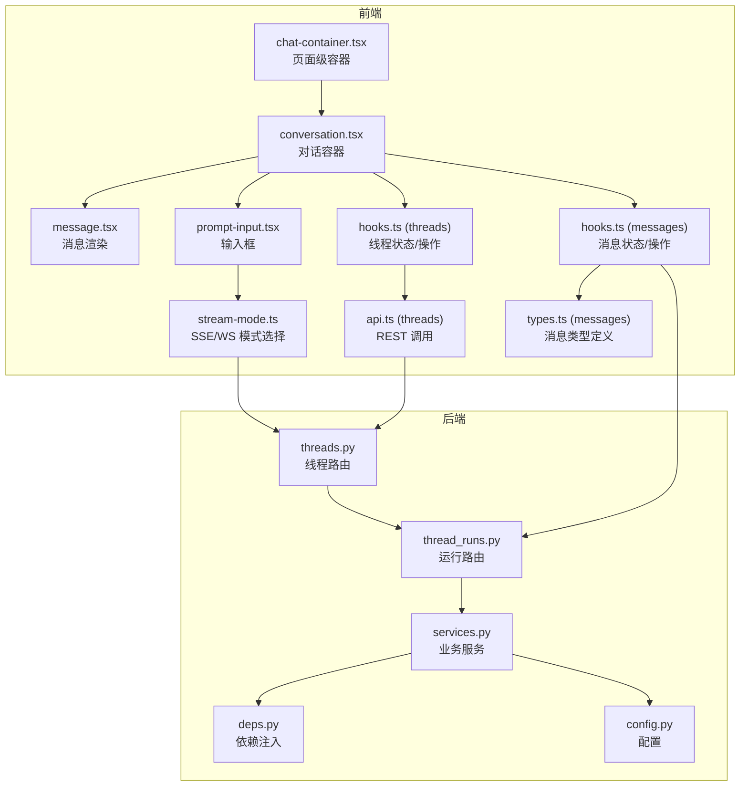
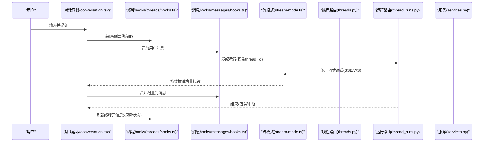
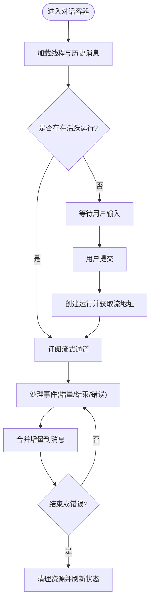
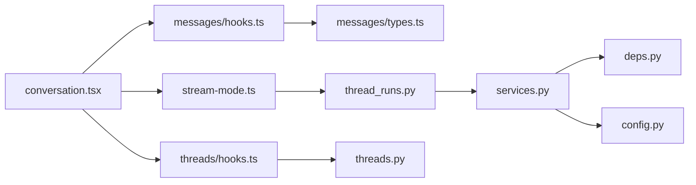

# 对话容器

<cite>
**本文引用的文件**
- [frontend/src/components/ai-elements/conversation.tsx](file://frontend/src/components/ai-elements/conversation.tsx)
- [frontend/src/components/ai-elements/prompt-input.tsx](file://frontend/src/components/ai-elements/prompt-input.tsx)
- [frontend/src/components/ai-elements/message.tsx](file://frontend/src/components/ai-elements/message.tsx)
- [frontend/src/components/workspace/chats/chat-container.tsx](file://frontend/src/components/workspace/chats/chat-container.tsx)
- [frontend/src/core/threads/hooks.ts](file://frontend/src/core/threads/hooks.ts)
- [frontend/src/core/threads/api.ts](file://frontend/src/core/threads/api.ts)
- [frontend/src/core/messages/hooks.ts](file://frontend/src/core/messages/hooks.ts)
- [frontend/src/core/messages/types.ts](file://frontend/src/core/messages/types.ts)
- [frontend/src/core/api/stream-mode.ts](file://frontend/src/core/api/stream-mode.ts)
- [backend/app/gateway/routers/threads.py](file://backend/app/gateway/routers/threads.py)
- [backend/app/gateway/routers/thread_runs.py](file://backend/app/gateway/routers/thread_runs.py)
- [backend/app/gateway/services.py](file://backend/app/gateway/services.py)
- [backend/app/gateway/deps.py](file://backend/app/gateway/deps.py)
- [backend/app/gateway/config.py](file://backend/app/gateway/config.py)
</cite>

## 目录
1. [简介](#简介)
2. [项目结构](#项目结构)
3. [核心组件](#核心组件)
4. [架构总览](#架构总览)
5. [详细组件分析](#详细组件分析)
6. [依赖关系分析](#依赖关系分析)
7. [性能考虑](#性能考虑)
8. [故障排查指南](#故障排查指南)
9. [结论](#结论)
10. [附录](#附录)

## 简介
本文件面向 DeerFlow 前端“对话容器”能力，系统性梳理会话状态管理、消息列表渲染、输入框集成、实时通信（WebSocket/SSE）、断线重连策略、对话生命周期（新建/加载/切换）以及扩展点（中间件、事件监听、状态订阅）。文档同时提供可视化图示与可操作的实践示例路径，帮助开发者快速理解并二次开发。

## 项目结构
对话容器位于前端工作区，围绕“聊天页面—对话容器—消息渲染—输入框—线程与消息数据层—后端网关路由与服务”的链路组织。关键位置如下：
- 对话容器与页面入口：workspace 下的聊天容器
- 对话 UI 组件：conversation、message、prompt-input
- 数据与状态：core/threads、core/messages
- 流式传输模式：core/api/stream-mode.ts
- 后端网关：routers/threads.py、thread_runs.py、services.py、deps.py、config.py

图表来源
- [frontend/src/components/workspace/chats/chat-container.tsx](file://frontend/src/components/workspace/chats/chat-container.tsx)
- [frontend/src/components/ai-elements/conversation.tsx](file://frontend/src/components/ai-elements/conversation.tsx)
- [frontend/src/components/ai-elements/message.tsx](file://frontend/src/components/ai-elements/message.tsx)
- [frontend/src/components/ai-elements/prompt-input.tsx](file://frontend/src/components/ai-elements/prompt-input.tsx)
- [frontend/src/core/threads/hooks.ts](file://frontend/src/core/threads/hooks.ts)
- [frontend/src/core/threads/api.ts](file://frontend/src/core/threads/api.ts)
- [frontend/src/core/messages/hooks.ts](file://frontend/src/core/messages/hooks.ts)
- [frontend/src/core/messages/types.ts](file://frontend/src/core/messages/types.ts)
- [frontend/src/core/api/stream-mode.ts](file://frontend/src/core/api/stream-mode.ts)
- [backend/app/gateway/routers/threads.py](file://backend/app/gateway/routers/threads.py)
- [backend/app/gateway/routers/thread_runs.py](file://backend/app/gateway/routers/thread_runs.py)
- [backend/app/gateway/services.py](file://backend/app/gateway/services.py)
- [backend/app/gateway/deps.py](file://backend/app/gateway/deps.py)
- [backend/app/gateway/config.py](file://backend/app/gateway/config.py)

章节来源
- [frontend/src/components/workspace/chats/chat-container.tsx](file://frontend/src/components/workspace/chats/chat-container.tsx)
- [frontend/src/components/ai-elements/conversation.tsx](file://frontend/src/components/ai-elements/conversation.tsx)
- [frontend/src/core/threads/hooks.ts](file://frontend/src/core/threads/hooks.ts)
- [frontend/src/core/messages/hooks.ts](file://frontend/src/core/messages/hooks.ts)
- [frontend/src/core/api/stream-mode.ts](file://frontend/src/core/api/stream-mode.ts)
- [backend/app/gateway/routers/threads.py](file://backend/app/gateway/routers/threads.py)
- [backend/app/gateway/routers/thread_runs.py](file://backend/app/gateway/routers/thread_runs.py)
- [backend/app/gateway/services.py](file://backend/app/gateway/services.py)

## 核心组件
- 对话容器（conversation.tsx）
  - 职责：聚合线程与消息状态、控制发送流程、渲染消息列表、承载输入框、处理流式增量更新、维护滚动与交互状态。
  - 关键点：订阅线程与消息 hooks；根据当前 threadId 拉取历史；在发送时触发运行；接收 SSE/WS 增量并合并到本地消息队列；处理错误与终止信号。
- 消息渲染（message.tsx）
  - 职责：将单条消息按角色与内容类型渲染为 UI；支持工具调用、代码块、引用等富内容。
- 输入框（prompt-input.tsx）
  - 职责：文本输入、附件上传、快捷键、IME 兼容、发送按钮禁用态、清空与撤销。
- 线程与消息数据层（core/threads, core/messages）
  - 职责：封装 REST 请求、缓存与同步、消息去重与追加、运行状态跟踪。
- 流式传输模式（core/api/stream-mode.ts）
  - 职责：统一选择 SSE 或 WebSocket 通道，暴露一致的流式读取接口。

章节来源
- [frontend/src/components/ai-elements/conversation.tsx](file://frontend/src/components/ai-elements/conversation.tsx)
- [frontend/src/components/ai-elements/message.tsx](file://frontend/src/components/ai-elements/message.tsx)
- [frontend/src/components/ai-elements/prompt-input.tsx](file://frontend/src/components/ai-elements/prompt-input.tsx)
- [frontend/src/core/threads/hooks.ts](file://frontend/src/core/threads/hooks.ts)
- [frontend/src/core/messages/hooks.ts](file://frontend/src/core/messages/hooks.ts)
- [frontend/src/core/messages/types.ts](file://frontend/src/core/messages/types.ts)
- [frontend/src/core/api/stream-mode.ts](file://frontend/src/core/api/stream-mode.ts)

## 架构总览
对话容器通过 hooks 与 API 层协同，完成“创建/加载/切换对话”和“发送消息—流式响应—增量渲染”的闭环。后端由网关路由提供服务，结合 services 与 deps 完成模型、工具、沙箱等运行时编排。

图表来源
- [frontend/src/components/ai-elements/conversation.tsx](file://frontend/src/components/ai-elements/conversation.tsx)
- [frontend/src/core/threads/hooks.ts](file://frontend/src/core/threads/hooks.ts)
- [frontend/src/core/messages/hooks.ts](file://frontend/src/core/messages/hooks.ts)
- [frontend/src/core/api/stream-mode.ts](file://frontend/src/core/api/stream-mode.ts)
- [backend/app/gateway/routers/threads.py](file://backend/app/gateway/routers/threads.py)
- [backend/app/gateway/routers/thread_runs.py](file://backend/app/gateway/routers/thread_runs.py)
- [backend/app/gateway/services.py](file://backend/app/gateway/services.py)

## 详细组件分析

### 对话容器（conversation.tsx）
- 会话状态管理
  - 基于线程 hooks 获取当前 threadId、线程元信息与运行状态；在切换或新建时重置本地滚动与临时状态。
  - 使用消息 hooks 维护消息列表，保证新增、增量合并与错误回滚的一致性。
- 消息列表渲染
  - 遍历消息数组，按角色与类型交由 message.tsx 渲染；对正在运行的消息启用流式追加逻辑。
- 输入框集成
  - 将 prompt-input.tsx 作为子组件，绑定提交回调；在发送前校验输入与附件，发送后禁用输入直至收到首个增量或错误。
- 实时通信机制
  - 通过 stream-mode.ts 选择 SSE 或 WS 通道；建立连接后逐条消费事件，将增量写入消息对象对应字段，避免整段替换导致的闪烁。
- 断线重连
  - 监听连接关闭与错误事件，采用指数退避重试；若服务端支持恢复位点，则从最近检查点续传，否则标记失败并提示重试。
- 错误与边界
  - 捕获网络异常、解析异常与业务错误；对超长输出进行截断提示；在用户主动停止时清理资源并更新状态。

图表来源
- [frontend/src/components/ai-elements/conversation.tsx](file://frontend/src/components/ai-elements/conversation.tsx)
- [frontend/src/core/api/stream-mode.ts](file://frontend/src/core/api/stream-mode.ts)
- [frontend/src/core/threads/hooks.ts](file://frontend/src/core/threads/hooks.ts)
- [frontend/src/core/messages/hooks.ts](file://frontend/src/core/messages/hooks.ts)

章节来源
- [frontend/src/components/ai-elements/conversation.tsx](file://frontend/src/components/ai-elements/conversation.tsx)
- [frontend/src/core/api/stream-mode.ts](file://frontend/src/core/api/stream-mode.ts)
- [frontend/src/core/threads/hooks.ts](file://frontend/src/core/threads/hooks.ts)
- [frontend/src/core/messages/hooks.ts](file://frontend/src/core/messages/hooks.ts)

### 消息渲染（message.tsx）
- 支持多内容形态：纯文本、Markdown、代码块、图片、工具调用结果、引用来源等。
- 针对流式场景，仅更新差异区域，减少重排；对长内容启用虚拟滚动或分页加载。
- 提供复制、展开/折叠、打开外部链接等交互。

章节来源
- [frontend/src/components/ai-elements/message.tsx](file://frontend/src/components/ai-elements/message.tsx)

### 输入框（prompt-input.tsx）
- 功能要点：多行输入、粘贴图片、拖拽上传、快捷键（如 Enter 发送）、输入法兼容。
- 与对话容器的协作：在发送前组装上下文（如系统提示、工具开关），发送后进入“等待中”态，直到收到首个增量或错误。

章节来源
- [frontend/src/components/ai-elements/prompt-input.tsx](file://frontend/src/components/ai-elements/prompt-input.tsx)

### 线程与消息数据层（core/threads, core/messages）
- 线程 hooks
  - 提供获取线程列表、创建线程、切换线程、刷新线程元信息等方法；内部维护本地缓存与失效策略。
- 消息 hooks
  - 提供按线程拉取消息、追加用户消息、合并增量、删除/编辑消息、批量导入等操作；确保幂等与顺序一致性。
- 类型定义
  - 明确消息体、运行状态、工具调用、来源等数据结构，便于前后端契约稳定。

章节来源
- [frontend/src/core/threads/hooks.ts](file://frontend/src/core/threads/hooks.ts)
- [frontend/src/core/messages/hooks.ts](file://frontend/src/core/messages/hooks.ts)
- [frontend/src/core/messages/types.ts](file://frontend/src/core/messages/types.ts)

### 流式传输模式（core/api/stream-mode.ts）
- 抽象统一的流式读取接口，屏蔽底层 SSE 与 WebSocket 的差异。
- 负责连接建立、心跳保活、错误上报、断线重连与最大重试次数控制。
- 暴露事件回调：onMessage/onClose/onError，供上层组合业务逻辑。

章节来源
- [frontend/src/core/api/stream-mode.ts](file://frontend/src/core/api/stream-mode.ts)

### 后端网关（threads.py / thread_runs.py / services.py / deps.py / config.py）
- threads.py：提供线程 CRUD、列表查询、元信息更新等 REST 接口。
- thread_runs.py：提供运行创建、取消、状态查询与流式输出端点；决定使用 SSE 或 WS 返回增量。
- services.py：编排 Agent、工具、记忆、沙箱等运行时能力，生成最终输出。
- deps.py：依赖注入与共享资源（数据库、缓存、模型客户端等）。
- config.py：全局配置（超时、并发、限流、日志级别等）。

章节来源
- [backend/app/gateway/routers/threads.py](file://backend/app/gateway/routers/threads.py)
- [backend/app/gateway/routers/thread_runs.py](file://backend/app/gateway/routers/thread_runs.py)
- [backend/app/gateway/services.py](file://backend/app/gateway/services.py)
- [backend/app/gateway/deps.py](file://backend/app/gateway/deps.py)
- [backend/app/gateway/config.py](file://backend/app/gateway/config.py)

## 依赖关系分析
- 组件耦合
  - conversation.tsx 强依赖 threads/hooks 与 messages/hooks；弱依赖 stream-mode.ts 提供的流式接口。
  - message.tsx 与 prompt-input.tsx 为展示与输入组件，尽量保持无状态，由父容器传递 props。
- 数据流向
  - 用户输入 → 容器 → 线程/消息 hooks → 后端运行路由 → 流式通道 → 容器合并增量 → 消息渲染。
- 外部依赖
  - 浏览器 EventSource/WebSocket API；可选第三方库用于 SSE/WS 封装与重连策略。

图表来源
- [frontend/src/components/ai-elements/conversation.tsx](file://frontend/src/components/ai-elements/conversation.tsx)
- [frontend/src/core/threads/hooks.ts](file://frontend/src/core/threads/hooks.ts)
- [frontend/src/core/messages/hooks.ts](file://frontend/src/core/messages/hooks.ts)
- [frontend/src/core/messages/types.ts](file://frontend/src/core/messages/types.ts)
- [frontend/src/core/api/stream-mode.ts](file://frontend/src/core/api/stream-mode.ts)
- [backend/app/gateway/routers/threads.py](file://backend/app/gateway/routers/threads.py)
- [backend/app/gateway/routers/thread_runs.py](file://backend/app/gateway/routers/thread_runs.py)
- [backend/app/gateway/services.py](file://backend/app/gateway/services.py)
- [backend/app/gateway/deps.py](file://backend/app/gateway/deps.py)
- [backend/app/gateway/config.py](file://backend/app/gateway/config.py)

章节来源
- [frontend/src/components/ai-elements/conversation.tsx](file://frontend/src/components/ai-elements/conversation.tsx)
- [frontend/src/core/threads/hooks.ts](file://frontend/src/core/threads/hooks.ts)
- [frontend/src/core/messages/hooks.ts](file://frontend/src/core/messages/hooks.ts)
- [frontend/src/core/api/stream-mode.ts](file://frontend/src/core/api/stream-mode.ts)
- [backend/app/gateway/routers/threads.py](file://backend/app/gateway/routers/threads.py)
- [backend/app/gateway/routers/thread_runs.py](file://backend/app/gateway/routers/thread_runs.py)
- [backend/app/gateway/services.py](file://backend/app/gateway/services.py)

## 性能考虑
- 增量渲染
  - 优先局部更新而非整段替换；对长文本使用分片渲染与懒加载。
- 虚拟滚动
  - 消息列表较长时启用虚拟滚动，降低 DOM 节点数量与重排开销。
- 连接复用与心跳
  - 复用 SSE/WS 连接，避免频繁握手；实现心跳检测与自动保活。
- 去重与幂等
  - 消息合并时基于 id 与序列号去重，防止重复增量导致的数据膨胀。
- 内存与垃圾回收
  - 及时释放已完成的流式句柄与定时器；对大对象进行弱引用或池化。

[本节为通用指导，不直接分析具体文件]

## 故障排查指南
- 常见问题定位
  - 无法建立流式连接：检查网络代理、跨域策略、后端端口与证书；查看浏览器控制台与 Network 面板。
  - 增量未渲染：确认消息 hooks 的合并逻辑是否被正确触发；检查增量事件格式是否符合约定。
  - 断线未重连：验证重连退避参数与最大重试次数；观察 onClose 与 onError 回调是否执行。
  - 历史消息缺失：核对线程 ID 是否正确；检查线程 hooks 的缓存失效与重新拉取时机。
- 调试建议
  - 在容器层打印关键状态变化（线程状态、消息长度、运行状态）。
  - 在流式层记录事件类型与时间戳，辅助定位丢包与乱序问题。
  - 使用后端日志关联运行 ID，追踪完整链路。

章节来源
- [frontend/src/components/ai-elements/conversation.tsx](file://frontend/src/components/ai-elements/conversation.tsx)
- [frontend/src/core/api/stream-mode.ts](file://frontend/src/core/api/stream-mode.ts)
- [frontend/src/core/threads/hooks.ts](file://frontend/src/core/threads/hooks.ts)
- [frontend/src/core/messages/hooks.ts](file://frontend/src/core/messages/hooks.ts)

## 结论
DeerFlow 对话容器以“容器—数据层—流式通道—后端服务”的分层设计，实现了高内聚、低耦合的对话体验。通过统一的流式接口与健壮的重连策略，保障了实时性与稳定性；通过 hooks 化的状态管理与清晰的组件职责，提供了良好的可扩展性。建议在后续迭代中继续完善错误分级、监控埋点与性能指标采集，进一步提升用户体验与可观测性。

[本节为总结性内容，不直接分析具体文件]

## 附录

### 自定义扩展开发指南
- 中间件集成
  - 在前端侧可在容器发送前插入钩子，修改上下文（如附加系统提示、工具开关、标签）；在后端侧可通过 services 链接入自定义中间件，实现鉴权、审计、限流等。
- 事件监听
  - 在容器层监听运行开始、增量到达、运行结束、错误等事件，用于统计、埋点或 UI 反馈。
- 状态订阅
  - 使用线程与消息 hooks 的订阅能力，按需更新侧边栏、标题、计数器等视图。
- 主题与样式
  - 通过 CSS 变量或主题提供者覆盖默认样式，适配品牌风格。

章节来源
- [frontend/src/components/ai-elements/conversation.tsx](file://frontend/src/components/ai-elements/conversation.tsx)
- [frontend/src/core/threads/hooks.ts](file://frontend/src/core/threads/hooks.ts)
- [frontend/src/core/messages/hooks.ts](file://frontend/src/core/messages/hooks.ts)
- [backend/app/gateway/services.py](file://backend/app/gateway/services.py)

### 实际应用场景示例
- 新对话创建
  - 步骤：点击新建 → 调用线程 hooks 创建线程 → 切换到新线程 → 显示空消息列表与欢迎语。
  - 参考路径：[frontend/src/components/workspace/chats/chat-container.tsx](file://frontend/src/components/workspace/chats/chat-container.tsx)、[frontend/src/core/threads/hooks.ts](file://frontend/src/core/threads/hooks.ts)
- 历史对话加载
  - 步骤：选择历史线程 → 拉取线程元信息与消息列表 → 渲染消息 → 若有未完成运行则恢复流式订阅。
  - 参考路径：[frontend/src/core/threads/hooks.ts](file://frontend/src/core/threads/hooks.ts)、[frontend/src/core/messages/hooks.ts](file://frontend/src/core/messages/hooks.ts)
- 对话切换
  - 步骤：切换线程 → 重置滚动与临时状态 → 加载新线程数据 → 恢复或新建运行。
  - 参考路径：[frontend/src/components/ai-elements/conversation.tsx](file://frontend/src/components/ai-elements/conversation.tsx)
- 流式输出与断线重连
  - 步骤：创建运行 → 获取流地址 → 建立 SSE/WS 连接 → 增量合并 → 断线指数退避重连 → 错误或结束清理。
  - 参考路径：[frontend/src/core/api/stream-mode.ts](file://frontend/src/core/api/stream-mode.ts)、[backend/app/gateway/routers/thread_runs.py](file://backend/app/gateway/routers/thread_runs.py)

章节来源
- [frontend/src/components/workspace/chats/chat-container.tsx](file://frontend/src/components/workspace/chats/chat-container.tsx)
- [frontend/src/components/ai-elements/conversation.tsx](file://frontend/src/components/ai-elements/conversation.tsx)
- [frontend/src/core/threads/hooks.ts](file://frontend/src/core/threads/hooks.ts)
- [frontend/src/core/messages/hooks.ts](file://frontend/src/core/messages/hooks.ts)
- [frontend/src/core/api/stream-mode.ts](file://frontend/src/core/api/stream-mode.ts)
- [backend/app/gateway/routers/thread_runs.py](file://backend/app/gateway/routers/thread_runs.py)