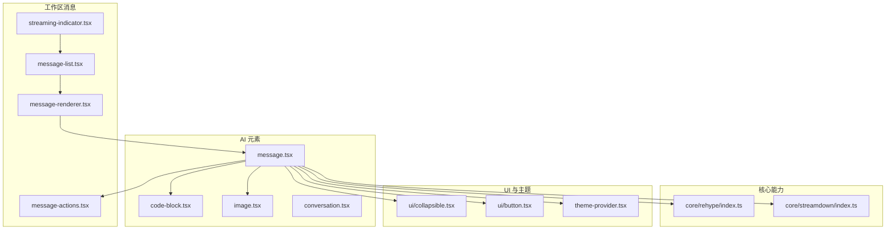
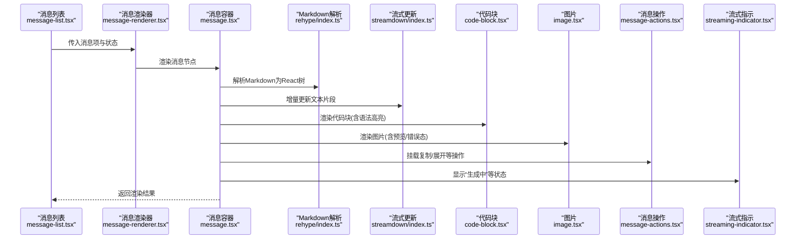
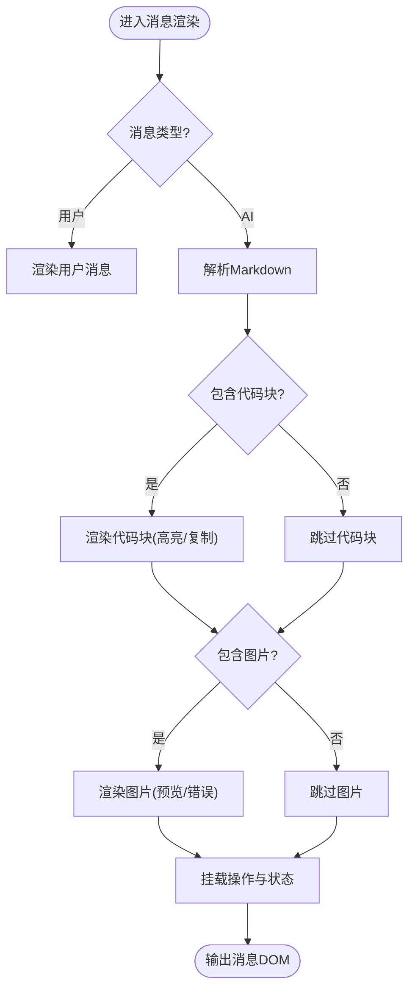
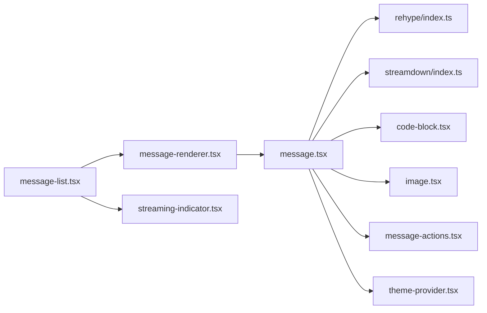

# 消息组件

<cite>
**本文引用的文件**   
- [frontend/src/components/ai-elements/message.tsx](file://frontend/src/components/ai-elements/message.tsx)
- [frontend/src/components/ai-elements/code-block.tsx](file://frontend/src/components/ai-elements/code-block.tsx)
- [frontend/src/components/ai-elements/image.tsx](file://frontend/src/components/ai-elements/image.tsx)
- [frontend/src/components/ai-elements/conversation.tsx](file://frontend/src/components/ai-elements/conversation.tsx)
- [frontend/src/components/workspace/messages/message-renderer.tsx](file://frontend/src/components/workspace/messages/message-renderer.tsx)
- [frontend/src/components/workspace/messages/message-list.tsx](file://frontend/src/components/workspace/messages/message-list.tsx)
- [frontend/src/components/workspace/messages/message-actions.tsx](file://frontend/src/components/workspace/messages/message-actions.tsx)
- [frontend/src/components/workspace/streaming-indicator.tsx](file://frontend/src/components/workspace/streaming-indicator.tsx)
- [frontend/src/core/rehype/index.ts](file://frontend/src/core/rehype/index.ts)
- [frontend/src/core/streamdown/index.ts](file://frontend/src/core/streamdown/index.ts)
- [frontend/src/components/ui/collapsible.tsx](file://frontend/src/components/ui/collapsible.tsx)
- [frontend/src/components/ui/button.tsx](file://frontend/src/components/ui/button.tsx)
- [frontend/src/components/theme-provider.tsx](file://frontend/src/components/theme-provider.tsx)
</cite>

## 目录
1. [简介](#简介)
2. [项目结构](#项目结构)
3. [核心组件](#核心组件)
4. [架构总览](#架构总览)
5. [详细组件分析](#详细组件分析)
6. [依赖关系分析](#依赖关系分析)
7. [性能考虑](#性能考虑)
8. [故障排查指南](#故障排查指南)
9. [结论](#结论)
10. [附录：使用示例与最佳实践](#附录使用示例与最佳实践)

## 简介
本文件聚焦 DeerFlow 前端的消息组件体系，系统性说明用户消息与 AI 响应消息的渲染机制、Markdown 解析与代码块高亮、图片预览展示、消息状态管理（加载、错误、流式传输）、交互能力（复制内容、展开折叠、链接跳转），以及样式定制与主题适配方法。文档同时提供实际使用场景的代码路径与最佳实践建议，帮助开发者快速集成与扩展。

## 项目结构
消息相关的前端实现主要分布在以下位置：
- ai-elements：通用 AI 元素渲染（消息、代码块、图片、对话容器等）
- workspace/messages：工作区消息列表与渲染编排
- core/rehype：Markdown 到 React 元素的转换管线
- core/streamdown：流式 Markdown 增量渲染支持
- ui：基础 UI 组件（可折叠、按钮等）
- theme-provider：全局主题上下文

图表来源
- [frontend/src/components/ai-elements/message.tsx](file://frontend/src/components/ai-elements/message.tsx)
- [frontend/src/components/ai-elements/code-block.tsx](file://frontend/src/components/ai-elements/code-block.tsx)
- [frontend/src/components/ai-elements/image.tsx](file://frontend/src/components/ai-elements/image.tsx)
- [frontend/src/components/ai-elements/conversation.tsx](file://frontend/src/components/ai-elements/conversation.tsx)
- [frontend/src/components/workspace/messages/message-list.tsx](file://frontend/src/components/workspace/messages/message-list.tsx)
- [frontend/src/components/workspace/messages/message-renderer.tsx](file://frontend/src/components/workspace/messages/message-renderer.tsx)
- [frontend/src/components/workspace/messages/message-actions.tsx](file://frontend/src/components/workspace/messages/message-actions.tsx)
- [frontend/src/components/workspace/streaming-indicator.tsx](file://frontend/src/components/workspace/streaming-indicator.tsx)
- [frontend/src/core/rehype/index.ts](file://frontend/src/core/rehype/index.ts)
- [frontend/src/core/streamdown/index.ts](file://frontend/src/core/streamdown/index.ts)
- [frontend/src/components/ui/collapsible.tsx](file://frontend/src/components/ui/collapsible.tsx)
- [frontend/src/components/ui/button.tsx](file://frontend/src/components/ui/button.tsx)
- [frontend/src/components/theme-provider.tsx](file://frontend/src/components/theme-provider.tsx)

章节来源
- [frontend/src/components/ai-elements/message.tsx](file://frontend/src/components/ai-elements/message.tsx)
- [frontend/src/components/workspace/messages/message-list.tsx](file://frontend/src/components/workspace/messages/message-list.tsx)
- [frontend/src/components/workspace/messages/message-renderer.tsx](file://frontend/src/components/workspace/messages/message-renderer.tsx)
- [frontend/src/core/rehype/index.ts](file://frontend/src/core/rehype/index.ts)
- [frontend/src/core/streamdown/index.ts](file://frontend/src/core/streamdown/index.ts)

## 核心组件
- 消息容器 message.tsx：负责单条消息的布局、状态显示、内容渲染入口、交互工具栏挂载、主题与可访问性处理。
- 代码块 code-block.tsx：封装代码块渲染与语法高亮、语言标签、复制按钮等。
- 图片 image.tsx：统一图片渲染、占位与错误态、预览放大能力。
- 对话 conversation.tsx：消息列表容器，负责滚动、对齐、分隔与整体布局。
- 工作区消息渲染 message-renderer.tsx：根据消息类型与状态选择具体渲染器，串联 Markdown 与流式更新。
- 工作区消息列表 message-list.tsx：维护消息集合、排序、去重、加载与错误态聚合。
- 消息操作 message-actions.tsx：复制、分享、反馈等动作入口。
- 流式指示 streaming-indicator.tsx：在消息底部或头部提示“正在生成”等状态。
- rehype 与 streamdown：Markdown 解析与增量渲染的核心能力。
- collapsible 与 button：用于展开/折叠与通用交互按钮。
- theme-provider：提供主题变量与暗色模式切换。

章节来源
- [frontend/src/components/ai-elements/message.tsx](file://frontend/src/components/ai-elements/message.tsx)
- [frontend/src/components/ai-elements/code-block.tsx](file://frontend/src/components/ai-elements/code-block.tsx)
- [frontend/src/components/ai-elements/image.tsx](file://frontend/src/components/ai-elements/image.tsx)
- [frontend/src/components/ai-elements/conversation.tsx](file://frontend/src/components/ai-elements/conversation.tsx)
- [frontend/src/components/workspace/messages/message-renderer.tsx](file://frontend/src/components/workspace/messages/message-renderer.tsx)
- [frontend/src/components/workspace/messages/message-list.tsx](file://frontend/src/components/workspace/messages/message-list.tsx)
- [frontend/src/components/workspace/messages/message-actions.tsx](file://frontend/src/components/workspace/messages/message-actions.tsx)
- [frontend/src/components/workspace/streaming-indicator.tsx](file://frontend/src/components/workspace/streaming-indicator.tsx)
- [frontend/src/core/rehype/index.ts](file://frontend/src/core/rehype/index.ts)
- [frontend/src/core/streamdown/index.ts](file://frontend/src/core/streamdown/index.ts)
- [frontend/src/components/ui/collapsible.tsx](file://frontend/src/components/ui/collapsible.tsx)
- [frontend/src/components/ui/button.tsx](file://frontend/src/components/ui/button.tsx)
- [frontend/src/components/theme-provider.tsx](file://frontend/src/components/theme-provider.tsx)

## 架构总览
消息渲染从消息数据进入开始，经消息列表与渲染器分发，最终由 message.tsx 完成 Markdown 解析、代码块与图片渲染，并挂载交互工具栏与状态指示。

图表来源
- [frontend/src/components/workspace/messages/message-list.tsx](file://frontend/src/components/workspace/messages/message-list.tsx)
- [frontend/src/components/workspace/messages/message-renderer.tsx](file://frontend/src/components/workspace/messages/message-renderer.tsx)
- [frontend/src/components/ai-elements/message.tsx](file://frontend/src/components/ai-elements/message.tsx)
- [frontend/src/core/rehype/index.ts](file://frontend/src/core/rehype/index.ts)
- [frontend/src/core/streamdown/index.ts](file://frontend/src/core/streamdown/index.ts)
- [frontend/src/components/ai-elements/code-block.tsx](file://frontend/src/components/ai-elements/code-block.tsx)
- [frontend/src/components/ai-elements/image.tsx](file://frontend/src/components/ai-elements/image.tsx)
- [frontend/src/components/workspace/messages/message-actions.tsx](file://frontend/src/components/workspace/messages/message-actions.tsx)
- [frontend/src/components/workspace/streaming-indicator.tsx](file://frontend/src/components/workspace/streaming-indicator.tsx)

## 详细组件分析

### 消息容器 message.tsx
职责与特性
- 接收消息数据与状态，决定渲染分支（用户/AI、纯文本/富文本）。
- 调用 rehype 将 Markdown 转换为 React 元素树；结合 streamdown 进行增量更新。
- 内嵌代码块与图片渲染，支持外链打开、图片预览与错误回退。
- 挂载消息操作（复制、展开/折叠、反馈等）与流式指示。
- 应用主题变量，确保明暗模式一致体验。

关键流程
- 初始化：读取消息内容与状态，准备渲染上下文。
- 解析：Markdown -> React 树；对代码块与图片节点进行特殊处理。
- 流式：通过 streamdown 将新片段追加到当前文本节点，避免整树重建。
- 交互：点击复制、展开长段落、外链在新窗口打开。
- 状态：加载中显示骨架屏或进度点；错误态显示重试与错误信息。

图表来源
- [frontend/src/components/ai-elements/message.tsx](file://frontend/src/components/ai-elements/message.tsx)
- [frontend/src/core/rehype/index.ts](file://frontend/src/core/rehype/index.ts)
- [frontend/src/core/streamdown/index.ts](file://frontend/src/core/streamdown/index.ts)
- [frontend/src/components/ai-elements/code-block.tsx](file://frontend/src/components/ai-elements/code-block.tsx)
- [frontend/src/components/ai-elements/image.tsx](file://frontend/src/components/ai-elements/image.tsx)
- [frontend/src/components/workspace/messages/message-actions.tsx](file://frontend/src/components/workspace/messages/message-actions.tsx)

章节来源
- [frontend/src/components/ai-elements/message.tsx](file://frontend/src/components/ai-elements/message.tsx)
- [frontend/src/core/rehype/index.ts](file://frontend/src/core/rehype/index.ts)
- [frontend/src/core/streamdown/index.ts](file://frontend/src/core/streamdown/index.ts)
- [frontend/src/components/ai-elements/code-block.tsx](file://frontend/src/components/ai-elements/code-block.tsx)
- [frontend/src/components/ai-elements/image.tsx](file://frontend/src/components/ai-elements/image.tsx)
- [frontend/src/components/workspace/messages/message-actions.tsx](file://frontend/src/components/workspace/messages/message-actions.tsx)

### 代码块 code-block.tsx
功能要点
- 基于语言标识进行语法高亮。
- 提供一键复制、语言标签显示、可选的行号与缩放。
- 与消息容器协作，在流式模式下仅追加文本片段，不破坏已高亮区域。

章节来源
- [frontend/src/components/ai-elements/code-block.tsx](file://frontend/src/components/ai-elements/code-block.tsx)

### 图片 image.tsx
功能要点
- 统一图片渲染，支持懒加载、占位骨架、失败回退图。
- 点击预览大图，支持关闭与键盘导航。
- 安全校验外链地址，防止恶意资源。

章节来源
- [frontend/src/components/ai-elements/image.tsx](file://frontend/src/components/ai-elements/image.tsx)

### 对话容器 conversation.tsx
功能要点
- 消息列表容器，负责消息对齐（左/右）、间距、分隔线。
- 自动滚动到底部，保持最新可见。
- 承载空状态与错误兜底视图。

章节来源
- [frontend/src/components/ai-elements/conversation.tsx](file://frontend/src/components/ai-elements/conversation.tsx)

### 工作区消息渲染 message-renderer.tsx
功能要点
- 根据消息角色与状态选择渲染策略（用户/AI、草稿/完成/错误）。
- 组合 Markdown 解析与流式更新逻辑。
- 注入主题与国际化上下文。

章节来源
- [frontend/src/components/workspace/messages/message-renderer.tsx](file://frontend/src/components/workspace/messages/message-renderer.tsx)

### 工作区消息列表 message-list.tsx
功能要点
- 维护消息数组、插入/更新/删除策略。
- 合并重复消息、处理部分完成与重试。
- 与流式指示联动，控制顶部/底部提示。

章节来源
- [frontend/src/components/workspace/messages/message-list.tsx](file://frontend/src/components/workspace/messages/message-list.tsx)

### 消息操作 message-actions.tsx
功能要点
- 复制文本到剪贴板，带成功/失败反馈。
- 展开/折叠长内容，提升可读性。
- 外链在新窗口打开，保留来源追踪。

章节来源
- [frontend/src/components/workspace/messages/message-actions.tsx](file://frontend/src/components/workspace/messages/message-actions.tsx)

### 流式指示 streaming-indicator.tsx
功能要点
- 在消息生成期间显示动态指示（如三点跳动）。
- 与消息状态同步，完成后自动隐藏。
- 支持自定义文案与动画时长。

章节来源
- [frontend/src/components/workspace/streaming-indicator.tsx](file://frontend/src/components/workspace/streaming-indicator.tsx)

### Markdown 解析与流式更新 rehype/index.ts 与 streamdown/index.ts
- rehype：将 Markdown AST 转换为 React 元素树，支持自定义处理器（如代码块、图片、链接）。
- streamdown：在流式场景下对文本节点进行增量拼接，避免全量重渲染，保证流畅体验。

章节来源
- [frontend/src/core/rehype/index.ts](file://frontend/src/core/rehype/index.ts)
- [frontend/src/core/streamdown/index.ts](file://frontend/src/core/streamdown/index.ts)

### 交互与主题
- 可折叠 collapsible.tsx：用于长段落或思考过程的展开/折叠。
- 按钮 button.tsx：统一的交互按钮样式与无障碍属性。
- 主题 theme-provider.tsx：提供 CSS 变量与暗色模式，消息组件通过主题类名或变量适配外观。

章节来源
- [frontend/src/components/ui/collapsible.tsx](file://frontend/src/components/ui/collapsible.tsx)
- [frontend/src/components/ui/button.tsx](file://frontend/src/components/ui/button.tsx)
- [frontend/src/components/theme-provider.tsx](file://frontend/src/components/theme-provider.tsx)

## 依赖关系分析
消息组件之间的耦合与协作如下：
- message-list.tsx 依赖 message-renderer.tsx 以渲染每条消息。
- message-renderer.tsx 依赖 message.tsx 完成具体渲染。
- message.tsx 依赖 rehype 与 streamdown 进行内容解析与增量更新。
- message.tsx 内部组合 code-block.tsx 与 image.tsx 渲染富媒体。
- message.tsx 挂载 message-actions.tsx 提供交互。
- message-list.tsx 与 streaming-indicator.tsx 协同表达整体状态。
- 所有组件通过 theme-provider.tsx 获取主题变量。

图表来源
- [frontend/src/components/workspace/messages/message-list.tsx](file://frontend/src/components/workspace/messages/message-list.tsx)
- [frontend/src/components/workspace/messages/message-renderer.tsx](file://frontend/src/components/workspace/messages/message-renderer.tsx)
- [frontend/src/components/ai-elements/message.tsx](file://frontend/src/components/ai-elements/message.tsx)
- [frontend/src/core/rehype/index.ts](file://frontend/src/core/rehype/index.ts)
- [frontend/src/core/streamdown/index.ts](file://frontend/src/core/streamdown/index.ts)
- [frontend/src/components/ai-elements/code-block.tsx](file://frontend/src/components/ai-elements/code-block.tsx)
- [frontend/src/components/ai-elements/image.tsx](file://frontend/src/components/ai-elements/image.tsx)
- [frontend/src/components/workspace/messages/message-actions.tsx](file://frontend/src/components/workspace/messages/message-actions.tsx)
- [frontend/src/components/workspace/streaming-indicator.tsx](file://frontend/src/components/workspace/streaming-indicator.tsx)
- [frontend/src/components/theme-provider.tsx](file://frontend/src/components/theme-provider.tsx)

章节来源
- [frontend/src/components/workspace/messages/message-list.tsx](file://frontend/src/components/workspace/messages/message-list.tsx)
- [frontend/src/components/workspace/messages/message-renderer.tsx](file://frontend/src/components/workspace/messages/message-renderer.tsx)
- [frontend/src/components/ai-elements/message.tsx](file://frontend/src/components/ai-elements/message.tsx)
- [frontend/src/core/rehype/index.ts](file://frontend/src/core/rehype/index.ts)
- [frontend/src/core/streamdown/index.ts](file://frontend/src/core/streamdown/index.ts)
- [frontend/src/components/ai-elements/code-block.tsx](file://frontend/src/components/ai-elements/code-block.tsx)
- [frontend/src/components/ai-elements/image.tsx](file://frontend/src/components/ai-elements/image.tsx)
- [frontend/src/components/workspace/messages/message-actions.tsx](file://frontend/src/components/workspace/messages/message-actions.tsx)
- [frontend/src/components/workspace/streaming-indicator.tsx](file://frontend/src/components/workspace/streaming-indicator.tsx)
- [frontend/src/components/theme-provider.tsx](file://frontend/src/components/theme-provider.tsx)

## 性能考虑
- 流式增量更新：优先使用 streamdown 对文本节点进行增量拼接，避免整树重建，降低重排与重绘成本。
- 代码块高亮：仅在完整代码块到达时触发高亮，流式过程中避免频繁重建高亮树。
- 图片懒加载：默认启用懒加载与占位骨架，减少首屏压力；大图预览按需加载。
- 列表虚拟化：当消息数量较大时，考虑虚拟滚动以减少 DOM 节点数量。
- 防抖与节流：复制、搜索、过滤等操作应做防抖/节流，避免高频事件导致卡顿。
- 主题切换：通过 CSS 变量切换主题，避免大量 class 替换导致的抖动。

[本节为通用性能建议，无需源码引用]

## 故障排查指南
常见问题与定位思路
- Markdown 未正确渲染：检查 rehype 处理器是否注册，确认输入字符串是否为合法 Markdown。
- 代码块无高亮：确认语言标识是否正确传递，高亮库是否加载成功。
- 图片无法显示：检查外链地址是否允许跨域，图片 URL 是否有效，错误态是否回退。
- 流式更新闪烁：确认 streamdown 是否在正确位置追加文本，避免整段替换。
- 复制失败：检查浏览器剪贴板权限与 HTTPS 环境要求。
- 主题不一致：确认组件是否使用了主题变量而非硬编码颜色。

章节来源
- [frontend/src/components/ai-elements/message.tsx](file://frontend/src/components/ai-elements/message.tsx)
- [frontend/src/components/ai-elements/code-block.tsx](file://frontend/src/components/ai-elements/code-block.tsx)
- [frontend/src/components/ai-elements/image.tsx](file://frontend/src/components/ai-elements/image.tsx)
- [frontend/src/core/rehype/index.ts](file://frontend/src/core/rehype/index.ts)
- [frontend/src/core/streamdown/index.ts](file://frontend/src/core/streamdown/index.ts)
- [frontend/src/components/workspace/messages/message-actions.tsx](file://frontend/src/components/workspace/messages/message-actions.tsx)

## 结论
DeerFlow 的消息组件体系围绕 message.tsx 构建，结合 rehype 与 streamdown 实现高质量的 Markdown 渲染与流式体验，并通过 code-block.tsx 与 image.tsx 完善富媒体展示。配合 message-list.tsx 与 message-renderer.tsx 的编排，以及 message-actions.tsx 与 streaming-indicator.tsx 的状态与交互增强，形成一套可扩展、可定制、易维护的消息渲染方案。遵循本文档的最佳实践，可在不同主题与业务场景下稳定复用。

[本节为总结性内容，无需源码引用]

## 附录：使用示例与最佳实践
- 基本用法
  - 在工作区消息列表中引入 message-list.tsx，并向其传入消息数组与回调。
  - 使用 message-renderer.tsx 包裹单条消息，传入消息对象与状态。
  - 参考路径：
    - [message-list.tsx](file://frontend/src/components/workspace/messages/message-list.tsx)
    - [message-renderer.tsx](file://frontend/src/components/workspace/messages/message-renderer.tsx)

- 自定义 Markdown 处理器
  - 在 rehype/index.ts 中添加自定义处理器，例如为特定标签添加样式或行为。
  - 参考路径：
    - [rehype/index.ts](file://frontend/src/core/rehype/index.ts)

- 流式更新接入
  - 在消息生成阶段，使用 streamdown/index.ts 提供的接口增量更新文本节点。
  - 参考路径：
    - [streamdown/index.ts](file://frontend/src/core/streamdown/index.ts)

- 代码块高亮配置
  - 在 code-block.tsx 中配置语言映射与高亮主题，确保与全局主题一致。
  - 参考路径：
    - [code-block.tsx](file://frontend/src/components/ai-elements/code-block.tsx)

- 图片预览与安全
  - 在 image.tsx 中实现预览弹窗与外链白名单校验，避免安全风险。
  - 参考路径：
    - [image.tsx](file://frontend/src/components/ai-elements/image.tsx)

- 交互增强
  - 使用 message-actions.tsx 提供复制、展开/折叠、外链打开等功能。
  - 参考路径：
    - [message-actions.tsx](file://frontend/src/components/workspace/messages/message-actions.tsx)

- 主题适配
  - 通过 theme-provider.tsx 暴露的主题变量，统一调整消息背景、文字、边框与阴影。
  - 参考路径：
    - [theme-provider.tsx](file://frontend/src/components/theme-provider.tsx)

[本节为使用指引，无需源码引用]