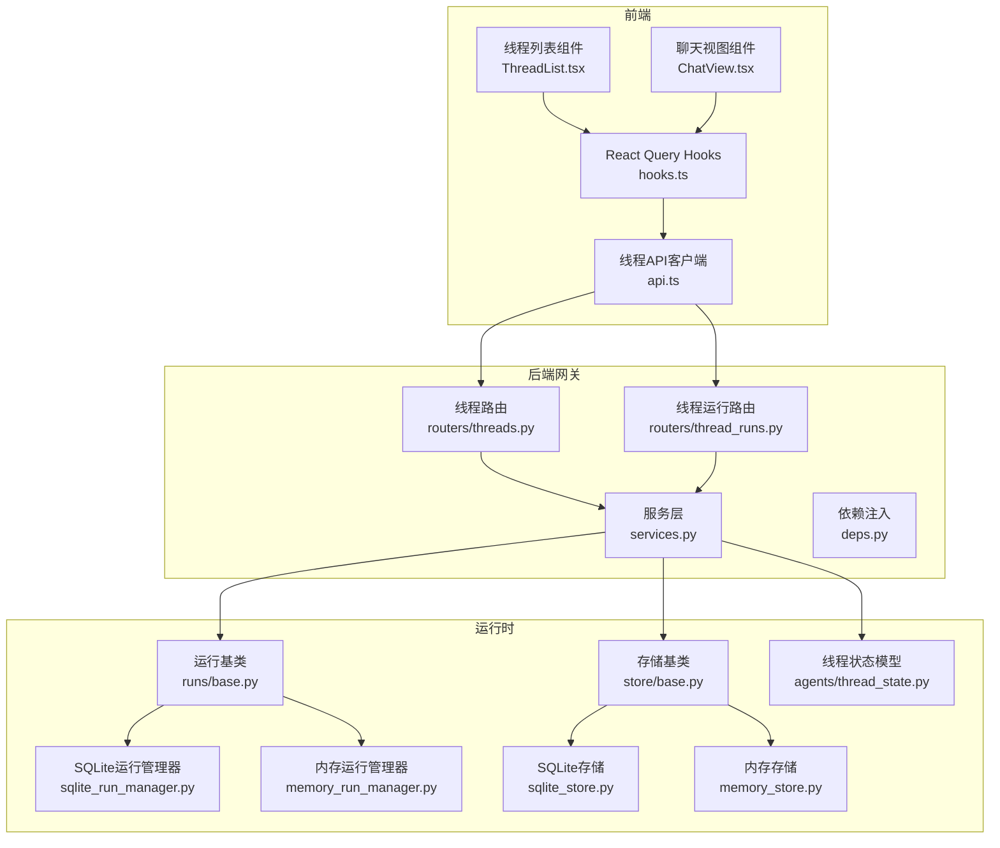
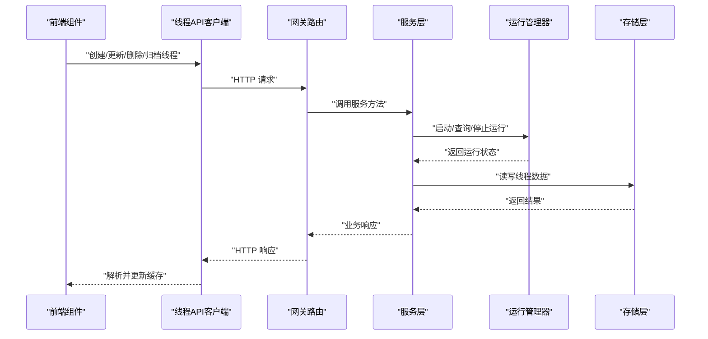
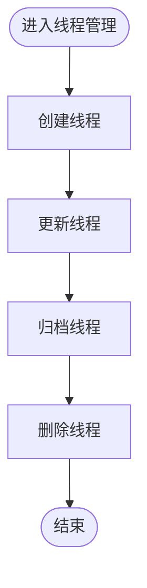
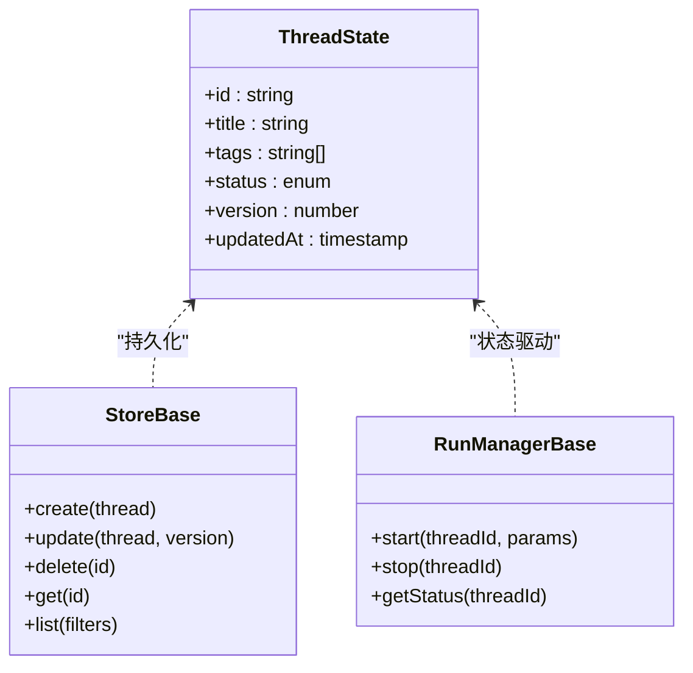
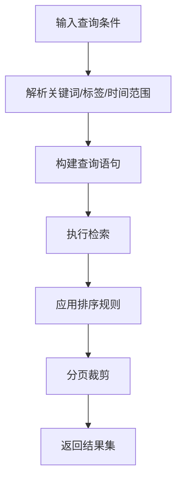
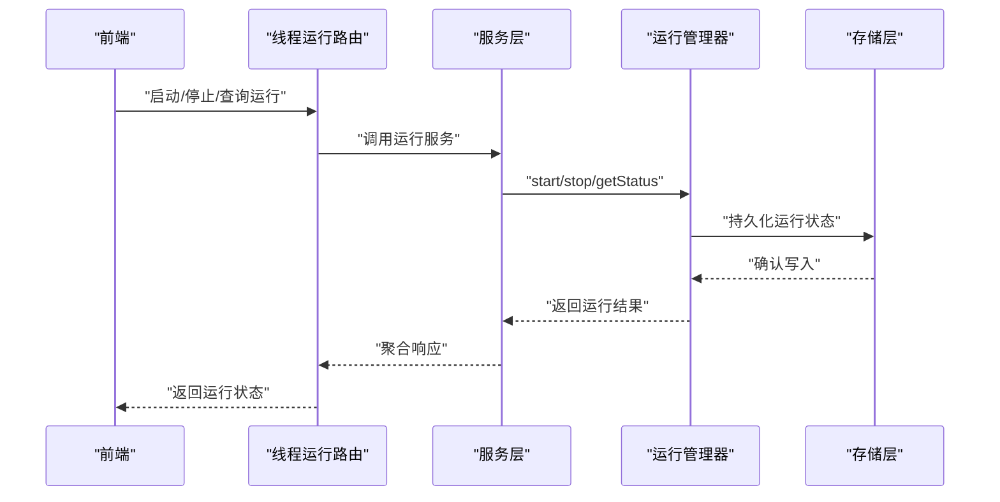
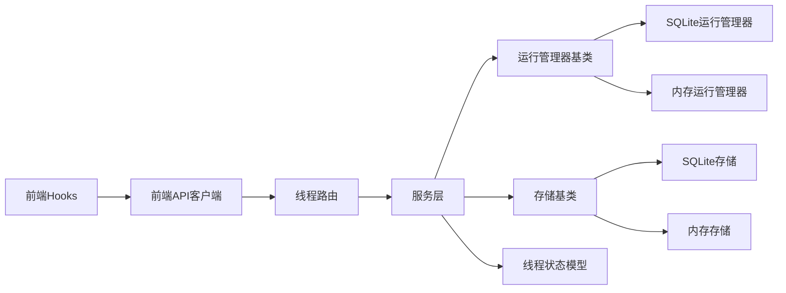

# 线程管理

<cite>
**本文引用的文件**   
- [backend/app/gateway/routers/threads.py](file://backend/app/gateway/routers/threads.py)
- [backend/app/gateway/routers/thread_runs.py](file://backend/app/gateway/routers/thread_runs.py)
- [backend/app/gateway/services.py](file://backend/app/gateway/services.py)
- [backend/app/gateway/deps.py](file://backend/app/gateway/deps.py)
- [backend/packages/harness/deerflow/runtime/store/base.py](file://backend/packages/harness/deerflow/runtime/store/base.py)
- [backend/packages/harness/deerflow/runtime/store/sqlite_store.py](file://backend/packages/harness/deerflow/runtime/store/sqlite_store.py)
- [backend/packages/harness/deerflow/runtime/store/memory_store.py](file://backend/packages/harness/deerflow/runtime/store/memory_store.py)
- [backend/packages/harness/deerflow/runtime/runs/base.py](file://backend/packages/harness/deerflow/runtime/runs/base.py)
- [backend/packages/harness/deerflow/runtime/runs/sqlite_run_manager.py](file://backend/packages/harness/deerflow/runtime/runs/sqlite_run_manager.py)
- [backend/packages/harness/deerflow/runtime/runs/memory_run_manager.py](file://backend/packages/harness/deerflow/runtime/runs/memory_run_manager.py)
- [backend/packages/harness/deerflow/agents/thread_state.py](file://backend/packages/harness/deerflow/agents/thread_state.py)
- [frontend/src/core/threads/api.ts](file://frontend/src/core/threads/api.ts)
- [frontend/src/core/threads/hooks.ts](file://frontend/src/core/threads/hooks.ts)
- [frontend/src/core/threads/types.ts](file://frontend/src/core/threads/types.ts)
- [frontend/src/components/workspace/chats/ThreadList.tsx](file://frontend/src/components/workspace/chats/ThreadList.tsx)
- [frontend/src/components/workspace/chats/ChatView.tsx](file://frontend/src/components/workspace/chats/ChatView.tsx)
</cite>

## 目录
1. [简介](#简介)
2. [项目结构](#项目结构)
3. [核心组件](#核心组件)
4. [架构总览](#架构总览)
5. [详细组件分析](#详细组件分析)
6. [依赖关系分析](#依赖关系分析)
7. [性能考虑](#性能考虑)
8. [故障排查指南](#故障排查指南)
9. [结论](#结论)
10. [附录](#附录)

## 简介
本文件面向 DeerFlow 的“线程管理”能力，系统性阐述线程生命周期（创建、更新、删除、归档）、状态同步机制（本地缓存、服务端同步、冲突解决）、搜索与过滤（关键词、标签、时间排序），以及数据导出导入。文档同时提供后端 API 调用示例与最佳实践，帮助开发者在前端或客户端高效集成线程管理能力。

## 项目结构
线程管理涉及前后端协作：
- 后端网关层暴露 RESTful 接口，负责路由到服务层与运行时存储/运行管理器。
- 运行时层提供线程持久化（SQLite/内存）与运行实例管理（SQLite/内存）。
- 前端通过统一的线程 API 客户端与 React Query hooks 进行数据获取与状态同步。

图表来源
- [backend/app/gateway/routers/threads.py](file://backend/app/gateway/routers/threads.py)
- [backend/app/gateway/routers/thread_runs.py](file://backend/app/gateway/routers/thread_runs.py)
- [backend/app/gateway/services.py](file://backend/app/gateway/services.py)
- [backend/app/gateway/deps.py](file://backend/app/gateway/deps.py)
- [backend/packages/harness/deerflow/runtime/runs/base.py](file://backend/packages/harness/deerflow/runtime/runs/base.py)
- [backend/packages/harness/deerflow/runtime/runs/sqlite_run_manager.py](file://backend/packages/harness/deerflow/runtime/runs/sqlite_run_manager.py)
- [backend/packages/harness/deerflow/runtime/runs/memory_run_manager.py](file://backend/packages/harness/deerflow/runtime/runs/memory_run_manager.py)
- [backend/packages/harness/deerflow/runtime/store/base.py](file://backend/packages/harness/deerflow/runtime/store/base.py)
- [backend/packages/harness/deerflow/runtime/store/sqlite_store.py](file://backend/packages/harness/deerflow/runtime/store/sqlite_store.py)
- [backend/packages/harness/deerflow/runtime/store/memory_store.py](file://backend/packages/harness/deerflow/runtime/store/memory_store.py)
- [backend/packages/harness/deerflow/agents/thread_state.py](file://backend/packages/harness/deerflow/agents/thread_state.py)
- [frontend/src/core/threads/api.ts](file://frontend/src/core/threads/api.ts)
- [frontend/src/core/threads/hooks.ts](file://frontend/src/core/threads/hooks.ts)
- [frontend/src/components/workspace/chats/ThreadList.tsx](file://frontend/src/components/workspace/chats/ThreadList.tsx)
- [frontend/src/components/workspace/chats/ChatView.tsx](file://frontend/src/components/workspace/chats/ChatView.tsx)

章节来源
- [backend/app/gateway/routers/threads.py](file://backend/app/gateway/routers/threads.py)
- [backend/app/gateway/routers/thread_runs.py](file://backend/app/gateway/routers/thread_runs.py)
- [backend/app/gateway/services.py](file://backend/app/gateway/services.py)
- [backend/app/gateway/deps.py](file://backend/app/gateway/deps.py)
- [backend/packages/harness/deerflow/runtime/store/base.py](file://backend/packages/harness/deerflow/runtime/store/base.py)
- [backend/packages/harness/deerflow/runtime/store/sqlite_store.py](file://backend/packages/harness/deerflow/runtime/store/sqlite_store.py)
- [backend/packages/harness/deerflow/runtime/store/memory_store.py](file://backend/packages/harness/deerflow/runtime/store/memory_store.py)
- [backend/packages/harness/deerflow/runtime/runs/base.py](file://backend/packages/harness/deerflow/runtime/runs/base.py)
- [backend/packages/harness/deerflow/runtime/runs/sqlite_run_manager.py](file://backend/packages/harness/deerflow/runtime/runs/sqlite_run_manager.py)
- [backend/packages/harness/deerflow/runtime/runs/memory_run_manager.py](file://backend/packages/harness/deerflow/runtime/runs/memory_run_manager.py)
- [backend/packages/harness/deerflow/agents/thread_state.py](file://backend/packages/harness/deerflow/agents/thread_state.py)
- [frontend/src/core/threads/api.ts](file://frontend/src/core/threads/api.ts)
- [frontend/src/core/threads/hooks.ts](file://frontend/src/core/threads/hooks.ts)
- [frontend/src/components/workspace/chats/ThreadList.tsx](file://frontend/src/components/workspace/chats/ThreadList.tsx)
- [frontend/src/components/workspace/chats/ChatView.tsx](file://frontend/src/components/workspace/chats/ChatView.tsx)

## 核心组件
- 线程路由层：定义线程 CRUD、归档、搜索、分页等 HTTP 接口，并转发至服务层。
- 线程运行路由层：管理与线程相关的运行实例（run）生命周期与查询。
- 服务层：编排业务逻辑，协调运行管理器与存储层，处理并发与一致性。
- 运行时存储：抽象线程数据的持久化接口，提供 SQLite 与内存两种实现。
- 运行管理器：抽象线程运行的执行与状态管理，提供 SQLite 与内存两种实现。
- 线程状态模型：定义线程状态字段与转换规则，用于状态机驱动。
- 前端线程 API：封装对后端的请求，统一错误处理与重试策略。
- 前端 Hooks：基于 React Query 的线程数据获取、缓存与失效策略。
- 前端组件：线程列表与聊天视图，展示线程元信息、消息流与交互操作。

章节来源
- [backend/app/gateway/routers/threads.py](file://backend/app/gateway/routers/threads.py)
- [backend/app/gateway/routers/thread_runs.py](file://backend/app/gateway/routers/thread_runs.py)
- [backend/app/gateway/services.py](file://backend/app/gateway/services.py)
- [backend/packages/harness/deerflow/runtime/store/base.py](file://backend/packages/harness/deerflow/runtime/store/base.py)
- [backend/packages/harness/deerflow/runtime/runs/base.py](file://backend/packages/harness/deerflow/runtime/runs/base.py)
- [backend/packages/harness/deerflow/agents/thread_state.py](file://backend/packages/harness/deerflow/agents/thread_state.py)
- [frontend/src/core/threads/api.ts](file://frontend/src/core/threads/api.ts)
- [frontend/src/core/threads/hooks.ts](file://frontend/src/core/threads/hooks.ts)
- [frontend/src/components/workspace/chats/ThreadList.tsx](file://frontend/src/components/workspace/chats/ThreadList.tsx)
- [frontend/src/components/workspace/chats/ChatView.tsx](file://frontend/src/components/workspace/chats/ChatView.tsx)

## 架构总览
下图展示了从前端发起线程管理请求到后端持久化的完整链路，包括运行实例与存储层的交互。

图表来源
- [backend/app/gateway/routers/threads.py](file://backend/app/gateway/routers/threads.py)
- [backend/app/gateway/services.py](file://backend/app/gateway/services.py)
- [backend/packages/harness/deerflow/runtime/runs/base.py](file://backend/packages/harness/deerflow/runtime/runs/base.py)
- [backend/packages/harness/deerflow/runtime/store/base.py](file://backend/packages/harness/deerflow/runtime/store/base.py)
- [frontend/src/core/threads/api.ts](file://frontend/src/core/threads/api.ts)
- [frontend/src/components/workspace/chats/ThreadList.tsx](file://frontend/src/components/workspace/chats/ThreadList.tsx)

## 详细组件分析

### 线程生命周期管理
- 创建线程
  - 前端通过 API 客户端发送创建请求，网关路由接收参数并校验，服务层初始化线程状态并写入存储，必要时启动默认运行。
  - 关键路径：[创建线程路由](file://backend/app/gateway/routers/threads.py)、[服务层创建流程](file://backend/app/gateway/services.py)、[存储写入](file://backend/packages/harness/deerflow/runtime/store/base.py)。
- 更新线程
  - 支持更新标题、标签、描述等元数据；服务层合并变更并落盘，触发前端缓存失效与增量更新。
  - 关键路径：[更新线程路由](file://backend/app/gateway/routers/threads.py)、[服务层更新流程](file://backend/app/gateway/services.py)。
- 删除线程
  - 软删除或硬删除策略由配置决定；服务层在删除前检查关联运行与附件，确保一致性。
  - 关键路径：[删除线程路由](file://backend/app/gateway/routers/threads.py)、[服务层删除流程](file://backend/app/gateway/services.py)。
- 归档线程
  - 归档为只读状态，保留历史数据但禁止编辑；服务层切换状态并记录审计信息。
  - 关键路径：[归档线程路由](file://backend/app/gateway/routers/threads.py)、[服务层归档流程](file://backend/app/gateway/services.py)。

章节来源
- [backend/app/gateway/routers/threads.py](file://backend/app/gateway/routers/threads.py)
- [backend/app/gateway/services.py](file://backend/app/gateway/services.py)
- [backend/packages/harness/deerflow/runtime/store/base.py](file://backend/packages/harness/deerflow/runtime/store/base.py)

### 线程状态同步机制
- 本地状态缓存
  - 前端使用 React Query 缓存线程列表与详情，设置合理的过期时间与失效策略，避免重复请求。
  - 关键路径：[线程Hooks](file://frontend/src/core/threads/hooks.ts)、[线程类型定义](file://frontend/src/core/threads/types.ts)。
- 服务器数据同步
  - 服务端采用幂等接口与版本控制，保证多次提交的一致性；存储层提供事务性写入。
  - 关键路径：[服务层同步逻辑](file://backend/app/gateway/services.py)、[存储层接口](file://backend/packages/harness/deerflow/runtime/store/base.py)。
- 冲突解决策略
  - 当检测到并发修改时，优先采用“最后写入胜出”或“合并策略”，并在响应中携带冲突标记供前端提示用户。
  - 关键路径：[服务层冲突处理](file://backend/app/gateway/services.py)、[线程状态模型](file://backend/packages/harness/deerflow/agents/thread_state.py)。

图表来源
- [backend/packages/harness/deerflow/agents/thread_state.py](file://backend/packages/harness/deerflow/agents/thread_state.py)
- [backend/packages/harness/deerflow/runtime/store/base.py](file://backend/packages/harness/deerflow/runtime/store/base.py)
- [backend/packages/harness/deerflow/runtime/runs/base.py](file://backend/packages/harness/deerflow/runtime/runs/base.py)

章节来源
- [frontend/src/core/threads/hooks.ts](file://frontend/src/core/threads/hooks.ts)
- [frontend/src/core/threads/types.ts](file://frontend/src/core/threads/types.ts)
- [backend/app/gateway/services.py](file://backend/app/gateway/services.py)
- [backend/packages/harness/deerflow/runtime/store/base.py](file://backend/packages/harness/deerflow/runtime/store/base.py)
- [backend/packages/harness/deerflow/agents/thread_state.py](file://backend/packages/harness/deerflow/agents/thread_state.py)

### 线程搜索与过滤
- 关键词搜索
  - 支持按标题、标签、内容片段进行模糊匹配；后端索引优化以提升检索性能。
  - 关键路径：[线程路由搜索参数](file://backend/app/gateway/routers/threads.py)、[服务层过滤逻辑](file://backend/app/gateway/services.py)。
- 标签筛选
  - 支持多标签组合筛选，提供“包含/排除”语义。
  - 关键路径：[服务层过滤逻辑](file://backend/app/gateway/services.py)。
- 时间排序
  - 支持按更新时间、创建时间升序/降序排列，结合分页减少首屏负载。
  - 关键路径：[线程路由排序参数](file://backend/app/gateway/routers/threads.py)、[服务层排序逻辑](file://backend/app/gateway/services.py)。

章节来源
- [backend/app/gateway/routers/threads.py](file://backend/app/gateway/routers/threads.py)
- [backend/app/gateway/services.py](file://backend/app/gateway/services.py)

### 线程数据导出与导入
- 导出
  - 支持将线程元数据与消息历史打包为结构化格式（如 JSON），便于备份与分析。
  - 关键路径：[导出接口](file://backend/app/gateway/routers/threads.py)、[服务层序列化](file://backend/app/gateway/services.py)。
- 导入
  - 支持从结构化文件恢复线程数据，提供冲突检测与覆盖策略选择。
  - 关键路径：[导入接口](file://backend/app/gateway/routers/threads.py)、[服务层反序列化与校验](file://backend/app/gateway/services.py)。

章节来源
- [backend/app/gateway/routers/threads.py](file://backend/app/gateway/routers/threads.py)
- [backend/app/gateway/services.py](file://backend/app/gateway/services.py)

### 线程运行管理
- 运行生命周期
  - 启动运行：根据线程上下文与参数创建运行实例，分配资源并监控状态。
  - 停止运行：优雅终止运行，清理临时资源并记录退出码。
  - 查询状态：实时获取运行进度、日志与输出摘要。
- 运行与线程解耦
  - 运行管理器独立于线程存储，通过线程 ID 关联，支持多运行并行与历史回溯。
- 关键路径
  - [运行基类](file://backend/packages/harness/deerflow/runtime/runs/base.py)
  - [SQLite 运行管理器](file://backend/packages/harness/deerflow/runtime/runs/sqlite_run_manager.py)
  - [内存运行管理器](file://backend/packages/harness/deerflow/runtime/runs/memory_run_manager.py)
  - [线程运行路由](file://backend/app/gateway/routers/thread_runs.py)

图表来源
- [backend/app/gateway/routers/thread_runs.py](file://backend/app/gateway/routers/thread_runs.py)
- [backend/app/gateway/services.py](file://backend/app/gateway/services.py)
- [backend/packages/harness/deerflow/runtime/runs/base.py](file://backend/packages/harness/deerflow/runtime/runs/base.py)
- [backend/packages/harness/deerflow/runtime/runs/sqlite_run_manager.py](file://backend/packages/harness/deerflow/runtime/runs/sqlite_run_manager.py)
- [backend/packages/harness/deerflow/runtime/runs/memory_run_manager.py](file://backend/packages/harness/deerflow/runtime/runs/memory_run_manager.py)

章节来源
- [backend/app/gateway/routers/thread_runs.py](file://backend/app/gateway/routers/thread_runs.py)
- [backend/app/gateway/services.py](file://backend/app/gateway/services.py)
- [backend/packages/harness/deerflow/runtime/runs/base.py](file://backend/packages/harness/deerflow/runtime/runs/base.py)
- [backend/packages/harness/deerflow/runtime/runs/sqlite_run_manager.py](file://backend/packages/harness/deerflow/runtime/runs/sqlite_run_manager.py)
- [backend/packages/harness/deerflow/runtime/runs/memory_run_manager.py](file://backend/packages/harness/deerflow/runtime/runs/memory_run_manager.py)

### 前端线程管理集成
- API 客户端
  - 封装基础 URL、超时、重试与错误码映射，提供线程 CRUD 与运行管理的便捷方法。
  - 关键路径：[线程 API 客户端](file://frontend/src/core/threads/api.ts)。
- React Query Hooks
  - 提供 useThreads、useThread、useCreateThread 等 Hook，自动处理缓存、失效与乐观更新。
  - 关键路径：[线程 Hooks](file://frontend/src/core/threads/hooks.ts)、[线程类型定义](file://frontend/src/core/threads/types.ts)。
- 组件集成
  - 线程列表组件展示搜索结果、标签筛选与排序；聊天视图组件渲染消息流与运行状态。
  - 关键路径：[线程列表组件](file://frontend/src/components/workspace/chats/ThreadList.tsx)、[聊天视图组件](file://frontend/src/components/workspace/chats/ChatView.tsx)。

章节来源
- [frontend/src/core/threads/api.ts](file://frontend/src/core/threads/api.ts)
- [frontend/src/core/threads/hooks.ts](file://frontend/src/core/threads/hooks.ts)
- [frontend/src/core/threads/types.ts](file://frontend/src/core/threads/types.ts)
- [frontend/src/components/workspace/chats/ThreadList.tsx](file://frontend/src/components/workspace/chats/ThreadList.tsx)
- [frontend/src/components/workspace/chats/ChatView.tsx](file://frontend/src/components/workspace/chats/ChatView.tsx)

## 依赖关系分析
- 组件耦合与内聚
  - 路由层仅负责参数校验与转发，服务层集中业务逻辑，运行时层专注持久化与执行，职责清晰、内聚度高。
- 直接/间接依赖
  - 前端依赖 API 客户端与 Hooks；网关依赖服务层；服务层依赖运行管理器与存储层；运行管理器与存储层可插拔替换。
- 外部依赖与集成点
  - 存储层可选择 SQLite 或内存实现；运行管理器同样支持多种后端；网关通过依赖注入装配具体实现。
- 接口契约与实现细节
  - 存储与运行管理器均提供抽象基类，确保上层稳定；线程状态模型定义字段与转换规则，保障一致性。

图表来源
- [frontend/src/core/threads/api.ts](file://frontend/src/core/threads/api.ts)
- [frontend/src/core/threads/hooks.ts](file://frontend/src/core/threads/hooks.ts)
- [backend/app/gateway/routers/threads.py](file://backend/app/gateway/routers/threads.py)
- [backend/app/gateway/services.py](file://backend/app/gateway/services.py)
- [backend/packages/harness/deerflow/runtime/runs/base.py](file://backend/packages/harness/deerflow/runtime/runs/base.py)
- [backend/packages/harness/deerflow/runtime/runs/sqlite_run_manager.py](file://backend/packages/harness/deerflow/runtime/runs/sqlite_run_manager.py)
- [backend/packages/harness/deerflow/runtime/runs/memory_run_manager.py](file://backend/packages/harness/deerflow/runtime/runs/memory_run_manager.py)
- [backend/packages/harness/deerflow/runtime/store/base.py](file://backend/packages/harness/deerflow/runtime/store/base.py)
- [backend/packages/harness/deerflow/runtime/store/sqlite_store.py](file://backend/packages/harness/deerflow/runtime/store/sqlite_store.py)
- [backend/packages/harness/deerflow/runtime/store/memory_store.py](file://backend/packages/harness/deerflow/runtime/store/memory_store.py)
- [backend/packages/harness/deerflow/agents/thread_state.py](file://backend/packages/harness/deerflow/agents/thread_state.py)

章节来源
- [backend/app/gateway/routers/threads.py](file://backend/app/gateway/routers/threads.py)
- [backend/app/gateway/services.py](file://backend/app/gateway/services.py)
- [backend/packages/harness/deerflow/runtime/runs/base.py](file://backend/packages/harness/deerflow/runtime/runs/base.py)
- [backend/packages/harness/deerflow/runtime/store/base.py](file://backend/packages/harness/deerflow/runtime/store/base.py)
- [backend/packages/harness/deerflow/agents/thread_state.py](file://backend/packages/harness/deerflow/agents/thread_state.py)
- [frontend/src/core/threads/api.ts](file://frontend/src/core/threads/api.ts)
- [frontend/src/core/threads/hooks.ts](file://frontend/src/core/threads/hooks.ts)

## 性能考虑
- 分页与懒加载
  - 列表接口默认分页，前端按需加载更多条目，降低首屏压力。
- 缓存与失效
  - 合理设置缓存时间与失效策略，避免频繁刷新；在用户操作后主动失效相关缓存。
- 索引与查询优化
  - 对常用搜索字段建立索引，避免全表扫描；复杂查询拆分为子查询。
- 并发与锁
  - 在高并发场景下，使用行级锁或乐观锁避免写冲突；必要时引入队列串行化写操作。
- 资源隔离
  - 运行实例与线程数据分离，避免长任务阻塞主线程；支持异步执行与状态轮询。

## 故障排查指南
- 常见问题
  - 线程未创建成功：检查路由参数与服务层校验逻辑，查看存储层写入是否成功。
  - 状态不同步：确认前端缓存失效策略与服务端版本控制是否生效。
  - 搜索无结果：验证关键词与标签匹配规则，检查索引是否重建。
  - 运行失败：查看运行管理器日志与退出码，定位资源不足或依赖缺失。
- 调试建议
  - 启用详细日志，记录请求参数、响应体与异常堆栈。
  - 使用测试用例模拟并发场景，验证冲突解决策略。
  - 对存储层进行健康检查，确保连接池与磁盘空间正常。

章节来源
- [backend/app/gateway/services.py](file://backend/app/gateway/services.py)
- [backend/packages/harness/deerflow/runtime/runs/base.py](file://backend/packages/harness/deerflow/runtime/runs/base.py)
- [backend/packages/harness/deerflow/runtime/store/base.py](file://backend/packages/harness/deerflow/runtime/store/base.py)

## 结论
DeerFlow 的线程管理模块通过清晰的层次划分与可插拔的运行时实现，提供了完整的线程生命周期管理、状态同步、搜索过滤与导出导入能力。前端以 React Query 为核心，实现了高效的缓存与同步体验。建议在大规模部署中关注索引优化、并发控制与资源隔离，以获得更稳定的性能表现。

## 附录
- API 调用示例（概念性说明）
  - 创建线程：POST /api/threads，请求体包含标题、标签、初始消息等。
  - 更新线程：PUT /api/threads/{id}，请求体包含待更新的元数据。
  - 删除线程：DELETE /api/threads/{id}，可选参数决定是否软删除。
  - 归档线程：PATCH /api/threads/{id}/archive，切换为只读状态。
  - 搜索线程：GET /api/threads?keyword=&tags=&sort=updated_at&order=desc&page=1&size=20。
  - 导出线程：GET /api/threads/{id}/export?format=json。
  - 导入线程：POST /api/threads/import，上传结构化文件并指定冲突策略。
- 最佳实践
  - 使用幂等键避免重复提交。
  - 在用户操作后主动失效相关缓存，保持界面一致。
  - 对敏感字段进行脱敏与权限校验。
  - 定期备份线程数据，制定灾难恢复计划。