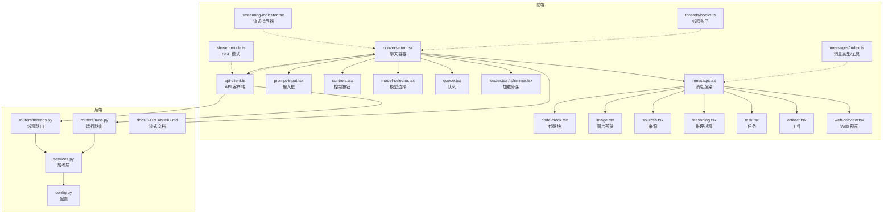
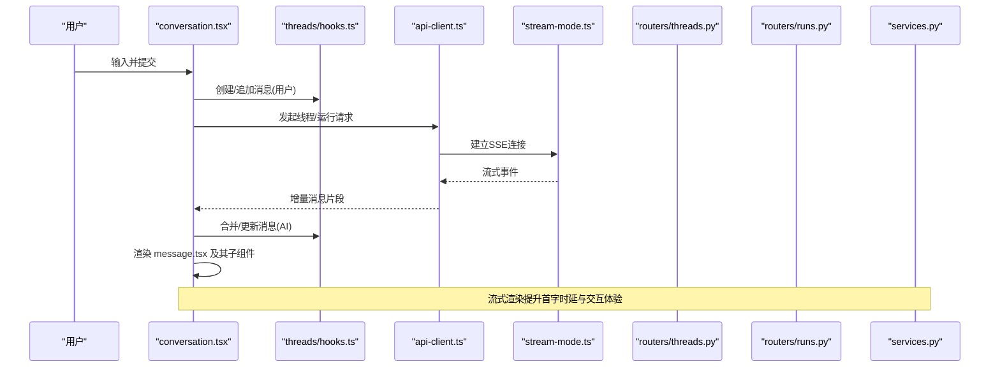
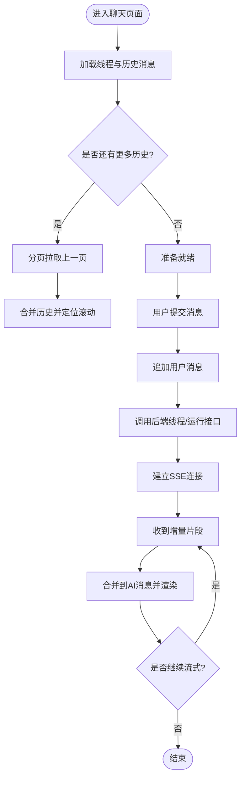
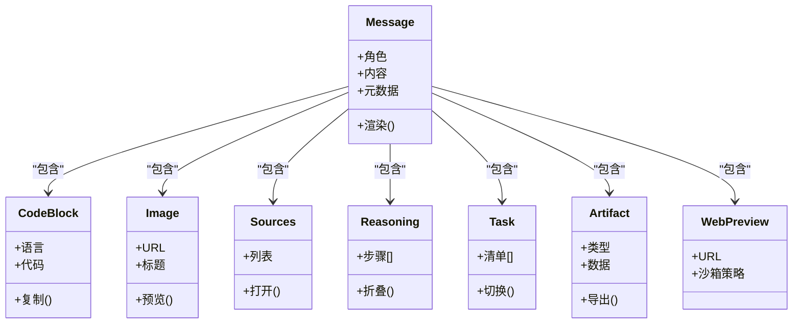
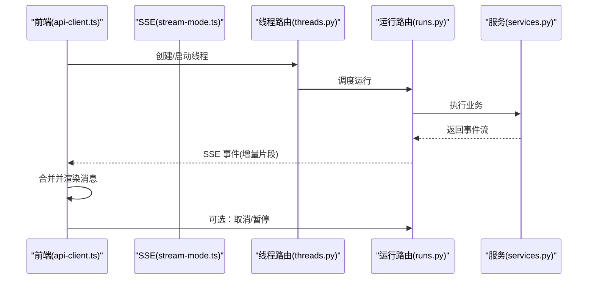
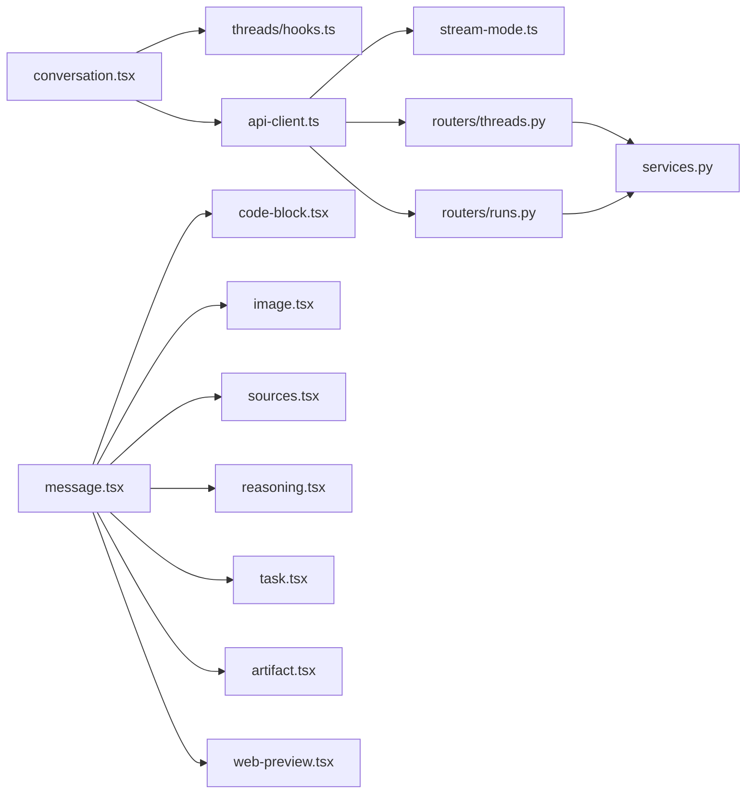

# 聊天组件

<cite>
**本文引用的文件**   
- [frontend/src/components/ai-elements/conversation.tsx](file://frontend/src/components/ai-elements/conversation.tsx)
- [frontend/src/components/ai-elements/message.tsx](file://frontend/src/components/ai-elements/message.tsx)
- [frontend/src/components/ai-elements/code-block.tsx](file://frontend/src/components/ai-elements/code-block.tsx)
- [frontend/src/components/ai-elements/image.tsx](file://frontend/src/components/ai-elements/image.tsx)
- [frontend/src/components/ai-elements/prompt-input.tsx](file://frontend/src/components/ai-elements/prompt-input.tsx)
- [frontend/src/components/ai-elements/sources.tsx](file://frontend/src/components/ai-elements/sources.tsx)
- [frontend/src/components/ai-elements/reasoning.tsx](file://frontend/src/components/ai-elements/reasoning.tsx)
- [frontend/src/components/ai-elements/task.tsx](file://frontend/src/components/ai-elements/task.tsx)
- [frontend/src/components/ai-elements/artifact.tsx](file://frontend/src/components/ai-elements/artifact.tsx)
- [frontend/src/components/ai-elements/web-preview.tsx](file://frontend/src/components/ai-elements/web-preview.tsx)
- [frontend/src/components/ai-elements/controls.tsx](file://frontend/src/components/ai-elements/controls.tsx)
- [frontend/src/components/ai-elements/model-selector.tsx](file://frontend/src/components/ai-elements/model-selector.tsx)
- [frontend/src/components/ai-elements/queue.tsx](file://frontend/src/components/ai-elements/queue.tsx)
- [frontend/src/components/ai-elements/loader.tsx](file://frontend/src/components/ai-elements/loader.tsx)
- [frontend/src/components/ai-elements/shimmer.tsx](file://frontend/src/components/ai-elements/shimmer.tsx)
- [frontend/src/components/workspace/streaming-indicator.tsx](file://frontend/src/components/workspace/streaming-indicator.tsx)
- [frontend/src/core/api/api-client.ts](file://frontend/src/core/api/api-client.ts)
- [frontend/src/core/api/stream-mode.ts](file://frontend/src/core/api/stream-mode.ts)
- [frontend/src/core/threads/hooks.ts](file://frontend/src/core/threads/hooks.ts)
- [frontend/src/core/messages/index.ts](file://frontend/src/core/messages/index.ts)
- [backend/app/gateway/routers/threads.py](file://backend/app/gateway/routers/threads.py)
- [backend/app/gateway/routers/runs.py](file://backend/app/gateway/routers/runs.py)
- [backend/app/gateway/services.py](file://backend/app/gateway/services.py)
- [backend/app/gateway/config.py](file://backend/app/gateway/config.py)
- [backend/docs/STREAMING.md](file://backend/docs/STREAMING.md)
</cite>

## 目录
1. [简介](#简介)
2. [项目结构](#项目结构)
3. [核心组件](#核心组件)
4. [架构总览](#架构总览)
5. [详细组件分析](#详细组件分析)
6. [依赖分析](#依赖分析)
7. [性能考虑](#性能考虑)
8. [故障排查指南](#故障排查指南)
9. [结论](#结论)
10. [附录](#附录)

## 简介
本文件面向 DeerFlow 前端的“聊天”能力，系统性梳理聊天容器、消息渲染、对话历史与流式传输等关键实现。内容覆盖：
- 聊天容器：会话管理、消息流处理、实时通信机制
- 消息组件：用户消息、AI 响应、代码块高亮、图片预览等
- 对话历史：分页加载、状态指示器、错误处理
- 实时通信：WebSocket 集成与 SSE 流式传输
- 定制与扩展：界面定制、组件替换、事件扩展点
- 实战示例：典型使用场景的接入方式（以路径引用代替具体代码）

## 项目结构
前端聊天相关代码主要位于以下目录：
- ai-elements：聊天 UI 原子组件（消息、输入框、代码块、图片、来源、推理过程、任务、工件、Web 预览、控制按钮、模型选择、队列、加载骨架等）
- workspace：工作区级组件（流式指示器等）
- core：核心逻辑（API 客户端、SSE 模式、线程/会话钩子、消息类型与工具）
- backend：后端网关路由与服务（线程、运行、配置），以及流式文档说明

图表来源
- [frontend/src/components/ai-elements/conversation.tsx](file://frontend/src/components/ai-elements/conversation.tsx)
- [frontend/src/components/ai-elements/message.tsx](file://frontend/src/components/ai-elements/message.tsx)
- [frontend/src/components/ai-elements/code-block.tsx](file://frontend/src/components/ai-elements/code-block.tsx)
- [frontend/src/components/ai-elements/image.tsx](file://frontend/src/components/ai-elements/image.tsx)
- [frontend/src/components/ai-elements/sources.tsx](file://frontend/src/components/ai-elements/sources.tsx)
- [frontend/src/components/ai-elements/reasoning.tsx](file://frontend/src/components/ai-elements/reasoning.tsx)
- [frontend/src/components/ai-elements/task.tsx](file://frontend/src/components/ai-elements/task.tsx)
- [frontend/src/components/ai-elements/artifact.tsx](file://frontend/src/components/ai-elements/artifact.tsx)
- [frontend/src/components/ai-elements/web-preview.tsx](file://frontend/src/components/ai-elements/web-preview.tsx)
- [frontend/src/components/ai-elements/controls.tsx](file://frontend/src/components/ai-elements/controls.tsx)
- [frontend/src/components/ai-elements/model-selector.tsx](file://frontend/src/components/ai-elements/model-selector.tsx)
- [frontend/src/components/ai-elements/queue.tsx](file://frontend/src/components/ai-elements/queue.tsx)
- [frontend/src/components/ai-elements/loader.tsx](file://frontend/src/components/ai-elements/loader.tsx)
- [frontend/src/components/ai-elements/shimmer.tsx](file://frontend/src/components/ai-elements/shimmer.tsx)
- [frontend/src/components/workspace/streaming-indicator.tsx](file://frontend/src/components/workspace/streaming-indicator.tsx)
- [frontend/src/core/api/api-client.ts](file://frontend/src/core/api/api-client.ts)
- [frontend/src/core/api/stream-mode.ts](file://frontend/src/core/api/stream-mode.ts)
- [frontend/src/core/threads/hooks.ts](file://frontend/src/core/threads/hooks.ts)
- [frontend/src/core/messages/index.ts](file://frontend/src/core/messages/index.ts)
- [backend/app/gateway/routers/threads.py](file://backend/app/gateway/routers/threads.py)
- [backend/app/gateway/routers/runs.py](file://backend/app/gateway/routers/runs.py)
- [backend/app/gateway/services.py](file://backend/app/gateway/services.py)
- [backend/app/gateway/config.py](file://backend/app/gateway/config.py)
- [backend/docs/STREAMING.md](file://backend/docs/STREAMING.md)

章节来源
- [frontend/src/components/ai-elements/conversation.tsx](file://frontend/src/components/ai-elements/conversation.tsx)
- [frontend/src/core/api/api-client.ts](file://frontend/src/core/api/api-client.ts)
- [frontend/src/core/threads/hooks.ts](file://frontend/src/core/threads/hooks.ts)
- [backend/app/gateway/routers/threads.py](file://backend/app/gateway/routers/threads.py)
- [backend/app/gateway/routers/runs.py](file://backend/app/gateway/routers/runs.py)
- [backend/docs/STREAMING.md](file://backend/docs/STREAMING.md)

## 核心组件
- 聊天容器 conversation.tsx
  - 职责：组织会话上下文、维护消息列表、驱动发送流程、订阅流式更新、承载分页与错误边界
  - 关键点：与 threads/hooks.ts 协作完成线程生命周期；与 api-client.ts 协作发起请求与接收流；内部组合 message.tsx 及各类展示组件
- 消息渲染 message.tsx
  - 职责：根据消息类型与角色渲染不同 UI（用户/AI），聚合 code-block、image、sources、reasoning、task、artifact、web-preview 等子组件
  - 关键点：对增量片段进行安全拼接与渲染；对富媒体与可交互元素提供统一入口
- 输入 prompt-input.tsx
  - 职责：文本输入、附件上传、快捷键、占位提示、发送触发
  - 关键点：与容器联动，支持多模态输入（文本+文件）
- 代码块 code-block.tsx
  - 职责：语法高亮、复制、语言标签、折叠/展开
- 图片 image.tsx
  - 职责：懒加载、缩放、预览弹窗、错误兜底
- 来源 sources.tsx
  - 职责：引用卡片、跳转、计数
- 推理 reasoning.tsx
  - 职责：逐步推理过程的折叠面板与时间线
- 任务 task.tsx
  - 职责：任务清单、进度、状态切换
- 工件 artifact.tsx
  - 职责：结构化产物（如报告、表格）的渲染与导出
- Web 预览 web-preview.tsx
  - 职责：内嵌网页预览、安全沙箱策略
- 控制 controls.tsx / 模型选择 model-selector.tsx / 队列 queue.tsx
  - 职责：停止生成、重试、清空、切换模型、任务排队与优先级
- 加载 loader.tsx / shimmer.tsx
  - 职责：骨架屏与渐进式加载体验
- 流式指示器 streaming-indicator.tsx
  - 职责：全局或局部显示“正在生成”的状态

章节来源
- [frontend/src/components/ai-elements/conversation.tsx](file://frontend/src/components/ai-elements/conversation.tsx)
- [frontend/src/components/ai-elements/message.tsx](file://frontend/src/components/ai-elements/message.tsx)
- [frontend/src/components/ai-elements/prompt-input.tsx](file://frontend/src/components/ai-elements/prompt-input.tsx)
- [frontend/src/components/ai-elements/code-block.tsx](file://frontend/src/components/ai-elements/code-block.tsx)
- [frontend/src/components/ai-elements/image.tsx](file://frontend/src/components/ai-elements/image.tsx)
- [frontend/src/components/ai-elements/sources.tsx](file://frontend/src/components/ai-elements/sources.tsx)
- [frontend/src/components/ai-elements/reasoning.tsx](file://frontend/src/components/ai-elements/reasoning.tsx)
- [frontend/src/components/ai-elements/task.tsx](file://frontend/src/components/ai-elements/task.tsx)
- [frontend/src/components/ai-elements/artifact.tsx](file://frontend/src/components/ai-elements/artifact.tsx)
- [frontend/src/components/ai-elements/web-preview.tsx](file://frontend/src/components/ai-elements/web-preview.tsx)
- [frontend/src/components/ai-elements/controls.tsx](file://frontend/src/components/ai-elements/controls.tsx)
- [frontend/src/components/ai-elements/model-selector.tsx](file://frontend/src/components/ai-elements/model-selector.tsx)
- [frontend/src/components/ai-elements/queue.tsx](file://frontend/src/components/ai-elements/queue.tsx)
- [frontend/src/components/ai-elements/loader.tsx](file://frontend/src/components/ai-elements/loader.tsx)
- [frontend/src/components/ai-elements/shimmer.tsx](file://frontend/src/components/ai-elements/shimmer.tsx)
- [frontend/src/components/workspace/streaming-indicator.tsx](file://frontend/src/components/workspace/streaming-indicator.tsx)

## 架构总览
聊天系统采用“前端组件 + 核心 API/状态 + 后端网关”的分层架构。前端通过 api-client.ts 调用后端线程/运行接口，结合 stream-mode.ts 实现 SSE 流式传输；threads/hooks.ts 负责线程与消息状态管理；conversation.tsx 作为容器编排各子组件并驱动交互。

图表来源
- [frontend/src/components/ai-elements/conversation.tsx](file://frontend/src/components/ai-elements/conversation.tsx)
- [frontend/src/core/threads/hooks.ts](file://frontend/src/core/threads/hooks.ts)
- [frontend/src/core/api/api-client.ts](file://frontend/src/core/api/api-client.ts)
- [frontend/src/core/api/stream-mode.ts](file://frontend/src/core/api/stream-mode.ts)
- [backend/app/gateway/routers/threads.py](file://backend/app/gateway/routers/threads.py)
- [backend/app/gateway/routers/runs.py](file://backend/app/gateway/routers/runs.py)
- [backend/app/gateway/services.py](file://backend/app/gateway/services.py)

## 详细组件分析

### 聊天容器 conversation.tsx
- 功能要点
  - 会话管理：基于 threads/hooks.ts 获取/创建线程，维护消息集合与滚动位置
  - 消息流处理：将增量片段按顺序合并到当前 AI 消息，避免重排抖动
  - 实时通信：通过 api-client.ts 与 stream-mode.ts 建立 SSE 连接，监听事件并更新状态
  - 错误处理：捕获网络异常、服务端错误，提供重试与降级展示
  - 分页加载：在历史消息区域按需拉取旧消息，保持滚动锚点稳定
- 扩展点
  - 自定义渲染：通过 props 注入 message 渲染函数，替换默认 message.tsx
  - 自定义流处理器：封装 stream-mode.ts 的事件解析逻辑，适配业务协议
  - 自定义错误边界：包裹 conversation 并提供恢复操作

图表来源
- [frontend/src/components/ai-elements/conversation.tsx](file://frontend/src/components/ai-elements/conversation.tsx)
- [frontend/src/core/threads/hooks.ts](file://frontend/src/core/threads/hooks.ts)
- [frontend/src/core/api/api-client.ts](file://frontend/src/core/api/api-client.ts)
- [frontend/src/core/api/stream-mode.ts](file://frontend/src/core/api/stream-mode.ts)
- [backend/app/gateway/routers/threads.py](file://backend/app/gateway/routers/threads.py)
- [backend/app/gateway/routers/runs.py](file://backend/app/gateway/routers/runs.py)

章节来源
- [frontend/src/components/ai-elements/conversation.tsx](file://frontend/src/components/ai-elements/conversation.tsx)
- [frontend/src/core/threads/hooks.ts](file://frontend/src/core/threads/hooks.ts)
- [frontend/src/core/api/api-client.ts](file://frontend/src/core/api/api-client.ts)
- [frontend/src/core/api/stream-mode.ts](file://frontend/src/core/api/stream-mode.ts)
- [backend/app/gateway/routers/threads.py](file://backend/app/gateway/routers/threads.py)
- [backend/app/gateway/routers/runs.py](file://backend/app/gateway/routers/runs.py)

### 消息组件 message.tsx 与子组件
- 消息类型与角色
  - 用户消息：纯文本/富文本、附件缩略图、快速重试/编辑入口
  - AI 消息：文本流式渲染、代码块、图片、来源、推理过程、任务、工件、Web 预览等
- 子组件职责
  - code-block.tsx：语法高亮、复制、语言标识、折叠
  - image.tsx：懒加载、预览、错误回退
  - sources.tsx：引用卡片、点击跳转、数量统计
  - reasoning.tsx：逐步推理的可折叠面板
  - task.tsx：任务清单与状态
  - artifact.tsx：结构化产物渲染与导出
  - web-preview.tsx：内嵌预览与安全策略
- 渲染策略
  - 增量渲染：对 AI 消息的增量片段进行安全拼接，避免整段重绘
  - 资源优化：图片懒加载、代码块按需高亮、来源延迟加载

图表来源
- [frontend/src/components/ai-elements/message.tsx](file://frontend/src/components/ai-elements/message.tsx)
- [frontend/src/components/ai-elements/code-block.tsx](file://frontend/src/components/ai-elements/code-block.tsx)
- [frontend/src/components/ai-elements/image.tsx](file://frontend/src/components/ai-elements/image.tsx)
- [frontend/src/components/ai-elements/sources.tsx](file://frontend/src/components/ai-elements/sources.tsx)
- [frontend/src/components/ai-elements/reasoning.tsx](file://frontend/src/components/ai-elements/reasoning.tsx)
- [frontend/src/components/ai-elements/task.tsx](file://frontend/src/components/ai-elements/task.tsx)
- [frontend/src/components/ai-elements/artifact.tsx](file://frontend/src/components/ai-elements/artifact.tsx)
- [frontend/src/components/ai-elements/web-preview.tsx](file://frontend/src/components/ai-elements/web-preview.tsx)

章节来源
- [frontend/src/components/ai-elements/message.tsx](file://frontend/src/components/ai-elements/message.tsx)
- [frontend/src/components/ai-elements/code-block.tsx](file://frontend/src/components/ai-elements/code-block.tsx)
- [frontend/src/components/ai-elements/image.tsx](file://frontend/src/components/ai-elements/image.tsx)
- [frontend/src/components/ai-elements/sources.tsx](file://frontend/src/components/ai-elements/sources.tsx)
- [frontend/src/components/ai-elements/reasoning.tsx](file://frontend/src/components/ai-elements/reasoning.tsx)
- [frontend/src/components/ai-elements/task.tsx](file://frontend/src/components/ai-elements/task.tsx)
- [frontend/src/components/ai-elements/artifact.tsx](file://frontend/src/components/ai-elements/artifact.tsx)
- [frontend/src/components/ai-elements/web-preview.tsx](file://frontend/src/components/ai-elements/web-preview.tsx)

### 对话历史与分页
- 分页加载
  - 在 conversation 容器中监听滚动接近顶部时触发分页拉取
  - 使用 threads/hooks.ts 提供的历史查询接口，按页码/游标拉取
  - 合并历史后保持滚动位置稳定，避免闪烁
- 状态指示器
  - 使用 streaming-indicator.tsx 显示“正在生成”
  - 使用 loader.tsx/shimmer.tsx 提供骨架屏
- 错误处理
  - 网络/鉴权失败：提示并重试
  - 服务端错误：展示友好信息并提供反馈入口

章节来源
- [frontend/src/components/ai-elements/conversation.tsx](file://frontend/src/components/ai-elements/conversation.tsx)
- [frontend/src/components/workspace/streaming-indicator.tsx](file://frontend/src/components/workspace/streaming-indicator.tsx)
- [frontend/src/components/ai-elements/loader.tsx](file://frontend/src/components/ai-elements/loader.tsx)
- [frontend/src/components/ai-elements/shimmer.tsx](file://frontend/src/components/ai-elements/shimmer.tsx)
- [frontend/src/core/threads/hooks.ts](file://frontend/src/core/threads/hooks.ts)

### 实时通信：SSE 与 WebSocket
- SSE 流式传输
  - 通过 api-client.ts 发起请求，使用 stream-mode.ts 建立 SSE 连接
  - 事件驱动：将增量片段映射为消息更新，逐块渲染
  - 断线重连：在网络波动时自动尝试重建连接
- WebSocket 集成
  - 若后端启用 WS 通道，可在 api-client.ts 中切换为 WS 模式
  - 双向通信：支持取消生成、心跳保活、错误上报
- 后端支撑
  - routers/threads.py 与 routers/runs.py 暴露线程与运行接口
  - services.py 协调业务逻辑与持久化
  - config.py 提供流式参数与超时配置
  - docs/STREAMING.md 描述流式协议与事件格式

图表来源
- [frontend/src/core/api/api-client.ts](file://frontend/src/core/api/api-client.ts)
- [frontend/src/core/api/stream-mode.ts](file://frontend/src/core/api/stream-mode.ts)
- [backend/app/gateway/routers/threads.py](file://backend/app/gateway/routers/threads.py)
- [backend/app/gateway/routers/runs.py](file://backend/app/gateway/routers/runs.py)
- [backend/app/gateway/services.py](file://backend/app/gateway/services.py)
- [backend/docs/STREAMING.md](file://backend/docs/STREAMING.md)

章节来源
- [frontend/src/core/api/api-client.ts](file://frontend/src/core/api/api-client.ts)
- [frontend/src/core/api/stream-mode.ts](file://frontend/src/core/api/stream-mode.ts)
- [backend/app/gateway/routers/threads.py](file://backend/app/gateway/routers/threads.py)
- [backend/app/gateway/routers/runs.py](file://backend/app/gateway/routers/runs.py)
- [backend/app/gateway/services.py](file://backend/app/gateway/services.py)
- [backend/docs/STREAMING.md](file://backend/docs/STREAMING.md)

### 输入与控件
- prompt-input.tsx
  - 支持多行输入、粘贴图片、文件附件、快捷键发送
  - 与 conversation 容器联动，触发发送流程
- controls.tsx / model-selector.tsx / queue.tsx
  - 控制生成：停止、重试、清空
  - 模型选择：动态切换模型参数
  - 队列：任务排队、优先级、并发限制

章节来源
- [frontend/src/components/ai-elements/prompt-input.tsx](file://frontend/src/components/ai-elements/prompt-input.tsx)
- [frontend/src/components/ai-elements/controls.tsx](file://frontend/src/components/ai-elements/controls.tsx)
- [frontend/src/components/ai-elements/model-selector.tsx](file://frontend/src/components/ai-elements/model-selector.tsx)
- [frontend/src/components/ai-elements/queue.tsx](file://frontend/src/components/ai-elements/queue.tsx)

## 依赖分析
- 组件耦合
  - conversation.tsx 强依赖 threads/hooks.ts 与 api-client.ts
  - message.tsx 聚合多个展示型子组件，低耦合、高内聚
- 外部依赖
  - 后端网关：threads.py、runs.py、services.py、config.py
  - 流式协议：stream-mode.ts 与后端 STREAMING.md 对齐
- 潜在风险
  - 循环依赖：确保 hooks 不反向依赖 UI 组件
  - 事件风暴：SSE 事件需节流合并，避免频繁重渲染

图表来源
- [frontend/src/components/ai-elements/conversation.tsx](file://frontend/src/components/ai-elements/conversation.tsx)
- [frontend/src/core/threads/hooks.ts](file://frontend/src/core/threads/hooks.ts)
- [frontend/src/core/api/api-client.ts](file://frontend/src/core/api/api-client.ts)
- [frontend/src/core/api/stream-mode.ts](file://frontend/src/core/api/stream-mode.ts)
- [backend/app/gateway/routers/threads.py](file://backend/app/gateway/routers/threads.py)
- [backend/app/gateway/routers/runs.py](file://backend/app/gateway/routers/runs.py)
- [backend/app/gateway/services.py](file://backend/app/gateway/services.py)
- [frontend/src/components/ai-elements/message.tsx](file://frontend/src/components/ai-elements/message.tsx)
- [frontend/src/components/ai-elements/code-block.tsx](file://frontend/src/components/ai-elements/code-block.tsx)
- [frontend/src/components/ai-elements/image.tsx](file://frontend/src/components/ai-elements/image.tsx)
- [frontend/src/components/ai-elements/sources.tsx](file://frontend/src/components/ai-elements/sources.tsx)
- [frontend/src/components/ai-elements/reasoning.tsx](file://frontend/src/components/ai-elements/reasoning.tsx)
- [frontend/src/components/ai-elements/task.tsx](file://frontend/src/components/ai-elements/task.tsx)
- [frontend/src/components/ai-elements/artifact.tsx](file://frontend/src/components/ai-elements/artifact.tsx)
- [frontend/src/components/ai-elements/web-preview.tsx](file://frontend/src/components/ai-elements/web-preview.tsx)

章节来源
- [frontend/src/components/ai-elements/conversation.tsx](file://frontend/src/components/ai-elements/conversation.tsx)
- [frontend/src/core/threads/hooks.ts](file://frontend/src/core/threads/hooks.ts)
- [frontend/src/core/api/api-client.ts](file://frontend/src/core/api/api-client.ts)
- [frontend/src/core/api/stream-mode.ts](file://frontend/src/core/api/stream-mode.ts)
- [backend/app/gateway/routers/threads.py](file://backend/app/gateway/routers/threads.py)
- [backend/app/gateway/routers/runs.py](file://backend/app/gateway/routers/runs.py)
- [backend/app/gateway/services.py](file://backend/app/gateway/services.py)

## 性能考虑
- 流式渲染
  - 增量合并而非整段替换，减少 DOM 重排
  - 对长文本进行分片渲染，避免主线程阻塞
- 资源加载
  - 图片懒加载与缩略图优先，大图按需加载
  - 代码块高亮按需触发，避免首屏开销
- 网络与缓存
  - SSE 断线重连与指数退避
  - 历史消息分页与本地缓存，减少重复请求
- 内存与稳定性
  - 及时释放已关闭的 SSE 连接
  - 大消息截断与分页展示，防止内存溢出

[本节为通用指导，无需源码引用]

## 故障排查指南
- 常见问题
  - 无法建立 SSE 连接：检查跨域、代理与后端配置
  - 流中断：查看网络日志与后端运行状态，确认超时与重试策略
  - 历史加载失败：校验分页参数与权限
  - 图片/代码块渲染异常：检查资源 URL 与 MIME 类型
- 定位方法
  - 前端：打开控制台查看 API 请求与 SSE 事件
  - 后端：查看网关日志与运行记录
  - 配置：核对 config.py 中的流式与超时参数

章节来源
- [frontend/src/core/api/api-client.ts](file://frontend/src/core/api/api-client.ts)
- [frontend/src/core/api/stream-mode.ts](file://frontend/src/core/api/stream-mode.ts)
- [backend/app/gateway/config.py](file://backend/app/gateway/config.py)
- [backend/docs/STREAMING.md](file://backend/docs/STREAMING.md)

## 结论
DeerFlow 聊天组件以 conversation.tsx 为核心，结合 message.tsx 及其丰富的子组件，实现了高可用、可扩展的聊天体验。通过 api-client.ts 与 stream-mode.ts 对接后端 SSE/WS 流式接口，配合 threads/hooks.ts 的会话管理，形成清晰的前后端分层。建议在生产环境中关注流式渲染性能、资源加载策略与错误恢复机制，并通过组件替换与事件扩展满足个性化需求。

[本节为总结性内容，无需源码引用]

## 附录
- 开发指南与最佳实践
  - 自定义消息渲染：在 conversation 中注入自定义 message 渲染函数，复用 message.tsx 的子组件
  - 自定义流处理器：封装 stream-mode.ts 的事件解析，适配业务协议
  - 主题与样式：通过全局样式与组件 props 调整外观
  - 国际化：结合 i18n 模块替换文案
- 实际应用场景（以路径引用为例）
  - 基础聊天接入：参考 [conversation.tsx](file://frontend/src/components/ai-elements/conversation.tsx) 与 [threads/hooks.ts](file://frontend/src/core/threads/hooks.ts)
  - 流式输出：参考 [api-client.ts](file://frontend/src/core/api/api-client.ts)、[stream-mode.ts](file://frontend/src/core/api/stream-mode.ts) 与 [STREAMING.md](file://backend/docs/STREAMING.md)
  - 富媒体消息：参考 [message.tsx](file://frontend/src/components/ai-elements/message.tsx)、[code-block.tsx](file://frontend/src/components/ai-elements/code-block.tsx)、[image.tsx](file://frontend/src/components/ai-elements/image.tsx)
  - 引用与推理：参考 [sources.tsx](file://frontend/src/components/ai-elements/sources.tsx)、[reasoning.tsx](file://frontend/src/components/ai-elements/reasoning.tsx)
  - 任务与工件：参考 [task.tsx](file://frontend/src/components/ai-elements/task.tsx)、[artifact.tsx](file://frontend/src/components/ai-elements/artifact.tsx)
  - Web 预览：参考 [web-preview.tsx](file://frontend/src/components/ai-elements/web-preview.tsx)
  - 输入与控件：参考 [prompt-input.tsx](file://frontend/src/components/ai-elements/prompt-input.tsx)、[controls.tsx](file://frontend/src/components/ai-elements/controls.tsx)、[model-selector.tsx](file://frontend/src/components/ai-elements/model-selector.tsx)、[queue.tsx](file://frontend/src/components/ai-elements/queue.tsx)
  - 加载与骨架：参考 [loader.tsx](file://frontend/src/components/ai-elements/loader.tsx)、[shimmer.tsx](file://frontend/src/components/ai-elements/shimmer.tsx)
  - 流式指示器：参考 [streaming-indicator.tsx](file://frontend/src/components/workspace/streaming-indicator.tsx)

[本节为指引性内容，无需源码引用]