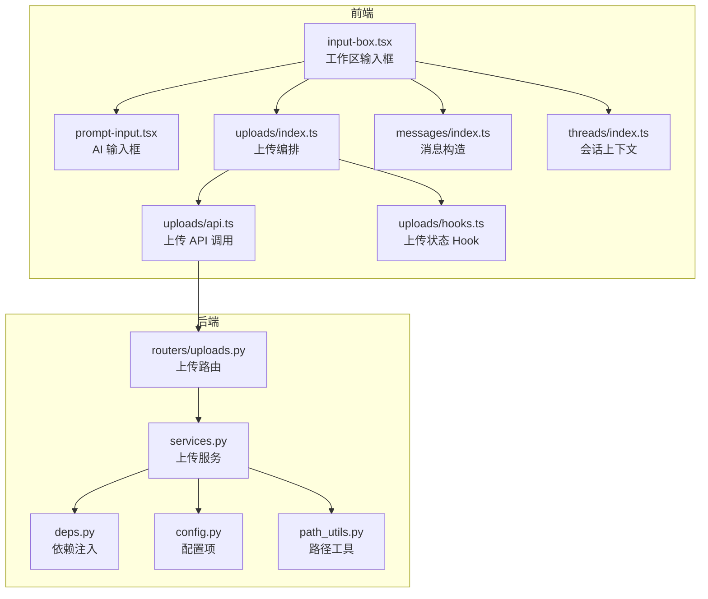
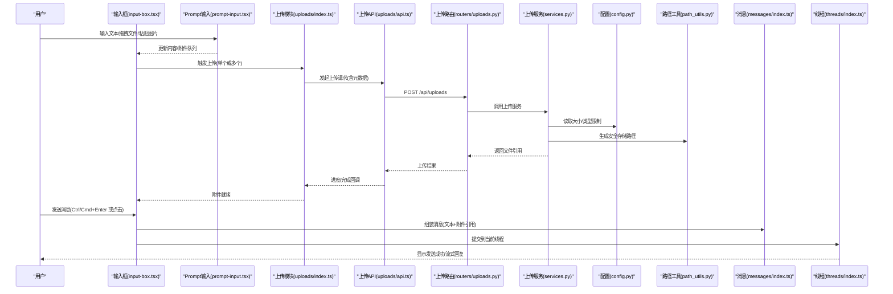
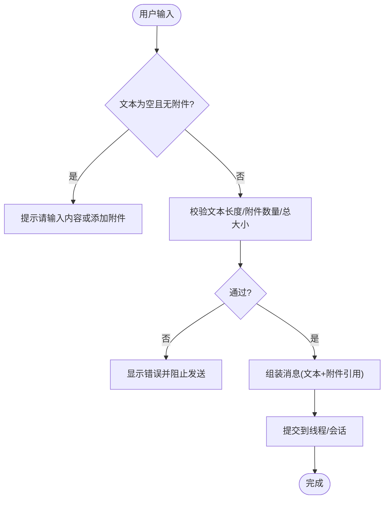
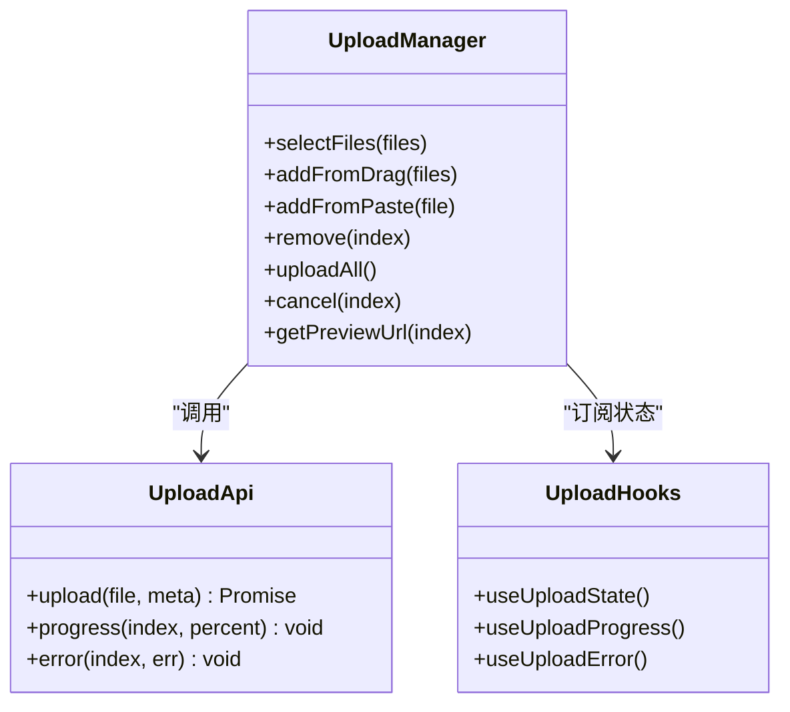
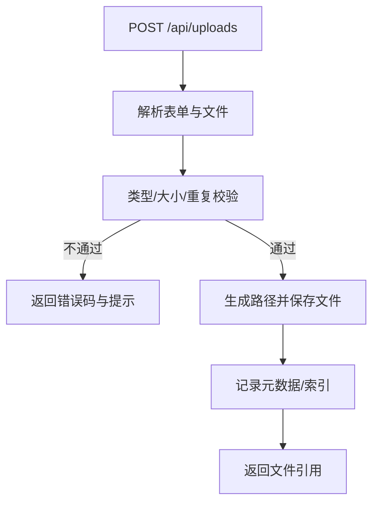
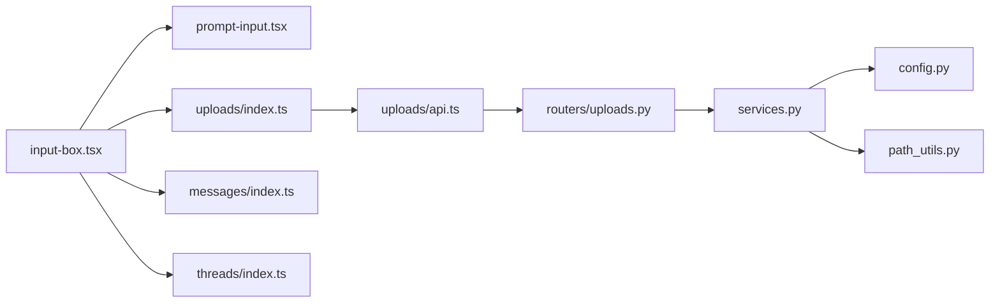

# 聊天输入框

<cite>
**本文引用的文件**   
- [frontend/src/components/workspace/input-box.tsx](file://frontend/src/components/workspace/input-box.tsx)
- [frontend/src/components/ai-elements/prompt-input.tsx](file://frontend/src/components/ai-elements/prompt-input.tsx)
- [frontend/src/core/uploads/index.ts](file://frontend/src/core/uploads/index.ts)
- [frontend/src/core/uploads/api.ts](file://frontend/src/core/uploads/api.ts)
- [frontend/src/core/uploads/hooks.ts](file://frontend/src/core/uploads/hooks.ts)
- [frontend/src/core/messages/index.ts](file://frontend/src/core/messages/index.ts)
- [frontend/src/core/threads/index.ts](file://frontend/src/core/threads/index.ts)
- [backend/app/gateway/routers/uploads.py](file://backend/app/gateway/routers/uploads.py)
- [backend/app/gateway/services.py](file://backend/app/gateway/services.py)
- [backend/app/gateway/deps.py](file://backend/app/gateway/deps.py)
- [backend/app/gateway/config.py](file://backend/app/gateway/config.py)
- [backend/app/gateway/path_utils.py](file://backend/app/gateway/path_utils.py)
- [backend/tests/test_uploads_router.py](file://backend/tests/test_uploads_router.py)
- [backend/tests/test_uploads_middleware_core_logic.py](file://backend/tests/test_uploads_middleware_core_logic.py)
- [frontend/tests/unit/core/uploads/file-validation.test.ts](file://frontend/tests/unit/core/uploads/file-validation.test.ts)
- [frontend/tests/unit/core/uploads/prompt-input-files.test.ts](file://frontend/tests/unit/core/uploads/prompt-input-files.test.ts)
</cite>

## 目录
1. [简介](#简介)
2. [项目结构](#项目结构)
3. [核心组件](#核心组件)
4. [架构总览](#架构总览)
5. [详细组件分析](#详细组件分析)
6. [依赖关系分析](#依赖关系分析)
7. [性能与体验优化](#性能与体验优化)
8. [故障排查指南](#故障排查指南)
9. [结论](#结论)
10. [附录：样式定制与扩展开发](#附录样式定制与扩展开发)

## 简介
本文件聚焦 DeerFlow 前端“聊天输入框”的完整实现与使用指南，覆盖文本输入、多行编辑、快捷键、拖拽上传、文件类型与大小校验、进度反馈、错误处理、自动补全、历史记录与模板插入等能力。同时提供前后端交互流程、关键数据结构、可观测性与排错建议，以及样式定制与二次开发指引。

## 项目结构
围绕聊天输入框的前后端关键位置如下：
- 前端 UI 层
  - 工作区输入框容器：负责组合消息发送、附件管理、快捷键与状态联动
  - AI 元素输入框：通用 Prompt 输入组件，支持多行、快捷键、基础校验
- 前端核心逻辑层
  - 上传模块：封装文件选择、校验、分片/直传、进度与错误处理
  - 消息与线程：构建消息体、关联附件、提交到会话
- 后端网关层
  - 上传路由与服务：接收文件、校验、落盘、返回引用
  - 配置与路径工具：限制大小、白名单、存储路径生成
  - 中间件与测试：安全扫描、沙箱隔离、端到端用例

图表来源
- [frontend/src/components/workspace/input-box.tsx](file://frontend/src/components/workspace/input-box.tsx)
- [frontend/src/components/ai-elements/prompt-input.tsx](file://frontend/src/components/ai-elements/prompt-input.tsx)
- [frontend/src/core/uploads/index.ts](file://frontend/src/core/uploads/index.ts)
- [frontend/src/core/uploads/api.ts](file://frontend/src/core/uploads/api.ts)
- [frontend/src/core/uploads/hooks.ts](file://frontend/src/core/uploads/hooks.ts)
- [frontend/src/core/messages/index.ts](file://frontend/src/core/messages/index.ts)
- [frontend/src/core/threads/index.ts](file://frontend/src/core/threads/index.ts)
- [backend/app/gateway/routers/uploads.py](file://backend/app/gateway/routers/uploads.py)
- [backend/app/gateway/services.py](file://backend/app/gateway/services.py)
- [backend/app/gateway/deps.py](file://backend/app/gateway/deps.py)
- [backend/app/gateway/config.py](file://backend/app/gateway/config.py)
- [backend/app/gateway/path_utils.py](file://backend/app/gateway/path_utils.py)

章节来源
- [frontend/src/components/workspace/input-box.tsx](file://frontend/src/components/workspace/input-box.tsx)
- [frontend/src/components/ai-elements/prompt-input.tsx](file://frontend/src/components/ai-elements/prompt-input.tsx)
- [frontend/src/core/uploads/index.ts](file://frontend/src/core/uploads/index.ts)
- [frontend/src/core/uploads/api.ts](file://frontend/src/core/uploads/api.ts)
- [frontend/src/core/uploads/hooks.ts](file://frontend/src/core/uploads/hooks.ts)
- [frontend/src/core/messages/index.ts](file://frontend/src/core/messages/index.ts)
- [frontend/src/core/threads/index.ts](file://frontend/src/core/threads/index.ts)
- [backend/app/gateway/routers/uploads.py](file://backend/app/gateway/routers/uploads.py)
- [backend/app/gateway/services.py](file://backend/app/gateway/services.py)
- [backend/app/gateway/deps.py](file://backend/app/gateway/deps.py)
- [backend/app/gateway/config.py](file://backend/app/gateway/config.py)
- [backend/app/gateway/path_utils.py](file://backend/app/gateway/path_utils.py)

## 核心组件
- 工作区输入框（input-box.tsx）
  - 职责：聚合用户输入、附件列表、发送动作、快捷键响应、历史与模板操作入口
  - 关键能力：多行编辑、Enter 发送、Shift+Enter 换行、Ctrl/Cmd+Enter 快捷发送、拖拽上传、粘贴图片、清空与撤销、模板插入、最近历史切换
- AI 输入框（prompt-input.tsx）
  - 职责：通用文本输入控件，提供多行自适应高度、IME 输入法兼容、光标定位、基础校验
- 上传模块（core/uploads/*）
  - 职责：文件选择与预览、类型与大小校验、分片/直传策略、进度回调、失败重试、错误提示
  - 与消息/线程集成：将已上传文件的引用附加到消息体中，随消息一起发送到会话

章节来源
- [frontend/src/components/workspace/input-box.tsx](file://frontend/src/components/workspace/input-box.tsx)
- [frontend/src/components/ai-elements/prompt-input.tsx](file://frontend/src/components/ai-elements/prompt-input.tsx)
- [frontend/src/core/uploads/index.ts](file://frontend/src/core/uploads/index.ts)
- [frontend/src/core/uploads/api.ts](file://frontend/src/core/uploads/api.ts)
- [frontend/src/core/uploads/hooks.ts](file://frontend/src/core/uploads/hooks.ts)
- [frontend/src/core/messages/index.ts](file://frontend/src/core/messages/index.ts)
- [frontend/src/core/threads/index.ts](file://frontend/src/core/threads/index.ts)

## 架构总览
从用户输入到消息落库的整体流程如下：

图表来源
- [frontend/src/components/workspace/input-box.tsx](file://frontend/src/components/workspace/input-box.tsx)
- [frontend/src/components/ai-elements/prompt-input.tsx](file://frontend/src/components/ai-elements/prompt-input.tsx)
- [frontend/src/core/uploads/index.ts](file://frontend/src/core/uploads/index.ts)
- [frontend/src/core/uploads/api.ts](file://frontend/src/core/uploads/api.ts)
- [backend/app/gateway/routers/uploads.py](file://backend/app/gateway/routers/uploads.py)
- [backend/app/gateway/services.py](file://backend/app/gateway/services.py)
- [backend/app/gateway/config.py](file://backend/app/gateway/config.py)
- [backend/app/gateway/path_utils.py](file://backend/app/gateway/path_utils.py)
- [frontend/src/core/messages/index.ts](file://frontend/src/core/messages/index.ts)
- [frontend/src/core/threads/index.ts](file://frontend/src/core/threads/index.ts)

## 详细组件分析

### 输入框组件（input-box.tsx）
- 功能要点
  - 文本输入与多行编辑：基于底层 Prompt 输入组件，支持自动高度、回车行为控制
  - 快捷键：Enter 发送、Shift+Enter 换行、Ctrl/Cmd+Enter 快速发送；可通过全局快捷键 Hook 扩展
  - 附件管理：支持拖拽、粘贴图片、批量选择；展示缩略图与删除；上传失败可重试
  - 智能能力：模板插入（如常用指令）、历史记录（最近对话片段）、自动补全（可扩展）
  - 发送流程：校验非空、打包附件引用、调用线程接口创建消息并进入运行
- 关键交互
  - 拖拽上传：onDrop/onDragOver 事件处理，去重与排序
  - 粘贴上传：剪贴板图片识别与上传
  - 发送前校验：文本长度、附件数量与总大小
  - 错误反馈：Toast/内联提示，失败重试按钮
- 扩展点
  - 自定义快捷键映射
  - 接入外部模板系统
  - 接入自动补全引擎（本地字典或远程模型）

图表来源
- [frontend/src/components/workspace/input-box.tsx](file://frontend/src/components/workspace/input-box.tsx)
- [frontend/src/core/messages/index.ts](file://frontend/src/core/messages/index.ts)
- [frontend/src/core/threads/index.ts](file://frontend/src/core/threads/index.ts)

章节来源
- [frontend/src/components/workspace/input-box.tsx](file://frontend/src/components/workspace/input-box.tsx)
- [frontend/src/core/messages/index.ts](file://frontend/src/core/messages/index.ts)
- [frontend/src/core/threads/index.ts](file://frontend/src/core/threads/index.ts)

### 通用 Prompt 输入（prompt-input.tsx）
- 能力
  - 多行自适应高度、IME 输入法兼容、光标定位、占位符、禁用态
  - 基础校验：最大长度、必填提示
  - 事件：onChange、onKeyDown、onPaste、onFocus、onBlur
- 与上层集成
  - 被 input-box.tsx 包裹，暴露统一 API 供上层控制发送与附件

章节来源
- [frontend/src/components/ai-elements/prompt-input.tsx](file://frontend/src/components/ai-elements/prompt-input.tsx)

### 上传模块（core/uploads/*）
- 文件选择与预览
  - 支持多选、拖拽、粘贴图片；生成预览 URL；去重与顺序保持
- 类型与大小校验
  - 白名单类型、单文件大小上限、总大小上限；失败即时提示
- 上传策略
  - 直传或分片上传（根据配置），进度回调，失败重试，取消上传
- 与消息/线程集成
  - 上传成功后将文件引用加入消息附件列表，随消息一并提交

图表来源
- [frontend/src/core/uploads/index.ts](file://frontend/src/core/uploads/index.ts)
- [frontend/src/core/uploads/api.ts](file://frontend/src/core/uploads/api.ts)
- [frontend/src/core/uploads/hooks.ts](file://frontend/src/core/uploads/hooks.ts)

章节来源
- [frontend/src/core/uploads/index.ts](file://frontend/src/core/uploads/index.ts)
- [frontend/src/core/uploads/api.ts](file://frontend/src/core/uploads/api.ts)
- [frontend/src/core/uploads/hooks.ts](file://frontend/src/core/uploads/hooks.ts)

### 后端上传路由与服务（routers/uploads.py, services.py）
- 路由
  - 接收 multipart/form-data，解析文件名、类型、大小、MD5 等元数据
  - 返回统一的上传结果（包含文件 ID/URL 引用）
- 服务
  - 校验：类型白名单、大小限制、重复检测
  - 存储：基于 path_utils 生成安全路径，写入磁盘或对象存储
  - 安全：可选沙箱扫描、病毒扫描、敏感词过滤（由中间件或下游服务执行）
- 配置
  - 通过 config.py 注入允许类型、大小阈值、存储根路径等
- 依赖
  - deps.py 提供数据库连接、存储客户端、配置加载等

图表来源
- [backend/app/gateway/routers/uploads.py](file://backend/app/gateway/routers/uploads.py)
- [backend/app/gateway/services.py](file://backend/app/gateway/services.py)
- [backend/app/gateway/config.py](file://backend/app/gateway/config.py)
- [backend/app/gateway/path_utils.py](file://backend/app/gateway/path_utils.py)

章节来源
- [backend/app/gateway/routers/uploads.py](file://backend/app/gateway/routers/uploads.py)
- [backend/app/gateway/services.py](file://backend/app/gateway/services.py)
- [backend/app/gateway/config.py](file://backend/app/gateway/config.py)
- [backend/app/gateway/path_utils.py](file://backend/app/gateway/path_utils.py)

## 依赖关系分析
- 前端耦合
  - input-box.tsx 依赖 prompt-input.tsx 作为输入内核，依赖 uploads/* 进行附件处理，依赖 messages/index.ts 与 threads/index.ts 完成消息与线程交互
- 前后端契约
  - 上传接口：multipart/form-data，字段包括文件、名称、类型、大小、MD5 等；返回文件引用标识
  - 消息接口：文本+附件引用数组；线程上下文决定目标会话
- 外部依赖
  - 存储服务（本地/对象存储）、安全扫描、沙箱环境（可选）

图表来源
- [frontend/src/components/workspace/input-box.tsx](file://frontend/src/components/workspace/input-box.tsx)
- [frontend/src/components/ai-elements/prompt-input.tsx](file://frontend/src/components/ai-elements/prompt-input.tsx)
- [frontend/src/core/uploads/index.ts](file://frontend/src/core/uploads/index.ts)
- [frontend/src/core/uploads/api.ts](file://frontend/src/core/uploads/api.ts)
- [frontend/src/core/messages/index.ts](file://frontend/src/core/messages/index.ts)
- [frontend/src/core/threads/index.ts](file://frontend/src/core/threads/index.ts)
- [backend/app/gateway/routers/uploads.py](file://backend/app/gateway/routers/uploads.py)
- [backend/app/gateway/services.py](file://backend/app/gateway/services.py)
- [backend/app/gateway/config.py](file://backend/app/gateway/config.py)
- [backend/app/gateway/path_utils.py](file://backend/app/gateway/path_utils.py)

章节来源
- [frontend/src/components/workspace/input-box.tsx](file://frontend/src/components/workspace/input-box.tsx)
- [frontend/src/components/ai-elements/prompt-input.tsx](file://frontend/src/components/ai-elements/prompt-input.tsx)
- [frontend/src/core/uploads/index.ts](file://frontend/src/core/uploads/index.ts)
- [frontend/src/core/uploads/api.ts](file://frontend/src/core/uploads/api.ts)
- [frontend/src/core/messages/index.ts](file://frontend/src/core/messages/index.ts)
- [frontend/src/core/threads/index.ts](file://frontend/src/core/threads/index.ts)
- [backend/app/gateway/routers/uploads.py](file://backend/app/gateway/routers/uploads.py)
- [backend/app/gateway/services.py](file://backend/app/gateway/services.py)
- [backend/app/gateway/config.py](file://backend/app/gateway/config.py)
- [backend/app/gateway/path_utils.py](file://backend/app/gateway/path_utils.py)

## 性能与体验优化
- 输入体验
  - 多行输入时避免频繁重绘，采用增量更新与防抖
  - 大文本输入时启用虚拟滚动或分页渲染（若需要）
  - 快捷键提示常驻显示，减少学习成本
- 上传性能
  - 大文件优先分片上传，断点续传与并发控制
  - 压缩图片后再上传，降低带宽占用
  - 预取缩略图与懒加载，减少首屏压力
- 错误与容错
  - 网络异常指数退避重试，用户可手动重试
  - 明确错误分类（类型不支持、超限、服务端错误），给出可操作提示
- 可观测性
  - 上报上传耗时、失败率、平均大小等指标，便于容量规划

[本节为通用指导，无需代码来源]

## 故障排查指南
- 前端常见问题
  - 无法拖拽/粘贴：检查 onDrop/onPaste 事件绑定与浏览器权限
  - 上传失败：查看网络面板与上传日志，确认类型/大小是否符合限制
  - 发送无响应：检查消息体是否包含有效附件引用，线程上下文是否正确
- 后端常见问题
  - 类型/大小拒绝：核对 config.py 中的白名单与阈值
  - 路径错误：检查 path_utils 生成的路径与安全策略
  - 权限问题：确认存储目录/对象存储桶权限
- 参考测试用例
  - 上传路由与中间件逻辑验证
  - 前端文件校验与输入框附件行为

章节来源
- [backend/tests/test_uploads_router.py](file://backend/tests/test_uploads_router.py)
- [backend/tests/test_uploads_middleware_core_logic.py](file://backend/tests/test_uploads_middleware_core_logic.py)
- [frontend/tests/unit/core/uploads/file-validation.test.ts](file://frontend/tests/unit/core/uploads/file-validation.test.ts)
- [frontend/tests/unit/core/uploads/prompt-input-files.test.ts](file://frontend/tests/unit/core/uploads/prompt-input-files.test.ts)

## 结论
聊天输入框以“轻量输入内核 + 可插拔上传 + 消息/线程集成”为核心设计，兼顾易用性与可扩展性。通过完善的校验、进度与错误处理，以及快捷键与模板/历史等智能能力，显著提升人机协作效率。后续可在自动补全、模板生态、上传策略与可观测性方面持续演进。

[本节为总结，无需代码来源]

## 附录：样式定制与扩展开发
- 样式定制
  - 主题变量：通过 CSS 变量或 Tailwind 配置调整颜色、圆角、阴影、间距
  - 组件级样式：在 input-box.tsx 与 prompt-input.tsx 中按需提供 className 与样式钩子
  - 暗色模式：结合主题 Provider 动态切换
- 功能扩展
  - 自动补全：在 onChange 处接入本地词典或远程补全 API，注意节流与去抖
  - 模板系统：维护模板集合，支持搜索与一键插入；可结合命令面板
  - 快捷键扩展：注册新的组合键，避免与系统冲突
  - 上传策略：根据文件类型与大小动态选择直传/分片；对接第三方存储
- 示例场景
  - 粘贴截图自动上传并插入到消息末尾
  - 拖拽多个 PDF 后，自动提取文件名与页码提示
  - 输入 “@” 触发人员/文档提及补全

[本节为概念性指导，无需代码来源]