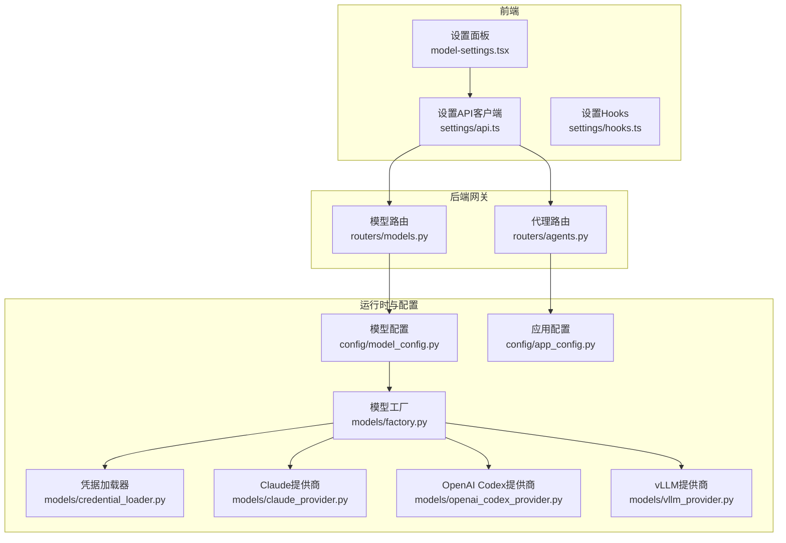
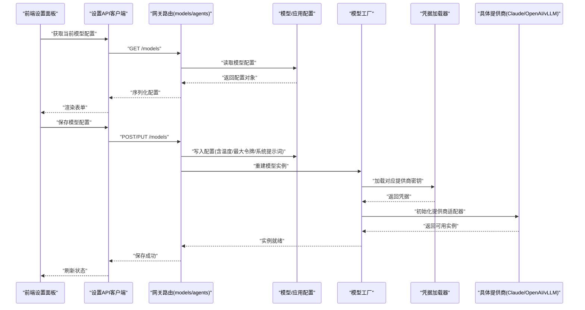
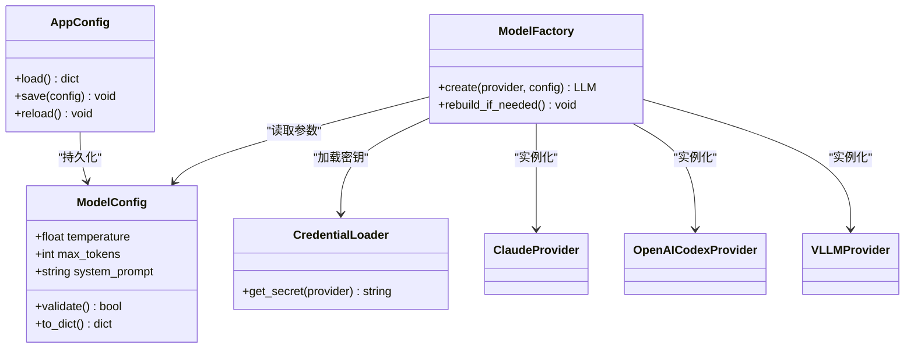
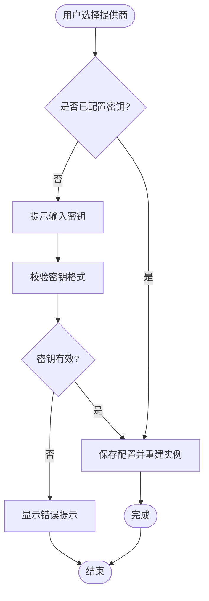
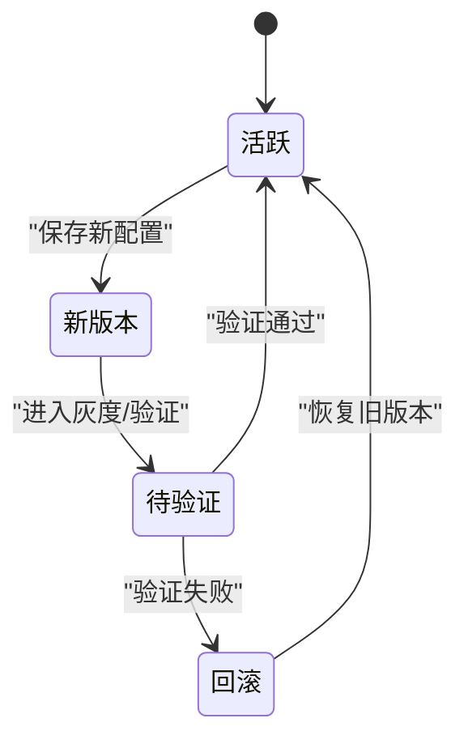
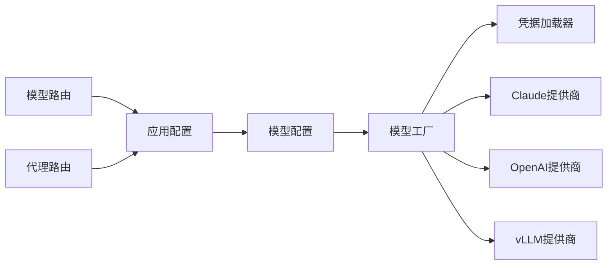

# 代理设置页面

<cite>
**本文引用的文件**   
- [backend/app/gateway/routers/models.py](file://backend/app/gateway/routers/models.py)
- [backend/app/gateway/routers/agents.py](file://backend/app/gateway/routers/agents.py)
- [backend/packages/harness/deerflow/config/model_config.py](file://backend/packages/harness/deerflow/config/model_config.py)
- [backend/packages/harness/deerflow/config/app_config.py](file://backend/packages/harness/deerflow/config/app_config.py)
- [backend/packages/harness/deerflow/models/factory.py](file://backend/packages/harness/deerflow/models/factory.py)
- [backend/packages/harness/deerflow/models/claude_provider.py](file://backend/packages/harness/deerflow/models/claude_provider.py)
- [backend/packages/harness/deerflow/models/openai_codex_provider.py](file://backend/packages/harness/deerflow/models/openai_codex_provider.py)
- [backend/packages/harness/deerflow/models/vllm_provider.py](file://backend/packages/harness/deerflow/models/vllm_provider.py)
- [backend/packages/harness/deerflow/models/credential_loader.py](file://backend/packages/harness/deerflow/models/credential_loader.py)
- [backend/tests/test_model_config.py](file://backend/tests/test_model_config.py)
- [backend/tests/test_credential_loader.py](file://backend/tests/test_credential_loader.py)
- [backend/tests/test_run_worker_rollback.py](file://backend/tests/test_run_worker_rollback.py)
- [frontend/src/components/workspace/settings/index.tsx](file://frontend/src/components/workspace/settings/index.tsx)
- [frontend/src/components/workspace/settings/model-settings.tsx](file://frontend/src/components/workspace/settings/model-settings.tsx)
- [frontend/src/core/settings/api.ts](file://frontend/src/core/settings/api.ts)
- [frontend/src/core/settings/hooks.ts](file://frontend/src/core/settings/hooks.ts)
- [config.example.yaml](file://config.example.yaml)
</cite>

## 目录
1. [简介](#简介)
2. [项目结构](#项目结构)
3. [核心组件](#核心组件)
4. [架构总览](#架构总览)
5. [详细组件分析](#详细组件分析)
6. [依赖关系分析](#依赖关系分析)
7. [性能与监控](#性能与监控)
8. [版本管理与回滚](#版本管理与回滚)
9. [批量操作与模板](#批量操作与模板)
10. [故障排查指南](#故障排查指南)
11. [结论](#结论)

## 简介
本文件面向“代理设置页面”的完整文档，覆盖模型配置界面（LLM提供商选择、API密钥管理、模型参数调优）、代理行为定制（温度、最大令牌数、系统提示词等）、性能监控与调试工具集成、配置版本管理与回滚机制，以及批量操作与模板能力。内容基于后端网关路由、模型工厂与配置模块、前端设置面板与API客户端进行系统化梳理，帮助开发者与运维人员快速理解并正确使用该功能。

## 项目结构
与代理设置相关的前后端关键位置如下：
- 后端网关路由：提供模型与代理配置的查询与更新接口
- 模型工厂与提供商：负责按配置创建具体LLM实例，加载凭据与参数
- 配置模块：集中定义模型与应用级配置项及默认值
- 前端设置面板：提供可视化配置入口，调用后端API完成持久化
- 测试用例：覆盖配置解析、凭据加载、运行回滚等关键路径

图表来源
- [backend/app/gateway/routers/models.py](file://backend/app/gateway/routers/models.py)
- [backend/app/gateway/routers/agents.py](file://backend/app/gateway/routers/agents.py)
- [backend/packages/harness/deerflow/config/model_config.py](file://backend/packages/harness/deerflow/config/model_config.py)
- [backend/packages/harness/deerflow/config/app_config.py](file://backend/packages/harness/deerflow/config/app_config.py)
- [backend/packages/harness/deerflow/models/factory.py](file://backend/packages/harness/deerflow/models/factory.py)
- [backend/packages/harness/deerflow/models/credential_loader.py](file://backend/packages/harness/deerflow/models/credential_loader.py)
- [backend/packages/harness/deerflow/models/claude_provider.py](file://backend/packages/harness/deerflow/models/claude_provider.py)
- [backend/packages/harness/deerflow/models/openai_codex_provider.py](file://backend/packages/harness/deerflow/models/openai_codex_provider.py)
- [backend/packages/harness/deerflow/models/vllm_provider.py](file://backend/packages/harness/deerflow/models/vllm_provider.py)
- [frontend/src/components/workspace/settings/model-settings.tsx](file://frontend/src/components/workspace/settings/model-settings.tsx)
- [frontend/src/core/settings/api.ts](file://frontend/src/core/settings/api.ts)
- [frontend/src/core/settings/hooks.ts](file://frontend/src/core/settings/hooks.ts)

章节来源
- [backend/app/gateway/routers/models.py](file://backend/app/gateway/routers/models.py)
- [backend/app/gateway/routers/agents.py](file://backend/app/gateway/routers/agents.py)
- [backend/packages/harness/deerflow/config/model_config.py](file://backend/packages/harness/deerflow/config/model_config.py)
- [backend/packages/harness/deerflow/config/app_config.py](file://backend/packages/harness/deerflow/config/app_config.py)
- [backend/packages/harness/deerflow/models/factory.py](file://backend/packages/harness/deerflow/models/factory.py)
- [backend/packages/harness/deerflow/models/credential_loader.py](file://backend/packages/harness/deerflow/models/credential_loader.py)
- [backend/packages/harness/deerflow/models/claude_provider.py](file://backend/packages/harness/deerflow/models/claude_provider.py)
- [backend/packages/harness/deerflow/models/openai_codex_provider.py](file://backend/packages/harness/deerflow/models/openai_codex_provider.py)
- [backend/packages/harness/deerflow/models/vllm_provider.py](file://backend/packages/harness/deerflow/models/vllm_provider.py)
- [frontend/src/components/workspace/settings/model-settings.tsx](file://frontend/src/components/workspace/settings/model-settings.tsx)
- [frontend/src/core/settings/api.ts](file://frontend/src/core/settings/api.ts)
- [frontend/src/core/settings/hooks.ts](file://frontend/src/core/settings/hooks.ts)

## 核心组件
- 模型配置与工厂
  - 模型配置模块定义可配置的参数域（如温度、最大令牌数、系统提示词等），并提供校验与默认值策略
  - 模型工厂根据提供商类型与配置动态构建具体LLM实例，统一封装调用契约
- 凭据加载器
  - 从环境变量或安全存储中加载各提供商的API密钥，支持多提供商并存
- 提供商实现
  - 针对不同厂商（如Claude、OpenAI Codex、vLLM）提供适配层，处理鉴权、重试、超时等差异
- 网关路由
  - 暴露模型与代理设置的REST接口，供前端设置面板读写
- 前端设置面板
  - 提供可视化表单，支持保存、预览、切换模型与参数，并通过API客户端与后端交互

章节来源
- [backend/packages/harness/deerflow/config/model_config.py](file://backend/packages/harness/deerflow/config/model_config.py)
- [backend/packages/harness/deerflow/models/factory.py](file://backend/packages/harness/deerflow/models/factory.py)
- [backend/packages/harness/deerflow/models/credential_loader.py](file://backend/packages/harness/deerflow/models/credential_loader.py)
- [backend/packages/harness/deerflow/models/claude_provider.py](file://backend/packages/harness/deerflow/models/claude_provider.py)
- [backend/packages/harness/deerflow/models/openai_codex_provider.py](file://backend/packages/harness/deerflow/models/openai_codex_provider.py)
- [backend/packages/harness/deerflow/models/vllm_provider.py](file://backend/packages/harness/deerflow/models/vllm_provider.py)
- [backend/app/gateway/routers/models.py](file://backend/app/gateway/routers/models.py)
- [backend/app/gateway/routers/agents.py](file://backend/app/gateway/routers/agents.py)
- [frontend/src/components/workspace/settings/model-settings.tsx](file://frontend/src/components/workspace/settings/model-settings.tsx)
- [frontend/src/core/settings/api.ts](file://frontend/src/core/settings/api.ts)

## 架构总览
下图展示从前端设置面板到后端模型工厂与提供商的端到端流程，包括配置读取、凭据加载与实例创建。

图表来源
- [backend/app/gateway/routers/models.py](file://backend/app/gateway/routers/models.py)
- [backend/app/gateway/routers/agents.py](file://backend/app/gateway/routers/agents.py)
- [backend/packages/harness/deerflow/config/model_config.py](file://backend/packages/harness/deerflow/config/model_config.py)
- [backend/packages/harness/deerflow/models/factory.py](file://backend/packages/harness/deerflow/models/factory.py)
- [backend/packages/harness/deerflow/models/credential_loader.py](file://backend/packages/harness/deerflow/models/credential_loader.py)
- [backend/packages/harness/deerflow/models/claude_provider.py](file://backend/packages/harness/deerflow/models/claude_provider.py)
- [backend/packages/harness/deerflow/models/openai_codex_provider.py](file://backend/packages/harness/deerflow/models/openai_codex_provider.py)
- [backend/packages/harness/deerflow/models/vllm_provider.py](file://backend/packages/harness/deerflow/models/vllm_provider.py)
- [frontend/src/components/workspace/settings/model-settings.tsx](file://frontend/src/components/workspace/settings/model-settings.tsx)
- [frontend/src/core/settings/api.ts](file://frontend/src/core/settings/api.ts)

## 详细组件分析

### 模型配置与参数调优
- 支持的参数域
  - 温度：控制生成随机性
  - 最大令牌数：限制输出长度
  - 系统提示词：设定模型角色与约束
  - 其他常见推理参数（如top_p、频率惩罚等）由配置模块统一抽象
- 配置校验与默认值
  - 对数值范围、必填字段进行校验
  - 未显式提供的参数使用默认值，保证向后兼容
- 配置持久化
  - 通过网关路由将配置写入应用配置模块，并在需要时重建模型实例以生效

图表来源
- [backend/packages/harness/deerflow/config/model_config.py](file://backend/packages/harness/deerflow/config/model_config.py)
- [backend/packages/harness/deerflow/config/app_config.py](file://backend/packages/harness/deerflow/config/app_config.py)
- [backend/packages/harness/deerflow/models/factory.py](file://backend/packages/harness/deerflow/models/factory.py)
- [backend/packages/harness/deerflow/models/credential_loader.py](file://backend/packages/harness/deerflow/models/credential_loader.py)
- [backend/packages/harness/deerflow/models/claude_provider.py](file://backend/packages/harness/deerflow/models/claude_provider.py)
- [backend/packages/harness/deerflow/models/openai_codex_provider.py](file://backend/packages/harness/deerflow/models/openai_codex_provider.py)
- [backend/packages/harness/deerflow/models/vllm_provider.py](file://backend/packages/harness/deerflow/models/vllm_provider.py)

章节来源
- [backend/packages/harness/deerflow/config/model_config.py](file://backend/packages/harness/deerflow/config/model_config.py)
- [backend/packages/harness/deerflow/config/app_config.py](file://backend/packages/harness/deerflow/config/app_config.py)
- [backend/packages/harness/deerflow/models/factory.py](file://backend/packages/harness/deerflow/models/factory.py)
- [backend/packages/harness/deerflow/models/credential_loader.py](file://backend/packages/harness/deerflow/models/credential_loader.py)
- [backend/packages/harness/deerflow/models/claude_provider.py](file://backend/packages/harness/deerflow/models/claude_provider.py)
- [backend/packages/harness/deerflow/models/openai_codex_provider.py](file://backend/packages/harness/deerflow/models/openai_codex_provider.py)
- [backend/packages/harness/deerflow/models/vllm_provider.py](file://backend/packages/harness/deerflow/models/vllm_provider.py)

### 提供商选择与API密钥管理
- 提供商选择
  - 前端下拉列表展示已启用的提供商（如Claude、OpenAI Codex、vLLM）
  - 选择后，表单动态显示对应参数与密钥输入框
- 密钥管理
  - 通过凭据加载器从环境变量或安全存储读取密钥
  - 支持热重载：保存配置后重建模型实例，无需重启服务
- 错误处理
  - 缺失密钥或无效格式时，前端即时提示；后端在实例化阶段抛出明确错误信息

图表来源
- [backend/packages/harness/deerflow/models/credential_loader.py](file://backend/packages/harness/deerflow/models/credential_loader.py)
- [backend/packages/harness/deerflow/models/factory.py](file://backend/packages/harness/deerflow/models/factory.py)
- [frontend/src/components/workspace/settings/model-settings.tsx](file://frontend/src/components/workspace/settings/model-settings.tsx)
- [frontend/src/core/settings/api.ts](file://frontend/src/core/settings/api.ts)

章节来源
- [backend/packages/harness/deerflow/models/credential_loader.py](file://backend/packages/harness/deerflow/models/credential_loader.py)
- [backend/packages/harness/deerflow/models/factory.py](file://backend/packages/harness/deerflow/models/factory.py)
- [frontend/src/components/workspace/settings/model-settings.tsx](file://frontend/src/components/workspace/settings/model-settings.tsx)
- [frontend/src/core/settings/api.ts](file://frontend/src/core/settings/api.ts)

### 代理行为定制选项
- 温度参数
  - 影响生成的多样性与创造性，适合创意类任务；较低值更稳定
- 最大令牌数
  - 控制单次响应长度，避免过长输出导致成本与延迟上升
- 系统提示词
  - 用于设定角色、风格、输出格式与安全约束，建议结合业务场景迭代优化
- 其他推理参数
  - 如top_p、频率惩罚等，可在高级设置中调整，注意与温度协同

章节来源
- [backend/packages/harness/deerflow/config/model_config.py](file://backend/packages/harness/deerflow/config/model_config.py)
- [frontend/src/components/workspace/settings/model-settings.tsx](file://frontend/src/components/workspace/settings/model-settings.tsx)

### 代理性能监控与调试工具集成
- 指标采集
  - 建议在网关层记录请求耗时、令牌用量、错误率等指标
- 链路追踪
  - 可通过外部追踪系统（如Langfuse）接入，关联每次代理运行的上下文
- 调试开关
  - 提供调试日志级别与采样率，便于定位问题而不影响线上性能

[本节为通用指导，不直接分析具体文件]

### 代理配置的版本管理与回滚机制
- 版本管理
  - 配置变更应附带版本号或时间戳，形成不可变快照
- 回滚策略
  - 支持一键回滚至上一稳定版本，确保生产环境稳定性
- 运行期回滚
  - 当检测到异常或质量退化时，自动回退到上一个已知良好的配置

图表来源
- [backend/tests/test_run_worker_rollback.py](file://backend/tests/test_run_worker_rollback.py)

章节来源
- [backend/tests/test_run_worker_rollback.py](file://backend/tests/test_run_worker_rollback.py)

### 批量操作与模板功能
- 模板
  - 提供常用场景的配置模板（如“代码助手”、“研究报告”），一键套用
- 批量导入/导出
  - 支持JSON/YAML格式的批量导入导出，便于团队共享与迁移
- 示例配置
  - 参考仓库中的示例配置文件，作为模板基础

章节来源
- [config.example.yaml](file://config.example.yaml)

## 依赖关系分析
- 耦合与内聚
  - 模型工厂与提供商之间松耦合，通过配置驱动实例化
  - 凭据加载器独立于业务逻辑，便于扩展新的密钥来源
- 外部依赖
  - 各提供商SDK与网络库，需关注版本兼容性与限流策略
- 潜在循环依赖
  - 配置模块不应反向依赖工厂，避免启动时循环

图表来源
- [backend/app/gateway/routers/models.py](file://backend/app/gateway/routers/models.py)
- [backend/app/gateway/routers/agents.py](file://backend/app/gateway/routers/agents.py)
- [backend/packages/harness/deerflow/config/app_config.py](file://backend/packages/harness/deerflow/config/app_config.py)
- [backend/packages/harness/deerflow/config/model_config.py](file://backend/packages/harness/deerflow/config/model_config.py)
- [backend/packages/harness/deerflow/models/factory.py](file://backend/packages/harness/deerflow/models/factory.py)
- [backend/packages/harness/deerflow/models/credential_loader.py](file://backend/packages/harness/deerflow/models/credential_loader.py)
- [backend/packages/harness/deerflow/models/claude_provider.py](file://backend/packages/harness/deerflow/models/claude_provider.py)
- [backend/packages/harness/deerflow/models/openai_codex_provider.py](file://backend/packages/harness/deerflow/models/openai_codex_provider.py)
- [backend/packages/harness/deerflow/models/vllm_provider.py](file://backend/packages/harness/deerflow/models/vllm_provider.py)

章节来源
- [backend/app/gateway/routers/models.py](file://backend/app/gateway/routers/models.py)
- [backend/app/gateway/routers/agents.py](file://backend/app/gateway/routers/agents.py)
- [backend/packages/harness/deerflow/config/app_config.py](file://backend/packages/harness/deerflow/config/app_config.py)
- [backend/packages/harness/deerflow/config/model_config.py](file://backend/packages/harness/deerflow/config/model_config.py)
- [backend/packages/harness/deerflow/models/factory.py](file://backend/packages/harness/deerflow/models/factory.py)
- [backend/packages/harness/deerflow/models/credential_loader.py](file://backend/packages/harness/deerflow/models/credential_loader.py)
- [backend/packages/harness/deerflow/models/claude_provider.py](file://backend/packages/harness/deerflow/models/claude_provider.py)
- [backend/packages/harness/deerflow/models/openai_codex_provider.py](file://backend/packages/harness/deerflow/models/openai_codex_provider.py)
- [backend/packages/harness/deerflow/models/vllm_provider.py](file://backend/packages/harness/deerflow/models/vllm_provider.py)

## 性能与监控
- 参数调优建议
  - 降低温度与最大令牌数可减少延迟与成本，但可能影响创造性与完整性
- 缓存与复用
  - 对相同配置下的模型实例进行复用，避免频繁重建
- 监控指标
  - 建议记录QPS、P95/P99延迟、错误率、令牌消耗与供应商账单指标
- 调试技巧
  - 开启调试日志与采样，结合链路追踪定位瓶颈

[本节为通用指导，不直接分析具体文件]

## 版本管理与回滚
- 版本快照
  - 每次保存配置生成不可变快照，包含时间戳与变更摘要
- 灰度与验证
  - 新版本先在小流量或沙箱环境验证，通过后全量发布
- 自动回滚
  - 当监控指标异常或人工触发时，自动恢复到上一个稳定版本

章节来源
- [backend/tests/test_run_worker_rollback.py](file://backend/tests/test_run_worker_rollback.py)

## 批量操作与模板
- 模板库
  - 内置多种业务场景模板，支持自定义模板与分享
- 批量导入导出
  - 通过JSON/YAML批量迁移配置，适用于多租户或多环境部署
- 示例与规范
  - 参考示例配置文件，遵循命名与结构规范，提升一致性

章节来源
- [config.example.yaml](file://config.example.yaml)

## 故障排查指南
- 常见问题
  - 密钥缺失或格式错误：检查凭据加载器与环境变量
  - 模型实例创建失败：核对提供商参数与网络连通性
  - 配置未生效：确认是否触发了实例重建与配置重载
- 测试覆盖
  - 配置解析与校验：参考模型配置测试
  - 凭据加载：参考凭据加载器测试
  - 运行回滚：参考运行工作器回滚测试

章节来源
- [backend/tests/test_model_config.py](file://backend/tests/test_model_config.py)
- [backend/tests/test_credential_loader.py](file://backend/tests/test_credential_loader.py)
- [backend/tests/test_run_worker_rollback.py](file://backend/tests/test_run_worker_rollback.py)

## 结论
代理设置页面围绕“配置—实例—运行”的主线，提供了可视化的模型与代理参数管理能力。通过统一的模型工厂与凭据加载器，实现了多提供商的统一接入与热重载；配合版本管理与回滚机制，保障生产环境的稳定性与可观测性。建议在生产环境中完善监控与追踪，并结合模板与批量操作提升团队协作效率。