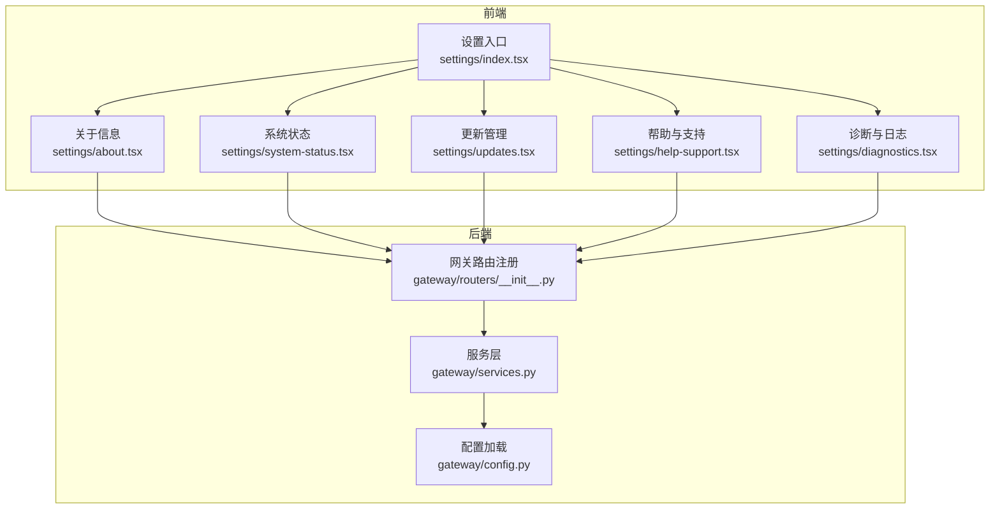
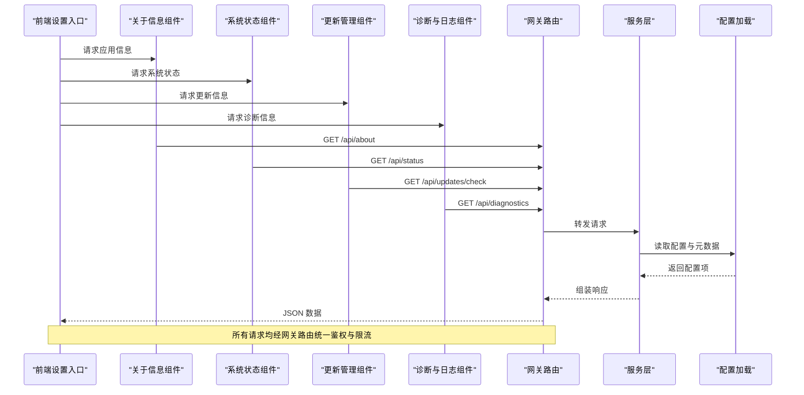
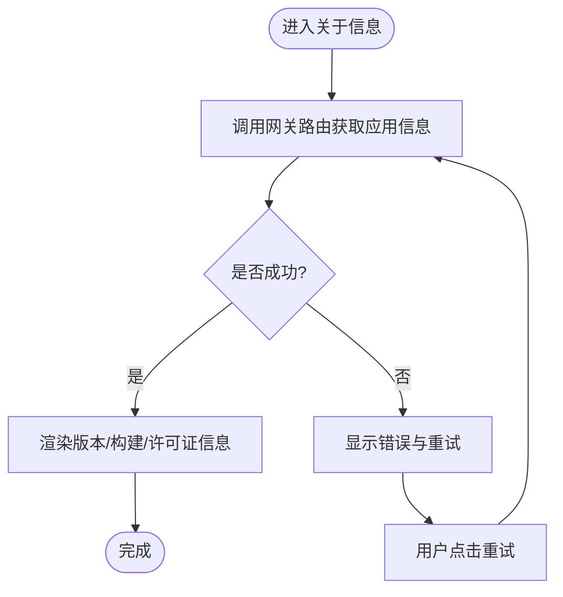
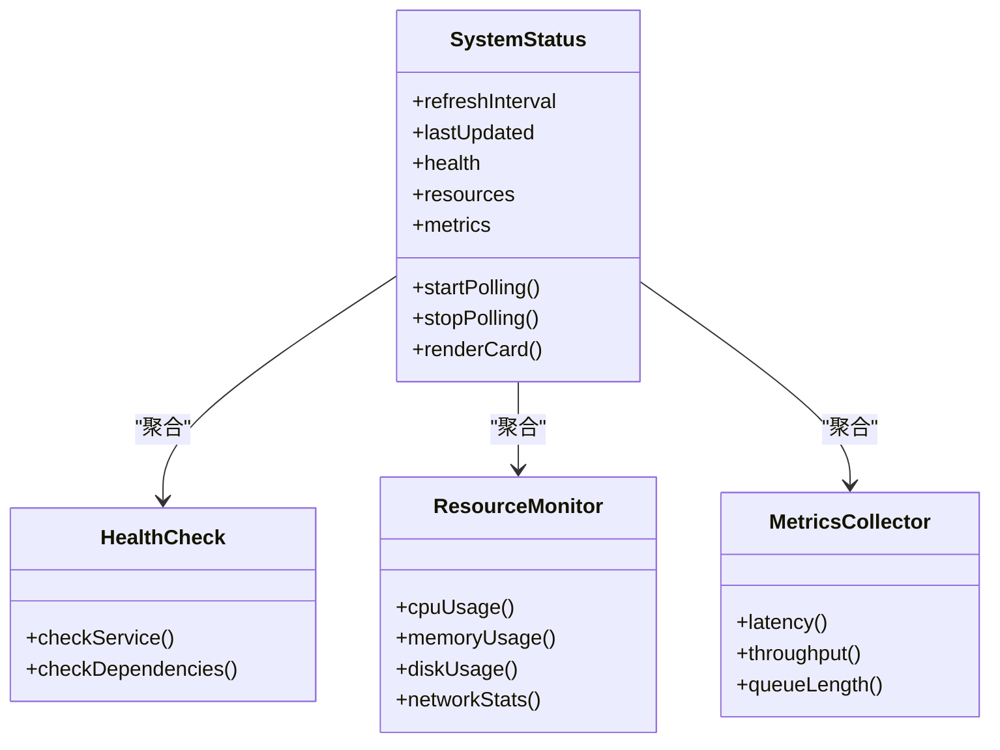
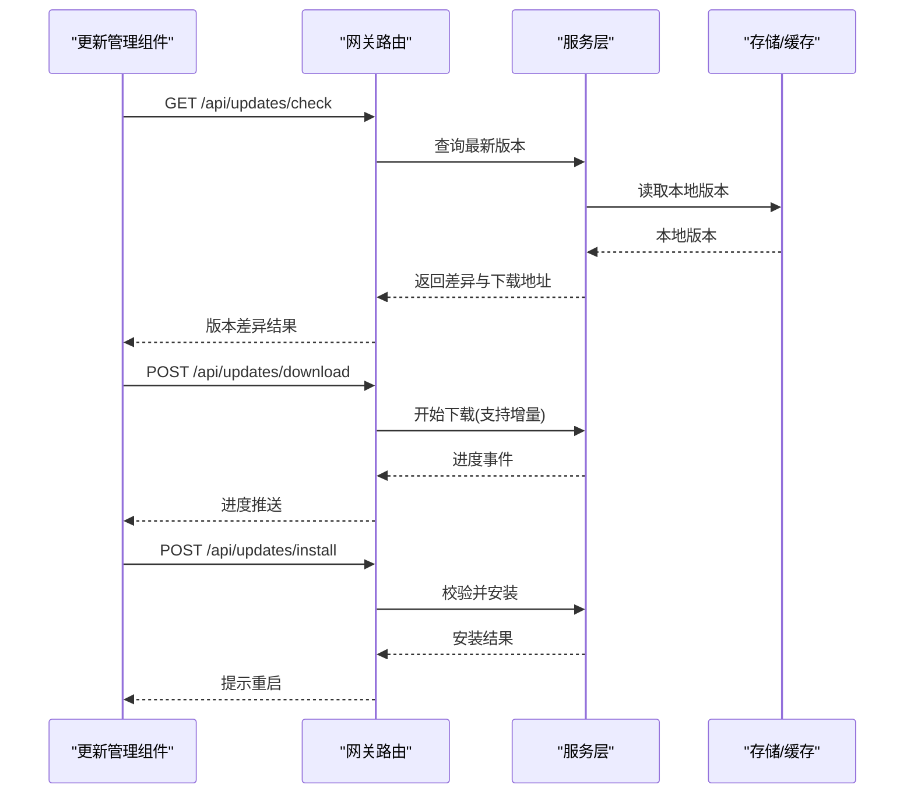
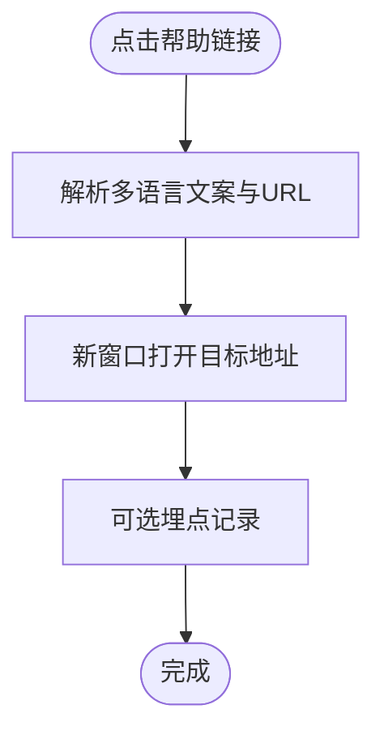
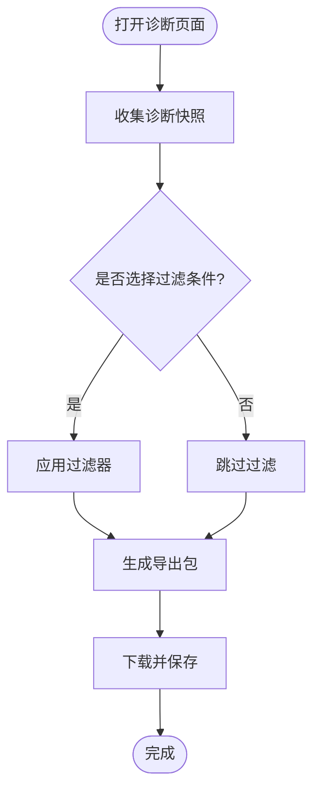
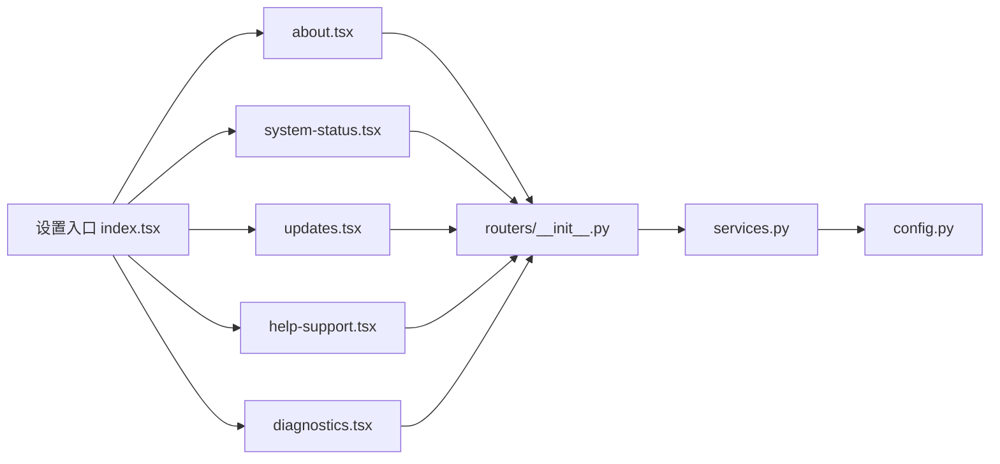

# 关于设置页面

<cite>
**本文引用的文件**   
- [frontend/src/components/workspace/settings/index.tsx](file://frontend/src/components/workspace/settings/index.tsx)
- [frontend/src/components/workspace/settings/about.tsx](file://frontend/src/components/workspace/settings/about.tsx)
- [frontend/src/components/workspace/settings/system-status.tsx](file://frontend/src/components/workspace/settings/system-status.tsx)
- [frontend/src/components/workspace/settings/updates.tsx](file://frontend/src/components/workspace/settings/updates.tsx)
- [frontend/src/components/workspace/settings/help-support.tsx](file://frontend/src/components/workspace/settings/help-support.tsx)
- [frontend/src/components/workspace/settings/diagnostics.tsx](file://frontend/src/components/workspace/settings/diagnostics.tsx)
- [backend/app/gateway/routers/__init__.py](file://backend/app/gateway/routers/__init__.py)
- [backend/app/gateway/services.py](file://backend/app/gateway/services.py)
- [backend/app/gateway/config.py](file://backend/app/gateway/config.py)
</cite>

## 目录
1. [简介](#简介)
2. [项目结构](#项目结构)
3. [核心组件](#核心组件)
4. [架构总览](#架构总览)
5. [详细组件分析](#详细组件分析)
6. [依赖关系分析](#依赖关系分析)
7. [性能考虑](#性能考虑)
8. [故障排查指南](#故障排查指南)
9. [结论](#结论)
10. [附录](#附录)

## 简介
本章节面向“关于设置页面”的完整说明，覆盖以下能力：
- 应用信息展示：版本号、构建信息、许可证信息等元数据。
- 系统状态监控：服务健康检查、资源使用情况、性能指标等实时监控。
- 更新检查与自动更新：版本比较、更新包下载、增量更新机制。
- 帮助文档与技术支持链接集成。
- 诊断信息与日志导出功能。

该页面由前端设置模块聚合多个子面板组成，并通过后端网关路由与服务层提供运行时数据与配置信息。

## 项目结构
“关于设置页面”在前端采用模块化组织，每个功能域一个独立组件；后端通过网关路由暴露统一接口，服务层负责读取配置与收集系统信息。

图表来源
- [frontend/src/components/workspace/settings/index.tsx](file://frontend/src/components/workspace/settings/index.tsx)
- [frontend/src/components/workspace/settings/about.tsx](file://frontend/src/components/workspace/settings/about.tsx)
- [frontend/src/components/workspace/settings/system-status.tsx](file://frontend/src/components/workspace/settings/system-status.tsx)
- [frontend/src/components/workspace/settings/updates.tsx](file://frontend/src/components/workspace/settings/updates.tsx)
- [frontend/src/components/workspace/settings/help-support.tsx](file://frontend/src/components/workspace/settings/help-support.tsx)
- [frontend/src/components/workspace/settings/diagnostics.tsx](file://frontend/src/components/workspace/settings/diagnostics.tsx)
- [backend/app/gateway/routers/__init__.py](file://backend/app/gateway/routers/__init__.py)
- [backend/app/gateway/services.py](file://backend/app/gateway/services.py)
- [backend/app/gateway/config.py](file://backend/app/gateway/config.py)

章节来源
- [frontend/src/components/workspace/settings/index.tsx](file://frontend/src/components/workspace/settings/index.tsx)
- [backend/app/gateway/routers/__init__.py](file://backend/app/gateway/routers/__init__.py)

## 核心组件
- 设置入口（index）：聚合各子面板，提供导航与布局。
- 关于信息（about）：展示应用元数据（版本、构建、许可证）。
- 系统状态（system-status）：健康检查、资源使用、性能指标。
- 更新管理（updates）：版本比较、下载与安装流程。
- 帮助与支持（help-support）：文档与技术支持链接。
- 诊断与日志（diagnostics）：诊断信息收集与日志导出。

章节来源
- [frontend/src/components/workspace/settings/index.tsx](file://frontend/src/components/workspace/settings/index.tsx)
- [frontend/src/components/workspace/settings/about.tsx](file://frontend/src/components/workspace/settings/about.tsx)
- [frontend/src/components/workspace/settings/system-status.tsx](file://frontend/src/components/workspace/settings/system-status.tsx)
- [frontend/src/components/workspace/settings/updates.tsx](file://frontend/src/components/workspace/settings/updates.tsx)
- [frontend/src/components/workspace/settings/help-support.tsx](file://frontend/src/components/workspace/settings/help-support.tsx)
- [frontend/src/components/workspace/settings/diagnostics.tsx](file://frontend/src/components/workspace/settings/diagnostics.tsx)

## 架构总览
“关于设置页面”的前端组件通过统一的网关路由访问后端服务，服务层从配置与运行时环境采集数据并返回给前端渲染。

图表来源
- [frontend/src/components/workspace/settings/index.tsx](file://frontend/src/components/workspace/settings/index.tsx)
- [frontend/src/components/workspace/settings/about.tsx](file://frontend/src/components/workspace/settings/about.tsx)
- [frontend/src/components/workspace/settings/system-status.tsx](file://frontend/src/components/workspace/settings/system-status.tsx)
- [frontend/src/components/workspace/settings/updates.tsx](file://frontend/src/components/workspace/settings/updates.tsx)
- [frontend/src/components/workspace/settings/diagnostics.tsx](file://frontend/src/components/workspace/settings/diagnostics.tsx)
- [backend/app/gateway/routers/__init__.py](file://backend/app/gateway/routers/__init__.py)
- [backend/app/gateway/services.py](file://backend/app/gateway/services.py)
- [backend/app/gateway/config.py](file://backend/app/gateway/config.py)

## 详细组件分析

### 关于信息（应用元数据展示）
- 展示内容
  - 版本号：来自构建或配置中的版本字段。
  - 构建信息：构建时间、提交哈希、构建平台等。
  - 许可证信息：开源协议名称与链接。
- 数据来源
  - 后端服务层从配置加载器获取元数据，并经由网关路由返回。
- 交互流程
  - 进入页面时触发一次拉取；支持手动刷新。
- 错误处理
  - 网络异常或服务不可用时显示降级提示，并提供重试按钮。

图表来源
- [frontend/src/components/workspace/settings/about.tsx](file://frontend/src/components/workspace/settings/about.tsx)
- [backend/app/gateway/routers/__init__.py](file://backend/app/gateway/routers/__init__.py)
- [backend/app/gateway/services.py](file://backend/app/gateway/services.py)
- [backend/app/gateway/config.py](file://backend/app/gateway/config.py)

章节来源
- [frontend/src/components/workspace/settings/about.tsx](file://frontend/src/components/workspace/settings/about.tsx)
- [backend/app/gateway/services.py](file://backend/app/gateway/services.py)
- [backend/app/gateway/config.py](file://backend/app/gateway/config.py)

### 系统状态监控（健康检查、资源使用、性能指标）
- 监控维度
  - 服务健康：进程存活、关键依赖可达性。
  - 资源使用：CPU、内存、磁盘、网络等。
  - 性能指标：请求延迟、吞吐、队列长度等。
- 刷新策略
  - 默认定时轮询，可配置间隔；切换标签页时暂停以节省资源。
- 可视化
  - 指标卡片、趋势图、阈值告警标记。
- 错误与降级
  - 指标采集失败时保留上次有效值并标注“数据过期”。

图表来源
- [frontend/src/components/workspace/settings/system-status.tsx](file://frontend/src/components/workspace/settings/system-status.tsx)
- [backend/app/gateway/routers/__init__.py](file://backend/app/gateway/routers/__init__.py)
- [backend/app/gateway/services.py](file://backend/app/gateway/services.py)

章节来源
- [frontend/src/components/workspace/settings/system-status.tsx](file://frontend/src/components/workspace/settings/system-status.tsx)
- [backend/app/gateway/services.py](file://backend/app/gateway/services.py)

### 更新检查与自动更新（版本比较、下载、增量更新）
- 功能要点
  - 版本比较：本地版本与远端最新版本对比，判断是否需要更新。
  - 更新包下载：支持全量包与增量包两种模式。
  - 自动更新：后台静默下载与安装，必要时提示重启。
- 交互流程
  - 首次进入检查更新；支持手动触发；下载过程显示进度与断点续传。
- 安全校验
  - 下载后执行完整性校验（如签名/哈希），失败则回滚。
- 错误处理
  - 网络中断、空间不足、权限不足等场景给出明确提示与恢复建议。

图表来源
- [frontend/src/components/workspace/settings/updates.tsx](file://frontend/src/components/workspace/settings/updates.tsx)
- [backend/app/gateway/routers/__init__.py](file://backend/app/gateway/routers/__init__.py)
- [backend/app/gateway/services.py](file://backend/app/gateway/services.py)

章节来源
- [frontend/src/components/workspace/settings/updates.tsx](file://frontend/src/components/workspace/settings/updates.tsx)
- [backend/app/gateway/services.py](file://backend/app/gateway/services.py)

### 帮助文档与技术支持链接集成
- 内容范围
  - 在线文档、常见问题、社区论坛、问题反馈表单、联系邮箱等。
- 行为特性
  - 外部链接在新窗口打开；支持多语言文案。
- 扩展方式
  - 通过配置文件集中维护链接列表，便于运营调整。

图表来源
- [frontend/src/components/workspace/settings/help-support.tsx](file://frontend/src/components/workspace/settings/help-support.tsx)

章节来源
- [frontend/src/components/workspace/settings/help-support.tsx](file://frontend/src/components/workspace/settings/help-support.tsx)

### 诊断信息与日志导出
- 诊断信息
  - 运行环境、依赖版本、配置摘要、最近错误堆栈等。
- 日志导出
  - 按时间段筛选、关键字过滤、导出为压缩包。
- 隐私与安全
  - 敏感字段脱敏；仅授权用户可访问。
- 使用场景
  - 问题复现、远程协助、性能回溯。

图表来源
- [frontend/src/components/workspace/settings/diagnostics.tsx](file://frontend/src/components/workspace/settings/diagnostics.tsx)
- [backend/app/gateway/routers/__init__.py](file://backend/app/gateway/routers/__init__.py)
- [backend/app/gateway/services.py](file://backend/app/gateway/services.py)

章节来源
- [frontend/src/components/workspace/settings/diagnostics.tsx](file://frontend/src/components/workspace/settings/diagnostics.tsx)
- [backend/app/gateway/services.py](file://backend/app/gateway/services.py)

## 依赖关系分析
- 前端组件耦合度低，职责单一，通过入口组件进行编排。
- 后端通过网关路由统一收敛，服务层负责业务逻辑与数据聚合，配置加载器提供静态元数据。
- 可能的循环依赖风险：确保路由不直接依赖具体服务实现细节，避免反向引用。

图表来源
- [frontend/src/components/workspace/settings/index.tsx](file://frontend/src/components/workspace/settings/index.tsx)
- [frontend/src/components/workspace/settings/about.tsx](file://frontend/src/components/workspace/settings/about.tsx)
- [frontend/src/components/workspace/settings/system-status.tsx](file://frontend/src/components/workspace/settings/system-status.tsx)
- [frontend/src/components/workspace/settings/updates.tsx](file://frontend/src/components/workspace/settings/updates.tsx)
- [frontend/src/components/workspace/settings/help-support.tsx](file://frontend/src/components/workspace/settings/help-support.tsx)
- [frontend/src/components/workspace/settings/diagnostics.tsx](file://frontend/src/components/workspace/settings/diagnostics.tsx)
- [backend/app/gateway/routers/__init__.py](file://backend/app/gateway/routers/__init__.py)
- [backend/app/gateway/services.py](file://backend/app/gateway/services.py)
- [backend/app/gateway/config.py](file://backend/app/gateway/config.py)

章节来源
- [backend/app/gateway/routers/__init__.py](file://backend/app/gateway/routers/__init__.py)
- [backend/app/gateway/services.py](file://backend/app/gateway/services.py)
- [backend/app/gateway/config.py](file://backend/app/gateway/config.py)

## 性能考虑
- 减少不必要的轮询：系统状态组件应支持按需刷新与节流。
- 增量更新优先：在带宽受限环境下优先使用增量包。
- 缓存策略：关于信息与帮助链接等静态数据可长期缓存。
- 大文件导出：诊断日志导出需分片与压缩，避免阻塞主线程。

## 故障排查指南
- 无法加载应用信息
  - 检查网关路由是否注册、服务层是否正常、配置加载是否成功。
- 系统状态无数据
  - 确认指标采集权限、端口可达性与采样间隔配置。
- 更新检查失败
  - 核对版本源可达性、网络代理与证书；查看下载路径与磁盘空间。
- 诊断导出为空
  - 检查日志轮转策略、导出时间窗与权限控制。

章节来源
- [backend/app/gateway/routers/__init__.py](file://backend/app/gateway/routers/__init__.py)
- [backend/app/gateway/services.py](file://backend/app/gateway/services.py)
- [backend/app/gateway/config.py](file://backend/app/gateway/config.py)

## 结论
“关于设置页面”将应用元数据、系统状态、更新管理与诊断工具整合到统一入口，既满足运维监控需求，也提升用户自助排障效率。通过前后端清晰分层与模块化设计，后续可扩展更多遥测与自动化能力。

## 附录
- 术语
  - 增量更新：仅下载变更部分以降低带宽与时间成本。
  - 健康检查：周期性探测服务与依赖可用性。
  - 诊断快照：包含运行环境与关键日志的打包集合。