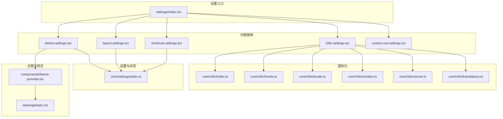
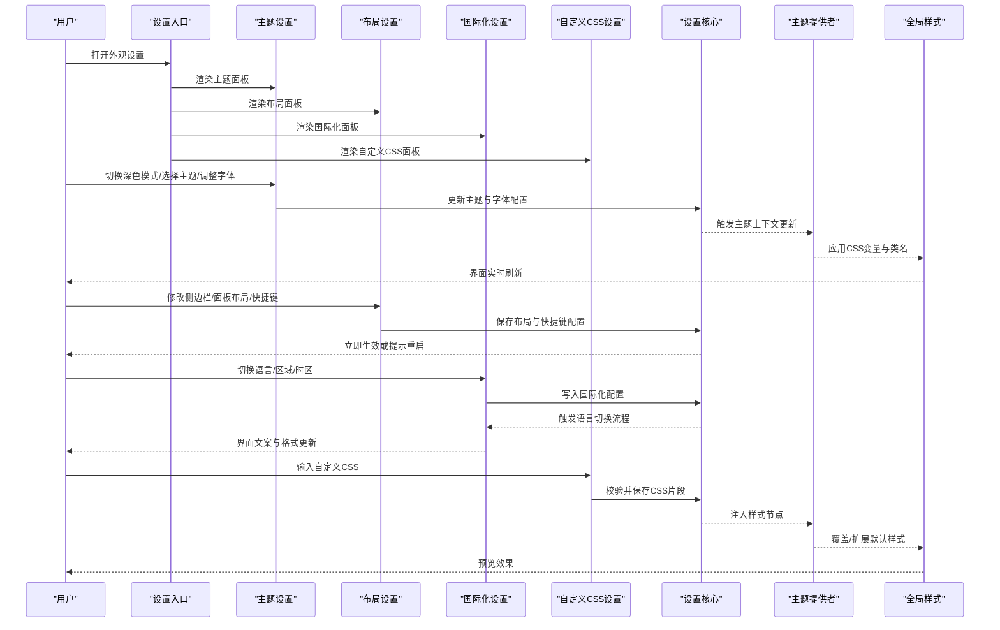
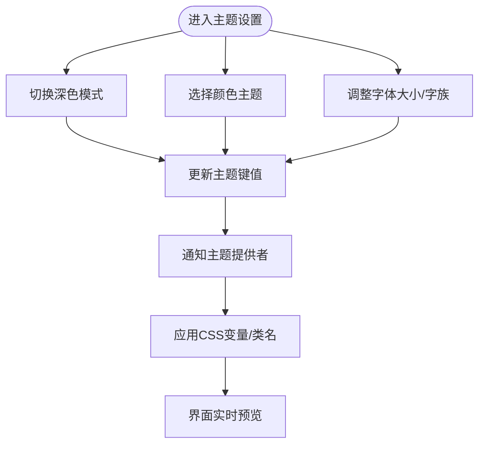
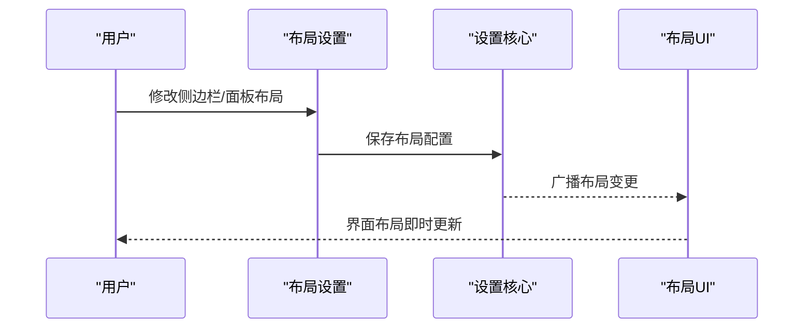
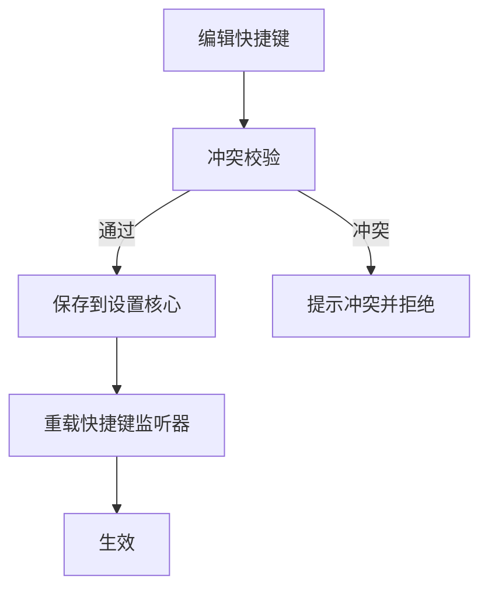
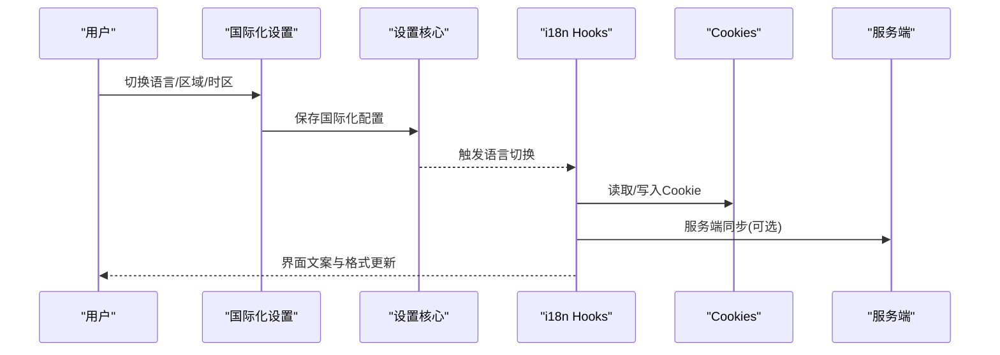
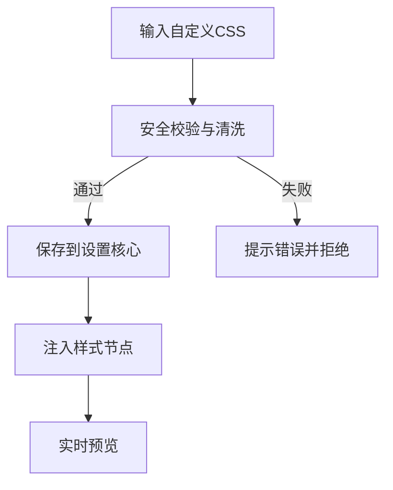
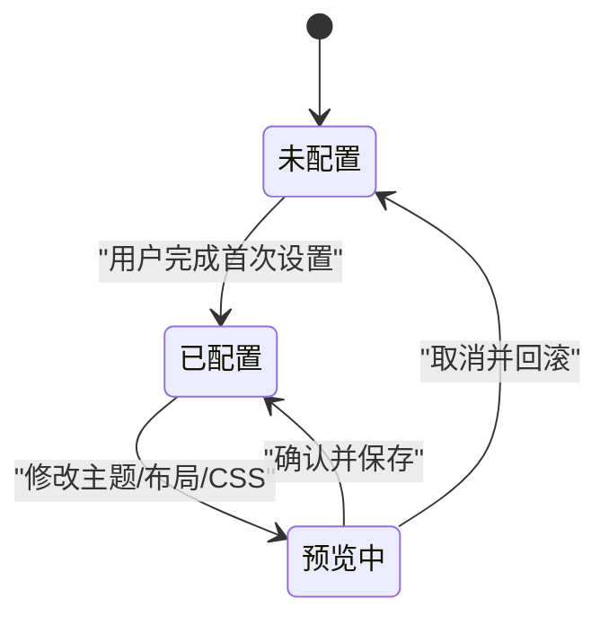
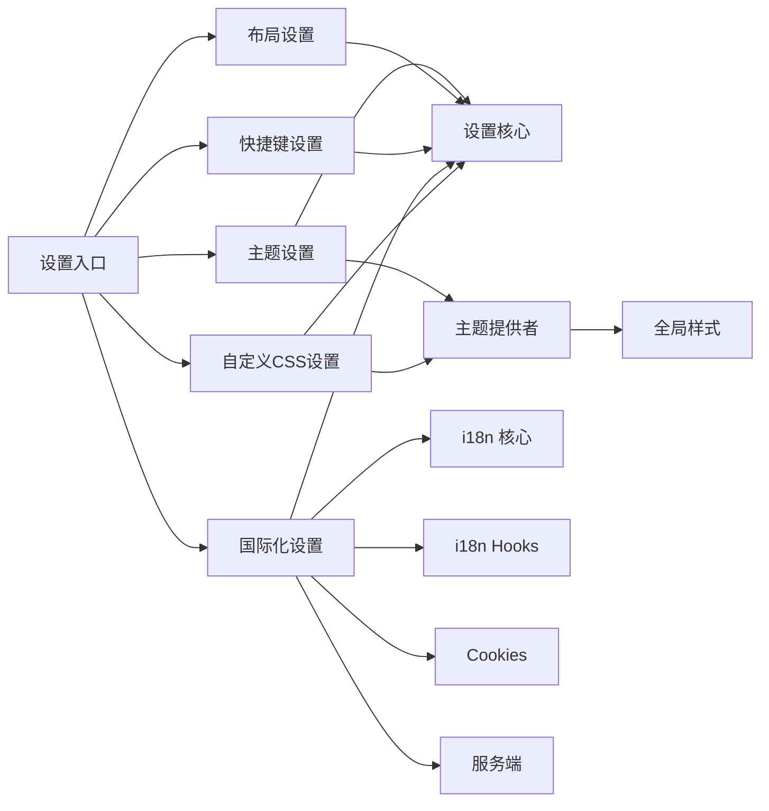

# 外观设置页面

<cite>
**本文引用的文件**   
- [frontend/src/components/workspace/settings/index.tsx](file://frontend/src/components/workspace/settings/index.tsx)
- [frontend/src/components/workspace/settings/theme-settings.tsx](file://frontend/src/components/workspace/settings/theme-settings.tsx)
- [frontend/src/components/workspace/settings/layout-settings.tsx](file://frontend/src/components/workspace/settings/layout-settings.tsx)
- [frontend/src/components/workspace/settings/shortcuts-settings.tsx](file://frontend/src/components/workspace/settings/shortcuts-settings.tsx)
- [frontend/src/components/workspace/settings/i18n-settings.tsx](file://frontend/src/components/workspace/settings/i18n-settings.tsx)
- [frontend/src/components/workspace/settings/custom-css-settings.tsx](file://frontend/src/components/workspace/settings/custom-css-settings.tsx)
- [frontend/src/components/theme-provider.tsx](file://frontend/src/components/theme-provider.tsx)
- [frontend/src/core/settings/index.ts](file://frontend/src/core/settings/index.ts)
- [frontend/src/core/i18n/index.ts](file://frontend/src/core/i18n/index.ts)
- [frontend/src/core/i18n/hooks.ts](file://frontend/src/core/i18n/hooks.ts)
- [frontend/src/core/i18n/locale.ts](file://frontend/src/core/i18n/locale.ts)
- [frontend/src/core/i18n/cookies.ts](file://frontend/src/core/i18n/cookies.ts)
- [frontend/src/core/i18n/server.ts](file://frontend/src/core/i18n/server.ts)
- [frontend/src/core/i18n/translations.ts](file://frontend/src/core/i18n/translations.ts)
- [frontend/src/styles/globals.css](file://frontend/src/styles/globals.css)
</cite>

## 目录
1. [简介](#简介)
2. [项目结构](#项目结构)
3. [核心组件](#核心组件)
4. [架构总览](#架构总览)
5. [详细组件分析](#详细组件分析)
6. [依赖关系分析](#依赖关系分析)
7. [性能考虑](#性能考虑)
8. [故障排查指南](#故障排查指南)
9. [结论](#结论)
10. [附录](#附录)

## 简介
本文件面向“外观设置页面”的完整实现与使用，覆盖主题配置（深色模式、颜色主题、字体）、布局定制（侧边栏显示、面板布局、快捷键）、国际化与本地化（语言切换、区域格式、时区）、主题预览与实时效果展示，以及自定义 CSS 注入与样式覆盖机制。文档从系统架构到具体组件逐一解析，并提供流程图与时序图帮助理解数据流与控制流。

## 项目结构
外观设置相关的前端代码集中在 workspace 下的 settings 子模块，配合全局主题提供者与 i18n 基础设施完成主题与语言的统一管理与持久化。

图表来源
- [frontend/src/components/workspace/settings/index.tsx](file://frontend/src/components/workspace/settings/index.tsx)
- [frontend/src/components/workspace/settings/theme-settings.tsx](file://frontend/src/components/workspace/settings/theme-settings.tsx)
- [frontend/src/components/workspace/settings/layout-settings.tsx](file://frontend/src/components/workspace/settings/layout-settings.tsx)
- [frontend/src/components/workspace/settings/shortcuts-settings.tsx](file://frontend/src/components/workspace/settings/shortcuts-settings.tsx)
- [frontend/src/components/workspace/settings/i18n-settings.tsx](file://frontend/src/components/workspace/settings/i18n-settings.tsx)
- [frontend/src/components/workspace/settings/custom-css-settings.tsx](file://frontend/src/components/workspace/settings/custom-css-settings.tsx)
- [frontend/src/components/theme-provider.tsx](file://frontend/src/components/theme-provider.tsx)
- [frontend/src/core/settings/index.ts](file://frontend/src/core/settings/index.ts)
- [frontend/src/core/i18n/index.ts](file://frontend/src/core/i18n/index.ts)
- [frontend/src/core/i18n/hooks.ts](file://frontend/src/core/i18n/hooks.ts)
- [frontend/src/core/i18n/locale.ts](file://frontend/src/core/i18n/locale.ts)
- [frontend/src/core/i18n/cookies.ts](file://frontend/src/core/i18n/cookies.ts)
- [frontend/src/core/i18n/server.ts](file://frontend/src/core/i18n/server.ts)
- [frontend/src/core/i18n/translations.ts](file://frontend/src/core/i18n/translations.ts)
- [frontend/src/styles/globals.css](file://frontend/src/styles/globals.css)

章节来源
- [frontend/src/components/workspace/settings/index.tsx](file://frontend/src/components/workspace/settings/index.tsx)
- [frontend/src/components/theme-provider.tsx](file://frontend/src/components/theme-provider.tsx)
- [frontend/src/core/settings/index.ts](file://frontend/src/core/settings/index.ts)
- [frontend/src/core/i18n/index.ts](file://frontend/src/core/i18n/index.ts)

## 核心组件
- 设置入口：负责聚合各功能面板并管理标签页导航与状态同步。
- 主题设置：提供深色模式开关、颜色主题选择、字体大小/字族等视觉配置，支持即时预览。
- 布局设置：控制侧边栏显隐、面板布局策略、快捷键映射等。
- 快捷键设置：查看与编辑快捷键绑定，冲突检测与提示。
- 国际化设置：语言切换、区域格式、时区配置，结合服务端与客户端能力进行持久化。
- 自定义 CSS：提供文本编辑器注入自定义样式，支持安全校验与实时预览。

章节来源
- [frontend/src/components/workspace/settings/index.tsx](file://frontend/src/components/workspace/settings/index.tsx)
- [frontend/src/components/workspace/settings/theme-settings.tsx](file://frontend/src/components/workspace/settings/theme-settings.tsx)
- [frontend/src/components/workspace/settings/layout-settings.tsx](file://frontend/src/components/workspace/settings/layout-settings.tsx)
- [frontend/src/components/workspace/settings/shortcuts-settings.tsx](file://frontend/src/components/workspace/settings/shortcuts-settings.tsx)
- [frontend/src/components/workspace/settings/i18n-settings.tsx](file://frontend/src/components/workspace/settings/i18n-settings.tsx)
- [frontend/src/components/workspace/settings/custom-css-settings.tsx](file://frontend/src/components/workspace/settings/custom-css-settings.tsx)

## 架构总览
外观设置通过“设置入口”组织多个功能面板；主题与布局变更由“设置核心”统一管理并持久化；国际化由“i18n 核心 + hooks + locale/cookies/server/translations”协同完成；主题提供者将主题变量注入全局样式，确保实时生效。

图表来源
- [frontend/src/components/workspace/settings/index.tsx](file://frontend/src/components/workspace/settings/index.tsx)
- [frontend/src/components/workspace/settings/theme-settings.tsx](file://frontend/src/components/workspace/settings/theme-settings.tsx)
- [frontend/src/components/workspace/settings/layout-settings.tsx](file://frontend/src/components/workspace/settings/layout-settings.tsx)
- [frontend/src/components/workspace/settings/i18n-settings.tsx](file://frontend/src/components/workspace/settings/i18n-settings.tsx)
- [frontend/src/components/workspace/settings/custom-css-settings.tsx](file://frontend/src/components/workspace/settings/custom-css-settings.tsx)
- [frontend/src/core/settings/index.ts](file://frontend/src/core/settings/index.ts)
- [frontend/src/components/theme-provider.tsx](file://frontend/src/components/theme-provider.tsx)
- [frontend/src/styles/globals.css](file://frontend/src/styles/globals.css)

## 详细组件分析

### 主题设置（Theme Settings）
- 功能要点
  - 深色模式切换：通过主题提供者切换根级主题类，影响全局配色。
  - 颜色主题选择：在预设主题间切换，实时更新 CSS 变量。
  - 字体设置：支持字体大小与字族选择，优先应用于内容区域。
  - 实时预览：所有更改即时生效，无需刷新。
- 交互流程
  - 用户操作 → 调用设置核心更新主题键值 → 主题提供者监听变化 → 注入 CSS 变量/类名 → 全局样式响应。
- 关键路径
  - 主题设置组件：[theme-settings.tsx](file://frontend/src/components/workspace/settings/theme-settings.tsx)
  - 主题提供者：[theme-provider.tsx](file://frontend/src/components/theme-provider.tsx)
  - 设置核心：[core/settings/index.ts](file://frontend/src/core/settings/index.ts)
  - 全局样式：[globals.css](file://frontend/src/styles/globals.css)

图表来源
- [frontend/src/components/workspace/settings/theme-settings.tsx](file://frontend/src/components/workspace/settings/theme-settings.tsx)
- [frontend/src/components/theme-provider.tsx](file://frontend/src/components/theme-provider.tsx)
- [frontend/src/core/settings/index.ts](file://frontend/src/core/settings/index.ts)
- [frontend/src/styles/globals.css](file://frontend/src/styles/globals.css)

章节来源
- [frontend/src/components/workspace/settings/theme-settings.tsx](file://frontend/src/components/workspace/settings/theme-settings.tsx)
- [frontend/src/components/theme-provider.tsx](file://frontend/src/components/theme-provider.tsx)
- [frontend/src/core/settings/index.ts](file://frontend/src/core/settings/index.ts)
- [frontend/src/styles/globals.css](file://frontend/src/styles/globals.css)

### 布局设置（Layout Settings）
- 功能要点
  - 侧边栏显示：可隐藏/展开侧边栏，适配不同屏幕尺寸。
  - 面板布局：调整主工作区与辅助面板的比例与可见性。
  - 快捷键配置：查看当前快捷键映射，支持重置为默认。
- 交互流程
  - 用户修改布局选项 → 写入设置核心 → 布局组件订阅变化 → 重新计算布局与 DOM 结构。
- 关键路径
  - 布局设置组件：[layout-settings.tsx](file://frontend/src/components/workspace/settings/layout-settings.tsx)
  - 设置核心：[core/settings/index.ts](file://frontend/src/core/settings/index.ts)

图表来源
- [frontend/src/components/workspace/settings/layout-settings.tsx](file://frontend/src/components/workspace/settings/layout-settings.tsx)
- [frontend/src/core/settings/index.ts](file://frontend/src/core/settings/index.ts)

章节来源
- [frontend/src/components/workspace/settings/layout-settings.tsx](file://frontend/src/components/workspace/settings/layout-settings.tsx)
- [frontend/src/core/settings/index.ts](file://frontend/src/core/settings/index.ts)

### 快捷键设置（Shortcuts Settings）
- 功能要点
  - 快捷键列表：展示当前所有快捷键及其作用域。
  - 冲突检测：当新绑定与已有快捷键冲突时给出提示。
  - 重置与导出：一键恢复默认或导出当前配置。
- 交互流程
  - 用户编辑快捷键 → 校验冲突 → 写入设置核心 → 全局快捷键监听器更新。
- 关键路径
  - 快捷键设置组件：[shortcuts-settings.tsx](file://frontend/src/components/workspace/settings/shortcuts-settings.tsx)
  - 设置核心：[core/settings/index.ts](file://frontend/src/core/settings/index.ts)

图表来源
- [frontend/src/components/workspace/settings/shortcuts-settings.tsx](file://frontend/src/components/workspace/settings/shortcuts-settings.tsx)
- [frontend/src/core/settings/index.ts](file://frontend/src/core/settings/index.ts)

章节来源
- [frontend/src/components/workspace/settings/shortcuts-settings.tsx](file://frontend/src/components/workspace/settings/shortcuts-settings.tsx)
- [frontend/src/core/settings/index.ts](file://frontend/src/core/settings/index.ts)

### 国际化设置（i18n Settings）
- 功能要点
  - 语言切换：支持多语言，切换后界面文案即时更新。
  - 区域格式：日期、数字、货币等格式化规则。
  - 时区配置：基于浏览器或手动指定时区。
- 交互流程
  - 用户选择语言/区域/时区 → 写入设置核心 → i18n hooks 触发重渲染 → cookies 与服务端同步。
- 关键路径
  - 国际化设置组件：[i18n-settings.tsx](file://frontend/src/components/workspace/settings/i18n-settings.tsx)
  - i18n 核心与工具：[core/i18n/index.ts](file://frontend/src/core/i18n/index.ts)、[hooks.ts](file://frontend/src/core/i18n/hooks.ts)、[locale.ts](file://frontend/src/core/i18n/locale.ts)、[cookies.ts](file://frontend/src/core/i18n/cookies.ts)、[server.ts](file://frontend/src/core/i18n/server.ts)、[translations.ts](file://frontend/src/core/i18n/translations.ts)
  - 设置核心：[core/settings/index.ts](file://frontend/src/core/settings/index.ts)

图表来源
- [frontend/src/components/workspace/settings/i18n-settings.tsx](file://frontend/src/components/workspace/settings/i18n-settings.tsx)
- [frontend/src/core/i18n/index.ts](file://frontend/src/core/i18n/index.ts)
- [frontend/src/core/i18n/hooks.ts](file://frontend/src/core/i18n/hooks.ts)
- [frontend/src/core/i18n/locale.ts](file://frontend/src/core/i18n/locale.ts)
- [frontend/src/core/i18n/cookies.ts](file://frontend/src/core/i18n/cookies.ts)
- [frontend/src/core/i18n/server.ts](file://frontend/src/core/i18n/server.ts)
- [frontend/src/core/i18n/translations.ts](file://frontend/src/core/i18n/translations.ts)
- [frontend/src/core/settings/index.ts](file://frontend/src/core/settings/index.ts)

章节来源
- [frontend/src/components/workspace/settings/i18n-settings.tsx](file://frontend/src/components/workspace/settings/i18n-settings.tsx)
- [frontend/src/core/i18n/index.ts](file://frontend/src/core/i18n/index.ts)
- [frontend/src/core/i18n/hooks.ts](file://frontend/src/core/i18n/hooks.ts)
- [frontend/src/core/i18n/locale.ts](file://frontend/src/core/i18n/locale.ts)
- [frontend/src/core/i18n/cookies.ts](file://frontend/src/core/i18n/cookies.ts)
- [frontend/src/core/i18n/server.ts](file://frontend/src/core/i18n/server.ts)
- [frontend/src/core/i18n/translations.ts](file://frontend/src/core/i18n/translations.ts)
- [frontend/src/core/settings/index.ts](file://frontend/src/core/settings/index.ts)

### 自定义 CSS 设置（Custom CSS）
- 功能要点
  - 文本编辑器：用于编写自定义 CSS。
  - 安全校验：过滤危险语法与外部资源引用。
  - 实时预览：注入到页面后即时生效，支持撤销与回滚。
- 交互流程
  - 用户输入 CSS → 校验与清洗 → 写入设置核心 → 主题提供者注入样式节点 → 全局样式覆盖。
- 关键路径
  - 自定义 CSS 设置组件：[custom-css-settings.tsx](file://frontend/src/components/workspace/settings/custom-css-settings.tsx)
  - 主题提供者：[theme-provider.tsx](file://frontend/src/components/theme-provider.tsx)
  - 设置核心：[core/settings/index.ts](file://frontend/src/core/settings/index.ts)
  - 全局样式：[globals.css](file://frontend/src/styles/globals.css)

图表来源
- [frontend/src/components/workspace/settings/custom-css-settings.tsx](file://frontend/src/components/workspace/settings/custom-css-settings.tsx)
- [frontend/src/components/theme-provider.tsx](file://frontend/src/components/theme-provider.tsx)
- [frontend/src/core/settings/index.ts](file://frontend/src/core/settings/index.ts)
- [frontend/src/styles/globals.css](file://frontend/src/styles/globals.css)

章节来源
- [frontend/src/components/workspace/settings/custom-css-settings.tsx](file://frontend/src/components/workspace/settings/custom-css-settings.tsx)
- [frontend/src/components/theme-provider.tsx](file://frontend/src/components/theme-provider.tsx)
- [frontend/src/core/settings/index.ts](file://frontend/src/core/settings/index.ts)
- [frontend/src/styles/globals.css](file://frontend/src/styles/globals.css)

### 概念总览
以下图示为概念性流程，不直接对应具体源码文件，用于帮助理解整体设计思路。

## 依赖关系分析
- 组件耦合
  - 设置入口对各个功能面板弱耦合，通过路由/标签页组织。
  - 主题与布局均依赖设置核心进行状态读写，避免组件间直接共享状态。
  - 国际化设置依赖 i18n 核心与 hooks，同时与 cookies 和服务端协作。
- 外部依赖
  - 主题提供者与全局样式共同决定最终渲染效果。
  - 国际化服务可能依赖浏览器 API 与 Cookie。
- 潜在循环依赖
  - 通过设置核心作为单一状态源，降低组件间循环依赖风险。

图表来源
- [frontend/src/components/workspace/settings/index.tsx](file://frontend/src/components/workspace/settings/index.tsx)
- [frontend/src/components/workspace/settings/theme-settings.tsx](file://frontend/src/components/workspace/settings/theme-settings.tsx)
- [frontend/src/components/workspace/settings/layout-settings.tsx](file://frontend/src/components/workspace/settings/layout-settings.tsx)
- [frontend/src/components/workspace/settings/shortcuts-settings.tsx](file://frontend/src/components/workspace/settings/shortcuts-settings.tsx)
- [frontend/src/components/workspace/settings/i18n-settings.tsx](file://frontend/src/components/workspace/settings/i18n-settings.tsx)
- [frontend/src/components/workspace/settings/custom-css-settings.tsx](file://frontend/src/components/workspace/settings/custom-css-settings.tsx)
- [frontend/src/core/settings/index.ts](file://frontend/src/core/settings/index.ts)
- [frontend/src/components/theme-provider.tsx](file://frontend/src/components/theme-provider.tsx)
- [frontend/src/styles/globals.css](file://frontend/src/styles/globals.css)
- [frontend/src/core/i18n/index.ts](file://frontend/src/core/i18n/index.ts)
- [frontend/src/core/i18n/hooks.ts](file://frontend/src/core/i18n/hooks.ts)
- [frontend/src/core/i18n/cookies.ts](file://frontend/src/core/i18n/cookies.ts)
- [frontend/src/core/i18n/server.ts](file://frontend/src/core/i18n/server.ts)

章节来源
- [frontend/src/components/workspace/settings/index.tsx](file://frontend/src/components/workspace/settings/index.tsx)
- [frontend/src/core/settings/index.ts](file://frontend/src/core/settings/index.ts)
- [frontend/src/components/theme-provider.tsx](file://frontend/src/components/theme-provider.tsx)
- [frontend/src/core/i18n/index.ts](file://frontend/src/core/i18n/index.ts)

## 性能考虑
- 主题与布局变更应批量更新，减少不必要的重渲染。
- 自定义 CSS 注入前进行轻量校验，避免复杂正则导致的卡顿。
- 国际化切换时按需加载翻译资源，避免一次性加载全部语言包。
- 使用 CSS 变量与类名切换替代大量条件渲染，提升渲染效率。

## 故障排查指南
- 主题未生效
  - 检查主题提供者是否正确挂载，确认 CSS 变量是否被注入。
  - 验证全局样式是否被第三方样式覆盖。
- 语言切换无效
  - 检查 i18n hooks 是否订阅了语言变更事件。
  - 确认 cookies 读写权限与服务端同步逻辑是否正常。
- 自定义 CSS 报错
  - 查看安全校验日志，确认是否存在非法语法或外部资源引用。
  - 尝试清空自定义 CSS 以定位问题。
- 快捷键冲突
  - 使用冲突检测提示，逐步解除重复绑定。
  - 重置为默认配置后重新分配。

章节来源
- [frontend/src/components/workspace/settings/custom-css-settings.tsx](file://frontend/src/components/workspace/settings/custom-css-settings.tsx)
- [frontend/src/components/workspace/settings/i18n-settings.tsx](file://frontend/src/components/workspace/settings/i18n-settings.tsx)
- [frontend/src/components/workspace/settings/shortcuts-settings.tsx](file://frontend/src/components/workspace/settings/shortcuts-settings.tsx)
- [frontend/src/components/theme-provider.tsx](file://frontend/src/components/theme-provider.tsx)
- [frontend/src/core/i18n/hooks.ts](file://frontend/src/core/i18n/hooks.ts)
- [frontend/src/core/i18n/cookies.ts](file://frontend/src/core/i18n/cookies.ts)

## 结论
外观设置页面通过清晰的组件分层与统一的设置核心，实现了主题、布局、快捷键、国际化与自定义样式的集中管理。主题提供者与全局样式确保了实时预览与一致体验，i18n 体系提供了跨语言与区域的灵活配置。建议在生产环境加强自定义 CSS 的安全校验与审计，并对国际化资源进行按需加载以提升性能。

## 附录
- 最佳实践
  - 使用 CSS 变量定义主题色，便于动态切换。
  - 将布局与快捷键配置拆分为独立模块，便于测试与维护。
  - 国际化文案按模块拆分，避免单文件过大。
- 参考路径
  - 设置入口：[index.tsx](file://frontend/src/components/workspace/settings/index.tsx)
  - 主题设置：[theme-settings.tsx](file://frontend/src/components/workspace/settings/theme-settings.tsx)
  - 布局设置：[layout-settings.tsx](file://frontend/src/components/workspace/settings/layout-settings.tsx)
  - 快捷键设置：[shortcuts-settings.tsx](file://frontend/src/components/workspace/settings/shortcuts-settings.tsx)
  - 国际化设置：[i18n-settings.tsx](file://frontend/src/components/workspace/settings/i18n-settings.tsx)
  - 自定义 CSS：[custom-css-settings.tsx](file://frontend/src/components/workspace/settings/custom-css-settings.tsx)
  - 主题提供者：[theme-provider.tsx](file://frontend/src/components/theme-provider.tsx)
  - 设置核心：[core/settings/index.ts](file://frontend/src/core/settings/index.ts)
  - 国际化核心：[core/i18n/index.ts](file://frontend/src/core/i18n/index.ts)
  - 国际化 Hooks：[core/i18n/hooks.ts](file://frontend/src/core/i18n/hooks.ts)
  - 国际化 Locale：[core/i18n/locale.ts](file://frontend/src/core/i18n/locale.ts)
  - 国际化 Cookies：[core/i18n/cookies.ts](file://frontend/src/core/i18n/cookies.ts)
  - 国际化 Server：[core/i18n/server.ts](file://frontend/src/core/i18n/server.ts)
  - 国际化 Translations：[core/i18n/translations.ts](file://frontend/src/core/i18n/translations.ts)
  - 全局样式：[globals.css](file://frontend/src/styles/globals.css)