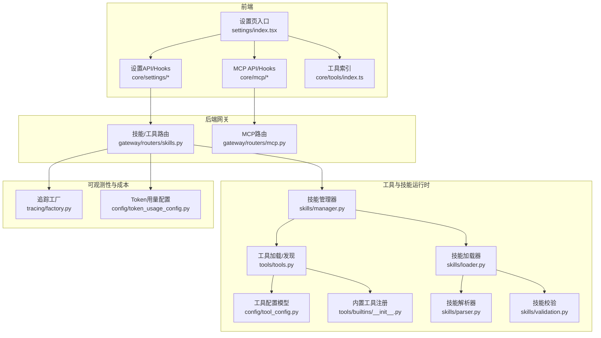
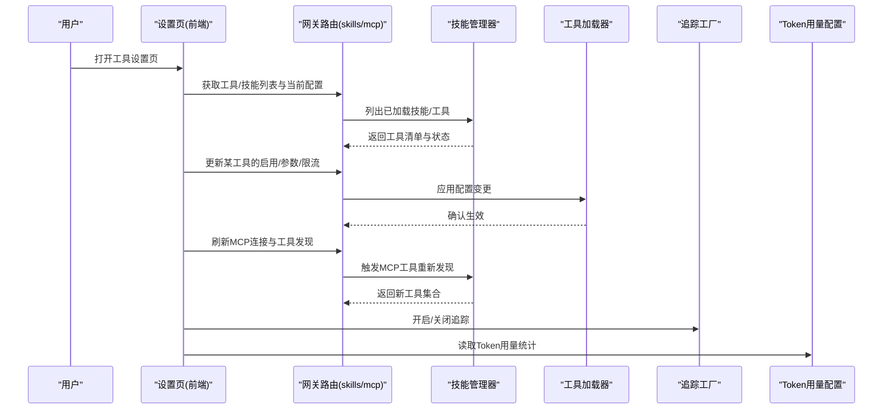
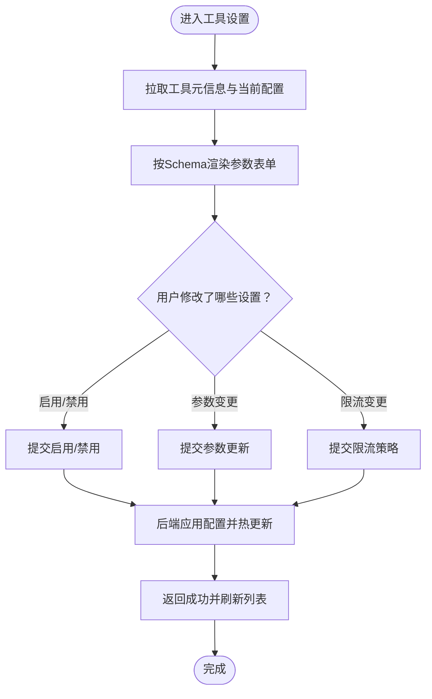
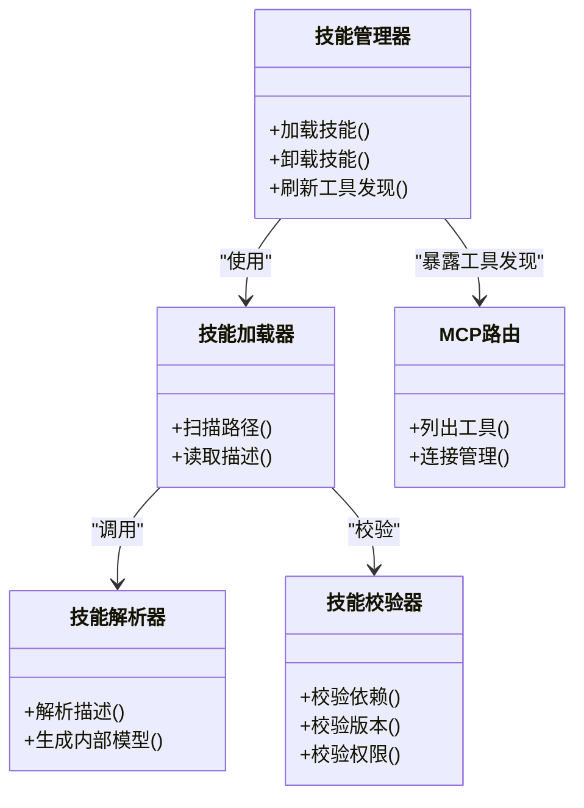
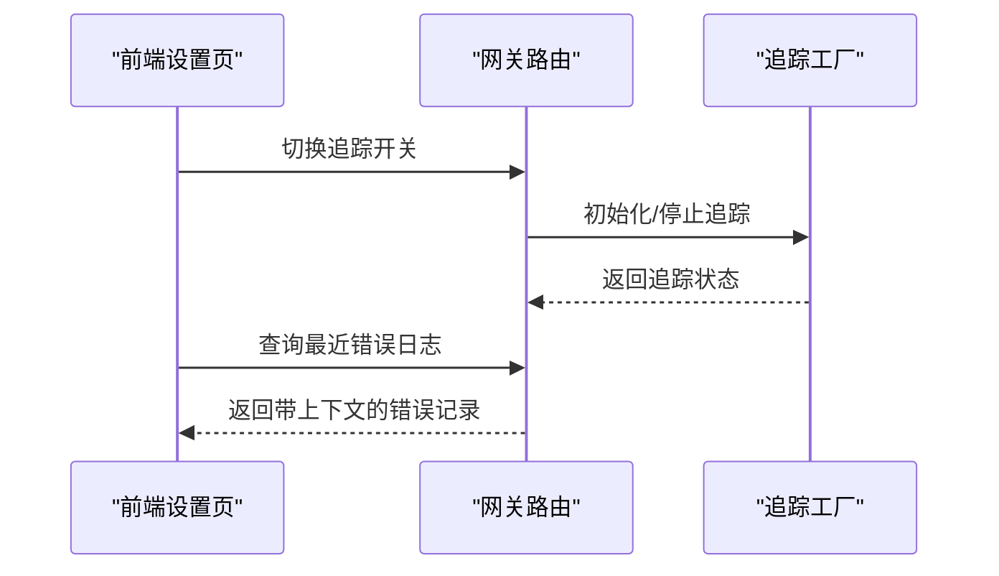
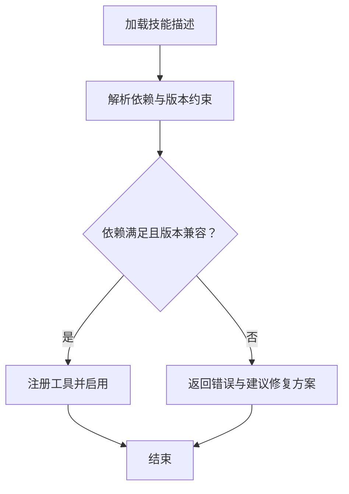
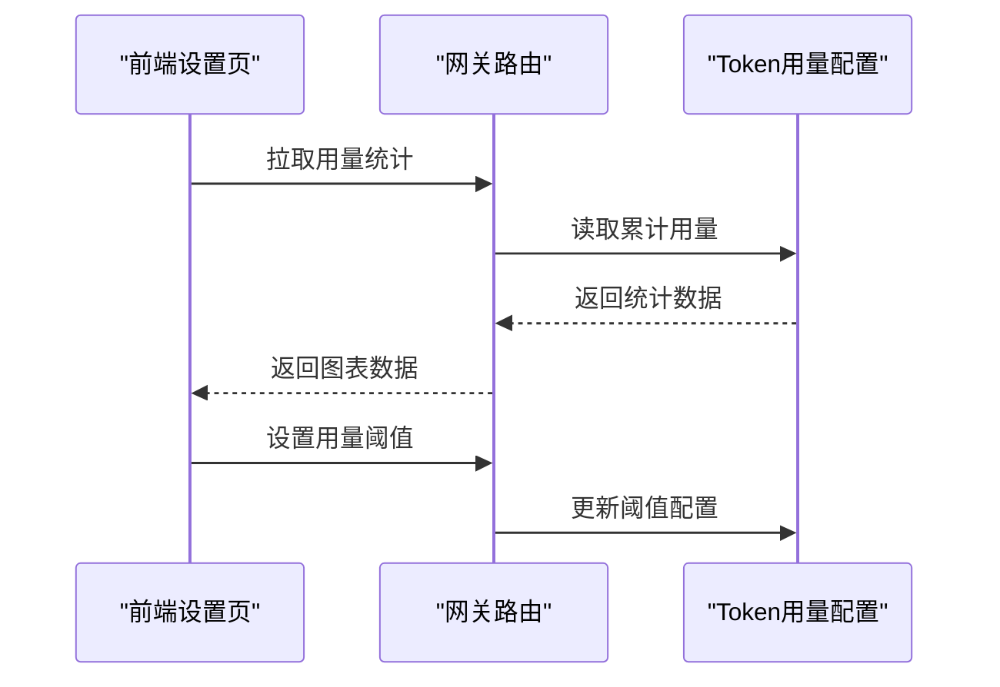
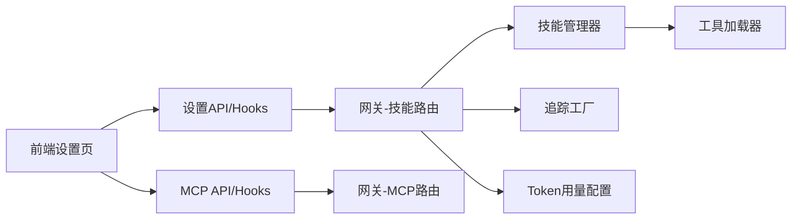

# 工具设置页面

<cite>
**本文引用的文件**   
- [backend/app/gateway/routers/skills.py](file://backend/app/gateway/routers/skills.py)
- [backend/app/gateway/routers/mcp.py](file://backend/app/gateway/routers/mcp.py)
- [backend/packages/harness/deerflow/config/tool_config.py](file://backend/packages/harness/deerflow/config/tool_config.py)
- [backend/packages/harness/deerflow/tools/builtins/__init__.py](file://backend/packages/harness/deerflow/tools/builtins/__init__.py)
- [backend/packages/harness/deerflow/tools/tools.py](file://backend/packages/harness/deerflow/tools/tools.py)
- [backend/packages/harness/deerflow/skills/manager.py](file://backend/packages/harness/deerflow/skills/manager.py)
- [backend/packages/harness/deerflow/skills/loader.py](file://backend/packages/harness/deerflow/skills/loader.py)
- [backend/packages/harness/deerflow/skills/parser.py](file://backend/packages/harness/deerflow/skills/parser.py)
- [backend/packages/harness/deerflow/skills/validation.py](file://backend/packages/harness/deerflow/skills/validation.py)
- [backend/packages/harness/deerflow/tracing/factory.py](file://backend/packages/harness/deerflow/tracing/factory.py)
- [backend/packages/harness/deerflow/config/token_usage_config.py](file://backend/packages/harness/deerflow/config/token_usage_config.py)
- [frontend/src/components/workspace/settings/index.tsx](file://frontend/src/components/workspace/settings/index.tsx)
- [frontend/src/core/settings/api.ts](file://frontend/src/core/settings/api.ts)
- [frontend/src/core/settings/hooks.ts](file://frontend/src/core/settings/hooks.ts)
- [frontend/src/core/mcp/api.ts](file://frontend/src/core/mcp/api.ts)
- [frontend/src/core/mcp/hooks.ts](file://frontend/src/core/mcp/hooks.ts)
- [frontend/src/core/tools/index.ts](file://frontend/src/core/tools/index.ts)
- [config.example.yaml](file://config.example.yaml)
- [extensions_config.example.json](file://extensions_config.example.json)
</cite>

## 目录
1. [简介](#简介)
2. [项目结构](#项目结构)
3. [核心组件](#核心组件)
4. [架构总览](#架构总览)
5. [详细组件分析](#详细组件分析)
6. [依赖关系分析](#依赖关系分析)
7. [性能与限流](#性能与限流)
8. [故障排查指南](#故障排查指南)
9. [结论](#结论)
10. [附录](#附录)

## 简介
本文件面向“工具设置页面”的完整文档，覆盖以下能力：
- 内置工具配置界面：启用/禁用、参数调整、调用频率限制等
- 自定义工具管理：工具注册、API端点配置、认证方式设置
- 工具性能监控与错误日志查看
- 工具依赖管理与版本兼容性检查
- 测试环境与调试工具集成
- 使用统计与成本分析（Token用量）

## 项目结构
从前后端协同的角度，工具设置相关的关键位置如下：
- 前端设置入口与通用设置模块
  - 设置页入口与聚合视图：[frontend/src/components/workspace/settings/index.tsx](file://frontend/src/components/workspace/settings/index.tsx)
  - 设置数据获取与状态钩子：[frontend/src/core/settings/api.ts](file://frontend/src/core/settings/api.ts)、[frontend/src/core/settings/hooks.ts](file://frontend/src/core/settings/hooks.ts)
  - MCP客户端接口与钩子：[frontend/src/core/mcp/api.ts](file://frontend/src/core/mcp/api.ts)、[frontend/src/core/mcp/hooks.ts](file://frontend/src/core/mcp/hooks.ts)
  - 工具能力索引（供前端展示/筛选）：[frontend/src/core/tools/index.ts](file://frontend/src/core/tools/index.ts)
- 后端网关路由（对外暴露的工具/技能/MCP配置接口）
  - 技能/工具列表与配置接口：[backend/app/gateway/routers/skills.py](file://backend/app/gateway/routers/skills.py)
  - MCP服务端配置与管理接口：[backend/app/gateway/routers/mcp.py](file://backend/app/gateway/routers/mcp.py)
- 工具与技能运行时
  - 工具配置模型与默认值：[backend/packages/harness/deerflow/config/tool_config.py](file://backend/packages/harness/deerflow/config/tool_config.py)
  - 内置工具集合与注册入口：[backend/packages/harness/deerflow/tools/builtins/__init__.py](file://backend/packages/harness/deerflow/tools/builtins/__init__.py)
  - 工具加载与发现：[backend/packages/harness/deerflow/tools/tools.py](file://backend/packages/harness/deerflow/tools/tools.py)
  - 技能管理器与生命周期：[backend/packages/harness/deerflow/skills/manager.py](file://backend/packages/harness/deerflow/skills/manager.py)
  - 技能加载器与解析器：[backend/packages/harness/deerflow/skills/loader.py](file://backend/packages/harness/deerflow/skills/loader.py)、[backend/packages/harness/deerflow/skills/parser.py](file://backend/packages/harness/deerflow/skills/parser.py)
  - 技能校验与约束：[backend/packages/harness/deerflow/skills/validation.py](file://backend/packages/harness/deerflow/skills/validation.py)
- 可观测性与成本
  - 追踪工厂（用于链路追踪/诊断）：[backend/packages/harness/deerflow/tracing/factory.py](file://backend/packages/harness/deerflow/tracing/factory.py)
  - Token用量配置（成本分析基础）：[backend/packages/harness/deerflow/config/token_usage_config.py](file://backend/packages/harness/deerflow/config/token_usage_config.py)
- 示例配置
  - 全局配置示例：[config.example.yaml](file://config.example.yaml)
  - 扩展配置示例：[extensions_config.example.json](file://extensions_config.example.json)

**图表来源**
- [frontend/src/components/workspace/settings/index.tsx](file://frontend/src/components/workspace/settings/index.tsx)
- [frontend/src/core/settings/api.ts](file://frontend/src/core/settings/api.ts)
- [frontend/src/core/settings/hooks.ts](file://frontend/src/core/settings/hooks.ts)
- [frontend/src/core/mcp/api.ts](file://frontend/src/core/mcp/api.ts)
- [frontend/src/core/mcp/hooks.ts](file://frontend/src/core/mcp/hooks.ts)
- [frontend/src/core/tools/index.ts](file://frontend/src/core/tools/index.ts)
- [backend/app/gateway/routers/skills.py](file://backend/app/gateway/routers/skills.py)
- [backend/app/gateway/routers/mcp.py](file://backend/app/gateway/routers/mcp.py)
- [backend/packages/harness/deerflow/config/tool_config.py](file://backend/packages/harness/deerflow/config/tool_config.py)
- [backend/packages/harness/deerflow/tools/builtins/__init__.py](file://backend/packages/harness/deerflow/tools/builtins/__init__.py)
- [backend/packages/harness/deerflow/tools/tools.py](file://backend/packages/harness/deerflow/tools/tools.py)
- [backend/packages/harness/deerflow/skills/manager.py](file://backend/packages/harness/deerflow/skills/manager.py)
- [backend/packages/harness/deerflow/skills/loader.py](file://backend/packages/harness/deerflow/skills/loader.py)
- [backend/packages/harness/deerflow/skills/parser.py](file://backend/packages/harness/deerflow/skills/parser.py)
- [backend/packages/harness/deerflow/skills/validation.py](file://backend/packages/harness/deerflow/skills/validation.py)
- [backend/packages/harness/deerflow/tracing/factory.py](file://backend/packages/harness/deerflow/tracing/factory.py)
- [backend/packages/harness/deerflow/config/token_usage_config.py](file://backend/packages/harness/deerflow/config/token_usage_config.py)

**章节来源**
- [frontend/src/components/workspace/settings/index.tsx](file://frontend/src/components/workspace/settings/index.tsx)
- [frontend/src/core/settings/api.ts](file://frontend/src/core/settings/api.ts)
- [frontend/src/core/settings/hooks.ts](file://frontend/src/core/settings/hooks.ts)
- [frontend/src/core/mcp/api.ts](file://frontend/src/core/mcp/api.ts)
- [frontend/src/core/mcp/hooks.ts](file://frontend/src/core/mcp/hooks.ts)
- [frontend/src/core/tools/index.ts](file://frontend/src/core/tools/index.ts)
- [backend/app/gateway/routers/skills.py](file://backend/app/gateway/routers/skills.py)
- [backend/app/gateway/routers/mcp.py](file://backend/app/gateway/routers/mcp.py)
- [backend/packages/harness/deerflow/config/tool_config.py](file://backend/packages/harness/deerflow/config/tool_config.py)
- [backend/packages/harness/deerflow/tools/builtins/__init__.py](file://backend/packages/harness/deerflow/tools/builtins/__init__.py)
- [backend/packages/harness/deerflow/tools/tools.py](file://backend/packages/harness/deerflow/tools/tools.py)
- [backend/packages/harness/deerflow/skills/manager.py](file://backend/packages/harness/deerflow/skills/manager.py)
- [backend/packages/harness/deerflow/skills/loader.py](file://backend/packages/harness/deerflow/skills/loader.py)
- [backend/packages/harness/deerflow/skills/parser.py](file://backend/packages/harness/deerflow/skills/parser.py)
- [backend/packages/harness/deerflow/skills/validation.py](file://backend/packages/harness/deerflow/skills/validation.py)
- [backend/packages/harness/deerflow/tracing/factory.py](file://backend/packages/harness/deerflow/tracing/factory.py)
- [backend/packages/harness/deerflow/config/token_usage_config.py](file://backend/packages/harness/deerflow/config/token_usage_config.py)

## 核心组件
- 设置页入口与聚合视图
  - 负责聚合“工具/技能/MCP/追踪/Token用量”等设置项，提供统一交互入口。
  - 参考路径：[frontend/src/components/workspace/settings/index.tsx](file://frontend/src/components/workspace/settings/index.tsx)
- 设置数据层
  - 封装对后端的设置查询与更新请求；提供React Hooks以驱动UI状态。
  - 参考路径：[frontend/src/core/settings/api.ts](file://frontend/src/core/settings/api.ts)、[frontend/src/core/settings/hooks.ts](file://frontend/src/core/settings/hooks.ts)
- MCP客户端集成
  - 提供MCP配置读取、连接、刷新等能力，支撑自定义工具通过MCP接入。
  - 参考路径：[frontend/src/core/mcp/api.ts](file://frontend/src/core/mcp/api.ts)、[frontend/src/core/mcp/hooks.ts](file://frontend/src/core/mcp/hooks.ts)
- 工具索引
  - 汇总可用工具元信息，便于在设置页进行筛选与分组展示。
  - 参考路径：[frontend/src/core/tools/index.ts](file://frontend/src/core/tools/index.ts)
- 后端技能/工具路由
  - 暴露工具/技能的列表、详情、启用/禁用、参数更新等接口。
  - 参考路径：[backend/app/gateway/routers/skills.py](file://backend/app/gateway/routers/skills.py)
- 后端MCP路由
  - 暴露MCP服务配置、连接状态、工具发现等接口。
  - 参考路径：[backend/app/gateway/routers/mcp.py](file://backend/app/gateway/routers/mcp.py)
- 工具配置模型
  - 定义工具的启用开关、参数Schema、限流策略等字段。
  - 参考路径：[backend/packages/harness/deerflow/config/tool_config.py](file://backend/packages/harness/deerflow/config/tool_config.py)
- 内置工具注册与加载
  - 集中注册内置工具，并在启动时完成发现与初始化。
  - 参考路径：[backend/packages/harness/deerflow/tools/builtins/__init__.py](file://backend/packages/harness/deerflow/tools/builtins/__init__.py)、[backend/packages/harness/deerflow/tools/tools.py](file://backend/packages/harness/deerflow/tools/tools.py)
- 技能管理器与生命周期
  - 负责技能的加载、校验、运行期管理以及与工具集成的桥接。
  - 参考路径：[backend/packages/harness/deerflow/skills/manager.py](file://backend/packages/harness/deerflow/skills/manager.py)
- 技能加载与解析
  - 从文件系统或包中加载技能描述，解析为结构化配置。
  - 参考路径：[backend/packages/harness/deerflow/skills/loader.py](file://backend/packages/harness/deerflow/skills/loader.py)、[backend/packages/harness/deerflow/skills/parser.py](file://backend/packages/harness/deerflow/skills/parser.py)
- 技能校验
  - 对技能元数据、依赖、版本等进行静态校验，确保兼容与安全。
  - 参考路径：[backend/packages/harness/deerflow/skills/validation.py](file://backend/packages/harness/deerflow/skills/validation.py)
- 可观测性与成本
  - 追踪工厂：注入链路追踪上下文，辅助定位问题。
  - Token用量配置：记录并上报Token消耗，作为成本分析依据。
  - 参考路径：[backend/packages/harness/deerflow/tracing/factory.py](file://backend/packages/harness/deerflow/tracing/factory.py)、[backend/packages/harness/deerflow/config/token_usage_config.py](file://backend/packages/harness/deerflow/config/token_usage_config.py)

**章节来源**
- [frontend/src/components/workspace/settings/index.tsx](file://frontend/src/components/workspace/settings/index.tsx)
- [frontend/src/core/settings/api.ts](file://frontend/src/core/settings/api.ts)
- [frontend/src/core/settings/hooks.ts](file://frontend/src/core/settings/hooks.ts)
- [frontend/src/core/mcp/api.ts](file://frontend/src/core/mcp/api.ts)
- [frontend/src/core/mcp/hooks.ts](file://frontend/src/core/mcp/hooks.ts)
- [frontend/src/core/tools/index.ts](file://frontend/src/core/tools/index.ts)
- [backend/app/gateway/routers/skills.py](file://backend/app/gateway/routers/skills.py)
- [backend/app/gateway/routers/mcp.py](file://backend/app/gateway/routers/mcp.py)
- [backend/packages/harness/deerflow/config/tool_config.py](file://backend/packages/harness/deerflow/config/tool_config.py)
- [backend/packages/harness/deerflow/tools/builtins/__init__.py](file://backend/packages/harness/deerflow/tools/builtins/__init__.py)
- [backend/packages/harness/deerflow/tools/tools.py](file://backend/packages/harness/deerflow/tools/tools.py)
- [backend/packages/harness/deerflow/skills/manager.py](file://backend/packages/harness/deerflow/skills/manager.py)
- [backend/packages/harness/deerflow/skills/loader.py](file://backend/packages/harness/deerflow/skills/loader.py)
- [backend/packages/harness/deerflow/skills/parser.py](file://backend/packages/harness/deerflow/skills/parser.py)
- [backend/packages/harness/deerflow/skills/validation.py](file://backend/packages/harness/deerflow/skills/validation.py)
- [backend/packages/harness/deerflow/tracing/factory.py](file://backend/packages/harness/deerflow/tracing/factory.py)
- [backend/packages/harness/deerflow/config/token_usage_config.py](file://backend/packages/harness/deerflow/config/token_usage_config.py)

## 架构总览
下图展示了“工具设置页面”的前后端交互与关键运行时组件的关系。

**图表来源**
- [backend/app/gateway/routers/skills.py](file://backend/app/gateway/routers/skills.py)
- [backend/app/gateway/routers/mcp.py](file://backend/app/gateway/routers/mcp.py)
- [backend/packages/harness/deerflow/skills/manager.py](file://backend/packages/harness/deerflow/skills/manager.py)
- [backend/packages/harness/deerflow/tools/tools.py](file://backend/packages/harness/deerflow/tools/tools.py)
- [backend/packages/harness/deerflow/tracing/factory.py](file://backend/packages/harness/deerflow/tracing/factory.py)
- [backend/packages/harness/deerflow/config/token_usage_config.py](file://backend/packages/harness/deerflow/config/token_usage_config.py)

## 详细组件分析

### 内置工具配置界面
- 功能要点
  - 工具启用/禁用：通过设置页开关控制工具是否参与执行。
  - 参数调整：基于工具配置的Schema动态渲染表单，支持必填/可选、类型校验。
  - 调用频率限制：在工具配置中设置QPS/并发上限，避免外部依赖过载。
- 实现要点
  - 前端通过设置API拉取工具元信息与当前配置，渲染对应控件。
  - 后端根据工具配置模型校验并持久化变更，随后由工具加载器热更新。
- 关键路径
  - 前端：[frontend/src/components/workspace/settings/index.tsx](file://frontend/src/components/workspace/settings/index.tsx)、[frontend/src/core/settings/api.ts](file://frontend/src/core/settings/api.ts)、[frontend/src/core/settings/hooks.ts](file://frontend/src/core/settings/hooks.ts)
  - 后端：[backend/app/gateway/routers/skills.py](file://backend/app/gateway/routers/skills.py)、[backend/packages/harness/deerflow/config/tool_config.py](file://backend/packages/harness/deerflow/config/tool_config.py)、[backend/packages/harness/deerflow/tools/tools.py](file://backend/packages/harness/deerflow/tools/tools.py)

**图表来源**
- [frontend/src/core/settings/api.ts](file://frontend/src/core/settings/api.ts)
- [backend/app/gateway/routers/skills.py](file://backend/app/gateway/routers/skills.py)
- [backend/packages/harness/deerflow/config/tool_config.py](file://backend/packages/harness/deerflow/config/tool_config.py)
- [backend/packages/harness/deerflow/tools/tools.py](file://backend/packages/harness/deerflow/tools/tools.py)

**章节来源**
- [frontend/src/components/workspace/settings/index.tsx](file://frontend/src/components/workspace/settings/index.tsx)
- [frontend/src/core/settings/api.ts](file://frontend/src/core/settings/api.ts)
- [frontend/src/core/settings/hooks.ts](file://frontend/src/core/settings/hooks.ts)
- [backend/app/gateway/routers/skills.py](file://backend/app/gateway/routers/skills.py)
- [backend/packages/harness/deerflow/config/tool_config.py](file://backend/packages/harness/deerflow/config/tool_config.py)
- [backend/packages/harness/deerflow/tools/tools.py](file://backend/packages/harness/deerflow/tools/tools.py)

### 自定义工具管理（注册、API端点、认证）
- 功能要点
  - 工具注册：将自定义工具以“技能”形式纳入系统，支持本地文件或远程包。
  - API端点配置：为工具定义HTTP/SDK端点、鉴权头、超时等。
  - 认证方式设置：支持多种认证模式（如密钥、OAuth），在配置中声明并在调用时注入。
- 实现要点
  - 技能加载器扫描并加载技能描述，解析器将其转换为内部模型。
  - 校验器对依赖、版本、权限范围进行检查，失败则拒绝加载。
  - 通过MCP路由暴露工具发现与连接管理，前端可实时刷新。
- 关键路径
  - 加载与解析：[backend/packages/harness/deerflow/skills/loader.py](file://backend/packages/harness/deerflow/skills/loader.py)、[backend/packages/harness/deerflow/skills/parser.py](file://backend/packages/harness/deerflow/skills/parser.py)
  - 校验与依赖：[backend/packages/harness/deerflow/skills/validation.py](file://backend/packages/harness/deerflow/skills/validation.py)
  - 生命周期管理：[backend/packages/harness/deerflow/skills/manager.py](file://backend/packages/harness/deerflow/skills/manager.py)
  - MCP集成：[backend/app/gateway/routers/mcp.py](file://backend/app/gateway/routers/mcp.py)、[frontend/src/core/mcp/api.ts](file://frontend/src/core/mcp/api.ts)、[frontend/src/core/mcp/hooks.ts](file://frontend/src/core/mcp/hooks.ts)

**图表来源**
- [backend/packages/harness/deerflow/skills/manager.py](file://backend/packages/harness/deerflow/skills/manager.py)
- [backend/packages/harness/deerflow/skills/loader.py](file://backend/packages/harness/deerflow/skills/loader.py)
- [backend/packages/harness/deerflow/skills/parser.py](file://backend/packages/harness/deerflow/skills/parser.py)
- [backend/packages/harness/deerflow/skills/validation.py](file://backend/packages/harness/deerflow/skills/validation.py)
- [backend/app/gateway/routers/mcp.py](file://backend/app/gateway/routers/mcp.py)

**章节来源**
- [backend/packages/harness/deerflow/skills/manager.py](file://backend/packages/harness/deerflow/skills/manager.py)
- [backend/packages/harness/deerflow/skills/loader.py](file://backend/packages/harness/deerflow/skills/loader.py)
- [backend/packages/harness/deerflow/skills/parser.py](file://backend/packages/harness/deerflow/skills/parser.py)
- [backend/packages/harness/deerflow/skills/validation.py](file://backend/packages/harness/deerflow/skills/validation.py)
- [backend/app/gateway/routers/mcp.py](file://backend/app/gateway/routers/mcp.py)
- [frontend/src/core/mcp/api.ts](file://frontend/src/core/mcp/api.ts)
- [frontend/src/core/mcp/hooks.ts](file://frontend/src/core/mcp/hooks.ts)

### 工具性能监控与错误日志查看
- 功能要点
  - 追踪开关：在设置页启用/关闭追踪，便于定位慢调用与异常。
  - 错误日志：结合追踪上下文，查看工具调用的输入输出、耗时与错误堆栈。
- 实现要点
  - 追踪工厂负责创建/注入追踪上下文，并与网关路由协作记录事件。
  - 前端通过设置API切换追踪开关，并在日志面板中查看结果。
- 关键路径
  - 追踪工厂：[backend/packages/harness/deerflow/tracing/factory.py](file://backend/packages/harness/deerflow/tracing/factory.py)
  - 网关路由（集成追踪）：[backend/app/gateway/routers/skills.py](file://backend/app/gateway/routers/skills.py)

**图表来源**
- [backend/packages/harness/deerflow/tracing/factory.py](file://backend/packages/harness/deerflow/tracing/factory.py)
- [backend/app/gateway/routers/skills.py](file://backend/app/gateway/routers/skills.py)

**章节来源**
- [backend/packages/harness/deerflow/tracing/factory.py](file://backend/packages/harness/deerflow/tracing/factory.py)
- [backend/app/gateway/routers/skills.py](file://backend/app/gateway/routers/skills.py)

### 工具依赖管理与版本兼容性检查
- 功能要点
  - 依赖声明：在技能描述中声明Python包/系统依赖。
  - 版本约束：指定最小/最大兼容版本，防止不兼容升级导致故障。
  - 预检与回滚：加载前进行依赖与版本校验，失败则拒绝启用并提供修复建议。
- 实现要点
  - 加载器读取依赖清单，解析器构建依赖图，校验器执行版本匹配。
  - 若检测到冲突，前端显示告警并阻止启用。
- 关键路径
  - 加载与解析：[backend/packages/harness/deerflow/skills/loader.py](file://backend/packages/harness/deerflow/skills/loader.py)、[backend/packages/harness/deerflow/skills/parser.py](file://backend/packages/harness/deerflow/skills/parser.py)
  - 校验逻辑：[backend/packages/harness/deerflow/skills/validation.py](file://backend/packages/harness/deerflow/skills/validation.py)

**图表来源**
- [backend/packages/harness/deerflow/skills/loader.py](file://backend/packages/harness/deerflow/skills/loader.py)
- [backend/packages/harness/deerflow/skills/parser.py](file://backend/packages/harness/deerflow/skills/parser.py)
- [backend/packages/harness/deerflow/skills/validation.py](file://backend/packages/harness/deerflow/skills/validation.py)

**章节来源**
- [backend/packages/harness/deerflow/skills/loader.py](file://backend/packages/harness/deerflow/skills/loader.py)
- [backend/packages/harness/deerflow/skills/parser.py](file://backend/packages/harness/deerflow/skills/parser.py)
- [backend/packages/harness/deerflow/skills/validation.py](file://backend/packages/harness/deerflow/skills/validation.py)

### 测试环境与调试工具集成
- 功能要点
  - 沙箱/隔离：在受控环境中执行工具，降低风险。
  - 断点与回放：结合追踪上下文，复现问题并验证修复。
  - 快速验证：在设置页直接对工具进行“试运行”，观察输入输出。
- 实现要点
  - 通过技能管理器与工具加载器协调沙箱环境，前端提供“试运行”入口。
  - 追踪工厂记录完整上下文，便于回放与对比。
- 关键路径
  - 技能管理器：[backend/packages/harness/deerflow/skills/manager.py](file://backend/packages/harness/deerflow/skills/manager.py)
  - 工具加载器：[backend/packages/harness/deerflow/tools/tools.py](file://backend/packages/harness/deerflow/tools/tools.py)
  - 追踪工厂：[backend/packages/harness/deerflow/tracing/factory.py](file://backend/packages/harness/deerflow/tracing/factory.py)

**章节来源**
- [backend/packages/harness/deerflow/skills/manager.py](file://backend/packages/harness/deerflow/skills/manager.py)
- [backend/packages/harness/deerflow/tools/tools.py](file://backend/packages/harness/deerflow/tools/tools.py)
- [backend/packages/harness/deerflow/tracing/factory.py](file://backend/packages/harness/deerflow/tracing/factory.py)

### 使用统计与成本分析（Token用量）
- 功能要点
  - Token用量采集：在工具调用链路上记录Token消耗。
  - 成本可视化：在设置页展示各工具的用量趋势与占比。
  - 阈值告警：当用量超过阈值时提示管理员。
- 实现要点
  - 通过Token用量配置收集指标，并在网关路由中聚合上报。
  - 前端定时拉取统计数据进行展示。
- 关键路径
  - Token用量配置：[backend/packages/harness/deerflow/config/token_usage_config.py](file://backend/packages/harness/deerflow/config/token_usage_config.py)
  - 网关路由（聚合统计）：[backend/app/gateway/routers/skills.py](file://backend/app/gateway/routers/skills.py)

**图表来源**
- [backend/packages/harness/deerflow/config/token_usage_config.py](file://backend/packages/harness/deerflow/config/token_usage_config.py)
- [backend/app/gateway/routers/skills.py](file://backend/app/gateway/routers/skills.py)

**章节来源**
- [backend/packages/harness/deerflow/config/token_usage_config.py](file://backend/packages/harness/deerflow/config/token_usage_config.py)
- [backend/app/gateway/routers/skills.py](file://backend/app/gateway/routers/skills.py)

## 依赖关系分析
- 组件耦合
  - 前端设置页依赖设置API与MCP API，间接依赖后端网关路由。
  - 网关路由依赖技能管理器与工具加载器，形成“配置→加载→运行”的链路。
  - 追踪与Token用量作为横切关注点，贯穿网关与工具调用。
- 潜在循环依赖
  - 技能管理器与工具加载器之间应保持单向依赖，避免循环。
- 外部依赖
  - 自定义工具可能依赖第三方API或服务，需在技能描述中声明并通过认证配置注入。

**图表来源**
- [frontend/src/components/workspace/settings/index.tsx](file://frontend/src/components/workspace/settings/index.tsx)
- [frontend/src/core/settings/api.ts](file://frontend/src/core/settings/api.ts)
- [frontend/src/core/settings/hooks.ts](file://frontend/src/core/settings/hooks.ts)
- [frontend/src/core/mcp/api.ts](file://frontend/src/core/mcp/api.ts)
- [frontend/src/core/mcp/hooks.ts](file://frontend/src/core/mcp/hooks.ts)
- [backend/app/gateway/routers/skills.py](file://backend/app/gateway/routers/skills.py)
- [backend/app/gateway/routers/mcp.py](file://backend/app/gateway/routers/mcp.py)
- [backend/packages/harness/deerflow/skills/manager.py](file://backend/packages/harness/deerflow/skills/manager.py)
- [backend/packages/harness/deerflow/tools/tools.py](file://backend/packages/harness/deerflow/tools/tools.py)
- [backend/packages/harness/deerflow/tracing/factory.py](file://backend/packages/harness/deerflow/tracing/factory.py)
- [backend/packages/harness/deerflow/config/token_usage_config.py](file://backend/packages/harness/deerflow/config/token_usage_config.py)

**章节来源**
- [frontend/src/components/workspace/settings/index.tsx](file://frontend/src/components/workspace/settings/index.tsx)
- [frontend/src/core/settings/api.ts](file://frontend/src/core/settings/api.ts)
- [frontend/src/core/settings/hooks.ts](file://frontend/src/core/settings/hooks.ts)
- [frontend/src/core/mcp/api.ts](file://frontend/src/core/mcp/api.ts)
- [frontend/src/core/mcp/hooks.ts](file://frontend/src/core/mcp/hooks.ts)
- [backend/app/gateway/routers/skills.py](file://backend/app/gateway/routers/skills.py)
- [backend/app/gateway/routers/mcp.py](file://backend/app/gateway/routers/mcp.py)
- [backend/packages/harness/deerflow/skills/manager.py](file://backend/packages/harness/deerflow/skills/manager.py)
- [backend/packages/harness/deerflow/tools/tools.py](file://backend/packages/harness/deerflow/tools/tools.py)
- [backend/packages/harness/deerflow/tracing/factory.py](file://backend/packages/harness/deerflow/tracing/factory.py)
- [backend/packages/harness/deerflow/config/token_usage_config.py](file://backend/packages/harness/deerflow/config/token_usage_config.py)

## 性能与限流
- 限流策略
  - 在工具配置中设置QPS/并发上限，避免下游服务被压垮。
  - 建议在高频工具上启用令牌桶或滑动窗口算法（由工具加载器或中间件实现）。
- 缓存与预热
  - 对读多写少的工具结果进行短期缓存，减少重复计算。
  - 启动时按需预热常用工具的连接与资源。
- 可观测性
  - 开启追踪以识别热点与瓶颈，结合Token用量评估成本影响。
- 参考路径
  - 工具配置模型（限流字段）：[backend/packages/harness/deerflow/config/tool_config.py](file://backend/packages/harness/deerflow/config/tool_config.py)
  - 工具加载器（应用策略）：[backend/packages/harness/deerflow/tools/tools.py](file://backend/packages/harness/deerflow/tools/tools.py)
  - 追踪工厂（埋点）：[backend/packages/harness/deerflow/tracing/factory.py](file://backend/packages/harness/deerflow/tracing/factory.py)

**章节来源**
- [backend/packages/harness/deerflow/config/tool_config.py](file://backend/packages/harness/deerflow/config/tool_config.py)
- [backend/packages/harness/deerflow/tools/tools.py](file://backend/packages/harness/deerflow/tools/tools.py)
- [backend/packages/harness/deerflow/tracing/factory.py](file://backend/packages/harness/deerflow/tracing/factory.py)

## 故障排查指南
- 常见问题
  - 工具无法启用：检查依赖与版本约束是否满足，查看校验错误信息。
  - 调用失败：开启追踪，查看输入输出与错误堆栈；核对认证配置是否正确。
  - 限流触发：适当放宽限流或优化下游服务；观察错误码与重试次数。
- 排查步骤
  - 在设置页启用追踪，复现问题并导出上下文。
  - 查看最近错误日志，定位具体工具与参数。
  - 校验技能描述与依赖清单，必要时降级到兼容版本。
- 参考路径
  - 技能校验：[backend/packages/harness/deerflow/skills/validation.py](file://backend/packages/harness/deerflow/skills/validation.py)
  - 追踪工厂：[backend/packages/harness/deerflow/tracing/factory.py](file://backend/packages/harness/deerflow/tracing/factory.py)
  - 网关路由（错误上报）：[backend/app/gateway/routers/skills.py](file://backend/app/gateway/routers/skills.py)

**章节来源**
- [backend/packages/harness/deerflow/skills/validation.py](file://backend/packages/harness/deerflow/skills/validation.py)
- [backend/packages/harness/deerflow/tracing/factory.py](file://backend/packages/harness/deerflow/tracing/factory.py)
- [backend/app/gateway/routers/skills.py](file://backend/app/gateway/routers/skills.py)

## 结论
工具设置页面围绕“配置—加载—运行—观测—成本”的全链路展开，既支持内置工具的精细化管控，也提供了完善的自定义工具管理能力。通过追踪与Token用量统计，运维与开发者可以高效定位问题并评估成本，保障系统的稳定性与经济性。

## 附录
- 示例配置
  - 全局配置示例（含工具/技能相关键位说明）：[config.example.yaml](file://config.example.yaml)
  - 扩展配置示例（含MCP/认证等）：[extensions_config.example.json](file://extensions_config.example.json)
- 内置工具注册入口
  - 内置工具集合与注册：[backend/packages/harness/deerflow/tools/builtins/__init__.py](file://backend/packages/harness/deerflow/tools/builtins/__init__.py)

**章节来源**
- [config.example.yaml](file://config.example.yaml)
- [extensions_config.example.json](file://extensions_config.example.json)
- [backend/packages/harness/deerflow/tools/builtins/__init__.py](file://backend/packages/harness/deerflow/tools/builtins/__init__.py)