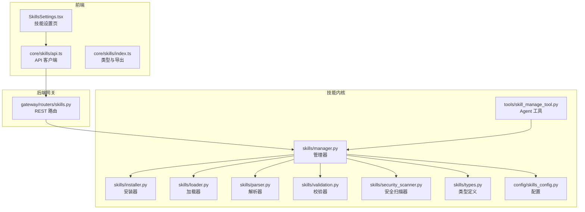
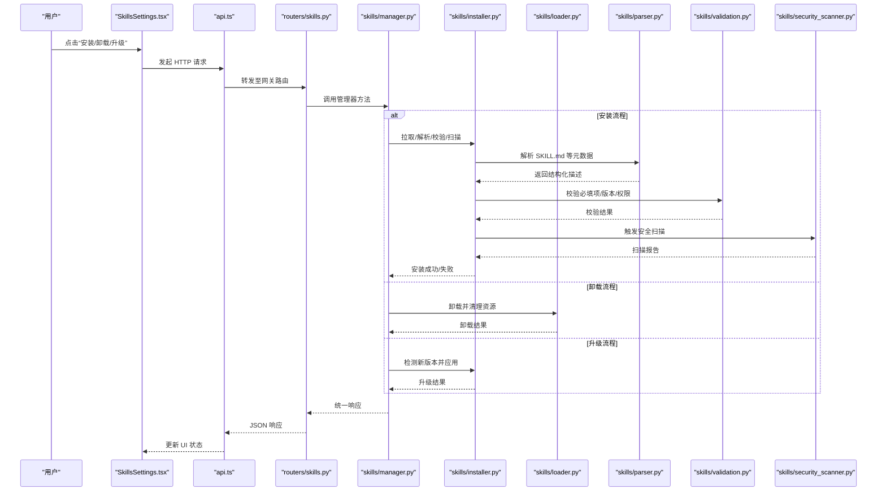
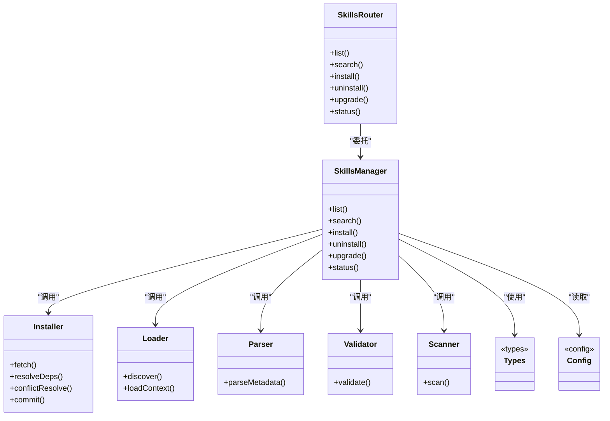

# 技能设置页面

<cite>
**本文引用的文件**
- [backend/app/gateway/routers/skills.py](file://backend/app/gateway/routers/skills.py)
- [backend/packages/harness/deerflow/skills/manager.py](file://backend/packages/harness/deerflow/skills/manager.py)
- [backend/packages/harness/deerflow/skills/installer.py](file://backend/packages/harness/deerflow/skills/installer.py)
- [backend/packages/harness/deerflow/skills/loader.py](file://backend/packages/harness/deerflow/skills/loader.py)
- [backend/packages/harness/deerflow/skills/parser.py](file://backend/packages/harness/deerflow/skills/parser.py)
- [backend/packages/harness/deerflow/skills/validation.py](file://backend/packages/harness/deerflow/skills/validation.py)
- [backend/packages/harness/deerflow/skills/security_scanner.py](file://backend/packages/harness/deerflow/skills/security_scanner.py)
- [backend/packages/harness/deerflow/skills/types.py](file://backend/packages/harness/deerflow/skills/types.py)
- [backend/packages/harness/deerflow/config/skills_config.py](file://backend/packages/harness/deerflow/config/skills_config.py)
- [backend/packages/harness/deerflow/tools/skill_manage_tool.py](file://backend/packages/harness/deerflow/tools/skill_manage_tool.py)
- [frontend/src/core/skills/index.ts](file://frontend/src/core/skills/index.ts)
- [frontend/src/core/skills/api.ts](file://frontend/src/core/skills/api.ts)
- [frontend/src/components/workspace/settings/SkillsSettings.tsx](file://frontend/src/components/workspace/settings/SkillsSettings.tsx)
</cite>

## 目录
1. [简介](#简介)
2. [项目结构](#项目结构)
3. [核心组件](#核心组件)
4. [架构总览](#架构总览)
5. [详细组件分析](#详细组件分析)
6. [依赖分析](#依赖分析)
7. [性能考虑](#性能考虑)
8. [故障排查指南](#故障排查指南)
9. [结论](#结论)
10. [附录](#附录)

## 简介
本文件面向“技能设置页面”的完整实现与使用，覆盖以下关键能力：
- 技能安装管理界面：搜索、安装、卸载、版本升级
- 权限控制体系：访问权限、执行权限与安全策略配置
- 依赖管理与冲突解决机制
- 技能市场集成与社区分享
- 开发者调试工具与测试环境
- 安全扫描与代码质量检查集成

该文档以代码为依据，提供从前端到后端的端到端说明，并给出架构图、流程图和时序图，帮助读者快速理解与落地。

## 项目结构
围绕“技能设置页面”，前后端的关键位置如下：
- 前端
  - 技能设置页 UI 与交互逻辑位于工作区设置模块中
  - 技能相关 API 客户端与类型定义集中在 core/skills
- 后端
  - 网关路由暴露技能管理接口
  - 技能管理器负责生命周期（安装、卸载、升级、列表）
  - 解析器与校验器负责 SKILL.md 等元数据解析与校验
  - 安全扫描器用于静态安全检查
  - 配置模块提供技能相关的系统级开关与策略

图表来源
- [frontend/src/components/workspace/settings/SkillsSettings.tsx](file://frontend/src/components/workspace/settings/SkillsSettings.tsx)
- [frontend/src/core/skills/api.ts](file://frontend/src/core/skills/api.ts)
- [frontend/src/core/skills/index.ts](file://frontend/src/core/skills/index.ts)
- [backend/app/gateway/routers/skills.py](file://backend/app/gateway/routers/skills.py)
- [backend/packages/harness/deerflow/skills/manager.py](file://backend/packages/harness/deerflow/skills/manager.py)
- [backend/packages/harness/deerflow/skills/installer.py](file://backend/packages/harness/deerflow/skills/installer.py)
- [backend/packages/harness/deerflow/skills/loader.py](file://backend/packages/harness/deerflow/skills/loader.py)
- [backend/packages/harness/deerflow/skills/parser.py](file://backend/packages/harness/deerflow/skills/parser.py)
- [backend/packages/harness/deerflow/skills/validation.py](file://backend/packages/harness/deerflow/skills/validation.py)
- [backend/packages/harness/deerflow/skills/security_scanner.py](file://backend/packages/harness/deerflow/skills/security_scanner.py)
- [backend/packages/harness/deerflow/skills/types.py](file://backend/packages/harness/deerflow/skills/types.py)
- [backend/packages/harness/deerflow/config/skills_config.py](file://backend/packages/harness/deerflow/config/skills_config.py)
- [backend/packages/harness/deerflow/tools/skill_manage_tool.py](file://backend/packages/harness/deerflow/tools/skill_manage_tool.py)

章节来源
- [backend/app/gateway/routers/skills.py](file://backend/app/gateway/routers/skills.py)
- [backend/packages/harness/deerflow/skills/manager.py](file://backend/packages/harness/deerflow/skills/manager.py)
- [backend/packages/harness/deerflow/skills/installer.py](file://backend/packages/harness/deerflow/skills/installer.py)
- [backend/packages/harness/deerflow/skills/loader.py](file://backend/packages/harness/deerflow/skills/loader.py)
- [backend/packages/harness/deerflow/skills/parser.py](file://backend/packages/harness/deerflow/skills/parser.py)
- [backend/packages/harness/deerflow/skills/validation.py](file://backend/packages/harness/deerflow/skills/validation.py)
- [backend/packages/harness/deerflow/skills/security_scanner.py](file://backend/packages/harness/deerflow/skills/security_scanner.py)
- [backend/packages/harness/deerflow/skills/types.py](file://backend/packages/harness/deerflow/skills/types.py)
- [backend/packages/harness/deerflow/config/skills_config.py](file://backend/packages/harness/deerflow/config/skills_config.py)
- [backend/packages/harness/deerflow/tools/skill_manage_tool.py](file://backend/packages/harness/deerflow/tools/skill_manage_tool.py)
- [frontend/src/core/skills/api.ts](file://frontend/src/core/skills/api.ts)
- [frontend/src/core/skills/index.ts](file://frontend/src/core/skills/index.ts)
- [frontend/src/components/workspace/settings/SkillsSettings.tsx](file://frontend/src/components/workspace/settings/SkillsSettings.tsx)

## 核心组件
- 技能设置页（前端）
  - 展示已安装技能列表、搜索过滤、安装/卸载/升级操作入口
  - 通过 API 客户端调用后端技能管理接口
- 技能管理路由（后端）
  - 暴露 REST 接口：列出、搜索、安装、卸载、升级、详情、状态查询等
- 技能管理器（后端）
  - 协调安装器、加载器、解析器、校验器、安全扫描器完成全生命周期管理
- 安装器（后端）
  - 拉取远程仓库或本地包、解析依赖、处理冲突、落盘与注册
- 加载器/解析器/校验器（后端）
  - 读取 SKILL.md 等元数据，校验必填字段、版本语义、权限声明等
- 安全扫描器（后端）
  - 对脚本与依赖进行静态检查，阻断高风险行为
- 配置（后端）
  - 提供技能仓库源、沙箱策略、权限白名单、扫描阈值等
- Agent 工具（后端）
  - 为智能体提供可编排的技能管理能力（如自动安装/升级）

章节来源
- [frontend/src/components/workspace/settings/SkillsSettings.tsx](file://frontend/src/components/workspace/settings/SkillsSettings.tsx)
- [frontend/src/core/skills/api.ts](file://frontend/src/core/skills/api.ts)
- [frontend/src/core/skills/index.ts](file://frontend/src/core/skills/index.ts)
- [backend/app/gateway/routers/skills.py](file://backend/app/gateway/routers/skills.py)
- [backend/packages/harness/deerflow/skills/manager.py](file://backend/packages/harness/deerflow/skills/manager.py)
- [backend/packages/harness/deerflow/skills/installer.py](file://backend/packages/harness/deerflow/skills/installer.py)
- [backend/packages/harness/deerflow/skills/loader.py](file://backend/packages/harness/deerflow/skills/loader.py)
- [backend/packages/harness/deerflow/skills/parser.py](file://backend/packages/harness/deerflow/skills/parser.py)
- [backend/packages/harness/deerflow/skills/validation.py](file://backend/packages/harness/deerflow/skills/validation.py)
- [backend/packages/harness/deerflow/skills/security_scanner.py](file://backend/packages/harness/deerflow/skills/security_scanner.py)
- [backend/packages/harness/deerflow/config/skills_config.py](file://backend/packages/harness/deerflow/config/skills_config.py)
- [backend/packages/harness/deerflow/tools/skill_manage_tool.py](file://backend/packages/harness/deerflow/tools/skill_manage_tool.py)

## 架构总览
下图展示了从前端到后端的请求链路以及内部协作关系。

图表来源
- [frontend/src/components/workspace/settings/SkillsSettings.tsx](file://frontend/src/components/workspace/settings/SkillsSettings.tsx)
- [frontend/src/core/skills/api.ts](file://frontend/src/core/skills/api.ts)
- [backend/app/gateway/routers/skills.py](file://backend/app/gateway/routers/skills.py)
- [backend/packages/harness/deerflow/skills/manager.py](file://backend/packages/harness/deerflow/skills/manager.py)
- [backend/packages/harness/deerflow/skills/installer.py](file://backend/packages/harness/deerflow/skills/installer.py)
- [backend/packages/harness/deerflow/skills/loader.py](file://backend/packages/harness/deerflow/skills/loader.py)
- [backend/packages/harness/deerflow/skills/parser.py](file://backend/packages/harness/deerflow/skills/parser.py)
- [backend/packages/harness/deerflow/skills/validation.py](file://backend/packages/harness/deerflow/skills/validation.py)
- [backend/packages/harness/deerflow/skills/security_scanner.py](file://backend/packages/harness/deerflow/skills/security_scanner.py)

## 详细组件分析

### 技能安装管理界面（前端）
- 功能要点
  - 技能列表与分页展示
  - 关键词搜索与分类筛选
  - 安装/卸载/升级按钮及进度反馈
  - 错误提示与重试机制
- 交互流程
  - 用户操作触发 API 调用
  - 根据返回状态更新本地缓存与 UI
  - 支持批量操作与撤销（若后端支持）

章节来源
- [frontend/src/components/workspace/settings/SkillsSettings.tsx](file://frontend/src/components/workspace/settings/SkillsSettings.tsx)
- [frontend/src/core/skills/api.ts](file://frontend/src/core/skills/api.ts)
- [frontend/src/core/skills/index.ts](file://frontend/src/core/skills/index.ts)

### 技能管理路由（后端）
- 职责
  - 接收前端请求，参数校验，鉴权（由网关层统一处理）
  - 委派给技能管理器执行具体业务
- 典型接口
  - 列出/搜索技能
  - 安装/卸载/升级
  - 获取技能详情与状态
  - 触发安全扫描与质量检查

章节来源
- [backend/app/gateway/routers/skills.py](file://backend/app/gateway/routers/skills.py)

### 技能管理器（后端）
- 职责
  - 编排安装、卸载、升级、加载、扫描、校验等子任务
  - 维护技能注册表与版本信息
  - 聚合各组件的错误码与日志
- 关键流程
  - 安装：拉取 -> 解析 -> 校验 -> 扫描 -> 注册
  - 卸载：停止运行态 -> 清理文件/缓存 -> 注销
  - 升级：差异比较 -> 回滚策略 -> 热重载

章节来源
- [backend/packages/harness/deerflow/skills/manager.py](file://backend/packages/harness/deerflow/skills/manager.py)

### 安装器（后端）
- 职责
  - 从仓库/包源拉取技能包
  - 解析依赖清单，计算依赖树
  - 冲突检测与解决策略（锁定版本、降级、拒绝）
  - 写入目标目录并生成索引
- 冲突解决机制
  - 版本约束匹配（语义化版本）
  - 最小兼容集选择
  - 冲突告警与人工确认

章节来源
- [backend/packages/harness/deerflow/skills/installer.py](file://backend/packages/harness/deerflow/skills/installer.py)

### 加载器/解析器/校验器（后端）
- 加载器
  - 发现已安装技能，构建运行时上下文
- 解析器
  - 解析 SKILL.md 等元数据，提取名称、版本、描述、权限、依赖等
- 校验器
  - 校验必填字段、格式、版本合法性、权限范围合理性

章节来源
- [backend/packages/harness/deerflow/skills/loader.py](file://backend/packages/harness/deerflow/skills/loader.py)
- [backend/packages/harness/deerflow/skills/parser.py](file://backend/packages/harness/deerflow/skills/parser.py)
- [backend/packages/harness/deerflow/skills/validation.py](file://backend/packages/harness/deerflow/skills/validation.py)

### 安全扫描器（后端）
- 职责
  - 对脚本、模板、依赖进行静态分析
  - 识别高危模式（如任意命令执行、网络外联、敏感路径访问）
  - 输出风险等级与建议修复方案
- 策略
  - 可配置阈值与规则集
  - 阻断高风险技能安装/升级

章节来源
- [backend/packages/harness/deerflow/skills/security_scanner.py](file://backend/packages/harness/deerflow/skills/security_scanner.py)

### 类型与配置（后端）
- 类型定义
  - 技能元数据模型、权限模型、依赖模型、安装状态等
- 配置项
  - 技能仓库源、默认沙箱策略、权限白名单、扫描规则开关、最大并发安装数等

章节来源
- [backend/packages/harness/deerflow/skills/types.py](file://backend/packages/harness/deerflow/skills/types.py)
- [backend/packages/harness/deerflow/config/skills_config.py](file://backend/packages/harness/deerflow/config/skills_config.py)

### Agent 工具（后端）
- 职责
  - 将技能管理能力暴露为工具，供智能体在对话/任务中调用
  - 支持自动化安装、升级、查询状态等操作
- 适用场景
  - 自助式运维、按需扩展能力、流水线集成

章节来源
- [backend/packages/harness/deerflow/tools/skill_manage_tool.py](file://backend/packages/harness/deerflow/tools/skill_manage_tool.py)

## 依赖分析
- 组件耦合
  - 路由层仅依赖管理器，保持薄封装
  - 管理器组合多个子模块，职责清晰
  - 安装器强依赖解析器与校验器，形成安装前校验链
- 外部依赖
  - 包源/仓库服务（HTTP/SSH）
  - 文件系统（落盘与索引）
  - 可选：沙箱执行环境（隔离运行）

图表来源
- [backend/app/gateway/routers/skills.py](file://backend/app/gateway/routers/skills.py)
- [backend/packages/harness/deerflow/skills/manager.py](file://backend/packages/harness/deerflow/skills/manager.py)
- [backend/packages/harness/deerflow/skills/installer.py](file://backend/packages/harness/deerflow/skills/installer.py)
- [backend/packages/harness/deerflow/skills/loader.py](file://backend/packages/harness/deerflow/skills/loader.py)
- [backend/packages/harness/deerflow/skills/parser.py](file://backend/packages/harness/deerflow/skills/parser.py)
- [backend/packages/harness/deerflow/skills/validation.py](file://backend/packages/harness/deerflow/skills/validation.py)
- [backend/packages/harness/deerflow/skills/security_scanner.py](file://backend/packages/harness/deerflow/skills/security_scanner.py)
- [backend/packages/harness/deerflow/skills/types.py](file://backend/packages/harness/deerflow/skills/types.py)
- [backend/packages/harness/deerflow/config/skills_config.py](file://backend/packages/harness/deerflow/config/skills_config.py)

## 性能考虑
- 列表与搜索
  - 建议启用索引与分页，避免一次性加载全部技能
- 安装/升级
  - 并行拉取与去重依赖，限制并发度
  - 增量升级与差异对比，减少磁盘 IO
- 安全扫描
  - 异步扫描与超时保护，避免阻塞主流程
- 缓存
  - 缓存已解析的元数据与扫描结果，缩短二次访问时延

[本节为通用指导，不直接分析具体文件]

## 故障排查指南
- 常见问题
  - 安装失败：检查仓库连通性、依赖解析失败、校验失败、扫描阻断
  - 卸载失败：检查进程占用、文件锁、权限不足
  - 升级失败：检查版本兼容性、回滚失败、资源未释放
- 定位步骤
  - 查看网关路由日志与错误码
  - 检查管理器与各子模块的中间日志
  - 核对 SKILL.md 元数据是否符合校验规则
  - 审查安全扫描报告，按建议修复后再试
- 恢复策略
  - 保留历史版本快照，支持一键回滚
  - 提供“只读模式”临时降级，保障核心功能可用

章节来源
- [backend/app/gateway/routers/skills.py](file://backend/app/gateway/routers/skills.py)
- [backend/packages/harness/deerflow/skills/manager.py](file://backend/packages/harness/deerflow/skills/manager.py)
- [backend/packages/harness/deerflow/skills/installer.py](file://backend/packages/harness/deerflow/skills/installer.py)
- [backend/packages/harness/deerflow/skills/validation.py](file://backend/packages/harness/deerflow/skills/validation.py)
- [backend/packages/harness/deerflow/skills/security_scanner.py](file://backend/packages/harness/deerflow/skills/security_scanner.py)

## 结论
技能设置页面通过前后端协同，实现了完整的技能生命周期管理与安全治理。借助清晰的组件分工与可扩展的配置策略，既能满足企业级安全合规要求，也能兼顾开发者的易用性与效率。建议在后续迭代中持续完善：
- 更丰富的搜索与推荐能力
- 更细粒度的权限与审计
- 更完善的回滚与灰度发布机制
- 更强的社区生态与审核流程

[本节为总结性内容，不直接分析具体文件]

## 附录

### 权限控制系统（访问权限、执行权限、安全策略）
- 访问权限
  - 基于角色/组织的可见性控制，决定哪些用户能看到与操作某技能
- 执行权限
  - 沙箱隔离、网络/文件系统/命令执行白名单
  - 动态授权与最小权限原则
- 安全策略
  - 扫描阈值、阻断规则、审批流
  - 强制签名与来源可信校验

章节来源
- [backend/packages/harness/deerflow/config/skills_config.py](file://backend/packages/harness/deerflow/config/skills_config.py)
- [backend/packages/harness/deerflow/skills/security_scanner.py](file://backend/packages/harness/deerflow/skills/security_scanner.py)
- [backend/packages/harness/deerflow/skills/validation.py](file://backend/packages/harness/deerflow/skills/validation.py)

### 依赖管理与冲突解决机制
- 依赖声明与解析
  - 基于 SKILL.md 中的依赖段，构建依赖图
- 冲突检测与解决
  - 版本约束求解、降级策略、冲突告警
- 一致性保证
  - 锁定依赖版本，确保多实例一致

章节来源
- [backend/packages/harness/deerflow/skills/installer.py](file://backend/packages/harness/deerflow/skills/installer.py)
- [backend/packages/harness/deerflow/skills/parser.py](file://backend/packages/harness/deerflow/skills/parser.py)
- [backend/packages/harness/deerflow/skills/types.py](file://backend/packages/harness/deerflow/skills/types.py)

### 技能市场集成与社区分享
- 市场源配置
  - 支持多源仓库与镜像加速
- 发布与审核
  - 版本标签、变更日志、评分与评论
- 分发与订阅
  - 订阅通知、自动升级、灰度发布

章节来源
- [backend/packages/harness/deerflow/config/skills_config.py](file://backend/packages/harness/deerflow/config/skills_config.py)
- [backend/packages/harness/deerflow/skills/installer.py](file://backend/packages/harness/deerflow/skills/installer.py)

### 开发者调试工具与测试环境
- 本地调试
  - 本地仓库源、模拟安装/卸载、断点调试
- 测试套件
  - 单元测试与集成测试覆盖安装、解析、校验、扫描
- 可视化
  - 依赖图、扫描报告、安装日志

章节来源
- [backend/packages/harness/deerflow/skills/installer.py](file://backend/packages/harness/deerflow/skills/installer.py)
- [backend/packages/harness/deerflow/skills/security_scanner.py](file://backend/packages/harness/deerflow/skills/security_scanner.py)

### 安全扫描与代码质量检查集成
- 静态扫描
  - 危险函数、硬编码密钥、越权访问
- 依赖漏洞
  - 已知 CVE 与许可证合规
- 质量门禁
  - 阻断高风险变更，强制修复后方可安装/升级

章节来源
- [backend/packages/harness/deerflow/skills/security_scanner.py](file://backend/packages/harness/deerflow/skills/security_scanner.py)
- [backend/packages/harness/deerflow/skills/validation.py](file://backend/packages/harness/deerflow/skills/validation.py)