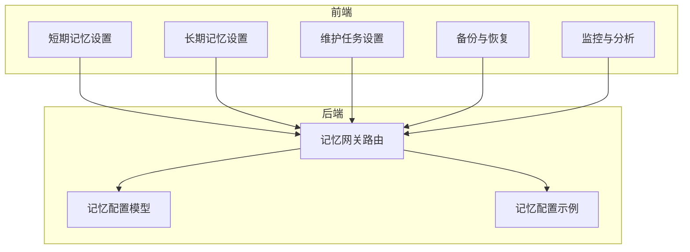
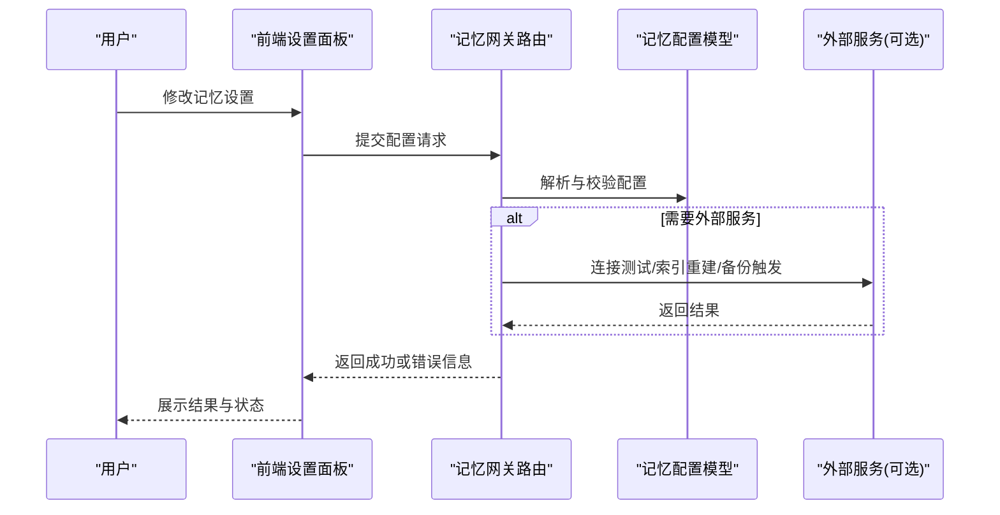
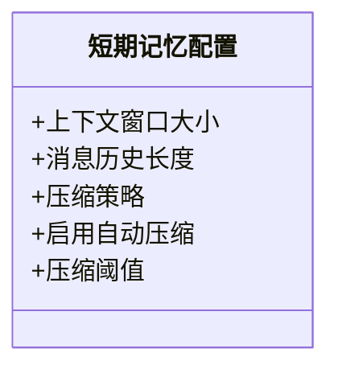
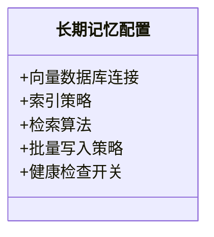
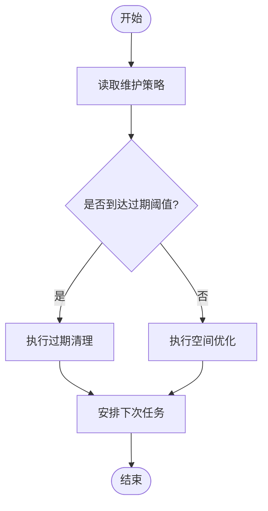
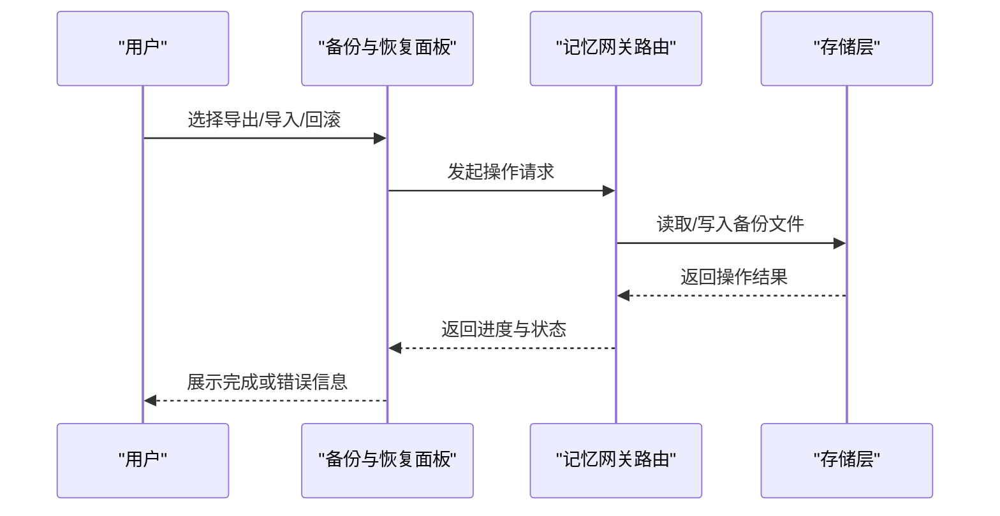
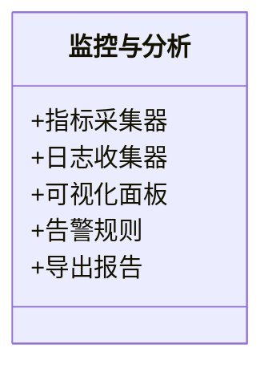
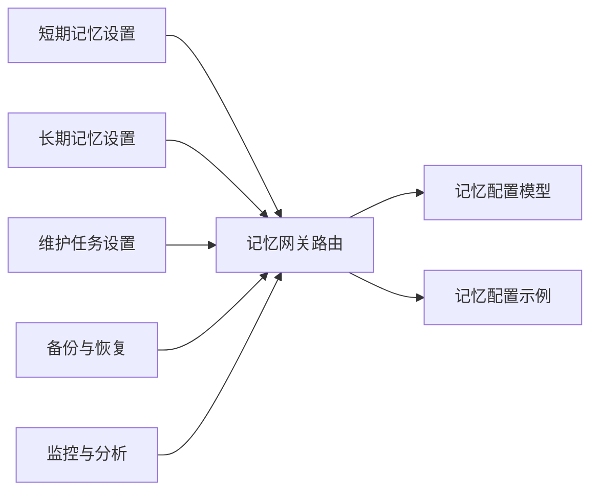

# 记忆设置页面

<cite>
**本文引用的文件**
- [backend/app/gateway/routers/memory.py](file://backend/app/gateway/routers/memory.py)
- [backend/packages/harness/deerflow/config/memory_config.py](file://backend/packages/harness/deerflow/config/memory_config.py)
- [backend/docs/MEMORY_SETTINGS_REVIEW.md](file://backend/docs/MEMORY_SETTINGS_REVIEW.md)
- [backend/docs/memory-settings-sample.json](file://backend/docs/memory-settings-sample.json)
- [frontend/src/components/workspace/settings/short-term-memory.tsx](file://frontend/src/components/workspace/settings/short-term-memory.tsx)
- [frontend/src/components/workspace/settings/long-term-memory.tsx](file://frontend/src/components/workspace/settings/long-term-memory.tsx)
- [frontend/src/components/workspace/settings/memory-maintenance.tsx](file://frontend/src/components/workspace/settings/memory-maintenance.tsx)
- [frontend/src/components/workspace/settings/memory-backup-restore.tsx](file://frontend/src/components/workspace/settings/memory-backup-restore.tsx)
- [frontend/src/components/workspace/settings/memory-monitoring.tsx](file://frontend/src/components/workspace/settings/memory-monitoring.tsx)
</cite>

## 目录
1. [简介](#简介)
2. [项目结构](#项目结构)
3. [核心组件](#核心组件)
4. [架构总览](#架构总览)
5. [详细组件分析](#详细组件分析)
6. [依赖关系分析](#依赖关系分析)
7. [性能考量](#性能考量)
8. [故障排查指南](#故障排查指南)
9. [结论](#结论)
10. [附录](#附录)

## 简介
本文件面向“记忆设置页面”的完整文档，覆盖短期记忆配置、长期记忆存储、清理与维护任务、备份与恢复、以及监控与分析工具集成。目标是帮助开发者与运维人员理解并正确配置记忆系统，确保在对话上下文管理、向量检索、数据生命周期管理与可观测性方面达到最佳实践。

## 项目结构
记忆设置功能由前后端协同实现：
- 前端提供用户界面，包含短期记忆、长期记忆、维护任务、备份恢复、监控等设置面板。
- 后端通过网关路由暴露记忆相关接口，并提供统一的配置模型与示例。

图表来源
- [backend/app/gateway/routers/memory.py](file://backend/app/gateway/routers/memory.py)
- [backend/packages/harness/deerflow/config/memory_config.py](file://backend/packages/harness/deerflow/config/memory_config.py)
- [backend/docs/memory-settings-sample.json](file://backend/docs/memory-settings-sample.json)
- [frontend/src/components/workspace/settings/short-term-memory.tsx](file://frontend/src/components/workspace/settings/short-term-memory.tsx)
- [frontend/src/components/workspace/settings/long-term-memory.tsx](file://frontend/src/components/workspace/settings/long-term-memory.tsx)
- [frontend/src/components/workspace/settings/memory-maintenance.tsx](file://frontend/src/components/workspace/settings/memory-maintenance.tsx)
- [frontend/src/components/workspace/settings/memory-backup-restore.tsx](file://frontend/src/components/workspace/settings/memory-backup-restore.tsx)
- [frontend/src/components/workspace/settings/memory-monitoring.tsx](file://frontend/src/components/workspace/settings/memory-monitoring.tsx)

章节来源
- [backend/app/gateway/routers/memory.py](file://backend/app/gateway/routers/memory.py)
- [backend/packages/harness/deerflow/config/memory_config.py](file://backend/packages/harness/deerflow/config/memory_config.py)
- [backend/docs/memory-settings-sample.json](file://backend/docs/memory-settings-sample.json)
- [frontend/src/components/workspace/settings/short-term-memory.tsx](file://frontend/src/components/workspace/settings/short-term-memory.tsx)
- [frontend/src/components/workspace/settings/long-term-memory.tsx](file://frontend/src/components/workspace/settings/long-term-memory.tsx)
- [frontend/src/components/workspace/settings/memory-maintenance.tsx](file://frontend/src/components/workspace/settings/memory-maintenance.tsx)
- [frontend/src/components/workspace/settings/memory-backup-restore.tsx](file://frontend/src/components/workspace/settings/memory-backup-restore.tsx)
- [frontend/src/components/workspace/settings/memory-monitoring.tsx](file://frontend/src/components/workspace/settings/memory-monitoring.tsx)

## 核心组件
- 短期记忆配置：控制上下文窗口大小、消息历史长度、压缩策略等，直接影响对话上下文的保留与裁剪行为。
- 长期记忆存储：配置向量数据库连接、索引策略、检索算法选择，决定持久化记忆的存储与召回质量。
- 清理与维护任务：定义过期数据处理、存储空间优化、周期性维护策略，保障系统稳定与资源可控。
- 备份与恢复：支持记忆数据的导出、导入与版本化管理，便于迁移与回滚。
- 监控与分析：集成指标采集、日志追踪与可视化面板，辅助定位性能瓶颈与异常。

章节来源
- [backend/docs/MEMORY_SETTINGS_REVIEW.md](file://backend/docs/MEMORY_SETTINGS_REVIEW.md)
- [backend/packages/harness/deerflow/config/memory_config.py](file://backend/packages/harness/deerflow/config/memory_config.py)
- [backend/docs/memory-settings-sample.json](file://backend/docs/memory-settings-sample.json)
- [frontend/src/components/workspace/settings/short-term-memory.tsx](file://frontend/src/components/workspace/settings/short-term-memory.tsx)
- [frontend/src/components/workspace/settings/long-term-memory.tsx](file://frontend/src/components/workspace/settings/long-term-memory.tsx)
- [frontend/src/components/workspace/settings/memory-maintenance.tsx](file://frontend/src/components/workspace/settings/memory-maintenance.tsx)
- [frontend/src/components/workspace/settings/memory-backup-restore.tsx](file://frontend/src/components/workspace/settings/memory-backup-restore.tsx)
- [frontend/src/components/workspace/settings/memory-monitoring.tsx](file://frontend/src/components/workspace/settings/memory-monitoring.tsx)

## 架构总览
记忆设置页面的端到端流程如下：用户在各个设置面板中调整参数并提交；前端调用后端记忆网关路由进行校验与持久化；后端基于统一配置模型处理不同子系统的配置项（短期、长期、维护、备份、监控）。

图表来源
- [backend/app/gateway/routers/memory.py](file://backend/app/gateway/routers/memory.py)
- [backend/packages/harness/deerflow/config/memory_config.py](file://backend/packages/harness/deerflow/config/memory_config.py)

## 详细组件分析

### 短期记忆配置
短期记忆关注对话上下文的管理，包括：
- 上下文窗口大小：限制单次推理可用的最大上下文长度，影响响应延迟与成本。
- 消息历史长度：控制会话内保留的消息数量，平衡连贯性与资源占用。
- 记忆压缩策略：对历史消息进行摘要或去重，减少冗余，提升检索效率。

图表来源
- [frontend/src/components/workspace/settings/short-term-memory.tsx](file://frontend/src/components/workspace/settings/short-term-memory.tsx)
- [backend/packages/harness/deerflow/config/memory_config.py](file://backend/packages/harness/deerflow/config/memory_config.py)

章节来源
- [frontend/src/components/workspace/settings/short-term-memory.tsx](file://frontend/src/components/workspace/settings/short-term-memory.tsx)
- [backend/packages/harness/deerflow/config/memory_config.py](file://backend/packages/harness/deerflow/config/memory_config.py)

### 长期记忆存储配置
长期记忆涉及向量数据库的连接与检索：
- 连接配置：地址、认证、超时、重试等。
- 索引策略：分片、维度、相似度度量、更新频率。
- 检索算法：Top-K、过滤条件、混合检索（关键词+向量）等。

图表来源
- [frontend/src/components/workspace/settings/long-term-memory.tsx](file://frontend/src/components/workspace/settings/long-term-memory.tsx)
- [backend/packages/harness/deerflow/config/memory_config.py](file://backend/packages/harness/deerflow/config/memory_config.py)

章节来源
- [frontend/src/components/workspace/settings/long-term-memory.tsx](file://frontend/src/components/workspace/settings/long-term-memory.tsx)
- [backend/packages/harness/deerflow/config/memory_config.py](file://backend/packages/harness/deerflow/config/memory_config.py)

### 清理与维护任务配置
维护任务负责数据生命周期与空间优化：
- 过期数据处理：按时间或访问频率淘汰旧记录。
- 存储空间优化：压缩、去重、归档冷数据。
- 调度策略：定时任务、触发条件、失败重试与告警。

图表来源
- [frontend/src/components/workspace/settings/memory-maintenance.tsx](file://frontend/src/components/workspace/settings/memory-maintenance.tsx)
- [backend/packages/harness/deerflow/config/memory_config.py](file://backend/packages/harness/deerflow/config/memory_config.py)

章节来源
- [frontend/src/components/workspace/settings/memory-maintenance.tsx](file://frontend/src/components/workspace/settings/memory-maintenance.tsx)
- [backend/packages/harness/deerflow/config/memory_config.py](file://backend/packages/harness/deerflow/config/memory_config.py)

### 备份与恢复功能
备份与恢复用于数据安全与迁移：
- 导出：全量或增量导出记忆数据。
- 导入：校验格式与版本后进行合并或覆盖。
- 版本管理：保留历史快照，支持快速回滚。

图表来源
- [frontend/src/components/workspace/settings/memory-backup-restore.tsx](file://frontend/src/components/workspace/settings/memory-backup-restore.tsx)
- [backend/app/gateway/routers/memory.py](file://backend/app/gateway/routers/memory.py)

章节来源
- [frontend/src/components/workspace/settings/memory-backup-restore.tsx](file://frontend/src/components/workspace/settings/memory-backup-restore.tsx)
- [backend/app/gateway/routers/memory.py](file://backend/app/gateway/routers/memory.py)

### 监控与分析工具集成
监控与分析用于评估记忆系统性能与健康度：
- 指标采集：查询延迟、命中率、内存占用、索引构建耗时。
- 日志追踪：关键操作的链路ID与上下文标签。
- 可视化面板：趋势图、告警阈值、慢查询分析。

图表来源
- [frontend/src/components/workspace/settings/memory-monitoring.tsx](file://frontend/src/components/workspace/settings/memory-monitoring.tsx)
- [backend/app/gateway/routers/memory.py](file://backend/app/gateway/routers/memory.py)

章节来源
- [frontend/src/components/workspace/settings/memory-monitoring.tsx](file://frontend/src/components/workspace/settings/memory-monitoring.tsx)
- [backend/app/gateway/routers/memory.py](file://backend/app/gateway/routers/memory.py)

## 依赖关系分析
记忆设置的前端组件均依赖后端网关路由提供的接口，并通过统一配置模型进行参数校验与持久化。

图表来源
- [backend/app/gateway/routers/memory.py](file://backend/app/gateway/routers/memory.py)
- [backend/packages/harness/deerflow/config/memory_config.py](file://backend/packages/harness/deerflow/config/memory_config.py)
- [backend/docs/memory-settings-sample.json](file://backend/docs/memory-settings-sample.json)
- [frontend/src/components/workspace/settings/short-term-memory.tsx](file://frontend/src/components/workspace/settings/short-term-memory.tsx)
- [frontend/src/components/workspace/settings/long-term-memory.tsx](file://frontend/src/components/workspace/settings/long-term-memory.tsx)
- [frontend/src/components/workspace/settings/memory-maintenance.tsx](file://frontend/src/components/workspace/settings/memory-maintenance.tsx)
- [frontend/src/components/workspace/settings/memory-backup-restore.tsx](file://frontend/src/components/workspace/settings/memory-backup-restore.tsx)
- [frontend/src/components/workspace/settings/memory-monitoring.tsx](file://frontend/src/components/workspace/settings/memory-monitoring.tsx)

章节来源
- [backend/app/gateway/routers/memory.py](file://backend/app/gateway/routers/memory.py)
- [backend/packages/harness/deerflow/config/memory_config.py](file://backend/packages/harness/deerflow/config/memory_config.py)
- [backend/docs/memory-settings-sample.json](file://backend/docs/memory-settings-sample.json)

## 性能考量
- 短期记忆：合理设置上下文窗口与历史长度，避免过大导致延迟与成本上升；启用压缩策略以降低冗余。
- 长期记忆：选择合适的相似度度量与Top-K值，结合过滤条件提高召回精度；批量写入与异步索引构建降低阻塞。
- 维护任务：错峰执行清理与优化任务，避免高峰期影响在线服务；为长时间任务增加重试与断点续传。
- 备份与恢复：采用增量备份与校验和验证，减少网络与IO压力；大文件分块传输与并发下载提升速度。
- 监控与分析：采集关键指标并设置阈值告警；定期生成报告以发现潜在瓶颈。

[本节为通用指导，不直接分析具体文件]

## 故障排查指南
- 连接问题：检查向量数据库连接参数与网络可达性，确认认证信息与超时设置。
- 索引异常：查看索引构建日志，确认数据维度与类型匹配；必要时重建索引。
- 清理失败：核对过期策略与权限，检查磁盘空间与锁竞争；查看任务调度日志。
- 备份失败：验证文件格式与版本兼容性；检查目标存储路径与权限。
- 监控缺失：确认指标采集器与日志收集器已启动；检查可视化面板的数据源配置。

章节来源
- [backend/app/gateway/routers/memory.py](file://backend/app/gateway/routers/memory.py)
- [backend/packages/harness/deerflow/config/memory_config.py](file://backend/packages/harness/deerflow/config/memory_config.py)

## 结论
记忆设置页面通过前后端协作，提供了从短期上下文到长期向量存储的全链路配置能力，并结合维护任务、备份恢复与监控分析，形成完整的记忆生命周期管理方案。建议在生产环境中根据业务负载与数据规模，持续调优各项参数，并建立完善的监控与告警机制。

[本节为总结性内容，不直接分析具体文件]

## 附录
- 参考文档：记忆设置评审与示例配置，可用于对照实际部署的参数范围与最佳实践。

章节来源
- [backend/docs/MEMORY_SETTINGS_REVIEW.md](file://backend/docs/MEMORY_SETTINGS_REVIEW.md)
- [backend/docs/memory-settings-sample.json](file://backend/docs/memory-settings-sample.json)